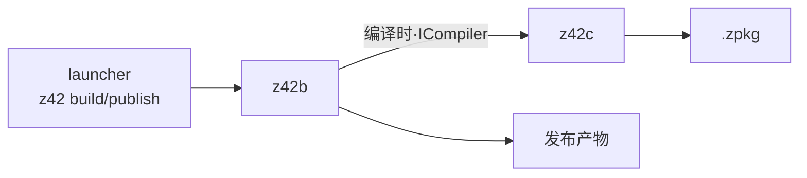
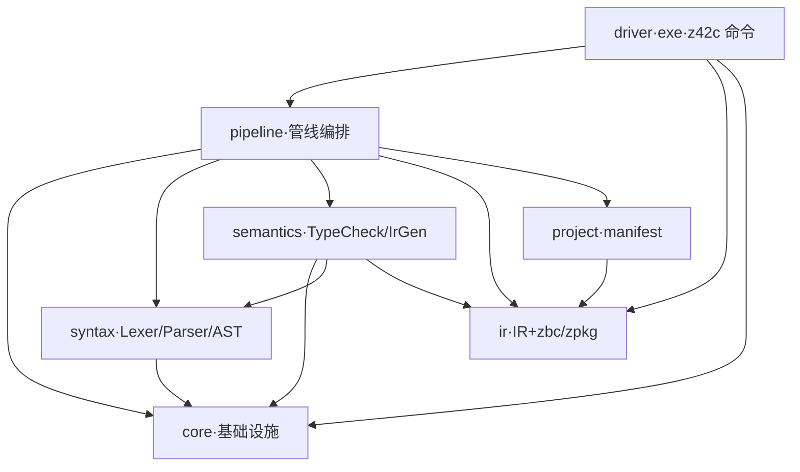

# 架构总览

> **页型**: 机制页 ｜ **状态**: ✅ 已实现 ｜ **代码**: `src/compiler/`（z42c）· `src/toolchain/builder/` + `src/libraries/z42.build/`（z42b）
> **相关**: [源代码编译流程](source-compile.md) · [工程模型、依赖解析与工作区编译](project-model.md) · [项目构建与发布编排](project-build.md) ｜ **对齐**: 2026-07-17

## 两个角色

- **z42c** — 编译器本体，负责将 `.z42` 源码编译为 `.zpkg`
- **z42b** — 构建编排器，负责将项目从编译推进至发布（裁剪、原生构建、打包）；其中的编译环节经 `ICompiler` 接口在同一进程内交由 z42c 完成，不另起编译器子进程



## z42c 的组成

z42c 本身是一个 z42 工作区，按依赖顺序分成七个包（`src/compiler/z42c.*`）；`driver` 是唯一的可执行程序，也就是 `z42c` 命令。依赖单向无环，各包细节见后续各章。



## z42b 的构建阶段

z42b 位于 `src/toolchain/builder/`（`z42b.zpkg`），由 launcher 分发（`build` / `publish` / `run --rid` …），驱动一条固定的构建流水线（框架位于 `src/libraries/z42.build/`），平台相关逻辑由各 workload 以 `: WorkloadBase` 注入：

```
Resolve → Compile → Trim → Assets → Configure → GenerateProject → NativeBuild → Package
```

## 两条主数据流

**A · 源代码编译**（z42c 内部，详见[源代码编译流程](source-compile.md)）


**B · 项目构建编排**（z42b 的构建阶段，详见[项目构建与发布编排](project-build.md)）：即上文的构建流水线，其中 **Compile 阶段**经 `ICompiler` 接口调用流程 A 完成编译、产出 zpkg，随后继续裁剪与打包等阶段。

## 迭代计划

- z42.build 框架接口先行，部分实现体为桩，按 spec-first 落地。
- z42b CLI：`test` / `bench` / `clean` / `publish` 已可用；`new` / `build` / `export` 待接入。
- `ICompiler` 拟抽为中立微库，让 z42c 与 z42b 都只依赖它。索引见 `docs/roadmap.md` Deferred Backlog。
