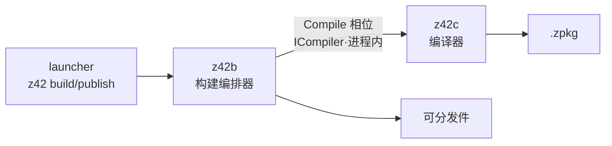
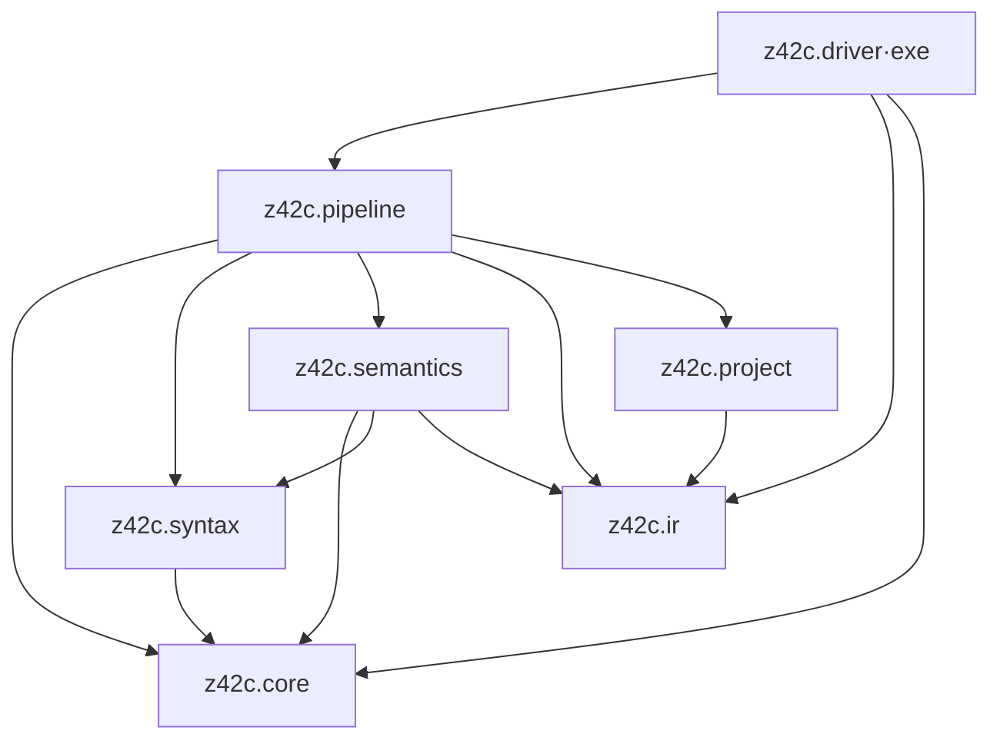
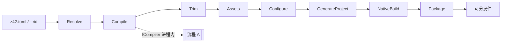

# 架构总览

> **页型**: 机制页 ｜ **状态**: ✅ 已实现 ｜ **代码**: `src/compiler/`（z42c）· `src/toolchain/builder/` + `src/libraries/z42.build/`（z42b）
> **相关**: [源代码编译流程](source-compile.md) · [工作区编译](workspace-build.md) · [项目构建与发布编排](project-build.md) ｜ **对齐**: 2026-07-17

## 概述

z42 的"编译相关"分两个角色：

| 角色 | 是什么 | 产出 |
|------|--------|------|
| **z42c** | 编译器本体：把 `.z42` 源码编成包 | `.zbc` / `.zpkg` |
| **z42b** | 构建编排器：把一个 z42 项目从"编译"走到"发布" | 可分发件（apphost / 平台包） |

分工一句话：**z42c 只管"源码 → 包"的纯编译；z42b 管平台裁剪、资源、原生构建、打包发布这些编译之外的事，中间"编译"这一步回头调 z42c。** 二者进程内调用，不 fork 子进程。



## z42c：七子包

z42c 自身是一个 z42 工作区，按依赖序分七个子包（`src/compiler/z42c.*`）。core 与 ir 无依赖、做地基；driver 是唯一可执行体（exe），即用户敲的 `z42c` 命令。

| 子包 → zpkg | kind | 职责 | 依赖 |
|------|:----:|------|------|
| `z42c.core` | lib | Span / Diagnostic / Features 等基础设施 | — |
| `z42c.ir` | lib | IR 模型 + zbc/zpkg 二进制格式 + 项目类型 | — |
| `z42c.syntax` | lib | Lexer + Parser + AST | core |
| `z42c.project` | lib | manifest 读取（`z42.toml` / workspace） | ir |
| `z42c.semantics` | lib | 类型检查 + IR 生成 | core, syntax, ir |
| `z42c.pipeline` | lib | 编译管线编排（单包 / 工作区） | core, syntax, semantics, ir, project |
| `z42c.driver` | **exe** | CLI 入口（`z42c` 命令） | pipeline, ir, core |



依赖严格单向，无环。子包间依赖经 workspace 自动解析（各 manifest `[dependencies]` 声明），stdlib 自动可用。

## z42b：构建编排器

z42b 住 `src/toolchain/builder/`（编译为 `z42b.zpkg`，exe），由 launcher 的 `z42 build` / `publish` / `export` / `run --rid` / `test` 分发调用。它驱动一条**固定相位管线**（框架住 `src/libraries/z42.build/`）：

```
Resolve → Compile → Trim → Assets → Configure → GenerateProject → NativeBuild → Package
```

其中 **Compile 相位**经 `ICompiler` 接口在进程内调 z42c——与独立的 `z42c.driver` CLI 引用同一份编译实现，不 fork z42c 子进程。平台专属逻辑（iOS / Android / wasm / desktop）由各 workload 以 `: WorkloadBase` 子类注入，z42b 本体保持平台无关。

## 顶层数据流

编译相关有两条主数据流，互相衔接：

**流程 A — 源代码编译（z42c 内部，详见[第 2 章](source-compile.md)）**


**流程 B — 项目构建编排（z42b 相位，详见[第 5 章](project-build.md)）**



流程 B 的 Compile 相位就是把流程 A 接进来：z42b 装配好上下文后经 `ICompiler` 调 z42c，把项目源码编成 zpkg，再继续往下走裁剪/打包。

## 关键设计权衡

**AST 节点是 `sealed record`** — 不可变 + 值相等，便于并行分析、避免副作用；`sealed` 让模式匹配 exhaustive、不漏 case；`record` 自动合成 ctor / Equals，省样板。

**TypeChecker 不直接写 IR** — 前端（AST + imports → SemanticModel）与后端（SemanticModel → IR）经 SemanticModel 解耦。TypeCheck 是纯前端、Codegen 是后端映射，中间隔一层 Bound 树，为将来 LSP / 增量编译留接口。

**诊断用 Diagnostics 而非 Exception** — 编译错误要能恢复、一次收集多条，而非首错即抛。异常只留给编译器内部不变量被破坏这类真正的 bug（详见[第 8 章·错误码体系](error-codes.md)）。

**编排与编译进程内分离** — z42b 编排、z42c 编译，二者经 `ICompiler` 在同进程内协作。分离让 z42c 专注纯编译（可独立 CLI 使用），又避免子进程 fork 的启动开销与状态传递成本。

## 演进与迭代计划

- **z42.build 框架接口先行**：相位流程与契约（`Pipeline` / `IPipelineContext` / `ICompiler` / `WorkloadBase`）已定，部分实现体仍为桩，按 spec-first 逐步落地。
- **z42b CLI 部分 verb 待接入**：`test` / `bench` / `clean` / `publish` 已可用；`new` / `build` / `export` 待 in-process 编译器 API 接入后转为 LIVE。
- **编译接口拟抽中立微库**：`ICompiler` + 请求/结果类型计划独立成一个中立微库，让 z42c 与 z42b 都只依赖它，而非整个 build 框架。
- 具体延后条目索引见 `docs/roadmap.md` 的 Deferred Backlog。
