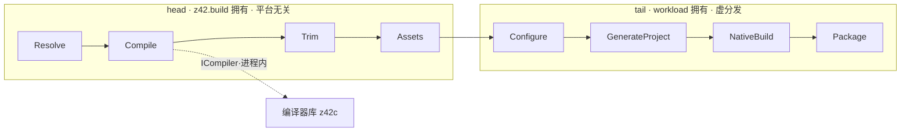

# 项目构建与发布编排（z42b）

> **页型**: 机制页 ｜ **状态**: 🟡 部分实现（框架接口先行；`test`/`bench`/`clean`/`publish` 已可用，完整 `build`/`export` 编排待接入）｜ **代码**: `src/toolchain/builder/` · `src/libraries/z42.build/`
> **相关**: [架构总览](architecture.md) · [源代码编译流程](source-compile.md) · [工程模型、依赖解析与工作区编译](project-model.md) ｜ **对齐**: 2026-07-19

## 概述

z42b 是把一个 z42 项目从**编译**推进到**发布**的构建编排器。它按一条固定的八相位管线组织工作——前半段平台无关（编译、裁剪、收集资源），后半段交由平台 workload 完成（生成工程、原生构建、打包）。管线中的"编译"这一步经 `ICompiler` 接口在进程内调编译器库，不另起 z42c 子进程。

管线流程与接口（`Pipeline` / `ICompiler` / `WorkloadBase`）已定型；head 段各相位的实现体、平台 workload 子类、以及完整 `build` / `export` 编排仍在逐步接入。



## 机制

### 八相位管线

`Pipeline.Run` 按固定顺序线性执行八个相位，顺序封闭、不新增不改序：

- **head（`z42.build` 拥有，平台无关）**：Resolve → Compile → Trim → Assets
- **tail（workload 拥有，虚分发）**：Configure → GenerateProject → NativeBuild → Package

正式进入 head 前，先调 `Workload.Preflight` 提前做平台可用性检查、fail-fast。两种模式共用这条管线、停点不同：`export` 跑到 GenerateProject 即停（只出工程），`publish` 一路跑到 Package（出可分发件）。head 段围绕 Compile / Trim / Assets 各有 Before/After hook 供项目扩展。

### ICompiler：进程内编译

Compile 相位不直接依赖 z42c，而是经注入的 `ICompiler` 接口调用编译器库——**在同一进程内**，不 fork z42c 子进程。这样编译诊断以结构化结果返回而非解析 stdout，也不要求 z42vm 在 PATH。

依赖方向遵循依赖倒置：`z42.build` 只定义 `ICompiler` 接口，由编译器库实现它，因此 z42c 依赖 z42.build（仅接口）、z42b 依赖两者，整体无环。接口两侧是纯数据载体：`CompileRequest`（源目录、产物落点、依赖 zpkg、profile、是否剥符号、是否增量）与 `CompileResult`（产物路径、可选 `.zsym` sidecar、成功标志、诊断文本）。

### workload 继承链

tail 段四个相位由 workload 承担，沿"项目 `build/` → 平台 workload → `WorkloadBase`"继承链虚分发。`WorkloadBase` 提供 no-op 默认实现，在无平台目标时兜底；各平台（desktop / ios / android / wasm）以 `: WorkloadBase` 子类覆盖相应相位注入平台逻辑。因此 z42b 本体保持平台无关，平台差异全部收敛在 workload 子类里。

### launcher 分发

z42b 编译为 `z42b.zpkg`，由 launcher 的命令分发调用：`z42 build` / `publish` / `export` / `run --rid` / `test`。标准路径下编排器直接在进程内组合 `Pipeline` 运行（零子进程、零代码生成）；仅当项目带自定义 `build/` 脚本时，才生成一次性 driver，把 `z42.build` + workload + 项目 `build/` 静态链接编译后运行。

### publish 间接依赖复制（传递闭包 colocation）

`z42 publish` 产出可分发件时，除放置 app 的入口 zpkg，还须让运行期能解析它的**间接（传递）依赖**。z42 运行期的模块搜索目录固定为 **`[app entry-zpkg 所在目录, 共享 libs/]`** 两处（`src/runtime/src/main.rs` 组装 `search_dirs`；`Z42_LIBS` 是**单**目录，不是 PATH 式多段）。因此凡是**既不在 app 入口目录、又不在 `libs/`** 的依赖，运行期都够不着。

publish 的解法（`_pubBundleProjectDeps`，`builder/core/builder_publish.z42`）：**把 app 声明依赖的传递闭包里「不属于框架」的 zpkg 复制进 app 的 payload dir（= 入口目录）**，使其自包含。对标 .NET `dotnet publish`——framework-dependent 部署里，共享框架（BCL）按名引用、不复制，应用私有包复制进 app。这里 **`libs/`（stdlib）= 框架**、其余 = 应用私有。

**两个分类判据必须分开（这是最易踩错的点）**：

| 判据 | 规则 | 为什么不能想当然 |
|------|------|------------------|
| **是否复制** | 该依赖的 zpkg **不在 shipped `libs/`** 才复制（`Z42_LIBS` 目录无同名 `.zpkg`） | **不能**用「是否 `src/libraries` 成员」判框架——launcher 声明的 `z42.workload.*` 既非 `src/libraries` 成员、也不在 `libs/`，若用成员判据会被漏拷 / 反之被误分类 |
| **是否递归穿透** | 除**真·stdlib 成员**（`src/libraries/<name>/` 存在，只依赖框架）外，**一律递归**进它的依赖 | 必须穿透「已 ship 进 `libs/`、却越界依赖非框架」的库——例如 `z42.scripting` 在 `libs/`（看似框架）却依赖 `z42c.*`（非框架）。若在 `libs/` 边界停止递归，就触达不到隐藏在其后的 `z42c.*` |

**典型闭包（z42i / REPL）**：

```text
z42.interactive (app 入口, programs/z42i/)
  └─ z42.scripting        [在 libs/ → 不复制；但递归穿透]
       ├─ z42.core/io/ir   [真·stdlib → 不复制、不递归]
       └─ z42c.core/syntax/semantics/pipeline
                           [不在 libs/ → 复制进 programs/z42i/；继续递归]
```

结果：`programs/z42i/` 自包含地拿到 `z42c.*`，运行期 `search_dirs=[programs/z42i/, libs/]` 全可解析，`z42i` 直跑与 `z42 repl` 转发均能求值。同一机制让 z42c 把 6 个兄弟库 colocate 进 `programs/z42c/`、launcher 自包含其 `z42.workload.*`——**通用，非任何组件的特例**。

> **历史坑**：早期 colocation 只跟「同一 `z42.workspace.toml` 内的成员」，跟不进跨-workspace 的传递链（`z42.interactive` 无 workspace、其依赖散落 `src/toolchain/scripting` + `src/compiler`），导致 shipped 的 z42i 求值报 `undefined Z42.Syntax.Lexer.Tokenize`。改为「按声明依赖做传递 BFS + 按 `libs/` 判框架」后根治（`fix-repl-sdk-layout`）。

依赖 toml 的跨-area 定位由 `_pubSrcRoot`（上溯到含 `libraries/`+`compiler/` 的 `src/`）+ `_pubLocateDepToml`（先直查 `libraries/`·`compiler/` 常规布局，再递归搜 `toolchain/`）完成；每个待复制 zpkg 经 `_pubEnsureBuilt` 从其 toml 的 `dist_dir` 解析（缺则现编）。

> **后续可提升为通用清单机制**：当前传递解析依赖**源 toml**（SDK 自建组件源码在手时可行）；对「只有二进制 zpkg、无源」的第三方用户 app，更彻底的做法是仿 .NET `.deps.json`——publish 生成一份显式依赖闭包清单、运行期照单加载，不再靠扫目录。见 Deferred。

## 实现

| 关注点 | 关键文件 | 状态 |
|--------|---------|:----:|
| 管线流程 | `z42.build/src/Pipeline.z42` | 接口/流程就绪，head 实现占位 |
| 编译接口 | `z42.build/src/ICompiler.z42`（含 `CompileRequest` / `CompileResult`） | 接口就绪，默认 `NoCompiler` |
| 相位上下文 | `z42.build/src/PipelineContext.z42`、`IPipelineContext.z42` | 日志/受限 fs/产物登记就绪，native 原语待接 |
| workload 基类 | `z42.build/src/WorkloadBase.z42`、`BuildHooks.z42` | 基类就绪，平台子类未落 |
| 编排核心 | `builder/core/builder.z42`、`builder_commands.z42` | PARKED（待 wire-z42b-host-build） |
| test / bench | `builder/core/builder_test.z42` | ✅ LIVE |
| publish | `builder/core/builder_publish.z42`、`builder_apphost.z42` | ✅ LIVE |
| new 脚手架 | `builder/core/builder_new.z42` | PARKED |

## 边界与限制（当前状态）

- **框架接口先行**：八相位流程与接口已定，但 head 段 Resolve / Trim / Assets 实现体为占位，Compile 默认注入 `NoCompiler`——真实编译要待 `Z42cCompiler : ICompiler` 适配落地。
- **已可用 verb**：`test` / `bench` / `clean` / `publish`（publish 产 apphost + desktop 布局，缺 zpkg 时经 z42c 现编）。
- **待接入**：完整 `build` / `export` 编排（`_orchestrate`）待 `wire-z42b-host-build` 接入进程内编译 API。
- **平台 workload 未落**：`desktop` / `ios` / `android` / `wasm` 的 `: WorkloadBase` 子类尚未实现，tail 段目前走 no-op 兜底。

## Deferred

- `ICompiler` 及配套记录抽到中立微库，使 z42c 与 z42b 同依赖该微库，编译器核心不再依赖整个 build 框架。
- 平台 workload 子类落地（desktop / ios / android / wasm）。
- head 段 Trim / Assets 实现，及 native 原语（Sign / Archive / Hash / Download / ProbeVersion）经 extern 接入。
- 自定义 `build/` 项目的一次性 driver 装配。
- **publish 依赖复制升级为显式清单（仿 .NET `.deps.json`）**：当前传递闭包解析依赖源 toml；为支持「只有二进制 zpkg、无源」的第三方用户 app，改由 zpkg 元数据（NSPC / 引用命名空间）驱动闭包解析，并生成显式依赖清单供运行期照单加载（不再扫目录）。前置：`ZpkgReader` 补「引用命名空间（deps 段）」读回能力。
- **z42.scripting 依赖的 z42c 基础能力抽象入标准库**（另一条正交路线，与「间接依赖复制」二选一或并存）：把 Lexer/Parser/PackageCompile 等抽成正式 stdlib 库（`z42.ir` 已是先例），使 z42.scripting 只依赖标准库、整条链进 `libs/`，publish 无需复制。归 `converge-z42c-onto-z42-project`；权衡是会让标准库变大。

索引见 `docs/roadmap.md` Deferred Backlog。
