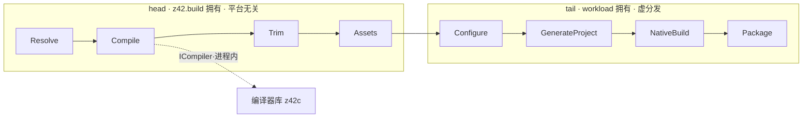

# 项目构建与发布编排（z42b）

> **页型**: 机制页 ｜ **状态**: 🟡 部分实现（框架接口先行；`test`/`bench`/`clean`/`publish` 已可用，完整 `build`/`export` 编排待接入）｜ **代码**: `src/toolchain/builder/` · `src/libraries/z42.build/`
> **相关**: [架构总览](architecture.md) · [源代码编译流程](source-compile.md) · [工程模型、依赖解析与工作区编译](project-model.md) ｜ **对齐**: 2026-07-19

## 概述

z42b 是把一个 z42 项目从**编译**推进到**发布**的构建编排器。它按一条固定的八相位管线组织工作——前半段平台无关（编译、裁剪、收集资源），后半段交由平台 workload 完成（生成工程、原生构建、打包）。管线中的"编译"这一步经 `ICompiler` 接口在进程内调编译器库，不另起 z42c 子进程。

管线流程与接口（`Pipeline` / `ICompiler` / `WorkloadBase`）已定型；head 段各相位的实现体、平台 workload 子类、以及完整 `build` / `export` 编排仍在逐步接入。

## 机制

### 八相位管线

`Pipeline.Run` 按固定顺序线性执行八个相位，顺序封闭、不新增不改序：

- **head（`z42.build` 拥有，平台无关）**：Resolve → Compile → Trim → Assets
- **tail（workload 拥有，虚分发）**：Configure → GenerateProject → NativeBuild → Package

正式进入 head 前，先调 `Workload.Preflight` 提前做平台可用性检查、fail-fast。两种模式共用这条管线、停点不同：`export` 跑到 GenerateProject 即停（只出工程），`publish` 一路跑到 Package（出可分发件）。head 段围绕 Compile / Trim / Assets 各有 Before/After hook 供项目扩展。

### ICompiler：进程内编译

Compile 相位不直接依赖 z42c，而是经注入的 `ICompiler` 接口调用编译器库——**在同一进程内**，不 fork z42c 子进程。这样编译诊断以结构化结果返回而非解析 stdout，也不要求 z42vm 在 PATH。

依赖方向遵循依赖倒置：`z42.build` 只定义 `ICompiler` 接口，由编译器库实现它，因此 z42c 依赖 z42.build（仅接口）、z42b 依赖两者，整体无环。接口两侧是纯数据载体：`CompileRequest`（源目录、产物落点、依赖 zpkg、profile、是否剥符号、是否增量）与 `CompileResult`（产物路径、可选 `.zsym` sidecar、成功标志、诊断文本）。

### workload 继承链

tail 段四个相位由 workload 承担，沿"项目 `build/` → 平台 workload → `WorkloadBase`"继承链虚分发。`WorkloadBase` 提供 no-op 默认实现，在无平台目标时兜底；各平台（desktop / ios / android / wasm）以 `: WorkloadBase` 子类覆盖相应相位注入平台逻辑。因此 z42b 本体保持平台无关，平台差异全部收敛在 workload 子类里。

### launcher 分发

z42b 编译为 `z42b.zpkg`，由 launcher 的命令分发调用：`z42 build` / `publish` / `export` / `run --rid` / `test`。标准路径下编排器直接在进程内组合 `Pipeline` 运行（零子进程、零代码生成）；仅当项目带自定义 `build/` 脚本时，才生成一次性 driver，把 `z42.build` + workload + 项目 `build/` 静态链接编译后运行。

## 实现

| 关注点 | 关键文件 | 状态 |
|--------|---------|:----:|
| 管线流程 | `z42.build/src/Pipeline.z42` | 接口/流程就绪，head 实现占位 |
| 编译接口 | `z42.build/src/ICompiler.z42`（含 `CompileRequest` / `CompileResult`） | 接口就绪，默认 `NoCompiler` |
| 相位上下文 | `z42.build/src/PipelineContext.z42`、`IPipelineContext.z42` | 日志/受限 fs/产物登记就绪，native 原语待接 |
| workload 基类 | `z42.build/src/WorkloadBase.z42`、`BuildHooks.z42` | 基类就绪，平台子类未落 |
| 编排核心 | `builder/core/builder.z42`、`builder_commands.z42` | PARKED（待 wire-z42b-host-build） |
| test / bench | `builder/core/builder_test.z42` | ✅ LIVE |
| publish | `builder/core/builder_publish.z42`、`builder_apphost.z42` | ✅ LIVE |
| new 脚手架 | `builder/core/builder_new.z42` | PARKED |

## 边界与限制（当前状态）

- **框架接口先行**：八相位流程与接口已定，但 head 段 Resolve / Trim / Assets 实现体为占位，Compile 默认注入 `NoCompiler`——真实编译要待 `Z42cCompiler : ICompiler` 适配落地。
- **已可用 verb**：`test` / `bench` / `clean` / `publish`（publish 产 apphost + desktop 布局，缺 zpkg 时经 z42c 现编）。
- **待接入**：完整 `build` / `export` 编排（`_orchestrate`）待 `wire-z42b-host-build` 接入进程内编译 API。
- **平台 workload 未落**：`desktop` / `ios` / `android` / `wasm` 的 `: WorkloadBase` 子类尚未实现，tail 段目前走 no-op 兜底。

## Deferred

- `ICompiler` 及配套记录抽到中立微库，使 z42c 与 z42b 同依赖该微库，编译器核心不再依赖整个 build 框架。
- 平台 workload 子类落地（desktop / ios / android / wasm）。
- head 段 Trim / Assets 实现，及 native 原语（Sign / Archive / Hash / Download / ProbeVersion）经 extern 接入。
- 自定义 `build/` 项目的一次性 driver 装配。

索引见 `docs/roadmap.md` Deferred Backlog。
