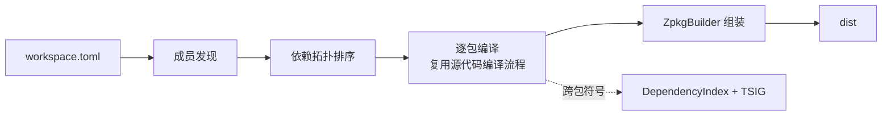

# 工程模型、依赖解析与工作区编译

> **页型**: 机制页 ｜ **状态**: ✅ 已实现 ｜ **代码**: `src/libraries/z42.project/` · `src/compiler/z42c.pipeline/` · `src/libraries/z42.ir/DependencyIndex.z42`
> **相关**: [源代码编译流程](source-compile.md) · [架构总览](architecture.md) · [zbc 字节码格式](zbc-format.md) · [zpkg 包格式](zpkg-format.md) ｜ **对齐**: 2026-07-18

## 概述

一个包由 manifest（`z42.toml`）描述；编译时它对外部包的引用经**依赖索引**与 **TSIG** 解析成跨包符号；多个包组成的工作区按依赖拓扑序逐个编译，最终组装成 dist。本章讲这三件事——从"包怎么被描述"到"依赖怎么跨包解析"，再到"工作区怎么按序编译"。



## 机制

### 工程模型（manifest）

`z42.toml` 描述单个包，核心三段：`[project]`（name / version / kind / entry / pack）、`[sources]`（include / exclude）、`[dependencies]`（依赖包名与版本）。`z42.workspace.toml` 用 `members` 声明工作区成员。

`SourceDiscovery` 按 `[sources]` 的 include/exclude 规则展开出参与编译的源文件清单，交给源代码编译流程。
`DiscoverWithExclude(projectDir, includes, excludes)` 是纯 glob 原语：先按 include 展开（`**/*.z42` 递归 /
`<prefix>/**/<suffix>` / 单层），去重 + Ordinal 排序，再逐条按 exclude glob（`<dir>/**` 前缀 / `**/<suffix>`
后缀 / 精确相对路径）过滤（另恒排除 `dist/`、`.cache/`）。

**「hooks 目录自动排除」策略在调用方（z42c `_build`），Discover 保持无策略**：若 manifest 声明
`[build] hooks = "<dir>"`，z42c 把 `<dir>/**` 并入有效 exclude（`有效 exclude = [sources].exclude ++
(<hooks>/** if [build] hooks)`），使 hooks 源不进 app zpkg。动机：hooks 由 z42b 经 `[build] hooks` **单独
编译**（`ModuleLoader.Load` 加载 `ProjectHooks : Z42.Build.BuildHooks`）；若被 app 的 `**/*.z42` glob 一起
扫进 app zpkg，会多一个**跨包死类**（base `BuildHooks` 非本包构建期依赖 → own-only + 跨包基类 → 运行期
vtable fixup 触发假警报）。这条策略经 workspace 两条构建路径的共同委托点 `_build` 生效，覆盖单包 / workspace
成员 / path 依赖。

**两条编译入口都排除 hooks（fix-hooks-source-scan 阶段4.2）**：上述有效 exclude 的组装在两处对称存在，
使无论走哪条路径 hooks 源都不进 app zpkg：

- **z42c.driver `Main._build`**（`z42c build <toml>` 直编，阶段2）：直接从 `pm.Sources` / `pm.Build` 组装。
- **z42b in-process `Pipeline.Compile`**（`z42b build`/`run`/`export`，头相位经 `ICompiler` 在进程内调编译器库）：
  从 `ctx.Manifest` 组装同样的有效 exclude，填入 `CompileRequest.Excludes`；`Z42cCompiler.Compile` 读
  `req.Excludes` 传给 `DiscoverWithExclude`。字段先行 / 读取晚一 nightly（bootstrap-seed 轴②：z42c 源引用
  stdlib 新字段须待其随 nightly 发布），故拆 4.1（`CompileRequest` 加 `Excludes` 字段）+ 4.2（组装并读取）两步。

> ⚠️ **边界**：`Z42cCompiler` 对 app 源恒用 `**/*.z42` 从工程根递归发现，且 `_excluded` 只跳 `dist/`·`.cache/`
> **不跳 `build/`**。故当 `[build] output_dir` 落在源树内（默认 `<src>/artifacts`）时，递归 glob 会捞到 z42b
> 在 app 编译前 stage 到 `artifacts/.../build/hooks/` 的 hooks **副本**（其 rel 以 `artifacts/` 开头，不被
> `hooks/**` 匹配），死类经副本重新混入。真实消费者（z42.repl / z42.builder / xtask）`output_dir` 均落源树外的
> 共享 artifacts 树，不触发此路径；该 gap 属「递归 glob 捞构建产物」的既有问题，与 hooks 排除正交。

#### `[dependencies]` 值形态：名字依赖 vs 本地 path 依赖

`[dependencies]` 每一项的值可为**字符串**（版本）或**表** `{ version?, path? }`：

```toml
[dependencies]
"z42.core" = "0.1.0"                 # 名字依赖：按名在 Z42_LIBS 解析 <name>.zpkg
"z42.repl" = { path = "../repl" }    # 本地 path 依赖：源在相对本 manifest 目录的 ../repl
"foo"      = { version = "0.1.0", path = "../foo" }  # path 依赖可并带 version（path 优先，version 供将来校验）
```

含 `path` 者为**本地路径依赖**：依赖工程的源位于 `path`（相对本 manifest 所在目录），编译时由 z42c 先建该依赖闭包再解析——是「非标准库的私有组件级依赖跟随工程走」的表达（对标 Cargo `{ path = ... }`）。解析层落在 `DepEntry.Path`（`""` = 名字依赖）。

#### path 依赖的闭包构建（消费机制）

path 依赖与名字依赖的关键差异：名字依赖假定其 zpkg **已在** `Z42_LIBS`（stdlib / 预建）；path 依赖是**私有**、随消费方走，编译时才**现建**。`z42c build <consumer>`（single build，非 `--workspace`）遇到 path 依赖时：

1. **闭包发现（`PathDepPlan.Resolve`，`z42c.pipeline`）**：从消费方 manifest 沿 `DepEntry.Path` 非空的边做 **post-order DFS**——`visiting` 集（in-progress）检测回边报环，`visited` 集（按**规范化** toml 绝对路径）去重使钻石依赖只建一次，post-order 发射得到**叶子在前**的传递闭包（消费方自身不发射）。每条边经 `Glob(<consumerDir>/<path>, "*.z42.toml")` 恰配 1 份 manifest 解析（0/多份报错）。
2. **逐成员构建 + libsDirs 累积（driver `_build`）**：按闭包序（叶子在前）逐个 `_build`，把已建成员的 dist 目录累积起来，作为**后续成员**与**最终消费方**的 `libsDirs`（并入继承的 `Z42_LIBS`）。因是 post-order，任一成员被建时其 path 依赖的 dist 都已在累积集里——单遍即可，无需二次扫描。
3. **私有组件 colocate（`_bundleExeDeps`）**：消费方为 exe 时，把 path 依赖的 `<name>.zpkg`（+ `.zsym`）从 libsDirs **复制进消费方 dist**，使 `z42 run dist/<exe>.zpkg` 能从 entry-zpkg 同目录解析到它（运行期惰性加载器把 entry-zpkg 所在目录并入搜索路径）。复制判据是**真-stdlib**（`<srcRoot>/libraries/<name>` 存在）走 `Z42_LIBS` 不复制、其余（path 依赖 / 非 stdlib 命名依赖）复制——与 publish 侧 `_pubBundleProjectDeps` 一致；path 依赖名即便形如 `z42.*`（如 `z42.repl`）也因不在 `src/libraries/` 而被正确复制。

> **packed 前提（运行期约束）**：colocate 的依赖 zpkg 必须是 **packed**（release 布局）——运行期惰性加载器只把 packed zpkg 当依赖候选，**indexed**（debug 多文件开发态布局）不作候选。故私有 path 依赖的**部署构建走 `--release`**（消费方与其闭包一并 packed；z42.interactive→z42.repl 即如此）。debug 单包 build 仍可编译解析（编译期读 `.zsym`），只是产出的 indexed 依赖不适合 colocate 运行——这是既有惰性加载器约束，非 path 依赖新引入。

> **与 workspace 编译的关系**：两者都做「拓扑序逐成员建」，但正交——workspace 沿*成员目录内*的依赖边（`z42.workspace.toml` 的 `members`），path 依赖沿*manifest 显式 `path`* 边跨目录。single build 才触发 path 闭包；workspace 成员建带 `libsDirsOverride`（已由 orchestrator 组装 libsDirs）→ 跳过 path 闭包解析。native 库的同族跟随见 [Native 库的布局与解析](../runtime/native-libraries.md)。

> **两阶段（自举纪律）**：`z42.project` 认 `path` 并填 `DepEntry.Path` 是 **support 阶段（PR-1）**；上面 z42c 的**消费机制**（闭包 + colocate）是 **PR-2（use）**，在 PR-1 nightly 发布后落地——上一版 z42c 不引用 `.Path`，故跨版本自举不断链。

### 依赖解析（跨包符号）

编译一个包前，`DepScan` 扫描扁平的 `Z42_LIBS` 目录（运行期所有可见 zpkg 汇聚于此），一次产出三样东西：

- **DependencyIndex** — 调用签名键表（静态键 `Cls.Method[$arity]`、实例键 `Method$arity`），供代码生成把跨包调用解析成全限定名；
- **nsMap** — 命名空间到 zpkg 文件名的映射，写入产物的 DEPS 段；
- **TSIG 池** — 各依赖包导出的类型签名（`ExportedModuleZ`）。

类型检查阶段由 `ImportedSymbolLoader` 消费 TSIG 池：先按导出签名还原出短名类型骨架，再填入方法、字段与自由函数。为避免把不相关的包全部拉进符号表，激活范围限定为 **prelude 包 ∪ 被当前编译单元 `using` 到的包**。

#### 加载顺序确定性

扫描 `Z42_LIBS` 必须先按稳定键排序再迭代——**prelude 包在前、其余按 Ordinal 字母序**，注册采用 first-wins。原因是依赖索引对同一签名键只保留第一个登记者；若迭代顺序依赖文件系统或哈希容器，跨操作系统就会不一致，导致同一签名解析到不同包、进而 zbc 字节漂移——文件系统与哈希容器的迭代顺序都不保证字母序，必须显式排序。

### 工作区编译

`WorkspaceBuild.Plan` 先做**成员发现**：当前支持 `members = ["*"]`，即工作区目录下每个"恰好含一份 `*.z42.toml`"的子目录算一个成员。随后按成员间依赖做**拓扑排序**，叶子（无依赖）在前；同一层（互不依赖）的成员按名字 Ordinal 排序，保证结果稳定。

driver 拿到拓扑序后逐个调用单包编译（即[源代码编译流程](source-compile.md)），每个包编完由 `ZpkgBuilder` 组装进 dist。重复构建时，`IncrementalBuild` 的文件级探测可跳过未变动文件的类型检查与代码生成。

#### 跨成员依赖扫描 memo（F2）

工作区逐成员编译时，每个成员编译前都要 `DepScan` 一遍 `Z42_LIBS`：把里面**所有** zpkg（外部 stdlib + 已建成员）逐个 `ZpkgReader.Open` + `TsigReconcile.Rebuild`。同一个依赖包被 N 个成员各解一遍，是 O(N²) 的重复劳动——实测占工作区编译核心时间的约 60%，且每成员固定开销（与成员自身大小无关）。

`DepScanCache`（`z42c.pipeline/src/DepScanCache.z42`）把这两块**最贵的纯函数原语** memo 到进程级缓存：按绝对 path 缓存打开的 `ZpkgInfo` 与该包的 `Rebuild` 结果。`ScanDirs` 的算法、排序（prelude-first + Ordinal）、`declaredDeps` 过滤、self-exclude 全都不变——只把两处原语换成缓存查——因此**产物逐字节不变**（字节不动点天然成立）。合法性有两条：`Open` 是 zpkg 字节的纯函数；某包 `P` 的 TSIG 重建结果只依赖 `P` 自身与其祖先字段/方法，而拓扑序保证 `P` 被任何成员扫到时其依赖都已建、在类型世界里，故 `P` 的 TSIG 跨成员恒定（后续成员的世界只是超集，不改 `P` 的输出）。

**重建本身的复杂度（perf-tsig-reconcile-index，2026-09-03）**：memo 解决的是"同一包被 N 个成员重复重建"；
单次 `Rebuild` 内部此前还有两处随 world 规模平方增长的扫描——每个类 `_locate` / 基链定位在**整个 world**（全部包 × 模块 × 类）
按名线性查找，每个祖先层再扫祖先模块**全部** SIGS 函数做 `StartsWith(类名 + ".")`。25 包 world 下单次 DepScan 三段实测
open 73 ms / sigs 140 ms / **tsig 939 ms**（`Z42C_TRACE_DEPSCAN=1` 打印）。`z42.ir/src/TsigIndex.z42` 加两张索引：
`ReconClassIndex`（类 FQ → (包, 模块, 类)，模块进入 `LazyReconWorld.Wp` 时登记；重名保留 (p,m,t) 字典序最小者，等价于原
p→m→t 升序 first-wins）与 `SigsClassIndex`（每 `ZpkgModuleSigs` 按"函数名最后一个 `.` 之前"分桶的函数链，桶内保持原下标序，
等价于原 `StartsWith` + "余名无 `.`" 过滤）。产物逐字节不变（自举不动点 + 全 stdlib 逐包 `cmp` 对账）。

缓存 key 用绝对 path（不含 mtime），正确性依赖「同一进程内 path→内容稳定」不变式：工作区每个成员的 dist 在建成前为空目录（不在扫描路径里）、建成后即终态只被后续成员读；外部 `Z42_LIBS` 全程恒定；单包 build 一次扫描后进程即退；REPL 走 `CachedScan` 跳过 `ScanDirs`。故现有全部路径均无「进程内覆写 zpkg 后重扫」，path-only 正确。实测 DepScan 从约 20s 降到约 5.7s（-71%），每成员从约 850ms 降到约 210ms（首成员仍付冷缓存填充）。

## 实现

| 关注点 | 关键文件 |
|--------|---------|
| 工程模型 | `z42c.project/src/ManifestLoader.z42`、`ProjectModel.z42`、`PackageTypes.z42`、`SourceDiscovery.z42` |
| 依赖扫描 | `z42c.pipeline/src/DepScan.z42`；跨成员 memo：`DepScanCache.z42`（F2） |
| 依赖索引 | `z42c.ir/src/DependencyIndex.z42` |
| 跨包符号加载（TSIG） | `z42c.semantics/src/ImportedSymbolLoader.z42`；调和：`z42c.project/src/TsigReconcile.z42` |
| 工作区规划 | `z42c.pipeline/src/WorkspaceBuild.z42`；增量：`IncrementalBuild.z42` |
| 产物组装 | `z42c.project/src/ZpkgBuilder.z42`、`ZpkgWriter.z42` |

## 边界与限制

- **工作区成员**：仅支持 `members = ["*"]`；显式 path 与多 pattern 尚未实现。
- **扁平 `Z42_LIBS`**：所有 zpkg 同处一目录，不同包的同名短类名存在跨包解析串味风险——已由 using-scoped 解析（按 `using` 限定命名空间）根治。
- **TSIG 覆盖面**：`ImportedSymbolLoader` 当前覆盖方法、字段、自由函数；接口 / 委托 / 枚举、以及泛型实例化签名串的解析尚未纳入。

## Deferred

- 工作区显式 `members` 与多 pattern 匹配。
- `ImportedSymbolLoader` 的 `impl` 块合并、接口 / 委托 / 枚举支持。

索引见 `docs/roadmap.md` Deferred Backlog。
