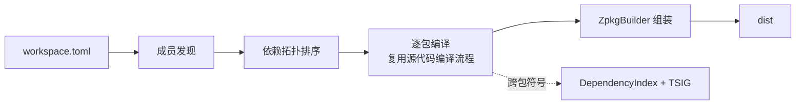

# 工程模型、依赖解析与工作区编译

> **页型**: 机制页 ｜ **状态**: ✅ 已实现 ｜ **代码**: `src/compiler/z42c.project/` · `z42c.pipeline/` · `z42c.ir/DependencyIndex.z42`
> **相关**: [源代码编译流程](source-compile.md) · [架构总览](architecture.md) · [编译产物：zpkg / zbc 格式](format.md) ｜ **对齐**: 2026-07-18

## 概述

一个包由 manifest（`z42.toml`）描述；编译时它对外部包的引用经**依赖索引**与 **TSIG** 解析成跨包符号；多个包组成的工作区按依赖拓扑序逐个编译，最终组装成 dist。本章讲这三件事——从"包怎么被描述"到"依赖怎么跨包解析"，再到"工作区怎么按序编译"。

## 机制

### 工程模型（manifest）

`z42.toml` 描述单个包，核心三段：`[project]`（name / version / kind / entry / pack）、`[sources]`（include / exclude）、`[dependencies]`（依赖包名与版本）。`z42.workspace.toml` 用 `members` 声明工作区成员。

`SourceDiscovery` 按 `[sources]` 的 include/exclude 规则展开出参与编译的源文件清单，交给源代码编译流程。

### 依赖解析（跨包符号）

编译一个包前，`DepScan` 扫描扁平的 `Z42_LIBS` 目录（运行期所有可见 zpkg 汇聚于此），一次产出三样东西：

- **DependencyIndex** — 调用签名键表（静态键 `Cls.Method[$arity]`、实例键 `Method$arity`），供代码生成把跨包调用解析成全限定名；
- **nsMap** — 命名空间到 zpkg 文件名的映射，写入产物的 DEPS 段；
- **TSIG 池** — 各依赖包导出的类型签名（`ExportedModuleZ`）。

类型检查阶段由 `ImportedSymbolLoader` 消费 TSIG 池：先按导出签名还原出短名类型骨架，再填入方法、字段与自由函数。为避免把不相关的包全部拉进符号表，激活范围限定为 **prelude 包 ∪ 被当前编译单元 `using` 到的包**。

#### 加载顺序确定性

扫描 `Z42_LIBS` 必须先按稳定键排序再迭代——**prelude 包在前、其余按 Ordinal 字母序**，注册采用 first-wins。原因是依赖索引对同一签名键只保留第一个登记者；若迭代顺序依赖文件系统或哈希容器，跨操作系统就会不一致，导致同一签名解析到不同包、进而 zbc 字节漂移——文件系统与哈希容器的迭代顺序都不保证字母序，必须显式排序。

### 工作区编译

`WorkspaceBuild.Plan` 先做**成员发现**：当前支持 `members = ["*"]`，即工作区目录下每个"恰好含一份 `*.z42.toml`"的子目录算一个成员。随后按成员间依赖做**拓扑排序**，叶子（无依赖）在前；同一层（互不依赖）的成员按名字 Ordinal 排序，保证结果稳定。

driver 拿到拓扑序后逐个调用单包编译（即[源代码编译流程](source-compile.md)），每个包编完由 `ZpkgBuilder` 组装进 dist。重复构建时，`IncrementalBuild` 的文件级探测可跳过未变动文件的类型检查与代码生成。

## 实现

| 关注点 | 关键文件 |
|--------|---------|
| 工程模型 | `z42c.project/src/ManifestLoader.z42`、`ProjectModel.z42`、`PackageTypes.z42`、`SourceDiscovery.z42` |
| 依赖扫描 | `z42c.pipeline/src/DepScan.z42` |
| 依赖索引 | `z42c.ir/src/DependencyIndex.z42` |
| 跨包符号加载（TSIG） | `z42c.semantics/src/ImportedSymbolLoader.z42`；调和：`z42c.project/src/TsigReconcile.z42` |
| 工作区规划 | `z42c.pipeline/src/WorkspaceBuild.z42`；增量：`IncrementalBuild.z42` |
| 产物组装 | `z42c.project/src/ZpkgBuilder.z42`、`ZpkgWriter.z42` |

## 边界与限制

- **工作区成员**：仅支持 `members = ["*"]`；显式 path 与多 pattern 尚未实现。
- **扁平 `Z42_LIBS`**：所有 zpkg 同处一目录，不同包的同名短类名存在跨包解析串味风险——已由 using-scoped 解析（按 `using` 限定命名空间）根治。
- **TSIG 覆盖面**：`ImportedSymbolLoader` 当前覆盖方法、字段、自由函数；接口 / 委托 / 枚举、以及泛型实例化签名串的解析尚未纳入。

## Deferred

- 工作区显式 `members` 与多 pattern 匹配。
- `ImportedSymbolLoader` 的 `impl` 块合并、接口 / 委托 / 枚举支持。

索引见 `docs/roadmap.md` Deferred Backlog。
