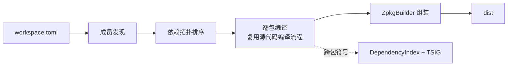

# 工程模型、依赖解析与工作区编译

> **页型**: 机制页 ｜ **状态**: ✅ 已实现 ｜ **代码**: `src/libraries/z42.project/` · `src/compiler/z42c.pipeline/` · `src/libraries/z42.ir/DependencyIndex.z42`
> **相关**: [源代码编译流程](source-compile.md) · [架构总览](architecture.md) · [zbc 字节码格式](zbc-format.md) · [zpkg 包格式](zpkg-format.md) ｜ **对齐**: 2026-07-18

## 概述

一个包由 manifest（`z42.toml`）描述；编译时它对外部包的引用经**依赖索引**与 **TSIG** 解析成跨包符号；多个包组成的工作区按依赖拓扑序逐个编译，最终组装成 dist。本章讲这三件事——从"包怎么被描述"到"依赖怎么跨包解析"，再到"工作区怎么按序编译"。



## 机制

### 工程模型（manifest）

`z42.toml` 描述单个包，核心三段：`[project]`（name / version / kind / entry / pack）、`[sources]`（include / exclude）、`[dependencies]`（依赖包名与版本）。`z42.workspace.toml` 用 `members` 声明工作区成员。

`SourceDiscovery` 按 `[sources]` 的 include/exclude 规则展开出参与编译的源文件清单，交给源代码编译流程。

#### `[dependencies]` 值形态：名字依赖 vs 本地 path 依赖

`[dependencies]` 每一项的值可为**字符串**（版本）或**表** `{ version?, path? }`：

```toml
[dependencies]
"z42.core" = "0.1.0"                 # 名字依赖：按名在 Z42_LIBS 解析 <name>.zpkg
"z42.repl" = { path = "../repl" }    # 本地 path 依赖：源在相对本 manifest 目录的 ../repl
"foo"      = { version = "0.1.0", path = "../foo" }  # path 依赖可并带 version（path 优先，version 供将来校验）
```

含 `path` 者为**本地路径依赖**：依赖工程的源位于 `path`（相对本 manifest 所在目录），编译时由 z42c 先建该依赖闭包再解析——是「非标准库的私有组件级依赖跟随工程走」的表达（对标 Cargo `{ path = ... }`）。解析层落在 `DepEntry.Path`（`""` = 名字依赖）。

> **两阶段（自举纪律）**：本页此小节记的是 **support 阶段（PR-1）已落的解析**——`z42.project` 认得 `path`、填入 `DepEntry.Path`。**z42c 对 path 依赖的消费**（闭包构建、私有组件 colocate 打包）在 **PR-2**（等 PR-1 nightly 发布后），届时本节补「闭包构建机制 + 与 workspace 的关系」。

### 依赖解析（跨包符号）

编译一个包前，`DepScan` 扫描扁平的 `Z42_LIBS` 目录（运行期所有可见 zpkg 汇聚于此），一次产出三样东西：

- **DependencyIndex** — 调用签名键表（静态键 `Cls.Method[$arity]`、实例键 `Method$arity`），供代码生成把跨包调用解析成全限定名；
- **nsMap** — 命名空间到 zpkg 文件名的映射，写入产物的 DEPS 段；
- **TSIG 池** — 各依赖包导出的类型签名（`ExportedModuleZ`）。

类型检查阶段由 `ImportedSymbolLoader` 消费 TSIG 池：先按导出签名还原出短名类型骨架，再填入方法、字段与自由函数。为避免把不相关的包全部拉进符号表，激活范围限定为 **prelude 包 ∪ 被当前编译单元 `using` 到的包**。

#### 加载顺序确定性

扫描 `Z42_LIBS` 必须先按稳定键排序再迭代——**prelude 包在前、其余按 Ordinal 字母序**，注册采用 first-wins。原因是依赖索引对同一签名键只保留第一个登记者；若迭代顺序依赖文件系统或哈希容器，跨操作系统就会不一致，导致同一签名解析到不同包、进而 zbc 字节漂移——文件系统与哈希容器的迭代顺序都不保证字母序，必须显式排序。

### 工作区编译

`WorkspaceBuild.Plan` 先做**成员发现**：当前支持 `members = ["*"]`，即工作区目录下每个"恰好含一份 `*.z42.toml`"的子目录算一个成员。随后按成员间依赖做**拓扑排序**，叶子（无依赖）在前；同一层（互不依赖）的成员按名字 Ordinal 排序，保证结果稳定。

driver 拿到拓扑序后逐个调用单包编译（即[源代码编译流程](source-compile.md)），每个包编完由 `ZpkgBuilder` 组装进 dist。重复构建时，`IncrementalBuild` 的文件级探测可跳过未变动文件的类型检查与代码生成。

#### 跨成员依赖扫描 memo（F2）

工作区逐成员编译时，每个成员编译前都要 `DepScan` 一遍 `Z42_LIBS`：把里面**所有** zpkg（外部 stdlib + 已建成员）逐个 `ZpkgReader.Open` + `TsigReconcile.Rebuild`。同一个依赖包被 N 个成员各解一遍，是 O(N²) 的重复劳动——实测占工作区编译核心时间的约 60%，且每成员固定开销（与成员自身大小无关）。

`DepScanCache`（`z42c.pipeline/src/DepScanCache.z42`）把这两块**最贵的纯函数原语** memo 到进程级缓存：按绝对 path 缓存打开的 `ZpkgInfo` 与该包的 `Rebuild` 结果。`ScanDirs` 的算法、排序（prelude-first + Ordinal）、`declaredDeps` 过滤、self-exclude 全都不变——只把两处原语换成缓存查——因此**产物逐字节不变**（字节不动点天然成立）。合法性有两条：`Open` 是 zpkg 字节的纯函数；某包 `P` 的 TSIG 重建结果只依赖 `P` 自身与其祖先字段/方法，而拓扑序保证 `P` 被任何成员扫到时其依赖都已建、在类型世界里，故 `P` 的 TSIG 跨成员恒定（后续成员的世界只是超集，不改 `P` 的输出）。

缓存 key 用绝对 path（不含 mtime），正确性依赖「同一进程内 path→内容稳定」不变式：工作区每个成员的 dist 在建成前为空目录（不在扫描路径里）、建成后即终态只被后续成员读；外部 `Z42_LIBS` 全程恒定；单包 build 一次扫描后进程即退；REPL 走 `CachedScan` 跳过 `ScanDirs`。故现有全部路径均无「进程内覆写 zpkg 后重扫」，path-only 正确。实测 DepScan 从约 20s 降到约 5.7s（-71%），每成员从约 850ms 降到约 210ms（首成员仍付冷缓存填充）。

## 实现

| 关注点 | 关键文件 |
|--------|---------|
| 工程模型 | `z42c.project/src/ManifestLoader.z42`、`ProjectModel.z42`、`PackageTypes.z42`、`SourceDiscovery.z42` |
| 依赖扫描 | `z42c.pipeline/src/DepScan.z42`；跨成员 memo：`DepScanCache.z42`（F2） |
| 依赖索引 | `z42c.ir/src/DependencyIndex.z42` |
| 跨包符号加载（TSIG） | `z42c.semantics/src/ImportedSymbolLoader.z42`；调和：`z42c.project/src/TsigReconcile.z42` |
| 工作区规划 | `z42c.pipeline/src/WorkspaceBuild.z42`；增量：`IncrementalBuild.z42` |
| 产物组装 | `z42c.project/src/ZpkgBuilder.z42`、`ZpkgWriter.z42` |

## 边界与限制

- **工作区成员**：仅支持 `members = ["*"]`；显式 path 与多 pattern 尚未实现。
- **扁平 `Z42_LIBS`**：所有 zpkg 同处一目录，不同包的同名短类名存在跨包解析串味风险——已由 using-scoped 解析（按 `using` 限定命名空间）根治。
- **TSIG 覆盖面**：`ImportedSymbolLoader` 当前覆盖方法、字段、自由函数；接口 / 委托 / 枚举、以及泛型实例化签名串的解析尚未纳入。

## Deferred

- 工作区显式 `members` 与多 pattern 匹配。
- `ImportedSymbolLoader` 的 `impl` 块合并、接口 / 委托 / 枚举支持。

索引见 `docs/roadmap.md` Deferred Backlog。
