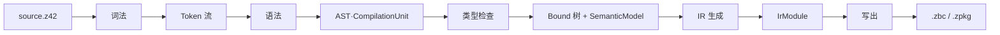

# 源代码编译流程（z42c）

> **页型**: 机制页 ｜ **状态**: ✅ 已实现 ｜ **代码**: `src/libraries/z42c.syntax/` · `src/compiler/z42c.semantics/` · `src/libraries/z42.ir/`
> **相关**: [架构总览](architecture.md) · [工程模型、依赖解析与工作区编译](project-model.md) · [zbc 字节码格式](zbc-format.md) · [zpkg 包格式](zpkg-format.md) · [CLI 与诊断工具](tools.md) ｜ **对齐**: 2026-08-31

## 概述

单个源文件（或单个包内的源文件）从 `.z42` 编译到 `.zbc` / `.zpkg`，经过五个阶段：**词法 → 语法 → 类型检查 → IR 生成 → 写出**。前四步在内存中逐层抬升表示——从字符流到 Token、到语法树、到带类型的 Bound 树、到 IR，最后序列化成二进制。



## 机制

各阶段单向推进，前一阶段的产物是后一阶段的唯一输入。每个阶段都有对应的 `--dump-*` 命令可单独观察其产物（见 [CLI 与诊断工具](tools.md)）。

### 词法（Lexer）

字符流 → Token 流。手写扫描器逐字符读取，将空白、换行、注释作为 trivia 跳过，识别标识符与关键字、数字/字符串/字符/原始串/插值串字面量、以及按最长匹配切分的运算符与符号，末尾补 EOF。

跳过 trivia 使后续语法阶段只面对干净的 Token 序列，无需再关心排版与注释。观察：`--dump-tokens`。

### 语法（Parser）

Token 流 → AST（`CompilationUnit`）。表达式用 Pratt 优先级爬升解析，运算符的结合与优先级由绑定力表驱动，便于增删运算符；语句与声明用递归下降。类型统一经 `_parseType` 产出 `TypeExpr`。

解析器按关注点拆成若干子解析器（表达式、声明、成员、语句、类型），各司其职。AST 节点不可变，为后续并行分析与安全遍历提供基础。观察：`--dump-ast`。

### 类型检查（TypeCheck）

AST → Bound 树 + `SemanticModel`。分两步：先由 `SymbolCollector` 遍历整个编译单元建立符号表，再逐节点定型。先建表使同一单元内的前向引用与互相引用不受书写顺序约束。

定型过程解析每个表达式与语句的类型、校验可赋值性与定义性，并由 `OverloadResolver` 完成方法重载决议、`ConstraintChecker` 校验泛型约束。产物是 Bound 树（每个节点携带解析后的类型）与 `SemanticModel`（供代码生成消费）。观察：`--dump-bound`。

#### 同短名跨命名空间的类型解析（FQN keying）

`SymbolTable.Classes` 以**裸类名**为键（`Foo`），同短名不同命名空间的类（`namespace A { class Foo }` 与
`namespace B { class Foo }`）会在该表里 first/last-wins 只留一份。仅靠裸名表，限定引用 `new A.Foo` 会被剥成
`Foo` 再查裸名表 → 撞见碰巧赢的那份（B.Foo），致对象身份、`is`/`as`、`GetType().FullName` 全错
（`fix-type-ref-ns-collision`；与静态调用侧 `fix-crosspkg-static-ns-collision` 同源，见
[common-pitfalls §1](../../../.claude/rules/common-pitfalls.md)）。

根治靠**并存的 FQN 视图**：

- 每个 `Z42ClassType` 带 `Namespace` 字段（本地类由 `StubCollector` 从 `cu.Namespace` 回填，导入类由
  `ImportedSymbolLoader` 从模块 ns 回填），并提供 `Fqn()`（`ns.IrName()`；全局类退回裸名）。
- `SymbolTable.ClassesByFqn`（FQN 键 → 类型）与裸名 `Classes` **并存**，注册时同时登记，**保留每一份**同短名类。
- `ResolveTypeP` 的限定名路径**优先**按 FQN 命中 `ClassesByFqn`（`A.Foo` → 声明 ns==A 的那份），不再剥短名撞赢家；
  非限定引用仍走裸名表（沿用其 first/last-wins，另见下「Deferred」）。
- 发射端（`CallEmitter` 的 `ObjNew`）对已解析到的、`Namespace!=""` 的类型直接发 `Fqn()`，绕开
  `EmitContext.QualifyClass` 按短名走 `ImportedClassNs` 的同类撞名歧义；`is`/`as` 本就发 AST 源码原始限定名，天然正确。

> **Deferred**：① 导入跨包同短名类型（`using` 两个包各有 `Foo`）当前只对**本地**类做 FQN keying；②
> 非限定同短名（`using A; using B;` 后裸写 `Foo`）仍 first/last-wins 静默选一，C# 语义应报歧义诊断。

#### prim 接收者实例方法的 type-based 重载决议

基元接收者（`string` / `int` / `char` …）的实例方法调用，绑定走 `MemberResolver._bindInstanceMemberCall` 的 **prim-wrapper 分支**（`z42c.semantics/src/MemberResolver.z42:129`）：把关键字名映射到 stdlib 包装类（`"string"→"String"`，`TypeFactsTc._primWrapper`），在包装类上解析方法、取真实返回类型，产出 `BoundCall(OwnerClass=PrimModel.Keyword(...), MethodName=派发键)`。

**缺陷（`add-prim-instance-type-overload` 前）**：该分支只用 `_overloadKey`（`name$arity`）+ `_findMethod` 查方法键——**不做类型决议**。当包装类有**同 arity 不同类型**的重载（如 `String.Split(string)` / `Split(char[])`）时，`MemberCollector` 已把它们 mangle 成 `Split$1$string` / `Split$1$char[]`（`OverloadResolver.MangleKey`），`_overloadKey` 试 `Split$1` 查不到 → 回退裸 `Split`：

- **本地编译**（z42.core 编自己）：`MemberCollector` 对 mangle 方法**只注册 mangle 键、无裸键** → `_findMethod` 落空（`wms==null`）→ 裸名 loose-bind Unknown → codegen 的 DepIndex 实例捷径被下游同短名方法（`Std.Regex.Regex.Split`）劫持 → `TrackDepNamespace("Std.Regex")` → **E0436**（`namespace Std.Regex is used but not imported`）。
- **跨包调用**（用户代码 import z42.core 调 `s.Split(...)`）：`ImportedSymbolLoader` 为每个 mangle 方法**额外注册一个裸-first-wins 别名键**（`ImportedSymbolLoader.z42:308-312`）→ `_findMethod(裸 "Split")` **命中首个重载**（`wms!=null`）→ emit **裸名** VCall → 运行期 VM 查 `Std.String.Split`（非注册函数，实际键是 `Split$1$string`）→ `VCall: expected object`。

**方案（同 arity 多重载才做完整决议）**：`MemberResolver.z42:130-152` 的门，先算 `OverloadBinder._sameArityOverloadCount(...)`（复用 `_collectOverloads` 的 RegKey 去重 + 走基链，同 `_resolveOverload` 的 byArity 过滤）：

- **同 arity 候选 < 2**（单方法 / 纯 arity 重载——今天所有 prim 实例方法）：走原 `_overloadKey`/`_findMethod` 快路径，`wms!=null` 即用其键。**字节中性**。
- **同 arity 候选 ≥ 2**：**跳过快路径**，直接 `_resolveOverload`（与 class 接收者路径 `MemberResolver.z42:57` 同款类型决议）取命中符号的 `RegKey`（mangle 键）产 `BoundCall`。这样跨包也无视裸别名、按实参类型命中正确重载。
- 对称守卫：`CallEmitter.z42:160` 的实例 DepIndex 捷径加 `ownerIsLocalInst`（`LocalClasses.ContainsKey(TypeFactsTc._primWrapper(c.OwnerClass))`），本地 prim 类即便 `owns` 因故为 false 也不进捷径、不被下游同名劫持（对称静态路径 `:201-202` 的 `ownerIsLocal`）。

**VM 侧无需改动**：基元接收者 VCall 的运行期派发（`src/runtime/src/interp/exec_vcall.rs:321-379`）按 `<class>.<method名>` 拼函数名直查——即它**本就以完整 mangle RegKey 为派发键**。只要绑定 emit 出正确的 `Split$1$string`，VM 就命中 `Std.String.Split$1$string`，跨包一样生效。

> 阶段纪律（[bootstrap-seed.md](../../../.claude/rules/bootstrap-seed.md)）：本 change 是**阶段 1（support）**——只扩 z42c 绑定能力，z42c / stdlib 源自身**不使用** prim 类同 arity 重载。往 `Std.String` 加 `Split(char[])` 等实际重载是**阶段 2**（晚一个 nightly，独立 change）。

#### prim 类型的静态字段读（`int.MaxValue`）

裸类型名的静态字段读（`Type.FIELD`）绑定走 `MemberResolver._bindMember`（`z42c.semantics/src/MemberResolver.z42:17`）：`target` 是类名（非变量）且该类有同名 `static` 字段 → 产 `BoundStaticGet`，emit `StaticGetInstr @<FQN>.<field>`，运行期由 VM 启动的 `<ns>.__static_init__` pass 初始化（`src/runtime/src/interp/mod.rs` `init_static_fields`，机制同 `Std.Math.Pi`）。

**缺陷（`add-scalar-static-fields` 前）**：标量基元（`int` / `double` / …）在符号表里**只以包装名 keying**（`Int32` / `Double`，`SymbolTable.Classes`），关键字别名 `int` 的 `HasClass("int")` 为 false → 该分支跳过 → `int.MaxValue` 落到实例 `FieldGet`（受者为裸类型名求值出的 Null）→ 运行期 `FieldGet: not an object or known value type, got Null`。

**方案**：`MemberResolver.z42:17-27` 在 `HasClass` 前加一步——`!HasClass(name) && PrimModel.IsBuiltin(name)` 时把 `name` 归一到 `PrimModel.Wrapper(name)`（`"int"→"Int32"`），并用归一后的包装名产 `BoundStaticGet`（其 `QualifyClass` 得 `Std.Int32`、匹配 `Std.Int32.__static_init__` 写入的键）。于是 `int.MaxValue` 与 `Int32.MaxValue` 绑定到同一静态字段。跨包 `Int32.MaxValue` 本就走 `HasClass("Int32")` 命中的原分支（static 字段随 zbc 类型段导入），无需改动。**字节中性**：非标量类 `clsName==name` 不变；仅新增「标量关键字 + 存在 static 字段」这一命中，既有代码无此形态。const 字段不适用（跨包不序列化值、`IsStatic` 亦为 false）——故 `Int32.MaxValue` 等采用 `static` 字段（值单一真相源在 `Primitives/*.z42`，经 `__static_init__` 落地；`Double.NaN`/`±Infinity` 借 `BitConverter` 在 init 期构造，const 折叠做不到）。

#### 实例派发键稳定化（primary 裸键 / 非-primary 全签名键）

方法的**派发键**（= IR 函数名 = TSIG 导出名 = `Call`/`VCall` 目标 = DepIndex 注册键）此前随**兄弟集**三档漂移：唯一方法 → 裸名 `IndexOf`；同 arity 重载 → `IndexOf$1`；同 arity 不同类型 → 全 mangle `IndexOf$1$string`。**问题**：给一个原本唯一的方法**新增一个重载**，会让**既有那个方法**从裸 `IndexOf` rekey 成 `IndexOf$1$string`——而上一个 nightly 种子里烘焙的调用点仍发裸 `IndexOf` → 运行期 `VCall/Call` 落空。这是 E0436/E0433/first-wins 别名一整类「键随兄弟集漂移」补丁的共同根因，也卡住 stdlib 加重载（如 String 补齐）。

**根因洞察**：一个字符串键在扛两件互斥的活——① overload 决议标识（编译期，要区分同名重载、且**稳定于兄弟增删**）；② 多态派发槽（运行期虚/接口/协议/foreach，要 base·派生·实例化三方**替换不变**的裸槽）。rekey 破坏**只发生在 unique→overloaded 的跃迁**。

**方案（`MemberCollector._fillClass`）**：每个 `(owner, name)` 重载集里——

```
primary（声明序第一个同名成员） → key = 裸名          （= 唯一方法今天的键：多态/协议规范槽 + seed 锚点）
非-primary（后续同名兄弟）        → key = MangleKey(全签名)（如 IndexOf$1$char；加/删只动自己、不碰 primary）
```

`emittedInst`（`StrMap`）跟踪每名是否已出 primary：首个同名裸键，后续取 `OverloadResolver.MangleKey`。**关键性质 additive——所有唯一方法逐字节不变**：接口/泛型虚/协议 `op_*`·`CompareTo`/foreach 的 `GetEnumerator`·`MoveNext`·`Current`/委托目标几乎都是唯一方法，全保裸键 → 上次「全 mangle」回退挂的 5 子系统（19 e2e golden）**本就不动**，而非「先全 rekey 再逐个救」。只有真正的同名多重载（少见，多为非多态如 `Substring` 系 arity 重载）的非-primary 成员取全键，一次性迁移（格式 bump + 两代自举）后永久 additive。

primary = **声明序第一个**同名成员（跨 partial 碎片按碎片加载序，确定）。纪律：**新增重载一律追加在既有之后**，否则 primary 易主 → 既有 primary rekey（写入 spec 场景 + 由「不改 z42c 源既有重载声明序」保证）。

调用点 emit（`MemberResolver`）：静态可决议的具体重载 → 发 `ms.RegKey`（primary 裸 / 非-primary 全键）；多态派发（虚/接口/泛型参数接收者）→ 发裸规范槽。**prim-wrapper 接收者不再有 arity 快路径**——统一走 `_resolveOverload` 取 `RegKey`（去掉此前 `_sameArity<2` 时用 `Name$arity` 的分支，那会对非-primary 重载发错 arity 键致段错误）。

**四个必须镜像的落点**（辐射面收敛到「非-primary 重载的可达性」，有界可枚举）：

| 落点 | 处理 |
|------|------|
| **ctor 键**（`OverloadBinder._ctorKey`） | 老 `Box$argCount` 查不到非-primary 全键（如 `Box$2$i32$i32`）→ 按 `argCount` 在本类 ctor 里找匹配者返其 `RegKey`（否则 `new Box(3,4)` 发裸 `Box` → ObjNew 命中 primary arity-1 ctor → 错 ctor） |
| **协议豁免名重载**（`ToString`/`Equals`/…） | 协议豁免名**也走 primary/非-primary**：规范签名（声明序首个）= primary 裸（VM vtable/DepIndex 硬查锚点保住）；其重载（`ToString(string)`）= 非-primary 全键（否则全裸 last-wins 撞车——`guid.ToString("D")` 派发到无参 `ToString` 丢 format） |
| **VM vtable 槽**（`type_desc.rs derive_simple_method_name`） | 返回**完整键、不再剥 `$` 后缀**——否则同名多个虚重载塌进一槽（H4：`o.F(int)` 与 `o.F(int,int)` 撞）。`merge_with_base` 的 override 匹配 + JIT `vtable_index` 同用此键 |
| **碰撞守卫**（`MemberCollector` `sigSeen`） | 老键下 `G(string)`/`G(string?)` 靠共享 `RegKey` 被 `DeclBinder` 判重报 E0408；新键下 primary=裸、非-primary=全键，`RegKey` 不再相同 → `DeclBinder` 漏判 → 故在此按**全签名 MangleKey**（含 nullable/alias 归一）自查：同全签名 ≥2 报 E0408。协议豁免名 + 转换运算符跳过（各有专属冲突检测） |

**格式**：一次性迁移 bump zbc 1.37→1.38 / zpkg 0.42→0.43，`ci-bootstrap` 版本差 gate 走两代自举吸收（gen1==gen2 字节不动点）。此后加/删重载永久 additive、不再 bump。设计全文（含泛型 H2/H3/H5 降为前向守卫、D4a 决议优先级）见变更归档 `docs/spec/archive/…-stabilize-instance-dispatch-keys`。

### IR 生成（IrGen）

Bound 树 + `SemanticModel` → `IrModule`。逐个类方法与顶层函数交给 `FunctionEmitter` 发射为寄存器式 IR 函数，汇总类描述与字符串池成 `IrModule`。函数以 `Class.Method`（类方法）或函数名（顶层函数）为键。

代码生成只依赖 `SemanticModel` 这一接口，与前端类型检查解耦。观察：`--dump-ir`。

#### try/catch/finally 的控制流下沉（finally 非局部退出）

z42 无独立的 finally 执行机制——`StmtEmitter._emitTry`（语句 & 控制流簇，从 `FunctionEmitter` 分出）把 `finally` **desugar 成普通基本块**，接到每条离开 try 区域的边上：

| 退出边 | finally 如何接上 |
|--------|------------------|
| try 体正常 fall-through | `try_end → br finally → after` |
| 各 catch 子句 fall-through | `catch_start … → br finally` |
| 未捕获异常（无 user catch 时） | 合成 `"*"` catch-all → 内联 finally → `rethrow`（异常表回卷） |
| **`return` / `break` / `continue`（非局部退出）** | 见下 |

前三条是结构化 fall-through / 异常回卷，天然经过 finally。**非局部退出**（try 体或 catch 体里的 `return` / `break` / `continue`）会直接发射终结指令离开当前块——若不特殊处理就**跳过 finally**（历史 bug：`fix-finally-nonlocal-exit`，曾致 `Std.Json`/`Std.Toml` 递归深度守卫 `try{return}finally{_depth--}` 的 `_depth` 只增不减而误报 nesting too deep）。

正确下沉靠 **finally handler 栈**（状态 `FunctionEmitter._finBodies`/`_finDepth` 存于 hub、内层在顶；推/弹/内联在 `StmtEmitter`）：

- `_emitTry` 在发射 try 体 + catch 体**前** `_pushFinally(t.Finally)`、发射 finally 三处副本**前** `_popFinally`（副本本身不含自己）。
- `return`：先求值返回值（**finally 运行前**捕获，`_finDepth>0` 时物化到独立寄存器，使 finally 对局部的写不污染返回值——镜像 C#/Java），再 `_emitPendingFinallys(0)` 内→外内联发射**全部**外层 finally，最后 `RetTerm`。
- `break`/`continue`：`_emitPendingFinallys(floor)`，`floor` = 目标循环入栈时记录的 finally 栈深（`EmitContext` 循环栈每层存 `BreakFinFloor`/`ContFinFloor` 两个底——`switch` 的 `continue` 转发外层循环，continue-floor 继承外层，故与 break 分开），只跑跨越目标层边界的 finally。
- 发射 `finally[i]` 时把 `_finDepth` 临时截断到 `i` → finally 内部的 `return` 只跑更外层、绝不自我重入；某层 finally 自身非局部退出（块 `Ended`）即止。嵌套 try-finally、return-in-finally 覆盖 supersede 语义。

**关键不变量（自举）**：`_finDepth==0`（无 finally 包裹）时发射路径与旧代码逐字节一致 → z42c 自身零 `try/finally`，故 gen1==gen2 不动点不受影响；只有用了 try/finally+早退的 stdlib（JSON/TOML 守卫等）产物改变。用例见 `src/tests/exceptions/finally_nonlocal_exit`。

#### foreach 三-path 下沉（数组 / 索引 / IEnumerable）

`foreach (T x in coll)` 按目标静态类型走**三-path 决策树**（`StmtBinder._bindForeach`，优先级从上到下、首个命中即用）：

1. **数组**（`coll` 是 `Z42ArrayType`）→ `ArrayLen` 求长 + `ConstI32` 计数器 + `ArrayGet` 取元素（`_emitForeach` 计数器循环）。
2. **索引鸭子**（类有 `get_Item` **且** `Count` 字段/方法）→ `Count` + `get_Item(i)` VCall（`List` 等；比 C# 更快，省 enumerator 构造 + 每步两次 VCall）。
3. **IEnumerable 协议**（既非数组、也无 `get_Item`+`Count`，但有 `GetEnumerator()`）→ **binder 脱糖**（`_bindForeachEnumerable`）成既有 AST：
   ```
   { var __e = <coll>.GetEnumerator();
     try { while (__e.MoveNext()) { <T> x = __e.Current; <body> } }
     finally { __e.Dispose(); } }
   ```
   再交 `_bindStmt`——**复用** struct 值返回（sret）/ try-finally 栈（上节）/ break-continue-return 经 finally / 方法·属性派发**全部既有 lowering**，零新 Bound 节点、零新 emitter。`__e` 取 `GetEnumerator()` 的**具体 struct 类型**（pattern-based 无装箱），`__e.Current` 是 struct 属性 getter（经 `get_Current` 静态 Call / sret-aware）。

**关键不变量（自举）**：path 1/2 的 `_emitForeach` 完全不动、path 3 的脱糖只在 IEnumerable-only 类型上触发——z42c 源自身 foreach 均走数组/索引 path，从不进脱糖分支 → gen1==gen2 逐字节不动点不受影响。无新 IR 指令 / 无格式 bump（`GetEnumerator`/`MoveNext`/`get_Current`/`Dispose` 全是既有 `Call`/`VCall`）。`ListEnumerator<T>`/`DictionaryEnumerator<K,V>` 是 `Std.Collections` 的 `[Record] struct`（值语义、迭代零堆分配）。用例见 `src/tests/basic/foreach_ienumerable.z42`。

> **配套编译器修复**：struct **属性 getter** 读此前有两个 codegen 缺口——① 成员一律当字段发 `struct_fget_prim @-1`（`fix-struct-property-getter`，见 [struct 值语义](../runtime/struct-value-semantics.md)）；② imported 泛型 struct 属性 getter 返回类型漏 `_substGeneric` 替换 → 松绑 `Unknown` → sret 失配（`MemberResolver` 的 `Z42InstantiatedType` 成员访问分支补属性 getter + 替换）。二者是 foreach 脱糖用 `__e.Current` 的前置。

### 写出（Emit）

`IrModule` → `.zbc` / `.zpkg`。由 `ZbcWriter` 将 IR 序列化为二进制：单文件产出 `.zbc`，打包产出 `.zpkg`。二进制布局与各 section 见 [zbc 字节码格式](zbc-format.md) / [zpkg 包格式](zpkg-format.md)。

## 实现

| 阶段 | 关键文件 |
|------|---------|
| 词法 | `z42c.syntax/src/Lexer.z42`、`Token.z42`、`TokenKind.z42` |
| 语法 | `z42c.syntax/src/Parser.z42` + `ExprParser` / `DeclParser` / `MemberParser` / `StmtParser` / `TypeParser`；AST：`Ast.z42` / `Decl.z42` / `Stmt.z42` / `TypeExpr.z42` |
| 类型检查 | `z42c.semantics/src/TypeChecker.z42`、`SymbolCollector.z42`、`SymbolTable.z42`、`OverloadResolver.z42`、`ConstraintChecker.z42`；产物：`Bound.z42`、`SemanticModel.z42` |
| IR 生成 | `z42c.semantics/src/IrGen.z42`、`FunctionEmitter.z42`（函数级 hub：函数入口/静态 init/lambda 与局部函数 lift/签名装配 + 共享状态 EmitContext·ExprEmitter·finally 栈，语句发射委派 `StmtEmitter`）、`StmtEmitter.z42`（语句 & 控制流簇：`_emitStmt` 调度 + if/for/while/do-while/switch/foreach + try/catch/finally，经 hub 反向引用单向委回）、`ExprEmitter.z42`（表达式发射入口/dispatch，按职责分解为 `CallEmitter`（call/new/method-group）、`TypeOpEmitter`（is/typeof/cast/box/convert）、`OperatorEmitter`（binary/unary/条件/switch-expr/struct 相等）、`AccessEmitter`（assign/member/index/ident + struct 值语义机制）四个协作发射簇）、`EmitContext.z42`；IR 模型：`z42c.ir/src/IrModule.z42`、`IrInstr.z42`、`IrType.z42` |
| 写出 | `z42c.ir/src/BinaryFormat/ZbcWriter.z42`、`ZbcFormat.z42`、`ZbcInstr.z42` |

## 边界与限制

- **全量解析，无增量**：每次编译完整走一遍词法与语法。文件级增量探测在工作区构建层，见 [工程模型、依赖解析与工作区编译](project-model.md)。
- **单包视角**：本章只讲一个包内源码的编译。跨包符号导入（DependencyIndex、TSIG）由类型检查阶段读取，机制见 [工程模型、依赖解析与工作区编译](project-model.md)。

## Deferred

- 统一的 AST 脱糖阶段：目前少量 AST 改写分散在各处，尚未提取为独立 pass。索引见 `docs/roadmap.md` Deferred Backlog。

- **协议豁免方法无法承载「行为发散」的重载**（`protocol-overload-first-class`）：对象协议方法
  （`ToString` / `Equals` / `GetHashCode` / `GetType` / `get_Item` / `set_Item`，见
  `SymbolCollector.IsProtocolExempt`）恒以**裸名**注册——VM / DepIndex 按裸字面名走 vtable **单槽**多态
  派发（装箱相等、字典哈希、字符串插值、反射、索引器语法都靠它），故这些名不许 mangle。于是同名多重载
  （如 `Equals(object?)` + `Equals(string)`）的 RegKey 全部塌缩为裸键 `"Equals"`，`ct.Methods.Put` 后写覆盖
  前 → `OverloadsOf` 只剩一个 → 调用点重载解析看不到另一个。
  - **后果**：无法让协议方法的两个重载承载**不同**行为；仅当两者语义等价（如 `Std.String` 两 `Equals`
    同指 `__str_equals` native，塌缩隐形）时可用。非协议 type-based 重载不受影响（各得唯一 mangle 键）。
  - **正解（C# 模型）**：解耦「运行时规范协议槽」（一个裸名槽，如 `Equals(object?)`）与「供调用点解析的
    完整重载集」——全部重载按签名存表、标记其一为协议规范槽供 VM/DepIndex 裸名查、调用点按静态实参类型
    解析、运行时多态走规范槽。属 VM + 编译器（可能连带 vtable 布局 / DepIndex / zbc·zpkg 格式）工程，非局部改动。
  - **触发条件**：出现真实需要「行为发散的协议重载」的用例（罕见——对象协议契约本就要求
    `Equals(object)` 与 `Equals(T)` **一致**，此限制大体与契约同向）。
  - **暴露于** `fix-partial-protocol-overload-e0433`（2026-09-01，partial `Std.String` 拆分把该塌缩显式化：
    partial 的跨碎片重复成员检测原按 RegKey 判重，误把协议重载报成 E0433；已改为按完整签名判重，但底层
    单槽塌缩仍在）。索引见 `docs/roadmap.md` Deferred Backlog。
