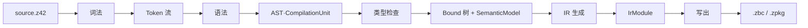

# 源代码编译流程（z42c）

> **页型**: 机制页 ｜ **状态**: ✅ 已实现 ｜ **代码**: `src/compiler/z42c.syntax/` · `z42c.semantics/` · `z42c.ir/`
> **相关**: [架构总览](architecture.md) · [工程模型、依赖解析与工作区编译](project-model.md) · [编译产物：zpkg / zbc 格式](format.md) · [CLI 与诊断工具](tools.md) ｜ **对齐**: 2026-07-17

## 概述

单个源文件（或单个包内的源文件）从 `.z42` 编译到 `.zbc` / `.zpkg`，经过五个阶段：**词法 → 语法 → 类型检查 → IR 生成 → 写出**。前四步在内存中逐层抬升表示——从字符流到 Token、到语法树、到带类型的 Bound 树、到 IR，最后序列化成二进制。

## 机制

各阶段单向推进，前一阶段的产物是后一阶段的唯一输入。每个阶段都有对应的 `--dump-*` 命令可单独观察其产物（见 [CLI 与诊断工具](tools.md)）。

### 词法（Lexer）

字符流 → Token 流。手写扫描器逐字符读取，将空白、换行、注释作为 trivia 跳过，识别标识符与关键字、数字/字符串/字符/原始串/插值串字面量、以及按最长匹配切分的运算符与符号，末尾补 EOF。

跳过 trivia 使后续语法阶段只面对干净的 Token 序列，无需再关心排版与注释。观察：`--dump-tokens`。

### 语法（Parser）

Token 流 → AST（`CompilationUnit`）。表达式用 Pratt 优先级爬升解析，运算符的结合与优先级由绑定力表驱动，便于增删运算符；语句与声明用递归下降。类型统一经 `_parseType` 产出 `TypeExpr`。

解析器按关注点拆成若干子解析器（表达式、声明、成员、语句、类型），各司其职。AST 节点不可变，为后续并行分析与安全遍历提供基础。观察：`--dump-ast`。

### 类型检查（TypeCheck）

AST → Bound 树 + `SemanticModel`。分两步：先由 `SymbolCollector` 遍历整个编译单元建立符号表，再逐节点定型。先建表使同一单元内的前向引用与互相引用不受书写顺序约束。

定型过程解析每个表达式与语句的类型、校验可赋值性与定义性，并由 `OverloadResolver` 完成方法重载决议、`ConstraintChecker` 校验泛型约束。产物是 Bound 树（每个节点携带解析后的类型）与 `SemanticModel`（供代码生成消费）。观察：`--dump-bound`。

### IR 生成（IrGen）

Bound 树 + `SemanticModel` → `IrModule`。逐个类方法与顶层函数交给 `FunctionEmitter` 发射为寄存器式 IR 函数，汇总类描述与字符串池成 `IrModule`。函数以 `Class.Method`（类方法）或函数名（顶层函数）为键。

代码生成只依赖 `SemanticModel` 这一接口，与前端类型检查解耦。观察：`--dump-ir`。

#### try/catch/finally 的控制流下沉（finally 非局部退出）

z42 无独立的 finally 执行机制——`StmtEmitter._emitTry`（语句 & 控制流簇，从 `FunctionEmitter` 分出）把 `finally` **desugar 成普通基本块**，接到每条离开 try 区域的边上：

| 退出边 | finally 如何接上 |
|--------|------------------|
| try 体正常 fall-through | `try_end → br finally → after` |
| 各 catch 子句 fall-through | `catch_start … → br finally` |
| 未捕获异常（无 user catch 时） | 合成 `"*"` catch-all → 内联 finally → `rethrow`（异常表回卷） |
| **`return` / `break` / `continue`（非局部退出）** | 见下 |

前三条是结构化 fall-through / 异常回卷，天然经过 finally。**非局部退出**（try 体或 catch 体里的 `return` / `break` / `continue`）会直接发射终结指令离开当前块——若不特殊处理就**跳过 finally**（历史 bug：`fix-finally-nonlocal-exit`，曾致 `Std.Json`/`Std.Toml` 递归深度守卫 `try{return}finally{_depth--}` 的 `_depth` 只增不减而误报 nesting too deep）。

正确下沉靠 **finally handler 栈**（状态 `FunctionEmitter._finBodies`/`_finDepth` 存于 hub、内层在顶；推/弹/内联在 `StmtEmitter`）：

- `_emitTry` 在发射 try 体 + catch 体**前** `_pushFinally(t.Finally)`、发射 finally 三处副本**前** `_popFinally`（副本本身不含自己）。
- `return`：先求值返回值（**finally 运行前**捕获，`_finDepth>0` 时物化到独立寄存器，使 finally 对局部的写不污染返回值——镜像 C#/Java），再 `_emitPendingFinallys(0)` 内→外内联发射**全部**外层 finally，最后 `RetTerm`。
- `break`/`continue`：`_emitPendingFinallys(floor)`，`floor` = 目标循环入栈时记录的 finally 栈深（`EmitContext` 循环栈每层存 `BreakFinFloor`/`ContFinFloor` 两个底——`switch` 的 `continue` 转发外层循环，continue-floor 继承外层，故与 break 分开），只跑跨越目标层边界的 finally。
- 发射 `finally[i]` 时把 `_finDepth` 临时截断到 `i` → finally 内部的 `return` 只跑更外层、绝不自我重入；某层 finally 自身非局部退出（块 `Ended`）即止。嵌套 try-finally、return-in-finally 覆盖 supersede 语义。

**关键不变量（自举）**：`_finDepth==0`（无 finally 包裹）时发射路径与旧代码逐字节一致 → z42c 自身零 `try/finally`，故 gen1==gen2 不动点不受影响；只有用了 try/finally+早退的 stdlib（JSON/TOML 守卫等）产物改变。用例见 `src/tests/exceptions/finally_nonlocal_exit`。

### 写出（Emit）

`IrModule` → `.zbc` / `.zpkg`。由 `ZbcWriter` 将 IR 序列化为二进制：单文件产出 `.zbc`，打包产出 `.zpkg`。二进制布局与各 section 见 [编译产物：zpkg / zbc 格式](format.md)。

## 实现

| 阶段 | 关键文件 |
|------|---------|
| 词法 | `z42c.syntax/src/Lexer.z42`、`Token.z42`、`TokenKind.z42` |
| 语法 | `z42c.syntax/src/Parser.z42` + `ExprParser` / `DeclParser` / `MemberParser` / `StmtParser` / `TypeParser`；AST：`Ast.z42` / `Decl.z42` / `Stmt.z42` / `TypeExpr.z42` |
| 类型检查 | `z42c.semantics/src/TypeChecker.z42`、`SymbolCollector.z42`、`SymbolTable.z42`、`OverloadResolver.z42`、`ConstraintChecker.z42`；产物：`Bound.z42`、`SemanticModel.z42` |
| IR 生成 | `z42c.semantics/src/IrGen.z42`、`FunctionEmitter.z42`（函数级 hub：函数入口/静态 init/lambda 与局部函数 lift/签名装配 + 共享状态 EmitContext·ExprEmitter·finally 栈，语句发射委派 `StmtEmitter`）、`StmtEmitter.z42`（语句 & 控制流簇：`_emitStmt` 调度 + if/for/while/do-while/switch/foreach + try/catch/finally，经 hub 反向引用单向委回）、`ExprEmitter.z42`（表达式发射入口/dispatch，按职责分解为 `CallEmitter`（call/new/method-group）、`TypeOpEmitter`（is/typeof/cast/box/convert）、`OperatorEmitter`（binary/unary/条件/switch-expr/struct 相等）、`AccessEmitter`（assign/member/index/ident + struct 值语义机制）四个协作发射簇）、`EmitContext.z42`；IR 模型：`z42c.ir/src/IrModule.z42`、`IrInstr.z42`、`IrType.z42` |
| 写出 | `z42c.ir/src/BinaryFormat/ZbcWriter.z42`、`ZbcFormat.z42`、`ZbcInstr.z42` |

## 边界与限制

- **全量解析，无增量**：每次编译完整走一遍词法与语法。文件级增量探测在工作区构建层，见 [工程模型、依赖解析与工作区编译](project-model.md)。
- **单包视角**：本章只讲一个包内源码的编译。跨包符号导入（DependencyIndex、TSIG）由类型检查阶段读取，机制见 [工程模型、依赖解析与工作区编译](project-model.md)。

## Deferred

- 统一的 AST 脱糖阶段：目前少量 AST 改写分散在各处，尚未提取为独立 pass。索引见 `docs/roadmap.md` Deferred Backlog。
