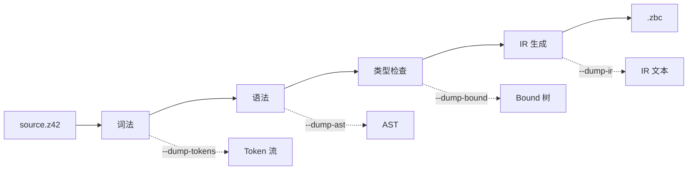

# CLI 与诊断工具

> **页型**: 参考页 ｜ **状态**: ✅ 已实现（z42b 部分 verb 见状态标注）｜ **代码**: `src/compiler/z42c.driver/src/Main.z42` · `src/toolchain/builder/core/builder_cli.z42`
> **相关**: [源代码编译流程](source-compile.md) · [项目构建与发布编排](project-build.md) ｜ **对齐**: 2026-09-10（`restore-emit-zbc-diagnostics`）

## 概述

编译相关有两套命令行入口：

- **z42c** — 编译器 CLI，直接对源文件做编译或诊断，产出 `.zbc` / `.zpkg`；
- **z42b** — 构建编排器 CLI，对整个项目做"编译 → 发布"，由 launcher 的 `z42 <verb>` 透传调用。

z42c 的一组 `--dump-*` 诊断命令与[源代码编译流程](source-compile.md)的各阶段一一对应，是逐阶段观察中间产物的窗口。

## z42c 命令

### 编译

| 命令 | 作用 |
|------|------|
| `z42c build <project.z42.toml>` | 编译单个包，产出 packed `.zpkg` 到 `dist/` |
| `z42c build --workspace [--output-dir <d>]` | 按拓扑序编译工作区全部成员 |
| `z42c build <project.z42.toml> --fix` | 编译并**就地应用** `[analyzers]` 声明的 analyzer 携带的代码修复到源文件 |
| `z42c --emit-zbc <file.z42> <out.zbc>` | 把单文件编译为 `.zbc`；有编译错误时**逐条打印诊断 + 非零退出 + 不写产物**（与 `build` 同口径） |

`build` 支持 `--release`、`--no-incremental`、`--fix` 等 flag。

> **`--emit-zbc` 的诊断口径（2026-09-10 `restore-emit-zbc-diagnostics`）**：这条路径此前**丢弃全部
> 编译诊断、以 exit 0 照写产物**——实测 `NoSuchTypeAtAll x = null;` 返回 0 并写出 285 字节 `.zbc`。
> 而单文件 e2e / golden regen / bench 直编**全走这条路**，于是这些路径上的编译错误一律静默：binder
> 报的错没人看见，emitter 那半边碰巧能跑，测试就绿。修复后与 `build` 同口径——**逐条打印诊断、
> 非零退出、不写产物**。
>
> 结构上的保证：`IrDump` 只留 `BuildModuleD`（出编译束，含 `ErrorCount` / `DiagMsgs`）+
> `ZbcBytesOf`（出字节）两个入口；旧的 `ZbcBytes` / `ZbcBytesD` 把「编译」和「序列化」焊死在一次
> 调用里、只返回字节 ⇒ 调用方**在类型层面就拿不到诊断**，已删除。「丢诊断」不再是能默默做到的事。
>
> 回归守卫：`xtask test compiler` 的 `_e2eEmitDiagChecks`（阳性：有错的源 → 非零退出**且产物不存在**；
> 阴性：干净的源 → exit 0 且产物存在）。两半缺一不可——只有阳性会被「无条件失败」骗过。

`--fix`：analyzer 在报诊断的同时可携带一个「代码修复」（`CodeFix` = 一组文本编辑）；`z42c build --fix`
在编译时把这些修复**就地重写**回源文件（无修复的 analyzer / 不加 `--fix` 时源文件不动）。修复由 analyzer
自身（含第三方 `[analyzers]` zpkg）产出——「谁报诊断谁产修复」，对齐 C# analyzer+CodeFix 但统一成一套。
被 `[lints]` 抑制或 `#suppress`/`[Suppress]` 局部抑制的诊断不会应用修复。当前仅单包 `build` 生效
（`--workspace` 暂不支持）。

### 诊断（dump）

每个 `--dump-*` 对应编译流程的一个阶段，输出该阶段的中间表示：

| 命令 | 阶段 | 输出 |
|------|------|------|
| `z42c --dump-tokens <file.z42>` | 词法 | Token 流 |
| `z42c --dump-ast <file.z42>` | 语法 | AST（s-表达式） |
| `z42c --dump-bound <file.z42>` | 类型检查 | 带类型注解的 Bound 树 |
| `z42c --dump-ir <file.z42>` | IR 生成 | `.zasm` 风格的 IR 文本 |
| `z42c --dump-keywords` | — | 关键字表（每行一个） |

`--dump-keywords` 的输出用于校验 VSCode 语法高亮与 Lexer 关键字表一致（防漂移）。

## z42b 命令

z42b 编译为 `z42b.zpkg`，既可经 launcher 透传（`z42 <verb> …`）也可独立运行。

| 命令 | 作用 | 状态 |
|------|------|:----:|
| `z42 test` | 运行编译模块内的 `[Test]` | ✅ |
| `z42 bench` | 运行 `[Benchmark]` | ✅ |
| `z42 clean` | 删除构建产物（`<dir>/{dist,cache}`） | ✅ |
| `z42 publish` | 产出可发行件（apphost + 平台布局） | ✅ |
| `z42 new` | 脚手架生成新项目 | 待接入 |
| `z42 build` | 编译为平台无关的 `app.zpkg` | 待接入 |
| `z42 export` | 生成原生 IDE 工程 | 待接入 |

`build` / `export` 的完整编排待进程内编译 API 接入，机制见[项目构建与发布编排](project-build.md)。

## dump 与流程的对应

调试编译问题时，从出错阶段对应的 dump 入手：token 不对看 `--dump-tokens`，结构不对看 `--dump-ast`，类型/解析不对看 `--dump-bound`，生成的指令不对看 `--dump-ir`。
