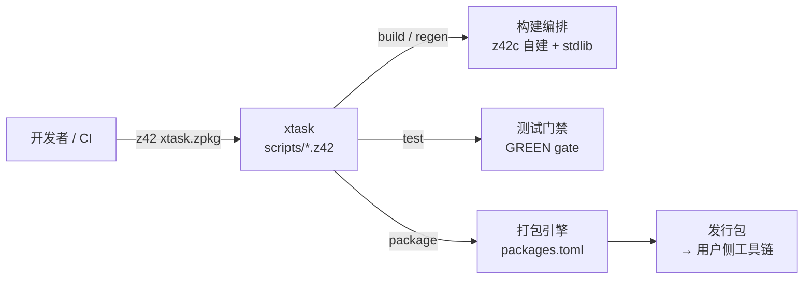

# 第六部分 · 开发基础设施（Development Infrastructure）

> **页型**: 概览页 ｜ **代码**: `scripts/` ｜ **对齐**: 2026-07-02

面向 **z42 仓库开发者**的基础设施：怎么构建、怎么测试、怎么打出发行包。核心是 **xtask**——
纯 z42 写的自举 dev CLI，所有开发动作的单一入口。语言用户请看[第五部分 · 工具链](../toolchain/README.md)
（launcher、平台发行等对外部分）。

## 全景

xtask 编排三条产线：构建（自举链）、测试（GREEN 门禁）、打包（产出第五部分描述的用户侧工具链）。

## 章节导航

| 章节 | 讲什么 |
|------|--------|
| [xtask：自举 dev CLI](xtask.md) | xtask 定位、自举链路、CLI 分发架构、--toolchain 机制 |
| [构建编排（build / regen）](build.md) | z42c 七包自建拓扑、stdlib 自建三阶段、golden 基线重生 |
| 测试门禁（test gate）（待写） | GREEN gate stage 串联、--scope 决策、不动点验证 |
| 打包引擎（packages.toml）（待写） | 组件注册表、staging handler、按 RID 组装 |

基础层（怎么用、命令清单、目录结构、迭代注意点）见 `scripts/README.md` 与 `docs/workflow/`
——本部分只讲设计与机制，不重复用法。

## 迁移状态（旧 design 相关文档 → 本部分）

> ⬜ 待迁 · 🟡 迁移中 · ✅ 已迁并校对。

| 旧文档 | 目标章节 | 状态 |
|--------|---------|------|
| toolchain/build-orchestrator.md | （z42b 前瞻未实施——已记入 [xtask · Deferred](xtask.md)） | ✅ |
| testing/test-runner-bootstrap.md | 测试门禁 | ⬜ |
