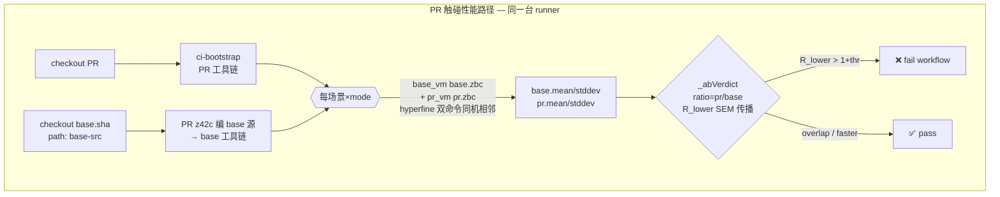

# 性能基准与回归门禁（benchmark / bench gate）

> **页型**: 机制页 ｜ **状态**: ✅ 已实现 ｜ **代码**: `scripts/xtask_bench.z42` · `src/tests/perf/` · `.github/workflows/bench-pr.yml`
> **相关**: [xtask](xtask.md) · [测试门禁](test-gate.md) ｜ **对齐**: 2026-09-05

## 概述

benchmark 基础设施回答一个问题：**这次改动让 z42 变慢了吗？** 它由三部分组成：

1. **度量**——`xtask bench` 跑一组端到端场景（`src/tests/perf/scenarios/*.z42`），每条产出带
   置信区间的结构化结果（schema v2）；`xtask bench stdlib <lib>` 跑库内 `[Benchmark]` 微基准。
2. **分层**——场景在源码头部声明 `// tier: gate | full`。`gate` 是 PR 门禁测量的那一小组代表性场景，
   `full` 是其余（本地 / 按需）。`xtask bench` 默认 `--tier all`，CI 传 `--tier gate`。
3. **门禁（同-runner A/B）**——PR 触碰性能敏感路径时，`bench-pr.yml` 在**同一台 runner** 上建 PR
   与 base（merge-base）两套工具链，`xtask bench --ab` 让每个场景在两套下**同机相邻**编译+测量，按
   比值 95% 下界判红。这取代了旧的「拉另一台 runner 的 baseline 快照做跨-runner diff」——那种比法
   被 ±26–60% 的 between-run 系统偏移主导，区间几乎总重叠、门禁近乎失明。

> **本页是 bench 的权威（SoT）**——判红规则、数据流、为什么这样设计，以及末尾的
> [操作速查](#操作速查)（跑哪条命令、怎么加场景）。改门禁语义 → 改这里。
> （2026-09-05 起：原先分担操作速查的 `bench/README.md` 已随顶层 `bench/` 目录一并删除，
> 内容并入本页；资产现居 `src/tests/perf/`，见 `docs/design/testing/testing.md`。）

## 设计目标与约束

- **门禁必须可信且能抓到真回归**：共享 CI runner 的 wall-clock 噪声可达 ±60%（见
  [测试门禁](test-gate.md) 与 `docs/design/testing`）。**但这噪声主要是 between-run（跨-runner /
  跨-job）系统偏移**——同一 runner 内 within-run 抖动小得多。旧门禁拿「另一台 runner 的 baseline
  快照」对比，被 between-run 偏移主导 → 区间总重叠 → 判红几乎不触发（既不假报、也**抓不到真回归**）。
  **核心约束：门禁既不能假报、又必须能抓真回归**——解法是把对比搬进**同一台 runner**（见下 A/B）。
- **同-runner 抵消（A/B 门禁的地基）**：base 与 pr 在同机、同 job、相邻数秒内测量 → 该机器的整体快慢
  因子 `k` 同时乘进两侧，`ratio = (k·t_pr)/(k·t_base) = t_pr/t_base`，`k` 约掉。剩下只有 within-run
  抖动，可由 SEM 量化 → 比值置信区间**才第一次统计有效**（跨-runner 比法下 SEM 不成立）。
- **不采集额外数据**：判定复用结果 JSON 里 hyperfine / Bencher 已产出的 `ci_lower`/`ci_upper`，
  不为门禁跑第二遍。区间越宽（噪声越大）门禁越保守——正合共享 runner。
- **画像隔离**：interp 与 jit、不同 os/arch 的数字**从不互比**。每条结果带一个
  `profile`，diff 按 `(name, metric, mode_label@os/arch)` 精确匹配。
- **micro 与 e2e 分工**：e2e（ms 级）守粗粒度全管线；micro（ns 级）守 stdlib 函数级与 VM 内部热路径。
  ns 级**单快照跨-runner** 比过敏，故 micro 也走**同-runner A/B**（base 树 vs pr 树同机各测一遍）才进门禁。

## 方案与决策

| 决策 | 选择 | 理由 |
|------|------|------|
| **PR 门禁比法** | **同-runner A/B**（base 与 pr 同机相邻测量，比比值）| 跨-runner baseline 快照被 ±26–60% between-run 偏移主导，门禁失明；同机测量让 `k` 约掉，才既不假报又能抓真回归 |
| **A/B 判红准则** | **比值 95% 下界 R_lower > 1+thr**（SEM 误差传播）| 同机抵消后 within-run SEM 才有效；对商做误差传播得比值置信区间，下界超阈值 = 有把握判回归 |
| **可疑即复测** | 初判回归的条目**再测 2 轮**，区间改由**跑间比值离散度**给出 | 单轮区间只见得到跑内方差，跨进程那部分（CPU 频率 / page cache / GC 起始状态 / 布局彩票）压根没被建模 ⇒ 低估约三倍。重测同一份二进制、看比值散多开，是唯一能把那部分**量出来**的办法。只有被标记的条目付这个代价 ⇒ 干净 PR 零开销（见「可疑即复测」）|
| **A/B 交错** | hyperfine 双命令单 invocation（`env Z42_LIBS=… vm …` 前缀）| 两侧相邻数秒、各带自己的 libs；逐次交错属过度工程 |
| 区间感知 diff（本地） | `bench --diff`：**区间分离 AND 均值超阈值** | 旧 PR 门禁准则（P0）；现降级为本地「优化前后对比」工具，需显式 `--baseline <path>` |
| 区间来源 | 复用结果 JSON 已有的 `ci_lower`/`ci_upper` | e2e 由 hyperfine 的 min/max 产、micro 用采样 min/max 充当；不采集新数据，零额外成本 |
| 缺区间回落 | 任一侧缺 `ci_lower`/`ci_upper` → 裸均值比值门禁，标 `(no-ci)` | 老格式 / 外部结果无 CI 时仍可判，只是回到宽松语义，显式标注让读者知道判据降级了 |
| **阈值** | 时间 5%（`--threshold-time` 默认）/ **CI 用 0.15** / 内存 10% | **阈值必须高于噪声底**，否则假红是数学必然（见「噪声底与阈值」）。0.25 是**在噪声底之上躲着走**的权宜之计；有了可疑即复测把不确定度真的量出来，才有依据收回 0.15。**收阈值与复测是同一件事的两半**——单独收阈值就是退回假红。内存指标暂为 informational |
| **场景分层** | `// tier: gate \| full` 头部声明；CI 传 `--tier gate` | 门禁只需一小组代表性场景。**这同时把每 PR 的比较次数从 87 降到 6~12**，多重比较的假红概率随之降一个量级——分层不只是省时间 |
| 画像键 | `(name, metric, mode_label@os/arch)` | interp/jit、跨平台结果隔离，杜绝 interp 的数字被拿去比 jit 基线 |
| **micro 进 CI** | **硬门禁**（2026-09-06 恢复；此前只打印不判红） | 降级的原因是区间不可信：Bencher 的 stddev 是**进程内**批次样本方差，而 base/pr 是两个独立进程 ⇒ 低估约三倍，「区间分离」这道保险不成立。可疑即复测把缺的那部分方差**测出来**了，硬门禁靠的是这个，不是把阈值调松 |
| **criterion 进 CI** | **只打印、不判红**（2026-09-06 降级；此前硬门禁） | 它的 bootstrap CI 同样是**跑内**的，`--baseline` 比的却是两次独立跑 ⇒ 与 micro 同源的缺陷。战绩为证：至今 **0 次真阳性、3 次假红**。这一层不上复测是因为代价不成比例（一轮约 390s，重采两轮 ≈ +780s）；保留测量与打印作诊断材料 |
| 基线存放 | **不存**（`bench-update.yml` + `bench-baselines` 分支已删） | 它早已不喂门禁，却每次 push main 烧一个 job、往孤儿分支累积了 1249 条机器提交。趋势记录若要恢复，应落在独立的数据仓，而不是代码仓的分支 |

## 三层度量 tier

| tier | 工具 | 位置 | 粒度 | 进 CI 门禁 |
|------|------|------|------|-----------|
| **z42 e2e** | hyperfine + 自建 harness | `src/tests/perf/scenarios/` + `xtask bench` | 整程序 wall-clock（VM 启动 + stdlib 加载 + 执行），ms 级 | ✅ `bench-pr.yml` 硬门禁（**只测 `--tier gate`**） |
| **z42 micro** | `[Benchmark]` + `Std.Test.Bencher`（z42b 派发）| 各 lib `bench/*_bench.z42` | 单操作（`String.Replace` / `SortedSet.Add` …），ns 级 | ✅ **硬门禁**（`bench --micro-diff` + 可疑即复测；2026-09-06 恢复） |
| **Rust micro** | criterion | `src/runtime/benches/` | VM 内部热路径（GC cycle / smoke）| ⚠️ **只打印、不判红**（2026-09-06 降级；仅 src/runtime 改动时才测） |

**e2e** 捕获全管线回归（启动开销 / dispatch / 整体吞吐）；**micro** 把回归定位到具体函数、守 stdlib
热路径。两层现在都是硬门禁，且都由[可疑即复测](#可疑即复测ab-resample-on-suspicion2026-09-06)决定最终判定
——它们此前的共同病根是「区间低估约三倍」，复测把那部分方差测出来之后病根就没了。

**criterion 是唯一只打印不判红的一层**：同样的病根，但它的复测代价不成比例（一轮 A/B 约 390s），
而 GC 热路径的真回归会在 e2e 的 gate 场景里露头（`gc_cycle_bench` 链接整个 crate，挪得动它的
VM 改动也挪得动场景）。改 GC 后自己去 CI 日志里看那几条区间。

### micro 同-runner A/B（`bench --micro-diff`，Part B）

micro `[Benchmark]` 在 z42b 里**进程内**跑，base 与 pr 的同名 stdlib zpkg 无法共载（不像 e2e 每场景一个
独立 z42vm 子进程）。故同-runner A/B 用**两个隔离的 `bench stdlib --json` 基线**实现：

1. **PR 树**跑 `bench stdlib --json micro-pr.json`（PR 工具链编+跑全 stdlib `[Benchmark]`）。
2. **base(merge-base) 树**跑同样命令 → `micro-base.json`（base 工具链，复用 CI「Build base toolchain」步已建
   的 base 编译器+stdlib，仅新建 base z42b）。
3. `bench --micro-diff --current micro-pr.json --baseline micro-base.json` 逐基准（按 `name` + 画像键配对）
   `_abVerdict`——与 e2e 共用同一判红纯函数。

⚠️ **这一层在 CI 里只打印、不 fail job**（simplify-bench-gate）。同机顺序测量确实让机器因子在比值抵消，
但它**没有**消掉进程间那部分方差，而 `Bencher` 的 stddev 又只测进程内——两者一叠加，区间比真实噪声窄约
三倍，判红退化成抽签。完整数据与现场见「[噪声底与阈值](#噪声底与阈值simplify-bench-gate2026-09-05)」。
PR 新增/改名的基准在 base 无对应 → 信息性 skip。

### Bencher 统计与自适应采样（`Std.Test.Bencher`）

micro tier 的每个 `[Benchmark]` 用 `Bencher` 采样，`printSummary` 产出一行契约：

```
bench[<label>] min=<n>ns median=<n>ns max=<n>ns mean=<n>ns stddev=<n>ns samples=<n>
```

- **mean / stddev**（extend-ab-bench-micro-criterion）：`mean=`/`stddev=` 是 SEM 传播的输入，供
  micro tier 的同-runner A/B 门禁（与 e2e 同套 `_abVerdict`；见上「micro 同-runner A/B」）。是**追加
  字段**——旧 summary line（无 mean/stddev）仍能被 `BenchStats.parse` 解析，缺失记 -1，下游按「无 CI」降级。
- **自适应采样**：默认构造 `new Bencher()` 现按 **~50ms 测量预算**自动选采样数 n（先跑 15 次 pilot
  估单次成本，再 clamp 到 [20, 2000]）——快基准多采样（CI 更紧）、慢基准少采样（墙钟有界）。
  显式 `new Bencher(warmup, samples)` 保持**固定** samples（无自适应），既有 tuned 基准行为不变。
- stddev 是**总体**方差（÷n）、四舍五入到 ns；亚-ns 离散 round 到 0 → 下游判「无 CI」→ 裸比值，
  安全不假红。

### criterion(Rust) 同-runner A/B（Part C）

Rust VM 内部热路径（`src/runtime/benches/gc_cycle_bench.rs`：cycle_heavy / shallow_tree / large_array）
用 **criterion 原生的同-runner baseline 对照**，不复用 z42 侧 `_abVerdict`——criterion 自带 outlier
检测 + bootstrap CI + 变化判定，比手搓 SEM 更权威：

1. **base(merge-base) 树**：`cargo bench --bench gc_cycle_bench -- --save-baseline ab-base`。
2. **PR 树**：`cargo bench --bench gc_cycle_bench -- --baseline ab-base`（criterion 报每个基准的均值变化 %）。
3. 共享 `CRITERION_HOME` 让两树的结果相遇；读 `<bench>/change/estimates.json` 的
   `mean.confidence_interval`——**整个 95% 区间在 +25% 之上（`lower_bound > thr`）** 的条目被
   标记出来。点估计不单独参与判定：它落在区间里，**区间才是结论**。

   > ⚠️ **2026-09-06 起这一层只打印、不 fail job**（demote-criterion-to-informational）。
   > 判定条件原样保留——它仍是「这条值得人看一眼」的最好线索，只是不再替人做拦不拦的决定。
   > 依据是它自己的战绩：至今 **0 次真阳性、3 次假红**（#423 一次；#457 两次，且那两次是在
   > base 与 pr 的 VM 代码**逐字节相同**的对照上判的）。它判红所依赖的证据与 micro 被降级时
   > 同源：bootstrap CI 也是**跑内**的，而 `--baseline` 比的是两次独立跑，跑间漂移（实测单条
   > 极差 15~32pp）它结构性地看不见。
   >
   > 那为什么不像 e2e/micro 一样上[可疑即复测](#可疑即复测ab-resample-on-suspicion2026-09-06)？
   > 代价不成比例：一轮 criterion A/B 约 390s，重采两轮 ≈ +780s，比它守住的东西贵得多。
   > **但别顺手把测量也删掉**——删了就再没有 GC 内部热路径的观测点。

   > ⚠️ **2026-09-05 前这里是 `pe > thr and lo > 0.0`**，把「CI 分离」实现成了「下界大于**零**」，
   > 于是 `[+0.5%, +60%]` 这种毫无信息量的宽区间照样算「分离」——实测踩中两次全是假红，见
   > 「[判红规则的一处实现偏差](#判红规则的一处实现偏差2026-09-05修)」。

**`concurrent_*`（多线程）基准仅信息性、不判红**：criterion 的 `--baseline` 比的是**两次独立跑**（base 先存、
pr 再比），线程 GC 基准在共享 runner 上的**跑间线程调度噪声**很大（实测：一个 perf-中立的纯注释 PR，
concurrent 基准摆动 +6~33%，单线程基准却居 0 附近）。criterion 紧的**跑内** CI 抓不到这种跑间漂移，硬判会
假红。故 concurrent 基准不 fail job；单线程 GC 基准照常硬门禁。

**且 CI 里连测都不测**（lighten-criterion-ab，2026-09-05）：既然从不判红，每个碰 VM 的 PR 为它们花的
75s（criterion 步骤的 14%）就是纯开销。workflow 设 `Z42_BENCH_SKIP_INFORMATIONAL=1`，
`gc_cycle_bench.rs` 的 `skip_informational()` 据此跳过并**打印一行**（不静默）；本地 `cargo bench`
不设这个变量，照常全跑。**这是排除法不是白名单**：新加的 bench 默认进门禁，只有在源码里显式标成
informational 的才可能被跳过——同「[改动面守卫](#改动面守卫为什么是排除文档而不是列白名单)」的取向，
最坏错向「多跑一条」，不会错向「静默少跑」。

**仅当 PR 触碰 `src/runtime` 的非文档文件时跑**（`git diff --quiet base..HEAD -- src/runtime
':(exclude,glob)src/runtime/**/*.md'` 为真则跳过——VM 字节相同、结果必不动）。**`*.md` 的排除是必要的**：
该目录下有 13 个 README，#442 只动了 `src/runtime/benches/README.md` 一行，就白跑 criterion 463s +
重建 base z42vm 98s（约 9 分钟）。见「[改动面守卫](#改动面守卫为什么是排除文档而不是列白名单)」。
`smoke_bench.rs` 是纯 Rust sanity（不碰 VM），保留作「criterion 装置能跑」自检、
**不纳入门禁**。

## 执行画像（profile，schema v2）

每条结果带一个 profile，标明它在什么执行组合下测出，避免误比：

- **mode**：`{tiers, aot_pkgs}`。`tiers` = 活跃后端（`interp` 恒在，可 `+jit`）；`aot_pkgs`
  = 预编 AOT 的 zpkg 子集（今天恒空，待 roadmap M9）。派生 `mode_label`：`interp` / `jit`。
- **platform**：`{os, arch}`（arch 归一化 `x64`/`arm64`/`wasm`）。
- **caps**：由 `Std.Platform.Capabilities()` 在**被测 VM 二进制**下探测
  （`src/tests/perf/probe/capabilities.z42`）——`jit` / `native-interop` / `threads` 等真实能力。

`xtask bench --mode interp|jit|both`（含 `--ab`）：`both` 每场景各测 interp 与 jit，产两条结果。
A/B 门禁对**同一 scenario×mode** 在 base/pr 两套工具链间比较，interp 与 jit 各自比、从不交叉；
`--diff` 按 `mode_label@os/arch` 匹配基线，同样两模式隔离。

## 机制

### 同-runner A/B 判红（PR 主门禁，核心）

PR 门禁在**一台 runner** 上建两套工具链，同机测量、比比值：



**base 工具链怎么来**：ci-bootstrap 的 composite 头一步 `cd $(git rev-parse --show-toplevel)` 会锁回 PR
checkout，无法指向 base-src，故**不复用它建 base**；改用**已 bootstrap 的 PR z42c 直接编 base 源**（新
编译器编旧源恒成立，staged-bootstrap 纪律）：PR z42c 编 `base-src/src/compiler` → base z42c，再由 base
z42c 编 `base-src/src/libraries` → base stdlib。**只测 scenario 运行时**，故 base driver 由 PR z42c 生成
其字节码这点对测量零影响——它跑的仍是 base 的 codegen 逻辑，产 base 风格的 scenario .zbc。z42vm 复用：
`git diff base..pr -- src/runtime`（排除 `*.md`）无变更时 base_vm = pr_vm，省最重的 cargo 建。

判红纯函数 `_abVerdict`（`scripts/xtask_bench.z42`；`bench --ab-selftest` 单测五例，**CI 每次跑**，见下「CI 门禁接线」第 3 步）：

```
SEM_b = stddev_b / sqrt(n_b);   SEM_p = stddev_p / sqrt(n_p)
ratio = mean_p / mean_b
relSE = sqrt( (SEM_p/mean_p)^2 + (SEM_b/mean_b)^2 )     # 商的误差传播
R_lower = ratio * (1 - Z*relSE);  R_upper = ratio * (1 + Z*relSE);  Z=1.96 (95%)

if R_lower > 1 + thr:   → ↑ regression   (fail, exit 1)   # 95% 有把握真实比值超阈值
elif R_upper < 1 - thr: → ↓ faster        (informational)
else:                   → ≈ overlap       (noise, 放行)
缺 stddev/n（n≤1 或 stddev≤0）→ 回落裸比值 ratio>1+thr，标 (no-ci)
```

- `thr` 默认 **0.10**；**CI 用 0.15**——见下「噪声底与阈值」与「可疑即复测」。`Z=1.96`。
- 结果落 `artifacts/bench/ab.json`（`ab-v1` schema：每场景 base/pr mean·stddev、ratio、r_lower/r_upper、
  verdict），信息性 artifact，不复用 baseline-schema。
- **同机抵消让 within-run SEM 在此统计有效**——这是 P0 跨-runner 比法下不成立、A/B 下才成立的关键。
  但**只到跑内为止**：跨进程那部分方差它仍看不见，所以初判之后还有下一节这一道。

### 可疑即复测（ab-resample-on-suspicion，2026-09-06）

**它治的缺陷**：上面那个 SEM 来自**一次** hyperfine invocation 的跑内样本方差，而 base 与 pr 是
两个独立进程。进程间那部分方差（CPU 频率、page cache、分配器与 GC 起始状态、代码布局彩票）
**根本没进模型**，于是声称区间比真实窄约三倍——这就是「[噪声底与阈值](#噪声底与阈值simplify-bench-gate2026-09-05)」
的缺陷 ②，也是阈值此前只能停在 0.25（噪声底之上）的原因。

**做法**：第一轮照常测；**只对初判 `R_lower > 1+thr` 的条目**，把同一份二进制再测 2 轮，拿到
k=3 个独立比值，用**它们之间的离散度**重算区间：

```
ratio_i = pr_mean_i / base_mean_i          # 第 i 轮，i = 1..k
R_lower = mean(ratio) − t(单侧 95%, df=k−1) · sd(ratio)/sqrt(k)
regression ⟺ R_lower > 1 + thr             # 与其他各路同一条规则
```

- **单侧**，与 `_abVerdict` 的双侧 Z=1.96 不同：门禁问的本来就是单侧问题（「pr 是不是慢了超过
  thr」），而 k=3 时双侧分位数 4.303 会把余量做到 2.48·sd（单侧 2.920 是 1.69·sd），钝到连
  真的 +20% 回归都放过去。两者的严格度并不像常数看上去那样矛盾：`_abVerdict` 把名义上更严的
  分位数用在一个**已知偏小三倍**的离散度上，实际覆盖率反而是两者中更松的那个。
- **成本只落在被标记的条目上**：干净 PR 一分钱不花；实际标记通常 1~2 条 ⇒ e2e +30~60s。
  e2e 的复测在 `xtask bench --ab` 进程内完成；micro 因为是整进程一次采 65 条，按**整轮**重采
  （见下）。
- **预算上限**：e2e 一次最多复测 3 条（`_benchAb` 的 `resampleBudget`）。标记数超过上限本身
  就是「广泛真回归」的证据，剩下的条目保留初判（即判红），而不是烧掉无上界的 runner 时间去
  确认一个已经很可能的答案。
- **关掉它**：`bench --ab --resample-rounds 0`（回滚旋钮）。**但阈值必须同时退回 0.25**——
  0.15 是复测换来的，不是可以单独享用的。

**实测证据**（本机，`--quick`，base 与 pr 是**同一份二进制**，`01_fibonacci`）：三轮比值
**1.058 / 0.978 / 0.828**，跨 23pp。第 1 轮那个 1.058 配上很窄的跑内区间就是一条假红；复测
给出 `R_lower=0.758 / R_upper=1.151` ⇒ overlap 放行。**跑间漂移不是理论，它就是这么大。**

**为什么 micro 不按 benchmark 名过滤重采**：`bench stdlib --filter` 过滤的是**文件名**而不是
benchmark 名，要按名重采就得新造一层 benchmark→文件 的映射——映射错了是**静默少测**（门禁
变瞎），而整轮重采最坏只是多花时间（约 +180s，且只在标记时发生）。与
[改动面守卫](#改动面守卫为什么是排除文档而不是列白名单)同一条取向：宁可多做，不可漏。

**接口**：`bench --micro-diff --current a.json,b.json,c.json --baseline x.json,y.json,z.json`
——两侧轮数必须相等（不等 = 用法错误 exit 2，不是「没有回归」）。给一份就是原来的单轮路径。
某条 benchmark 没有出现在**每一轮**里 ⇒ 打警告并**排除出门禁**（来来去去的条目不构成回归证据；
静默丢弃则是门禁变瞎的老路）。

### 区间感知 diff（`bench --diff`；历史 dashboard 对比，非 PR 门禁）

> **P0 时期的 PR 门禁准则，现已退休为纯本地的「优化前后对比」工具**（不再由 bench-pr 调用）。
> `bench-update.yml` 与 `bench-baselines` 孤儿分支已于 simplify-bench-gate 删除（那条分支累积了
> 1249 条机器提交、同一个 JSON 反复覆盖，而它早已不喂门禁），故 `--diff` **必须显式给
> `--baseline <path>`**，不再自动挑一份主分支基线。判红语义如下：

对每条 current 结果，按画像键在 baseline 里找对应项（`_findBenchObj`），然后：

```
delta = (cur.value - base.value) / base.value       # 相对均值变化
thr   = 内存指标 ? threshold-memory : threshold-time  # 默认 时间 5% / 内存 10%；CI 显式传 0.15

if 双方都有置信区间 (_hasCi):                          # 主路径
    if delta > thr   AND cur.ci_lower > base.ci_upper:  → ↑ 回归   (regressions++)
    elif delta < -thr AND cur.ci_upper < base.ci_lower:  → ↓ 改进
    elif |delta| > thr:                                  → ≈ (overlap)  # 均值超阈值但区间重叠 = 噪声，不判红
    else:                                                → ≈           # 均值也没超阈值
else:                                                # 回落：任一侧缺 CI
    标 (no-ci)
    if delta > thr:  → ↑ 回归   (regressions++)        # 裸均值比值（老语义）
    elif delta < -thr: → ↓ 改进

exit = regressions > 0 ? 1 : 0
```

判红的**充要条件是双条件同时成立**：`delta > thr`（均值确实超阈值）**且**
`cur.ci_lower > base.ci_upper`（当前置信区间整体高于基线置信区间，即两次测量统计上可区分）。

**区间重叠 ⇒ 一律不判红**，无论 delta 看起来多大。这是压掉共享 runner 假红的关键：一次
+11% 的均值抬升，若两个区间仍重叠，就是同一分布的两次抽样，判为 `(overlap)` 噪声、放行。

改进（`↓`）对称要求区间反向分离，但**从不 fail**，只作展示。

### 噪声底与阈值（simplify-bench-gate，2026-09-05）

**这一节是阈值取值的依据，改阈值前必须先读。** 门禁在此之前每个 PR 期望假红约 2 条，最近 4 次
`bench-pr` 失败逐条核对**全部是假红**——三个叠加缺陷：

**① 判红阈值画在噪声底之下。** 拿两个**应当 perf-neutral 的 PR** 反推真实噪声（比值对数标准差 ×1.96）：

| 层 | 探针 PR | 比值散布 | **真实噪声(95%)** | 声称的区间宽度 |
|----|---------|---------|------------------|----------------|
| e2e（22 条） | 编译器注册键重构 | 0.932 – 1.239 | **±13%** | 中位 7.9% |
| micro（65 条） | GC loom 建模（不碰 crypto） | 0.747 – 1.115 | **±16%** | 中位 4.8%、最窄 **0.25%** |

旧阈值 10% 低于这个噪声底 ⇒ 筛出来的必然主要是噪声。**2026-09-05 抬到 0.25**（留安全边际），
**2026-09-06 收回 0.15** —— 收得动的唯一原因是[可疑即复测](#可疑即复测ab-resample-on-suspicion2026-09-06)
把不确定度真的量出来了，不是因为噪声变小了。

> **代价说清楚**：抓不到阈值以下的真回归。0.25 时期这个代价是自觉付的——旧门禁**也抓不到**，
> 真信号淹在假红里没人认真看，而历史上真正需要拦住的量级（把 #421 的负缓存 revert = **1.93×**）
> 远超 25%。**一个 25% 阈值但没人忽略的门禁，强过一个 10% 阈值但被当噪声跳过的门禁。**
> 复测把这个代价降到 15%，且**没有**用「调松判据」换——判据反而更严了（跑间离散度 > 跑内）。

**② 声称的置信区间被系统性低估 ⇒「区间分离」这道保险失效。** micro 声称的区间中位仅 4.8%，
而真实噪声 ±16%——**低估约三倍**。根因：`Bencher` 的 `stddev` 是**单个进程内批次样本**的离散度，
而 base 与 pr 是**两个独立进程**，进程间那部分方差（CPU 频率 / page cache / 分配器与 GC 起始状态 /
[代码布局彩票](#启动类微小回归先排除布局彩票cache-failed-name-resolution2026-09-04)）完全没被建模。
判红因此退化成「谁的区间碰巧最窄」的抽签——同一批数据里的现场：

| 基准 | 比值 | 声称区间 | 判定 | 为什么是假红 |
|------|------|---------|------|-------------|
| `crypto.sha256_4k` | 1.115 | ±0.15% | ↑ 判红 | 区间窄到离谱，恰好把 1.10 顶出去 |
| `crypto.sha256_small` | 1.110 | ±0.8% | ≈ 放过 | **同量级的同一效应**，只因区间稍宽就没红 |
| `crypto.aes_cbc_4k` | 0.810 | ±0.06% | ↓ 快 19% | GC 改动不可能让 AES 快 19%，却被宣称为极高置信 |

e2e 情况好些（hyperfine 跨 10 次**进程启动**采样，声称 7.9% vs 真实 13%，低估约 1.6 倍）但仍不够，
故 e2e 保持硬门禁、**micro 降级为只打印不判红**。

**③ 每个 PR 做 22+65=87 次比较、不做多重比较校正。** 即便区间完美标定，单侧 95% 下期望假红也有
`87 × 0.025 ≈ 2.2` 条；只要任意一条撞上，整个 job 红。**场景分层（`--tier gate`）把比较数降到 6~12**，
这是分层最容易被低估的收益。

**已落地（2026-09-06）——「可疑即复测」**：缺陷 ② 的正解是第一轮照常测，**只对初判
`R_lower > 1+thr` 的那 1~2 条**再测 k=3 轮，用**三个独立比值之间的离散度**重算区间——那才是真实的
不确定度。因为复测只发生在少数条目上，成本约 +30~60s 而非 ×3。做法与实测证据见
「[可疑即复测](#可疑即复测ab-resample-on-suspicion2026-09-06)」。

随之而来的两项，都是**它换来的**、不能单独享用：
- **阈值 0.25 → 0.15**（e2e 与 micro 同）。0.25 是在噪声底之上躲着走；有了真实不确定度才有依据收。
- **micro 恢复硬门禁**。缺陷 ② 是它当初被降级的唯一原因，原因消失了。

缺陷 ③（多重比较）**未变**，仍靠场景分层压：e2e 6~12 条比较。micro 那 65 条比较没有分层，
它现在能硬门禁靠的是复测把每条的区间做实，不是比较数变少了——这两条要分开记。

### 判定结果的四种标注

| 符号 / 标注 | 含义 | 是否 fail |
|-------------|------|-----------|
| `↑` | 真回归：均值超阈值 **且** 区间分离 | ✅ exit 1 |
| `↓` | 真改进：均值降超阈值 **且** 区间反向分离 | ✗ |
| `≈ (overlap)` | 均值超阈值但区间重叠 → 噪声 | ✗ |
| `≈` | 均值未超阈值 | ✗ |
| `(no-ci)` | 某侧缺置信区间 → 回落裸均值比值判定 | 视 delta |
| `(new)` / `(removed)` | 仅一侧存在该项 | ✗（informational）|

输出示例（`↑` 是真回归；+11% 那条均值超阈值但区间重叠 → 判噪声不 fail）：

```
  01_fibonacci [time jit@linux/x64]  90 ms → 130 ms  ↑ 44.4%
  02_math_loop [time jit@linux/x64]  50 ms → 100 ms  ≈ 11.1% (overlap)

❌ 1 regression(s) — delta over threshold AND CI-separated (out of 2 benchmarks)
```

### CI 门禁接线（bench-pr.yml）

触发路径刻意收窄（`src/runtime` / `src/libraries` / `src/compiler` / `src/tests/perf` /
`scripts/**/*.z42` / 本 workflow），末尾再加一条负向模式 `!**/*.md`（负向在后 ⇒ 覆盖前面的匹配），
使**纯文档 PR 一个文件都不命中、整个 workflow 不触发**；`.md` 与代码同改则照旧跑。
（没有这条负向模式时，上面的目录通配会把「改一行 `src/tests/perf/` 下的说明」也拉进来烧一个完整 job。）步骤：

1. checkout PR + checkout `base.sha`（`path: base-src`，两者 `fetch-depth: 0`）
2. bootstrap PR 工具链（`ci-bootstrap`：nightly z42c 种子 → 当前源码 warm 自建）
3. **判红逻辑自检**（move-bench-into-tests / cover-micro-verdict，2026-09-05）：把**三条判红
   路径**都用可复现输入钉住。纯 JSON / 纯函数，实测 **1.2s**，放在测量之前 ⇒ 规则改坏立刻
   失败而不是等二十分钟。

   | 路径 | 怎么测 | 用例 |
   |---|---|---|
   | `_abVerdict` + `_abResampleVerdict`（纯函数） | `bench --ab-selftest` 单测 | 10（5 + 5）|
   | `_benchDiff`（`--diff`，历史/本地对比） | `testdata/current-*.json` vs `baseline.json` | 4 |
   | `_microDiff` 单轮（`--micro-diff`） | `testdata/micro-*.json` vs `micro-base.json` | 7 |
   | `_microDiff` **复测**（三轮 × 两侧） | `testdata/micro-rs-*-r{1,2,3}.json` | 4 + 1 用法错误 |

   `_abVerdict` 与 `_abResampleVerdict` **喂不了 JSON fixture**（需两套同机实测的真工具链），
   但它们是纯函数 ⇒ 单测是它们唯一的机械覆盖。所有 fixture 都跑 **thr 0.15（门禁在用的那个）
   与 0.25 两遍**：每条套件里都有一个只在其中一个阈值下翻红的用例（单轮的
   `separated-under-threshold`、复测的 `rs-mid`），它是**唯一对阈值本身敏感**的用例 —— 没有它，
   把 `--threshold-time` 降到 0.001 结果都纹丝不动（实测过），即门禁根本没在看阈值。
   micro 单轮另有两条 `fallback-*` 行使**无 SEM 的区间回退路径**（base 侧 `mean_ns=-1`），
   和一条 `unmatched`：三个各放大 3× 的条目，其 name 或 mode key 在 base 无对应 ⇒ 必须被
   **跳过**，匹配一旦放松就翻红。

   > ⚠️ **0.15 那一列必须跟着门禁实际用的阈值走。**改了 `--threshold-time` 而没改自检，
   > 等于自检不再检门禁在跑的那套规则。

   复测四例各守一件事：`rs-drift`（第 1 轮 +60%、后两轮 +5%/+10%，**均值 1.25 本身在阈值之上**
   ⇒ 只有区间宽度真的算了才放行 —— 这就是复测要杀的那条假红）、`rs-real`（每轮都 +30% ⇒ 仍判红，
   证明复测没把门禁弄瞎）、`rs-mid`（对阈值敏感的那条）、`rs-missing`（回归条目缺席第 3 轮 ⇒ 必须
   被排除 ⇒ 放行）。**base 三轮的数值故意各不相同**，所以轮次配错会改变比值。

   **反向验证**（做过五次，别只信正向绿 —— 正向绿只证明 fixture 与当前实现一致，不证明实现坏掉时它会叫）：

   | 注入缺陷 | 谁抓住 | 谁**没**抓住（值得记） |
   |---|---|---|
   | `_abClassify` 的 `RLower > 1+thr` → `> 1.0` | `--ab-selftest` + 3 条 micro + `rs-mid@0.25` | `_benchDiff`（有自己的门，不走 `_abClassify`）|
   | `_microVerdict` 回退分支 `cLo/bHi` → 裸比值 | `fallback-overlap` | — |
   | `_abResampleVerdict` 的 `t` → 0（区间宽度算没了）| `--ab-selftest` + `rs-drift@0.15` | 均值在阈值**之下**的 drift 用例（所以 fixture 特意选了均值在阈值之上的）|
   | 轮次错配（base 恒取第 1 轮）| **只有** `rs-mid@0.15` | `--ab-selftest`（纯函数不受影响）⇒ **纯函数自测与接线 fixture 两层缺一不可** |

   **覆盖边界**：守的是**判定规则**，不是测量与编排 —— `_abOneScenario` 的 hyperfine 调用、
   base 工具链构建、micro 基线采集只能靠真 run 行使。
4. **建 base 工具链**（同 runner）：`git diff base..pr -- src/runtime`（排除 `*.md`）无变更 → base_vm=pr_vm，否则
   cargo 建 base z42vm；PR z42c 编 `base-src/src/compiler`→base z42c，base z42c 编 `base-src/src/libraries`→base stdlib
5. **e2e A/B（硬门禁）**：`xtask bench --ab --tier gate --mode $MODE --threshold-time 0.15 --base-vm/-libs/-driver …`。
   `MODE` 按改动面收窄：`src/runtime`（排除 `*.md`）无变更 → `jit`（interp/jit 的相对性能只可能被 VM 改动挪动），
   否则 `both`。初判回归的条目在**进程内**自动复测 2 轮（见「可疑即复测」），最终 `R_lower > 1+thr`
   → exit 1 → fail workflow；上传 `artifacts/bench/ab.json`（含每轮比值 `round_ratios`）
6. **micro A/B（硬门禁）**（Part B）：PR 树 + base 树各 `bench stdlib --json`（base 树复用 3 建的工具链、
   仅新建 base z42b）→ 第 1 轮 `bench --micro-diff --suspects …` **只点名不判红**；
   `suspects` 为空 ⇒ 直接通过（**零额外开销**，与降级时期同价）；非空 ⇒ 再采两轮（两棵树各一次，
   约 +180s），最后用三轮做 `--micro-diff --current a,b,c --baseline x,y,z` **判红**
7. **criterion A/B（informational，永不 fail）**（Part C，仅 `src/runtime` 非文档改动时）：base 树
   `--save-baseline ab-base`、PR 树 `--baseline ab-base`（共享 `CRITERION_HOME`），读
   `change/estimates.json` 标记**整个区间在 +25% 之上**的条目并打印。降级理由见上面 criterion 小节

**耗时构成**（全部实测；`gh run list` 看到的 2000s+ 是**排队**不是执行，要看 job 的
`started_at`→`completed_at`）。#442 前的两个样本（run 33930770961 / 33923733669）**都没碰
`src/runtime`**，所以「改前」列只与中间那列同口径；碰 VM 的路径在 #442 前没有同口径样本。

| 步骤 | #442 前（未碰 VM） | #442 后·未碰 VM | #442 后·碰 VM |
|------|------------------|----------------|--------------|
| bootstrap PR 工具链 | 210–288s | 201s | 189–201s |
| 建 base 工具链 | 54–61s | 49s | 188–190s（含 cargo 建 base z42vm ≈140s） |
| e2e A/B | 385s（11 场景 × 2 mode） | 78s（6 场景 × jit） | 195–196s（6 场景 × both） |
| micro 捕获 ×2 | 92s | 90s | 90s |
| criterion A/B | —（未碰 VM 本就跳过） | 0（跳过） | **531–532s** |
| **allocations 探针** | **268–284s（26%，且从不 fail）** | **0 —— 已删** | **0 —— 已删** |
| **合计（执行）** | **1046–1100s ≈ 17–18 min** | **445s ≈ 7.4 min** | **1227–1239s ≈ 20.5 min** |

样本：未碰 VM = run 33937108536；碰 VM = run 33941190557 / 33938670206。

两条路径分化很大，**结论要分开说**：未碰 VM 的 PR 已达标（−57%，7.4 min；#447 自身的 run 33946467207
= 457s、criterion 0s）；碰 VM 的 PR 仍是 20.5 min，大头换成了 criterion A/B（531s，占 43%）——
分解与削法见下一节。

### criterion 成本分解与削减（lighten-criterion-ab，2026-09-05）

削它之前先分解（两次慢路径 run 的逐行日志时间戳，33941190557 / 33938670206，两次吻合到 ±3s）：

| 段 | 耗时 | 内容 |
|----|------|------|
| base `cargo bench` | 115s | 43s 编 112 个依赖 crate + **73s z42 crate codegen + fat-LTO 链接** |
| base 测量 | 148s | 13 条 bench × ~11.4s（criterion 默认 warm-up 3s + measurement 5s + 分析） |
| pr `cargo bench` | 116s | 同上 |
| pr 测量 | 151s | 同上 |
| 判红脚本 | ~0s | 读 `change/estimates.json` |

⇒ **编译 233s（44%）／测量 297s（56%）**；测量里 `concurrent_*` 三条占 **75s（14%）而从不判红**。

依赖为什么每次从零编 112 个 crate：`cargo bench` 让 dev-dependencies 参与 feature 统一，产物哈希
与 `cargo build --bin z42vm` 不同，**不能复用 bootstrap 那一步的 release 产物**；而这个 job 原先和
CI workflow 共用 `shared-key: host-v2`，每次都是 exact hit ⇒ post 步骤恒为 "Cache up-to-date"、
**一次都没回存过**，所以这份产物从来没进过缓存。base-src 的 target 目录同理（「建 base 工具链」
那 190s 里，cargo 建 base z42vm 占 117s，其中 34s 是依赖）。

两刀（都只动成本、不动判红语义）：

1. **bench job 用自己的缓存 key**（`shared-key: bench-ab-v1`），并把 `base-src/src/runtime` 一并纳入
   `workspaces`。此后本 job 自己维护缓存：首次（及每次 `Cargo.lock` 变动）冷编一轮——实测 bootstrap
   201s → 230s，代价约 +30s——之后省下上面那两份依赖编译（base 42.5s + pr 43s）。
2. **`concurrent_*` 退出 CI 测量**（见上「criterion(Rust) 同-runner A/B」节）。实测 pr 侧测量
   151s → **103.4s（−48s）**；合并后 base 侧也带上这个开关，两侧合计 −95s。

**实测（PR #457 自身的三次跑）**：criterion 531s → 冷缓存 480s → **暖缓存 421~427s**；
job 合计 1227–1239s → **1030s**。

| 段 | 基线 | 冷缓存跑 | 暖缓存跑 |
|----|------|---------|---------|
| bootstrap | 189–201s | 246s | **173–181s** |
| 建 base 工具链 | 188–190s | 187s | **119–120s** |
| criterion·base 编译 | 115s（112 crate） | 119s | **84s（只编 3 个 crate）** |
| criterion·base 测量 | 148s（13 条） | 136s | 148s（13 条，base=main 还没这个开关） |
| criterion·pr 编译 | 116s | 125s | **85s** |
| criterion·pr 测量 | 151s（13 条） | **101s（10 条）** | 111s（10 条） |
| **criterion 合计** | **531s** | 480s | **421–427s** |
| **job 合计** | **1227–1239s** | 1319s（runner 偏慢） | **1030s** |

合并后 base 侧也带上跳过开关（base 测量 148s → ~110s）⇒ criterion 稳态 **≈385s**、job **≈995s**。

⚠️ **跨 run 比总时长要留 runner 余量**：同一份改动的两跑里，e2e 一次 193s、一次 271s（**+40%**），
纯粹是 runner 快慢。只有**同一跑内的两侧**（base vs pr）和**同一步骤的多跑中位**才值得直接比。

判红侧的反证也在这一跑：`[profile.bench]` 回退后两侧同 profile，10 条全部落在 **±1.8%** 内，
其中 `gc_alloc/array_throughput_10k` 从 +16.8% 变成 **−0.0%** —— 坐实了那 16.8% 是 thin/fat 的
codegen 差，不是噪声、更不是回归。

### 判红规则的一处实现偏差（2026-09-05 修）

本页一直写着 criterion 层「变化 > +10% **且 CI 分离**」，但代码写的是 `pe > thr and lo > 0.0`
——**「分离」被实现成「下界大于零」而不是「下界大于阈值」**。区间只要不跨零就算数，宽度不设限，
于是一条点估计被离群值拉高、区间宽到 60pp 的测量，照样满足条件。

实测踩中两次，两次都是假红：

| 现场 | 报数 | 为什么是假的 |
|------|------|-------------|
| #457 自身（run 33955693181） | `gc_cycle/large_array_10k` **+20.9%**，CI `[+0.5%, +60.2%]` | 该 PR 只改 workflow + bench harness + book，**一行 VM 代码都没动**；原始值 base 200.0 µs vs pr 207.9 µs（真实差 +4%）；criterion 自己的 **p = 0.24 > 0.05**（无显著变化）；同一条 bench 上一跑 +0.6%、区间 `[+0.35%, +0.93%]` |
| #423 | `gc_cycle/large_array_10k` +13.2%，CI 下界 +4.5% | 「ObjNew 处缓存无构造函数」的改动不可能让 GC 扫 10k 数组慢 13%；作者五分钟后照常合并 |

改成 **`lo > thr`（整个区间在阈值之上）** 后：这两例都不判红，而一条测准的真回归
（如区间 `[+18%, +22%]`）照红。同时输出改成打印**完整区间与宽度**——旧输出只打下界，
看不出 `[+0.5%, +60%]` 有多没用。

> 这条与「[噪声底与阈值](#噪声底与阈值simplify-bench-gate2026-09-05)」缺陷 ② 是同一个病灶的两面：
> 那边是**区间被低估**，这边是**区间宽得没意义却仍被当成证据**。共同的处方仍是
> [可疑即复测](#已知局限与后续)——把「可疑」的那一两条重测，用跑间离散度给出**可信的**区间。

### criterion 层的噪声底也在 ±16%（2026-09-05）

修完区间语义（上一节）之后，#457 又红了一次：`gc_minor/1k_young_with_10k_pinned_old`
**+15.9%，CI `[+13.4%, +18.5%]`（宽仅 5.1pp）**——按新规则这是「测得准的真回归」。但核 `base..HEAD`
的 VM 侧 diff：**只有 bench harness 那一个文件**，一行 VM 代码没有；同一跑里
`gc_cycle/large_array_10k` 还报了 −11.0%（CI `[−13.1%, −8.2%]`，同样窄）的「提速」。

把 #457 四次跑并起来看——**每一次 base 与 pr 的 VM 代码都逐字节相同**：

| bench | 跑2 | 跑3 | 跑4 | 跑5 | 极差 |
|-------|-----|-----|-----|-----|------|
| `gc_cycle/large_array_10k` | +0.6% | **+20.9%** | +0.3% | **−11.0%** | **31.9pp** |
| `gc_minor/1k_young_with_10k_pinned_old` | +0.0% | −1.5% | +5.9% | **+15.9%** | **17.4pp** |
| `gc_sweep/10k_survivors` | +0.7% | +6.2% | **−9.1%** | +1.1% | 15.3pp |
| `gc_cycle/cycle_heavy_100` | +1.7% | +6.0% | −2.7% | −4.4% | 10.4pp |
| 其余 6 条 | | | | | 0.8–9.1pp |

⇒ **criterion 层的噪声底也在 ±16% 上下**，与「[噪声底与阈值](#噪声底与阈值simplify-bench-gate2026-09-05)」
给 e2e/micro 测出的 ±13~16% 同一量级。它此前的阈值 10% 画在噪声底之下，**假红是数学必然**——
与 #442 修掉的是同一个毛病，只是这一层当时没一起改。故阈值 **0.10 → 0.25，与 e2e 对齐**。

**这与上一节是两个独立的问题，别混**：`lo > thr` 修的是「宽区间冒充证据」；阈值修的是
「**跑间**漂移 + **跑内**区间很窄」。跑5 那条 +15.9% 的区间只有 5.1pp 宽——任何基于跑内区间的
规则都拦不住它，只有把阈值抬到跑间漂移之上，或者用[可疑即复测](#已知局限与后续)拿到**跑间**离散度。

回算：四次空跑配上 `lo > thr` + 0.25，**一次都不判红**（跑3 下界 +0.5%、跑5 下界 +13.4%），
#423 那次（+13.2%、下界 +4.5%）也不判红。

### 试过并回退：`[profile.bench]` 改 thin-LTO（2026-09-05，别再试）

`[profile.bench]` 默认继承 `[profile.release]` 的 `lto = true, codegen-units = 1`，每次 `cargo bench`
都要 fat-LTO 链接整个 crate（单侧 73s）。**本机实测**改一行 `lib.rs` 后重链：`lto=true,cgu=1` 68s /
`lto=true,cgu=16` 60s / `lto="thin",cgu=16` **20s** / `lto=false,cgu=16` 10s —— 看起来能省 ~100s。

**但在 CI 上实测（run 33953459076）是负收益，已回退**：

| 侧 | profile | `cargo bench` 全程 | 依赖编译 | codegen+链接尾段 |
|----|---------|-------------------|---------|-----------------|
| base（main） | `lto=true, cgu=1` | **116s** | 112 crate / 42.5s | 74.1s |
| pr | `lto="thin", cgu=16` | **132s** | **194 crate** / 54.5s | 77.6s |

两条原因：

- **本机的加速不可外推**。本机 10+ 核能把 16 个 codegen unit 并行掉，`ubuntu-latest` 只有 4 vCPU，
  并行度吃不满 ⇒ 尾段 74.1s vs 77.6s，**基本持平**。
- **换 profile 反而多编一轮依赖**：bench profile 的设置一变，依赖产物哈希全变，从 112 个 crate 变成
  194 个（+12s）。

而它的代价是实打实的：这一跑的 base 是 fat、pr 是 thin，等于一次 thin/fat 对照——
`gc_alloc/array_throughput_10k` **偏移 +16.8%（CI 下界 +15.4%）**，远超本机三条 GC bench 测出的
1.8~4.9%。**没省到时间，却把 alloc 路径的测值挪了 17%** ⇒ 回退，`[profile.bench]` 保持继承 release。

> 教训（比结论本身更值钱）：**编译耗时的本机对照不能直接外推到 CI runner**——核数差 3 倍时，
> 「靠并行换速度」的改法（cgu 拆分、并行链接）在 CI 上会原地踏步。要削 CI 的编译时间，先问
> 「这个改法省的是**总工作量**还是**并行度**」；只有前者才跨机器成立。

**没做、且不要凭印象去做的两条**：

- **砍 `sample_size` / `measurement_time`**：省的是测量时间，代价是区间变宽 ⇒ 判红更钝。方向与
  「[可疑即复测](#已知局限与后续)」相反——真正的问题是 criterion 的**跑内**区间抓不到跑间漂移，
  而不是样本不够。
- **把 criterion 的触发守卫再收窄**（例如「只有改了 GC 相关文件才跑」）：`gc_cycle_bench` 链接整个
  crate，任何 VM 改动都可能挪动它；收窄 = 假阴性，正是[改动面守卫](#改动面守卫为什么是排除文档而不是列白名单)
  那一节拒绝的错向。

### 改动面守卫：为什么是排除文档而不是列白名单

上表里「碰没碰 VM」这个判据由三处 `git diff --quiet base..HEAD -- src/runtime …` 决定（建 base
工具链 / `--mode` / criterion）。`src/runtime` 下有 13 个 `README.md`，裸目录判据会把它们也算作
「VM 变了」——#442 自己就踩了这个坑（只改 `src/runtime/benches/README.md` 一行，白烧约 9 分钟）。

narrow-bench-gate-guards（2026-09-05）给三处都加上 `':(exclude,glob)src/runtime/**/*.md'`。
**选「排除文档」而不是「只列 `*.rs` + `Cargo.toml`/`Cargo.lock`」的白名单**，理由是两种错法不对称：

| 写法 | 漏判方向 | 后果 |
|------|---------|------|
| 白名单（只列已知会影响产物的类型） | **假阴性**：新出现一种真影响 z42vm 产物的文件类型未被列入 → 门禁**静默跳过**本该跑的比较 | 门禁变瞎，且不报错、无人察觉 |
| 排除法（只排掉确定是文档的 `*.md`） | **假阳性**：某些不影响产物的非 `.md` 文件（如 `tests/data/*.json`）仍触发 | 多跑一次，费时间不费正确性 |

整治 bench 门禁的全部意义是**别让判定失真**，所以取「只可能错向多跑」的那一边。

> allocations 探针的注释自己写着「observe 3-5 rounds before turning it into a gate」——观察期早已过去，
> 它既没变成门禁也没人读，却稳定占掉每个 PR 四分半。**要么做成门禁，要么删**，本次选删；
> alloc 计数是确定性指标，真要用它，正确的位置是定期采样而不是每个 PR 的关键路径。

> **格式-bump 边角（已知瞬态）**：PR 同时 bump zpkg 格式 **且**动 `src/runtime` 时，base driver 是 PR(新)
> 格式而 base_vm 是 base(旧)格式读不了 → 该 PR 当次 bench 可能红。与 bootstrap-seed 的格式-bump 瞬态一致，
> 随 nightly 自愈、不阻塞（格式-bump 时 perf 对照本就意义有限）。

### 启动类微小回归：先排除「布局彩票」（cache-failed-name-resolution，2026-09-04）

hello 启动只有 ~6.5 ms、以**冷代码**为主，对二进制布局极其敏感。实测过一个反直觉的对照：

> 在 `LazyLoader` 上加**一个从不读的 `usize` 字段**（其余全部保持 HEAD，`git diff` 只有 3 行），
> hello 启动的 **instructions retired 从 69.6 M 涨到 73.5 M（+5.7%）**，墙钟 +0.4 ms。

也就是说，一条**逻辑上零成本**的改动就能在启动上造出 ~6% 的「回归」。装箱、`#[inline(never)]`、
把整个 `LazyLoader` 挪到 `Box` 里（让 `VmCore` 大小不再随它变）都消不掉这个差值。

**因此判断「某改动是否真的拖慢了启动」必须做两件事**：

1. **看 `instructions retired`**（macOS: `/usr/bin/time -l`）而不是只看墙钟——它对代码布局免疫，
   跨运行的离散度只有 ~0.5%，能把「真多干活了」和「布局摆动」分开；
2. **做扰动对照组**：`HEAD + 一个死字段` 重编一份，测同一指标。对照组同样摆动 ⇒ 这个差值
   **不可归因于被测改动**。顺带对一遍 `--print-stats-on-exit` 的计数器（builtin_calls /
   jit_methods_compiled / allocations / …），逐项相同则可确认没有行为差异。

（cache-failed-name-resolution 差点因为这条被误判成 −6% 启动回归而砍掉一条 1.94× 的优化。）

## 操作速查

> 2026-09-05 从 `bench/README.md` 并入（该文件与顶层 `bench/` 目录已删）。仓库无 `justfile`；
> 旧 `just bench-*` 别名早已不存在。资产在 `src/tests/perf/`，结果写 `artifacts/bench/`。

### e2e（hyperfine 跑 .zbc）

```bash
xtask bench                       # 全 11 个场景，默认 jit，默认 --tier all
xtask bench --tier gate           # 只跑 PR 门禁那 6 条（CI 用的就是这条）
xtask bench --tier full           # 只跑非门禁场景
xtask bench --mode both           # 每场景各测 interp 与 jit（各一条 profile 结果）
xtask bench --quick               # sanity：只跑前 2 个场景、runs=3 warmup=1（< 60s）

# 同-runner A/B（门禁那条路径，本地复现需要两套工具链）
xtask bench --ab --tier gate --threshold-time 0.15 \
  --base-vm <base z42vm> --base-libs <base flat libs> --base-driver <base driver.zpkg>
xtask bench --ab … --resample-rounds 0   # 关掉可疑即复测（回滚旋钮；关了就得把阈值退回 0.25）
xtask bench --ab-selftest                # 判定纯函数单测（10 例，CI 每次跑）
```

`--mode both` 就是 interp/jit 对比的正规做法：同一份 `.zbc`（编译产物与模式无关）在两种模式下
各测一次，结果按 `profile.mode_label` 分开，`--diff` 按 mode key 匹配，两模式永不互相比较。
（曾有一个 `bench/scripts/compare-modes.sh` 做同样的事，已随本次整理删除。）

### micro（各 lib 的 `[Benchmark]`）

各 lib 的 `src/libraries/<lib>/bench/*_bench.z42` 里的 `[Benchmark]` 方法由 z42b
（`z42.builder.zpkg`）派发，每个自报 warmup/samples/min/median/max：

```bash
xtask bench stdlib <lib>          # 单库；省略 <lib> 跑全部
```

`bench_stats` 来自 `Bencher.printSummary(label)`，JSON 模式由 `Std.Test.Runner` 经
`BenchStats.parse` 捕获；人类可读的 `bench[label] min=… median=… max=…` 行走 pretty 模式。
两种 `[Benchmark]` 签名均可：form-1（自建 `Bencher`）与 form-2（`void f(Bencher b)`，
z42c AST-desugar 成零参 wrapper）。

### 本地「优化前后」对比

micro 与 e2e 共用同一套 schema 与 `--diff`：

```bash
# 1. 改之前捕获基线
xtask bench stdlib --json /tmp/before.json      # micro
xtask bench && cp artifacts/bench/e2e.json /tmp/before-e2e.json   # e2e

# 2. 改优化…

# 3. 改之后再捕获并 diff（--baseline 必须显式给）
xtask bench stdlib --json /tmp/after.json
xtask bench --diff --current /tmp/after.json --baseline /tmp/before.json \
            --threshold-time 0.15
#   → ↑ 回归(exit 1) / ↓ 改进 / ≈ 持平 / (new)/(removed)
```

> **`--diff` 与 `--micro-diff` 别混**：`--diff` 是**本地/历史**用法（跨快照裸比值，宽阈值）；
> PR 门禁走 `--ab`（e2e）与 `--micro-diff`（micro，同-runner base vs pr）。阈值语义见本页
> [噪声底与阈值](#噪声底与阈值simplify-bench-gate2026-09-05)——**不要**沿用早期文档里
> 「5% 时间 / 10% 内存」那组数字，它们画在噪声底之下；2026-09-05 统一抬到 0.25，
> 2026-09-06 随可疑即复测收回 **0.15**。

### criterion（Rust 微基准，未接入 xtask）

```bash
cargo bench --manifest-path src/runtime/Cargo.toml
```

### 添加新 scenario

1. 在 `src/tests/perf/scenarios/` 加 `<NN>_<name>.z42`
2. **首行注释声明 tier**：`// tier: gate` 或 `// tier: full`（解析只取声明行第一个词，见
   `scripts/xtask_bench.z42` 的 `_benchScenarioTier`），并写一句选择理由
3. 顶部注释说明 workload 与预期输出
4. 用 `Console.WriteLine` 打印一个稳定结果（便于验证编译器输出未漂移）
5. workload 大小让单次运行时间 ≥ 50 ms（避免 hyperfine 抖动）
6. 需要特定能力的场景加 `// requires-caps: <cap>`（如 `threads`），VM 不具备时自动跳过

### 设计约定

- 场景里不做文件 IO / 网络（避免抖动）
- 度量单位统一：时间 ms（hyperfine 输出 s 后转换），内存 KB
- 场景是**性能载体不是 correctness 测试**：它们被 golden 发现逻辑显式排除
  （`_isNonRunnableCat` / `_isNonRegenCat` 两处名单项），改动只触发 `xtask bench --quick`

## 已知局限与后续

- ✅ **「可疑即复测」已落地**（2026-09-06，见
  「[可疑即复测](#可疑即复测ab-resample-on-suspicion2026-09-06)」）。随之阈值 0.25 → **0.15**、
  micro 恢复硬门禁。**这三件是一件事**：`--resample-rounds 0` 关掉复测就必须把阈值退回 0.25。
- ⚠️ **复测的效果本身还需要真实 PR 上的观察窗口**。它的两个参数（k=3、单侧 95%）是按
  「跑间离散度约 6%」推的，而那个 6% 来自跨 PR 的样本；同一 job 内重测同一份二进制，离散度
  **应当更小**（布局固定，只剩 CPU 频率 / page cache），但**尚未在 CI 上实测过**。
  离散度若显著大于预期，症状是**真回归被放过**（不是假红）——那时该加 k，不是松阈值。
  `artifacts/bench/ab.json` 的 `round_ratios` 就是为这个观察留的。
- ⚠️ **micro 的 65 条比较仍不做多重比较校正**。它能恢复硬门禁靠的是每条的区间被做实，
  不是比较数变少了（e2e 有 `--tier gate` 压到 6~12 条，micro 没有对应机制）。
  若 micro 层开始零星假红，先查这一条，别急着动阈值。
- **criterion tier 只打印不判红**（2026-09-06 降级，见上面 criterion 小节）；它的判定条件
  （**整个区间在 +25% 之上**）原样保留作诊断标记。
- ⚠️ **criterion 的历史命中率就是它被降级的依据**：2026-09-01~09-04 的 34 次 bench-pr 失败逐条归类——
  micro 层 12 次、基础设施故障（建 base 工具链 / 采 base micro 基线）19 次、e2e 2 次、
  **criterion 1 次**；那唯一一次（#423，`gc_cycle/large_array_10k +13.2%`、CI 下界 +4.5%）作者五分钟后
  照常合并，即按假红处理（一个「ObjNew 处缓存无构造函数」的改动让 GC 扫 10k 数组慢 13% 不可信，属
  「[布局彩票](#启动类微小回归先排除布局彩票cache-failed-name-resolution2026-09-04)」那一类）。
  它的缺陷与 micro 同源（跑内区间抓不到跑间漂移），只是 `--save-baseline` 的 outlier 检测遮掩得更好。
  **#457 自己又贡献了两例**（一行 VM 代码没改，先报 +20.9%、修完区间语义后再报 +15.9%），
  至今 criterion 的每一次判红都是假的。两个根因当时都修了：区间语义（`lo > thr`）+ 阈值抬到
  噪声底之上（0.25）。但**跑内区间对上跑间漂移**这个结构性缺陷修不掉，而复测在这一层的
  代价不成比例（+780s）⇒ 2026-09-06 降级为 informational。成本仍是每个碰 VM 的 PR 约 390s，
  换的是 GC 热路径的观测材料。**要重新硬门禁，前提是先把它的跑间漂移量出来，不是调阈值。**
- **`full` 层场景当前只在本地跑**：`bench-update.yml` 删除后，非 gate 层的 5 个场景没有 CI 落点。
  这是本次的**已知取舍**——需要时用 `xtask bench`（默认 `--tier all`）本地全跑；若要恢复定期全量，
  应落在独立的数据仓 / 定时 workflow，而不是回到「每次 push main 烧一个 job」。
- **A/B 交错粒度**：hyperfine 双命令是「base 全跑→pr 全跑」于一 invocation（同机相邻，够抵消 between-run），
  非逐次交错；逐次交错抗 job 内漂移更强，Deferred `ab-interleave-per-run`。
- **内存指标**：schema 有 `metric:"memory"` 位，但 e2e harness 暂不采集 RSS；`--threshold-memory`
  保留默认、内存 diff 为 informational。
- **allocations 探针已删**（simplify-bench-gate）：占单次 job 26%、从不 fail、观察期内没人推进它转门禁。
  alloc 计数确实是确定性指标，值得做门禁，但正确位置是定期采样而非每个 PR 的关键路径。

## 参考

- 布局与「benchmark / test 分离」原则：`docs/design/testing/testing.md`
- schema 定义：`src/tests/perf/baseline-schema.json`（JSON Schema Draft 2020-12）
- 同-runner A/B 门禁提案 / 设计：`docs/spec/changes/add-same-runner-ab-bench-gate/`
- 区间感知门禁（P0，已退休为 dashboard 对比）提案 / 设计：`docs/spec/archive/2026-08-24-add-interval-aware-bench-gate/`
