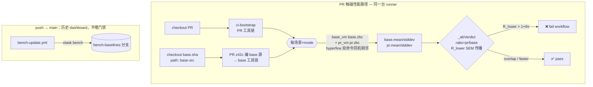

# 性能基准与回归门禁（benchmark / bench gate）

> **页型**: 机制页 ｜ **状态**: ✅ 已实现 ｜ **代码**: `scripts/xtask_bench.z42` · `bench/` · `.github/workflows/bench-pr.yml` · `bench-update.yml`
> **相关**: [xtask](xtask.md) · [测试门禁](test-gate.md) ｜ **对齐**: 2026-08-24

## 概述

benchmark 基础设施回答一个问题：**这次改动让 z42 变慢了吗？** 它由三部分组成：

1. **度量**——`xtask bench` 跑一组端到端场景（`bench/scenarios/*.z42`），每条产出带
   置信区间的结构化结果（schema v2）；`xtask bench stdlib <lib>` 跑库内 `[Benchmark]` 微基准。
2. **持久化（历史 dashboard）**——每次 push 到 main，`bench-update.yml` 把全量 e2e 结果提交到孤儿分支
   `bench-baselines`，作为"main 历史性能"趋势记录。**它不再喂门禁**（见下）。
3. **门禁（同-runner A/B）**——PR 触碰性能敏感路径时，`bench-pr.yml` 在**同一台 runner** 上建 PR
   与 base（merge-base）两套工具链，`xtask bench --ab` 让每个场景在两套下**同机相邻**编译+测量，按
   比值 95% 下界判红。这取代了旧的「拉另一台 runner 的 baseline 快照做跨-runner diff」——那种比法
   被 ±26–60% 的 between-run 系统偏移主导，区间几乎总重叠、门禁近乎失明。

> **本页是 bench 判红语义的权威（SoT）。** `bench/README.md` 是操作速查（怎么跑命令），
> 判红规则、数据流、为什么这样设计以此页为准。改门禁语义 → 改这里。

## 设计目标与约束

- **门禁必须可信且能抓到真回归**：共享 CI runner 的 wall-clock 噪声可达 ±60%（见
  [测试门禁](test-gate.md) 与 `docs/design/testing`）。**但这噪声主要是 between-run（跨-runner /
  跨-job）系统偏移**——同一 runner 内 within-run 抖动小得多。旧门禁拿「另一台 runner 的 baseline
  快照」对比，被 between-run 偏移主导 → 区间总重叠 → 判红几乎不触发（既不假报、也**抓不到真回归**）。
  **核心约束：门禁既不能假报、又必须能抓真回归**——解法是把对比搬进**同一台 runner**（见下 A/B）。
- **同-runner 抵消（A/B 门禁的地基）**：base 与 pr 在同机、同 job、相邻数秒内测量 → 该机器的整体快慢
  因子 `k` 同时乘进两侧，`ratio = (k·t_pr)/(k·t_base) = t_pr/t_base`，`k` 约掉。剩下只有 within-run
  抖动，可由 SEM 量化 → 比值置信区间**才第一次统计有效**（跨-runner 比法下 SEM 不成立）。
- **不采集额外数据**：判定复用结果 JSON 里 hyperfine / Bencher 已产出的 `ci_lower`/`ci_upper`，
  不为门禁跑第二遍。区间越宽（噪声越大）门禁越保守——正合共享 runner。
- **画像隔离**：interp 与 jit、不同 os/arch 的数字**从不互比**。每条结果带一个
  `profile`，diff 按 `(name, metric, mode_label@os/arch)` 精确匹配。
- **micro 与 e2e 分工**：ns 级微基准对噪声过敏，**不进 CI 门禁**，只做本地/nightly 的稳定硬件对比；
  CI 门禁只守粗粒度 e2e（ms 级）。

## 方案与决策

| 决策 | 选择 | 理由 |
|------|------|------|
| **PR 门禁比法** | **同-runner A/B**（base 与 pr 同机相邻测量，比比值）| 跨-runner baseline 快照被 ±26–60% between-run 偏移主导，门禁失明；同机测量让 `k` 约掉，才既不假报又能抓真回归 |
| **A/B 判红准则** | **比值 95% 下界 R_lower > 1+thr**（SEM 误差传播）| 同机抵消后 within-run SEM 才有效；对商做误差传播得比值置信区间，下界超阈值 = 有把握判回归 |
| **A/B 交错** | hyperfine 双命令单 invocation（`env Z42_LIBS=… vm …` 前缀）| 两侧相邻数秒、各带自己的 libs；逐次交错属过度工程 |
| 区间感知 diff（历史） | `bench --diff`：**区间分离 AND 均值超阈值** | 旧 PR 门禁准则（P0）；现降级为 `bench --diff` 命令 + 历史 dashboard 对比，不再是 PR 门禁 |
| 区间来源 | 复用结果 JSON 已有的 `ci_lower`/`ci_upper` | e2e 由 hyperfine 的 min/max 产、micro 用采样 min/max 充当；不采集新数据，零额外成本 |
| 缺区间回落 | 任一侧缺 `ci_lower`/`ci_upper` → 裸均值比值门禁，标 `(no-ci)` | 老格式 / 外部结果无 CI 时仍可判，只是回到宽松语义，显式标注让读者知道判据降级了 |
| 阈值 | 时间 5%（`--threshold-time`；CI 用 0.10）/ 内存 10% | 时间默认严、CI 放宽到 10% 匹配 0.2.3 退出标准；内存指标暂为 informational |
| 画像键 | `(name, metric, mode_label@os/arch)` | interp/jit、跨平台结果隔离，杜绝 interp 的数字被拿去比 jit 基线 |
| micro 进 CI | 否 | ns 级测量对共享 runner 噪声过敏，假阳性淹没信号；留给本地/nightly 稳定硬件 |
| 基线存放 | 孤儿分支 `bench-baselines`，非主仓库树 | 结果 JSON 随 push 每日覆盖，进主分支历史会污染 diff；孤儿分支隔离、PR 侧按需 fetch |

## 三层度量 tier

| tier | 工具 | 位置 | 粒度 | 进 CI 门禁 |
|------|------|------|------|-----------|
| **z42 e2e** | hyperfine + 自建 harness | `bench/scenarios/` + `xtask bench` | 整程序 wall-clock（VM 启动 + stdlib 加载 + 执行），ms 级 | ✅ `bench-pr.yml` 硬门禁 |
| **z42 micro** | `[Benchmark]` + `Std.Test.Bencher`（z42b 派发）| 各 lib `bench/*_bench.z42` | 单操作（`String.Replace` / `SortedSet.Add` …），ns 级 | ❌ 本地/nightly 对比 |
| **Rust micro** | criterion | `src/runtime/benches/` | VM 内部热路径（GC cycle / smoke），未接入 xtask | ❌ `cargo bench` 直跑 |

**e2e** 捕获全管线回归（启动开销 / dispatch / 整体吞吐），是门禁守护面；**micro** 把回归
定位到具体函数、守 stdlib 热路径，但 ns 级数字只在稳定硬件上有意义，故不进门禁。

## 执行画像（profile，schema v2）

每条结果带一个 profile，标明它在什么执行组合下测出，避免误比：

- **mode**：`{tiers, aot_pkgs}`。`tiers` = 活跃后端（`interp` 恒在，可 `+jit`）；`aot_pkgs`
  = 预编 AOT 的 zpkg 子集（今天恒空，待 roadmap M9）。派生 `mode_label`：`interp` / `jit`。
- **platform**：`{os, arch}`（arch 归一化 `x64`/`arm64`/`wasm`）。
- **caps**：由 `Std.Platform.Capabilities()` 在**被测 VM 二进制**下探测
  （`bench/probe/capabilities.z42`）——`jit` / `native-interop` / `threads` 等真实能力。

`xtask bench --mode interp|jit|both`（含 `--ab`）：`both` 每场景各测 interp 与 jit，产两条结果。
A/B 门禁对**同一 scenario×mode** 在 base/pr 两套工具链间比较，interp 与 jit 各自比、从不交叉；
`--diff` 按 `mode_label@os/arch` 匹配基线，同样两模式隔离。

## 机制

### 同-runner A/B 判红（PR 主门禁，核心）

PR 门禁在**一台 runner** 上建两套工具链，同机测量、比比值：



**base 工具链怎么来**：ci-bootstrap 的 composite 头一步 `cd $(git rev-parse --show-toplevel)` 会锁回 PR
checkout，无法指向 base-src，故**不复用它建 base**；改用**已 bootstrap 的 PR z42c 直接编 base 源**（新
编译器编旧源恒成立，staged-bootstrap 纪律）：PR z42c 编 `base-src/src/compiler` → base z42c，再由 base
z42c 编 `base-src/src/libraries` → base stdlib。**只测 scenario 运行时**，故 base driver 由 PR z42c 生成
其字节码这点对测量零影响——它跑的仍是 base 的 codegen 逻辑，产 base 风格的 scenario .zbc。z42vm 复用：
`git diff base..pr -- src/runtime` 无变更时 base_vm = pr_vm，省最重的 cargo 建。

判红纯函数 `_abVerdict`（`scripts/xtask_bench.z42`，可 `bench --ab-selftest` 单测）：

```
SEM_b = stddev_b / sqrt(n_b);   SEM_p = stddev_p / sqrt(n_p)
ratio = mean_p / mean_b
relSE = sqrt( (SEM_p/mean_p)^2 + (SEM_b/mean_b)^2 )     # 商的误差传播
R_lower = ratio * (1 - Z*relSE);  R_upper = ratio * (1 + Z*relSE);  Z=1.96 (95%)

if R_lower > 1 + thr:   → ↑ regression   (fail, exit 1)   # 95% 有把握真实比值超阈值
elif R_upper < 1 - thr: → ↓ faster        (informational)
else:                   → ≈ overlap       (noise, 放行)
缺 stddev/n（n≤1 或 stddev≤0）→ 回落裸比值 ratio>1+thr，标 (no-ci)
```

- `thr` 默认 **0.10**（CI 用 0.10，沿用 0.2.3 退出标准）；`Z=1.96`。
- 结果落 `bench/results/ab.json`（`ab-v1` schema：每场景 base/pr mean·stddev、ratio、r_lower/r_upper、
  verdict），信息性 artifact，不复用 baseline-schema。
- **同机抵消让 within-run SEM 在此统计有效**——这是 P0 跨-runner 比法下不成立、A/B 下才成立的关键。

### 区间感知 diff（`bench --diff`；历史 dashboard 对比，非 PR 门禁）

> **P0 时期的 PR 门禁准则，现已退休为 `bench --diff` 命令 + 历史对比工具**（不再由 bench-pr 调用）。
> 基线仍活在 `bench-baselines` 孤儿分支（`bench/results/*`、`bench/baselines/*` gitignored），
> `bench-update.yml` 每 push 覆盖一次，供人工趋势对比 / 本地 `--diff`。判红语义如下：

对每条 current 结果，按画像键在 baseline 里找对应项（`_findBenchObj`），然后：

```
delta = (cur.value - base.value) / base.value       # 相对均值变化
thr   = 内存指标 ? threshold-memory : threshold-time  # 默认 5% / CI 10%

if 双方都有置信区间 (_hasCi):                          # 主路径
    if delta > thr   AND cur.ci_lower > base.ci_upper:  → ↑ 回归   (regressions++)
    elif delta < -thr AND cur.ci_upper < base.ci_lower:  → ↓ 改进
    elif |delta| > thr:                                  → ≈ (overlap)  # 均值超阈值但区间重叠 = 噪声，不判红
    else:                                                → ≈           # 均值也没超阈值
else:                                                # 回落：任一侧缺 CI
    标 (no-ci)
    if delta > thr:  → ↑ 回归   (regressions++)        # 裸均值比值（老语义）
    elif delta < -thr: → ↓ 改进

exit = regressions > 0 ? 1 : 0
```

判红的**充要条件是双条件同时成立**：`delta > thr`（均值确实超阈值）**且**
`cur.ci_lower > base.ci_upper`（当前置信区间整体高于基线置信区间，即两次测量统计上可区分）。

**区间重叠 ⇒ 一律不判红**，无论 delta 看起来多大。这是压掉共享 runner 假红的关键：一次
+11% 的均值抬升，若两个区间仍重叠，就是同一分布的两次抽样，判为 `(overlap)` 噪声、放行。

改进（`↓`）对称要求区间反向分离，但**从不 fail**，只作展示。

### 判定结果的四种标注

| 符号 / 标注 | 含义 | 是否 fail |
|-------------|------|-----------|
| `↑` | 真回归：均值超阈值 **且** 区间分离 | ✅ exit 1 |
| `↓` | 真改进：均值降超阈值 **且** 区间反向分离 | ✗ |
| `≈ (overlap)` | 均值超阈值但区间重叠 → 噪声 | ✗ |
| `≈` | 均值未超阈值 | ✗ |
| `(no-ci)` | 某侧缺置信区间 → 回落裸均值比值判定 | 视 delta |
| `(new)` / `(removed)` | 仅一侧存在该项 | ✗（informational）|

输出示例（`↑` 是真回归；+11% 那条均值超阈值但区间重叠 → 判噪声不 fail）：

```
  01_fibonacci [time jit@linux/x64]  90 ms → 130 ms  ↑ 44.4%
  02_math_loop [time jit@linux/x64]  50 ms → 100 ms  ≈ 11.1% (overlap)

❌ 1 regression(s) — delta over threshold AND CI-separated (out of 2 benchmarks)
```

### CI 门禁接线（bench-pr.yml）

触发路径刻意收窄（`src/runtime` / `src/libraries` / `src/compiler` / `bench` /
`scripts/**/*.z42` / 本 workflow），**纯文档 PR 跳过**。`timeout-minutes: 45`（建两套工具链）。步骤：

1. checkout PR + checkout `base.sha`（`path: base-src`，两者 `fetch-depth: 0`）
2. bootstrap PR 工具链（`ci-bootstrap`：nightly z42c 种子 → 当前源码 warm 自建）
3. **建 base 工具链**（同 runner）：`git diff base..pr -- src/runtime` 无变更 → base_vm=pr_vm，否则
   cargo 建 base z42vm；PR z42c 编 `base-src/src/compiler`→base z42c，base z42c 编 `base-src/src/libraries`→base stdlib
4. `xtask bench --ab --mode both --threshold-time 0.10 --base-vm/-libs/-driver …`：每场景×mode 在两套下同机
   编译+测量，`_abVerdict` 判红 → 回归 exit 1 → fail workflow；上传 `bench/results/ab.json` artifact
5. **allocations 探针（informational，永不 fail）**：alloc 计数是确定性的（不像 wall-time），
   打印每场景 × GC-mode 的分配数，为将来的确定性 alloc 回归门禁积累观测（决策 D4）

> **格式-bump 边角（已知瞬态）**：PR 同时 bump zpkg 格式 **且**动 `src/runtime` 时，base driver 是 PR(新)
> 格式而 base_vm 是 base(旧)格式读不了 → 该 PR 当次 bench 可能红。与 bootstrap-seed 的格式-bump 瞬态一致，
> 随 nightly 自愈、不阻塞（格式-bump 时 perf 对照本就意义有限）。

## 已知局限与后续

- **micro/stdlib tier 未进 A/B 门禁**（Stage 2）：把同-runner A/B 扩到 micro（ns 级）需先给 Bencher 加
  mean/stddev + 自适应采样，Deferred `ab-bench-micro`；criterion tier 接线或砍是 `ab-bench-criterion`。
- **A/B 交错粒度**：hyperfine 双命令是「base 全跑→pr 全跑」于一 invocation（同机相邻，够抵消 between-run），
  非逐次交错；逐次交错抗 job 内漂移更强，Deferred `ab-interleave-per-run`。
- **内存指标**：schema 有 `metric:"memory"` 位，但 e2e harness 暂不采集 RSS；`--threshold-memory`
  保留默认、内存 diff 为 informational。
- **allocations 门禁**：探针已打印、待观测 3–5 轮跨 GC-mode 稳定性后再转硬门禁。

## 参考

- 操作速查（跑哪条命令、加 scenario）：`bench/README.md`
- schema 定义：`bench/baseline-schema.json`（JSON Schema Draft 2020-12）
- 同-runner A/B 门禁提案 / 设计：`docs/spec/changes/add-same-runner-ab-bench-gate/`
- 区间感知门禁（P0，已退休为 dashboard 对比）提案 / 设计：`docs/spec/archive/2026-08-24-add-interval-aware-bench-gate/`
