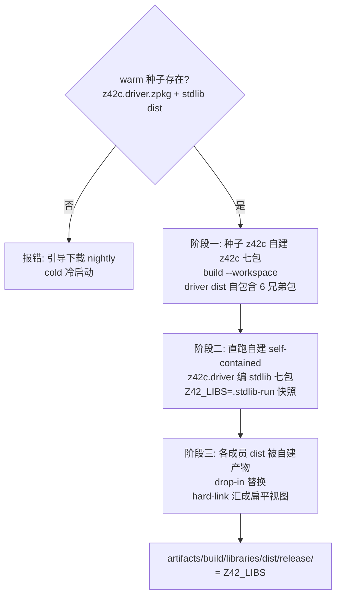
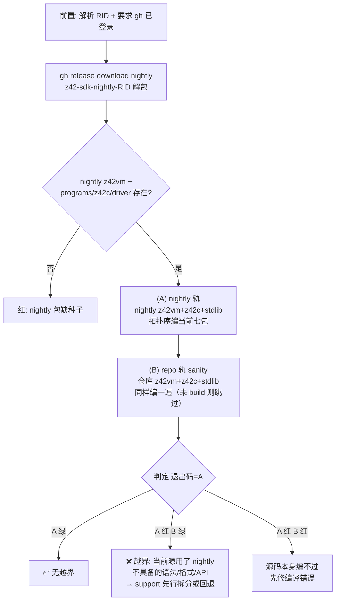

# 构建编排（build / regen）

> **页型**: 机制页 ｜ **状态**: ✅ 已实现 ｜ **代码**: `scripts/build/` · `scripts/xtask_regen.z42`
> **相关**: [xtask](xtask.md) · 编译器·自举与种子（待写）｜ **对齐**: 2026-07-05

## 概述

`build` 命令族把"z42c 自建自己 → 自建 z42c 编 stdlib → 产物成扁平视图"这条自举构建链
编排成可重复的步骤；`regen` 用同一套工具链重生全部 golden 测试的 `.zbc` 基线。

## 设计目标与约束

- **全链自举**：一切编译只经 z42c（warm 产物或 nightly 种子），无外部编译器介入
- **自建即验证**：z42c 每次构建都在自己编自己，构建通过本身就是编译器冒烟测试
- **产物可寻址**：一切落 `artifacts/build/`；stdlib 汇成单一扁平目录供 `Z42_LIBS` 指向
- **warm/cold 两态**：有产物走 warm（快）；fresh checkout 走 cold（下载种子），两态产出等价

## 方案与决策

| 决策 | 选择 | 理由 |
|------|------|------|
| stdlib 由谁编 | 自建的 z42c（drop-in 替换种子产物） | 每次构建都是一轮自举验证；产物永远出自当前源码的编译器 |
| 扁平视图 | hard-link 汇聚到单目录，**无 namespace index** | VM / 嵌入宿主都直读 zpkg NSPC section，索引是冗余状态 |
| golden 输出 | 重定向 `artifacts/` 镜像；仅 `zbc-format` 类原地覆盖 | 仓库不积构建产物；zbc-format 是 checked-in 字节基线，git diff 即格式漂移探针 |
| golden 编译并发 | 每 case 独立 spawn z42c 进程、批量 8 路 | 成本被 driver 启动主导（加载 driver+7 包+stdlib），进程级并行收益最大 |

## 机制

### build stdlib：三阶段自举构建

要点：阶段一用 `z42c build --workspace`——拓扑序编七包、兄弟依赖由 workspace 内部解析，
产物 driver dist **自包含** 6 个 `z42c.*` 兄弟包（.NET 式，`z42c build` 编 exe 时自动复制非
stdlib 依赖）；阶段二直接跑这个自包含 driver 编 stdlib（`Z42_LIBS` 指向 `.stdlib-run` 快照，
因 stdlib 正被重建需稳定副本），产物覆盖各成员 dist；阶段三 hard-link（零拷贝）汇聚成单目录。
`build compiler` 即单独执行阶段一 + 七包完整性校验。（simplify-compiler-build 去掉了旧的
`selfbuild-runlibs/` + `dogfood/` 拼接目录。）

### 增量编译（单工程 z42c build，port-incremental-build-cache 2026-07-05）

单工程 `z42c build <toml>` 逐文件写 fullMode `.zbc` 到 cache 目录（`[build].cache_dir` →
`${output_dir}/.cache` → `<projectDir>/.cache` 级联），并做**整包**级 probe：对每个源文件校验
「SHA-256 == 上次 zpkg MODS 记录 ∧ cache zbc 存在 ∧ TSIG 含该模块 ns」，全命中 → 完全跳过
重编/重写（`cached: N/N` + `no changes; preserved`，exe 仍复制依赖），任一变化 → 整包全量重编
（不做 per-file 混合重建——C# 时代实证有正确性风险后放弃）。`--no-incremental` 强制全量；
`Z42_INCR_DEBUG=1` 打印逐文件 miss 原因。**workspace/flat 构建（上图阶段一/二）不落 cache、
不 probe**——gen1/gen2 字节对比路径零扰动；布线见 roadmap Deferred
`incremental-future-workspace-wiring`。机制细节：[project.md 增量编译节](../../../design/compiler/project.md)。

### 不动点验证（test compiler 的核心）

gen1 = 种子编出的 z42c 七包；gen2 = 用 gen1 再编一遍七包；**gen1 与 gen2 必须逐字节相等**。
不相等即编译器 self-host 有非确定性或语义 bug。这是"byte-identical 全自举"目标的日常守门员。

### regen：golden 基线重生

三种枚举布局合并成一个 case 清单，逐 case spawn z42c 编译（8 路并批）：

| 布局 | 位置 | 输出 |
|------|------|------|
| dir 模式 | `src/tests/<cat>/<name>/source.z42` | artifacts 镜像；`zbc-format` 类例外原地 |
| 库测试 dir 模式 | `src/libraries/<lib>/tests/<name>/source.z42` | artifacts 镜像（跳过 `[Test]`/`[Benchmark]` 目录——无 Main，归 `test stdlib` 跑） |
| flat 模式 | `src/tests/<cat>/<name>.z42` | artifacts 镜像 |

**排除类**：`errors` / `parse`（预期编译/解析失败，本就无 `.zbc` 可产）、`cross-zpkg`
（多包协作，非单 source 产物）。工具链选择尊重 `Z42_HOME`（`--toolchain` 设它，见 [xtask](xtask.md)），
未设或非 SDK-toolchain 布局时用 build-tree 的 z42c + stdlib + z42vm。

### bootstrap-check：跨版本自举边界检查

`xtask bootstrap-check [rid]` 验证「上一个已发布 nightly 的 z42c 能否编译当前源」——
support-先行纪律的本地快门（CI 等价物是每腿 ci-bootstrap + `verify-selfhost`）。
何时必跑见 `docs/workflow/testing/verify-by-change.md`。

流程要点：种子取自 **SDK** nightly 的 `programs/z42c/`（runtime 包是纯嵌入包、不带 z42c）；
两轨都按拓扑序编七包、每编成一个成员即累积进 runlibs 供后续成员解析；(A) 轨用 nightly 的
stdlib 供依赖，因此**语法轴和 stdlib API 轴的越界都会在此暴露**。(B) 轨仅作"源码本身没写坏"
的对照，不影响退出码。工作目录 `artifacts/build/compiler/bootstrap-check/`。

已知限制：**只编 z42c 七包，不编 xtask 源**——xtask 源的越界目前只能由 CI 冷启动兜底
（缺口登记见 `docs/workflow/testing/verify-by-change.md` 覆盖矩阵）。

## 实现

| 组件 | 位置 | 要点 |
|------|------|------|
| stdlib 三阶段编排 | `scripts/build/xtask_stdlib.z42` 的 `_buildStdlibCore` | 种子校验 → 七包自建 → self-contained driver 编 stdlib（`.stdlib-run` 快照）→ 扁平视图 |
| z42c 七包自建 + 不动点 | `scripts/build/xtask_compiler.z42` 的 `_buildCompilerViaZ42c` / `_testCompilerUnits` | `z42c build --workspace`（driver dist 自包含兄弟包）；gen1==gen2 逐字节比对 |
| 自举 e2e oracle | `scripts/build/xtask_compiler_e2e.z42` | div-by-zero 等行为校验（500 行限制拆出） |
| 跨版本边界检查 | `scripts/build/xtask_bootstrap_check.z42` 的 `_bootstrapCheck` / `_bcRunWorkspace` | 双轨编七包，退出码 = nightly 轨（见"机制·bootstrap-check"） |
| golden 重生 | `scripts/xtask_regen.z42` 的 `_regenGolden` | 枚举三布局 → `_compileCaseSpawn` 并批 |

## 边界与限制

- cold 路径本地不可完整验证（依赖下载）——其 GREEN 判定以 CI 为准
- `build stdlib [lib]` 的按库参数当前只支持 all（整 workspace 构建）
- regen 的并发度固定 8 路（未随 CPU 数自适应）

## Deferred

- z42b 编排器接管 build 编排（见 [xtask · Deferred](xtask.md)）
