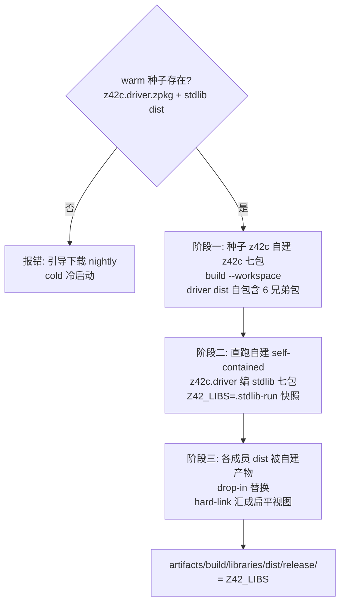
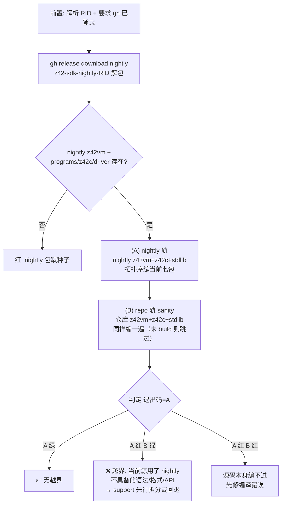

# 构建编排（build / regen）

> **页型**: 机制页 ｜ **状态**: ✅ 已实现 ｜ **代码**: `scripts/build/`（含 `xtask_golden_assets.z42` = golden 重生，前 `xtask_regen.z42`）
> **相关**: [xtask](xtask.md) · 编译器·自举与种子（待写）｜ **对齐**: 2026-07-07

## 概述

`build` 命令族把"z42c 自建自己 → 自建 z42c 编 stdlib → 产物成扁平视图"这条自举构建链
编排成可重复的步骤；`regen` 用同一套工具链重生全部 golden 测试的 `.zbc` 基线。

## 设计目标与约束

- **全链自举**：一切编译只经 z42c（warm 产物或 nightly 种子），无外部编译器介入
- **自建即验证**：z42c 每次构建都在自己编自己，构建通过本身就是编译器冒烟测试
- **产物可寻址**：一切落 `artifacts/build/`；stdlib 汇成单一扁平目录供 `Z42_LIBS` 指向
- **warm/cold 两态**：有产物走 warm（快）；fresh checkout 走 cold（下载种子），两态产出等价

## 方案与决策

| 决策 | 选择 | 理由 |
|------|------|------|
| stdlib 由谁编 | 自建的 z42c（drop-in 替换种子产物） | 每次构建都是一轮自举验证；产物永远出自当前源码的编译器 |
| 扁平视图 | hard-link 汇聚到单目录，**无 namespace index** | VM / 嵌入宿主都直读 zpkg NSPC section，索引是冗余状态 |
| golden 输出 | 重定向 `artifacts/` 镜像；仅 `zbc-format` 类原地覆盖 | 仓库不积构建产物；zbc-format 是 checked-in 字节基线，git diff 即格式漂移探针 |
| golden 编译并发 | 每 case 独立 spawn z42c 进程、批量 8 路 | 成本被 driver 启动主导（加载 driver+7 包+stdlib），进程级并行收益最大 |

## 机制

### build stdlib：三阶段自举构建



要点：阶段一用 `z42c build --workspace`——拓扑序编七包、兄弟依赖由 workspace 内部解析，
产物 driver dist **自包含** 6 个 `z42c.*` 兄弟包（.NET 式，`z42c build` 编 exe 时自动复制非
stdlib 依赖）；阶段二直接跑这个自包含 driver 编 stdlib（`Z42_LIBS` 指向 `.stdlib-run` 快照，
因 stdlib 正被重建需稳定副本），产物覆盖各成员 dist；阶段三 hard-link（零拷贝）汇聚成单目录。
`build compiler` 即单独执行阶段一 + 七包完整性校验。（simplify-compiler-build 去掉了旧的
`selfbuild-runlibs/` + `dogfood/` 拼接目录。）

> **`artifacts/build/` 只放编译/publish 产物**（add-build-toolchain, 2026-07-05）。构建/测试的
> **中间态**——`stdlib-run` 快照（图中阶段二的 `Z42_LIBS`）、`alllibs` flat 视图、`e2e`/`selfhost-gen1`/
> `dogfood` 工作区——一律落 `artifacts/.scratch/`（gitignored、可重生），不再混进 `build/`。
> 各自用途见 [自举与种子机制页 / scratch 目录说明]。

### 增量编译（单工程 z42c build；文件级，add-file-level-incremental 2026-07-08）

单工程 `z42c build <toml>` 的判定与组装 SoT = **cache**（`<rel>.zbc` fullMode + `<rel>.meta`
+ 包级源清单；`[build].cache_dir` → `${output_dir}/.cache` → `<projectDir>/.cache` 级联）。
粒度**文件级**：种子（hash / 条目缺失·pin / 源清单不一致→全量）→ token 保守边传递闭包
（标识符 token ∩ 包内定义名，**经声明面闸门起跳**，见下）→ 只重编失效闭包，其余文件 IrModule 经 **ZbcReader** 从
cache 读回（meta 回填 zbc wire 不携带的 writer 残留：块 label 原文/模块池原序/TIDX idx）；
TSIG/符号恒全包重算（每文件 TSIG 全包耦合）→ 组装零分叉。全命中 → `no changes; preserved`。
省下的是失效外文件的 typecheck+codegen（最贵相位）；parse/TSIG/组装恒做（Amdahl 上界）。
硬验收 = `xtask test incremental` 暴力对账器（逐文件 touch，增量 == 全量逐字节 + 计时）。
`--no-incremental` 强制全量；`Z42_INCR_DEBUG=1` 打印种子与传播链。**workspace/flat 构建
（上图阶段一/二）不落 cache、不 probe**——gen1/gen2 字节对比路径零扰动；布线见 roadmap
Deferred `incremental-future-workspace-wiring`。机制细节：[project.md 增量编译节](../../../design/compiler/project.md)。

#### 声明面闸门（fix-z42c-incremental-closure，2026-09-06）

token 保守边极粗：`_definedOf` 把**成员名**也登记成属主名，于是任一定义了 `Name()` 的文件一变，
全包凡是提到 `Name` 的文件统统失效——xtask 工程（64 文件）**只加一行注释**就 `cached: 0/64`。
闸门只收紧**传播的起点**：

- 每个 cache 条目多存一个**声明面指纹**（`CacheMeta.SurfaceHash`，meta v4）= 该文件 token 流
  把方法 / 构造 / 计算属性 getter / 索引器的**体**各压成一个 `{}` 记号后的哈希
  （`z42c.driver/src/SurfaceHash.z42`）。注释与空白本就不是 token，天然不参与。
- `Close` 的传播条件加一项 `SurfaceChanged[j]`：**源变了但声明面相等**的文件（改注释 / 改函数体）
  只重编它自己，不把失效传给引用方。`Z42_INCR_DEBUG=1` 打印 `[surface-equal] <rel>`。
- **一旦传播起来就照旧全传递**：被波及而转 fresh 的行 `SurfaceChanged` 保持默认 `true`，
  于是「A 继承 B、C 用 A」这类**布局经中间文件透传**的链条与闸门前完全一致地整条失效。
  闸门不去猜哪些扩散可以省，只掐掉「本来就不该起跳的那一跳」。

**为什么「声明面没变 ⇒ 引用方的 cached zbc 仍然有效」**——跨文件依赖只经声明面：内联
（`IrInline`）只在同一 `IrModule`（= 单 CU）内解析 callee；逃逸 / 纯度摘要（`IrEscapeSummary` /
`IrPureFunctionTable`）同为模块级不动点，跨模块调用无摘要即保守处理；泛型不单态化进调用方
（类型实参以名字随 `CallInstr.MethodTypeArgs` 走运行期）；唯一把别处体内的值抄进消费方的
`const` 字段，其初值写在**字段声明**里、不在方法体内，本就留在声明面中。

保守方向也是稳的：**漏**登记一种带体的声明形态，只会让那段 token 留在指纹里 → 该文件体一改
照旧全波及（多编不错编）；**多**挖 token 才危险，故只按「AST 亲口给出的体起始 `{` 偏移 +
token 层大括号配平」挖，不做猜测式跳过。

实测（xtask 64 文件，单文件注释 touch）：`cached: 0/64` → `cached: 63/64`；
`xtask test incremental` 对账器 65/65 文件与 `--no-incremental` 全量**逐字节相等**，
per-touch 墙钟 4125ms → 2428ms（−41%；余下是恒做的全包 parse + 组装 + zpkg 落盘，Amdahl 上界）。

### 不动点验证（test compiler 的核心）

gen1 = `build compiler`（`z42c build --workspace`）产的 7 包 canonical dist；gen2 = **用
gen1 的 driver 再跑一遍 `--workspace`**；**gen1 与 gen2 必须逐字节相等**。不相等即编译器
self-host 有非确定性或语义 bug——"byte-identical 全自举"目标的日常守门员。

实现（`_testSelfHostByteIdentical`，`scripts/build/xtask_compiler.z42`）：

```
snapshot gen1: 拷 canonical dist 的 7 个 <member>.zpkg → artifacts/.scratch/selfhost-gen1
rebuild gen2:  gen1 的自包含 driver 跑 `build --workspace`（Z42_LIBS=stdlib）→ 覆盖 canonical dist
compare:       逐成员 _sectionsEqualIgnoreBlid(gen1, gen2)
```

两个关键点：

1. **gen1、gen2 必须走完全相同的构建路径**（都 `--workspace`）。这是 simplify-compiler-build
   踩过的坑：曾经 gen2 走"逐包 `build <toml>` + 胖 flat `Z42_LIBS`（stdlib+z42c 全塞一个目录）"，
   与 gen1 的 `--workspace` 分歧——单包胖-flat 构建从目录里拉入的依赖闭包更大、且扫描顺序非确定
   （[common-pitfalls §1](../../../../.claude/rules/common-pitfalls.md)），于是 gen2>gen1 且逐次漂移，
   CI 全红。教训：**不动点两代必须同路径**，否则测的是"两条不同构建是否巧合一致"而非"编译器复现自身"。
2. **忽略 BLID**：zpkg 末尾 16B 是 MurmurHash3 x86_128 build-id（内容哈希尾），天然每次不同；比对在 section
   级别做、跳过 BLID，只验代码/元数据段一致。

### z42c 编译执行模式：默认 jit（Z42C_BUILD_MODE 逃生舱）

xtask 驱动 z42c（`z42vm z42c.driver --mode <m>`）编 stdlib / 自建 z42c / golden 的执行模式，
统一由 `_z42cMode()`（`scripts/common/xtask_common.z42`）给出，**默认 `jit`**：

- **为什么 jit 安全当不动点信任基线**：`jit-fixpoint-check.yml`（手动触发，4 平台
  linux-x64 / linux-arm64 / windows-x64 / macos-arm64）确认 z42c `--workspace` 编译在
  **interp 与 jit 下产出的 7 包逐字节一致**（忽略 BLID）。既然 jit 输出 == interp 输出、而 interp
  输出已是 fixpoint-stable，则 gen1(jit)==gen2(jit) 同样成立——jit 只快不改字节。benchmark：jit
  编译比 interp 快 **1.67×（小包）~3.6×（大包如 z42.core）**。
- **逃生舱 `Z42C_BUILD_MODE=interp`**：格式-bump 窗口（新 nightly 未发时用旧 VM 走确定的解释路径）/
  确定性审计 / 调试 codegen 时，随时 `Z42C_BUILD_MODE=interp xtask ...` 回解释器。`=jit` 亦可显式指定。
- **例外**：`xtask test bootstrap`（`scripts/build/xtask_bootstrap_check.z42`）恒用 interp——它拿上一
  nightly 的 z42c 编当前源验"越界"，须走该种子最稳的解释路径，不随本默认变。

> 引入：change `consolidate-z42c-invocations`（§2.1 收敛调用面 → B 步翻默认 jit）；证据链（benchmark +
> 4 平台字节一致）见 `docs/xtask_review.md` 附录 A。

### Rust 构建 ↔ z42c 产物：一条被刻意切断的构建期环

`src/runtime/build.rs` 会用 z42vm + z42c 把两个 `.z42` 测试 fixture 编成 `.zbc`，并 emit
`--cfg z42_have_z42c` / `z42_have_embedding_hello` 给约 10 个 Rust 测试当开关。为此它需要
`rerun-if-changed=<z42c.driver.zpkg>`——于是构建期出现一个**环**：

```
z42vm (Rust) ──要它才能跑──> z42c ──产出──> z42c.driver.zpkg
     ↑                                            │
     └────── build.rs rerun-if-changed ───────────┘
```

环本身不致命（build script 读任意文件是允许的），**致命的是 mtime 语义**：
`xtask build compiler` 每轮都重写 `z42c.driver.zpkg` → 下一次 cargo 判定 build script 陈旧
→ 整个 crate graph（lib `z42` → `z42vm` → 各 cdylib）**全量重编**。

实测（2026-09-05，fix-build-rs-zpkg-invalidation）：warm 树上仅 `touch` 一下 driver.zpkg，
release 重编就要 **62s**；`xtask build compiler` 的 92s 里 62s 是它。debug 只 ~3.5s（无优化），
故只在 release 上致命——而 CI 的 `ci-bootstrap` 走的正是 release，一次 run 有 7 个 job 各踩一次。

**处置**：整块由 cargo feature **`z42-test-fixtures`** 门控，**默认关闭**。普通 `cargo build`
根本不声明这条依赖 → 环在非测试路径上断开（`build compiler` 92s → **31s**，cargo 步 61.7s → 0.12s）。
只有 `xtask test runtime`（= CI 的 Rust 单测步骤，也是全仓唯一的 `cargo test` 调用点）显式带上
该 feature 时才接上，被门控的 10 个测试照跑，覆盖面不变。

> 一般教训：**不要让「纯测试便利设施」进入所有人的构建关键路径**。build script 里对
> 「本构建系统自己会重写的文件」声明 `rerun-if-changed`，等于给每一轮构建都埋一次全量重编。

### strict-pin：为什么改格式必须 bump 版本 + regen

z42c（writer）在每个 `.zbc`/`.zpkg` 头写版本常量；z42vm（reader，`src/runtime/src/metadata/zbc_reader/`）
加载时**精确匹配 major+minor**，不匹配直接拒（`zpkg minor 22 not supported (writer 0.23)`），
**没有兼容回退**（pre-1.0「不为旧版本提供兼容」）。推论：

- 改 wire 格式（新 opcode / section / 字段语义）→ **writer + reader 版本常量必须同一 commit 一起 bump**，
  否则 strict-pin 校验失败。完整同步清单（zbc 5 处 / zpkg 9 处 + fixture regen）见
  [version-bumping.md](../../../../.claude/rules/version-bumping.md)。
- strict-pin 让所有旧 `.zbc`/`.zpkg` artifact **立即失效**——所以 bump 后必须 `xtask build test` 重生
  golden 基线 + 重截 z42c golden hex 单测（header 的 minor 字段会变）。
- `zbc_reader_tests.rs::zpkg_version_constants_pinned` 钉住 reader 常量当前值，防止 writer/reader
  单边漂移悄悄溜过（曾漏改一侧 → fresh 构建炸、cache 命中蒙混）。

### 改了编译器（`src/compiler/`）→ 本地验证步骤

| 步 | 命令 | 干什么 / 为什么 |
|----|------|----------------|
| ① 迭代 | `xtask test compiler` | 重建 z42c + **不动点(gen1==gen2)** + [Test] units + e2e。抓编译错误 + 非确定性/codegen 回归 |
| ② 边界 | `xtask test bootstrap` | **仅当**动了 lexer/parser/codegen/格式 writer，或源用了新语法/API。用上一 nightly 编当前源，抓"越界"（见下） |
| ③ 格式 | version-bumping checklist | **仅当**改了 zbc/zpkg wire 格式。writer+reader 常量同 commit bump + regen |
| ④ 门禁 | `xtask test` | 提交前完整 GREEN gate（cargo z42vm + vm + cross-zpkg + stdlib + compiler）。①不算 GREEN |

> 完整"改动类型 → 验证"速查见 [`verify-by-change.md`](../../../workflow/testing/verify-by-change.md)。

### golden 语料枚举：唯一一次遍历，四个消费者

golden 语料被 **4 条命令**消费，它们此前各有一份 ~100 行的同款遍历、靠注释里的
「mirrors XXX」人工同步（并且**已经漂过**）。现在只有一次遍历——
`_walkGoldenCorpus(root)`（`scripts/common/xtask_golden.z42`）——产出中性的
`_GoldenEntry[]`，四个消费者各自 map 成自己的记录类型。

**walk 本身不含准入策略**，只报「找到了什么 + 判断所需的事实」（类别、sidecar、
artifacts 镜像位置、目录里有没有 `[Test]`）。四个段，按此顺序发射，段内类别/库排序 +
用例名排序（确定序，[common-pitfalls §1](../../../.claude/rules/common-pitfalls.md)）：

| 段 | 位置 |
|----|------|
| `tests-dir` | `src/tests/<cat>/<name>/source.z42` |
| `lib-dir` | `src/libraries/<lib>/tests/<name>/`（golden 或 `[Test]` dir-unit） |
| `tests-flat` | `src/tests/<cat>/<name>.z42` |
| `lib-file` | `src/libraries/<lib>/tests/<name>.z42`（stdlib `[Test]` 文件单元） |

**准入策略留在调用点**——四套集合本就有意不同，摆在调用点比藏进四份遍历里可读：

| 消费者 | 排除类别 | 额外过滤 |
|--------|---------|---------|
| `build test`（regen） | `_isNonRegenCat` | — |
| `test e2e`（VM golden） | `_isNonRunnableCat` | `_isExcludedDirName`、镜像 `.zbc` 存在、`interp_only` |
| `test dist` | `_isNonRunnableCat` | `_isTestRunnerSource`、`interp_only` |
| `test embedded` / `test list` | `_isNonRunnableCat` | `_isExcludedDirName` |

两套类别谓词的差异**是有意的**：`_isNonRegenCat` **保留** `zbc-format` / `zpkg-format`
（它们正是要被重生成的字节基线），三个 runner 则排除它们（没有 stdout 可比对）；
`cross-zpkg` / `multi-exe` / `manifest-targets` 两边都排除（多包 / 多目标，非单 source
产物，各有自己的 runner）。库测试目录里带 `[Test]` / `[Benchmark]` 的没有 `Main`，
归 `test stdlib`（z42b）跑，四路都跳过。

> `test embedded` / `test list` 的**发射顺序是 load-bearing 的**（分片切片与
> `_sampleCorpus` 依赖「同 bucket 连续」，且 src/tests 桶内 dir 与 flat 两种模式按原始
> basename **交错**排序），所以它在共享 walk 之上做一次按桶重组，而非单遍扫描。

### regen：golden 基线重生

`build test` 拿上面的清单，逐 case spawn z42c 编译（并发度 `max(8, CpuCount())`，
`Z42_REGEN_JOBS` 可覆盖）。输出一律写 artifacts 镜像，**唯一例外**是 `zbc-format` 类——
它的 `.zbc` 是签入仓库的字节基线，原地覆盖，好让 `git diff` 直接暴露格式漂移。

工具链选择尊重 `Z42_HOME`（`--toolchain` 设它，见 [xtask](xtask.md)），
未设或非 SDK-toolchain 布局时用 build-tree 的 z42c + stdlib + z42vm。

### test bootstrap：跨版本自举边界检查

`xtask test bootstrap [rid]` 验证「上一个已发布 nightly 的 z42c 能否编译当前源」——
support-先行纪律的本地快门（CI 等价物是每腿 ci-bootstrap + `verify-selfhost`）。
何时必跑见 `docs/workflow/testing/verify-by-change.md`。



每轨的编译核心（`_bcRunWorkspace`）是一个**拓扑序 + runlibs 累积**循环——因为单包
`build <toml>` 只从 `Z42_LIBS` 解析依赖，后面的成员要能看到前面刚建的。**为什么不走
一句 `build --workspace --output-dir <flat>`（更省拷贝）**：编译器七包有深度互依赖
（`z42c.ir` 引用 `z42c.core` 的类型），单一扁平输出目录破坏兄弟包的类型解析
（实测两轨齐炸 `E0402: member access on non-class`）——per-member `--output-dir` +
runlibs 累积的隔离布局才能让每个成员看到正确的兄弟元数据；且边界检查要输出到隔离目录、
不能污染 repo 的 canonical dist（故也不能借用生产 `build compiler` 的无 `--output-dir` 路径）：

```
runlibs = 拷(该轨 stdlib) + 拷(该轨 z42c 7 兄弟)          # 种子 libs
for m in members(拓扑序 core→ir→syntax→…→driver):
    <该轨 z42vm> <该轨 driver> -- build src/compiler/<m>/<m>.z42.toml \
        --release --output-dir <out/m>  Z42_LIBS=runlibs
    产物存在且非空 → 拷 <m>.zpkg 进 runlibs                # 累积:供后续成员解析
    否则 → 该轨 fail
```

流程要点：种子取自 **SDK** nightly 的 `programs/z42c/`（runtime 包是纯嵌入包、不带 z42c）；
(A) 轨的 z42vm/driver/stdlib **全是 nightly 的**（旧解析器 + 旧格式 + 旧 stdlib API），所以
**语法轴和 stdlib API 轴的越界都会在此暴露**——旧 z42c 遇到新语法解析失败、或找不到新 stdlib
API。(B) 轨换成仓库当前工具链、仅作"源码本身没写坏"的对照，不影响退出码。工作目录
`artifacts/build/compiler/bootstrap-check/`。

已知限制：**只编 z42c 七包，不编 xtask 源**——xtask 源的越界目前只能由 CI 冷启动兜底
（缺口登记见 `docs/workflow/testing/verify-by-change.md` 覆盖矩阵）。

## 实现

| 组件 | 位置 | 要点 |
|------|------|------|
| stdlib 三阶段编排 | `scripts/build/xtask_stdlib.z42` 的 `_buildStdlib` | 种子校验 → 七包自建 → self-contained driver 编 stdlib（`.stdlib-run` 快照）→ 扁平视图 |
| z42c 七包自建 + 不动点 | `scripts/build/xtask_compiler.z42` 的 `_buildCompilerViaZ42c` / `_testCompilerUnits` | `z42c build --workspace`（driver dist 自包含兄弟包）；gen1==gen2 逐字节比对 |
| 自举 e2e oracle | `scripts/build/xtask_compiler_e2e.z42` | div-by-zero 等行为校验（500 行限制拆出） |
| 跨版本边界检查 | `scripts/build/xtask_bootstrap_check.z42` 的 `_bootstrapCheck` / `_bcRunWorkspace` | 双轨编七包，退出码 = nightly 轨（见"机制·test bootstrap"） |
| golden 重生 | `scripts/build/xtask_golden_assets.z42` 的 `_regenGolden` | 枚举三布局 → `_compileCaseSpawn` 并批 |
| 测试资产编译（`build test`）| `scripts/build/xtask_golden_assets.z42` 的 `_buildTest` | ensure z42c/stdlib/z42vm（缺则自建）→ `_regenGolden`（golden 编译，不重建工具链） |
| 工具链 apphost / 完整 SDK | `scripts/build/xtask_toolchain.z42`（`_buildWorkload`/`_buildToolchain`/`_sdkMergeApphosts`）| `build workload\|toolchain\|sdk`：publish 各 apphost → **toml 的 publish_dir**（路径从 toml 读）；sdk 合并成完整可运行 SDK |

## 边界与限制

- cold 路径本地不可完整验证（依赖下载）——其 GREEN 判定以 CI 为准
- `build stdlib [lib]` 的按库参数当前只支持 all（整 workspace 构建）
- regen 的并发度固定 8 路（未随 CPU 数自适应）

## Deferred

- z42b 编排器接管 build 编排（见 [xtask · Deferred](xtask.md)）
