# 测试门禁（test gate）

> **页型**: 机制页 ｜ **状态**: ✅ 已实现 ｜ **代码**: `scripts/test/`
> **相关**: [xtask](xtask.md) · [构建编排](build.md) ｜ **对齐**: 2026-09-05

## 概述

`test` 命令族构成提交门禁（GREEN gate）：裸 `xtask test` 串联全部必跑 stage，
任一失败即停；全绿是 commit / push 的先决条件。另提供开发期加速——`test changed`（命令级
按需计划）与单 stage / `--no-build`——但都不替代提交前的完整 gate。

## 设计目标与约束

- **默认即完整**：裸 `test` 就是全量 gate——"局部验证漏 stage"的风险由默认值消除，
  开发者无须记住要跑哪几个
- **一次失败即停**：stage 串行短路，失败点即诊断起点
- **加速不降门槛**：scope/changed 只服务 iteration；提交判定只认完整 gate
- **自我验证**：compiler stage 内含自举不动点检查（见[构建编排](build.md)），门禁同时守护
  编译器正确性

## 方案与决策

| 决策 | 选择 | 理由 |
|------|------|------|
| 完整 gate 的内容 | build wave + e2e（goldens / cross-zpkg / multi-exe）/ stdlib / manifest targets / examples / compiler / vscode-syntax / lines —— 逐条清单见下「完整 gate 的 stage 流水」 | 每个 stage 守一类回归面：端到端语义与跨包行为、库正确性、清单驱动的 target 契约、示例可编译、编译器自举、生成产物一致性、代码规模棘轮（Rust VM 单测独立于 gate，见 `test runtime`） |
| stage 清单不漂移 | 代码 `_gateStageNames()` 与本页 `gate-stages` 区互为副本，gate 开跑前对账（`_checkGateStageDoc`） | 本页曾自称 SoT 却漏了 3 个 stage —— 纪律守不住无人盯的清单，改成会变红的门 |
| 加速机制 | `test changed`（命令级）+ 单 stage / `--no-build` | changed 按文件精确到单库命令，适合小步迭代；单 stage / `--no-build` 反复跑同一测试免重编 |
| changed 的保守坍缩 | 任一改动文件映射为 full → 整个计划坍缩为 `test all` | 宁可多跑不可漏跑；xtask 自身与 workspace 配置改动一律 full |
| 计划执行方式 | 逻辑命令 in-process 重入 CLI 路由（不 shell out） | 免去每命令一次进程启动；cargo 命令例外走子进程 |
| 产物消费模式 | `--no-build` / `--toolchain <sdk>` 跳过构建波，直接消费已建产物 | CI 集中构建一次（compile-toolchain / compile-test-assets）、多 job 消费；本地缓存后快速迭代 |

## 机制

### 完整 gate 的 stage 流水

> **本节是 GREEN gate stage 组成的唯一权威清单（SoT，§4.4）。** 其他文档
> （`scripts/README.md`、`.claude/rules/workflow.md`、`docs/workflow/ci.md`）一律
> 「跑 `xtask test`，stage 组成见此」+ 链接，不再各自复列（历史上复列 5-6 处、已互相漂移
> ——有的漏 vscode-syntax、有的把 stdlib 写成 `test lib`）。改 gate 组成 → 只改这里。
>
> **这条约定现在有门守着**（fix-xtask-doc-drift，2026-09-05）：下面 `gate-stages` 区是本
> 清单的机器可读副本，`_checkGateStageDoc`（`scripts/test/xtask_test.z42`）在 gate 开跑前
> 与代码侧的 `_gateStageNames()` 逐条对账，不一致即红。**加 / 删 / 改名 stage 要同时改两处。**
>
> 为什么补这道门：本节此前自称 SoT 却仍然烂了——multi-exe（unify-run-modes P3）、
> manifest targets（add-tests-bench-manifest-config P4）、examples（设计 D4）三次加 stage
> 都没同步本页，文档停在 6 个而 gate 实跑 9 个。**没有测试盯着的约定迟早会烂**，纪律不够，
> 得有会变红的东西。形态同 `vscode-syntax`（生成产物 ↔ 源表防漂移）。

```mermaid
graph LR
    B[stdlib + z42c 自建] --> D[debug z42vm<br/>+ compression cdylib]
    D --> R[regen 构建波<br/>cargo release z42vm<br/>+ golden .zbc]
    R --> S1[e2e goldens<br/>interp]
    S1 --> S2[e2e cross-zpkg<br/>编译=release·运行=debug]
    S2 --> S2b[e2e multi-exe<br/>一工程 → N 个 exe zpkg]
    S2b --> S3[stdlib Test 用例]
    S3 --> S3b[manifest targets<br/>&#91;&#91;test&#93;&#93; fixture]
    S3b --> S3c[examples<br/>编译 gate + test=true 运行]
    S3c --> S4[compiler 自举<br/>七包 + 不动点 + units]
    S4 --> S5[vscode-syntax<br/>grammar ↔ Lexer 防漂移]
    S5 --> S6[lines<br/>文件行数硬上限 棘轮基线]
    S6 --> G((GREEN))
```



**机器可读清单**（`_checkGateStageDoc` 解析此区；条目文本 = `_stageStart` 打的 banner 名，
顺序 = 实际执行顺序。仅改这里而不改 `_gateStageNames()` 会让 gate 变红，反之亦然）：

<!-- gate-stages:begin -->
- `build wave (debug vm + regen)`
- `e2e goldens (interp; jit → vm-jit-consistency)`
- `e2e cross-zpkg`
- `e2e multi-exe`
- `stdlib [Test]`
- `manifest targets ([[test]])`
- `examples (compile gate + test=true run)`
- `compiler`
- `vscode-syntax`
- `lines`
<!-- gate-stages:end -->

先备工具链与基线（build wave），再依序跑九个验证 stage；任一步失败立即终止。
除 build wave 与 `e2e goldens` 外，其余 stage 都可经 `--skip <name>` 下放到独立 CI job
（见 `_skipHas`；skip 名是短名，如 `vscode` / `targets`，不等于 banner 全名）——skip 只影响
**在哪跑**，不改变 gate 的 stage 组成，故上面的清单不随 `--skip` 变化。
**debug z42vm 必须先于 regen 构建**（fix-gate-debug-vm-order，2026-07-16）：golden regen 用
`_activeVm(root,"debug")` 解析 debug vm 去编译各 golden；若 regen 先跑而 debug vm stale（早于某个
新增 VM builtin），会在 regen 阶段 panic「unknown builtin」→ 全体 golden 假失败、且 regen 返回 1
早退使 debug vm 那步永远跑不到。故 `_testAll` / `_testE2eCore` 把 `_buildDebugVmAndCompression()`
排在 `_regenForTest()` 之前。

**cross-zpkg 的 fixture 编译走 release z42vm、运行走 debug z42vm**（speed-up-cross-zpkg-compile-vm，
2026-08-29）：该 stage 每个 fixture 要三阶段 z42c 编译（target→ext→main，~40 次/全跑），是
`test-host(linux-x64)` 的 pole（debug VM 编译慢 release 一个量级 → ~18min）。debug VM 的价值
（overflow-checks + 内存布局 `debug_assert!`）在**执行期**触发，编译走 debug 零覆盖价值，故
`_runOneCrossCase` 用 `compileVm`(release) 编 fixture、`runVm`(debug) 跑 main.zpkg——跨包 dispatch
的 debug 断言覆盖不丢，pole 消失（~18→2-3min）。`--toolchain` 消费路径只带 release VM，编译+运行同为它。
（`vscode-syntax` 守生成产物一致性：`z42.tmLanguage.json` 必须等于「当前 Lexer 关键字表 +
模板」的重渲染——Lexer 加关键字未 `deps install vscode` 重新生成即红，性质同自举不动点。）
（`lines` 守 [code-organization.md](../../../../.claude/rules/code-organization.md) 的文件行数上限（add-line-count-lint），
**两档**：**硬限 886 行** —— 不在基线的新越界文件、或比基线更长的已知越界文件 → **红**；
**软限 500 行** —— 只打一行 advisory 计数，**不进棘轮、不阻断**
（`_lineLimitHard()` / `_lineLimitSoft()`，`scripts/test/xtask_test_lines.z42`）。
扫 `src/` 下非测试 `.z42` / `.rs`，对照 `scripts/test/line-limit-baseline.txt`（首行即注明 `hard limit 886`）。
拆分后降到硬限以下的文件用 `xtask test lines --update` 从基线剔除（只降不升）。纯文本扫描 <1 s，host-independent。
> ⚠️ 本页此前写的是「**文件 500 行硬上限**」——**不对**：500 从来只是软限、永不变红，
> 写个 600 行的新文件 gate 并不会拦。软/硬两档是 2026-09-05 在 code-organization.md 里
> 有意分开的（软 300→500、硬 500→886），本页当时没跟上。fix-silent-gates 修正。）
（`test runtime` = Rust VM 单测 cargo test **不在** gate 内 —— 它的 signal_handler_e2e
在信号受限的沙箱里会挂;改由每条 CI 腿单独一步 + 本地 `xtask test runtime` 按需跑。）
设 `--no-build`（或 `--toolchain <sdk>`）时**跳过构建波、直接消费既有产物**——CI 的
`test-host` 正是先经 bootstrap 集中构建、再 `test all --no-build` 消费的形态。
JIT 一致性不在本地默认路径内，由 CI `test-vm-jit` 专腿覆盖（本地可用 `test e2e --mode jit` 手动跑）。

### stage 耗时归因（无条件输出）

每个 stage 结束时打印自身墙钟，gate 末尾再给一张**降序**表 + 占比：

```
── stage wall-clock (降序) ──
  build wave (debug vm + regen)                   2m47s  (47%)
  stdlib [Test]                                   1m23s  (23%)
  compiler                                        51.7s  (14%)
  ...
  TOTAL                                           5m52s
```

**为什么无条件打印**（而不是挂在 `-v diagnostic` 下）：`_procStart` / `_procEnd` 的耗时只在
verbosity ≥ 4 才输出，而 CI 跑的是默认 verbosity —— 于是 `xtask test` 在 CI 日志里是个黑盒，
只有一个总时长；想知道「哪个 stage 吃掉了墙钟」必须本地复现或调高 verbosity 重跑一次。
stage 数是个位数、边界天然清晰，多打 N 行的成本远低于「排查 CI 变慢得先重跑一次」的成本。
**构建波也计入**——它常是最大的一块（上例占 47%），不计的话各 stage 之和对不上 TOTAL，反而误导。

实现：`StageLogZ` + `_stageStart` / `_stageEnd` / `_stageSummary`（`scripts/test/xtask_test.z42`），
时长格式化 `_fmtDur`（`scripts/common/xtask_common.z42`）。

### 单 stage / `--no-build`：手动缩窄

直接跑单个 stage（`test e2e --dir <cat>` / `--file <p>`、`test stdlib <lib>`、`test compiler`）
可只验一个面；`--no-build`（或 `test e2e --no-rebuild`）跳过重建波、消费已建产物，反复迭代
同一测试时免重编。这些都不构成 GREEN，提交前仍须跑完整 `xtask test`。

> **注**：C# 版 xtask 曾有 `--scope=full|runtime|compiler|stdlib|auto` stage 级缩窄开关；
> z42 版 xtask **尚未实现**（源码 `scripts/test/xtask_test.z42` 注明是 "a later increment"）。
> 现行缩窄手段是下面的 `test changed` 与上面的单 stage / `--no-build`。

### `test changed`：命令级按需计划

对未提交改动（相对 `BASE`，默认 `HEAD`；含 untracked）逐文件分类，产出**去重后的命令并集**，
依序执行、首败短路。`--dry-run` 只打印计划。映射表（`_mapFile`）：

| 改动路径 | 映射命令 |
|---------|---------|
| `src/libraries/<lib>/src/` | `test stdlib <lib>` + `test e2e` |
| `src/libraries/<lib>/tests/` 或该库 `.toml` | `test stdlib <lib>` |
| `src/runtime/src/`、`Cargo.toml/lock`、`build.rs` | `test runtime` + `test e2e` |
| `src/runtime/tests/` | `test runtime` |
| `src/tests/cross-zpkg/` | `test e2e --dir cross-zpkg` |
| 其余 `src/tests/` | `test e2e` |
| `src/compiler/` | `test compiler` + `test e2e` |
| `src/toolchain/` | `test stdlib`（工具链影响 [Test] 执行方式，全库扫） |
| `scripts/xtask*`、`*.workspace.toml`、未识别路径 | **full**（坍缩为 `test all`） |
| 文档 / `.claude/` / examples / bench / artifacts | 跳过 |

changed 是"逐文件求命令并集"（能精确到单个库），任一未识别路径即保守坍缩为完整 `test all`。

## 实现

| 组件 | 位置 | 要点 |
|------|------|------|
| gate 编排 | `scripts/test/xtask_test.z42` 的 `_testAll` | 构建波 → 九个验证 stage 串联；开跑前先 `_checkGateStageDoc` 对账本页清单 |
| stage 清单 SoT | 同上的 `_gateStageNames()` ↔ 本页 `gate-stages` 区 | 两份互为副本；`_stageStart` 另断言 banner 名已登记 |
| VM goldens | `scripts/test/xtask_test_vm.z42` | 枚举 + 并发跑分 + 汇总 |
| cross-zpkg e2e | `scripts/test/xtask_test_cross.z42` | 多 zpkg 协作场景 |
| stdlib [Test] | `scripts/test/xtask_test_lib.z42` + `_lib_units.z42` | 属性发现、批量编译、分片 |
| changed 计划 | `scripts/test/xtask_test_changed.z42` 的 `_buildChangedPlan` / `_mapFile` | git diff → 命令并集 → in-process 执行 |
| 发行版 e2e | `scripts/test/xtask_test_dist.z42` | 打包产物跑 goldens + launcher 冒烟 |
| 平台三段测试 | `scripts/test/xtask_test_platform.z42` + 四平台后端 | build / assets / run |

## 反射 runner 的输出格式（`z42b {test,bench}`）

stdlib / compiler stage 驱动的 `Std.Test.Runner`（`z42b test` / `z42b bench`，取代已退役的 Rust
`z42-test-runner`）支持两种输出，经 `--format` 选择（默认 `pretty`）：

- **pretty**：逐条 `PASS`/`FAIL`/`SKIP` + `Result:` 汇总，供人眼与 gate 退出码判定。
- **json**：单个 `TestReport` 对象 `{tool, module, summary{total,passed,failed,skipped}, results[]}`；
  每条 result 带 `is_benchmark`，benchmark 还带 `bench_stats{label,min_ns,median_ns,max_ns,samples}`。

**bench 结构化数据流**（rebuild-bench-structured-output，跨组件）：benchmark 经
`Bencher.printSummary` 打出 `bench[<label>] min=… median=… max=… samples=…` 一行 → json 模式下
`Runner` 用 `TestIO.captureStdout` 捕获该 benchmark 的 stdout → `BenchStats.parse` 解析为结构化
字段（malformed → `null`，不降级 sentinel）→ 汇入 `TestReport`（手写 JSON，z42.test 无依赖不引
z42.json）。这是旧 Rust `test-runner` 的 `extract_bench_stats_from_stdout` 契约在 z42 里的纯脚本
重实现。格式契约两端——产出端 `Bencher.printSummary` ↔ 消费端 `BenchStats.parse`
（同在 `src/libraries/z42.test/`）——改格式须同提交，`tests/bench_stats.z42` 兜底防漂移。pretty
模式不捕获、逐字节不变（回归零风险）。捕获 benchmark 返回 `Bencher`（结构化数据结构化流动）需改
z42c desugar，受 compiler 锁阻断，记为 Deferred。

## 边界与限制

- 单 stage / `--no-build` 与 changed 计划均**不构成 GREEN**——提交判定只认完整 `xtask test` gate
- changed 只看工作区相对 BASE 的 diff，不理解语义依赖（保守坍缩弥补）
- JIT 一致性依赖 CI 专项，本地默认路径不含

## Deferred

- stage 间并发执行（wave 化：compiler ∥ stdlib 等无依赖 stage 并行）尚未实施，当前全串行
