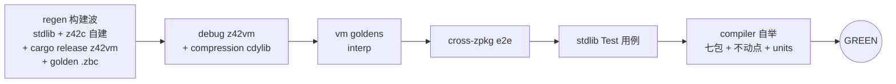

# 测试门禁（test gate）

> **页型**: 机制页 ｜ **状态**: ✅ 已实现 ｜ **代码**: `scripts/test/`
> **相关**: [xtask](xtask.md) · [构建编排](build.md) ｜ **对齐**: 2026-07-02

## 概述

`test` 命令族构成提交门禁（GREEN gate）：裸 `z42 xtask.zpkg test` 串联全部必跑 stage，
任一失败即停；全绿是 commit / push 的先决条件。另提供两种开发期加速——`--scope`（stage 级
缩窄）与 `test changed`（命令级按需计划）——但都不替代提交前的完整 gate。

## 设计目标与约束

- **默认即完整**：裸 `test` 就是全量 gate——"局部验证漏 stage"的风险由默认值消除，
  开发者无须记住要跑哪几个
- **一次失败即停**：stage 串行短路，失败点即诊断起点
- **加速不降门槛**：scope/changed 只服务 iteration；提交判定只认完整 gate
- **自我验证**：compiler stage 内含自举不动点检查（见[构建编排](build.md)），门禁同时守护
  编译器正确性

## 方案与决策

| 决策 | 选择 | 理由 |
|------|------|------|
| 完整 gate 的内容 | cargo build (z42vm) + vm / cross-zpkg / stdlib / compiler 四 stage | 每个 stage 守一类回归面：VM 语义、跨包行为、库正确性、编译器自举 |
| 加速机制分两种 | `--scope`（stage 级）与 `test changed`（命令级） | scope 按子系统粗切、心智简单；changed 按文件精确到单库命令，适合小步迭代 |
| changed 的保守坍缩 | 任一改动文件映射为 full → 整个计划坍缩为 `test all` | 宁可多跑不可漏跑；xtask 自身与 workspace 配置改动一律 full |
| 计划执行方式 | 逻辑命令 in-process 重入 CLI 路由（不 shell out） | 免去每命令一次进程启动；cargo 命令例外走子进程 |
| 产物消费模式 | `--no-build` / `--toolchain <sdk>` 跳过构建波，直接消费已建产物 | CI 集中构建一次（compile-toolchain / compile-test-assets）、多 job 消费；本地缓存后快速迭代 |

## 机制

### 完整 gate 的 stage 流水

先一次性备齐工具链与基线（regen 构建波），再依序跑四个验证 stage；任一步失败立即终止。
设 `--no-build`（或 `--toolchain <sdk>`）时**跳过构建波、直接消费既有产物**——CI 的
`test-host` 正是先经 bootstrap 集中构建、再 `test all --no-build` 消费的形态。
JIT 一致性不在本地默认路径内，由 CI `test-vm-jit` 专腿覆盖（本地可用 `test vm jit` 手动跑）。

### `--scope`：stage 级缩窄

| scope | 跑什么 | 适用 |
|-------|--------|------|
| `full`（默认） | 全部 stage | 提交前判定 |
| `runtime` | 跳 compiler stage | 只改 Rust VM |
| `compiler` | 跳 cargo build | 只改 z42c |
| `stdlib` | 跳 compiler + cargo build | 只改标准库 |
| `docs-only` | 零 stage | 纯文档改动 |
| `auto` | 按 `git diff` 推断上述之一；跨子系统改动回落 `full` | 开发期默认 |

### `test changed`：命令级按需计划

对未提交改动（相对 `BASE`，默认 `HEAD`；含 untracked）逐文件分类，产出**去重后的命令并集**，
依序执行、首败短路。`--dry-run` 只打印计划。映射表（`_mapFile`）：

| 改动路径 | 映射命令 |
|---------|---------|
| `src/libraries/<lib>/src/` | `test lib <lib>` + `test vm` |
| `src/libraries/<lib>/tests/` 或该库 `.toml` | `test lib <lib>` |
| `src/runtime/src/`、`Cargo.toml/lock`、`build.rs` | `cargo test` + `test vm` |
| `src/runtime/tests/` | `cargo test` |
| `src/tests/cross-zpkg/` | `test cross-zpkg` |
| 其余 `src/tests/` | `test vm` |
| `src/compiler/` | `test compiler` + `test vm` |
| `src/toolchain/` | `test lib`（工具链影响 [Test] 执行方式，全库扫） |
| `scripts/xtask*`、`*.workspace.toml`、未识别路径 | **full**（坍缩为 `test all`） |
| 文档 / `.claude/` / examples / bench / artifacts | 跳过 |

与 `--scope=auto` 的关系：不等价——auto 是"选一个 stage 档位"，changed 是"逐文件求命令
并集"（能精确到单个库），且坍缩策略更保守。

## 实现

| 组件 | 位置 | 要点 |
|------|------|------|
| gate 编排 | `scripts/test/xtask_test.z42` 的 `_testAll` | regen 构建波 → 四 stage 串联 |
| VM goldens | `scripts/test/xtask_test_vm.z42` | 枚举 + 并发跑分 + 汇总 |
| cross-zpkg e2e | `scripts/test/xtask_test_cross.z42` | 多 zpkg 协作场景 |
| stdlib [Test] | `scripts/test/xtask_test_lib.z42` + `_lib_units.z42` | 属性发现、批量编译、分片 |
| changed 计划 | `scripts/test/xtask_test_changed.z42` 的 `_buildChangedPlan` / `_mapFile` | git diff → 命令并集 → in-process 执行 |
| 发行版 e2e | `scripts/test/xtask_test_dist.z42` | 打包产物跑 goldens + launcher 冒烟 |
| 平台三段测试 | `scripts/test/xtask_test_platform.z42` + 四平台后端 | build / assets / run |

## 边界与限制

- scope 缩窄与 changed 计划均**不构成 GREEN**——提交判定只认 `--scope=full` 完整 gate
- changed 只看工作区相对 BASE 的 diff，不理解语义依赖（保守坍缩弥补）
- JIT 一致性依赖 CI 专项，本地默认路径不含

## Deferred

- stage 间并发执行（wave 化：compiler ∥ stdlib 等无依赖 stage 并行）尚未实施，当前全串行
