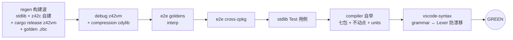

# 测试门禁（test gate）

> **页型**: 机制页 ｜ **状态**: ✅ 已实现 ｜ **代码**: `scripts/test/`
> **相关**: [xtask](xtask.md) · [构建编排](build.md) ｜ **对齐**: 2026-07-07

## 概述

`test` 命令族构成提交门禁（GREEN gate）：裸 `xtask test` 串联全部必跑 stage，
任一失败即停；全绿是 commit / push 的先决条件。另提供开发期加速——`test changed`（命令级
按需计划）与单 stage / `--no-build`——但都不替代提交前的完整 gate。

## 设计目标与约束

- **默认即完整**：裸 `test` 就是全量 gate——"局部验证漏 stage"的风险由默认值消除，
  开发者无须记住要跑哪几个
- **一次失败即停**：stage 串行短路，失败点即诊断起点
- **加速不降门槛**：scope/changed 只服务 iteration；提交判定只认完整 gate
- **自我验证**：compiler stage 内含自举不动点检查（见[构建编排](build.md)），门禁同时守护
  编译器正确性

## 方案与决策

| 决策 | 选择 | 理由 |
|------|------|------|
| 完整 gate 的内容 | cargo build (z42vm) + e2e（goldens + cross-zpkg）/ stdlib / compiler / vscode-syntax stage | 每个 stage 守一类回归面：端到端语义与跨包行为、库正确性、编译器自举、生成产物一致性（Rust VM 单测独立于 gate，见 `test runtime`） |
| 加速机制 | `test changed`（命令级）+ 单 stage / `--no-build` | changed 按文件精确到单库命令，适合小步迭代；单 stage / `--no-build` 反复跑同一测试免重编 |
| changed 的保守坍缩 | 任一改动文件映射为 full → 整个计划坍缩为 `test all` | 宁可多跑不可漏跑；xtask 自身与 workspace 配置改动一律 full |
| 计划执行方式 | 逻辑命令 in-process 重入 CLI 路由（不 shell out） | 免去每命令一次进程启动；cargo 命令例外走子进程 |
| 产物消费模式 | `--no-build` / `--toolchain <sdk>` 跳过构建波，直接消费已建产物 | CI 集中构建一次（compile-toolchain / compile-test-assets）、多 job 消费；本地缓存后快速迭代 |

## 机制

### 完整 gate 的 stage 流水

> **本节是 GREEN gate stage 组成的唯一权威清单（SoT，§4.4）。** 其他文档
> （`scripts/README.md`、`.claude/rules/workflow.md`、`docs/workflow/ci.md`）一律
> 「跑 `xtask test`，stage 组成见此」+ 链接，不再各自复列（历史上复列 5-6 处、已互相漂移
> ——有的漏 vscode-syntax、有的把 stdlib 写成 `test lib`）。改 gate 组成 → 只改这里。

先一次性备齐工具链与基线（regen 构建波），再依序跑五个验证 stage；任一步失败立即终止。
（`vscode-syntax` 守生成产物一致性：`z42.tmLanguage.json` 必须等于「当前 Lexer 关键字表 +
模板」的重渲染——Lexer 加关键字未 `deps install vscode` 重新生成即红，性质同自举不动点。）
（`test runtime` = Rust VM 单测 cargo test **不在** gate 内 —— 它的 signal_handler_e2e
在信号受限的沙箱里会挂;改由每条 CI 腿单独一步 + 本地 `xtask test runtime` 按需跑。）
设 `--no-build`（或 `--toolchain <sdk>`）时**跳过构建波、直接消费既有产物**——CI 的
`test-host` 正是先经 bootstrap 集中构建、再 `test all --no-build` 消费的形态。
JIT 一致性不在本地默认路径内，由 CI `test-vm-jit` 专腿覆盖（本地可用 `test e2e --mode jit` 手动跑）。

### 单 stage / `--no-build`：手动缩窄

直接跑单个 stage（`test e2e --dir <cat>` / `--file 
`、`test stdlib <lib>`、`test compiler`）
可只验一个面；`--no-build`（或 `test e2e --no-rebuild`）跳过重建波、消费已建产物，反复迭代
同一测试时免重编。这些都不构成 GREEN，提交前仍须跑完整 `xtask test`。

> **注**：C# 版 xtask 曾有 `--scope=full|runtime|compiler|stdlib|auto` stage 级缩窄开关；
> z42 版 xtask **尚未实现**（源码 `scripts/test/xtask_test.z42` 注明是 "a later increment"）。
> 现行缩窄手段是下面的 `test changed` 与上面的单 stage / `--no-build`。

### `test changed`：命令级按需计划

对未提交改动（相对 `BASE`，默认 `HEAD`；含 untracked）逐文件分类，产出**去重后的命令并集**，
依序执行、首败短路。`--dry-run` 只打印计划。映射表（`_mapFile`）：

| 改动路径 | 映射命令 |
|---------|---------|
| `src/libraries/<lib>/src/` | `test stdlib <lib>` + `test e2e` |
| `src/libraries/<lib>/tests/` 或该库 `.toml` | `test stdlib <lib>` |
| `src/runtime/src/`、`Cargo.toml/lock`、`build.rs` | `test runtime` + `test e2e` |
| `src/runtime/tests/` | `test runtime` |
| `src/tests/cross-zpkg/` | `test e2e --dir cross-zpkg` |
| 其余 `src/tests/` | `test e2e` |
| `src/compiler/` | `test compiler` + `test e2e` |
| `src/toolchain/` | `test stdlib`（工具链影响 [Test] 执行方式，全库扫） |
| `scripts/xtask*`、`*.workspace.toml`、未识别路径 | **full**（坍缩为 `test all`） |
| 文档 / `.claude/` / examples / bench / artifacts | 跳过 |

changed 是"逐文件求命令并集"（能精确到单个库），任一未识别路径即保守坍缩为完整 `test all`。

## 实现

| 组件 | 位置 | 要点 |
|------|------|------|
| gate 编排 | `scripts/test/xtask_test.z42` 的 `_testAll` | regen 构建波 → 四 stage 串联 |
| VM goldens | `scripts/test/xtask_test_vm.z42` | 枚举 + 并发跑分 + 汇总 |
| cross-zpkg e2e | `scripts/test/xtask_test_cross.z42` | 多 zpkg 协作场景 |
| stdlib [Test] | `scripts/test/xtask_test_lib.z42` + `_lib_units.z42` | 属性发现、批量编译、分片 |
| changed 计划 | `scripts/test/xtask_test_changed.z42` 的 `_buildChangedPlan` / `_mapFile` | git diff → 命令并集 → in-process 执行 |
| 发行版 e2e | `scripts/test/xtask_test_dist.z42` | 打包产物跑 goldens + launcher 冒烟 |
| 平台三段测试 | `scripts/test/xtask_test_platform.z42` + 四平台后端 | build / assets / run |

## 反射 runner 的输出格式（`z42b {test,bench}`）

stdlib / compiler stage 驱动的 `Std.Test.Runner`（`z42b test` / `z42b bench`，取代已退役的 Rust
`z42-test-runner`）支持两种输出，经 `--format` 选择（默认 `pretty`）：

- **pretty**：逐条 `PASS`/`FAIL`/`SKIP` + `Result:` 汇总，供人眼与 gate 退出码判定。
- **json**：单个 `TestReport` 对象 `{tool, module, summary{total,passed,failed,skipped}, results[]}`；
  每条 result 带 `is_benchmark`，benchmark 还带 `bench_stats{label,min_ns,median_ns,max_ns,samples}`。

**bench 结构化数据流**（rebuild-bench-structured-output，跨组件）：benchmark 经
`Bencher.printSummary` 打出 `bench[<label>] min=… median=… max=… samples=…` 一行 → json 模式下
`Runner` 用 `TestIO.captureStdout` 捕获该 benchmark 的 stdout → `BenchStats.parse` 解析为结构化
字段（malformed → `null`，不降级 sentinel）→ 汇入 `TestReport`（手写 JSON，z42.test 无依赖不引
z42.json）。这是旧 Rust `test-runner` 的 `extract_bench_stats_from_stdout` 契约在 z42 里的纯脚本
重实现。格式契约两端——产出端 `Bencher.printSummary` ↔ 消费端 `BenchStats.parse`
（同在 `src/libraries/z42.test/`）——改格式须同提交，`tests/bench_stats.z42` 兜底防漂移。pretty
模式不捕获、逐字节不变（回归零风险）。捕获 benchmark 返回 `Bencher`（结构化数据结构化流动）需改
z42c desugar，受 compiler 锁阻断，记为 Deferred。

## 边界与限制

- 单 stage / `--no-build` 与 changed 计划均**不构成 GREEN**——提交判定只认完整 `xtask test` gate
- changed 只看工作区相对 BASE 的 diff，不理解语义依赖（保守坍缩弥补）
- JIT 一致性依赖 CI 专项，本地默认路径不含

## Deferred

- stage 间并发执行（wave 化：compiler ∥ stdlib 等无依赖 stage 并行）尚未实施，当前全串行
