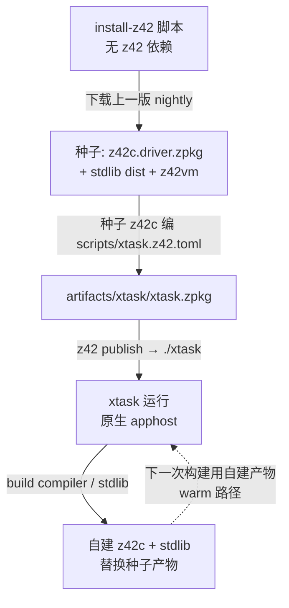
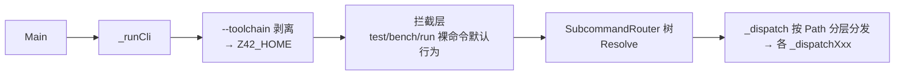

# xtask：自举 dev CLI

> **页型**: 机制页 ｜ **状态**: ✅ 已实现 ｜ **代码**: `scripts/`
> **相关**: [构建编排](build.md) · 编译器·自举与种子（待写）｜ **对齐**: 2026-07-07

## 概述

xtask 是纯 z42 写的仓库开发 CLI（`xtask <cmd>`），统一承载构建、测试、打包、
发行等全部开发动作——它自己就是被 z42c 编译、跑在 z42vm 上的 z42 程序（dogfooding）。
用法与命令清单见 `scripts/README.md`（基础层），本页讲设计与机制。

## 设计目标与约束

- **单一入口**：所有开发动作收敛到一个命令树，杜绝散落 shell 脚本各自为政
- **dogfooding**：用 z42 写开发工具，工具链本身就是语言最大的真实用例
- **自足自举**：冷启动仅需下载上一版 nightly 种子，无其他外部工具链依赖（见"机制"）
- **可重复**：同一命令在本地与 CI 行为一致；产物全部落 `artifacts/`

## 方案与决策

| 决策 | 选择 | 理由 |
|------|------|------|
| 实现语言 | z42（而非 bash / Rust cargo-xtask） | dogfooding 压力测试语言与 stdlib（Cli/IO/Toml/Regex 都被迫成熟）；跨平台无 shell 差异 |
| 命令路由 | `Std.Cli` SubcommandRouter 树 | 每层自动生成 `-h` 帮助；命令面即数据结构，可静态审阅 |
| 工具链选择 | 全局 `--toolchain <dir>` → `Z42_HOME` 环境变量 | 一处剥离、处处生效，命令实现无需逐个透传参数 |
| 运行形态 | 原生 apphost 可执行（仓库根 `./xtask`，内嵌 launcher + zpkg） | 单文件、直接运行，不依赖 PATH 上的 launcher；与用户应用同一套 apphost 机制 |

## 机制

### 自举链路（冷启动 → 日常）



冷启动只发生一次：`install-z42.{sh,bat,command}`（唯一的非 z42 环节）下载 nightly 种子；
此后进入 warm 循环——xtask 编排 z42c 自建自己和 stdlib，产物就地替换，越滚越新。
为什么种子必须存在、新语法为何要晚一个 nightly 才能用——见编译器部分「自举与种子」章（待写）。

### CLI 分发



三段式：① 全局标志剥离（`--toolchain` 两 token 形式从 argv 摘除，last-wins，写入
`Z42_HOME`——单一「SDK 根」变量；simplify-compiler-build 把原 `Z42_TOOLCHAIN` 折进 `Z42_HOME`）；
② 拦截层给裸命令定默认语义（裸 `test` = 完整 GREEN gate、裸 `bench` = e2e、
`run` 原样透传 launcher）；③ 路由树解析后按路径首段分发到各子模块的 handler。

### `--toolchain` / `Z42_HOME` 的作用范围

设了 toolchain 后，**所有**解析"用哪套 z42c / stdlib / z42vm"的路径函数
（`_toolchainDir` → `_toolchainDriverHome` / `_toolchainLibs`）都优先取该 `Z42_HOME` 目录，
否则回落 build-tree（`artifacts/build/`）。也就是说它不是某几个命令的参数，而是全局的
"工具链根切换"——例如 `regen --toolchain <dir>` 会用该工具链的 z42c 编 golden。
`Z42_HOME` 跨两种布局：SDK-toolchain（`programs/`+`libs/`+`bin/z42vm`，`--toolchain` 或便携 SDK）
与 managed 安装（`runtimes/`+`config.toml`）；消费端按 `programs/` / `bin/z42vm` 是否存在守卫，
managed 布局的 `Z42_HOME` 不符 SDK-toolchain 布局时自动回落 build-tree，不会错位。

## 实现

代码全在 `scripts/`，按职责分子目录；逐文件职责表见 `scripts/README.md`（基础层，不重复）。
机制级要点：

| 组件 | 位置 | 要点 |
|------|------|------|
| 入口（**仅此**） | `scripts/xtask.z42` | `Main` → `_ensureDriverVm` 校验 VM → `_runCli`；外加 `run` 直通（`_runCli` 在 Resolve 前拦截）。**不含任何命令 handler**——它们归各自族目录（relocate-xtask-handlers, 2026-09-05） |
| CLI 核心 | `scripts/xtask_cli.z42` | `_applyToolchainOpt`/`_applyVerbosityOpt` 剥离全局标志 → `_cliRoot` 构造根树 → `_dispatch` 按顶层命令分流 |
| 各命令族的 router + dispatch | `scripts/cli/xtask_cli_<族>.z42` | build / package / test / deps / bench 各一文件（见下节） |
| 共享基建 | `scripts/common/` | 路径解析、进程执行、versions.toml、golden 枚举 |
| 构建编排 | `scripts/build/` | 见[构建编排](build.md) |
| 测试编排 | `scripts/test/` | 见[测试门禁](test-gate.md) |
| 打包引擎 | `scripts/package/` + `scripts/packages.toml` | 见[打包引擎](packaging.md) |
| 依赖安装 | `scripts/install/` + `scripts/xtask_deps.z42` | 依赖两层模型 + `deps check/install/env` 三正交子命令（见下节） |

### CLI 分层：核心 + 每族一文件（split-xtask-cli, 2026-09-05）

每个命令族有两件东西：**router**（声明该族每个叶子的 flag / option / positional，`-h`
文本由此生成）和 **dispatch**（把已解析的命令转给 handler）。二者**成对出现、族间零耦合**
——`build` 的 router 与 `test` 的 dispatch 之间没有任何引用。所以按**族**分文件，而不是
按「所有 router 一段、所有 dispatch 一段」：

```
scripts/xtask_cli.z42              核心：全局选项剥离 → _cliRoot 根树 → _dispatch 分流
scripts/cli/xtask_cli_build.z42    _buildRouter    + _dispatchBuild
scripts/cli/xtask_cli_package.z42  _packageRouter  + _dispatchPackage
scripts/cli/xtask_cli_test.z42     _testRouter (+_platformRouter) + _dispatchTest
scripts/cli/xtask_cli_deps.z42     _depsRouter     + _dispatchDeps
scripts/cli/xtask_cli_bench.z42    _benchRouter    + _dispatchBench + default-action e2e 入口
```

**加一个命令族** = `scripts/cli/` 加一个文件 + `_cliRoot` 加一行 `AddRouter` +
`_dispatch` 加一行。namespace 扁平（`Z42Xtask`）、`include = ["**/*.z42"]` 递归收录，
所以拆文件不需要改任何 import。

> 两个 **default-action** 命令（`test` 空子命令 = 全 gate、`bench` 空子命令 = e2e）
> 是路由树表达不了的，由 `_runCli` 在 `Resolve` 之前拦截；它们仍注册在树里，好让
> `xtask -h` 列出、`xtask bench stdlib -h` 正常工作。

### 依赖两层模型（`deps`，simplify-xtask-deps 2026-07-07）

工具链依赖按"没有它平台的构建/测试能不能跑"分两层：

- **平台必备**：`deps install --os <p>` 显式装——android = rust targets + cargo-ndk +
  JDK + build-tier SDK；ios = rust targets + Xcode 检查；wasm = rust targets +
  wasm-pack + **hermetic node**（wasm 测试面必备，从旧"手动 step"升格）。
  **无 `--os` = 当前 host 基础**（跨平台 rust/node 检查，不铺开装交叉栈——User 裁决
  2026-07-08，交叉平台栈一律显式 opt-in）。
- **用到才装**：重型/兜底依赖零命令面，消费步骤检测缺失后自动装——android
  emulator tier（emulator + system-image + AVD + Gradle，~4GB）由
  `test platform android run`（`AndroidBackend.RunTests`）安装；node 兜底由 wasm
  测试步骤安装。安装失败 = 该步骤失败，不吞不跳过。

命令面三正交子命令：`deps check [--os]`（唯一只读校验 = presence + versions.toml↔
投影 drift 单实现）、`deps install [--os] [--force]`（纯安装）、`deps env`（可 eval
的 `ANDROID_NDK_HOME` 导出，stdout 纯净）。**check 退出码策略**：drift 与机器无关、
恒致败；presence 仅显式 `--os <p>` 时致败——CI 的 build-and-test 在无平台 SDK 的
runner 上裸跑 `deps check` 当 drift 门禁，presence 缺失在那里是预期的（信息性展示）。

## 边界与限制

- **冷启动依赖网络**：fresh checkout 无种子时必须能下载 nightly（CI 全新 runner 同理）
- **格式漂移窗口**：zbc/zpkg format bump 后，旧 nightly 种子不可读，需等新 nightly 发布
- **z42vm 前置**：xtask 启动即校验 z42vm 可用（`_ensureDriverVm`）；多数命令以子进程驱动 z42vm / z42c

## Deferred

- **z42b 构建编排器**：`src/toolchain/builder/` 仅骨架（无 toml、未接编译）；设计草案见旧
  `docs/design/toolchain/build-orchestrator.md`（前瞻，未实施）
