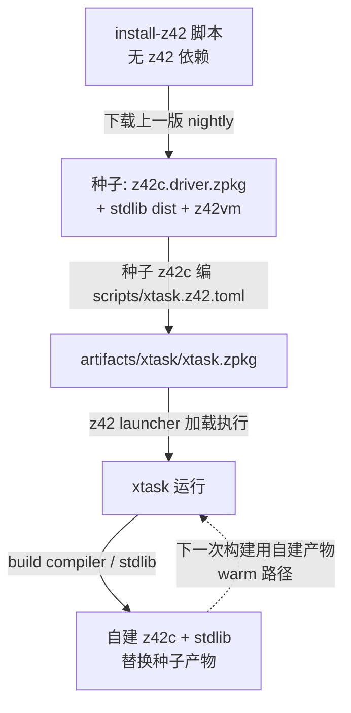
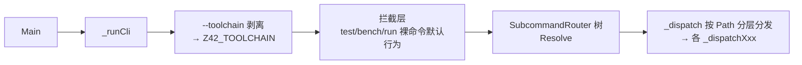

# xtask：自举 dev CLI

> **页型**: 机制页 ｜ **状态**: ✅ 已实现 ｜ **代码**: `scripts/`
> **相关**: [构建编排](build.md) · 编译器·自举与种子（待写）｜ **对齐**: 2026-07-02

## 概述

xtask 是纯 z42 写的仓库开发 CLI（`z42 xtask.zpkg <cmd>`），统一承载构建、测试、打包、
发行等全部开发动作——它自己就是被 z42c 编译、跑在 z42vm 上的 z42 程序（dogfooding）。
用法与命令清单见 `scripts/README.md`（基础层），本页讲设计与机制。

## 设计目标与约束

- **单一入口**：所有开发动作收敛到一个命令树，杜绝散落 shell 脚本各自为政
- **dogfooding**：用 z42 写开发工具，工具链本身就是语言最大的真实用例
- **自足自举**：冷启动仅需下载上一版 nightly 种子，无其他外部工具链依赖（见"机制"）
- **可重复**：同一命令在本地与 CI 行为一致；产物全部落 `artifacts/`

## 方案与决策

| 决策 | 选择 | 理由 |
|------|------|------|
| 实现语言 | z42（而非 bash / Rust cargo-xtask） | dogfooding 压力测试语言与 stdlib（Cli/IO/Toml/Regex 都被迫成熟）；跨平台无 shell 差异 |
| 命令路由 | `Std.Cli` SubcommandRouter 树 | 每层自动生成 `-h` 帮助；命令面即数据结构，可静态审阅 |
| 工具链选择 | 全局 `--toolchain <dir>` → `Z42_TOOLCHAIN` 环境变量 | 一处剥离、处处生效，命令实现无需逐个透传参数 |
| 运行形态 | launcher 加载 zpkg 为主，可选 `z42 publish desktop` 出原生 apphost | 开发期免编译原生壳；发行期可独立可执行 |

## 机制

### 自举链路（冷启动 → 日常）

冷启动只发生一次：`install-z42.{sh,bat,command}`（唯一的非 z42 环节）下载 nightly 种子；
此后进入 warm 循环——xtask 编排 z42c 自建自己和 stdlib，产物就地替换，越滚越新。
为什么种子必须存在、新语法为何要晚一个 nightly 才能用——见编译器部分「自举与种子」章（待写）。

### CLI 分发

三段式：① 全局标志剥离（`--toolchain` 两 token 形式从 argv 摘除，last-wins，写入
`Z42_TOOLCHAIN`）；② 拦截层给裸命令定默认语义（裸 `test` = 完整 GREEN gate、裸 `bench` = e2e、
`run` 原样透传 launcher）；③ 路由树解析后按路径首段分发到各子模块的 handler。

### `--toolchain` / `Z42_TOOLCHAIN` 的作用范围

设了 toolchain 后，**所有**解析"用哪套 z42c / stdlib / z42vm"的路径函数
（`_toolchainDir` → `_toolchainDriverHome` / `_toolchainLibs`）都优先取 toolchain 目录，
否则回落 build-tree（`artifacts/build/`）。也就是说它不是某几个命令的参数，而是全局的
"工具链根切换"——例如 `regen --toolchain <dir>` 会用该工具链的 z42c 编 golden。

## 实现

代码全在 `scripts/`，按职责分子目录；逐文件职责表见 `scripts/README.md`（基础层，不重复）。
机制级要点：

| 组件 | 位置 | 要点 |
|------|------|------|
| 入口 + 顶层 handler | `scripts/xtask.z42` | `Main` → `_ensureDriverVm` 校验 VM → `_runCli` |
| 路由树 + 分发 | `scripts/xtask_cli.z42` | `_cliRoot` 构造树；`_applyToolchainOpt` 剥离全局标志 |
| 共享基建 | `scripts/common/` | 路径解析、进程执行、versions.toml、golden 枚举 |
| 构建编排 | `scripts/build/` | 见[构建编排](build.md) |
| 测试编排 | `scripts/test/` | 见[测试门禁](test-gate.md) |
| 打包引擎 | `scripts/package/` + `scripts/packages.toml` | 见[打包引擎](packaging.md) |
| 依赖安装 | `scripts/install/` | 跨平台 toolchain 检查/安装（rust/node/android SDK…） |

## 边界与限制

- **冷启动依赖网络**：fresh checkout 无种子时必须能下载 nightly（CI 全新 runner 同理）
- **格式漂移窗口**：zbc/zpkg format bump 后，旧 nightly 种子不可读，需等新 nightly 发布
- **launcher 前置**：`z42 xtask.zpkg` 形态要求 PATH 上有 z42（launcher）与 z42vm

## Deferred

- **z42b 构建编排器**：`src/toolchain/builder/` 仅骨架（无 toml、未接编译）；设计草案见旧
  `docs/design/toolchain/build-orchestrator.md`（前瞻，未实施）
