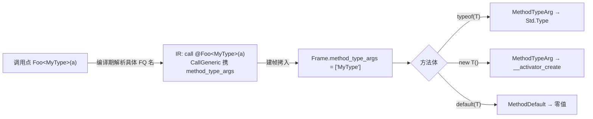
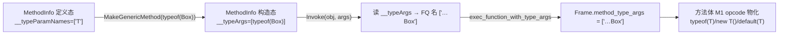

# 泛型方法（方法级类型参数）

> 对齐：2026-08-22（change `add-generic-methods` M1 + `add-reflective-invoke` G2/构造函数反射）

方法可以有**自身的类型参数**（独立于所在类的类型参数），在调用点用 `Foo<Type>(args)` 显式指定，
方法体内可对这些类型参数做 `typeof(T)`、`new T()`、`default(T)`：

```z42
Type Of<T>()      { return typeof(T); }     // T 的具体运行期句柄
T    Zero<T>()    { return default(T); }    // T 的零值（引用→null / 值→0/false）
object New<T>()   { return new T(); }        // 反射构造一个 T 实例

class Reflector {
    public static T Deserialize<T>(string json) { /* … typeof(T) 驱动 … */ }
}

var t = Of<Point>();              // typeof(Point) —— 真句柄，可 .GetFields() 枚举
var z = Zero<int>();              // 0
var p = New<Point>();             // new Point()
```

自由函数与静态/实例方法都支持；这是 0.5.x serde 招牌 `JsonSerializer.Deserialize<T>(json)` 的语言前置。

## 与类级泛型的关系

类级类型参数（`class Box<T>`）与方法级类型参数是**两套独立作用域**。方法体内一个类型名同时可能是
类形参或方法形参时，**方法级优先**（就近作用域）：

```z42
class Box<T> {
    U Convert<U>(T input) {   // T = 类形参，U = 方法形参
        var tu = typeof(U);   // 方法级：读 frame.method_type_args
        var tt = typeof(T);   // 类级：读实例 type_args（见「实现原理」）
        …
    }
}
```

## `<` 的歧义消解

`名<...>(` 既可能是泛型调用的类型实参、也可能是小于比较（`a < b > c`）。parser 用**有限前瞻 +
零副作用回滚**：`名<` 后尝试解析「类型列表 `>`」且其后紧跟 `(` → 判为泛型调用；否则回退为比较。

```z42
bool r = a < b && b > c;   // 两个比较，不是泛型调用
int  g = Id<int>(x);       // 泛型调用
```

## 校验

- **arity**：类型实参数必须等于方法声明的类型形参数，否则 `E0446`。
- **where 约束**：方法的 `where` 子句在调用点校验（复用 `ConstraintChecker`，与类级同规则）。

## 实现原理与流程

**核心对称**：类型形参的具化 = **执行上下文携带具体类型名**。

| 维度 | 载体 | 读取指令 |
|------|------|----------|
| 类级（`class Box<T>`） | 实例 `Object.type_args`（`regs[0]`，由 `obj.new` 填充） | `DefaultOf`（读 `regs[0]`） |
| **方法级**（`Foo<T>()`，本 change） | **`Frame.method_type_args`**（建帧时由调用点填充） | `MethodTypeArg` / `MethodDefault`（读 frame 槽） |

静态方法没有 `this`，无法用实例载体——所以方法级新增一个 **frame 槽**，与类级实例载体对称。

```
调用点  Foo<MyType>(a)
          │  编译期：TypeChecker 把 <MyType> 解析成具体 FQ 名，挂到 BoundCall
          ▼
IR      call @Foo<MyType>(a)        ← CallGeneric / VCallGeneric（携 method_type_args: string[]）
          │
          ▼ interp 建帧：把 method_type_args 拷入 callee frame
Frame   { regs=[a], method_type_args: ["MyType"] }
          │
方法体  typeof(T) / new T() / default(T)
          │  IR：MethodTypeArg{dst, param_index} / MethodDefault{dst, param_index}
          ▼
运行期  make_type_from_name(frame.method_type_args[param_index]) → 具体 Std.Type
        · typeof(T) = 该 Type
        · new T()   = MethodTypeArg → __activator_create(Type)
        · default(T)= MethodDefault → default_value_for(名)（引用→null / 值→零值）
```



### 关键决策

- **frame 槽（本质方案）而非 codegen 隐藏参数**：把 type_args 偷渡进值参通道对反射式 invoke 用不上，
  是临时方案，已否决。
- **`method_type_args` 存解析后的具体 FQ 名（String）**，与类级 `instance.type_args` 一致——
  `make_type_from_name` / `default_value_for` 都以名为输入，调用点编译期已知具体类型 → 直接编码。
- **非泛型调用逐字节不变**：只有携类型实参时才发 `CallGeneric`/`VCallGeneric`（新 opcode）；普通
  `Call`/`VCall`（0x50/0x52）编码不动 → 全仓自举 byte-identical。
- **JIT**：含方法级泛型指令、或含泛型调用点的函数暂走解释器（`jit_unsupported_reason` 拦截）；
  JIT frame 尚无 `method_type_args` 载体，留后续。

### 边界（M1 Scope）

- **M1 只做直接调用** `Foo<T>()`；反射式 `MakeGenericMethod().Invoke()` 由 **G2**
  （add-reflective-invoke）补齐，见下节。
- **类级 `typeof(T)` 的具体化不在本 Scope**（当前仍产占位名）；本 change 只补方法级。
- 类型**推断**（从实参推 `T`，省略 `<...>`）留后续；M1 要求显式写 `Foo<T>()`。

## 方法级形参转发（add-generic-activator）

M1 曾要求「类型实参须为具体类型」——调用者**把自己的方法级形参 `T` 转发给嵌套泛型调用**
（`Foo<T>() { Bar<T>() }`）此前不支持：调用点发字面 `"T"`，被调方 `typeof(T)` 的
`make_type_from_name("T")` 落空 → 丢 handle。**add-generic-activator 修复了顶层转发**（`Activator.CreateInstance<T>()`
在泛型方法内可用的前置）。

**机制（`$mta:<idx>` 标记，零格式改动）**：

```
Make<ActWidget>()              → Make frame.method_type_args = ["…ActWidget"]   （具体名）
  内部 Activator.CreateInstance<T>()
    编译期：T 是 Make 的方法级形参(idx=0) → 发标记 "$mta:0"（而非字面 "T"）
    运行期：exec_call/exec_vcall 在拷入 callee frame 前，把 "$mta:0" 换成
            调用方(Make) frame.method_type_args[0] = "…ActWidget"
    → CreateInstance frame.method_type_args = ["…ActWidget"] → typeof(T) 得具体 handle ✓
```

- **编译期**：`_applyMethodTypeArgs` 若类型实参是外层方法级形参（`env.MethodParamIndexOf ≥ 0`），
  在 `BoundCall.MethodTypeArgFwd` 记其下标；`_methodTypeArgNames` 据此发 `$mta:<idx>`。
- **运行期**：`resolve_forwarded_mta`（interp/mod.rs）按**调用方** frame 解析标记。嵌套天然成立
  （每层调用在设置自己 callee frame 前解析，故调用方 frame 的槽已是具体名）。
- **零格式改动**：`method_type_args` 本就是 `string[]`，`$mta:<idx>` 只是标记串；无新 opcode。
  无标记的调用（具体实参 / 类级形参）产物**字节不变**（`starts_with("$mta:")` 门控）。
- **限制**：只做**顶层**类型实参转发（`Bar<T>`）；`Bar<List<T>>` 里嵌套的 T（标记落在尖括号内）留
  后续（需 `make_type_from_name` 角括号解析里嵌转发）。

## 反射式调用（G2 — MakeGenericMethod + Invoke）

> add-reflective-invoke。M1 的直接调用在**编译期**把类型实参编进 `CallGeneric` 指令；G2 让
> 类型实参在**运行期**经 `MethodInfo` 绑定后再调用，路径不同但**复用 M1 的帧槽物化**。参照 C#
> `System.Reflection.MethodInfo.{IsGenericMethod, GetGenericArguments, MakeGenericMethod}`。

```z42
using Std.Reflection;

class Reflector { public static string TypeName<T>() { return typeof(T).Name; } }

MethodInfo def  = /* 从 typeof(Reflector).GetMethods() 取到的 "TypeName" */;
Assert.True(def.IsGenericMethod);
Assert.True(def.IsGenericMethodDefinition);          // 未绑定的定义态
Type[] tp = def.GetGenericArguments();               // 定义态 → 类型形参占位 [T]

MethodInfo made = def.MakeGenericMethod(typeof(Box));// 绑定 → 构造态
Assert.Equal(false, made.IsGenericMethodDefinition);
object r = made.Invoke(null, new object[]{});        // == 直接调用 Reflector.TypeName<Box>()
```

### 数据流（复用 M1 帧槽）



- **构造态无独立子类型**（参 C#）：`MakeGenericMethod` 返回同为 `MethodInfo` 的对象，只是多带隐藏
  `__typeArgs`（`Std.Type[]`），并翻转 `IsGenericMethodDefinition=false`。
- **元数据来源无格式 bump**：方法级类型形参名早已由 zbc SIGS 段的 `tpCount` 槽承载
  （此前 writer 恒写 0），G2 让 `ZbcWriter` 填真实值即可——非泛型方法 `tpCount=0` 逐字节不变，
  reader 全链路（z42 + Rust）早已就绪。反射侧经 `Function.type_params()` → `build_method_info`
  露出 `IsGenericMethod` + `__typeParamNames`。
- **Invoke 线程**：`builtin_method_invoke` 读 `__typeArgs` 的每个 `Type` 取其 FQ 名，经
  `exec_function_with_type_args` 填入 callee `frame.method_type_args`（M1 建的槽）→ 方法体
  `MethodTypeArg`/`MethodDefault` opcode 物化，与直接调用**逐点一致**。空切片（非泛型/定义态）→
  与非泛型 Invoke byte-identical。
- **arity 校验**：`MakeGenericMethod` 在 native 层校验（非泛型 / 实参数 ≠ 类型形参数 → 可 catch 的
  `Std.Exception`）。反射式 `where` 约束校验留 Deferred（M1 直接调用仍有编译期约束校验）。

## 构造函数反射（MethodBase / ConstructorInfo）

> add-reflective-invoke。反射类型层级对齐 C# `MemberInfo → MethodBase → {MethodInfo,
> ConstructorInfo}`。`ConstructorInfo.Invoke(args)` 提供**带参构造**（此前 `Activator.CreateInstance`
> 只无参、且不跑构造函数）。

```z42
ConstructorInfo[] ctors = typeof(Point).GetConstructors();
ConstructorInfo two = /* GetParameters().Length == 2 的那个 */;
object p = two.Invoke(new object[]{ 3, 4 });         // 分配 + 跑 ctor + 返回初始化实例
```

- **层级**：`MethodBase : MemberInfo` 承载 `IsStatic`/`__qualified`/`GetParameters()` 共享成员；
  `MethodInfo` 与 `ConstructorInfo` 各自继承并各带 `Invoke`（语义不同：方法调用 vs 建实例）。
- **枚举靠 `func_index` 而非 `own_methods`**（**关键坑**）：构造函数是命名为
  `<ClassFQN>.<SimpleName>[$N]` 的普通函数，**单个非重载 ctor 不进 `own_methods`/vtable**（只重载
  ctor 才进）。故 `__type_constructors` 扫 `module.func_index` 键，取 `<ClassFQN>.` 前缀后、首个
  `$` 前的段等于类简名者；按 func-index 去重（bare + mangled 别名）+ 按键排序（确定序）。
- **`ConstructorInfo.Invoke(args)` = 带参构造**：解析类 → 默认字段分配（同 `__activator_create`）→
  以新对象为 reg0 + args 跑 ctor 函数 → 返回对象。arity 错 / ctor 体内 throw 均走 catchable 通道。
  重开了此前 Deferred 的带参构造能力；`Activator.CreateInstance(Type)` 保持无参快路径不变。
- **Deferred**：`GetConstructor(Type[])` 按参数类型的重载解析（调用方用 `GetConstructors()` +
  `GetParameters()` 自选）。
