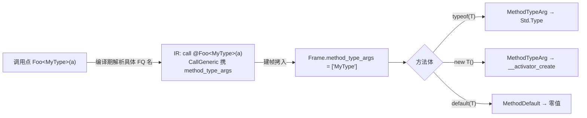

# 泛型方法（方法级类型参数）

> 对齐：2026-08-21（change `add-generic-methods`，M1）

方法可以有**自身的类型参数**（独立于所在类的类型参数），在调用点用 `Foo<Type>(args)` 显式指定，
方法体内可对这些类型参数做 `typeof(T)`、`new T()`、`default(T)`：

```z42
Type Of<T>()      { return typeof(T); }     // T 的具体运行期句柄
T    Zero<T>()    { return default(T); }    // T 的零值（引用→null / 值→0/false）
object New<T>()   { return new T(); }        // 反射构造一个 T 实例

class Reflector {
    public static T Deserialize<T>(string json) { /* … typeof(T) 驱动 … */ }
}

var t = Of<Point>();              // typeof(Point) —— 真句柄，可 .GetFields() 枚举
var z = Zero<int>();              // 0
var p = New<Point>();             // new Point()
```

自由函数与静态/实例方法都支持；这是 0.5.x serde 招牌 `JsonSerializer.Deserialize<T>(json)` 的语言前置。

## 与类级泛型的关系

类级类型参数（`class Box<T>`）与方法级类型参数是**两套独立作用域**。方法体内一个类型名同时可能是
类形参或方法形参时，**方法级优先**（就近作用域）：

```z42
class Box<T> {
    U Convert<U>(T input) {   // T = 类形参，U = 方法形参
        var tu = typeof(U);   // 方法级：读 frame.method_type_args
        var tt = typeof(T);   // 类级：读实例 type_args（见「实现原理」）
        …
    }
}
```

## `<` 的歧义消解

`名<...>(` 既可能是泛型调用的类型实参、也可能是小于比较（`a < b > c`）。parser 用**有限前瞻 +
零副作用回滚**：`名<` 后尝试解析「类型列表 `>`」且其后紧跟 `(` → 判为泛型调用；否则回退为比较。

```z42
bool r = a < b && b > c;   // 两个比较，不是泛型调用
int  g = Id<int>(x);       // 泛型调用
```

## 校验

- **arity**：类型实参数必须等于方法声明的类型形参数，否则 `E0446`。
- **where 约束**：方法的 `where` 子句在调用点校验（复用 `ConstraintChecker`，与类级同规则）。

## 实现原理与流程

**核心对称**：类型形参的具化 = **执行上下文携带具体类型名**。

| 维度 | 载体 | 读取指令 |
|------|------|----------|
| 类级（`class Box<T>`） | 实例 `Object.type_args`（`regs[0]`，由 `obj.new` 填充） | `DefaultOf`（读 `regs[0]`） |
| **方法级**（`Foo<T>()`，本 change） | **`Frame.method_type_args`**（建帧时由调用点填充） | `MethodTypeArg` / `MethodDefault`（读 frame 槽） |

静态方法没有 `this`，无法用实例载体——所以方法级新增一个 **frame 槽**，与类级实例载体对称。

```
调用点  Foo<MyType>(a)
          │  编译期：TypeChecker 把 <MyType> 解析成具体 FQ 名，挂到 BoundCall
          ▼
IR      call @Foo<MyType>(a)        ← CallGeneric / VCallGeneric（携 method_type_args: string[]）
          │
          ▼ interp 建帧：把 method_type_args 拷入 callee frame
Frame   { regs=[a], method_type_args: ["MyType"] }
          │
方法体  typeof(T) / new T() / default(T)
          │  IR：MethodTypeArg{dst, param_index} / MethodDefault{dst, param_index}
          ▼
运行期  make_type_from_name(frame.method_type_args[param_index]) → 具体 Std.Type
        · typeof(T) = 该 Type
        · new T()   = MethodTypeArg → __activator_create(Type)
        · default(T)= MethodDefault → default_value_for(名)（引用→null / 值→零值）
```



### 关键决策

- **frame 槽（本质方案）而非 codegen 隐藏参数**：把 type_args 偷渡进值参通道对反射式 invoke 用不上，
  是临时方案，已否决。
- **`method_type_args` 存解析后的具体 FQ 名（String）**，与类级 `instance.type_args` 一致——
  `make_type_from_name` / `default_value_for` 都以名为输入，调用点编译期已知具体类型 → 直接编码。
- **非泛型调用逐字节不变**：只有携类型实参时才发 `CallGeneric`/`VCallGeneric`（新 opcode）；普通
  `Call`/`VCall`（0x50/0x52）编码不动 → 全仓自举 byte-identical。
- **JIT**：含方法级泛型指令、或含泛型调用点的函数暂走解释器（`jit_unsupported_reason` 拦截）；
  JIT frame 尚无 `method_type_args` 载体，留后续。

### 边界（M1 Scope）

- **只做直接调用** `Foo<T>()`；反射式 `MakeGenericMethod().Invoke()` 拆后续（type_args 来自
  运行期 `MethodInfo` 而非编译期调用点，路径不同）。
- **类型实参须为具体类型**；调用者把自己的类型形参转发给被调方法（嵌套泛型转发）留后续。
- **类级 `typeof(T)` 的具体化不在本 Scope**（当前仍产占位名）；本 change 只补方法级。
- 类型**推断**（从实参推 `T`，省略 `<...>`）留后续；M1 要求显式写 `Foo<T>()`。
