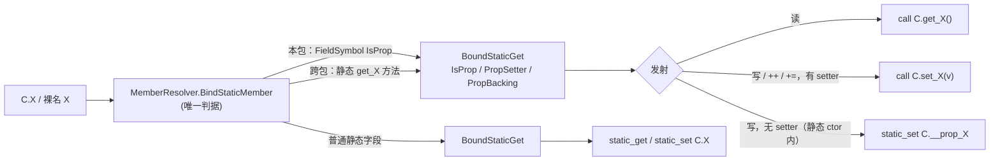

# 属性与索引器（成员访问器）

> 对齐日期：2026-09-14 · 静态属性 / 属性初始化器：change `add-static-properties`（2026-09-14）· 表达式体成员：change `add-expression-bodied-members`（2026-09-13）· 计算属性 getter：change `add-property-getter`（2026-08-18）· 索引器多维使用侧：change `add-multidim-indexer`（2026-08-11）

成员访问器让字段式 / 下标式语法背后跑用户逻辑，语义与 C# 一致：

| 访问器 | 声明 | 使用 | lower 成 |
|--------|------|------|---------|
| **属性（property）** | `T Name { get; set; }`（auto）/ `T Name { get { ... } }` 或 `T Name => e;`（计算） | `obj.Name` / `obj.Name = v` | `get_Name()` / `set_Name(v)`（auto 另合成后备字段 `__prop_Name`；计算 getter 无后备字段） |
| **索引器（indexer）** | `T this[P...] { get {...} set {...} }` | `obj[i]` / `obj[i] = v` | `get_Item(...)` / `set_Item(..., v)` |

两者都在编译期 lower 成普通实例方法（镜像 C# 的 `get_X`/`set_X`、`get_Item`/`set_Item`），
因此天然支持虚派发与跨 zpkg 调用。

---

## 属性（property）

### 自动属性（auto-property）

**自动属性**：访问器只写 `get;` / `set;`（分号结尾），编译器合成后备字段与访问器方法。

```z42
class Person {
    public string Name { get; set; }     // 读写
    public int Age { get; private set; } // 读公开、写私有（per-accessor 可见性）
    public bool Active { get; }          // 只读（只有 getter）
}
```

- **per-accessor 可见性**：`get` / `set` 前可各自加可见性修饰（如 `private set`）。
- **只读属性**：只写 `{ get; }`。**只能在本类构造函数内经 `this` 赋值**（对标 C# CS0200 的只读
  自动属性），其它位置赋值报 **E0452**；计算属性（`get { ... }`）无存储，**任何位置**都不可赋值。
- **初始化器**：`T Name { get; set; } = expr;` 给后备字段一个初值（`add-static-properties` 前**从未生效**——
  parser 解析了、语义层零读取点，读回类型默认值）。语义对标 C#：
  - **直写后备 `__prop_Name`，不经 setter**（派生类 override 的 setter 不参与；get-only 也能初始化）；
  - 与字段初始化器**按声明序交错**执行，先于用户 ctor 体；无 ctor 的合成构造同样生效；
  - `: this(..)` 委托 ctor 不重复执行（与字段初始化器同规则）；
  - 只有 auto 属性有存储可初始化——计算属性写初始化器报 **E0452**。

```z42
public int Count { get; set; } = 0;
```

### 计算属性 getter（`get { ... }`，add-property-getter）

getter 可写**块体** `get { <stmts>; return <expr>; }`，在字段/其它成员之上**计算**派生值，语义与
C# 计算属性一致。计算 getter **不合成后备字段**——每次读取都执行 getter 函数体（无存储）。

```z42
public class Box {
    public int n;
    public int Doubled { get { return this.n * 2; } }       // 派生自字段
    public bool Big     { get { return this.n > 10; } }      // 布尔派生
    public int Plus     { get { return this.Doubled + 1; } } // 引用另一计算属性
}
// b.Doubled 每次按当前 n 重算；无 __prop_Doubled 后备字段。
```

- **get-only**：本特性只支持计算 `get { ... }` / `get => e;`；`set { ... }`（计算 setter）尚未支持。
- **auto vs 计算的区分**：`get;`（分号）= auto-property（合成后备字段）；`get { ... }`（块体）=
  计算属性（无后备字段，getter 是真实函数体）。
- getter 体内可访问 `this`、本类字段、其它属性（`this.Doubled` 派发到 `get_Doubled`）。

### 表达式体属性（`=> e;`，add-expression-bodied-members）

只读计算属性可写成表达式体，语义与 C# 一致：

```z42
public class Box {
    public int n;
    public int Doubled => this.n * 2;          // ≡ { get { return this.n * 2; } }
    public bool Big { get => this.n > 10; }    // 访问器级表达式体，同上
}
public class Tri : Shape {
    public override string Name => "Tri";      // 实现抽象 / 接口属性
}
```

- **纯 parser 脱糖**：`T P => e;` 与 `T P { get => e; }` 在 `MemberParser` 里直接产出与
  `T P { get { return e; } }` **逐字相同**的 `PropertyDecl`（`HasGetBody` + 单语句 `return` 块），
  下游（符号收集 / 体绑定 / IrGen / 跨包导出）没有任何新路径——parser 单测以 AST dump 相等断言这一点。
- 与表达式体**方法** `int F() => 1;` 靠成员名后的下一个 token 区分：`(` → 方法，`=>` → 属性。
- 方法 / 属性 / 索引器共用同一个 `_parseArrowBody`：非 void → `{ return e; }`，void 访问器（索引器
  `set`）→ `{ e; }`。
### 静态属性（add-static-properties）

`static` 修饰的属性全形态可用，语义对标 C#：

```z42
class Config {
    public static int Level { get; set; } = 2;     // auto，读写 + 初始化器
    public static string Name => "cfg";             // 计算（也可 `{ get { .. } }` / `{ get => e; }`）
    public static int Seed { get; }                 // get-only：仅本类静态 ctor 内可写
    static Config() { Seed = 42; }

    public static int Next() { Level++; return Level + Seed; }   // 类内裸名 ≡ Config.Level
}
Config.Level += 3;                                  // 限定名读 / 写 / 复合 / 自增
```

- **后备**：静态 auto 属性合成**静态**字段 `__prop_X`，访问器是 0 参 / 1 参静态函数（桩发 `static_get` / `static_set`）。
- **赋值边界（E0452）**：get-only auto 仅**本类静态 ctor** 内可写（实例 ctor 不行——那是实例初始化）；
  计算属性任何位置不可写；复合赋值 / `++` 同样受约束。
- **静态计算 getter 体是静态上下文**：`this` 与实例字段不可用。
- **初始化器**：无静态 ctor 进 per-CU `__static_init__`；有静态 ctor 注入其体首（与静态字段初始化器同一机制，见
  [静态构造函数](static-constructors.md)）。
- **跨包**可读写；导入类拿不到后备名，给只读静态属性赋值的 E0452 统一是「it has no setter」措辞。
- 改动前：任何写法都**静默错编**——使用位 `C.X` 发 `static_get C.X`（不存在的字段）⇒ 运行期
  `MissingSymbolException`、编译零诊断；类内裸名 `X` 报 E0401。

#### 实现原理：属性访问复用 `BoundStaticGet`



- **为什么不新增 Bound 节点**：`BoundStaticGet` 已被读、赋值、`++/--`、复合赋值、const/readonly 检查识别；新增节点类型
  意味着每个 walker 补分支，**漏一个就是静默跳过**。扩字段后只有发射端三个分叉点（`ExprEmitter` 读、
  `AccessEmitter._emitStaticStore` 写、`OperatorEmitter` 写回）需要知道「这是属性」。
- **元数据在绑定期填好**，发射端与 `AssignTyper` 只读节点、不回查符号表——跨包类根本没有属性 `FieldSymbol`
  （跨包符号由 `TsigReconcile` 从 IR 签名重建，只有静态访问器函数）。
- **访问器调用复用静态调用的目标限定**（`CallEmitter._emitStaticAccessor`：本包 `QualifyClass`、依赖包走
  DepIndex），实参是已发射寄存器——赋值表达式要保住右值寄存器、`++` 要复用读出的旧值。

### 机制：后备字段 + get_X / set_X

自动属性 `T Name { get; set; }` 在类上合成（镜像 C# `SynthesizeClassAutoProp`）：

- 私有后备字段 `__prop_Name`（源名 `Name` 不作真实字段，仅供类型检查视作字段）。
- `T get_Name()`（有 `get` 时）、`void set_Name(T value)`（有 `set` 时）。
- 使用点 `obj.Name` / `obj.Name = v` 由 `MemberResolver` 绑定为 `get_Name()` / `set_Name(v)`
  实例虚调用（导入类只有 `__prop_Name` + `get_/set_`，没有裸 `Name` 字段）。
- **类内裸名 `Name` 与 `this.Name` 完全同义**——同样走访问器；ctor 内写只读属性（无 `set_Name`）
  时落到 `__prop_Name`。**任何情况下都不会按源名 `Name` 读写字段**（那是不存在的字段）。
  这条不变量的四个历史漏口与修复见
  [源码编译：属性的「源名 ↔ 后备字段名」落差](../compiler/source-compile.md)。
- **接口属性** `T Name { get; }` → 要求实现类提供 `get_Name`（如 `IEnumerator<T>.Current`
  → `get_Current`）。

**计算 getter** `T Name { get { ... } }`（add-property-getter）复用**索引器**的 body-getter 流水线，
只是无索引参数：

- **不合成** `__prop_Name` 后备字段（`SymbolCollector` / `ClassDescBuilder` 均 `!HasGetBody` 守卫跳过）。
- `DeclBinder` 把 getter 块体绑成 `<Class>.get_Name` 的 body（env = `this` + 实例字段；静态 getter 两者都没有），`IrGen` 用
  `FunctionEmitter.EmitFunction` 编译成**真实** `get_Name()` 函数（0 逻辑参数、实例）。
- 使用点 `obj.Name` 与 auto 属性同样派发 `VCall get_Name`（`AccessEmitter._emitMember` 见 `get_Name` 方法存在即派发），
  故读取正确走 getter 函数体、不读后备字段。

---

## 索引器（indexer）

索引器让类型支持 `obj[i]` 下标语法。与属性不同，**索引器支持完整的自定义 `get`/`set` 体**。

### 声明语法

```z42
public class Matrix {
    int[] data;
    int cols;

    public Matrix(int rows, int cols) {
        this.cols = cols;
        this.data = new int[rows * cols];
    }

    // this 后接方括号参数列表 + get/set 访问器体
    public int this[int r, int c] {
        get { return this.data[r * this.cols + c]; }
        set { this.data[r * this.cols + c] = value; }
    }
}
```

- 参数个数任意（单维 `this[int i]`、多维 `this[int r, int c]`、更多）。
- 键类型任意（`int` / `string` / 用户类型 …）；`this[string k]` 即字典式索引。
- **表达式体**（add-expression-bodied-members）：只读索引器可写 `T this[int i] => e;`；访问器也可写
  `get => e;` / `set => this.d[i] = value;`（set 脱糖成 `{ e; }`）。
- `get` 体返回索引器类型；`set` 体内用 `value` 引用被写入的值。
- 泛型类可声明泛型返回类型的索引器（如 `T this[int i]`）。

### 机制：get_Item / set_Item

| 声明 | 合成方法 | 参数 |
|------|---------|------|
| `T this[P0, ... Pn] { get; }` | `T get_Item(P0, ... Pn)` | N 个下标 |
| `T this[P0, ... Pn] { set; }` | `void set_Item(P0, ... Pn, T value)` | N 个下标 + value |

符号收集、体绑定、codegen、跨包导出都按这两个方法名处理。

### 使用侧派发

`ExprTyper` 按接收者类型路由 `IndexExpr`：

```
obj[a, b]        （读，obj 是含 get_Item 的类）  → get_Item(a, b)        实例虚调用
obj[a, b] = v    （写，obj 是含 set_Item 的类）  → set_Item(a, b, v)     实例虚调用
arr[i]           （arr 是数组）                  → BoundIndex（原生数组下标，非索引器）
```

对应 IR：

```
%r = vcall %obj.get_Item(%a, %b)          // obj[a, b]
     vcall %obj.set_Item(%a, %b, %v)      // obj[a, b] = v
```

多维使用侧 `obj[a, b]`（逗号分隔多下标）由 `ExprParser` 的后缀 `[` 分支循环解析下标存入
`IndexExpr.Indices`；下标个数与索引器声明的参数个数天然匹配。

### 约束与边界

- **一个类一个索引器**：`get_Item` / `set_Item` 按名唯一，不支持同类多个 `this[...]` 重载
  （按键类型/元数区分的索引器重载尚未实现）。
- **数组是单维**：z42 数组是单维 jagged，`arr[i]` 走原生下标；多维下标 `arr[i, j]` 报
  `E0402`——多维请用 jagged `arr[i][j]`，多维数组 `int[,]` 未支持。
- **非数组、非索引器类型下标** → `E0402`（`index on non-array`）。

---

## 属性 vs 索引器 一览

| 维度 | 属性 | 索引器 |
|------|------|--------|
| 访问语法 | `obj.Name` | `obj[i]` / `obj[a, b]` |
| 命名 | 每个属性独立名 `X` | 固定 `Item`（一类唯一） |
| 参数 | 无 | 1..N 个下标 |
| 访问器体 | auto（`get;`/`set;`）；计算 getter `get {...}` / `get => e;` / `T X => e;`（get-only，无计算 set） | 自定义 `get`/`set`，块体或 `=> e;`；只读可 `T this[..] => e;` |
| 后备字段 | auto 合成 `__prop_X`；计算 getter 无 | 无（体自行管理存储） |
| lower 成 | `get_X` / `set_X` | `get_Item` / `set_Item` |

---

## 相关文档

- 表达式体成员引入：change `add-expression-bodied-members`（`docs/spec/archive/2026-09-13-add-expression-bodied-members`）
- 计算属性 getter 引入：change `add-property-getter`（`docs/spec/archive/2026-08-18-add-property-getter`）
- 索引器多维使用侧引入：change `add-multidim-indexer`（`docs/spec/archive/2026-08-11-add-multidim-indexer`）
- 编译器错误码：[错误码体系](../compiler/error-codes.md)
- 示例：`examples/indexer.z42`（单维 string 键 + 多维矩阵）、`examples/oop.z42`（接口属性）
- 静态属性 / 属性初始化器 / 类内裸名静态成员引入：change `add-static-properties`（`docs/spec/archive/2026-09-14-add-static-properties`）
- 测试：`src/tests/classes/static_properties.z42`（静态属性全形态）、`src/tests/classes/property_initializers.z42`
  （实例 + 静态初始化器）、`src/tests/cross-zpkg/static_property_cross_pkg`（跨包）、
  `z42c.semantics/tests/typecheck/static_property_tests.z42`（E0452 边界 / 静态上下文）、`src/tests/classes/auto_property.z42`（auto 属性）、`src/tests/types/computed_property.z42`
  （计算属性 getter）、`src/tests/types/expression_bodied_members.z42`（表达式体属性/索引器）、`src/libraries/z42c.syntax/tests/decl/decl_tests.z42` `test_computed_property_getter`
  （parser golden）、`indexer_basic.z42`（单维泛型索引器）、`indexer_multidim.z42`（多维索引器）
