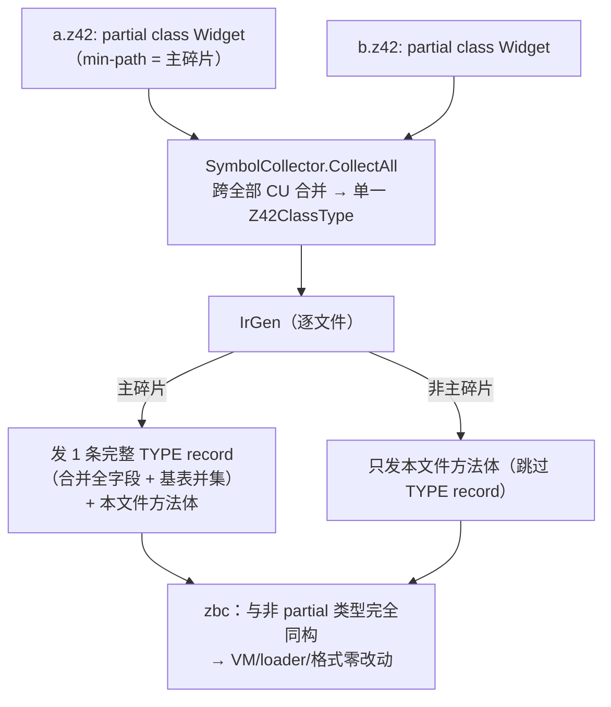

# partial 类型

> 对齐：2026-07-22（add-partial-types 落地）。代码路径：`src/libraries/z42c.syntax`（词法/语法）、
> `src/compiler/z42c.semantics/{SymbolCollector,IrGen,IrDump}.z42`（合并/codegen）、
> `src/compiler/z42c.pipeline/IncrementalBuild.z42`（增量联动）。

一个类型（`class` / `struct` / `record` / `interface`）可由多个 `partial` 声明碎片拼成，
碎片可分处不同源文件。**合并完全在编译期完成**——zbc/zpkg 格式、Rust VM、加载器全部零改动，
运行期与普通类型无异。

主用例：多平台抽象拆分（如 `Interop.Unix.z42` / `Interop.Windows.z42` 各声明一个碎片，
按平台条件编译组合）。

## 语法

```z42
// a.z42
partial class Widget {
    public int width;
    public int Area() { return this.width * this.height; }   // 可引用碎片 b 的成员
}

// b.z42（同包、同 namespace）
partial class Widget {
    public int height;
    public string Describe() { return $"{this.width}x{this.height}"; }
}
```

- `partial` 是**类型修饰符**（class/struct/record/interface）与**方法修饰符**（见 [partial method](#partial-method)）。
- **每个同名声明都必须写 `partial`**——缺一即编译错误（`E0430`）。防止误拆。
- 所有碎片必须**同包 + 同 namespace + 同 Kind**。Kind 不一致报 `E0431`。
- 跨包 / 跨 namespace 同名类型**不合并**（维持既有 local-wins 语义）；跨包给类型加成员用
  `impl Trait for Type`。

## 合并语义（编译期）

| 维度 | 规则 |
|------|------|
| 字段 / 方法 | 各碎片成员并入同一类型（按**碎片文件的项目相对路径 Ordinal 序** + 文件内声明序）|
| 基类 / 主构造器 | 至多一个碎片声明；多碎片声明不同基类 → `E0432` |
| 接口列表 | 各碎片并集（按名 dedup）|
| 重复成员 | 同名字段 / **同名且同完整签名**方法在多碎片（或同碎片）重复声明 → `E0433` |

**E0433 按完整签名判重，不是按注册键（`fix-partial-protocol-overload-e0433`）**：合法的**方法重载**
——同名、签名不同——即便共享同一注册键也可共存。典型是**协议豁免方法**（`ToString` / `Equals` /
`GetHashCode` / `GetType` / `get_Item` / `set_Item`，恒以裸名注册）：`Equals(object?)` 与
`Equals(string)` 都注册为键 `"Equals"`，但签名不同，可分处不同碎片而不报 E0433（这正是 prelude
`Std.String` 得以 partial 拆分的前提）。只有**同名 + 同完整签名**的真重复才报 E0433。
（此前 MemberCollector 误按注册键判重，把协议豁免重载错报为重复 —— 已修。）

**顺序确定性**：合并后的字段布局顺序 = 对象内存偏移 = zbc 字节，必须确定。碎片按**项目相对
路径 Ordinal 序**拼接——`SourceDiscovery` 本就对源文件做 Ordinal 排序（见
[common-pitfalls 规则 1](../../../../.claude/rules/common-pitfalls.md)），故合并序天然确定，逐字节稳定。

### 主碎片：单条完整 TYPE record

zbc 的 `TYPE` record 是**单条、内联全字段、有序**的结构（VM 只认完整类型）。合并的关键：
**只有一个「主碎片」发出这条完整 record**，其余碎片只发自己的方法体。

- **主碎片 = 项目相对路径 Ordinal 最小的碎片**（单一规则，无例外）。
- 主碎片的 TYPE record 成员取自**全碎片合并**后的视图（编译期 `IrDump._buildMergedPartial`
  拼接全碎片成员 + 基表并集）。
- 非主碎片：跳过 TYPE record，只发本文件的方法体（各方法是独立全局函数 `Widget.Area` /
  `Widget.Describe`，VM `merge_modules` 按 FQ 名扁平化，既不冲突也不丢）。



## partial method

声明与实现可分处两碎片，采 C# 9+ 干净形态：

```z42
partial class Calc {
    partial int Double(int n);              // 声明侧（无 body）
    public int Quad(int n) { return this.Double(this.Double(n)); }
}
partial class Calc {
    partial int Double(int n) { return n * 2; }   // 实现侧（有 body）
}
```

- **允许任意返回类型、访问修饰符、`out`/`ref` 参数**（不采旧版 void-only 规则）。
- 声明与实现的签名必须完全一致，否则 `E0434`；至多一个实现。
- **无实现时整体擦除**：只有声明、无任何碎片提供实现 → 不发方法桩、不占签名；对它的调用视同
  「方法不存在」（无返回值 / 无 out 的调用被静默消解）。

## 与增量编译共存

z42c 是文件级增量（1 源文件 ↔ 1 cache 条目）。partial 让类型跨文件，直接顶在
「一文件一编译单元」假设上。解法：**partial 碎片组在失效闭包里显式互连成团（clique）**——
改任一碎片 → 整组碎片一起重编、一起重发合并 record（`IncrementalBuild.Close` 对同名 partial
类型的全部属主文件连双向边）。**非 partial 文件完全不受影响**，「源没变即跳过」保持不变。

对账：touch 任一碎片，增量 dist 与全量 dist 逐字节相同。

## 边界与限制（v1）

- **只做顶层类型 partial**：partial 外层**含**嵌套类允许（嵌套按声明碎片落位）；但**嵌套类
  自身 partial**（`Outer.Inner` 跨碎片拆）v1 报错（`E0435`）——嵌套发射链路本身未接通，非机制受限。
- **partial 与泛型交互**：沿用现有泛型处理，不额外扩展。
- **跨碎片重载 → 静默覆盖（同名方法组必须整组同碎片）**：同名方法的多个重载**分处不同碎片**时，
  后合并的那个会在类型的方法表里**静默覆盖**前一个——不报错，调用方随之派发到错误的重载。
  常见用法（碎片间不共享方法名）完全正确；完整支持见下方 Deferred。

  **机制**（`stabilize-instance-dispatch-keys` 后）：实例方法的注册键规则是「**声明序首个**同名 →
  裸名（primary，多态规范槽 + seed 锚点）／其余同名 → 全签名 `MangleKey`」。做这个判定的
  `emittedInst` tracker 是 `MemberCollector._fillClass` 的**局部变量**，而 `_fillClass` 是
  **按 `ClassDecl`（即按碎片）逐个调用**的 —— 所以「首个」只在本碎片内计数。两个碎片各有一个
  `Foo` 时，双方都认为自己是首个、都取裸键 `Foo`，`ct.Methods.Put("Foo", …)` 后写覆盖先写。
  E0433 只在**完整签名相同**时才报（见上「重复成员」），而重载签名恰恰不同 → 不报错、静默丢失。

  > 注意这与 arity 无关：`Trim()` 与 `Trim(char[])` 参数个数不同，但键决策**不看 arity**，
  > 分处两碎片同样互相覆盖。判据只有一条 —— **方法名相同即必须同碎片**。

  现场用例见 prelude `Std.String`（`String.z42` / `String.Split.z42` / `String.Edit.z42`）：
  `Split`×3、`Remove`×2、`PadLeft`×2 等各自整组落在同一碎片，文件头注明了归属理由。

  **Deferred（正解）**：把 `emittedInst` 从碎片局部提升为**按类型**的 tracker（碎片已有确定序 ——
  项目相对路径 Ordinal 序，见上「顺序确定性」，故 primary 选择仍是确定的）。属编译器改动，
  受 support-先行纪律约束（见 `.claude/rules/bootstrap-seed.md`），未随本次 stdlib 变更落地。

## 关联

- 引入：change `add-partial-types`（2026-07-22）。
- 诊断码：`E0430`–`E0435`（见 [错误码体系](../compiler/error-codes.md)）。
