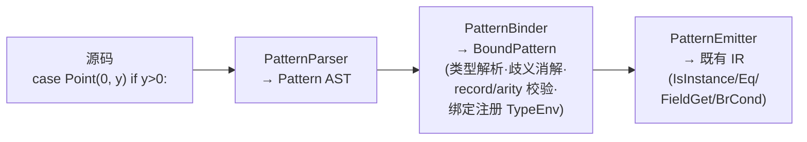

# 模式匹配（Rust 风格结构化模式）

z42 的 `switch`（语句 + 表达式）与 `is` 支持一套统一的**结构化模式**：通配、常量、类型、
**record 位置解构**、属性、嵌套、裸绑定，配 `if` 守卫。record 是积类型数据载体，模式匹配是消费它的
天然方式——`Point(x, y)` 直接按主构造器声明序绑定字段，**无需 `Deconstruct` 方法、无需 `out` 参数**。

> 本页对应 A1（结构化核心）+ A2（组合子：or-模式 `|` / `@` 绑定 / `..=` 闭区间 / 关系模式 `> 0`）
> + A3（or-模式**带绑定**：`Circle(r) | Square(r)` 各 alt 绑同一变量）。
> 解构声明 `Point(x,y) = p`（B）、穷尽性诊断（C）、`with`/`init`（D/E）为后续独立特性。

## 模式文法

```
Pattern :=
    _                              // 通配：匹配任意、不绑定
  | <literal>                      // 常量：1 / "s" / 'c' / true / null
  | <Qualified.Name>               // 常量：枚举/限定常量（Color.Red）
  | <ident>                        // 裸绑定（命中类型名则=类型模式，见「裸名歧义」）
  | <Type> <ident>                 // 类型测试 + 绑定：Point p
  | <Type> ( <Pattern>, ... )      // 位置模式（record 解构）：Point(x, y) / Point(0, y)
  | <Type>? { <field>: <Pat>, ...} // 属性模式：Point { X: 0, Y: y } / { X: 0 }
                                   // 嵌套：Line(Point(x, _), _)
  // ── A2 组合子 ──
  | <Pat> | <Pat> | ...            // or-模式（仅 switch 臂）：1 | 2 | 3 / Circle | Square
  | <ident> @ <Pat>                // @ 绑定：p @ Point(0, y)（绑整体 + 解构）
  | <const> ..= <const>            // 闭区间范围：1 ..= 5 / 'a' ..= 'z'（含端点）
  | > <const> | >= <const>         // 关系模式：> 0 / <= 100
  | < <const> | <= <const>
```

三个应用位点共用同一套文法：

```z42
// ① switch 语句
switch (shape) {
    case Circle(r) if r > 0:  area = 3.14 * r * r;  break;
    case Rect(w, h):          area = w * h;          break;
    default:                  area = 0;              break;
}

// ② switch 表达式
string s = p switch {
    Point(0, 0)          => "origin",
    Point(x, y) if x > 0 => "right",
    Point(x, y)          => "left"
};

// ③ is 表达式（绑定在 true 分支可见）
if (obj is Point(a, b)) { use(a, b); }
```

绑定用 **Rust 裸标识符**（z42 无 `var`）；守卫用 **`if`**（`pattern if guard`）。

## 裸名歧义：解析期形状 + 绑定期类型表

模式位置的一个裸标识符可能是「类型测试」「新绑定」或「常量」。z42 分两级唯一消解（同 Rust / C#）：

1. **解析期**按名字形状分流（不查符号表）：字面量→常量；`_`→通配；**点分名**（`A.B`）→常量；
   名字后跟 `(`→位置、`{`→属性、后跟另一 ident→类型+绑定；**单个裸名**→留待绑定期。
2. **绑定期**对单裸名查类型表：**命中类型名 → 类型模式**（`IsInstance`，不绑定）；**否则 → 新绑定**。

**关键**：常量这条路只留给字面量 / 点分名——裸单名**永不作常量**，歧义收窄成「类型 vs 绑定」二选一。
所以常量匹配必须写限定名（`Color.Red`）或字面量。

## record 位置解构

`Point(a, b)` 中位置 ↔ 字段的映射由 **record 主构造器声明序内建提供**（`Z42ClassType.OwnFieldNames`）：
第 i 个子模式匹配第 i 个声明字段。约束：类型必须是 **record**；子模式数必须等于字段数。用户不写任何
解构方法。

```z42
[Record] class Point(int X, int Y);
// Point(a, b) → a ← X, b ← Y（声明序）
// Point(0, y) → 先测 X==0，再绑 y ← Y
```

> A1 位置解构限 **record class**（引用类型）；struct record 的位置解构（字节偏移读取）为后续特性。

## A2 组合子：or / `@` / `..=` / 关系

A2 在 A1 引擎上加四个 Rust 组合子，全部**纯编译期 lowering 到既有 IR**（新增 `Ge`/`Le`/`Gt`/`Lt` 比较），
无格式 bump、无新关键字（只加 `@` / `..=` 两个词法记号）。

```z42
// or-模式：任一 alt 匹配即匹配（仅 switch 臂；is 内 `|` 仍是位或）
switch (n) {
    case 1 | 2 | 3:        r = "low";  break;
    case >= 90:            r = "A";    break;   // 关系模式
    case 10 ..= 20:        r = "teen"; break;   // 闭区间（含端点）
}
string s = shape switch {
    Circle | Square => "closed",                // 多类型 or（无绑定）
    _               => "open"
};

// @ 绑定：绑整体 + 解构
switch (pt) {
    case whole @ Point(0, y):  use(whole, y);  break;   // whole=整点, y=Y
}

// is 支持关系 / 范围（不支持 or / @）
if (v is > 0) { ... }
if (v is 1 ..= 100) { ... }
```

| 组合子 | 语法 | 语义 | 位点 |
|--------|------|------|------|
| or | `P1 \| P2 \| ...` | 任一子模式匹配即匹配 | 仅 switch 臂 |
| `@` 绑定 | `name @ P` | 绑 `name` 到整个 subject **且** 匹配子模式 `P` | 仅 switch 臂 |
| `..=` 范围 | `lo ..= hi` | `subj >= lo && subj <= hi`（含端点）；仅可全序基元 | switch 臂 + `is` |
| 关系 | `> v` / `>= v` / `< v` / `<= v` | `subj <op> v`；仅可全序基元 | switch 臂 + `is` |

### A2 的两条边界（设计取舍）

- **or / `@` 不入 `is`**：`is` 表达式里 `x is Circle | flags` 的 `|` 恒解析为**位或**（`(x is Circle) | flags`，
  与 C# 一致——C# 用 `or` 关键字而非 `|`）；`@` 与 `is` 的类型引导冲突。故 or / `@` 只在 `:` / `=>` 定界的
  switch 臂内。`..=` / 关系起始无歧义，`is` 收之。
- **`..=` / 关系仅可全序基元**（numeric | char）：subject 静态类型非可比较基元 → 诊断。

## A3：or-模式带绑定

A2 曾禁止 or 各 alt 引入绑定（`case Circle(r) | Square(r):` 报错）——因不同 alt 把同名变量绑到**不同寄存器**，
到 arm body 需合流。A3 补齐这块，让 Rust 最自然的**「多变体、同处理」**成立：

```z42
int sizeOf(Shape s) {
    return s switch {
        Circle(r) | Square(r) => r,           // r 来自任一变体（同名同类型）
        Pair(a, b) | Duo(a, b) => a + b,      // 多绑定
        Circle(r) | Square(r) if r > 10 => 99,// 带守卫
        Box(Circle(r) | Square(r)) => r,      // 嵌套 or（or 作子模式）
        _ => -1
    };
}
```

**一致性约束**：各 alt 必须绑定**完全相同的变量集**（同名），且同名变量**类型完全相同**（不做 LUB / 公共
基类推断）。不一致 → 诊断：

| 情形 | 诊断 |
|------|------|
| `Circle(r) \| Square(x)` | 名字集不同 → `must bind the same set of variables` |
| `Circle(r) \| Triangle`  | `Triangle` 无绑定 → `'r' is not bound by every alternative` |
| `Circle(r) \| Wide(r)`（int vs double） | 同名不同类型 → `inconsistent type across alternatives` |

**合流机制（phi-free）**：z42 IR 无 phi 节点，绑定在 A1/A2 是零成本别名（指向既有寄存器）。or 各 alt 产出
不同寄存器 → 别名失效。A3 用**稳定寄存器 + `Copy`**：为每个统一绑定预分配一个稳定寄存器，各 alt 匹配成功后把
该 alt 绑的变量 `Copy` 进稳定寄存器再跳 matchL；matchL 处所有绑定 = 稳定寄存器（单一一致）。**递归可组合**：
嵌套 or 先合流成自己的稳定寄存器，外层读到单一寄存器再 Copy——无需特判嵌套深度。**无绑定 or**（A2 全部用法）
走逐字未改的旧 lowering（byte-identical）。

### or 与常量吞 `|` 的解析处理

模式内常量子表达式在**绑定力 45（> 位或 `|` 的 44）**解析，使 `case 1 | 2` 的 `_parseExpr` 停在 `|` 处、
把 `|` 交回模式层作 or-链——否则常量解析会把 `1 | 2` 贪吃成位或表达式 `1|2`。字面量 / 一元负号 / 点分名
（`.` 为 postfix 不受绑定力限）仍完整解析。

## 实现原理

模式横跨编译器三层，每层一族模式节点，用一条递归下降 lowering 收口到既有 IR。



| 层 | 文件（NEW） | 职责 |
|----|------------|------|
| AST | `z42c.syntax/Pattern.z42` + `PatternParser.z42` | 模式节点族 + 名字形状分流解析 |
| Bound | `z42c.semantics/BoundPattern.z42` + `PatternBinder.z42` | 绑定后模式树（携 resolved 类型/字段索引/绑定名）+ 类型解析·歧义消解·校验·绑定注册 |
| Emit | `z42c.semantics/PatternEmitter.z42` | 递归 test+bind lowering，短路 `BrCond` |

**lowering（`PatternEmitter.EmitMatch(subj, pat, matchL, failL)`）** 递归下降，匹配成功（绑定完成）跳
`matchL`、失败跳 `failL`：

| 模式 | test | bind |
|------|------|------|
| 通配 / 裸绑定 | 恒真 | 裸绑定：`name ← subj` |
| 常量 | `Eq(subj, value)` | — |
| 类型 `T` / `T x` | `IsInstance(subj, T)` | `T x`：命中后 `x ← as_cast(subj, T)` |
| 位置 `T(p_i)` | `IsInstance(subj, T)` ∧ 逐字段 | `field_get subj.f_i` → 递归子模式 |
| 属性 `T{F:p}` | `IsInstance(subj, T)`（T 可省）∧ 按名 | `field_get subj.F` → 递归子模式 |
| or `P1\|P2`（A2/A3） | 依次试 alt：前 n-1 失败落下一 alt，末 alt 失败落 `failL` | A2 无绑定：子模式无绑定；**A3 带绑定**：预分配稳定寄存器，各 alt 成功后 `Copy` 进稳定寄存器再跳 `matchL`（phi-free 合流，递归可组合） |
| `@`（A2） | 恒真 + 匹配子模式 | `name ← subj`（别名，同裸绑定） |
| `..=`（A2） | `Ge(subj, lo)` 短路 → `Le(subj, hi)` | — |
| 关系（A2） | `Gt/Ge/Lt/Le(subj, v)` | — |

三位点的**外壳**编排 match→guard→body/result：`switch` 是 case 链（失败落下一 case），`is` 收口成
布尔结果寄存器（绑定在 match 路径写入，true 分支支配其使用）。

### 两条实现铁律

- **常量模式 byte-identical**：常量模式 lowering 严格复刻旧 `switch` 的 `Eq(subj, value)` + `BrCond` 链
  （指令序 + 寄存器分配顺序一字不差）。z42c 自身源码在自举**不动点**（gen1 == gen2）中，其常量比较
  发码必须与旧编译器逐字节相同——否则自举断链。老 `x is T` / `x is T v` 同理走完全未改动的 `IsExpr`
  路径。
- **位置/属性字段直读**：字段读用 **`field_get subj.<name>` 直接从 subject 寄存器读**，**绝不**
  `as_cast(subj)→field_get`——后者被 JIT 误编（record 值语义合成曾踩此坑）。类型模式的绑定 `as_cast`
  仅存入局部、不接 `field_get`，安全。

### 无格式变更

纯编译期 lowering 到既有 IR（`IsInstance` / `Eq` / `FieldGet` / `BrCond` / `ConstBool`），**无 zbc/zpkg
格式 bump、无新 runtime、无新关键字**（扩 `switch`；`is` 已有；守卫复用 `if`）。新语法只在测试文件出现，
上一 nightly 的 z42c 仍能编当前源（满足两-nightly 纪律）。

## Deferred（后续独立特性）

- or-模式**带绑定**（各 alt 绑定集一致性 + 合流寄存器 phi）；`is` 中的 or / `@`
- 解构声明 `Point(x, y) = p`（B，需元组式）
- 穷尽性诊断（C，封闭域 warning，复用 analyzer 框架）
- `with` 表达式 / `init`-only 访问器（D/E）
- struct record 位置解构、泛型 record 位置解构、元组模式
