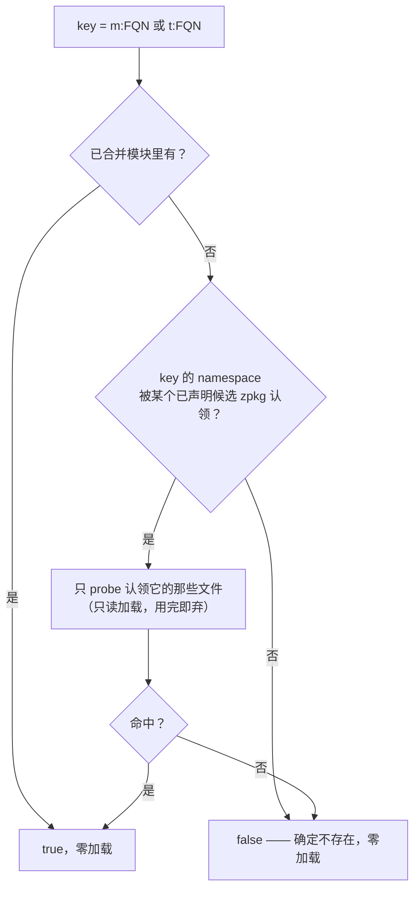

# 加载期可用性折叠与死分支剪枝

> `available!(X)`（[语言页](../language/available-macro.md)）在 VM 侧的实现机制。
> 实现：`src/runtime/src/metadata/loader/availability.rs`。

## 为什么在加载期

`available!(X)` 的值**只依赖符号表**——不执行任何用户代码、不依赖 `__static_init__`。
它因此是全流程里**唯一**能在「模块已合并、但还没有任何东西执行过」这个窗口求值的常量。

这个窗口的独占所有权（`&mut Module`，尚未进 `Arc`）让我们能做**真正的原地 CFG 剪枝**：
死分支的指令物理消失，两个后端都再也看不到它。

对比：`[Invariant]` native 折叠必须真的 call 进 dlopen 的代码，只能首次调用时惰性求值，
届时 `Function` 已在 `Arc` 后不可变 → 只能常量化条件，不能剪 CFG。

## 顺序约束（硬）

三条都不能违反：

1. **在 `build_type_registry` 之后**——判定要查它。
2. **在 `VmContext::with_module` 之前**——之后 `Module` 进 `Arc` 就不可变了，原地剪枝的
   窗口只有这里。
3. **在任何 token 解析 / 执行之前**——被剪掉分支里的调用点因此永不进入
   `resolve_function_tokens`。这是 `available!` 作为「缺符号即报错」豁免通道的机制基础。

剪枝改变了块集合，故派生侧表（`block_index` / `branch_targets`）必须在其后重建。

## 判定策略

加载放大**有界**（≤ `available!` 触及的不同 dep 文件数），不会退化成「加载全世界」。
probe 是只读的：加载出来的 artifact 只用来回答存在性，不并入运行模块。

## 折叠与剪枝

1. **折叠**：`Builtin("__sym_available", ConstStr(key))` → `ConstBool`。key 来自**同块内**
   的 `ConstStr` 定义（编译器发射时紧邻产出），用块内单赋值扫描取得。
2. **折分支**：`BrCond`(单赋值常量 cond) → `Br`。
3. **剪块**：从 entry 沿终结子做可达性 BFS，移除不可达块。

### 铁律：带异常表的函数只折不剪

z42 IR 的 CFG **只从终结子构建、不含异常隐式边**（try→catch/finally）。对这类函数移除
「按 CFG 不可达」的块，会删掉 handler 实际可达的块 → miscompile。

故 `exception_table` 非空的函数**只做第 1、2 步，不做第 3 步**。这与编译器侧
`IrDeadBranch`（`ExcCount > 0` 时只折不移）是同一条铁律。

统计量 `funcs_kept_for_exceptions` 记录这类函数数；e2e 用例
`src/tests/optimization/available_exception_table/` 覆盖此路径。

## 可观测性：为什么有统计量

剪枝发生在**内存里**，zbc 字节不变——没有任何外部可观测面。不暴露计数的话，
「pass 根本没跑」和「跑了但没什么可折」在测试里长得一模一样，就是个从不打印、
从不失败的门。

`AvailabilityStats` 因此是设计的一部分，不是调试残留：

| 字段 | 含义 |
|---|---|
| `folded` | 折成常量的探测站点数 |
| `resolved_true` / `resolved_false` | 判定可用 / 不可用的站点数 |
| `blocks_removed` | 剪掉的不可达块数 |
| `funcs_kept_for_exceptions` | 因带异常表而只折不剪的函数数 |

`Z42_LOG=debug` 可见。**测试必须同时断言「行为正确」和「确实折了」**——只断言前者的话，
「没折但结果恰好一样」也会绿。

同理，`__sym_available` builtin 的运行期实现**正常路径永不执行**：走到那里说明折叠 pass
没跑，debug profile 下直接 `debug_assert!` 点名，release 下告警并保守答 `false`
（让代码走 fallback 分支，总比走进一条它以为存在的分支安全）。

## 零格式变更

复用 `Builtin` opcode + 常量字符串参数编码语义（`__box_prim` 是同款先例），
**不新增 IR opcode、不 bump zbc/zpkg 格式**。新增 builtin 只需在表尾追加——`BuiltinId`
是进程内下标，不进 wire。
