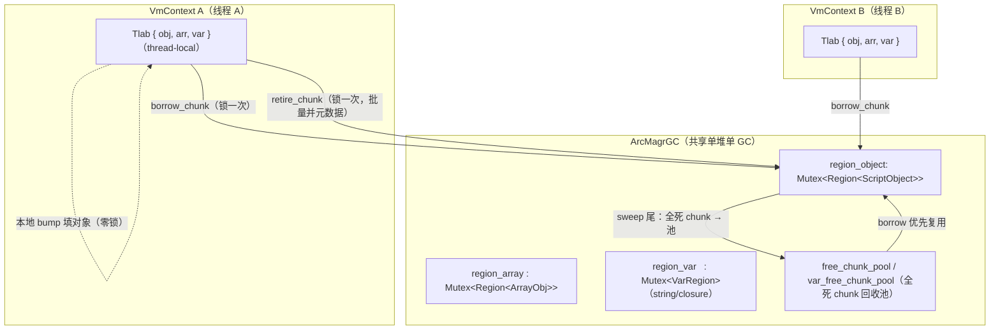
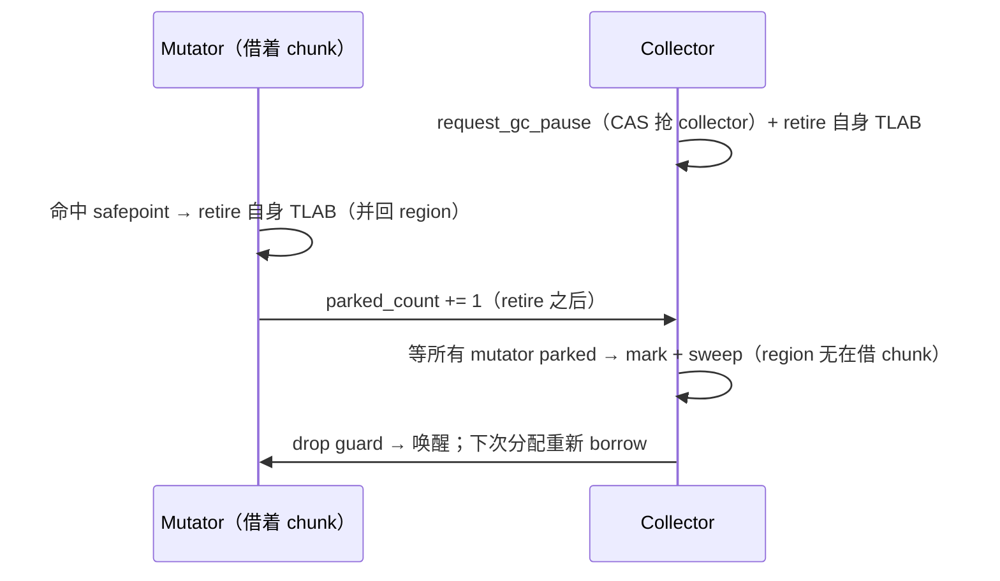

# GC TLAB：线程本地分配（chunk 独占）

> 对齐：2026-09-07（change `fix-gc-budget-not-enforced` 补 D7 的代价一节；
> 原 change `add-gc-tlab`，阶段 1–5）。
> 代码：`gc/tlab.rs`（Tlab + thread-local + arm 门）、`gc/region.rs`（`ChunkClaim` + borrow/retire/reclaim，定长对象/数组）、
> `gc/var_region.rs`（`VarChunkClaim` + borrow/retire/reclaim，变长字符串/闭包）、
> `gc/arc_heap/alloc.rs`（fast path）、`gc/safepoint.rs`（retire-on-park）。

## 为什么

`ArcMagrGC` 是**单一共享堆**，所有 mutator 线程共用一个 `Arc<VmCore>` → 一个堆。改造前分配热路径
（`new` / `Str::new` / …）每个对象都要抢**进程级 region 锁**（`region_object`/`region_array`/`region_var`
各一把 `Mutex`）。N 个线程并行分配 → 全在这几把锁上排队，并行编译**越多线程越慢**。

**TLAB（Thread-Local Allocation Buffer）= chunk 独占**：每个 mutator 线程从共享 region **借用一整块
chunk 的写权**，在里面本地 bump 填对象（**零锁**）；chunk 填满就 retire（把已填部分的元数据批量并回
共享 region）+ 再借一块。

**关键不变式：仍是同一个共享堆、同一套 region。** GC 遍历 / 分代 / card table / sweep **全部零改动**——
borrow 来的 chunk 内存和元数据始终归属共享 region，retire 后就是普通已分配槽。

## 架构



- **TLAB** = per-`VmContext` 持有（挂 thread-local，见「arm 门」）的三个「借来的活跃 chunk 句柄」
  （obj/arr/var 各一）。
- **分配**（零锁）：在活跃 chunk 的下一个槽 / bump 偏移写对象，`GcRef`/`VarGcRef` 从槽指针直接建。
- **retire**（借新 / safepoint 时，锁一次）：把 chunk 已填部分一次性并回共享 region（定长：批量
  `initialized`+push `young_list`；变长：批量 append `all_blocks`+`live_count`）。
- **GC 侧**：`iterate_alive`/`iterate_young`/sweep 全不变——定长靠 `borrowed[ci]` 标志跳过在借 chunk，
  变长靠「未 retire 的块不在 `all_blocks`」天然不可见。

## borrow / retire / reclaim 契约

### 定长 `Region<T>`（对象 / 数组）

- **`borrow_chunk() -> ChunkClaim<T>`**（锁下）：从 `free_chunk_pool` 取一块全死 chunk 或 grow 新块，
  标 `borrowed[ci]=true`，返回 `{chunk_idx, slots 裸指针, init_ptr, next, cap}`。
- **`ChunkClaim::fill(value)`**（**零锁**）：`slots[next]` 写 `RegionEntry`；`next += 1`；返回
  `(entry_ptr, generation)`。**按 `init_ptr[next]` 逐槽选写模式**：未初始化槽 → fresh 写（gen 0）；
  已初始化槽（池化 chunk 的死条目）→ **读旧 generation、drop 旧条目、保留 generation 写新条目**
  （ABA 守卫，同 free_list 复用纪律）。
- **`retire_chunk(claim)`**（锁下）：`initialized[0..next]=true`；`young_list` 批量 push；
  清 `borrowed`。局部未填的尾部槽被放弃（每 safepoint retire ≤ CHUNK_SIZE-1，chunk 全死后整体回收）。
- **ambient 路径**：strict-OOM / 无 VmContext 线程走旧的**锁下** `Region::alloc`（`ambient_cur` 独立
  游标，只 grow 全新 chunk，永不碰在借 chunk 的索引——修复了 `next_bump` 的 `ci >= chunks.len()`
  grow 与 borrow 追加同一 `chunks` Vec 的**索引撞车**）。

### 变长 `VarRegion`（字符串 / 闭包）

- 结构类似，但块是**变长** bump（64KB chunk 内按 footprint 前移 `off`），claim 记
  `{base 裸指针, off, local_blocks}`；retire 把 `local_blocks` append 进 `all_blocks`。
- **oversized 块**（> chunk）/ **free-list 复用**走旧锁路径（低频，不进 TLAB）。

### ⚠️ size class：四分之一八度，不是 2 的幂

`class_for(payload)` 把「头 16B + payload」向上取整到一个 **size class 的 footprint**，
块实际占的就是这个 footprint。free-list 按 class 分桶，`alloc` 弹槽时**不复查容量** ——
这条捷径成立的前提是**一个 class 索引只对应唯一一个 footprint**。改分档规则时这是首要不变量。

分档规则是**每八度 4 档**（32/40/48/56、64/80/96/112、128/160/192/224 …），
索引编码 `octave << 2 | sub`。原实现是**纯 2 的幂**（索引直接是 `log2(footprint)`），
2026-09-07 换掉，原因是实测浪费大得离谱：

`z42c.semantics --release --no-incremental` 一次构建里 274 万个活块，逻辑字节
（头+payload）共 **323.4 MB**，2 的幂分档后实占 **516.4 MB** —— **193.0 MB 是纯取整浪费，
占进程 RSS 的 17%**。浪费不是均匀摊开的，而是撞在几个恰好越过八度边界的形状上：
仅 total 落在 257..320 字节的 **293,849** 个块（各占一个 512 字节槽）就吃掉约 59 MB。
换成四分之一八度后浪费降到 57.9 MB，实测 RSS 未武装 1026.7 → 884.8 MB（**−13.8%**）、
武装 256M 预算 818.7 → 736.8 MB（**−10.0%**），指令数与墙钟均持平。

⚠️ **每八度不能超过 4 档**。bump 与 TLAB 的偏移只按 footprint 前移，其 8 对齐完全依赖
「每个 footprint 都是 8 的倍数」。最小八度是 `MIN_BLOCK = 32`（`oct == 5`），4 档时步长
`32 >> 2 = 8` 刚好卡在下限；再细成 8 档步长就变成 4 字节，直接破坏对齐。
所以理论上更省的 8 档（浪费可降到 34.5 MB）**在当前 16 字节块头下不可取**。

### 变长区的分代（2026-09-08 fix-minor-gc-skips-var-region）

在此之前，minor GC 只扫两个定长区，`region_var` 完全不参与——而它占 RSS 约 45%，
只能等 major。同时数组头 tombstone 时把 `array_size_estimate`（含 `elem_storage_bytes()`）
计进 `freed_bytes`，那些字节却住在变长块里、这一轮并没被回收：**账退了、内存没退**。

**年龄塞在哪。** `GcBlockHeader` 被 `assert!(size_of == 16)` 钉死，头涨到 24 会把
180 万个 total 恰好 32 字节的块推进下一个 size class，吐回 15 MB+（见 `class_for` 的实测）。
所以年龄挤进 `type_tag` 的空闲位：

```
type_tag: AtomicU8
  bit 0..2  BlockType（5 个变体，3 位）
  bit 3..4  gen_age（2 位 → 上限 3；PROMOTION_THRESHOLD = 2 卡在下面）
  bit 5     IN_YOUNG_BIT（是否在 young_list 里）
  bit 6..7  未用，恒 0
```

换 `AtomicU8` 是因为写屏障要在 mutator 线程无锁读 `gen_age`，而晋升写在 STW——
`u8` 上的并发读写是数据竞争。`AtomicU8` 与 `u8` 同 size/align，布局不变。

**young 表是「重建」而不是「增量维护」。** 定长区靠每个 entry 上的 `young_idx` 做 O(1)
`swap_remove`；变长块没地方放这个下标（头已填满）。改成：`alloc` 只 push，
`sweep_young` 反正要走完整张表，顺路把「仍然存活且仍然年轻」的写回一张新表。
tombstone 故意留下陈旧条目，代价是下次 sweep 一次 `is_alive()` 检查。

⚠️ **懒删除会产生重复条目**：major sweep 会 tombstone 年轻块，它们留在表里；
该槽若在下次 minor 之前被 free-list 复用，`alloc` 会再 push 一次，同一地址出现两次
——每次 minor 连升两级、表还会无界增长。`IN_YOUNG_BIT` 就是为此存在：已在表里就不重复 push。

⚠️ **`reclaim_dead_var_chunks` 必须连 `young_list` 一起 purge**（和 `all_blocks` /
`free_lists` 同一个 `retain`）。回收的 chunk 会从 offset 0 重新 bump，漏掉的条目会悬垂
到下一个占用者身上，被 minor 拿去老化或 tombstone。

⚠️ **young 表只在分代模式下维护**（`set_generational`，与 `Region<T>` 的 #524 同款）。
这个区有 270 万个块，非分代模式下一张没人消费的表实测多吃 **20 MB** RSS。

**不需要卡表。** 变长块不产生跨代写：`Str` / `ArrayPrim` 是叶子；
`ArrayValue` / `ArrayStruct` 只经 `Value::Array` owner 写入，已被 `region_array` 的卡覆盖；
`ClosureData` **创建后不可变**。老数组头经脏卡重新入根后，`trace_children` 里的
`arr.mark_backing()` 会标记它的元素块——标记覆盖早就完整。

### ⚠️ 陈旧 mark 位曾导致 use-after-free

同一次改动查出的真缺陷，比上面两条都严重。minor 从不清变长块的 mark 位，
而 `gen_age_of` 对变长块是瞎的（`Value::Str` 落到 `_ => 0` 恒为「年轻」，
`Value::Closure` 读的是 **env 的**年龄而非闭包块自己的）：

```
minor #1: 标记闭包块 → mark 位留着没人清
minor #2: c.mark() CAS 失败 → just_marked = false → children 不再被追
        → 仅经它可达的年轻 env 数组没被标记 → 当场被 sweep 掉
        → 闭包还引用着的数组被提前释放
```

`Str` / `ArrayPrim` 是叶子，陈旧 mark 只造成一轮浮动垃圾；`Value::Array` 走头节点、
mark 位被正常清理。**这条只打在 `Closure` 上**——唯一「自身是变长块又有出边」的类型。
两处同修：`sweep_young` 清 survivor 的 mark 位，`gen_age_of` 读真实年龄（老块不再被推入）。
回归测试 `closure_env_survives_repeated_minors` 锁住它：不修则第 2 轮必红。

**残留（已知、有界）**：从脏卡以老数组头入根时 `mark_backing()` 仍会标记一个**老**元素块，
minor 不清老块的 mark，该块若随后成为垃圾会多活一个 major 周期。是浮动垃圾，不是正确性问题。

**minor 不做 chunk 级回收**——`reclaim_dead_chunks` / `reclaim_dead_var_chunks` 只在
`run_cycle_collection_stw`（major）里调。所以 minor 释放的槽只进 free-list 供复用，
压不下 chunk 高水位。实测 `z42c.semantics` 配 256MB 预算跑分代模式：0 次 major，
RSS 966 MB，比纯 STW 的 743 MB 还高——老垃圾一次都没被收。这是升级启发式
（存活率 ≥ `gc-minor-threshold`）从未触发的后果，待 `add-bounded-nursery` 处理。

### chunk 级回收（D7）

sweep 尾（STW）扫全死 chunk（所有已初始化槽 dead）→ 移入 `free_chunk_pool` 供 borrow 复用。
短命对象密集 workload（编译器正是）的大头内存靠此回收；**slot 级复用留 Deferred**（见下）。

⚠️ **变长 region 的这一步曾是整个 GC 停顿本身**。`VarRegion` 的块变长，没有「地址 → 槽下标」
的算术，判某块属于哪个 chunk 只能查地址区间。原实现对 `all_blocks` 里**每个块**线性扫一遍
`chunks`，收尾清理 `all_blocks` / `free_lists` 时又对每块线性扫一遍被回收的区间——两个
`O(块数 × chunk 数)` 项，且 chunk 数只增不减。实测 `z42c.semantics` 配 128MB 预算，
`reclaim_dead_var_chunks` 一处占每次停顿的 **92–98%**，并逐周期翻倍（494ms → 975ms →
1490ms → 3072ms），同期 mark 加两个定长 region 的 sweep 合计只有 15–45ms。

改法是每次回收先按 base 地址排一份 chunk 区间表，之后按块二分（`partition_point`）；
「是否属于被回收的 chunk」也改成查下标位表而非扫区间。同一形状的平方项 #519 在定长 region
的 `young_list` 上刚修过一次——**「按块线性扫另一个只增不减的表」是这套 region 代码的惯犯，
新增每块一次的查找时先问它是不是 O(1)/O(log n)**。

定长 `Region<T>` 的 `reclaim_dead_chunks` 没有这个问题：槽定长，chunk 归属是下标除法。

### chunk 的三种归宿（2026-09-08 fix-loh-never-freed）

sweep 尾的 `reclaim_dead_var_chunks` 现在按 chunk 的**种类**分流，不再只有「入池 / 不动」两种：

| 条件 | 归宿 | 内存 |
|---|---|---|
| 还有活块 | 原样留着，下一轮再看 | 保留 |
| 整块死 & `cap == CHUNK_BYTES`（bump chunk） | `var_free_chunk_pool` | **保留**，抬高 `reuse_gen` 后重新 bump |
| 整块死 & `cap != CHUNK_BYTES`（dedicated chunk） | `dealloc` | **还给分配器** |

**dedicated chunk** 是超过 `CHUNK_BYTES`（64 KB）的块专用的、按 payload 精确定尺的独立
malloc。在这之前它死后无路可走：`tombstone` 不把 `OVERSIZED_CLASS` 放进任何 free list
（尺寸各异、没有可复用的 size class），`reclaim_dead_var_chunks` 用 `cap != CHUNK_BYTES`
把它排除在池子外，而全仓唯一的 `dealloc` 在 `VarRegion::drop` 里 ——
**一个死掉的大对象把内存攥到 VM 退出为止**。

不给它做池子是刻意的：实测这一路的块尺寸跨 80 KB–1.3 MB，离散得没有复用规律，
按 size 分桶的池子命中率极低，本身就会变成一笔不还的内存。件数少（一次
`z42c.semantics` 构建里百量级），交给 mimalloc 复用即可。

⚠️ **释放是原地的，槽位必须留下。** `chunks` 的**下标就是 chunk 的身份** ——
`bump_chunk` / `borrowed` / `reuse_gen` / `var_free_chunk_pool` 全按下标寻址，
`Vec::remove` 会把它后面每个 chunk 悄悄改号（`bump_chunk` 指向别人、池子里的下标错位）。
所以 `Chunk::free_in_place` 只是 `dealloc` + `base` 置 dangling + `cap = 0`，槽位留在原位当
**墓碑**（`is_freed()` 即 `cap == 0`）。三处必须认得墓碑：`VarRegion::drop` 跳过（否则
double free）、`ChunkIndex` 不给它建地址区间、`partition_dead_chunks` 不重复释放。
墓碑槽位进 `free_chunk_slots` 由 `push_chunk` 复用 —— 否则三张 per-chunk 表会按每个死大块
~29 B 只增不减，RSS 依然单调增、只是慢三千倍。

⚠️ **释放会让这一类块失去 generation 守卫**。入池的 chunk 内存还在，陈旧 `VarGcRef`
解引用读到的是有效块头、`reuse_gen` 对不上 → `resolve` 干净地返回 `None`（#533 那次
分代崩溃呈现成 `expected string, got Null` 就是这层网兜的）。释放掉的 chunk 没有这层网：
陈旧句柄就是 use-after-free。之所以可接受，是因为块走到这一步的前提是**刚刚那次 sweep
把它 tombstone 了**（从任何根都不可达），且三个 region 的 sweep 都在 mutator 停住时跑。
准确的代价表述：**一个标记 bug 在 oversized 块上的现场，从「一个 `Null`」变成「内存损坏」**。

bump chunk 的回收仍只**还给池子**，不 `dealloc` 还给 OS。所以对小块而言 GC 压低的是 RSS 的
**高水位**（靠复用少要新内存），不是「回收后把内存交回系统」；只有大对象堆这一路是真交回去。

## ⚠️ 变长块复用的 ABA：per-chunk `reuse_gen`

`GcRef`/`VarGcRef` 是**地址+16 位 generation 快照**的标记指针；身份靠地址，ABA 靠 generation 守。

- **定长 `Region<T>`**：槽定长、复用重对齐 → fill **逐槽保留** generation（读旧写新同 gen），
  stale 句柄 gen 不匹配 → 安全。
- **变长 `VarRegion`**：块变长、chunk 复用后新块**不重对齐**旧块边界 → 无法逐槽保留。改用
  **per-chunk `reuse_gen`**：回收时把 `reuse_gen[ci]` 跳到**超过该 chunk 所有块历史最大 generation**，
  fresh 再 bump 的块一律取此 gen → 绝不与指向同地址旧占用者的 stale 句柄撞 `(addr, gen)`。

## safepoint 集成：retire-on-park（D5）

STW 模型（`request_gc_pause`）停所有 mutator。**关键时序**：mutator park 前
（`park_until_idle` / `native_park_incr`，在 `parked_count += 1` **之前**）retire 自己的 3 块 TLAB
（合并元数据 + 清活跃句柄）；collector 成为 collector 后、mark 前也 retire 自己那份。collector 拿到
**完整一致**的共享 region 后 mark/sweep——与单 region 的 sweep **完全一样**。



其它 retire 点（都在 owner 线程）：`VmContext::drop`（线程退出）；`collect_cycles`/`force_collect`
（无 safepoint 的直接回收路径，mark 前 retire 自身）；`snapshot`/`retention`/`finalize_now`（观测/显式
终结前 retire，使视图一致）。

## arm 门：只有 VmContext 线程走 TLAB

thread-local `TlabCell { armed: u32, tlab }`（`UnsafeCell`，owner 独占 + alloc 非重入 → 无运行期借用
检查）。`VmContext::new*` `arm()`、`drop` `disarm()`（嵌套计数）。**无 VmContext 的线程**（cargo 直连
`ArcMagrGC` 的 GC 单测、任何 VM 起来前的 ambient `Str::new`）**不 arm** → 走旧锁路径 → region 内部
单测「alloc 后立即观测存活」行为零变化。

**heap epoch 绑定**：Tlab 记当前借用所属堆的 epoch；`0`=未绑。空 Tlab 首次分配绑定当前堆；若持有他堆
借用（仅多堆 cargo 测试、不 drop VmContext 就换堆）→ fast path 退回锁路径，不混 region。

## 性能门 / 阶段决策

- **正确性门**（每阶段）：`cargo test --lib gc::`（含 6 线程并发共享堆压力，debug build 每次 collect 跑
  `debug_validate_invariants`）+ 真机自举 byte-identical（TLAB 是纯运行期分配器内部改动，不改
  zbc/zpkg 产物）。
- **性能门（阶段 4 实测结论，两个层面必须分开看）**：

  **① 分配机制层（微基准 `tlab_alloc_scaling_probe`，本机 24 核，每线程恒定 200k 对象）——TLAB 大幅有效**：

  | 线程 | 1 | 2 | 4 | 8 | 16 | 24 |
  |------|---|---|---|---|----|----|
  | 锁路径（无 TLAB）| 0.062s | 0.112s | 0.225s | **1.193s** | **3.771s** | 3.917s |
  | TLAB | 0.058s | 0.069s | 0.091s | 0.322s | 0.797s | 1.422s |
  | 加速 | 1.07× | 1.63× | 2.46× | 3.70× | **4.73×** | 2.76× |

  每线程工作量恒定 → 理想墙钟应持平；**锁路径 1→16 线程从 0.062s 暴涨到 3.771s**（region 锁串行化 + 线程自旋），
  这就是立项的「越多越慢」。**TLAB 把它拉回近似 scale**（16 线程 4.73×）。24 线程 TLAB 回落（1.42s，2.76×）
  = 满核 oversubscription + retire/borrow 锁 + 内存带宽的**次级瓶颈**（未来精化候选：更大 chunk / 无锁 pool）。
  → **分配机制层，TLAB 是真实、大幅的修复**，正对立项问题。

  **② 编译器墙钟层——当前看不出来（不是 TLAB 无效，是编译器没充分并行）**：z42.core/z42c.semantics/stdlib
  workspace 串行 vs `--jobs 8/24` **墙钟持平**。根因：当前 z42c 只并行了 **per-file 源读取 + SHA**（`Main.z42`
  唯一 build-path `ParallelFor.Run`；#333 从 3 处 fan-out 砍到 1 处），parse/typecheck/codegen 仍串行 →
  并行段太小、Amdahl 受限、也没充分触发并行分配 → 机制层的 4.73× 在墙钟里被稀释成噪声。

  **决定**：**不翻 `ParallelConfig` 默认**（编译器墙钟这个「性能门」未转正）。但 TLAB **不是**投机地基——
  微基准证明它已修好分配机制层的「越多越慢」。真加速的**唯一剩余前置 = 编译器把重阶段（parse/typecheck/
  codegen）也并行化**（编译器侧 change，roadmap Deferred `compiler-parallel-heavy-phases`），届时机制层的
  4.73× 才会兑现到墙钟。串行 overhead 经 `UnsafeCell`+单次 TLS 优化后 ≈ 噪声（~0.5%）。

## Deferred / Future Work

- **TLAB slot 级复用**（`gc-tlab-slot-reuse`）：整块借用绕过了 region 的 slot 级 free_list（tombstone 单槽
  复用）；partial-live chunk 里的零散死槽暂不被 TLAB 复用（仍可被 ambient 锁路径 / free_list 复用）。
  非移动 GC 本有碎片，pre-1.0 可接受。触发条件：出现「live set 稳定但堆随 GC 轮次单调涨」的碎片回归 →
  回来做 per-thread free-slot cache。见 roadmap Deferred Backlog Index。
- **编译器重阶段并行化**：真正的并行加速前置——把 parse/typecheck/codegen 做成 per-file 并行（编译器侧
  change，非本 VM change）。TLAB 已为其铺好零锁地基。

## 关联

- [gc-tuning-and-safepoint.md](gc-tuning-and-safepoint.md)：safepoint 协议 + 自动回收三态（retire-on-park 挂其上）。
- `docs/spec/changes/add-gc-tlab/`：proposal / spec / design D1–D8 / tasks。
