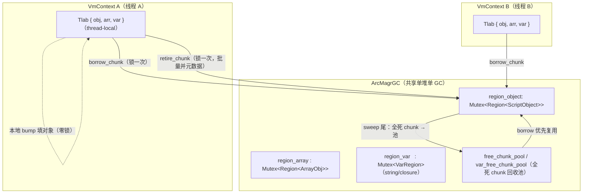
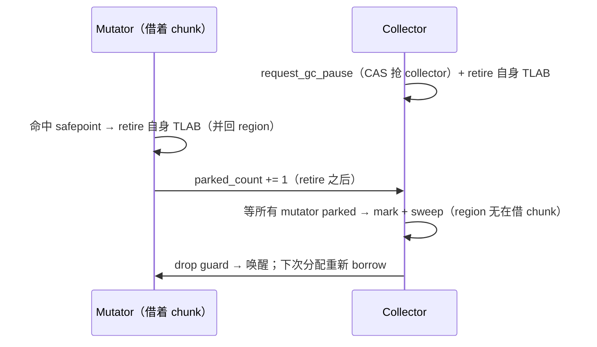

# GC TLAB：线程本地分配（chunk 独占）

> 对齐：2026-08-29（change `add-gc-tlab`，阶段 1–5）。
> 代码：`gc/tlab.rs`（Tlab + thread-local + arm 门）、`gc/region.rs`（`ChunkClaim` + borrow/retire/reclaim，定长对象/数组）、
> `gc/var_region.rs`（`VarChunkClaim` + borrow/retire/reclaim，变长字符串/闭包）、
> `gc/arc_heap/alloc.rs`（fast path）、`gc/safepoint.rs`（retire-on-park）。

## 为什么

`ArcMagrGC` 是**单一共享堆**，所有 mutator 线程共用一个 `Arc<VmCore>` → 一个堆。改造前分配热路径
（`new` / `Str::new` / …）每个对象都要抢**进程级 region 锁**（`region_object`/`region_array`/`region_var`
各一把 `Mutex`）。N 个线程并行分配 → 全在这几把锁上排队，并行编译**越多线程越慢**。

**TLAB（Thread-Local Allocation Buffer）= chunk 独占**：每个 mutator 线程从共享 region **借用一整块
chunk 的写权**，在里面本地 bump 填对象（**零锁**）；chunk 填满就 retire（把已填部分的元数据批量并回
共享 region）+ 再借一块。

**关键不变式：仍是同一个共享堆、同一套 region。** GC 遍历 / 分代 / card table / sweep **全部零改动**——
borrow 来的 chunk 内存和元数据始终归属共享 region，retire 后就是普通已分配槽。

## 架构

- **TLAB** = per-`VmContext` 持有（挂 thread-local，见「arm 门」）的三个「借来的活跃 chunk 句柄」
  （obj/arr/var 各一）。
- **分配**（零锁）：在活跃 chunk 的下一个槽 / bump 偏移写对象，`GcRef`/`VarGcRef` 从槽指针直接建。
- **retire**（借新 / safepoint 时，锁一次）：把 chunk 已填部分一次性并回共享 region（定长：批量
  `initialized`+push `young_list`；变长：批量 append `all_blocks`+`live_count`）。
- **GC 侧**：`iterate_alive`/`iterate_young`/sweep 全不变——定长靠 `borrowed[ci]` 标志跳过在借 chunk，
  变长靠「未 retire 的块不在 `all_blocks`」天然不可见。

## borrow / retire / reclaim 契约

### 定长 `Region<T>`（对象 / 数组）

- **`borrow_chunk() -> ChunkClaim<T>`**（锁下）：从 `free_chunk_pool` 取一块全死 chunk 或 grow 新块，
  标 `borrowed[ci]=true`，返回 `{chunk_idx, slots 裸指针, init_ptr, next, cap}`。
- **`ChunkClaim::fill(value)`**（**零锁**）：`slots[next]` 写 `RegionEntry`；`next += 1`；返回
  `(entry_ptr, generation)`。**按 `init_ptr[next]` 逐槽选写模式**：未初始化槽 → fresh 写（gen 0）；
  已初始化槽（池化 chunk 的死条目）→ **读旧 generation、drop 旧条目、保留 generation 写新条目**
  （ABA 守卫，同 free_list 复用纪律）。
- **`retire_chunk(claim)`**（锁下）：`initialized[0..next]=true`；`young_list` 批量 push；
  清 `borrowed`。局部未填的尾部槽被放弃（每 safepoint retire ≤ CHUNK_SIZE-1，chunk 全死后整体回收）。
- **ambient 路径**：strict-OOM / 无 VmContext 线程走旧的**锁下** `Region::alloc`（`ambient_cur` 独立
  游标，只 grow 全新 chunk，永不碰在借 chunk 的索引——修复了 `next_bump` 的 `ci >= chunks.len()`
  grow 与 borrow 追加同一 `chunks` Vec 的**索引撞车**）。

### 变长 `VarRegion`（字符串 / 闭包）

- 结构类似，但块是**变长** bump（64KB chunk 内按 footprint 前移 `off`），claim 记
  `{base 裸指针, off, local_blocks}`；retire 把 `local_blocks` append 进 `all_blocks`。
- **oversized 块**（> chunk）/ **free-list 复用**走旧锁路径（低频，不进 TLAB）。

### chunk 级回收（D7）

sweep 尾（STW）扫全死 chunk（所有已初始化槽 dead）→ 移入 `free_chunk_pool` 供 borrow 复用。
短命对象密集 workload（编译器正是）的大头内存靠此回收；**slot 级复用留 Deferred**（见下）。

## ⚠️ 变长块复用的 ABA：per-chunk `reuse_gen`

`GcRef`/`VarGcRef` 是**地址+16 位 generation 快照**的标记指针；身份靠地址，ABA 靠 generation 守。

- **定长 `Region<T>`**：槽定长、复用重对齐 → fill **逐槽保留** generation（读旧写新同 gen），
  stale 句柄 gen 不匹配 → 安全。
- **变长 `VarRegion`**：块变长、chunk 复用后新块**不重对齐**旧块边界 → 无法逐槽保留。改用
  **per-chunk `reuse_gen`**：回收时把 `reuse_gen[ci]` 跳到**超过该 chunk 所有块历史最大 generation**，
  fresh 再 bump 的块一律取此 gen → 绝不与指向同地址旧占用者的 stale 句柄撞 `(addr, gen)`。

## safepoint 集成：retire-on-park（D5）

STW 模型（`request_gc_pause`）停所有 mutator。**关键时序**：mutator park 前
（`park_until_idle` / `native_park_incr`，在 `parked_count += 1` **之前**）retire 自己的 3 块 TLAB
（合并元数据 + 清活跃句柄）；collector 成为 collector 后、mark 前也 retire 自己那份。collector 拿到
**完整一致**的共享 region 后 mark/sweep——与单 region 的 sweep **完全一样**。

其它 retire 点（都在 owner 线程）：`VmContext::drop`（线程退出）；`collect_cycles`/`force_collect`
（无 safepoint 的直接回收路径，mark 前 retire 自身）；`snapshot`/`retention`/`finalize_now`（观测/显式
终结前 retire，使视图一致）。

## arm 门：只有 VmContext 线程走 TLAB

thread-local `TlabCell { armed: u32, tlab }`（`UnsafeCell`，owner 独占 + alloc 非重入 → 无运行期借用
检查）。`VmContext::new*` `arm()`、`drop` `disarm()`（嵌套计数）。**无 VmContext 的线程**（cargo 直连
`ArcMagrGC` 的 GC 单测、任何 VM 起来前的 ambient `Str::new`）**不 arm** → 走旧锁路径 → region 内部
单测「alloc 后立即观测存活」行为零变化。

**heap epoch 绑定**：Tlab 记当前借用所属堆的 epoch；`0`=未绑。空 Tlab 首次分配绑定当前堆；若持有他堆
借用（仅多堆 cargo 测试、不 drop VmContext 就换堆）→ fast path 退回锁路径，不混 region。

## 性能门 / 阶段决策

- **正确性门**（每阶段）：`cargo test --lib gc::`（含 6 线程并发共享堆压力，debug build 每次 collect 跑
  `debug_validate_invariants`）+ 真机自举 byte-identical（TLAB 是纯运行期分配器内部改动，不改
  zbc/zpkg 产物）。
- **性能门（阶段 4 实测结论，两个层面必须分开看）**：

  **① 分配机制层（微基准 `tlab_alloc_scaling_probe`，本机 24 核，每线程恒定 200k 对象）——TLAB 大幅有效**：

  | 线程 | 1 | 2 | 4 | 8 | 16 | 24 |
  |------|---|---|---|---|----|----|
  | 锁路径（无 TLAB）| 0.062s | 0.112s | 0.225s | **1.193s** | **3.771s** | 3.917s |
  | TLAB | 0.058s | 0.069s | 0.091s | 0.322s | 0.797s | 1.422s |
  | 加速 | 1.07× | 1.63× | 2.46× | 3.70× | **4.73×** | 2.76× |

  每线程工作量恒定 → 理想墙钟应持平；**锁路径 1→16 线程从 0.062s 暴涨到 3.771s**（region 锁串行化 + 线程自旋），
  这就是立项的「越多越慢」。**TLAB 把它拉回近似 scale**（16 线程 4.73×）。24 线程 TLAB 回落（1.42s，2.76×）
  = 满核 oversubscription + retire/borrow 锁 + 内存带宽的**次级瓶颈**（未来精化候选：更大 chunk / 无锁 pool）。
  → **分配机制层，TLAB 是真实、大幅的修复**，正对立项问题。

  **② 编译器墙钟层——当前看不出来（不是 TLAB 无效，是编译器没充分并行）**：z42.core/z42c.semantics/stdlib
  workspace 串行 vs `--jobs 8/24` **墙钟持平**。根因：当前 z42c 只并行了 **per-file 源读取 + SHA**（`Main.z42`
  唯一 build-path `ParallelFor.Run`；#333 从 3 处 fan-out 砍到 1 处），parse/typecheck/codegen 仍串行 →
  并行段太小、Amdahl 受限、也没充分触发并行分配 → 机制层的 4.73× 在墙钟里被稀释成噪声。

  **决定**：**不翻 `ParallelConfig` 默认**（编译器墙钟这个「性能门」未转正）。但 TLAB **不是**投机地基——
  微基准证明它已修好分配机制层的「越多越慢」。真加速的**唯一剩余前置 = 编译器把重阶段（parse/typecheck/
  codegen）也并行化**（编译器侧 change，roadmap Deferred `compiler-parallel-heavy-phases`），届时机制层的
  4.73× 才会兑现到墙钟。串行 overhead 经 `UnsafeCell`+单次 TLS 优化后 ≈ 噪声（~0.5%）。

## Deferred / Future Work

- **TLAB slot 级复用**（`gc-tlab-slot-reuse`）：整块借用绕过了 region 的 slot 级 free_list（tombstone 单槽
  复用）；partial-live chunk 里的零散死槽暂不被 TLAB 复用（仍可被 ambient 锁路径 / free_list 复用）。
  非移动 GC 本有碎片，pre-1.0 可接受。触发条件：出现「live set 稳定但堆随 GC 轮次单调涨」的碎片回归 →
  回来做 per-thread free-slot cache。见 roadmap Deferred Backlog Index。
- **编译器重阶段并行化**：真正的并行加速前置——把 parse/typecheck/codegen 做成 per-file 并行（编译器侧
  change，非本 VM change）。TLAB 已为其铺好零锁地基。

## 关联

- [gc-tuning-and-safepoint.md](gc-tuning-and-safepoint.md)：safepoint 协议 + 自动回收三态（retire-on-park 挂其上）。
- `docs/spec/changes/add-gc-tlab/`：proposal / spec / design D1–D8 / tasks。
