# 惰性逐函数 JIT（lazy per-function compilation）

> 对齐：2026-07-23（change `lazy-per-function-jit`）。代码：`src/runtime/src/jit/`
> （`lazy.rs` / `frame.rs` / `mod.rs` / `helpers/call.rs` / `helpers/vcall.rs`）。

## 为什么

`--mode jit` 下，VM 先把入口程序的**整个传递依赖闭包**（stdlib 全体）合并成一个
`Module`（`main.rs` 的 eager transitive BFS），再由 JIT 后端编译。**旧策略**在加载时就
把合并模块里**每一个函数**用 cranelift 全量编译一遍。

对一个只调用少量 stdlib 函数的短命程序，这意味着编译了数千个**从不会被调用**的函数。
后果：

- 每次 `z42vm ... --mode jit` 启动付一次「整套 stdlib 冷编译」的固定成本（实测约 1–2 秒起，
  随 stdlib 增大而上升）。
- CI 的 `test-vm-jit` 每个 golden 用例 fork 一个新进程 → 固定成本 × 用例数，一个 shard 撞
  55 分钟超时（run 被取消，见 change 背景）。

**根因**：JIT「加载即全量编译」——编译了程序不调用的东西。

## 核心思想

把编译从「加载时全量」改为「**首次调用时逐函数**」（compile-on-first-call）。被调用到的
函数照常编成原生码真跑（JIT 语义/覆盖不变）；没被调用的永不编译。

可行的前提（关键）：z42 的 `Call` / 虚调用**从不生成直接 cranelift call 到兄弟 z42 函数**，
一律经运行时 helper `jit_call` / `jit_vcall` 间接派发（`translate.rs` 只用 `FuncId` define
当前函数自身，不 link 兄弟）。因此每个函数可以**完全独立**地 declare + translate + finalize，
无需被调者先就绪——被调者在调用点按需编译即可。

## 数据结构

```
JitModule
├── _lazy: Box<Mutex<LazyCompiler>>     // 拥有 cranelift JITModule，保活代码页
│                └─ LazyCompiler { jit: JITModule, helper_ids, module: *const Module, profile }
└── ctx: Box<JitModuleCtx>
        ├── fn_entries_by_id: Vec<OnceLock<FnEntry>>   // 槽 i ↔ module.functions[i]
        │                                              // == MethodId.0 == func_index[name]
        ├── module: *const Module
        ├── lazy:   *const Mutex<LazyCompiler>         // 指向上面的 _lazy（Box 堆稳定）
        └── vm_ctx: *mut VmContext
```

- **`fn_entries_by_id`** 在 `setup` 时**预分配到 `module.functions.len()` 并永不 resize** →
  每个槽地址稳定，`OnceLock::get()` 交出的 `&FnEntry` 在整个 run 内有效、**热路径读取零锁**。
- **by-name 表已删除**：名字查表统一走 `module.func_index[name] → idx → 同一套 by-id 槽`。
- **`Mutex<LazyCompiler>`** 只在**首次编译某函数**时加锁。

## 首次调用流程

```mermaid
flowchart TD
    A[jit_call / jit_vcall / ctor / closure / ToString<br/>统一调 resolve_fn_by_id/​by_name] --> B{slot.get&#40;&#41; 命中?}
    B -- 是（已编译） --> R[返回 &FnEntry，走 native]
    B -- 否 --> C{module.functions&#91;idx&#93;<br/>jit_unsupported?}
    C -- 是（interp-only 指令） --> I[返回 None → cross_zpkg_via_interp 解释执行]
    C -- 否 --> L[lock&#40;lazy&#41;]
    L --> D{双重检查<br/>slot 仍空?}
    D -- 他线程已编 --> U[unlock → slot.get&#40;&#41;]
    D -- 仍空 --> E[compile_one&#58; declare+translate+finalize<br/>get_finalized_function → FnEntry]
    E --> F[slot.set&#40;entry&#41; 发布<br/>计数器 += 1]
    F --> U
    U --> R
```



伪代码（`JitModuleCtx::resolve_fn_by_id`，`frame.rs`）：

```rust
fn resolve_fn_by_id(&self, idx) -> Option<&FnEntry> {
    let slot = self.fn_entries_by_id.get(idx)?;
    if let Some(e) = slot.get() { return Some(e); }      // 热路径：零锁
    let func = (&*self.module).functions.get(idx)?;
    if jit_unsupported_reason(func).is_some() { return None; } // 退 interp
    let mut guard = (&*self.lazy).lock();                 // 串行化编译
    if slot.get().is_none() {                             // 双重检查
        match guard.compile_one(idx) {
            Ok(entry) => { slot.set(entry); counters.jit_methods_compiled += 1; }
            Err(_)    => return None,                     // 编译失败 → interp
        }
    }
    slot.get()
}
```

`resolve_fn_by_name(name)` = `func_index[name] → idx → resolve_fn_by_id(idx)`。

**入口函数**无调用者触发，故 `JitModule::run` 在执行前显式 `resolve_fn_by_name(entry)` 先编它。

## 为什么「编译时运行中的调用者不崩」

最关键的正确性问题：函数 A 的原生码正在栈上执行，调用 B 触发 B 的
`finalize_definitions()`——会不会让 A 的代码页失效？

**不会**。cranelift-jit 为每个函数**单独分配代码内存**；`finalize_definitions` 只对**本次
新定义**的函数做重定位 + `mprotect`，先前已 finalize 的函数代码页原地不动、指针保持有效。
这正是逐函数增量编译成立的基础。单测
`caller_lazily_compiles_callee_mid_execution`（`lazy_tests.rs`）专门锁定这条不变量。

## 线程安全

- **编译**：`Mutex<LazyCompiler>` 串行化，`OnceLock` 双重检查 → 同一函数只 `define` 一次、
  无数据竞争。
- **执行**：并发读 `OnceLock` 槽是安全发布。`LazyCompiler` 手动 `unsafe impl Send`（裸
  `*const Module` 只读；非 `Sync` 的 `JITModule` 只在锁内触碰）。
- 单测 `concurrent_first_call_compiles_exactly_once` 覆盖两线程竞争首调。

## 决策权衡

| 决策 | 选择 | 理由 |
|------|------|------|
| eager vs lazy | **彻底 lazy**，删 eager 全量循环 | 不留兼容路径；AOT 若需 eager，随 AOT 再引入策略分叉 |
| 槽结构 | `Vec<OnceLock<FnEntry>>` 预分配不 resize | 热路径零锁 + 地址稳定（借用长期有效） |
| by-name 表 | 删除，经 `func_index` 路由回 by-id | 消除第二套内部可变结构 |
| 计数器 | `jit_methods_compiled` = **实际编译数** | 更真实；`JitModuleCompiled` 事件仍每模块一次（报模块规模 + setup 耗时） |

## 覆盖不变（与 interp 的关系）

被调到的可翻译函数照常 JIT 原生执行；interp-only 指令的函数（`LoadLocalAddr` /
`CallNative` 等，见 `jit_unsupported_reason`）仍走 `cross_zpkg_via_interp` 解释执行——
与旧策略「skip 后 interp」逐一对齐。golden 套件 `test e2e --mode jit` 全部输出与 interp
参考逐字节一致，是本变更「语义/覆盖不变」的最强回归保证。

## 效果佐证

`Z42_JIT_PROFILE=1` 运行单个 golden，打印的「lazy-compile <fn>」行数 = 实际编译函数数，
应从「整套 stdlib（数千）」降到「该用例实际调用（数十）」。CI `test-vm-jit` shard 墙钟随之
从 ~55 分钟大幅回落。

## 分层：热度阈值 + 三态负缓存（runtime-jit-tiering Phase 1a，准则 2）

lazy-per-function-jit 是「首次调用即编译」；分层把它推进为「**热函数才编译**」——冷函数（调用次数
未达阈值）留在解释器（省编译时间 + code 页，准则 2「只有热函数值得升级」）。

**机制**（`jit/frame.rs`）：
- **调用计数**：`JitModuleCtx.call_counts: Vec<AtomicU32>`（setup 预分配 `merged_len`，lock-free
  `fetch_add`，零 per-call 堆分配）。
- **三态槽**：`FnEntry.ptr==null` = **Rejected**（不可编/编译失败的负缓存）；`ptr≠null` = Compiled；
  `OnceLock` 空 = Unknown。Rejected 一次判定后缓存 → **消除不可编函数每次调用重扫 `jit_unsupported_reason`**
  （整函数指令走一遍）的浪费。两条 resolve 路径通用。
- **阈值**：`Z42_JIT_THRESHOLD`（默认 **1000**，clamp≥1；N=1 = 首 call 即编 = 分层前行为）。第 N 次调用时编译，
  前 N-1 次解释。默认刻意取高：只有真正的热函数才值得编译，冷长尾全留解释器（准则 2 省编译时间+code 页）；
  混合模式（Phase 1.5）保证少数已编译的热 callee 即便被冷 interp 帧调到也走原生。

**分阶段接入各调用点**：阈值需要调用点的 `None`-臂能健壮 interp 任意冷 callee。
- **Phase 1a — `jit_call`（静态/自由）**：其 `cross_zpkg_via_interp` 冷兜底已证通用,直接切 tiered。
- **Phase 1b — `jit_vcall`/`jit_call_indirect`/`jit_obj_new`（方法/闭包/构造）**：改前把**所有**冷函数→`None`
  会暴露这三者兜底不健壮（86 个 jit golden 挂）。逐一补齐后切 tiered：
  - `jit_vcall`：vtable 路径 `None`-臂本已健壮 interp（receiver+args）→ PIC + vtable 两 resolve site 切
    `resolve_fn_by_id_tiered` / `resolve_fn_by_name_tiered`。
    - **primitive 接收者也进 IC（add-jit-primitive-vcall-ic，镜像 interp `refactor-vcall-ic-primitives`）**：
      IC 快路径的 `recv_type` 对 object 取 `TypeDesc.id`、对 primitive（string/int/…）取
      `value_synthetic_type_id` 的合成 `PRIM_TYPE_*`；primitive 慢路径解析成功后按合成 id 安装 PIC
      （仅 intra-module fn_idx）。改前 primitive 接收者**每次**调用都走 `primitive_class_name` 慢路径的
      `format!`×4 候选名 + `Vec`——string-key `Dictionary` 的 `GetHashCode`/`Equals` 首当其冲（实测
      dict e2e jit 从慢 interp 3.1× 追平；string-heavy 反超）。Boxed / `Null` 仍返回 `None` 落慢路径，
      与 interp 一致。
  - `jit_call_indirect`：`None`-臂原本只报「undefined function」（无兜底）→ 补 interp（env 前置 + args）。
  - `jit_obj_new`：`None`-臂原本**静默跳过 ctor**（字段未初始化）→ 补 interp 跑 ctor（原地改 `this`）。
  三态负缓存两路径通用,不受接入阶段影响。

**验证**：`Z42_JIT_PROFILE=1` 下，冷静态函数不出现在编译列表、热函数出现（默认阈值 1000 时，调用不足 1000 次的
冷函数留 interp；调试可 `Z42_JIT_THRESHOLD=1` 强制首调即编）；`test e2e --mode jit` 全绿（输出与 interp 逐字节一致）。

### 阈值也管住 lazy 函数 + 一次性 static-init（runtime-jit-tiering Phase 1c）

Phase 1a/1b 的阈值只作用于**合并模块**函数（`resolve_merged_slot(tier=true)`）。**lazy 加载的
dep-zpkg 函数**（`resolve_lazy_slot`）此前**无条件首调即编**，绕过阈值——启动时 `force_load_all_declared`
把每个 declared zpkg 的 `__static_init__` 全跑一遍，加上任何冷 dep 函数，全都编译了。实测：**一个典型启动
里 ~73% 的编译函数是一次性 `*.__static_init__`**（跑一次、编译纯浪费——付一次 cranelift 编译 + 一个原生
code page 只为跑一遍函数体）。

Phase 1c 两处补齐，让阈值对**所有**函数一致生效：

1. **lazy-slot 门控**：`LazySlot` 加 `count: AtomicU32`（合并路径 `call_counts` 的 lazy 版），
   `resolve_lazy_slot(i, tier)` 加 `tier` 参数——tiered 调用者（`resolve_fn_by_id_tiered`）计数，
   `n < jit_threshold` 即 `return None`（冷 → 走调用者的 lazy `None` 兜底 interp，与不可翻译 lazy 函数
   **同一条已验证的兜底臂**）；非 tiered 调用者（entry）照旧首调即编。`resolve_id_by_name` 注册 slot 前已
   验过可翻译，故冷返回只是**推迟一个确定可编的函数**，不掩盖错误。
2. **static-init 走 interp**：`JitModule::run` 的 init 循环从 `run_fn`（非 tiered，会编译）改为
   `run_static_init_interp`（经 `exec_function` 的 tiered 集中拦截 → 冷一次性 init 留 interp，同时仍把它
   触达的**已编译** callee 路由原生）。静态字段落共享 `VmContext`，与原生路径一致。

**效果**（阈值 1000，bench 场景实测）：编译函数数 **44→1 / 49→6 / 45→2 / 46→2（−88%…−98%）**，
`jit_compile_us_total` **−83%…−94%**；A/B vs 基线**运行时零回归**（480 vs 486ms / 1633 vs 1624ms——
只是不再编译那些浪费的一次性/冷函数）。

> **call-count 分层的固有局限（待 OSR）**：阈值按**调用次数**分层，无法区分「一次性 init」与
> 「只调一次但内部大循环」——二者都只被调 1 次。故任何**阈值 ≥ 2** 都会把 `SumSquares(10M 循环)` 这类
> 「被调一次、循环极热」的函数留在 interp（04_arith bench 在阈值 1000 下比阈值 1 慢 **4.2×**，因为
> `SumSquares` 被 `Main` 只调一次、永不 tier-up）。这不是 Phase 1c 引入的（合并函数在 `d6094594`
> 阈值 1000 起就如此），而是 call-count 分层的本质。**真正的解**是**循环回边计数 / OSR**（按循环迭代
> 数 tier-up，而非调用数），是独立的未来特性。当前权衡：编译密集/计算重 workload 用低阈值（甚至 1），
> 启动/内存敏感用高阈值。

## 混合模式：interp 帧回跳 JIT（runtime-jit-tiering Phase 1.5）

分层前有个「冷子树粘滞」：interp 的 `Call`/`VCall` 永远留 interp（不回跳 JIT），所以一个冷函数（走 interp）
调用的所有子函数——**即便已编译为原生**——也全在 interp 跑。混合模式打破它:**interp 的调用分发也路由到
已编译的原生码**。

**唯一结构缺口 + 解法**（探查证实是小 hook，非重构）：VmContext 原本没有指向 JitModuleCtx 的前向指针
（只有反向 `JitModuleCtx.vm_ctx`）。加一个类型擦除的 `VmContext.jit_ctx: AtomicUsize`
（`vm_context.rs`），在 `JitModule::run_fn` 里与 `vm_ctx` **同生命周期设置/清零**（二者必须一起有效——原生码
经 `(*jit_ctx).vm_ctx` 够到 VmContext）。

**分发 hook**（`interp/exec_call.rs::try_native_static_call` / `exec_vcall.rs::try_native_method_call`）：解析出
callee 的 merged 索引后，若 `jit_ctx` 已发布且 `resolve_fn_by_id_tiered(idx)` 返回已编译 entry → 建 `JitFrame`
（`new_args_from` / `new_method_args_from`）调原生、marshal 结果（照搬 `jit_call`/`jit_vcall`）；否则(冷/不可编)
返回 None → 原样走 interp。GC 统一帧链类型无关（interp `Frame` 与 `JitFrame` 都暴露 `regs`/`env_arena`），
push/pop_frame 复制即安全。

> **`Ref(Stack)` 边界不变量（必须）**：路由前若 **arg 或 receiver 寄存器持有 `Ref(Stack)`**（out/ref
> 参数地址，由 `LoadLocalAddr` 产出）→ **不路由，留 interp**。原生码把每个寄存器都当普通值处理，把栈地址
> marshal 进去会让它被当成 I64 参与算术（症状：`type mismatch in arithmetic: Ref(Stack{..}) vs I64`）。
> `jit_call` 从不触发此路径——JIT 调用者不可能持有 `Ref`（用 `LoadLocalAddr` 的函数本身不可翻译）；
> 混合模式是**唯一**的 interp→native 边界，故这条守卫只在此处需要。这是边界不变量（"栈地址不进原生码"），
> 非兼容补丁。

**效果 + 验证**：冷函数里调热函数现在走原生（不再粘 interp）。计数器 `jit_native_from_interp`
（`--print-stats-on-exit`）= interp 帧路由到原生的次数,>0 即混合模式生效（实测:冷 Driver 循环调热 Hot,
编译后 99 次调用全路由原生）。`test e2e --mode jit` 全绿（语义不变）。

### 集中拦截 backstop（Phase 1.5.2 —— 保证「已编译函数永不被 interp 执行」）

上面的 per-site hook（`try_native_static_call` / `try_native_method_call`）只覆盖 interp 的**静态 Call +
IC 虚 VCall 热路径**。审计所有「interp 会执行函数体」的入口后发现还有多条绕过它们、直接经 `exec_function`
跑函数体：**构造函数**（`exec_object`）、**闭包/委托**（CallIndirect）、**`ToString` 派发**
（`interp/dispatch.rs`）、**非 IC / vtable / base-fallback 的虚调用路径**、**跨包静态调用**、以及最隐蔽的
**builtin 回调**（传给 stdlib 原生方法的比较器/谓词，被调够多次编译后又经 `exec_function` 解释执行）。

只靠逐点补全，「已编译函数永不被 interp 执行」这条 Phase 2 前提**并不成立**——任何新增调用点都可能重开缺口。
解法是**单一 choke point**：三个入口变体（`exec_function` / `exec_function_from_regs` /
`exec_function_from_receiver_regs`）都汇到 `exec_function_body`，且每个 `&Function` 带 `.name` +
已有 `resolve_fn_by_name_tiered`。故在 `exec_function` 入口加 `try_native_exec`（name-based
resolve → Compiled 即建 `JitFrame::new` 调原生、marshal 成 `ExecOutcome`），**一拦对所有路径成立**。
两 `_from_regs` 变体只被已 hook 的热路径以**冷 callee** 调用（compiled 的先被 per-site hook 拦走），故
backstop 完备。同样带 `Ref(Stack)` 守卫（arg 为 Ref → 不路由）。

- **代价**：每次经 `exec_function` 进入函数体多一次 `func_index` 名查（相对解释整个函数体可忽略）。
- **分工**：per-site idx hook = 热路径快车道（无名查）；`exec_function` name backstop = 其余全部路径 +
  不变量保证。二者对同一调用互斥（hook 命中即 return，不到 `exec_function`），无重复执行。

> **解锁 Phase 2**：Phase 1.5.2 后「已编译函数永不被 interp 执行」对**全部** interp 路径成立 →
> 已编译函数的 IR `blocks` 可安全回收（Phase 2:内存半）。**注意**默认阈值 1000 下只有少数热函数编译，
> 故 Phase 2 回收量本身有限（冷长尾 IR 仍需保留供 interp 执行）;回收机制的收益随「实际 tier-up 的函数数」
> 增长（低阈值 / 编译密集 workload 更显著）。

## OSR / 循环回边分层（add-osr-loop-tiering）

> 对齐：2026-08-01。代码：`interp/mod.rs`（`try_osr` + `Frame.back_edge_count`）、
> `jit/translate.rs`（`osr_entry`）、`jit/lazy.rs`（`compile_fn_osr`）、
> `jit/frame.rs`（`from_interp_regs` / `resolve_osr_entry`）。

### 为什么

call-count 分层（上文）只看「函数被调几次」，分不清**一次性函数**与**被调一次但内部循环极热**的
函数——两者调用数都是 1。后者（如 `SumSquares(10M 循环)` 被 `Main` 只调一次）在任何阈值 ≥ 2 下都
永不升级、全程解释执行：实测 04_arith 阈值 1000 比阈值 1 慢 **4.2×**。

OSR（On-Stack Replacement）按**循环回边数**分层：解释器执行热循环到一定迭代数时，**就地**把函数
编成原生码、把当前活跃寄存器交给它、**从循环头继续跑**（不等下次调用）。

### 为什么 z42 做 OSR 特别简单

两个既有性质直接使能：
1. **寄存器在 `frame.regs`（内存），非 SSA**：JIT 原生码逐指令 load/store `frame.regs[i]`
   （`translate.rs` 缓存 `regs_base = frame.regs.as_mut_ptr()`）。故从循环头 block K 进入时，
   block `0..K` 计算的中间值**已在 `frame.regs` 内存里**（解释器写的），原生码直接读——无需把
   SSA 值重建。
2. **interp 与 JIT 寄存器模型同构**：都是 `Vec<Value>` 按 IR reg 号索引、同一 `Value` 类型。状态
   交接就是 `JitFrame::from_interp_regs(&interp.regs, max_reg)` 一次拷贝。

### 机制

```mermaid
flowchart TD
    A[interp exec 循环<br/>Terminator::Br/BrCond] --> B{target ≤ block_idx?<br/>向后跳转=回边}
    B -- 否(前向) --> A
    B -- 是 --> C[check_safepoint<br/>frame.back_edge_count += 1]
    C --> D{count == osr_threshold?<br/>恰好一次}
    D -- 否 --> E[block_idx = target; 继续解释]
    D -- 是 --> F[resolve_osr_entry&#40;id, target&#41;<br/>编译/复用 OSR 变体]
    F -- None&#40;不可翻译/lazy&#41; --> E
    F -- Some&#40;entry&#41; --> G[JitFrame::from_interp_regs&#40;frame.regs&#41;<br/>push_frame → native → pop_frame]
    G --> H[marshal ExecOutcome<br/>return 出 exec_function_body]
```



- **回边计数**：per-activation（`Frame.back_edge_count`，每次调用归零）——语义正好是「这次执行的
  循环够热就升级」；per-function 累加会误触发「多次调用、每次循环几下」的函数（那是 call-count 的活）。
  复用已有的 `target <= block_idx` 回边检测点（原本给 GC safepoint 用），前向跳转零开销。
- **OSR 编译**（`translate_function(osr_entry: Some(K))`）：新建一个专用入口 cranelift block，跑
  正常 prologue（safepoint + `regs_base` + 数组指针 hoist——都是需支配全函数的 SSA 值），然后
  `jump cl_blocks[K]`。block `0..K` 变不可达，`seal_all_blocks` 时被 DCE。**非 OSR 路径（`None`）
  字节不变**——专用入口块只在 `Some` 时创建。
- **跳过 prologue 的正确性**：OSR 只作用**可翻译**函数（带 `ref`/`out` 的函数含 `LoadLocalAddr`
  → 不可翻译 → 不 OSR），故无入口 ref copy-in、无出口 copy-out 要补；safepoint 刚在回边点查过。
- **缓存**：`JitModuleCtx.osr_entries: Mutex<HashMap<(id, K), FnEntry>>`——按 `(函数 id, 循环头 K)`
  键（一函数两循环可在不同 K OSR）。OSR 是稀有事件，用普通 Mutex（非热路径 lock-free 槽表）够。
- **v1 简化**：交接时解释器自身的 VmFrame 仍在栈上，OSR 原生帧再 push 一个——GC 双扫（interp regs
  是 OSR regs 的克隆，同一批 heap 引用，保守正确）；崩溃 trace 该函数出现两次（仅美观）。

### 配置 + 效果

- `Z42_OSR_THRESHOLD`（默认 10000，clamp ≥ 1）：回边达此数触发。高到滤掉短循环、低到让 10M 循环在
  头 0.1% 迭代内升级。
- 实测 04_arith（阈值 1000）：`SumSquares` OSR@block1，输出正确，**476 → 96ms（~5×**，甚至快过
  阈值 1 基线 114ms，因为除头 10000 次解释外整个循环走原生）。
- 验证：`e2e --mode jit` 且 `Z42_OSR_THRESHOLD=1`（每个循环首回边即 OSR，最大压测）**219/0
  byte-identical**——OSR 的状态交接 + 跳 prologue 对全部 golden 循环形态都语义不变。

### 三条分层线的分工

| 机制 | 管什么 |
|------|--------|
| call-count 阈值（Phase 1/1c） | 「被调够多次」的函数升级；冷/一次性函数留 interp |
| 混合模式（Phase 1.5/1.5.2） | 冷 interp 调用者路由到已编译的热 callee |
| **OSR（本节）** | **「被调少但循环热」的函数就地升级——call-count 够不到的一类** |

三者合起来：分层真正按「热度 = 实际执行工作量」决策，不多编一个、不漏编一个。

## 字段访问快路径：对象原语字段原生字节内联（P5-B）

> `jit/translate.rs`（`field_prim_kind` / FieldGet·FieldSet emit / hoist）+
> `jit/helpers/object.rs`（`jit_obj_field_slot`）+ `metadata/types.rs`（`ScriptObject::inline_prim_field`）。
> 前置：对象字节布局统一（`object-abi.md`，字段按 `FieldAccess{offset,width,tag,ref_slot}` 打包进
> `ScriptObject::bytes`）。

### 为什么

统一对象布局把 JIT 寄存器文件压到 16B tagged `Value`，但**字段读写仍 100% 走运行时 helper**
（`jit_field_get`/`jit_field_set`）：每次访问 = 一次 native→Rust 调用 + `RefCell` borrow +
`FieldIC` 查表 + `field_value`/`set_field_value` 里的 tag 分派。字段密集热循环里这层桥是主开销——
实测「非可提升的原语字段读+写热循环」JIT 仅 **1.09×** interp（几乎白 JIT）。

> 历史：布局统一前 `translate.rs` 曾有「方案 B」原生 slot 内联骨架，但 PR-2 字节化后
> `jit_obj_field_slot` 被 stub 成恒返回「无快路」（旧 `slots.as_ptr()+STRIDE` 假设失效），
> 骨架变死代码。P5-B 按 `bytes` 布局复活它。

### 机制：编译期定形 + 运行期只 hoist 基址

关键切分——**宽度/符号性/寄存器 tag 全在编译期定死**（避免运行时按 width 分支），
**只有对象的 `bytes` 基址 + 字段字节 offset 运行期解析一次**：

1. **编译期分类器** `field_prim_kind(func, reg)`：读该寄存器的静态 `IrType`（带完整符号性
   I8..U64/F64），映射出 `{load_ty, ext(Sext/Uext/Keep/Float), reg_tag, width, field_tag}`。
   仅 `I8..U64 + F64` 内联；`F32/Bool/Char/Str/Ref` → `None` 回落 helper。
   - `reg_tag` 是 **`Value` 判别 tag**（int 全存 `Value::I64`=0，float=`Value::F64`=1），**≠**
     字段的 `TAG_*` wire tag——两套 tag 别混。
2. **入口块 hoist**（每个从不被重赋值的对象寄存器 + 固定字段名，如 `this.f`，一次）：调
   非抛异常的 `jit_obj_field_slot`，它经 `ScriptObject::inline_prim_field` 解析：字段是**纯内联标量**
   （`ref_slot<0` 且 `tag∉{OBJECT,ARRAY,UNKNOWN,STR}`）且运行时 `(width,tag)` 与编译期期望一致
   → 写回 `(bytes.as_ptr(), offset)`；否则写 `off=-1`。非移动 GC + `bytes` 定分配 + 对象被持活
   ⇒ 该指针整帧有效。
3. **每访问 inline**：`brif off<0` → helper 兜底；否则 native——
   - FieldGet：`load(load_ty)` at `bytes_ptr+off` → `sextend`/`uextend`/直存（镜像 `decode_prim`）→ 写
     寄存器 `tag`+`payload`。
   - FieldSet：`ireduce` 到 `width` 存 `bytes_ptr+off`（镜像 `encode_prim` 的 `as uN` 截断）；
     **无 tag、无 write barrier**（原语非堆引用）。

### 边界（必留 helper，回落即等价改前）

`off=-1` 回落 `jit_field_get`/`jit_field_set` 的情形，与改前逐字等价（老 stub 恒 -1 时本就全走 helper）：
**非 `Value::Object` receiver**（含逃逸分析的 `StackObject`）、引用字段（写要 barrier）、
byte-inline 的 object/array 引用、内联 struct 叶、`object`/`interface` 多态擦除字段、
`Str.Length`/`Array.Length` 内建伪字段、null-throw。故唯一新增行为 = **具体对象的原语字段走原生**。

### 正确性靠的不变式

`width`/符号性取自 `reg_types[dst/val]`（FieldGet dst / FieldSet val 的静态类型），而 z42
**无隐式窄化** ⇒ 该静态类型恒等于字段声明类型 ⇒ 等于 packed 字段宽度；`jit_obj_field_slot` 再用编译期
`(width,tag)` 运行时校验兜底，对不上就回落。对齐：`bytes` 字段自然对齐（布局 `_alignUp` + 分配器
≥16B），三目标 ISA（x86-64/aarch64/wasm32）标量访问不 trap，故 `MemFlags::trusted()` 成立。

### 效果佐证

字段密集热循环 JIT **5.42s→2.59s（JIT 自身 2.09×）**、jit-vs-interp **1.09×→2.26×**（σ 极小）。
正确性：全类型测（sbyte/short/int/long/byte/ushort/uint/double 含 wraparound 验 sext/uext/float）
interp==jit；且 **z42c 自举 5/5 gen1==gen2 逐字节**（z42c 海量字段访问跑在原生路径上仍字节复现）是
最强回归保证。
