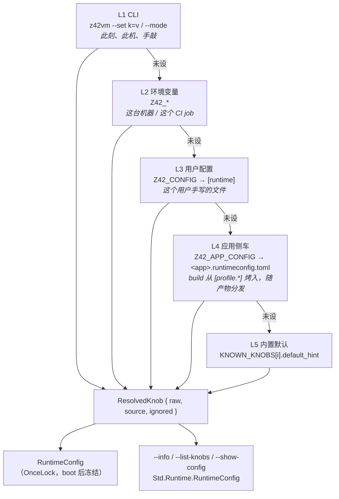

# 运行时设置（旋钮登记表 / 五层优先级 / 可用性与诊断）

> 对齐：2026-09-05（change `complete-runtime-settings`；地基来自已归档的 `unify-run-modes` P0）。
> 代码：`src/runtime/src/config/`（`knobs.rs` 类型 · `knob_table.rs` 登记表 · `availability.rs` 求值 ·
> `resolve.rs` 分层解析 · `source.rs` 配置文件 · `render.rs` 查询渲染 · `cli.rs` `--set`）、
> `src/runtime/src/corelib/config.rs`（脚本 builtin）、
> `src/compiler/z42c.driver/src/RuntimeConfigSidecar.z42`（侧车生成）。

## 为什么

z42vm 的行为由一组「旋钮」控制（GC 算法、执行模式、日志过滤、采样频率…）。这些旋钮
从四个地方来、在不同平台和构建配置下未必存在、而且用户设了不生效时**过去毫无提示**。
本页记录三件事：

1. **登记表是唯一 SoT**——新增一个旋钮 = 表里加一行，CLI / 环境变量 / 两个配置文件层 /
   三个查询命令 / z42 脚本表面全部自动跟随；
2. **五层优先级链**及每层由谁写、为什么是这个顺序；
3. **可用性与诊断**——一个旋钮在什么条件下"不存在"，以及为什么 CLI 的错误致命、
   其余只 warn。

## 五层优先级链



**逐 key 独立**：环境里设了 `Z42_LOG`、侧车里写了 `gc-mode`，两个都生效——不是整层二选一。

**五层对 `z42vm` 与嵌入方都成立**。CLI 层是 `z42vm` 二进制独有的（`--set` 由它解析）；
其余四层由 `RuntimeConfig::from_env()` 装配，所有走 `z42_host_run_app` 的入口
（desktop 自包含 apphost / wasm / iOS / Android / testhost）经 `runtime_config()` 懒初始化
落在这条路径上。区别只在**诊断严重度**：`z42vm` 的 `main()` 对坏配置致命退出并提供
`--strict-config`；库入口一律 warn 后继续——它可能跑在宿主进程里，因一个配置 typo
杀掉宿主不是它该做的事。

> 这一点此前不成立（sidecar-reaches-published-apps 2026-09-05 修）：`from_env()` 是
> `resolve(get, None)`，文件层只在 `z42vm` 的 `main()` 里单独装配，于是**每个嵌入方都
> 静默忽略 `Z42_CONFIG` 与 `Z42_APP_CONFIG`**——文档承诺的链在 z42vm 二进制之外根本没接上。

**L3 与 L4 是同一种东西的两个实例**：格式相同、解析器相同（`[runtime]` TOML 表），
区别只在**谁写的**。L3 是用户手写（"我这台机器上想改这个"），L4 由 `z42c build` 生成、
随产物分发（"这个应用需要这样跑"）。所以它们叠加而不是互斥——用户改一个旋钮不该丢掉
应用自带的其余配置。

> **历史坑**：这两层从前共用 `Z42_CONFIG` 一个通道，且只在用户没设时才塞侧车路径。
> 于是用户一旦 `export Z42_CONFIG=my.toml`，应用侧车就被**整份丢弃**。
> 另有一条：工程 `[profile.debug].mode` 从前被 launcher 注入成 `Z42_MODE`，
> 于是工程配置落在 **L2**、反过来压过用户的 L3——与本表方向相反。两条都在
> `complete-runtime-settings` P5 改掉。

### 谁在什么时候写 L4

`z42c build` 产 `dist/<name>.zpkg` 时同产 `dist/<name>.runtimeconfig.toml`，把
manifest 里生效 profile（release 构建取 `[profile.release]`，否则 `[profile.debug]`）的
**运行时**旋钮烤成 `[runtime]` 表：

```toml
# manifest —— [profile.<n>] 本身只是命名空间，内容是两个具名子表
[profile.debug.runtime]        # → 侧车 [runtime]
mode = "interp"
[profile.debug.properties]     # → 侧车 [properties]（见 AppProperties）
api-endpoint = "http://localhost:8080"
```

两个子表与侧车两段 **1:1**。此前旋钮是 `[profile.<n>]` 下的裸标量、与构建期键靠一份
**手写排除清单**区分——漏更新就会让新的构建期键悄悄流进 app 侧车。改成子表后边界是
结构性的，不可能漏（`restructure-profile-sections`，2026-09-05）。
`[profile.<n>]` 下直接写键会**明确报错**并指出正确位置——静默失效对迁移的人最坏。
```toml
# dist/app.runtimeconfig.toml（生成）
# generated by z42c build — do not edit
# source: [profile.debug] of app
[runtime]
mode = "interp"
```

对齐 dotnet：`<app>.runtimeconfig.json` 由 SDK 在**构建时**生成并与产物一起进 `bin/`。
放在 driver（写产物的地方）而非 launcher，是因为侧车必须与产物 1:1——放 launcher 就
只有 `z42 run <dir>` 会产，`z42 build` 单跑与 `z42 publish` 打包时产物不自洽。

三条边界：

- **profile 没声明运行时旋钮 → 不产文件**。产一个空 `[runtime]` 表既无意义，又会让
  "从前没有侧车"的工程凭空多出一个产物。
- **只收用户真的写了的键**。`Profile.Mode` 字段有历史硬默认 `"interp"`，拿它烤侧车会把
  一个用户没声明的 `mode = "interp"` 写进产物、**静默压过 build 默认的 jit**；
  `Profile.Knobs` 没有这个歧义。
- **不覆盖手写侧车**。目标路径已存在且不含生成标记头 → build 报错，提示把内容移进
  manifest 的 `[profile.*]`。

### 侧车怎么到达已发布的 app

`z42 publish` 把侧车与 zpkg 一起搬进部署布局（自包含布局把 zpkg 改名成 `app.zpkg`，
侧车跟着改成 `app.runtimeconfig.toml`）。

**运行时不需要任何人指路**：`Z42_APP_CONFIG` 未设时，**VM 自己**按「同目录、同 stem」
从 app 文件推出侧车路径（`config::sidecar_for`）。这条推导发生在**装配**期——配置在
`OnceLock` 里 boot 后冻结，`app::run` 那时再想加一层就晚了——所以它在两个入口各做一次：
`z42vm` 的 `main()`（有 `cli.file`）与 `z42-host::run_app`（有 `file` 参数）。这两条就是
**全部**进入执行核心的路径，于是覆盖：

| 形态 | |
|---|---|
| `z42vm <app.zpkg>` 直跑 | ✅ |
| `z42 run` / `z42 repl`（launcher）| ✅ |
| `z42 publish` 出的 spawn apphost | ✅ |
| 桌面自包含 apphost（进程内 `z42_host_run_app`）| ✅ |
| wasm / iOS / Android | ✅ |

**约定只有一处实现。** 调用方**可以**传显式路径（`Z42_APP_CONFIG` 仍优先），但不必自己
去发现——对照 dotnet：host 永远读 `<app>.runtimeconfig.json`，那是 **app 的属性**，不是
调用方的选项。据此 apphost **不**做发现（它算出路径只为交回给能自己算的东西，是纯重复；
它的本分是"找 z42vm + 把 app 交给它"）；launcher 仍转发，因为它为顶层 `version` pin 本来
就把该文件读进来了，路径在手，转发已知值不是重复发现。

找不到侧车是**常态**（多数工程没有 `[profile.*]` 旋钮 ⇒ build 不产侧车），安静跳过、
不 warn；而 `Z42_APP_CONFIG` 被**显式**指向一个不存在的路径仍会 warn。

> 这条链分两步修好：`sidecar-reaches-published-apps`（2026-09-05）让 publish 拷侧车、
> apphost 传路径；`app-config-follows-the-app`（同日）发现**根子更深**——app-config 层
> 只在别人主动指路时才存在，于是 `z42vm <app>` 直跑与一切嵌入形态（wasm / iOS /
> Android / 桌面自包含）都拿不到，因为那些环境里根本没有"用户设环境变量"这回事。改成
> 由 app 文件推导后，apphost 那份发现随之删除。`xtask test dist` 的 apphost smoke 断言
> `RuntimeConfig.Source("mode") == "app-config"`，链上任何一环断掉都会红。

## 旋钮 vs 应用属性

侧车装两样东西，**分表**：

| 段 | 装什么 | 谁理解它 |
|---|---|---|
| `[runtime]` | VM 旋钮 | VM：登记表 / 类型 / 可用性 / 诊断 / 五层链 |
| `[properties]` | app 自定义配置 | **只有 app 自己**——VM 原样搬运，不校验 |

分表不是洁癖，是为了**保住诊断**：若两者同住一张表，`gc-mdoe` 这种 typo 会被当成一个
合法的用户属性静默收下，本页承诺的「未知旋钮就明确报出来」随之失效。

应用属性只从 app 侧车来（没有 CLI / env / 用户配置的覆盖——它是**项目**配置），
运行时经 [`Std.Runtime.AppProperties`](../stdlib/app-properties.md) 只读，支持完整
TOML 类型。

## 登记表：唯一 SoT

每个旋钮在 `config/knob_table.rs` 里一条，声明 12 个字段。**新增旋钮 = 加一行 +
在 `consumed_by` 处读它**，其余一切自动跟随。

| 字段 | 作用 | CoreCLR 对照 |
|---|---|---|
| `name` / `toml_key` / `aliases` | 环境变量名 / 配置键（也是 `--set` 的 key）/ 显式短名 | — |
| `value: ValueKind` | 类型与取值域（`Bool` / `Int` / `Float` / `Str` / `Path` / `PathList` / `Enum` / `Flag`）| `ConfigDWORDInfo` vs `ConfigStringInfo` |
| `sources: LayerMask` | 允许从哪几层设置 | — |
| `build: BuildAvail` | `Always` / `DebugOnly` | `RETAIL_CONFIG_*` vs `CONFIG_*`（`#ifdef _DEBUG`）|
| `requires` | 需要的 cargo feature（全满足才可用）| — |
| `platforms: PlatformAvail` | `All` / `Only(..)` / `Except(..)` | — |
| `tier: Tier` | `Public` / `Unsupported` / `Internal` | `EXTERNAL_/UNSUPPORTED_/INTERNAL_` 符号前缀 |
| `description` / `default_hint` / `consumed_by` | 说明 / 未设时的行为 / 真正消费它的文件 | — |

几处**刻意的**设计：

- **`aliases` 而不是"env 名自动等价"**：`--set` 只认 `toml_key` 或表里显式写出的短名。
  自动接受 `Z42_GC_MODE` 会建立一条隐式双写法约定，将来某个旋钮的 env 名与 kebab key
  一旦不再是机械映射（为兼容改名），"自动等价"就失效或产生歧义。
- **`ValueKind::Flag` 与 `Bool` 分开**：`Flag` 是"存在即启用"（连 `=0` 也算开），
  忠实描述用 `env::var(..).is_ok()` 实现的旋钮。但这条 shell 惯例**活不过配置文件**：
  一旦旋钮能写进 `[runtime]`，`no-fusion = false` 必须表示"不要关"。所以
  `adopt-inline-env-knobs` 在放开这四个开关旋钮的层时，同一刻把它们转成了真 `Bool`
  ——**开放层与转换类型必须一起发生**。`Flag` 变体保留，但当前无使用者；将来若有旋钮
  要用它，得说明为什么这条配置文件陷阱对它不适用。
- **`sources` 不是所有旋钮都给全**：
  - 元旋钮（`Z42_CONFIG` / `Z42_APP_CONFIG` / `Z42_STRICT_CONFIG`）只收 CLI/env——
    它们决定**读哪个文件**和**诊断有多严格**，写进配置文件会自指；
  - `Z42_STRESS_ITERS` 标 **ENV_ONLY**：GC 压力测试脚手架，进 CLI 表面等于向用户暗示
    它是个正经旋钮。
  - 其余**全部四层可设**。曾有 8 个旋钮（`Z42_JIT_THRESHOLD` / `Z42_STACKALLOC` 等）
    在各自 `consumed_by` 处直接 `std::env::var`，那时它们如实标 ENV_ONLY——CLI 与配置
    文件层根本到不了那行内联读取，标成"四层全收"会让 `--list-knobs` 声称能 `--set`
    而实际静默无效，**比不登记更坏**。`adopt-inline-env-knobs`（2026-09-05）把消费点
    改读 `runtime_config()` 后限制解除，并留了一道反向门：**任何新的内联 env 读都会
    让测试变红**（`no_knob_is_read_inline_from_the_environment_any_more`）。

登记表有一道**源码扫描防腐门**（`config_tests.rs`）：走 `src/` 找 `"Z42_*"` 字面量，
不在表内即红。加这道门是因为表曾经漂移过——8 个 VM 真在读的旋钮不在表里，于是
`--info` / `--list-knobs` 根本看不到它们。

## 可用性与诊断

一个旋钮的值要生效，四项全通过：`sources` 允许来源层 → `build` 满足 → `requires` 的
feature 全部编进本二进制 → `platforms` 允许当前 OS。任一不满足 → 值被丢弃 + 一条诊断。

诊断完整回答四个问题：

```
z42: knob `jit-profile` (Z42_JIT_PROFILE, from [env]) is unavailable in this build:
     requires feature `jit`; this z42vm was built with: interp-only, native-interop.
     -> value ignored; using default (unset; JIT profiling off).
     Run `z42vm --list-knobs --all` to see every knob's availability.
```

### 严重度按来源分层

| 来源 | 未知 key | 不可用 / 不接受该层 | 类型非法 |
|---|---|---|---|
| **L1 CLI** | **error, exit 2** + 最近邻建议 | **error, exit 2** | **error, exit 2** |
| L2 env / L3 用户配置 / L4 应用侧车 | warn（仅文件层——见下）| warn + 用默认继续 | warn + 用默认继续 |

**为什么不对称**：CLI 是"此刻、此机、手敲"的意图，静默忽略一个 typo 会让用户以为设置
生效了。而 env / 文件层**跨机器与跨 build 传播**（CI 全局 export、容器镜像 ENV、随产物
分发的侧车）——若它们也致命，一个 export 了 `Z42_JIT_PROFILE=1` 的 CI 环境会让所有
interp-only 二进制**起不来**：用可用性检查换来一场可用性事故。

`--strict-config`（等价 `Z42_STRICT_CONFIG=1`）把 warn 升级为 error，给 CI 当配置漂移门。

**每个旋钮最多一条诊断**（最高层那条）：同一个 "requires feature `jit`" 刷两遍没有新
信息；被压过的值仍进 `ignored`，`--show-config` 一次全看得到。

**未知 key 只在 z42vm 拥有命名空间的层检测**——`--set` 的 key 与 `[runtime]` 表的 key。
**不扫环境变量**：`Z42_` 前缀是全生态共享的（launcher 的 `Z42_HOME` / `Z42_PORTABLE_*`、
测试框架的 `Z42_TEST_*`），VM 对着这些喊"未知旋钮"是每次 run 都刷的纯误报。

### 范围校验的归属

解析层只验**类型**（能不能解析成声明的 `ValueKind` / 在不在 `Enum` 集合里）。
**取值范围留给各 `parse_*`**——它们历史上是「越界钳制到边界」而非「拒绝」
（`Z42_GC_SOFT_THRESHOLD=1.5` → 1.0）。在解析层拒绝会把钳制变成回落默认，是行为回归。

> CoreCLR 对 release build 里的 debug-only 旋钮是**完全静默忽略**（宏在 `#ifdef _DEBUG`
> 外根本不生成符号，名字都不存在）。z42 选择"忽略但明说"：成本是一行 stderr，收益是
> 用户不必读源码就知道旋钮为什么不生效。

## 查询：命令行与脚本

| 命令 | 看什么 |
|---|---|
| `z42vm --list-knobs [--all] [--json]` | **schema**：key / env / alias / 类型 / 可设置层 / tier / 本 build 可用性 / 默认 / consumed_by / 说明。默认只列 `Public`（调优旋钮与机制内部件是噪音）；`--all` 列全部 |
| `z42vm --show-config [--json]` | **生效值 + 来源层**，以及**"我明明设了为什么没生效"**的逐条解释 |
| `z42vm --info` | 构建信息 + 完整旋钮快照（bug report 用；旋钮块与 `--show-config` 共用渲染器）|

```
$ Z42_GC_MODE=stw z42vm --set gc-mode=concurrent --show-config
gc-mode = concurrent  [cli]
  ignored [env] "stw"  (overridden by a higher layer)
jit-profile = (默认: unset; JIT profiling off)  [default]
  ignored [env] "1"  (unavailable in this build)
```

三个查询命令都不需要 `<FILE>` 参数。

### z42 脚本侧（只读）

```z42
using Std.Runtime;

string? mode = RuntimeConfig.Get("gc-mode");          // 生效值；取默认时 null
string  src  = RuntimeConfig.Source("gc-mode");       // cli|env|user-config|app-config|default
bool    ok   = RuntimeConfig.IsAvailable("jit-profile");
string[] all = RuntimeConfig.Dump();                  // "key=value|source" 扁平条目
```

价值在于：直接读 `Environment.GetEnvironmentVariable("Z42_GC_MODE")` 只能拿到 **env 那
一层的原始串**，看不到 CLI 覆盖和配置文件，也分不清"没设"与"设了但被更高层压过"。

**没有 setter**，三条理由：

1. 配置在 `OnceLock` 里，boot 后物理不可变。加 setter 要换成 `RwLock`，给每次 safepoint
   都读的 `safepoint_throttle` 加锁开销——为边缘能力惩罚主路径。
2. 多数旋钮**只在 boot 期被消费一次**（`Z42_LIBS` 定位、`Z42_SAMPLE_HZ` 决定是否起采样
   线程、`Z42_GC_MODE` 决定建哪种堆）。运行中改要么无效、要么要重建子系统——
   "能设但不生效"比"不能设"更坏，这正是 .NET `AppContext.SetSwitch` 的坑。
3. 真正需要运行期可调的能力（触发 GC、调堆上限）有专门 API（`Std.GC`）。

## 配置文件格式：只有 TOML

`Z42_CONFIG` 与 `Z42_APP_CONFIG` 都只读 TOML 的 `[runtime]` 表。**不引入 JSON、也不为
JSON 留抽象层**——`unify-run-modes` 已裁决过把 .NET 风格的 JSON 侧车收编成 TOML，全仓
配置格式已统一（`z42.toml` manifest / `~/.z42/config.toml` / `.runtimeconfig.toml`），
为一个已被否决的方向付抽象税不划算。

唯一的关照：路径以 `.json` 结尾时给一行**迁移提示**错误，而不是让从 .NET 迁来的人对着
一个被静默忽略的文件 debug 半小时。

其余错误语义：文件不存在 → warn + 该层不存在（不致命，env/默认仍适用）；
非法 TOML 或 `runtime` 不是表 → **显式报错**（绝不静默降级为默认）；
合法但没有 `[runtime]` 段 → 该层不存在。

## 相关

- [GC 调参与自动回收 / safepoint 协议](gc-tuning-and-safepoint.md)——`Z42_GC_*` 各旋钮的语义
- [诊断与性能分析](diagnostics.md)——`Z42_SAMPLE_HZ` / `Z42_TRACE_OUT`
- change `complete-runtime-settings`（`docs/spec/changes/`）——需求↔迭代可追溯
