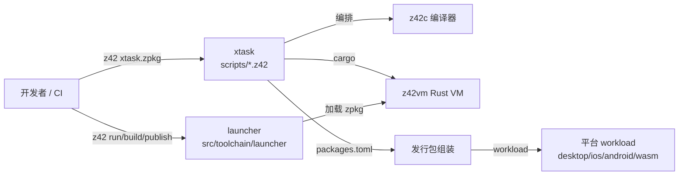

# 第五部分 · 工具链（Toolchain）

> **页型**: 概览页 ｜ **代码**: `scripts/`（xtask）· `src/toolchain/` ｜ **对齐**: 2026-07-02

z42 的配套工具链：开发期怎么构建、测试、打包、发行。核心是 **xtask**——纯 z42 写的自举 dev CLI，
所有构建/测试/打包动作的单一入口。

## 工具链地图

分工：**xtask** 面向仓库开发（build/test/package/regen…）；**launcher**（`z42` 命令）面向语言
用户（run/build/publish 用户工程）；**workload** 是各平台的发行载体模板。`src/toolchain/builder/`
（z42b 编排器）是前瞻设计、仅占位骨架，尚未实施。

## 章节导航

| 章节 | 讲什么 |
|------|--------|
| [xtask：自举 dev CLI](xtask.md) | xtask 定位、自举链路、CLI 分发架构、--toolchain 机制 |
| [构建编排（build / regen）](build.md) | z42c 七包自建拓扑、stdlib 自建三阶段、golden 基线重生 |
| 测试门禁（test gate）（待写） | GREEN gate stage 串联、--scope 决策、不动点验证 |
| 发行打包（packages.toml）（待写） | 组件注册表、staging handler、按 RID 组装 |
| launcher 与 workload（待写） | launcher 命令分发、平台导出生命周期 |

基础层（怎么用、命令清单、目录结构）见 `scripts/README.md` 与 `docs/workflow/`——本部分只讲
设计与机制，不重复用法。

## 迁移状态（旧 `docs/design/toolchain/` → 本部分）

> ⬜ 待迁 · 🟡 迁移中 · ✅ 已迁并校对。

| 旧文档 | 目标章节 | 状态 |
|--------|---------|------|
| build-orchestrator.md | （前瞻未实施——迁 Deferred 记录即可） | ⬜ |
| runtime-workload-distribution.md | 发行打包 | ⬜ |
| export.md / platform-export-lifecycle.md | launcher 与 workload | ⬜ |
| launcher-command-dispatch.md | launcher 与 workload | ⬜ |
| repl.md | （附录·独立主题） | ⬜ |
