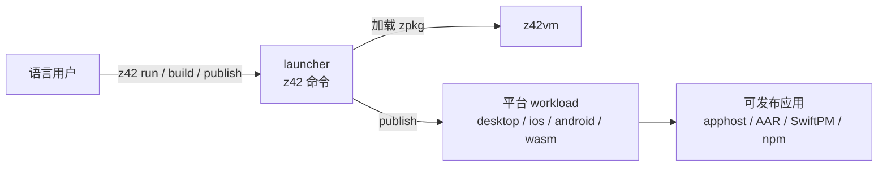

# 第五部分 · 工具链（Toolchain）

> **页型**: 概览页 ｜ **代码**: `src/toolchain/` ｜ **对齐**: 2026-07-02

面向 **z42 语言用户**的工具链：安装 z42 之后拿到什么、`z42` 命令能做什么、应用如何发布到
各平台。仓库内部的开发基础设施（xtask、构建/测试编排）见[第六部分](../dev/README.md)。

## 全景

用户经 `z42`（launcher）运行与构建工程；`publish` 走各平台 workload 模板产出可发布形态。

## 章节导航

| 章节 | 讲什么 |
|------|--------|
| launcher（`z42` 命令）（待写） | 命令分发、zpkg 加载、apphost |
| workload 与平台发行（待写） | 四平台 workload 结构、publish/export 生命周期、runtime/workload 分层 |
| SDK 与发行包布局（待写） | 安装后目录布局、包内容与 manifest |

## 迁移状态（旧 `docs/design/toolchain/` → 本部分）

> ⬜ 待迁 · 🟡 迁移中 · ✅ 已迁并校对。

| 旧文档 | 目标章节 | 状态 |
|--------|---------|------|
| launcher-command-dispatch.md | launcher | ⬜ |
| export.md / platform-export-lifecycle.md | workload 与平台发行 | ⬜ |
| runtime-workload-distribution.md | workload 与平台发行 / SDK 与发行包布局 | ⬜ |
