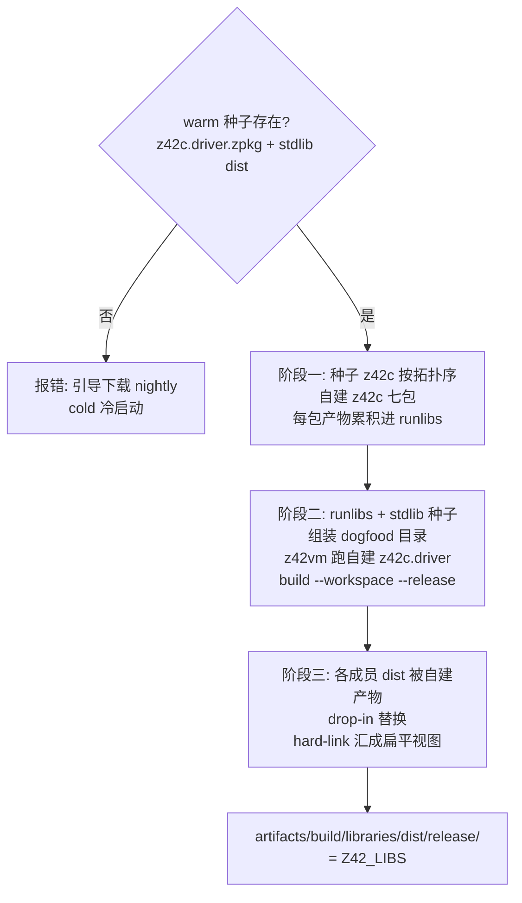

# 构建编排（build / regen）

> **页型**: 机制页 ｜ **状态**: ✅ 已实现（C#-free）｜ **代码**: `scripts/build/` · `scripts/xtask_regen.z42`
> **相关**: [xtask](xtask.md) · 编译器·自举与种子（待写）｜ **对齐**: 2026-07-02

## 一句话定位

`build` 命令族把"z42c 自建自己 → 自建 z42c 编 stdlib → 产物成扁平视图"这条自举构建链
编排成可重复的步骤；`regen` 用同一套工具链重生全部 golden 测试的 `.zbc` 基线。

## 设计目标与约束

- **C#-free**：全链只用 z42c（warm 种子或 nightly 下载），无 dotnet 步骤
- **自建即验证**：z42c 每次构建都在自己编自己，构建通过本身就是编译器冒烟测试
- **产物可寻址**：一切落 `artifacts/build/`；stdlib 汇成单一扁平目录供 `Z42_LIBS` 指向
- **warm/cold 两态**：有产物走 warm（快）；fresh checkout 走 cold（下载种子），两态产出等价

## 方案与决策

| 决策 | 选择 | 理由 |
|------|------|------|
| stdlib 由谁编 | 自建的 z42c（drop-in 替换种子产物） | 每次构建都是一轮自举验证；产物永远出自当前源码的编译器 |
| 扁平视图 | hard-link 汇聚到单目录，**无 namespace index** | VM / 嵌入宿主都直读 zpkg NSPC section，索引是冗余状态 |
| golden 输出 | 重定向 `artifacts/` 镜像；仅 `zbc-format` 类原地覆盖 | 仓库不积构建产物；zbc-format 是 checked-in 字节基线，git diff 即格式漂移探针 |
| golden 编译并发 | 每 case 独立 spawn z42c 进程、批量 8 路 | 成本被 driver 启动主导（加载 driver+7 包+stdlib），进程级并行收益最大 |

## 机制

### build stdlib：三阶段自举构建

要点：阶段一每编完一个 z42c 成员，其 zpkg 立即进入后续成员的编译依赖（拓扑累积）；
阶段二让**自建的** z42c（不是种子）编 stdlib workspace，产物直接覆盖各成员 dist；
阶段三 hard-link（零拷贝）汇聚成单目录。`build compiler` 即单独执行阶段一 + 七包完整性校验。

### 不动点验证（test compiler 的核心）

gen1 = 种子编出的 z42c 七包；gen2 = 用 gen1 再编一遍七包；**gen1 与 gen2 必须逐字节相等**。
不相等即编译器 self-host 有非确定性或语义 bug。这是"byte-identical 全自举"目标的日常守门员。

### regen：golden 基线重生

三种枚举布局合并成一个 case 清单，逐 case spawn z42c 编译（8 路并批）：

| 布局 | 位置 | 输出 |
|------|------|------|
| dir 模式 | `src/tests/<cat>/<name>/source.z42` | artifacts 镜像；`zbc-format` 类例外原地 |
| 库测试 dir 模式 | `src/libraries/<lib>/tests/<name>/source.z42` | artifacts 镜像（跳过 `[Test]`/`[Benchmark]` 目录——无 Main，归 `test stdlib` 跑） |
| flat 模式 | `src/tests/<cat>/<name>.z42` | artifacts 镜像 |

**排除类**：`errors` / `parse`（预期编译/解析失败，本就无 `.zbc` 可产）、`cross-zpkg`
（多包协作，非单 source 产物）。工具链选择尊重 `Z42_TOOLCHAIN`（见 [xtask](xtask.md)），
未设时用 build-tree 的 z42c + stdlib + z42vm。

## 实现

| 组件 | 位置 | 要点 |
|------|------|------|
| stdlib 三阶段编排 | `scripts/build/xtask_stdlib.z42` 的 `_buildStdlibCore` | 种子校验 → 七包自建 → dogfood → 扁平视图 |
| z42c 七包自建 + 不动点 | `scripts/build/xtask_compiler.z42` 的 `_buildCompilerViaZ42c` / `_testCompilerUnits` | 拓扑序累积 runlibs；gen1==gen2 逐字节比对 |
| 自举 e2e oracle | `scripts/build/xtask_compiler_e2e.z42` | div-by-zero 等行为校验（500 行限制拆出） |
| 跨版本边界检查 | `scripts/build/xtask_bootstrap_check.z42` | nightly z42c 能否编当前源（分阶段引入纪律探针） |
| golden 重生 | `scripts/xtask_regen.z42` 的 `_regenGolden` | 枚举三布局 → `_compileCaseSpawn` 并批 |

## 边界与限制

- cold 路径本地不可完整验证（依赖下载）——其 GREEN 判定以 CI 为准
- `build stdlib [lib]` 的按库参数当前只支持 all（整 workspace 构建）
- regen 的并发度固定 8 路（未随 CPU 数自适应）

## Deferred

- z42b 编排器接管 build 编排（见 [xtask · Deferred](xtask.md)）
