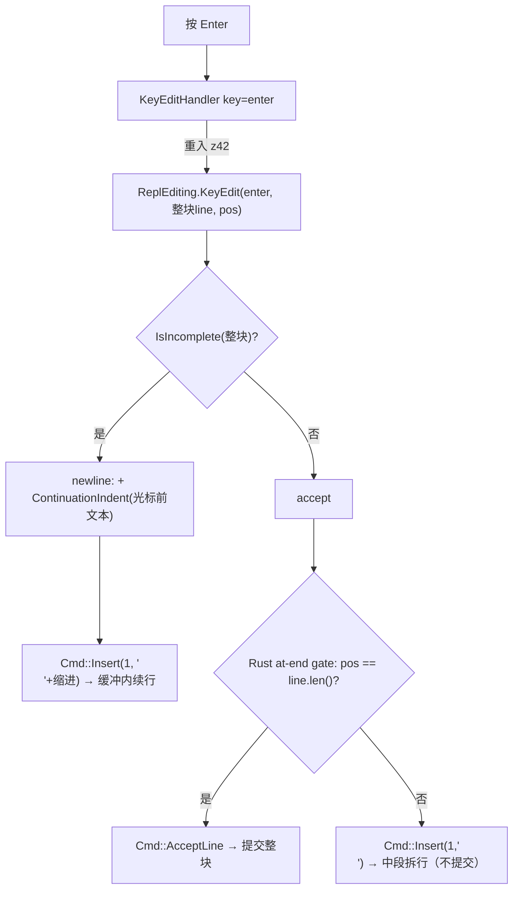

# REPL 输入完整性判定（parser 权威）

> 对齐：2026-08-23（change `add-repl-parser-completeness` + `sink-repl-indent-to-script` +
> `add-repl-indent-editing` + `add-repl-tab-grid-snap` + `add-repl-multiline-editing`）
> 代码：`src/libraries/z42.scripting/src/Completeness.z42`、`src/toolchain/interactive/repl/src/ReplEditing.z42`、
> `src/libraries/z42c.syntax/src/Parser.z42`、`src/toolchain/interactive/core/interactive_main.z42`、
> `src/runtime/src/corelib/repl.rs`、`src/runtime/src/corelib/repl_editing.rs`

## 要解决的问题

REPL 每读一行都要回答：**当前累积的输入「写完了没」**——写完 → 交求值；没写完 → 续读下一行。

早期实现靠 native `bracket_depth`（括号净深度）判定，这是完整性的一个**词法子集**：只能抓「括号没
配平」，抓不到「没有括号但同样没写完」——`class B`（缺正文 `{}`）、`void foo()`（缺 `{`）、`1 +`
（缺右操作数）在括号计数下都 = 0，被误判「写完了」，直接送编译报 `E0202`。

根因：**「输入是否完整」的唯一权威是 parser**（它才知道语法上还缺什么），不是括号计数。主流 C 系 REPL
（C# Roslyn `IsCompleteSubmission`、Node `isRecoverableError`）都让 parser 回答。

## 架构：判定与求值解耦成两条路

```mermaid
flowchart TD
    L[Repl.ReadLine 读一行] --> A[buf += line]
    A --> C{Completeness.IsIncomplete&#40;buf&#41;<br/>裸 parse 原文，不执行}
    C -->|IncompleteAtEof| I[Repl.ReadLine 续读<br/>Completeness.ContinuationIndent 算缩进预填]
    I --> A
    C -->|完整| E[Script.Eval&#40;buf&#41;<br/>包裹 return&#40;…&#41;/函数体 → 编译 → 执行]
    E --> R[打印结果，清空 buf]
```

- **完整性探针**（`Completeness.IsIncomplete`）：对**裸输入原文** parse，只读 parser 的 `IncompleteAtEof`
  标志，不做语义分析 / codegen / 加载依赖 / 执行，不改 `ScriptState`。
- **续行缩进**（`Completeness.ContinuationIndent`，sink-repl-indent-to-script）：续读一行前，脚本层用**既有
  Lexer** 数 `buf` 仍未闭合的括号层数，算 `层数×4 空格` 交 `Repl.ReadLine(prompt, initial)` 预填。缩进纯
  装饰、对 parser 无语义影响（IsIncomplete 才是权威）。**至此 native 侧不再留任何括号状态机**——`repl.rs`
  只剩「读一行 + 用给定串预填」这一个原语 `__repl_readline`，早期那份含串/注释状态机的 `bracket_depth` 已删。
- **求值**（`Script.Eval`）：仅在探针判「完整」后调用，内部照旧把输入包进 `return (…)` / 函数体编译执行。
- 两条路唯一共享 `Classifier`（声明 vs 表达式/语句 分类）。探针**不走** `PackageCompile`，故信号只需挂
  parser 的 `DiagnosticBag`，无须透传到 `CompiledModuleZ` / `CompileArtifacts` / `EvalResult`。

## 关键决策：为什么必须对「裸原文」parse

直觉上「试编译，报 EOF 不完整就续读」。但 z42 REPL 求值时会把输入**包进** `return (…)` / 函数体
（z42 无顶层语句语义）。包裹尾部的 `)` `}` `;` 会「接住」本该落到 EOF 的缺失点：

| 输入 | 包裹后 | parser 缺失点的下一个 token | 能否判不完整 |
|------|--------|---------------------------|:---:|
| `1 +` | `return (1 +);` | `)`（非 EOF） | ❌ 永不置位 |
| `1 +` | 裸 `1 +` | EOF | ✅ |

因此完整性判定**必须裸 parse**，与「求值时的包裹编译」分成两条路。Python `codeop` / C# Roslyn 能 work，
正因它们 parse 的是输入原文——那些语言的 REPL 输入本身就是合法编译单元；z42 一旦包裹就失去这个前提。

## parser 侧：`IncompleteAtEof` 信号

`DiagnosticBag.IncompleteAtEof`（bool）在**缺 token 且当前 token 已是 EOF、且此前无真语法错**的报错点
置位——判据是「`_peek().Kind == Eof && !HasErrors()`」，**与具体诊断码无关**（不同缺失报不同码）。
「此前无真错」（首错就在 EOF）这一条防止真错解析恢复到 EOF 后被误判续读（如 `class 1` 已报
`expected type name`，就不因后续走到 EOF 而当没写完）：

| 输入 | parser 报错点 | 诊断 |
|------|-------------|------|
| `class B` | `_expect(LBrace)` | 缺 `{` |
| `void foo()` | `_expectSemi`（无体函数 `void foo();` 合法） | 缺 `;` |
| `1 +` | `ExprParser` 缺操作数 fallthrough | 意外 token |
| `class` | `DeclParser` 名字位置 | 缺类型名 |

置位点：`Parser._expect`（主汇点，覆盖缺 `{ } ( ) [ ]`）、`Parser._errorOrIncomplete`（名字/操作数位置，
被 `ExprParser` 缺操作数与 `DeclParser` 名字缺失复用）。EOF 分支改报 `E0203 UnexpectedEof`（此前定义
未用），非 EOF 仍报原码（如 `E0202`）。

**缺 `;` 是例外——用第二个标志 `IncompleteSemiAtEof`**：`ParseStatement` 对表达式语句要求 `;` 结尾，但
REPL 表达式 `42` 无分号。若缺 `;` 也置 `IncompleteAtEof`，`42` 会被误判续读、无限吃后续输入从不求值
（实测回归）。而 `void foo()`（声明入口，缺 body）同样缺 `;` 却**要**续读。故 `_expectSemi` 缺 `;` 于 EOF
时置**另一个**标志 `IncompleteSemiAtEof`，由 `Completeness` 按入口取舍：

| 入口 | 分派 | 续读 = |
|------|------|--------|
| 声明（`IsDecl`） | `ParseCompilationUnit` | `IncompleteAtEof \|\| IncompleteSemiAtEof`（`void foo()` 缺 `;` 也续读） |
| 表达式/语句 | `ParseStatement` | 仅 `IncompleteAtEof`（`42` 缺 `;` 不续读） |

## 对照其他语言（悬挂运算符行为的由来）

`1 +` 单独回车是否续读，取决于**该语言是否把换行当 token**：

| REPL | `1 +` | 原因 |
|------|:---:|------|
| Node / C# / Ruby / Scala | 续读 | 换行不敏感，`1 +\n2` 合法 |
| Python | 报错 | 换行是 NEWLINE token，`1 +\n` 本身非法 |

z42 与 C#/JS 同属「换行不敏感、分号结尾」，故 `1 +` **续读**——这不是 REPL 的额外选择，而是 parser 权威
判定下 z42 语法真相的自然产物。这也是选 parser 权威（而非词法规则）的核心收益：**REPL 续读行为 = 语法
真相，永远自动一致**，新语法无须回头维护第二套续读规则。

## 逃生与边界

- **Ctrl-C / Ctrl-D**：native `read_one_line` 把两者归一为 `null`。主循环用「buf 是否为空」定语义——
  续读中（buf 非空）收 `null` → 放弃当前多行缓冲、回主提示符；主提示符（buf 空）→ 退出。
- **`-c` 单次路径**：无续读来源，`IsIncomplete` 为真时当语法错误、非零退出。
- **已知边界**：泛型返回类型函数头 `List<int> foo()` 被 `Classifier` 保守漏判（`<>` 非括号）→ 走表达式
  路径报错而非续读。见 change 的 Deferred。

## 缩进感知键位（策略在 z42、Rust 只做适配壳）

> change：`add-repl-indent-editing`（退格/Tab 基础）+ `add-repl-tab-grid-snap`（Tab 网格吸附）+
> `add-repl-rbrace-floor`（`}` 自动回退 + 退格 floor）。
> 代码：`src/toolchain/interactive/repl/src/ReplEditing.z42`（策略）、`src/runtime/crates/z42-repl/src/editing.rs`（适配壳 +
> `parse_action`）、`src/runtime/crates/z42-repl/src/lib.rs`（`build_editor` 键绑定 + `indent_size(4)`）。
> （行编辑后端已在 `extract-repl-native-cdylib` 剥离成 host-only cdylib `crates/z42-repl`；VM 侧
> `corelib/repl_editing.rs` 只留 `key_edit_via_callback` 重入 + `__repl_set_key_editor` 薄壳。）

续行缩进（上节 `ContinuationIndent`）只在**新行开头预填**空格；行内编辑的键位交互是另一套。rustyline 在
Backspace / Tab / `}` / Enter 上回调 z42 的 `ReplEditing.KeyEdit(key, line, pos)`（经 `ACTIVE_CTX` 重入，与
Tab 补全 `replComplete` 同款路径），z42 返回一个**动作串**，Rust `parse_action` 照译成 rustyline `Cmd`——策略
全在 z42，Rust 不做决策。介入前提按键分档：Tab / 旧 Dedent 只要光标**前缀全为空格**；`}` / 退格 floor 额外
要求**整条逻辑行纯空白且光标在行尾**（`Replace(WholeLine)` 替换整行，须确保被替换内容无有意义字符）。任何
情形不满足一律走默认（Tab→补全、退格→删 1、`}`→插入 `}`）。

| 动作串 | Cmd | 用于 | kill-ring |
|--------|-----|------|-----------|
| `""` | `None`（该键默认）| 有词 / 非缩进行 | — |
| `dedent` | `Cmd::Dedent(WholeLine)` | 退格去一级（删 `indent_size`=4）| 干净 |
| `insert:<text>` | `Cmd::Insert(1, text)` | Tab 网格吸附：补到下制表位 | 干净 |
| `replace:<text>` | `Cmd::Replace(WholeLine, text)` | `}` 自动回退 / 退格 floor：整行变量宽度删+插 | 干净 |
| `accept` | `Cmd::AcceptLine` | Enter：整块写完 → 提交 | 干净 |
| `newline:<ind>` | `Cmd::Insert(1, "\n"+ind)` | Enter：整块没写完 → 插换行 + 续行缩进 | 干净 |

**Tab 网格吸附（grid-snap-ceil）**：Tab 从「恒加一级」改为「ceil 到下制表位」——补 `((col/4)+1)*4 - col`
个空格。对齐时（col 为 4 倍数）等价加一级；错位时对齐到制表位（`col=2` → 4，而非旧的 → 6）。

**`}` 自动回退 + 退格 floor（grid-snap 的对偶，向下）**：均需**变量宽度删+插**，只有 `Replace(WholeLine, text)`
redo-免疫（见坑 ①），故都走 `replace:<text>`（整行纯空白 + 光标行尾才介入）：

- **`}`**（`rbrace` 键）：目标缩进 = `max(0, floorToStop(col) - 4)`，动作 `replace:<目标缩进>}`——dedent 一级
  后落 `}`，视觉对齐块闭合。例：`col=8` → `    }`；`col=4` → `}`。`col=0`（无级可退）走默认插入。
- **退格 floor**：整行纯空白 + 光标行尾 + **缩进错位**（`col%4≠0`）→ floor 到前制表位 `((col-1)/4)*4`，动作
  `replace:<缩进>`（`col=6` → 4，删 2 归正）。对齐缩进（`col%4==0`）floor 恒等删一级 → 仍走 `dedent`（不动
  通用路径）；光标在缩进中段 / 光标后有内容 → 也 `dedent`、不碰光标后内容。

### 两个 rustyline 坑（决定了什么能做、怎么做）

1. **redo 覆盖 movement 计数**：rustyline 对自定义绑定返回的**可重复**命令执行 `cmd.redo(Some(n))`，`n`=
   数字前缀（普通按键 = 1），会覆盖 movement 里嵌的计数——`Kill(BackwardChar(4))` 退化成删 1。**redo-免疫**
   的命令是：movement 无计数的（`Dedent(WholeLine)`、`Replace(WholeLine, …)`——`WholeLine.redo` 恒等），以及
   把内容放在 payload 而非计数的 `Insert(1, text)`。故本机制只用这三类；变量宽度删+插唯 `Replace(WholeLine)`。
2. **`edit_insert_text` 不推进光标（已 patch）**：`Cmd::Replace(WholeLine, text)` 执行 = `edit_kill(WholeLine)`
   （光标 `move_home` 到逻辑行首）→ `edit_insert_text`（`insert_str` 插入但**不改 `pos`**）→ 光标停在**行首**。
   上游 rustyline 14 此路径会让 `}` 之后无法继续输入（`} else {`），一度使 `}`/floor **延后**。现由
   `[patch.crates-io]` 指向 `z42-lang/rustyline`（v14.0.0 + 单 commit）使 `edit_insert_text` 插入后
   `set_pos(cursor + text.len())`——光标落在插入文本末尾（`}` 之后），`}`/floor 得以落地。该 patch 只影响
   `Replace`（其在 rustyline 内唯一调用方），是上游真 bug，已同步上游、合并后即可撤 fork。

> 历史更正：`add-repl-indent-editing` 曾据坑 ①（redo）判「`}`/网格吸附须 patch rustyline」。坑 ① 其实用
> `Replace(WholeLine)` 即可绕过；真正的阻塞是坑 ②（光标），由 `add-repl-rbrace-floor` 的 rustyline patch 根治。

## 整块多行编辑（whole-buffer multiline）

> change：`add-repl-multiline-editing`。代码：`ReplEditing.KeyEdit` 的 `"enter"` 分支（策略）、
> cdylib `crates/z42-repl/src/editing.rs` 的 `parse_action` + `crates/z42-repl/src/lib.rs` 的 Enter 键绑定 +
> at-end gate + `read_one_line`（Ctrl-C/EOF 分流；均随 `extract-repl-native-cdylib` 剥入 cdylib）、
> `interactive_main.z42`（循环去 `initial`）、`Repl.z42`（`ReadLine(prompt)` 单参）。

**动机**：`add-repl-indent-editing` 之前 REPL 是**逐行 readline**——每个物理行一次 `readline()`，多行由脚本层
`buf` 累积。上箭头是历史、够不到当前语句的上一行 → 粘贴后无法回改任意行、续行不能跨行导航。整块多行把
一条（可能跨多行的）语句放进**一次 readline**，让 rustyline 的整块缓冲能跨行导航 / 回改 / 粘贴编辑。

**机制**：Enter 绑定到与退格/Tab **同一个** `ReplEditing.KeyEdit` 回调（key=`"enter"`）。它对
`EventContext::line()`（**整块缓冲**，含 `\n`）调 `Completeness.IsIncomplete`：

- **完整性判定在 z42**（parser 权威，复用 `Completeness`）；**光标 at-end 判定在 Rust**（`ectx.pos() ==
  ectx.line().len()`，字节比较，UTF-8 稳健）——分工：z42 答「代码写完没」，Rust 答「光标在末尾没」。
- **at-end gate = `accept_in_the_middle: false`**（多行推荐 UX）：只有光标在缓冲末尾 **且** 整块完整才提交；
  在中段按 Enter 只拆行、不提交。
- **无需 rustyline `Validator`**：`Cmd::AcceptLine` 在 rustyline 里**无条件提交**（`command.rs`
  `(Cmd::AcceptLine, ..)` → `Submit`，忽略 validator/光标）；`Validator` 保持空 stub。

**两条读取路径**（同一循环通吃）：

| 模式 | ReadLine 返回 | 多行怎么来 |
|------|--------------|-----------|
| 交互（tty） | **整条**语句（回车 handler 在一次 readline 内插换行 + 缩进直到完整）| rustyline 整块缓冲 |
| 非交互（管道 / 无 tty） | **一物理行**（`plain_readline`，无行编辑器）| 脚本层 `buf` 累积 + `IsIncomplete` 判续读 |

故 `interactive_main.z42` 的 `buf` 累积 **保留**（非 tty 靠它）；tty 下整块一轮即完整、`buf` 只是透传。

**Ctrl-C vs Ctrl-D**：整块编辑发生在一次 readline 内、`buf` 始终空，故不能再靠「`buf` 是否空」区分中断
与 EOF。改在 `read_one_line` 分流：`Interrupted`（Ctrl-C）→ 返回**空串**（循环 continue，弃当前多行、
回主提示符，Python 式重来）；`Eof`（Ctrl-D）→ 返回 `null`（循环 break，退出）。

**仍延后**：`}` 自动回退一级、退格 floor（坑 ② 光标问题）。整块模型为其提供了更干净的地基（成为当前
物理行内编辑），但本 change 不做——见 roadmap Deferred。
