# REPL 输入完整性判定（parser 权威）

> 对齐：2026-08-07（change `add-repl-parser-completeness`）
> 代码：`src/toolchain/scripting/src/Completeness.z42`、`src/compiler/z42c.syntax/src/Parser.z42`、
> `src/toolchain/interactive/core/interactive_main.z42`、`src/runtime/src/corelib/repl.rs`

## 要解决的问题

REPL 每读一行都要回答：**当前累积的输入「写完了没」**——写完 → 交求值；没写完 → 续读下一行。

早期实现靠 native `bracket_depth`（括号净深度）判定，这是完整性的一个**词法子集**：只能抓「括号没
配平」，抓不到「没有括号但同样没写完」——`class B`（缺正文 `{}`）、`void foo()`（缺 `{`）、`1 +`
（缺右操作数）在括号计数下都 = 0，被误判「写完了」，直接送编译报 `E0202`。

根因：**「输入是否完整」的唯一权威是 parser**（它才知道语法上还缺什么），不是括号计数。主流 C 系 REPL
（C# Roslyn `IsCompleteSubmission`、Node `isRecoverableError`）都让 parser 回答。

## 架构：判定与求值解耦成两条路

```mermaid
flowchart TD
    L[Repl.ReadLine 读一行] --> A[buf += line]
    A --> C{Completeness.IsIncomplete&#40;buf&#41;<br/>裸 parse 原文，不执行}
    C -->|IncompleteAtEof| I[ReadLineIndented 续读<br/>native 按括号深度预填缩进]
    I --> A
    C -->|完整| E[Script.Eval&#40;buf&#41;<br/>包裹 return&#40;…&#41;/函数体 → 编译 → 执行]
    E --> R[打印结果，清空 buf]
```

- **完整性探针**（`Completeness.IsIncomplete`）：对**裸输入原文** parse，只读 parser 的 `IncompleteAtEof`
  标志，不做语义分析 / codegen / 加载依赖 / 执行，不改 `ScriptState`。
- **求值**（`Script.Eval`）：仅在探针判「完整」后调用，内部照旧把输入包进 `return (…)` / 函数体编译执行。
- 两条路唯一共享 `Classifier`（声明 vs 表达式/语句 分类）。探针**不走** `PackageCompile`，故信号只需挂
  parser 的 `DiagnosticBag`，无须透传到 `CompiledModuleZ` / `CompileArtifacts` / `EvalResult`。

## 关键决策：为什么必须对「裸原文」parse

直觉上「试编译，报 EOF 不完整就续读」。但 z42 REPL 求值时会把输入**包进** `return (…)` / 函数体
（z42 无顶层语句语义）。包裹尾部的 `)` `}` `;` 会「接住」本该落到 EOF 的缺失点：

| 输入 | 包裹后 | parser 缺失点的下一个 token | 能否判不完整 |
|------|--------|---------------------------|:---:|
| `1 +` | `return (1 +);` | `)`（非 EOF） | ❌ 永不置位 |
| `1 +` | 裸 `1 +` | EOF | ✅ |

因此完整性判定**必须裸 parse**，与「求值时的包裹编译」分成两条路。Python `codeop` / C# Roslyn 能 work，
正因它们 parse 的是输入原文——那些语言的 REPL 输入本身就是合法编译单元；z42 一旦包裹就失去这个前提。

## parser 侧：`IncompleteAtEof` 信号

`DiagnosticBag.IncompleteAtEof`（bool）在**缺 token 且当前 token 已是 EOF、且此前无真语法错**的报错点
置位——判据是「`_peek().Kind == Eof && !HasErrors()`」，**与具体诊断码无关**（不同缺失报不同码）。
「此前无真错」（首错就在 EOF）这一条防止真错解析恢复到 EOF 后被误判续读（如 `class 1` 已报
`expected type name`，就不因后续走到 EOF 而当没写完）：

| 输入 | parser 报错点 | 诊断 |
|------|-------------|------|
| `class B` | `_expect(LBrace)` | 缺 `{` |
| `void foo()` | `_expectSemi`（无体函数 `void foo();` 合法） | 缺 `;` |
| `1 +` | `ExprParser` 缺操作数 fallthrough | 意外 token |
| `class` | `DeclParser` 名字位置 | 缺类型名 |

置位点：`Parser._expect`（主汇点，覆盖缺 `{ } ( ) [ ]`）、`Parser._errorOrIncomplete`（名字/操作数位置，
被 `ExprParser` 缺操作数与 `DeclParser` 名字缺失复用）。EOF 分支改报 `E0203 UnexpectedEof`（此前定义
未用），非 EOF 仍报原码（如 `E0202`）。

**缺 `;` 是例外——用第二个标志 `IncompleteSemiAtEof`**：`ParseStatement` 对表达式语句要求 `;` 结尾，但
REPL 表达式 `42` 无分号。若缺 `;` 也置 `IncompleteAtEof`，`42` 会被误判续读、无限吃后续输入从不求值
（实测回归）。而 `void foo()`（声明入口，缺 body）同样缺 `;` 却**要**续读。故 `_expectSemi` 缺 `;` 于 EOF
时置**另一个**标志 `IncompleteSemiAtEof`，由 `Completeness` 按入口取舍：

| 入口 | 分派 | 续读 = |
|------|------|--------|
| 声明（`IsDecl`） | `ParseCompilationUnit` | `IncompleteAtEof \|\| IncompleteSemiAtEof`（`void foo()` 缺 `;` 也续读） |
| 表达式/语句 | `ParseStatement` | 仅 `IncompleteAtEof`（`42` 缺 `;` 不续读） |

## 对照其他语言（悬挂运算符行为的由来）

`1 +` 单独回车是否续读，取决于**该语言是否把换行当 token**：

| REPL | `1 +` | 原因 |
|------|:---:|------|
| Node / C# / Ruby / Scala | 续读 | 换行不敏感，`1 +\n2` 合法 |
| Python | 报错 | 换行是 NEWLINE token，`1 +\n` 本身非法 |

z42 与 C#/JS 同属「换行不敏感、分号结尾」，故 `1 +` **续读**——这不是 REPL 的额外选择，而是 parser 权威
判定下 z42 语法真相的自然产物。这也是选 parser 权威（而非词法规则）的核心收益：**REPL 续读行为 = 语法
真相，永远自动一致**，新语法无须回头维护第二套续读规则。

## 逃生与边界

- **Ctrl-C / Ctrl-D**：native `read_one_line` 把两者归一为 `null`。主循环用「buf 是否为空」定语义——
  续读中（buf 非空）收 `null` → 放弃当前多行缓冲、回主提示符；主提示符（buf 空）→ 退出。
- **`-c` 单次路径**：无续读来源，`IsIncomplete` 为真时当语法错误、非零退出。
- **已知边界**：泛型返回类型函数头 `List<int> foo()` 被 `Classifier` 保守漏判（`<>` 非括号）→ 走表达式
  路径报错而非续读。见 change 的 Deferred。
