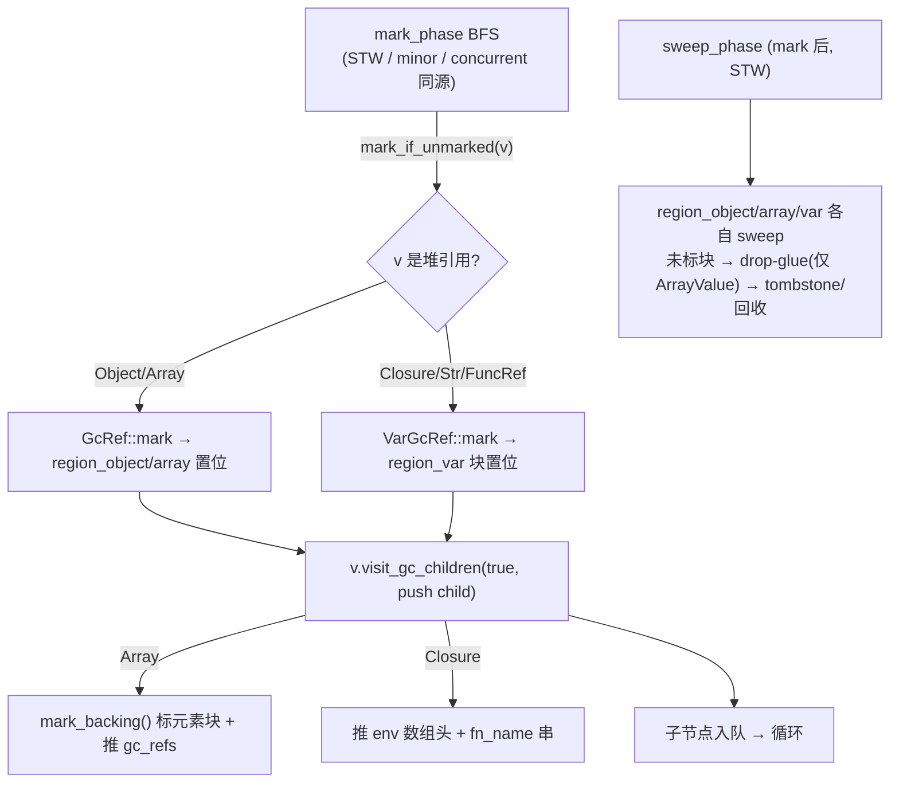

# z42 GC 子系统 —— MagrGC

> 抽取自 `vm-architecture.md` "GC 子系统"章（2026-05-22 split-gc-doc）。
> 文档体量已超过 vm-architecture.md 一半，独立成章方便阅读 + 后续 GC
> 专项迭代直接更新此文。vm-architecture.md 保留一段简介 + 跳转链接。


## 接口形状（嵌入式宿主友好版）

z42 VM 的 GC 抽象由 `crate::gc::MagrGC` trait 定义，全面对齐
[MMTk](https://www.mmtk.io/) `VMBinding` porting contract（OpenJDK / V8 / Julia /
Ruby / RustPython 的事实标准 GC 抽象）。trait 在单文件内按"能力组"组织
~30 个方法，未来如需切割成 sub-trait（参考 MMTk 的 `ObjectModel` /
`Scanning` / `Collection` / `ReferenceGlue` 拆分）切割面清晰。

| 能力组 | 主要方法 | 用途 |
|-------|---------|------|
| 1. Allocation | `alloc_object` / `alloc_array` | 脚本驱动堆分配 |
| 2. Roots | `pin_root` / `unpin_root` / `enter_frame` / `leave_frame` / `for_each_root` | host pin + frame scope + GC scan |
| 3. Write barriers | `write_barrier_field` / `write_barrier_array_elem` | Phase 2+ 用，默认 no-op |
| 4. Object Model | `object_size_bytes` / `scan_object_refs` | trace / snapshot 基础设施 |
| 5. Collection | `collect` / `collect_cycles` / `force_collect` / `pause` / `resume` | GC 控制 |
| 6. Heap config | `set_max_heap_bytes` / `used_bytes` | 堆上限 / 用量 |
| 7. Finalization | `register_finalizer` / `cancel_finalizer` | 析构回调（Phase 1 仅注册不触发）|
| 8. Weak refs | `make_weak` / `upgrade_weak` | 弱引用 |
| 9. Observers | `add_observer` / `remove_observer` | GcEvent 订阅（Before/After Collect / NearHeapLimit / OOM）|
| 10. Profiler | `set_alloc_sampler` / `take_snapshot` / `iterate_live_objects` | 分配采样 + 堆快照 + 存活遍历 |
| 11. Stats | `stats` | HeapStats 快照（7 字段）|

`VmContext` 持有 `Box<dyn MagrGC>`（与 `static_fields` / `lazy_loader` 同 ownership
模型）；所有脚本驱动分配走 `ctx.heap().alloc_*(...)`；JIT helper 通过
`vm_ctx_ref(ctx).heap().alloc_*(...)` 调用同一接口；嵌入 host 通过同一
`heap()` 入口访问 root / observer / profiler 等所有能力。

命名 **MagrGC** 取自《银河系漫游指南》中的 **Magrathea** —— 那颗专门建造
定制行星的传奇世界，与"管理对象生命周期"主题契合。

## Phase 1：RcMagrGC（已落地）

`crate::gc::RcMagrGC` 是 Phase 1 默认后端，**底层引用计数行为等价迁移前的直接
`Rc::new(RefCell::new(...))` 构造**，但 host-side 嵌入接口完整：

- `Value::Object` / `Value::Array` 形状不变
- `Rc::ptr_eq` 引用相等语义保留
- `RefCell` 运行时借用检查保留
- 内部状态由 `RefCell<RcHeapInner>` 持有：roots HashMap、frame_pins 栈、
  observer 列表、finalizer 表、alloc_sampler、pause counter、ID 生成器等
- `alloc_*` 通用通路 `record_alloc`：bump stats → 压力检查 → sampler 触发
- 事件分发：先 snapshot observer 列表再调用，避免回调重入引发 borrow 冲突

**已知限制（Phase 3a/3b/3c/3d/3d.1/3f/3e/3f-2/3-OOM 后）**：（无）

GC 子系统主功能至此完整。所有原始限制已解决，可投产。

## Safepoint 协议（add-gc-safepoint, 2026-05-20）

多线程引入（add-threading-stdlib）后，GC scanner 通过 `vm_contexts` 注册表
对每个 VmContext 走 raw `frame.regs` / `frame.env_arena` 指针扫 root —— 但 worker
线程同时在跑 interp 指令、改写 regs，构成 Rust 内存模型层 data race。Safepoint
协议引入 stop-the-world 屏障：

```
VmCore {
    gc_phase:     Mutex<GcPhase>,     // Idle / Requested / Marking
    gc_phase_cv:  Condvar,
    parked_count: AtomicUsize,        // mutator parked 数（不含 collector）
}

enum GcPhase { Idle, Requested, Marking }
```

**Mutator 侧**：interp dispatch loop 在三类位置调 `crate::gc::safepoint::check_safepoint(ctx)`：

| 位置 | 理由 |
|------|------|
| `exec_function` 入口 | 新 spawn 的 worker 在执行任何指令前先 yield 给未决 GC |
| 后向 branch（`Br` / `BrCond` target ≤ 当前 block_idx）| 循环回边 = 长流程的天然 yield 点 |
| `Call` / `CallIndirect` 返回后 | callee 跑完返回本帧时检查；长 callee 的 GC 请求被父帧捕获 |

fast path（Idle）：一次 Mutex lock + 一次 enum compare。slow path（Requested/Marking）：
`parked_count.fetch_add(1)` + `gc_phase_cv.notify_all()`（唤醒等阈值的 collector）+
`gc_phase_cv.wait()`（等回 Idle）+ `parked_count.fetch_sub(1)`。

**Collector 侧**：`crate::gc::safepoint::request_gc_pause(ctx) -> GcPauseGuard`
RAII guard：

1. 写 `gc_phase = Requested`
2. 循环等 `parked_count >= vm_contexts.len() - 1`（不含 collector 自身），重新读
   `vm_contexts.lock().len()` 每轮以容忍 mid-pause 注册的新 VmContext
3. 写 `gc_phase = Marking`
4. caller 跑 mark + sweep
5. Drop 时写 `gc_phase = Idle` + `notify_all()` 释放所有 mutator

**接入点**：`corelib/gc.rs` 的 `builtin_gc_collect` / `builtin_gc_force_collect`
（即 z42 `Std.GC.Collect()` / `ForceCollect()`）持 RAII guard 调
`heap.collect_cycles()` / `force_collect()`。

**v0 范围**（已记入 design.md Decisions）：

| 维度 | v0 行为 | 后续 spec |
|------|---------|----------|
| JIT-mode safepoint | ✅ 已落地（add-gc-safepoint-jit 2026-05-21）：JIT translate 在 function entry / backward Br / BrCond / `Call` / `CallIndirect` 返回后共 4 类 site（5 处 call）emit safepoint 检查，与 interp 协议完全对齐；JIT-mode multi-thread workloads 不再死锁。**inline-jit-safepoint-check（2026-08-01）**：fast path 从 `jit_check_safepoint` helper call 改为 `emit_safepoint_check` 内联的原生 `load+sub+store+brif`（~10ns→~1-2ns/site），仅 counter 归零走 `jit_check_safepoint_slow` helper | — |
| Auto-threshold (`maybe_auto_collect`) | ✅ Safepoint-aware（add-gc-safepoint-auto-threshold 2026-05-20）：trip 时 set `VmCore.needs_auto_collect: Arc<AtomicBool>` flag 而非 inline `collect_cycles()`；下个 `check_safepoint(ctx)` 用 `swap(false, AcqRel)` claim 后 safepoint-wrapped collect。trait 加默认 no-op `set_external_needs_collect_flag`；ArcMagrGC 内部 `Mutex<Option<Arc<AtomicBool>>>`，VmCore 构造后 wire。flag 未装时 fallback inline（GC 单测路径不变） | — |
| 检查频率节流 | ✅ Counter-throttled fast path（add-gc-safepoint-counter-throttling 2026-05-21）：`VmContext.safepoint_skip: AtomicU32`，`check_safepoint` fast path **普通 load/store 递减**（inline-jit-safepoint-check 2026-08-01 起，原为 `fetch_sub`；单写者故 RMW 原子性不必要，且 load/store 可被 JIT 内联为裸 mov）；每 N=1024 次（默认）才走 slow path（Mutex lock + 真正的 phase + auto-collect drain）。`Z42_SAFEPOINT_THROTTLE` env override（设 1 = disable throttling）。`VmContext::force_safepoint()` 公共 API 供 test / embedder 强制下次走 slow path。GC pause latency 上限 = N × 单 iter (~50ns) ≈ 50us，远小于实际 collect 时间 | — |
| 多 collector 仲裁 | ✅ 已落地（add-multi-collector-arbitration 2026-05-21）：`VmCore.collector_active: AtomicBool` + `request_gc_pause` 返 `Option<GcPauseGuard>`，前置 CAS claim；失败 collector 自动 park-as-mutator 返 `None`。`GcPauseGuard::drop` 释放 collector_active 让下一个 claim 通过。`Std.GC.Collect()` / `ForceCollect()` 在另一 collector active 时静默 no-op（best-effort 语义同 C# / Java）。4-worker auto_collect 测试 + 2-thread 显式 collect 仲裁测试都通过 | — |
| 并发 mark/sweep | 仍单线程；safepoint 是前置条件 | `add-concurrent-gc`（Phase A 性能轨道）|

多线程 workloads 推荐用显式 `Std.GC.Collect()` 触发；或将 `max_bytes` 配
足够大以避免 auto-collect 在 contended 路径触发。

> **2026-04-29 add-heap-registry（Phase 3b 完成）**：snapshot/iterate `Full` 覆盖。
>
> **2026-04-29 add-cycle-breaking-collector（Phase 3c 完成）**：环引用泄漏
> + `used_bytes` 单调递增两项限制解决 —— 初始实现走 Bacon-Rajan trial-deletion
> 算法：mark from pinned roots → `tentative[v] = strong_count - 1` 扣减集合
> 内部引用 → `tentative == 0` 清空内部 slots → alive_vec drop 时 Rc 链完成释放。
>
> **2026-05-21 add-mark-sweep-collector（A2 完成）**：trial-deletion 升级为
> 标准 mark-sweep（见下文 ["GC 后续迭代规划" A2 段](#a2-纯-mark-sweep已落地2026-05-21)）。
> O(N²) → O(reachable)；语义切到纯 tracing：Rust-local `Value` 强引用**不再
> 隐式作为 root**，embedder 必须 `pin_root` 显式标记保留对象。算法路径
> 仅 2 行（`mark_phase` + `sweep_phase`），断环逻辑沿用 `break_cycle_value`。
>
> **2026-04-29 add-finalizer-and-auto-collect（Phase 3d 完成）**：
> - **Finalizer 真触发**：`run_cycle_collection` 断环前从 finalizers map remove +
>   one-shot 调用回调（在 break_cycle_value 之后、alive_vec drop 之前 dispatch）
> - **内存压力自动 collect**：`alloc_object` / `alloc_array` 后调
>   `maybe_auto_collect` —— `used >= 90% max_bytes` 且距上次 auto-collect
>   增长 >= 10% limit 时自动触发 `collect_cycles`
> - **`near_limit_warned` 自动 reset**：collect 后若 `used` 已降到阈值以下
>   reset，让下次跨阈值能再发 `NearHeapLimit` 事件

### GC mode selection (add-concurrent-gc, 2026-05-22)

`ArcMagrGC` 现在支持运行时选择 GC 算法。Default 仍是 STW mark-sweep
（与 add-mark-sweep-collector 落地后行为完全一致）；ConcurrentMarkSweep
模式作为可选 opt-in 提供。

**切换方式：**

- **Env var**：进程启动前设 `Z42_GC_MODE=concurrent`（或 `=stw`，与
  不设等价）。无法识别的值回退到 stw 并 stderr 警告。
- **API**：运行期调 `heap.set_mode(GcMode::ConcurrentMarkSweep)`。下次
  `collect_cycles_with_context` 起生效；进行中的 collect 完成时仍按原
  模式（per spec scenario）。
- **生产入口**：`safepoint::check_safepoint_slow` 的 auto-collect 路径
  + `Std.GC.Collect()` builtin 都改走 `collect_cycles_with_context`，
  由 heap 内部按 mode 分发。

**当前可选模式：**

| Mode | 描述 | 何时用 |
|------|------|--------|
| `StwMarkSweep` (default) | 一次性停世界跑 mark + sweep | 单线程、对 throughput 敏感、所有 workload |
| `ConcurrentMarkSweep` | STW root 快照 → mutator 继续跑 + barrier shade → 终止 handshake STW → STW sweep | 多线程 + 对 pause time 敏感 |

**遇到 bug 的回退路径**：`Z42_GC_MODE=stw` 强制走默认稳定路径。生产报
错优先 fallback STW 看是否复现，把 bug 定位到 concurrent 路径还是更
底层（trait / barrier / safepoint）。

### Concurrent mark protocol (add-concurrent-gc P4, 2026-05-22)

ConcurrentMarkSweep 模式下 `collect_cycles_with_context` 跑 6 个阶段：

```text
1. request_gc_pause                    [STW]   collector_active=true, phase=Marking
   ↓
2. snapshot_roots_into_mark_queue       [STW]   pinned_roots + external_scanner → mark + enqueue
   ↓
3. yield_to_concurrent_marking          [STW]   phase=ConcurrentMarking, mutators wake
   ↓
4. drain_mark_queue (collector thread)  [concurrent]   BFS through gray queue;
                                                       mutators run; barriers push gray
   ↓
5. request_handshake_pause              [STW]   phase=Marking, wait for re-park
   ↓
6. drain_mark_queue (residual)          [STW]   catch barrier pushes during handshake race window
   ↓
7. sweep_phase                          [STW]   walk registry, free unmarked
   ↓
8. GcPauseGuard::drop                   [STW]   phase=Idle, collector_active=false, mutators resume
```

**Tricolor 不变量**：incremental update（Dijkstra）。Barrier override
（add-write-barriers 落地的 call site）只在 ConcurrentMarkSweep 模式下
shade：写入 heap-ref 时 `mark_if_unmarked(new)`，CAS 成功则 push 到
`mark_queue`。保证 "no black-to-white edge" —— 任何 mutator 写入的
new 都至少是 gray，最终被 collector traced。

**Termination invariant**：drain 当 queue 空。但 barrier 可能在 STW
handshake 触发**前的瞬间**push 新 gray —— 阶段 5/6 的 handshake →
residual drain 安全捕获。`request_handshake_pause` 等待 mutators
park（同 `request_gc_pause` 模式），park 后所有 mutator 已观察到 phase
= Marking，不会再写 → 此时 queue 空 = 真终止。

**为什么 Relaxed atomic 对 marked bit 仍然安全**：

- 每个 mark 操作是 CAS（atomic + idempotent）—— 多 thread race 时只有
  一个 transitions 0→1，其它返回 false 跳过 enqueue（不会重复 trace）
- BFS 是单调的（一个 cycle 内 mark bit 只从 0 → 1，永远不反向）
- 跨 thread 可见性通过 (a) `parking_lot::Mutex` on mark_queue 的
  Acquire/Release，(b) STW handshake 转换时 `gc_phase` Mutex 的
  Acquire/Release。这两个 sync point 足以建立 happens-before

未来 audit 若移除其中任一 sync point（比如改用 lock-free queue），
必须重新评估 Acquire/Release ordering。

**Phase 状态机**：

```text
STW path (mode = StwMarkSweep):
  Idle → Requested → Marking → Idle

Concurrent path (mode = ConcurrentMarkSweep):
  Idle → Requested → Marking (snapshot) → ConcurrentMarking (drain) →
  Marking (handshake + sweep) → Idle
```

`park_until_idle` 的等待条件从 `!Idle` 改为 `Requested | Marking`
—— ConcurrentMarking 不让 mutator park。

### Finalizer contract (add-custom-allocator, 2026-05-22)

Finalizer 触发时机随 backing 切换变化：

**当前契约（post-add-custom-allocator）**: finalizer **不**在 `GcRef`
出 scope 时触发（`GcRef::drop` 是 no-op，无 refcount）。两条触发路径：

1. **自动**：GC `sweep_phase` 找到 unreachable 对象 → take finalizer →
   触发 → tombstone slot。时机不可控（依赖下次 collect）。
2. **手动**：用户显式调 `Std.GC.Finalize(target)` → 立即 take + 触发
   finalizer → tombstone slot。匹配 .NET `IDisposable.Dispose()` /
   Java `AutoCloseable.close()` 语义。

**RAII 模式建议**：

- 资源类型（文件 handle / socket / FFI handle）暴露显式 `Close()` /
  `Dispose()` 方法；用户主动调用
- 不依赖 finalizer 做"scope exit 立即释放" —— 该模式在 z42 不成立
- finalizer 是 **safety net**（防泄漏），不是即时释放机制

**Strong reference 检测**（design D5）: 显式 `Std.GC.Finalize` 后，
其他 strong reference 之后 `borrow` 会 `debug_assert!` panic（generation
mismatch detection — debug build 立即报错；release build 由后续
generation 检查 enforce）。

**Pre-spec 历史契约**（archive reference）: Arc backing 下 `GcRef::drop`
触发 refcount 减 1；最后一个 ref drop 时 `GcAllocation::Drop` 自动触发
finalizer。这条契约已废弃；现有 stdlib `ProcessHandle.Drop(slotId)`
本来就是显式 dispose，已经匹配新契约。

### GC heap backing (add-custom-allocator, 2026-05-22)

`ArcMagrGC` 现在两个 region 持有所有堆引用对象：

- `region_object: Mutex<Region<ScriptObject>>` —— `Value::Object` 后端
- `region_array: Mutex<Region<Vec<Value>>>` —— `Value::Array` 后端

`Region<T>` 内部 `Vec<Box<[MaybeUninit<RegionEntry<T>>; 256]>>` chunked
storage —— chunks 是 `Box` 单位故 entry 地址在 chunk 生命周期内**绝对稳定**
（`GcRef::as_ptr` 身份哈希契约的物理基础）。Alloc 走 free-list pop 优先
（reuse tombstoned slot，preserve bumped generation）+ bump pointer。

`GcRef<T>` 是 12B 的 `NonNull<RegionEntry<T>>` + `u32 generation` handle：
- Clone = memcpy 12 字节，**零原子 op**（vs 之前 `Arc::clone` 每次
  `fetch_add` 2-4 ns）

#### extract-typedesc-from-mutex (2026-05-31)

`ScriptObject.type_desc` 和 `type_args` 是 write-once-at-alloc 字段
（`alloc_object` 写入 type_desc；`ObjNew` 写 type_args 都发生在 GcRef
escape 之前），运行时其余地方**不可变**。读取它们走的是 `GcRef<ScriptObject>`
上新增的 lockless accessor：

- `GcRef::type_desc(&self) -> &TypeDesc`
- `GcRef::type_desc_arc(&self) -> &Arc<TypeDesc>`（需要 clone Arc 时用）
- `GcRef::type_args(&self) -> &[String]`

实现原理是 `parking_lot::Mutex::data_ptr()` 暴露的 `*mut T`：跳过 `lock()`
直读 UnsafeCell 内部。Safety 锚定在 "type_desc / type_args 永不 mutate"
的全局 invariant（`grep -rn '.type_desc *=' src/runtime/` 0 命中验证）。

为什么值：每次 PIC / IsInstance / IcCall 都要读 type_id，Mutex lock 即使
uncontended 也是 ~5–10 ns 的 atomic CAS。lockless 后变成 3 条 native load。
对照 CoreCLR `MethodTable*` 在 `ObjHeader` 固定偏移 / HotSpot `klass*` 在
`oopDesc` 头部——属于业界成熟模式。

`borrow()` / `borrow_mut()` 路径不变：slots / native 仍 mutable，必须
走 Mutex。仅 type_desc / type_args 这两个 immutable 字段走 lockless。
- Drop = no-op（无 refcount）
- borrow / borrow_mut 走 `RegionEntry.value: Mutex<T>` 阻塞 lock
  （同 add-multithreading-foundation 并发模型）
- `ptr_eq` 比 NonNull + generation（stale-vs-fresh 区分）
- `as_ptr` 返回 entry 内 `Mutex<T>` 稳定地址

**WeakGcRef** 同 handle shape + generation snapshot。`upgrade` 检查
`alive && generation matches` —— ABA-safe：被 tombstone 后即使槽位
重用，generation 也 mismatch 不会假阳性 upgrade。

**Sweep 路径**：`sweep_phase` 直接 walk `region_object` + `region_array`
的 `iterate_alive`；找 unmarked `is_marked() == false` → 取 finalizer
（mutex take）→ 触发 finalizer → tombstone（alive=false, generation++,
push free_list）。`heap_registry: Vec<WeakRef>` 字段已删除 —— region
就是 authoritative liveness store。

**生命周期契约**：`GcRef` 不能 outlive 它所指 `Region` 所属的
`ArcMagrGC`。z42 现有架构所有 GcRef 都活在 VmContext 范围内，契约
天然满足。Embedder 需注意 drop order。

### 变长块堆：统一变长 payload 到单一 GC 堆 (unify-gc-heap, 2026-08)

定长 `Region<T>` 只能存**定长头**（`ScriptObject` / `ArrayObj`）；string 的字节、
closure 的 `ClosureData`、array 的元素后端原本各自在 GC **外**（手写 thin-Arc /
`Box` / 外部 `Vec`）——两套内存管理并存。**unify-gc-heap** 把这三类变长 payload
全部收进 GC，达成 CLR/JVM 式的**单一堆**（为将来移动/压缩/去重 GC 铺路）。

**分配器方向 = A'（变长块 region）**：新增第三个 region
`region_var: Mutex<VarRegion>`（[`gc/var_region.rs`](../../../src/runtime/src/gc/var_region.rs)），
与 `region_object` / `region_array` 并列、同一 mark/sweep cycle 回收。一个变长对象 =
**单块 `{GcBlockHeader, inline payload…}` 单次分配**（等价原 thin-Arc 的紧凑度，但纳入 GC）。

```
VarRegion 变长块（16B 对齐原始 chunk + 2 的幂 size-class free-list + oversized 专用块）
┌──────────────── GcBlockHeader (16B, repr(C,align8)) ────────────────┐┌── payload (8B 对齐) ──┐
│ generation │ size │ marked │ alive │ type_tag(BlockType) │ size_class ││  inline bytes / [T;n]  │
└─────────────────────────────────────────────────────────────────────┘└───────────────────────┘
   ▲ VarGcRef = type-erased 8B 标记指针（low48 地址 + high16 gen；wasm32 用 {ptr,gen}）
   payload 指针必须从原始 NonNull 派生（D8：绝不经窄 &GcBlockHeader reborrow → SB UB）
```

**BlockType 分派**（`var_drop_glue`，注入 region 让 `var_region.rs` 保持纯字节分配器）：

| BlockType | payload | 消费者 | drop-glue |
|-----------|---------|--------|-----------|
| `Str` | inline UTF-8 | `Value::Str` / `FuncRef`（8B 细指针，**不可变叶子**，trace 无出边）| POD，无 |
| `Closure` | 一个 `ClosureData{env: GcRef, fn_name: Str}` | `Value::Closure` | **POD，无**（PR-5：fn_name 迁 GC Str 后闭包全 POD）|
| `ArrayPrim` / `ArrayStruct` | 紧凑 `[T;n]`（packed 基元 / struct[] 字节区）| `ArrayObj` backing | POD，无 |
| `ArrayValue` | inline `[Value;n]`（Boxed 数组 / struct[] refs 侧表）| `ArrayObj` backing | **唯一需 finalizer**：drop 每个 `Value` |

**分配落地 = ambient 堆**（[`gc/ambient.rs`](../../../src/runtime/src/gc/ambient.rs)）：`current_heap()` +
`HeapGuard` 在 `exec_function`（interp 每帧）/ `jit::run_fn`（JIT 顶层）设 thread-local，
`Str::new`/`.into()` 走活堆分配 → **~189 处 `.into()` 站点零改动**；无堆上下文（无 VM 的单测）
回退 `alloc_leaked`。避免了「188 处线程穿透 `&heap`」的侵入式改造（D11）。

**驻留串 = lazy per-context interning**（D-lazy）：加载期无堆 → 不物化；首次 `ConstStr(idx)`
经 `VmContext::intern_const_str(module, idx)` 用活堆分配 + 缓存进 `interned_cache`
（`(module ptr, idx)` 键），缓存项经 external root scanner 注册为 **GC root**。

**mark/trace 统一到单一访问器**（PR-5）：`Value::visit_gc_children(for_marking, visit)` 是
mark 阶段与 heapsnapshot/retention 枚举的**单一来源**，二者仅在两条 mark 副作用轴上不同
（`mark_backing` 标变长元素块 + 闭包是否 surfaced env 头/fn_name），由 `for_marking` 参数统一；
`trace_children`（`for_marking=true`）/ `scan_object_refs`（`false`）退化为薄委托。



**safepoint = 几乎免费**（关键去风险，D-safepoint）：`maybe_auto_collect` 在 wired VmCore 下**只置
`needs_auto_collect` 标志、延到 `check_safepoint` 才 collect**（默认 `max_bytes=None` 全不
auto-collect）→ GC 从不在单条指令/builtin 的 Rust 执行中途运行 → 临时 string 落寄存器前天然安全
（frame regs 已被 root scanner 扫），与既有 Object/Array 临时值同一不变式。

**权衡（已由 User 裁决接受）**：纳入 GC 换掉 Arc/Box 的**确定性释放** → 浮动垃圾↑、内存峰值↑；
收益是**架构统一 + 为移动/压缩/去重 GC 铺路**，非短期性能。实测 string-heavy 吞吐反而 **1.76× 更快**
（消除原子 refcount：Clone=8B 拷贝、Drop=no-op），峰值 RSS +13%（默认不 auto-collect 累积）。
四个 PR（分配器原语 → closure → array backing → string）+ PR-5 收敛的完整原理见变更容器
[`docs/spec/changes/unify-gc-heap/design.md`](../../spec/changes/unify-gc-heap/design.md)。

### Write barrier contract (add-write-barriers, 2026-05-21)

`MagrGC` trait 包含两个 write-barrier 钩子：

```rust
fn write_barrier_field(&self, owner: &Value, slot: usize, new: &Value);
fn write_barrier_array_elem(&self, arr: &Value, idx: usize, new: &Value);
```

默认实现（含 `ArcMagrGC` STW mark-sweep）是 no-op；后续
`add-generational-gc` / `add-concurrent-gc` 落地时 override 为 card-marking /
SATB 真实逻辑。Phase 1 落地的是**call-site wiring + 调用契约**，运行时
行为零变化（trait override 为 no-op，仅 `#[cfg(test)]` 时 dispatch 到
test-only `BarrierObserver`）。

**Caller 契约**（interp `field_set` / `array_set`、JIT `jit_field_set` /
`jit_array_set`）:

1. **Filter at call site**: 只在 `new.is_heap_ref()` 时 invoke barrier。
   Primitive (`I64 / F64 / Bool / Char / Str / Null / FuncRef / PinnedView /
   StackClosure / Ref::Stack`) 写入 skip — 这些既不参与 cross-region 引用
   也不参与 cross-generation 引用，barrier dispatch 是纯浪费。`is_heap_ref()`
   是 `Value` 上 inherent 方法，与 `trace_children` 平行：一个判定，一个遍历。
2. **Post-write order**: barrier 在 slot/elem 写之后调用。card-marking
   自然 fit；若未来 A4 用 SATB 需要 pre-barrier（看 *旧* 值），扩 trait
   加 `write_barrier_field_pre(&owner, slot, old: &Value, new: &Value)`，
   不强迫所有 backend 都付 pre-barrier 代价。
3. **Lock released before call**: 调用前 `drop(borrowed)` 释放
   `owner.slots` / `arr` 的 inner-`Mutex` lock，让未来 override 可以
   re-borrow `owner` 而不死锁。
4. **IC fast path 也 dispatch**: FieldSet 的 inline cache 命中路径也必须
   走 barrier，否则未来 generational/concurrent 在 hot code 漏写 → mark
   queue 不完整 → UAF。这条规则在 `interp::field_set` /
   `jit_field_set` 内 inline 多个写入点都加了 dispatch；六个写入点对应六个
   `write_barrier_field` call（fast + slow + 无-IC，interp 和 JIT 各一套）。
5. **StaticSet 不 dispatch**: static fields 是 GC root，"old → new"
   写永远在 root，不存在 cross-region/cross-generation 关心的场景。

**Override 契约**:

- 实现可以 `debug_assert!(new.is_heap_ref())` 检测 caller 是否漏 filter
- 不能假设 `owner` 持有 inner-`Mutex` lock；可以自由 `owner.borrow()` /
  `owner.borrow_mut()`（caller 已 drop）
- Phase 1 default no-op 不修改 `HeapStats`；这条契约保留下来意味着
  pure-tracing / generational override 也不应改 `HeapStats`（stats 反映
  alloc/free，不反映 barrier dispatch 次数）

> **2026-04-29 extend-native-fn-signature（Phase 1.5 完成）**：原限制"corelib 直构未迁移"
> 已解决 —— `NativeFn` 签名扩展为 `fn(&VmContext, &[Value]) -> Result<Value>`，全部 ~55
> 个 builtin 走 ctx 传参；`__obj_get_type` / `__env_args` 走 `ctx.heap().alloc_*(...)`。
> 全代码库无任何 `Rc::new(RefCell::new(...))` 直构，仅 `gc/rc_heap.rs` 内部权威实现保留
> （即所有分配都通过 GC 接口的唯一物理收口点）。

> **2026-04-29 remove-dead-value-map**：原 Phase 1 限制 #3（`alloc_map()` 占位）
> 与 `Value::Map` variant 一并删除 —— 自从 2026-04-26 extern-audit-wave0 把
> `Std.Collections.Dictionary` 改为纯脚本类后，`Value::Map` 已无创建路径。`value_to_str`
> 同步改为 exhaustive match，编译期强制覆盖所有 Value variant。

### Debug invariants (add-gc-debug-invariants, 2026-05-22)

A1 / A2 / A3 / A4 共四个 GC 算法叠加后引入了大量数据结构 invariant
（young_list ⇔ gen_age 一致、free_list ⇔ alive=false、card_dirty 长度
与 chunks 一致、mark_queue 在 cycle 外为空、sweep 后无 stale mark
bit、entry.location 与实际位置吻合等）。这些 invariant 现在由 debug-
only 验证器在每次 collect 末尾检查；release 构建完全编译掉。

**两层 API**：

- [`Region<T>::validate(&self) -> Result<(), Violation>`](../../../src/runtime/src/gc/region.rs)
  —— per-region check，返回结构化 `Violation` 让 test 通过模式匹配确
  认期望的 invariant 被触发
- [`ArcMagrGC::debug_validate_invariants(&self)`](../../../src/runtime/src/gc/arc_heap.rs)
  —— panicking wrapper，由 collect 路径在 cycle 完成后调用；任何
  violation 立即 panic + 详细消息

**6 个 Region 级 Violation 变种**：

| Variant | 触发条件 | 来源 spec |
|---------|---------|-----------|
| `OldEntryInYoungList` | young_list 含 gen_age ≥ PROMOTION_THRESHOLD 的 entry | add-generational-gc |
| `YoungEntryNotInList` | alive young entry 未出现在 young_list | add-generational-gc |
| `DuplicateInYoungList` | young_list 同一 (ci, ei) 出现多次 | add-generational-gc |
| `AliveSlotInFreeList` | free_list 含 alive=true 的 slot | add-custom-allocator |
| `LocationMismatch` | `entry.location` 不等于实际 (ci, ei) | add-custom-allocator |
| `CardDirtyLengthMismatch` | `card_dirty.len() != chunks.len()` | add-generational-gc |

**2 个 heap 级检查**（panic-only，无 Violation enum）：

- mark_queue 必须在 cycle 外为空（concurrent mark drain 必须完整；
  非 concurrent mode 该 queue 从不写）
- 没有 alive entry 携带 marked=1（sweep 必须清 survivors 的 mark）

**触发时机**：

- `collect_cycles` 尾部（StwMarkSweep + GenerationalMarkSweep default）
- `collect_cycles_with_context` 的 ConcurrentMarkSweep 分支末（pause Drop 后）
- `collect_cycles_with_context` 的 GenerationalMarkSweep 分支末

每次都包在 `#[cfg(debug_assertions)]` 里 —— release 构建（cargo build
--release）整段编译消除，零 production overhead。debug 构建 + cargo
test 自动启用。

**怎么加新 invariant**：

1. 在 `Violation` enum 加新 variant + `Display` impl 分支
2. 在 `Region::validate` 加检查（first-violation-returned 模式）
3. 在 `region_tests.rs` 写 `validate_detects_xxx` test（故意 corrupt
   state → 断言匹配 variant）
4. 跑 `cargo test --lib gc::` —— 现有 4 个 GC 算法**不得违反**新
   invariant；若违反就是 latent bug，必须修

**测试方法**：

- Healthy path：构造典型 workload + 跑 collect + 隐式 invariant 检查
  通过（在 `arc_heap_tests/invariants.rs` 的 healthy tests）
- Corruption path：手动注入违反 state + `#[should_panic(expected = "...")]`
  验证 validator 抓到（同文件 corruption tests）

**cost 实测**：`cargo test --lib gc::` 时间在 invariant landing 前后
变化 < 5%（219 tests in ~0.01s）。Validate 是 O(N) per collect；典型
collect 时间 µs–ms 数量级，O(N) 检查不显著。

### Stress testing (add-gc-stress-test, 2026-05-22)

Random-workload stress driver on top of the C1 validator. Hand-rolled
xorshift64 PRNG（self-contained, no crate dep），每个 test 用固定 seed
+ 2000 iters 默认。每次 `force_collect` op 后 C1 invariant 自动验证。
失败的 panic message 嵌入 seed + iter index + op，便于复现。

**4 个 tests** (in `arc_heap_tests/stress.rs`):

| Test | Mode | Seed | 默认 iters |
|------|------|------|-----------|
| `stress_seeded_stw_short` | StwMarkSweep | 42 | 2000 |
| `stress_seeded_concurrent_short` | ConcurrentMarkSweep | 0x1234 | 2000 |
| `stress_seeded_generational_short` | GenerationalMarkSweep | 0xC0DE | 2000 |
| `stress_seeded_mode_switching_short` | 全部循环 | 0xBEEF | 3000 |

**9 op 类型** + weighted distribution：alloc_object / alloc_array
(~30%)、field/array writes (~25%，60% heap-ref → 触发 barrier)、
pin/unpin (~25%)、force_collect (~5%)、set_mode (~5% in
mode-switching test only).

**Bounded pool**：state.objects capped 200 entries 防 OOM；
ForceCollect 后用 `iterate_live_objects` 重建 state.objects（pre
mark-sweep contract: Rust-local Values 不是 roots → unpinned 在
collect 后失效；重建后续 ops 不触碰 stale handles）。

**Reproducible failure replay**：

```bash
# Replay specific seed
Z42_STRESS_SEED=12345 cargo test --lib stress_seeded_stw_short

# Longer local run (10x iters)
Z42_STRESS_ITERS=20000 cargo test --lib gc::arc_heap::arc_heap_tests::stress
```

**Coverage gates**：每个 test 完成后 assert min op counts (≥100 allocs,
≥100 writes, ≥50 pins, ≥50 collects)，防止 op weights drift 导致
silent regression。

**关键落地结果**：stress 第一次跑 catch 到一个**latent bug**
（add-concurrent-gc 的 no-VmContext `force_collect` 路径下，barrier
留下的 mark 状态破坏了 STW mark_phase 的 "clean slate" 假设 →
trace_children 漏 mark 子节点 → 子节点被 swept → 下次 collect 经过
slot 触发 use-after-finalize panic）。修复：`run_cycle_collection_stw`
入口 defensive 清 mark_queue + reset_all_marks_in_regions。
**Stress 的价值得到验证 —— 不是过度工程，而是真在 catch bugs。**

**cost 实测**：4 个 stress tests 总耗时 < 1s in debug (cargo test)。
2000 iters × O(几十次 collect with O(N) validator) × O(state ops) =
几十毫秒。可接受。

### Pause histogram (add-gc-pause-histogram, 2026-05-22)

每次 collect 测量的 `pause_us` 此前只对挂了 `GcObserver` 的 host
逐事件可见，没有"过去 10000 次 collect 的 p95 是多少 / concurrent
比 stw 是不是真的更短"这种聚合视角。`ArcMagrGC` 现在自维护一个
**固定 8 桶对数直方图** + min / max / total / count，每次
`collect_cycles` / `collect_cycles_with_context` (concurrent +
generational arms) / `force_collect` 末尾、`AfterCollect` event 前
调一次 `record(pause_us)`。

桶边界（半开区间 `[lower, upper)`，微秒）：

| i | 范围                       |
|---|----------------------------|
| 0 | `[0, 10) µs`               |
| 1 | `[10, 100) µs`             |
| 2 | `[100 µs, 1 ms)`           |
| 3 | `[1, 10) ms`               |
| 4 | `[10, 100) ms`             |
| 5 | `[100 ms, 1 s)`            |
| 6 | `[1, 10) s`                |
| 7 | `[10 s, ∞)` (catastrophic) |

**从 script 端读取**：

```z42
using Std;

long[] buckets = GC.PauseHistogram();      // 8 elements
long[] raw     = GC.PauseStatsRaw();       // [min, max, total, count]
long count     = raw[3];
if (count == 0) {
    // No collect recorded yet — min_us is u64::MAX sentinel; skip.
}
```

**对比不同 GcMode** —— 直方图跨 mode 切换累积（不重置）。Diff
模式间分布：

```z42
long[] before = GC.PauseHistogram();
GC.Collect();                              // warm up new mode
// ... 若干 collect ...
long[] after = GC.PauseHistogram();
// after[i] - before[i] 是新 mode 下该桶的新增 collect 计数
```

**O(1) record 成本**：bucket lookup 是 7 个比较的 unrolled loop，
加上一次 `Mutex<PauseHistogram>` lock + 4 saturating add。每次
collect 已经是 µs–ms 级别，多这 ~ns 级别 overhead 可忽略。Mutex
没替成 atomic — record 一次/collect 不在热路径，Mutex 简化保留。

**Empty sentinel**：`min_us = u64::MAX` when `count == 0`，区分
"没 collect 过" 与 "0 µs collect"（sub-µs collect round 到 0 是
valid）。Script 端 / 消费端先检 `count == 0` 再读 `min_us`。

**局限**（留给后续 perf spec）：

- 固定 8 桶：用户读 p50/p95/p99 时只能粗略到桶（"p95 落在
  [10, 100) ms"），不是精确分位数 — 精确化等 `add-gc-pause-tdigest`
- 单一直方图聚合所有 mode：要 per-mode 比较只能 diff before/after
  `set_mode`，等 `add-gc-pause-per-mode`
- Cumulative 不滚动：长跑 server 看不到 "最近 1000 次 collect"
  分布，等 `add-gc-pause-window`
- 无 SLA hook：不能 "pause > 100ms 时 log warning"，等
  `add-gc-pause-sla`

#### Rolling window (add-gc-pause-window, 2026-05-24)

补充上面"cumulative 不滚动"局限：`PauseHistogram` 现在也维护一个
**rolling FIFO window**（`VecDeque<u64>`，容量默认 1024，env
`Z42_GC_PAUSE_WINDOW` 覆盖 clamp 到 `[1, 65536]`）。每次
`record(pause_us)` 在 push_back 时若 deque 已满则先 pop_front
最老样本 → 总保留最近 N 次。

**从 script 端读取**：

```z42
using Std;

long cap = GC.PauseWindowCapacity();   // e.g. 1024
long[] recent = GC.RecentPauses();      // 最近 cap 次，oldest first
long mostRecent = recent[recent.Length - 1];
// → 自己算 p50/p95/p99 over window
```

**用途**：长跑 server 监控近期 pause 趋势 —
cumulative histogram 把"过去几周 30 万次 collect"全平摊，单一 spike
看不出来；rolling window 让你看清"最近 1000 次"分布。Script 端
diff `RecentPauses()` 与上次调用结果也能算 incremental
（"过去 1 分钟新增的 pause 都长啥样"）。

### Heap snapshot export (add-gc-heap-snapshot-export, 2026-05-24)

`Std.GC.WriteHeapSnapshot(path)` 把当前堆的对象引用图导出到 `path`
指定的文件，使用 V8 `.heapsnapshot` JSON 格式。Chrome DevTools
(Memory → Load)、[speedscope](https://www.speedscope.app)、
[heapviewer.com](https://heapviewer.com) 都能直接打开。

实现走 `gc/snapshot.rs` two-pass walker：

```
pass 1: iterate_live_objects → assign V8 node ids (odd 2k+1), emit NodeRecs
pass 2: for each node, scan_object_refs → emit Property / Element EdgeRecs
pass 3: for_each_root → emit Shortcut edges from synthetic root (id=0)
```

**节点 / 边类型映射**：

| z42 来源 | V8 节点 / 边类型 | name 字段 |
|----------|------------------|-----------|
| `Value::Object(gc)` | node `object` (3) | `TypeDesc.name` |
| `Value::Array(gc)` | node `array` (1) | `"Array[{len}]"` |
| pinned roots 集合 | node `synthetic` (9) | `"(GC roots)"` |
| object slot `i` → obj | edge `property` (2) | string of `fields[i].name` |
| array elem `i` → obj | edge `element` (1) | 数字下标 `i` |
| root → obj | edge `shortcut` (5) | empty string |

**从 script 端使用**：

```z42
using Std;

long bytes = GC.WriteHeapSnapshot("/tmp/snap.heapsnapshot");
// → bytes 是写入的 JSON 字节数
// → 文件用 Chrome DevTools Memory → Load 直接打开
```

**V8 JSON 形状**：nodes 是 flat `[type, name, id, self_size, edge_count,
trace_node_id, detachedness, ...]` 每 node 7 字段；edges 是 flat
`[type, name_or_index, to_node, ...]` 每 edge 3 字段；string-table
dedup；`trace_function_infos` / `trace_tree` / `samples` / `locations`
v1 输出空数组。10 MB heap → 约 30 MB snapshot 文件（V8 char-count
overhead 内）。

**序列化实现**（v1，2026-05-24 add-gc-snapshot-streaming）：

`builtin_gc_write_heap_snapshot` 通过 `serialize_v8_heapsnapshot_to<W:
Write>` 流式直写 `BufWriter<File>`，无中间 `String` 内存分配。
`serialize_v8_heapsnapshot(&snap) -> String` 作为薄包装（Vec<u8>
驱动流式路径）供测试和内存场景使用，输出字节完全相同。

**局限**（留给后续 perf spec）：

- 不输出 allocation-site stack trace（需要 IR `alloc_site_id` —
  `add-gc-snapshot-alloc-trace` 依赖 B4）
- ~~不 stream 大堆~~ ✅ 已流式化 (`add-gc-snapshot-streaming`)
- WeakRef 不出现在 graph（避免与 retention 混淆） —
  `add-gc-snapshot-weak-edges` 后续可加 `EdgeType::Weak`
- 不预算 dominator tree（DevTools 自己算） —
  `add-gc-snapshot-retainer-dominator` 可 server-side 加速

## Phase 路线（持续迭代）

| Phase | 内容 | 状态 |
|-------|------|------|
| **Phase 1** | trait MagrGC 接口 + RcMagrGC 实现 + 6 个脚本驱动 callsite 收口 | ✅ 2026-04-29 add-magrgc-heap-interface |
| **Phase 1 (扩展)** | trait 全面对齐 MMTk porting contract（10 能力组 ~30 方法）+ host-side 嵌入接口完整实现 | ✅ 2026-04-29 expand-magrgc-mmtk-interface |
| **Phase 1.5** | corelib `NativeFn` 签名扩展带 `&VmContext` + corelib 内剩余 Rc::new 迁移 | ✅ 2026-04-29 extend-native-fn-signature |
| **Phase 2** | （**跳过**）—— 直接进 Phase 3 mark-sweep，避免双重智能指针 churn | ⏭ 跳过 |
| **Phase 3a** | `GcRef<T>` / `WeakGcRef<T>` 不透明句柄抽象（backing 仍 `Rc<RefCell<T>>`，行为零变化）| ✅ 2026-04-29 introduce-gcref-handle |
| **Phase 2** | 环检测真实实现（dumpster 2.0 集成 / 自研 Bacon-Rajan 二选一） | 📋 待立项 |
| **Phase 3b** | Heap registry（`Vec<WeakRef>` 让 GC 枚举所有存活对象）+ snapshot/iterate Full coverage | ✅ 2026-04-29 add-heap-registry |
| **Phase 3c** | Trial-deletion 环回收器（保留 RC backing，断环让 Rc 链 Drop） | ✅ 2026-04-29 add-cycle-breaking-collector |
| **Phase 3d** | Finalizer 真触发（cycle collect 时调度）+ 内存压力自动 collect + near_limit_warned 自动 reset | ✅ 2026-04-29 add-finalizer-and-auto-collect |
| **Phase 3d.1** | External root scanner（VmContext static_fields / pending_exception 暴露给 cycle collector，修复漏扫 bug）| ✅ 2026-04-29 add-external-root-scanning |
| **Phase 3d.2** | 暴露 `Std.GC.Collect()` / `UsedBytes()` / `ForceCollect()` 给 z42 脚本 + 端到端 golden test 验证环回收 | ✅ 2026-04-29 expose-gc-to-scripts |
| **Phase 3f** | interp 栈扫描（`exec_function` FrameGuard RAII 把 frame.regs 暴露给 scanner，修复"outer 在 reg + outer.slot → inner" 间接可达对象被误清的 bug） | ✅ 2026-04-29 add-interp-stack-scanning |
| **Phase 3e** | `GcRef<T>` backing 升级 `Rc<GcAllocation<T>>`，wrapper Drop 自动触发已注册 finalizer（含纯 Rc Drop 路径，不仅限 cycle collect） | ✅ 2026-04-29 add-drop-time-finalizer |
| **Phase 3f-2** | JIT 栈扫描（6 个 JitFrame::new 站点 push/pop frame.regs 到 exec_stack，修复 JIT 路径 transitive bug）| ✅ 2026-04-29 add-jit-stack-scanning |
| **unify-frame-chain** | `exec_stack` / `env_arena_stack` / `call_stack` 三栈合并为单一 `Vec<VmFrame>`；任一 invoke 站点 push 全套 (regs/env_arena/name/file)，GC scanner 改单循环；附带修复 `jit_obj_new` ctor + `jit_to_str` ToString 缺 call_frame push 的 stack-trace 漏帧 bug | ✅ 2026-05-10 unify-frame-chain |
| **Phase 3-OOM** | strict OOM 模式（trait `set_strict_oom`；启用后 alloc 越过 `max_heap_bytes` 返回 `Value::Null` 不入 registry / 不 bump stats）| ✅ 2026-04-29 add-strict-oom-rejection |
| **A2 mark-sweep** | 移除 trial-deletion，切到标准 mark-sweep（`marked: AtomicU8` 字段 + `mark_phase` BFS + `sweep_phase`）；纯 tracing 语义，Rust-local 强引用不再隐式为 root | ✅ 2026-05-21 add-mark-sweep-collector |
| **Write barriers** | `MagrGC::write_barrier_field` / `write_barrier_array_elem` call-site wiring 完成；`Value::is_heap_ref()` 在 call site 过滤 primitive 写入；trait override 可由后续 generational / concurrent backend 接入；default no-op | ✅ 2026-05-22 add-write-barriers |
| **A4 concurrent mark** | 可选 `Z42_GC_MODE=concurrent` 切换 tricolor incremental update：STW root snapshot → ConcurrentMarking 阶段 mutator 不 park → barrier shade gray → STW 终止 handshake → STW sweep；STW 仍为默认 | ✅ 2026-05-22 add-concurrent-gc |
| **A1 custom allocator** | `GcRef<T>` 从 `Arc<GcAllocation<T>>` 切到 chunked region + NonNull handle。Clone 零原子 op；`heap_registry` 删除；finalizer at sweep + `Std.GC.Finalize(x)` 显式 API。Sweep survivors 2.49× faster；alloc 1.03-1.06× faster | ✅ 2026-05-22 add-custom-allocator |
| **A3 generational** | `GcMode::GenerationalMarkSweep` opt-in：RegionEntry gen_age + young_list + per-chunk card_dirty bitmap；write barrier 标记 old→young 跨代写；minor GC 扫 young + dirty cards (O(young) pause)；major GC 扫全堆 + 清 cards；survival rate >= 0.75 时 minor → major escalation。Bench: 1.40 ms minor vs 5.55 ms full STW on equivalent heap (**~4× minor speedup**) | ✅ 2026-05-22 add-generational-gc |
| **C1 debug invariants** | `Region<T>::validate(&self) -> Result<(), Violation>` + `ArcMagrGC::debug_validate_invariants()` panicking wrapper（cfg debug_assertions）。每次 collect 末尾运行，验证 8 项 invariant（young_list ⇔ gen_age、free_list ⇔ alive、entry.location、card_dirty 长度、mark_queue 空、no stale mark bit）。Release 构建零开销 | ✅ 2026-05-22 add-gc-debug-invariants |
| **C2 stress test** | Seeded xorshift64 random-workload driver + 4 tests (per-mode + mode-switching, ~2000 iters each)。Build on C1 validator。Discovered + fixed latent bug in concurrent's no-VmContext force_collect path (defensive reset_marks + mark_queue clear in run_cycle_collection_stw) | ✅ 2026-05-22 add-gc-stress-test |
| **B5 pause histogram** | 8-bucket logarithmic histogram on `pause_us`（µs–10s+）+ min/max/total/count。每次 collect 记录；`HeapStats.pause_histogram` 字段 + `Std.GC.PauseHistogram()` / `Std.GC.PauseStatsRaw()` builtins 暴露给 script。Single histogram per heap，跨 mode 切换累积 | ✅ 2026-05-22 add-gc-pause-histogram |
| **C3 multi-heap isolation stress** | 5 个测试在 `arc_heap_tests/multi_vm.rs`，跨 `ArcMagrGC` 实例并行 stress（线程间用独立 heap）。覆盖 STW / Generational / 混合 mode + pause histogram 隔离 cross-check (B5)。验证多 VM 嵌入场景 Phase 3 隔离设计成立 | ✅ 2026-05-24 add-gc-multi-vm-stress |
| **B3 heap snapshot export** | V8 `.heapsnapshot` JSON writer (`gc/snapshot.rs`)：two-pass walker (id assign + edge emit + root link) + flat custom serializer (no serde dep) + `Std.GC.WriteHeapSnapshot(path)` builtin。生成的文件直接用 Chrome DevTools / speedscope / heapviewer.com 加载查看 retainer 图 / dominator 树 | ✅ 2026-05-24 add-gc-heap-snapshot-export |
| **add-gc-pause-window** | PauseHistogram 加 `recent_pauses: VecDeque<u64>` rolling FIFO 窗口（默认 1024 容量，`Z42_GC_PAUSE_WINDOW` clamp 到 `[1, 65536]`）+ 2 个新 builtins `Std.GC.RecentPauses()` / `PauseWindowCapacity()`。补 B5 "cumulative 不滚动" 局限。`PauseHistogram` / `HeapStats` 同时 drop `Copy` derive（VecDeque 不 Copy）| ✅ 2026-05-24 add-gc-pause-window |
| **add-gc-snapshot-streaming** | `gc/snapshot.rs` 新增 `serialize_v8_heapsnapshot_to<W: Write>` 流式直写 + `escape_json_str_to<W: Write>`；`serialize_v8_heapsnapshot` 改为薄包装（byte-identical）；`builtin_gc_write_heap_snapshot` 改用 `BufWriter<File>` + `flush()`，消除中间 `String`。Pure perf，无行为变化 | ✅ 2026-05-24 add-gc-snapshot-streaming |
| **B1 OOM exception** | `Std.OutOfMemoryException` 新类型 + interp `obj_new`/`array_new`/`mk_clos` alloc 后 Null 检测 → throw OOM；double-OOM 防卫（disable strict 再 alloc exception 对象）；`GC.SetMaxHeapBytes` / `GC.SetStrictOOM` 两个新 builtin | ✅ 2026-05-25 add-gc-oom-exception |
| **B2 soft handles** | `SoftRegistry`（`gc/soft_registry.rs`）+ 压力阈值判定（`Z42_GC_SOFT_THRESHOLD` 默认 0.80）+ `__soft_handle_create` / `__soft_handle_get` builtins + `Std.SoftHandle` 类（z42.core）。原子值 Create → Get 始终 null | ✅ 2026-05-26 add-gc-softref |
| **unify-gc-heap（单一堆）** | 变长 payload（string / closure / array backing）全收进 GC 变长块 region（`gc/var_region.rs`，A' 分配器，见上「变长块堆」节）。PR-1 分配器原语 → PR-2 closure → PR-3 array backing → PR-4 string（ambient 堆 + lazy per-ctx interning）→ PR-5 收敛（fn_name 迁 GC Str 删 closure drop-glue + 合并 visit_gc_children + 删 interned_strings 死代码）。达成单一堆 payload 闭合，为移动/压缩 GC 铺路 | ✅ 2026-08 unify-gc-heap PR-1~5 |

至此 GC 主功能完整，可投产。后续可选迭代见下文 ["GC 后续迭代规划"](#gc-后续迭代规划) 段。

## 字符串脚本化的未来动机

> **进展（unify-gc-heap PR-4/5, 2026-08）**：string 的**字节存储**已纳入单一 GC 堆
> （`Value::Str(VarGcRef)`，`BlockType::Str` 变长块，见上「变长块堆」节）——迈出「字符串
> GC 化」的第一步。下面这个更远的目标（把 `string` 做成 `Value::Object` 包装的脚本类）尚未做，
> 但 string 已是 GC 对象，为之扫清了内存管理层的障碍。

当 Phase 2/3 GC 成熟（环检测 + 追踪），字符串可以从 `Value::Str` primitive 进一步
迁移成 `Value::Object(...)` 包装的脚本类（z42 源码实现 BCL `String`），
届时 z42 源码可承担更多 string 方法实现，进一步减少 Rust 端硬编码 builtin。
这与 2026-04-24 起的 simplify-string-stdlib / wave1-string-script 系列重构方向一致。

## 设计权衡：为什么不一次到位

- **Phase 1 范围严格限定为"接口收口、行为零变化"** —— commit 范围干净（纯重构），
  失败回滚成本低；环检测算法选型应在专门的 Phase 2 spec 中讨论（dumpster crate 依赖、
  STW vs 并发等独立决策点）
- **trait 形状一次设计完，让后续 phase 切换实现无需改 callsite** —— 6 处分配点
  已统一走 `ctx.heap()`，未来即使从 RcMagrGC 切到 MarkSweepHeap，调用方代码不变
- **`Value` enum 不动** —— Phase 3 引入 `GcRef<T>` 时再统一修改 PartialEq /
  JIT helper / 测试构造；Phase 1 不要把这些副带成本算进来

## GC 后续迭代规划

> 至 Phase 3-OOM 完成（2026-04-29）GC 主功能完整。下表是**可选优化轨道**，
> 按需启动独立 spec。每条提供 **What / Why / Deps / Size / Risk** 四元组，
> 让接手者不用读源码就能判断 ROI。

### A. 性能优化轨道

#### A1. 自定义堆 allocator（已落地，2026-05-22）
- **状态**：✅ 完成，spec `add-custom-allocator`
- **What**：`GcRef<T>` 从 `Arc<GcAllocation<T>>` 切到 `NonNull<RegionEntry<T>>` +
  generation handle。Backing 是 chunked region allocator（`Vec<Box<[E;256]>>`，
  chunks 永不 relocate 保 pointer stability）。
- **实现要点**：
  - `Region<T>` chunked allocator + bump pointer + free list（gc/region.rs，
    `add-custom-allocator P0`）
  - `GcRef<T>` 重写：NonNull + generation 12B handle；Clone 是 memcpy 零原子 op；
    Drop 是 no-op（add-custom-allocator P1）
  - `heap_registry: Vec<WeakRef>` 删除；region 是 authoritative liveness store；
    sweep / iterate / snapshot 都直接走 `Region::iterate_alive`
  - Finalizer 语义切换：Drop 不再触发，sweep 时触发 + `Std.GC.Finalize(x)`
    显式 API 给 RAII 场景立即释放（add-custom-allocator P2）
  - WeakRef 用 generation tombstone 替代 `std::Weak<Arc<...>>` —— ABA-safe
- **生命周期契约**：`GcRef` 不能 outlive 它所指 `Region` 所属的 `ArcMagrGC`。
  z42 现有架构所有 GcRef 都活在 VmContext 范围内，契约天然满足；embedder 需注意
- **Benchmark 实测**（macOS arm64 release，10k objects）:
  - alloc throughput: 1.03-1.06× faster（Arc init 节省，但 record_alloc bookkeeping 仍占大头）
  - sweep survivors: **2.49× faster**（去除 per-entry Weak::upgrade）
  - sweep garbage: 3.50× slower（**work 时序重分布**：Arc 路径在 Drop 时分散付费，
    region 路径集中在 sweep 付费；total CPU 大致相同）
  - GcRef::clone: 架构上去除原子 op（hot-path bench 待 follow-up perf spec）
- **A3 / D1 解锁**：Region<T> 是 generational promotion 物理前提；API shape 已对齐
  MMTk `Mutator::alloc` binding 契约

#### A2. 纯 Mark-Sweep（已落地，2026-05-21）
- **状态**：✅ 完成，spec `add-mark-sweep-collector`
- **What**：从 trial-deletion（mark + tentative count + 断环）升到标准 mark-sweep
  （BFS 标记 reachable → 扫描 registry 反向断不可达对象）
- **实现要点**：
  - `GcAllocation<T>` 新增 `marked: AtomicU8`（Relaxed ordering 足够，STW
    safepoint 已建立 happens-before）
  - `mark_phase()`：BFS from `pinned_roots` + `external_root_scanner`，
    `Value::trace_children` 提供子引用枚举
  - `sweep_phase()`：snapshot live → `is_marked = true` reset mark，
    `is_marked = false` 调 `break_cycle_value` 清内部引用；Vec drop 时 Arc
    链式 Drop 触发 finalizer
  - 算法路径仅 `run_cycle_collection` 2 行（mark + sweep）
- **语义切换**：trial-deletion 之前默认按 `Arc::strong_count` 把"外部用户强引用"
  当作隐式 root；mark-sweep 走**纯 tracing**——Rust-local `Value` 不再保护
  对象，embedder 必须 `pin_root` 显式表达保留意图。VmContext 已通过
  `external_root_scanner` 暴露所有 mutator-visible 根，stdlib/JIT 路径无回归
- **未实现**：Trace trait 一次性 derive（沿用 `Value::trace_children` 内联
  match），自定义 allocator 仍未做（A1 仍 backlog）；后续 benchmark 报告独立 spec

#### A3. Generational GC（已落地，2026-05-22）
- **状态**：✅ 完成，spec `add-generational-gc`
- **What**：`GcMode::GenerationalMarkSweep` opt-in mode；RegionEntry gen_age
  + Region young_list + per-chunk card_dirty bitmap；minor GC 扫 young +
  dirty cards (O(young) pause)；major GC 扫全堆 + 清 cards；survival rate
  >= 0.75 (Z42_GC_MINOR_THRESHOLD) 时 minor → major escalation。
- **实现要点**：
  - Logical promotion (gen_age 字段，不物理移动)：保 GcRef NonNull 契约
  - Promotion threshold N=2 (industry default Java tenure)，配
    `Z42_GC_TENURE` 调
  - Card marking 粒度 per-chunk (256 entries / card)；u32 bitmap per chunk
  - Write barrier override 检查 `owner.gen_age >= threshold && new.gen_age == 0`
    时 `mark_card_dirty(owner.chunk)`
  - Minor mark phase：BFS from pinned + external + dirty cards；trace
    children but enqueue young only (老 children 通过 dirty card 重 root)
  - Card_dirty 不在 minor 清；只在 major 清（preserve stable old→young refs）
- **Bench**: 1.40 ms minor vs 5.55 ms full STW on 10k pinned old + 1k young
  workload — **~4× minor speedup**
- **Mutually exclusive with concurrent mark v1**: combine in future
  `add-concurrent-generational` spec

#### A4. Concurrent / incremental collector
- **What**：collect 工作分摊到多个 alloc 时间片（incremental）或后台线程（concurrent）
- **Why**：当前 STW collect 在大堆下停顿明显；分摊后单次 pause 时间有界
- **Deps**：A2（mark-sweep，✅ 已就位）+ 多线程模型（roadmap A6 backlog）
- **Size**：3000+ LOC，20-30 天
- **Risk**：数据竞争 + write barrier 复杂度高；需要 GC safepoint 协议

### B. 嵌入式 / 可观察性

#### B1. OOM 异常抛出（替代 strict 模式返 Null）（已落地，2026-05-25）
- **状态**：✅ 完成，spec `add-gc-oom-exception`
- **What**：alloc 失败抛 `Std.OutOfMemoryException`（脚本 `try/catch` 可捕获），替代 strict 模式返 `Value::Null`
- **Why**：脚本端 OOM 处理更自然；当前返 Null 后续访问产生 NRE，丢失"why null"信息
- **实现要点**：
  - 新增 `Std.OutOfMemoryException`（`z42.core/src/Exceptions/OutOfMemoryException.z42`）
  - `exec_object.rs`：`obj_new` alloc 后 Null 检测 → `ctx.make_stdlib_exception("OutOfMemoryException", ...)`
  - `exec_array.rs`：`array_new` / `array_new_lit` 同样 OOM 检测
  - `exec_call.rs`：`mk_clos` env alloc OOM 检测；double-OOM 防卫（disable strict 再 alloc exception 对象）
  - `GC.SetMaxHeapBytes(n)` / `GC.SetStrictOOM(b)` 两个新 builtin 暴露给脚本
- **延后**：JIT 路径 `jit_obj_new` / `jit_array_new` 暂不注入 OOM 检测；详见下文 Deferred 段

#### B2. 软引用（SoftHandle）
- **状态**：✅ 完成，spec `add-gc-softref`（2026-05-26）
- **What**：内存压力下 GC 可主动回收的引用，介于 strong 与 weak 之间
- **Why**：缓存场景（"内存够则保留，紧张则丢弃"）现在只能手动 weak + 重建
- **实现要点**：
  - `SoftRegistry`（`gc/soft_registry.rs`）：`Vec<SoftEntry { id: u64, target: Option<GcRef<Object>> }>`；`clear_entries` 在 sweep 压力路径批量置 `None`
  - 压力判定：`used_bytes >= (soft_threshold * max_heap_bytes) as u64`，`Z42_GC_SOFT_THRESHOLD` 环境变量控制阈值（默认 0.80）；`max_heap_bytes == 0`（无限）时软引用永不清除
  - 2 个新 builtin：`__soft_handle_create(target: object) -> SoftHandle`；`__soft_handle_get(self) -> object`
  - `Std.SoftHandle` 类（`z42.core/GC/SoftHandle.z42`）暴露给 z42 脚本
  - 原子值（int / string / bool）无法被软引用；`Create(atomicVal)` 返回 `Get()` 始终 null 的句柄
- **延后**：泛型 `SoftRef<T>`（待 L2 泛型落地）—— 详见 [Deferred 段](#softref-generic-upgrade)

#### B3. Heap snapshot 导出（已落地，2026-05-24）
- **状态**：✅ 完成，spec `add-gc-heap-snapshot-export`
- **What**：新 `GraphSnapshot` 类型 + V8 `.heapsnapshot` JSON 序列化器
  in `gc/snapshot.rs`；1 个新 builtin `Std.GC.WriteHeapSnapshot(path)`
  返回写入字节数。文件直接用 Chrome DevTools (Memory → Load) /
  [speedscope](https://www.speedscope.app) /
  [heapviewer.com](https://heapviewer.com) 加载查看 retainer 图
- **实现要点**：
  - Two-pass walker：pass 1 `iterate_live_objects` 给每个 alive
    `Value::Object`/`Value::Array` assign 奇数 V8 node id +
    emit NodeRec；pass 2 走 `scan_object_refs` emit Property
    (object slot, name = field 名) / Element (array elem, name =
    数字 index) 边；pass 3 走 `for_each_root` 从合成 root (id=0)
    emit Shortcut 边
  - 自写 flat JSON serializer (no serde dep)：node 7 字段 / edge
    3 字段 / string-table dedup
  - Cycle 安全（id_map dedup by pointer）；weak refs 跳过
- **延后**：alloc-site stack trace (需要 B4 site id)、weak edges、
  server-side dominator tree — 详见
  ["Heap snapshot export"](#heap-snapshot-export-add-gc-heap-snapshot-export-2026-05-24) 段
  - ~~streaming serializer~~ ✅ 已落地 `add-gc-snapshot-streaming`

#### B4. 分配站点追踪（per-callsite alloc count + total bytes）
- **What**：默认 alloc_sampler 实现按 IR 站点 ID 聚合分配数据
- **Why**：定位"哪行代码在 hot allocate"，性能调优刚需
- **Deps**：编译期注入 site ID（IR 加 `alloc_site_id` 字段 + Codegen 配合）
- **Size**：~400 LOC，3-4 天
- **Risk**：site ID 在 IR 持久化、跨 zpkg 唯一性

#### B5. GC pause 直方图（已落地，2026-05-22）
- **状态**：✅ 完成，spec `add-gc-pause-histogram`
- **What**：固定 8 桶对数直方图（边界 `[10, 100, 1K, 10K, 100K,
  1M, 10M]` µs，覆盖 µs–10s+）+ min/max/total/count summary。
  每次 collect 末尾 `record(pause_us)`；through `HeapStats` +
  `Std.GC.PauseHistogram()` / `Std.GC.PauseStatsRaw()` 暴露给 script
- **实现要点**：
  - `PauseHistogram` 类型在 `gc/types.rs`；`min_us = u64::MAX`
    sentinel 标 "empty"，caller 检 `count == 0` 再读
  - `ArcMagrGC.pause_histogram: Mutex<PauseHistogram>` 单 instance
    （per-heap，不 per-mode）；record 在每个 collect 路径
    AfterCollect 事件前调用
  - 2 个新 z42 builtins (`__gc_pause_histogram`,
    `__gc_pause_stats_raw`) 直返 `long[8]` / `long[4]`，不引入新
    TypeDesc — 简洁优先于结构化字段
  - 直方图跨 mode 切换累积（不重置）；script 端 diff
    before/after `set_mode` 拿 per-mode 分布
- **延后**：t-digest 精确分位数、per-mode 直方图分裂、SLA hook —
  详见 ["Pause histogram"](#pause-histogram-add-gc-pause-histogram-2026-05-22) 段
- **后续延伸已落地**：
  - **add-gc-pause-window** (2026-05-24) ✅ — rolling FIFO 窗口补
    "cumulative 不滚动" 局限。详见
    ["Rolling window"](#rolling-window-add-gc-pause-window-2026-05-24) 段

### C. 测试 / 调试质量

#### C1. Debug-only invariant 检查（已落地，2026-05-22）
- **状态**：✅ 完成，spec `add-gc-debug-invariants`
- **What**：debug build 下每次 collect 后 `Region<T>::validate` +
  `ArcMagrGC::debug_validate_invariants` 跑 8 项 invariant 检查；
  release build 整段编译消除
- **实现要点**：
  - 8 项 invariant：young_list ⇔ gen_age 一致 (3 variants) +
    free_list ⇔ alive=false + entry.location 自一致 + card_dirty
    长度 + mark_queue 空 + no stale mark bit
  - 两层 API：`Region::validate() -> Result<(), Violation>` (test
    友好) + `ArcMagrGC::debug_validate_invariants` (panic wrapper)
  - 集成于 `collect_cycles` + `collect_cycles_with_context` 的
    所有 mode 分支末尾
- **关键落地结果**：现有 4 个 GC 算法（A1/A2/A3/A4）零 invariant
  违反 — 验证算法本身实现正确。详见
  ["Debug invariants"](#debug-invariants-add-gc-debug-invariants-2026-05-22) 段

#### C2. Stress test (已落地, 2026-05-22)
- **状态**：✅ 完成, spec `add-gc-stress-test`
- **What**：seeded random-workload driver + 4 tests (per-mode +
  mode-switching, ~2000 iters each)。Build on C1 validator。
  Hand-rolled xorshift64 PRNG (no proptest dep). Reproducible failure
  replay via `Z42_STRESS_SEED` env.
- **实现要点**：
  - 9 op 类型 + weighted distribution (~30% alloc, ~25% writes
    triggering barriers, ~25% pin/unpin, ~5% collect)
  - Bounded live-objects pool (200 entries) prevents OOM
  - State pruning: ForceCollect rebuilds state.objects from
    iterate_live_objects (Rust-local Values aren't roots)
  - Coverage gates assert min op counts to prevent silent
    weight-drift regressions
- **关键落地结果**：第一次跑 caught latent bug in concurrent's
  no-VmContext force_collect path; defensive `reset_marks_in_regions`
  + `mark_queue.clear()` at STW dispatch start。详见
  ["Stress testing"](#stress-testing-add-gc-stress-test-2026-05-22) 段

#### C3. Multi-heap 隔离压测（已落地，2026-05-24）
- **状态**：✅ 完成，spec `add-gc-multi-vm-stress`
- **What**：5 个测试在 `arc_heap_tests/multi_vm.rs`，验证多个
  `ArcMagrGC` 实例 in-process 完全隔离。`ArcMagrGC` 已是
  `Send + Sync` (`send_sync.rs`)，测试直接 `thread::spawn` 一组
  heap 跑独立 workload。
- **覆盖**：
  - 两 heap 基础互不感染（allocations / gc_cycles / used_bytes /
    pause_histogram 全独立）
  - 4 线程 STW 模式 concurrent stress（每 heap 独立 100 allocs +
    多次 force_collect）
  - 3 线程 Generational 模式（young_list / card_dirty / promote 状态
    per-heap）
  - 3 线程混用 StwMarkSweep / ConcurrentMarkSweep /
    GenerationalMarkSweep — 验证 `mode` AtomicU8 per-instance
  - Pause histogram 跨 heap 隔离（B5 cross-check）
- **关键落地结果**：5 tests 全绿，无跨 heap 状态串扰。Phase 3 多实例
  隔离设计验证成立 — heap 是 per-VmCore 资源，statics/thread-locals
  没有意外串到 GC 状态层。Debug build 下 C1 validator 在每次 collect
  末尾跑，跨线程也 OK

### D. 终极方向：MMTk 集成

#### D1. MMTk 后端实现
- **What**：实现 [MMTk](https://www.mmtk.io/) `VMBinding` trait，把 RcMagrGC 替换为 MMTk-backed GC（多 collector 可选：SemiSpace / GenImmix / MarkSweep / Immix / GenCopy）
- **Why**：MMTk 是工业级研究项目，被 OpenJDK / V8 / Julia / Ruby / RustPython 采用；享受 ~30 年 GC 算法成果
- **Deps**：A1（自定义 allocator）；A2 mark-sweep 已落地（提供 tracing 基础）；trait 形状已对齐 MMTk porting contract
- **Size**：4-8 周（包括稳定 + benchmark）
- **Risk**：高 —— 引入大型 crate 依赖；ABI 边界 careful；但 trait 抽象层可以 ABI-shield

### 优先级建议

如以工程成熟度优先：

1. ~~**C1 + C2 + C3**（debug invariants + stress + multi-VM 隔离）~~ ✅ 全部已落地（2026-05-22 / 2026-05-24）—— 工程质量基线已铺满
2. ~~**B1**（OOM exception）~~ ✅ 已落地（2026-05-25）—— 嵌入用户 OOM ergonomics
3. ~~**B5**（pause 直方图）~~ ✅ 已落地（2026-05-22）—— 低成本可观察性
4. ~~**B3**（heap snapshot 导出）~~ ✅ 已落地（2026-05-24）—— 让现有工具链可用

如以性能为优先：

1. **A1**（自定义 allocator）—— 单刀直入的常数因子优化
2. ~~**A2**（mark-sweep）~~ ✅ 已落地（2026-05-21）
3. **B4**（alloc site tracking）—— 找出热点
4. **A3 / A4**（generational / concurrent）—— 长期投资（A2 已就位，可基于
   mark-sweep 进阶）

如以"赶上工业级"为优先：

直接跳到 **D1**（MMTk 集成），跳过 A1-A4 自研路径。trait 形状已对齐
MMTk porting contract，集成成本主要在 ABI shim + 调优。

---

## Deferred / Future Work

### softref-generic-upgrade: 泛型 `SoftRef<T>` 升级

- **来源**：add-gc-softref 实施期，2026-05-26
- **触发原因**：L1 无泛型；当前 `SoftHandle.Get()` 返回 `object`，调用方需手动向下转型
- **前置依赖**：L2 泛型落地（`SoftRef<T>` 才能类型安全地返回 `T?`）
- **触发条件**：L2 泛型稳定后
- **当前 workaround**：`SoftHandle.Get()` 返回 `object`，调用方 `as T` 向下转型

### gc-oom-jit-path: JIT 路径 OOM 检测

- **来源**：add-gc-oom-exception 实施期，2026-05-25
- **触发原因**：JIT helper `jit_obj_new` / `jit_array_new` 直接调用 `heap.alloc_object` / `heap.alloc_array`，未经 interp OOM 检测分支；JIT 路径下 OOM 目前仍返回 `Value::Null` 触发 NRE
- **前置依赖**：JIT 路径稳定后；需要 JIT helper 能安全调用 `ctx.set_exception`（当前 JIT 生成代码不访问 `VmContext` exception slot）
- **触发条件**：JIT 路径全面覆盖时，或首次报告 JIT 路径 OOM-related NRE 时
- **当前 workaround**：`strict_oom` 模式下 JIT 路径 alloc 失败仍抛 `Value::Null`；interp 路径已完整处理
