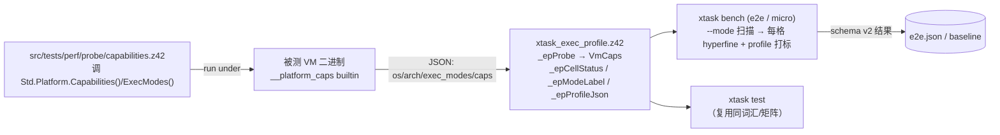

# 执行画像矩阵（exec-profile matrix）

> 对齐：2026-07-31（add-exec-profile-matrix）。
> 统一 test / bench 描述「一次运行在什么执行画像下」的共享词汇 + 支持矩阵。
> 实现：`scripts/common/xtask_exec_profile.z42`（共享模块）、`src/runtime/src/corelib/platform.rs`
> + `src/libraries/z42.core/src/Platform.z42`（能力查询）、`src/tests/perf/probe/capabilities.z42`（探针）、
> `src/tests/perf/baseline-schema.json`（schema v2）。

## 1. 动机

z42 VM 有多个执行模式（interp / jit，未来 aot）、多平台（desktop × {x64,arm64}、wasm、ios、
android）、多能力（jit / native-interop / threads …）。**测试侧**早已把「模式」做成一等维度
（`test e2e --mode interp|jit`），但**基准侧**长期只测 VM 默认模式——有 JIT 却从不量化「JIT 比
interp 快多少」，且 baseline 无从分辨自己是在哪种模式/平台/能力下测的，跨环境数字会悄悄互比。

本设计把三根轴收敛成**一个描述符 + 一张支持矩阵**，test 与 bench 都消费它。

## 2. 三根轴

### 2.1 mode —— 执行组合，不是标量

`mode = { tiers: [...], aot_pkgs: [...] }`：

- `tiers`：本次运行活跃的后端集。`interp` 恒在（兜底），可 `+jit`。
- `aot_pkgs`：被预编到 AOT 的 zpkg 逻辑名子集。

对齐 [AOT 设计 D2/D8](../runtime/aot.md)：AOT 是**按 zpkg 为单位、可部分**的（随包静态 zpkg 走
AOT，动态加载的走 interp/jit），与 JIT/interp 共存（.NET R2R + Tiered-JIT / Android ART 模型）。
因此「full AOT」在 JIT 平台上根本不是常态——**混合才是常态**。

于是 interp / jit / 部分AOT / 全AOT / 「混合执行」全是**同一形状的不同取值**，无特例分支：

| 场景 | tiers | aot_pkgs |
|------|-------|----------|
| 纯 interp | `[interp]` | `[]` |
| 纯 jit | `[interp,jit]` | `[]` |
| 部分 AOT（desktop） | `[interp,jit]` | `[z42.core]` |
| iOS 全随包 AOT | `[interp]` | `[z42.core, app]` |

**「混合执行」就此消解**：它不是第 4 个枚举，而是 `aot_pkgs≠[]` 或 `|tiers|>1` 的一般情形。

`mode_label`（可读 + diff 键）：`interp` / `jit` / （未来）`jit+aot[z42.core,z42.math]`
（`aot_pkgs` 排序后拼接，稳定）。

> **本 change 只建模，不实现 AOT**：今天 harness 恒发 `aot_pkgs:[]`；`aot_pkgs≠[]` 的任何组合
> `cellStatus` 返 `skipped-not-yet`。AOT 执行 + 其 per-zpkg 配置面（z42.toml / CLI）归 roadmap M9；
> 届时把 skipped 列翻 runnable + 加配置解析即可，schema `{tiers,aot_pkgs}` 结构不动。

### 2.2 platform —— `{os, arch}`

`os` 取 `Std.Platform.OS()`（linux/macos/windows/wasm/ios/android）；`arch` 归一化为
`x64`/`arm64`/`wasm`（`Std.ArchKind` 风格）。结构化利于 diff 按轴分组。

### 2.3 caps —— 由运行时返回的属性

`caps` **不静态推断**，而是 `Std.Platform.Capabilities()` 在**被测 VM 二进制**下返回的真实能力
（`jit` / `native-interop` / `bundled-compression` / `threads`）。`Std.Platform.ExecModes()` 报
可派发后端（`interp`[`,jit`][`,aot`]）。二者由 builtin `__platform_caps` / `__platform_exec_modes`
背书（`corelib/platform.rs`，读 `cfg!(feature=…)` + `cfg!(not(wasm32))` 补 threads）。

> **caps ⟂ mode 正交**：caps 回答「这个二进制**能**做哪些后端」；mode 回答「这次**用了**什么」。
> 一个 desktop 二进制 caps 恒含 jit，但某次 run 的 mode 可以是纯 interp。

## 3. 支持矩阵（cellStatus）

`cellStatus(tiers, aot_pkgs, vmExecModes)` → 三值：

- `skipped-not-yet`：`aot_pkgs≠[]` 或 `tiers` 含 `aot`（策略覆盖层——AOT 执行是 stub，M9），
  **不论平台、不论 aot feature 是否编入**。
- `never`：`tiers` 含 `jit` 但被测 VM 的 `exec_modes` 无 jit（如 wasm/mobile interp-only 构建）
  ——这个二进制物理上跑不了。
- `runnable`：其余（VM 支持的 interp / jit 组合），今天可跑并记结果。

**运行时实况（exec_modes/caps）是地面真值；静态矩阵只做策略覆盖**（唯一例外是 aot 即便编入仍是
stub）。非 runnable 格子由 harness **显式打印跳过原因**，绝不静默丢（common-pitfalls：不静默截断）。

## 4. 数据流

harness 对**要测量的那个 VM 二进制**跑一次探针，缓存 `VmCaps`，据此判 cellStatus（跳非 runnable）
并给每条结果打 `profile`。

## 5. schema v2

`src/tests/perf/baseline-schema.json`（`schema_version:2`）：顶层去 `os` 串、加 `z42vm_version`；每条
benchmark 必带 `profile{ mode{tiers,aot_pkgs}, mode_label, platform{os,arch}, caps }`。删除 C#
时代残留（`csharp-throughput` tier、`dotnet_version`）。`--diff` 按
`(name, metric, mode_label@os/arch)` 匹配——interp-vs-jit / 跨平台**绝不互比**。

**jit/interp 加速比**（add-bench-speedup-cap-gating）：`--diff` 尾部对同一 `(name, metric,
platform)` 下同时有 interp 与 jit 结果的场景，派生打印 `Speedup (interp/jit, >1 = jit faster)`
一节（`interp.value / jit.value`）。派生展示，不入 schema、非回归信号。

**场景能力门控**（add-bench-speedup-cap-gating）：场景可在源码顶部注释 `// requires-caps: <csv>`
声明所需能力（`_epScenarioRequiredCaps` 解析）。e2e `_bench` 探到被测 VM caps 后，
`_epCapsMissing(required, vmCaps.caps)` 非空 → **显式跳过该场景**（不静默、不崩）——让无线程 VM
（wasm/mobile）安全略过 `06_thread_scaling` 等能力相关场景，为平台 bench 铺垫。

## 6. Deferred

- **AOT 组合格子的执行 + 配置**（`aot_pkgs≠[]`）：矩阵已能表示 + 占位 `skipped-not-yet`；执行
  （`aot.rs`）+ per-zpkg 配置面归 M9。见 [roadmap Deferred](../../roadmap.md) `exec-profile-matrix-future-aot-composition-cells`。
- **平台 bench 实现**（wasm/ios/android 下跑基准）：profile 机制已平台就绪（探针在任意平台 VM 下
  报真实 caps），但**各平台 bench harness 编排未接**（大面、需各平台重型工具链验证、且为
  informational 非门禁）。见 `exec-profile-matrix-future-platform-bench`。
