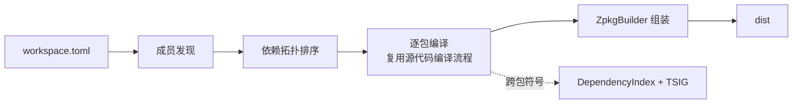

# 工程模型、依赖解析与工作区编译

> **页型**: 机制页 ｜ **代码**: `src/compiler/z42.project/` · `src/compiler/z42c.pipeline/` · `src/compiler/z42.package/src/DependencyIndex.z42`
> **相关**: [源代码编译流程](source-compile.md) · [架构总览](architecture.md) · [zbc 字节码格式](../formats/zbc.md) · [zpkg 包格式](../formats/zpkg.md)

## 概述

一个包由 manifest（`z42.toml`）描述；编译时它对外部包的引用经**依赖索引**与 **TSIG** 解析成跨包符号；多个包组成的工作区按依赖拓扑序逐个编译，最终组装成 dist。本章讲这三件事——从"包怎么被描述"到"依赖怎么跨包解析"，再到"工作区怎么按序编译"。



## 机制

### 工程模型（manifest）

`z42.toml` 描述单个包，核心三段：`[project]`（name / version / kind / entry / pack）、`[sources]`（include / exclude）、`[dependencies]`（依赖包名与版本）。`z42.workspace.toml` 用 `members` 声明工作区成员。

`SourceDiscovery` 按 `[sources]` 的 include/exclude 规则展开出参与编译的源文件清单，交给源代码编译流程。
`DiscoverWithExclude(projectDir, includes, excludes)` 是纯 glob 原语：先按 include 展开（`**/*.z42` 递归 /
`<prefix>/**/<suffix>` / 单层），去重 + Ordinal 排序，再逐条按 exclude glob（`<dir>/**` 前缀 / `**/<suffix>`
后缀 / 精确相对路径）过滤（另恒排除 `dist/`、`.cache/`）。

**「hooks 目录自动排除」策略在调用方（z42c `_build`），Discover 保持无策略**：若 manifest 声明
`[build] hooks = "<dir>"`，z42c 把 `<dir>/**` 并入有效 exclude（`有效 exclude = [sources].exclude ++
(<hooks>/** if [build] hooks)`），使 hooks 源不进 app zpkg。动机：hooks 由 z42b 经 `[build] hooks` **单独
编译**（`ModuleLoader.Load` 加载 `ProjectHooks : Z42.Build.BuildHooks`）；若被 app 的 `**/*.z42` glob 一起
扫进 app zpkg，会多一个**跨包死类**（base `BuildHooks` 非本包构建期依赖 → own-only + 跨包基类 → 运行期
vtable fixup 触发假警报）。这条策略经 workspace 两条构建路径的共同委托点 `_build` 生效，覆盖单包 / workspace
成员 / path 依赖。

**两条编译入口都排除 hooks（fix-hooks-source-scan 阶段4.2）**：上述有效 exclude 的组装在两处对称存在，
使无论走哪条路径 hooks 源都不进 app zpkg：

- **z42c.driver `Main._build`**（`z42c build <toml>` 直编，阶段2）：直接从 `pm.Sources` / `pm.Build` 组装。
- **z42b in-process `Pipeline.Compile`**（`z42b build`/`run`/`export`，头相位经 `ICompiler` 在进程内调编译器库）：
  从 `ctx.Manifest` 组装同样的有效 exclude，填入 `CompileRequest.Excludes`；`Z42cCompiler.Compile` 读
  `req.Excludes` 传给 `DiscoverWithExclude`。字段先行 / 读取晚一 nightly（bootstrap-seed 轴②：z42c 源引用
  stdlib 新字段须待其随 nightly 发布），故拆 4.1（`CompileRequest` 加 `Excludes` 字段）+ 4.2（组装并读取）两步。

> ⚠️ **边界**：`Z42cCompiler` 对 app 源恒用 `**/*.z42` 从工程根递归发现，且 `_excluded` 只跳 `dist/`·`.cache/`
> **不跳 `build/`**。故当 `[build] output_dir` 落在源树内（默认 `<src>/artifacts`）时，递归 glob 会捞到 z42b
> 在 app 编译前 stage 到 `artifacts/.../build/hooks/` 的 hooks **副本**（其 rel 以 `artifacts/` 开头，不被
> `hooks/**` 匹配），死类经副本重新混入。真实消费者（z42.repl / z42.builder / xtask）`output_dir` 均落源树外的
> 共享 artifacts 树，不触发此路径；该 gap 属「递归 glob 捞构建产物」的既有问题，与 hooks 排除正交。

#### `[dependencies]` 值形态：名字依赖 vs 本地 path 依赖

`[dependencies]` 每一项的值可为**字符串**（版本）或**表** `{ version?, path? }`：

```toml
[dependencies]
"z42.core" = "0.1.0"                 # 名字依赖：按名在 Z42_LIBS 解析 <name>.zpkg
"z42.repl" = { path = "../repl" }    # 本地 path 依赖：源在相对本 manifest 目录的 ../repl
"foo"      = { version = "0.1.0", path = "../foo" }  # path 依赖可并带 version（path 优先，version 供将来校验）
```

含 `path` 者为**本地路径依赖**：依赖工程的源位于 `path`（相对本 manifest 所在目录），编译时由 z42c 先建该依赖闭包再解析——是「非标准库的私有组件级依赖跟随工程走」的表达（对标 Cargo `{ path = ... }`）。解析层落在 `DepEntry.Path`（`""` = 名字依赖）。

#### path 依赖的闭包构建（消费机制）

path 依赖与名字依赖的关键差异：名字依赖假定其 zpkg **已在** `Z42_LIBS`（stdlib / 预建）；path 依赖是**私有**、随消费方走，编译时才**现建**。`z42c build <consumer>`（single build）与 **workspace per-member 成员**遇到 path 依赖时：

1. **闭包发现（`PathDepPlan.Resolve`，`z42.project`）**：从消费方 manifest 沿 `DepEntry.Path` 非空的边做 **post-order DFS**——`visiting` 集（in-progress）检测回边报环，`visited` 集（按**规范化** toml 绝对路径）去重使钻石依赖只建一次，post-order 发射得到**叶子在前**的传递闭包（消费方自身不发射）。每条边经 `Glob(<consumerDir>/<path>, "*.z42.toml")` 恰配 1 份 manifest 解析（0/多份报错）。
2. **逐成员构建 + libsDirs 累积（driver `_build`）**：按闭包序（叶子在前）逐个 `_build`，把已建成员的 dist 目录累积起来，作为**后续成员**与**最终消费方**的 `libsDirs`（并入继承的 `Z42_LIBS`）。因是 post-order，任一成员被建时其 path 依赖的 dist 都已在累积集里——单遍即可，无需二次扫描。
3. **私有组件 colocate（`_bundleExeDeps`）**：消费方为 exe 时，把 **闭包全体**的 `<name>.zpkg`（+ `.zsym`）从 libsDirs **复制进消费方 dist**，使 `z42 run dist/<exe>.zpkg` 能从 entry-zpkg 同目录解析到它们（运行期惰性加载器把 entry-zpkg 所在目录并入搜索路径）。待拷名单 = **消费方直接依赖 ∪ 第 1 步算出的 path 闭包全体**（去重）；闭包名单由 `_build` 透下来，**不在这里重算**——非 top-level 子建（`libsDirsCount>0`）本就跳过闭包解析，那个语境下重算会抛 `No such file or directory`。复制判据是**真-stdlib**（`<srcRoot>/libraries/<name>` 存在）走 `Z42_LIBS` 不复制、其余（path 依赖 / 非 stdlib 命名依赖）复制——与 publish 侧 `_pubBundleProjectDeps` 一致；path 依赖名即便形如 `z42.*`（如 `z42.repl`）也因不在 `src/libraries/` 而被正确复制。

   > 📜 **为什么搬闭包全体而不是只搬「直接依赖」**：`bar → foo → baz` 时若只搬直接依赖，`bar/dist/` 里只有 `foo.zpkg`，编译期正常（闭包 dist 早已并进 libsDirs）、运行期 `MissingSymbolException`。**`bar` 根本没引用过 `baz` 的任何符号**（是 `foo` 内部在用），要求消费方声明一个自己不用的包，正是包管理器该替你做的事。
   >
   > ⭐ **深度为 1 时「直接依赖」恰好等于「闭包」**，会完整遮住这类缺陷，所以 path 依赖的 e2e 要造到 2 层。

> 🔧 **workspace 与 path 闭包的几处约束**：
> - **workspace 成员也解析闭包**，不止 top-level（`libsDirsCount==0`）：workspace 调用总带着 libsDirs，若不解析 ⇒
>   成员指向 workspace **外**的 path 依赖永不代建（报「未找到……path 依赖由 z42c 代建」，自相矛盾）。闭包里的
>   成员跳过（`WsTier.IsMember`，由 workspace 循环建）；代建出的 dist **追加在 libsDirs 末尾**——前 `MemberDirs`
>   个必须仍是成员 dist（`WsTier.Admits` 按下标分档），外部包归外部档。
> - **基础解析域是已决议的 libsDirs**（`--compile-libs` > `Z42_LIBS`），不重读 `Z42_LIBS`（否则代建与消费方都会绕过 `--compile-libs`）。
> - **闭包代建默认 packed**（调用约定 `tier == null && libsDirsCount > 0`；显式 `pack` 优先）。否则 debug 构建的 exe
>   只要有 path 依赖就运行期 `undefined function`：indexed 主文件被拷进 dist，它的散装 zbc 没跟过去。门：z42c.driver 的 CLI 夹具 `path-dep-closure` / `path-dep-compile-libs`。
> - **其余来源的 indexed 依赖（workspace lib 成员等）连散装 zbc 一起装配**：`ZpkgReader.ReadIndexedZbcRels` 列出依赖 FILE 目录里的散装 zbc，按原相对布局
>   拷进 exe 的 dist（加载器按「主文件所在目录 + rel」找）。与**本包自己的**散装 zbc、或**本轮另一个依赖**拷入的
>   同路径文件撞名 ⇒ 构建期报错（上一轮拷来的旧副本直接覆盖）。exe 的孤儿清理会先删掉这些副本、装配再拷回，
>   fresh 构建的终态一致；preserved 路径只装配不清理。门：z42c.driver 的 CLI 夹具 `bundle-indexed-deps` /
>   `bundle-indexed-name-clash`（workspace exe + lib 成员 debug 能跑 / 同名 `x.z42` 撞车报错）。

#### 按名/产物引用的依赖也建闭包

上面第 3 步的「闭包全体」来自 `PathDepPlan.Resolve`，而它只沿 **`path` 指向工程目录** 的边走。
另两类依赖（按名引用、`path` 指向 `.zpkg` 产物）没有工程目录可递归，闭包来源换成 **zpkg 自己的
`DEPS` 段**（`ZpkgReader.ReadDependencies`）：`_bundleExeDeps` 的复制循环每拷成功一个包，就打开它、
读出它的依赖名、把未见过的追加到待拷队列尾部 —— 同一个 `while` 里做 BFS，队列即工作表。

三条边界：

| 情形 | 行为 | 理由 |
|---|---|---|
| 判定为框架包（从 shipped `libs/` 找到）| 不拷、**也不递归** | 它的依赖同在 `libs/`，运行期找得到 |
| `deploy = "shared"` | 循环开头就 `continue` | 闭包是运行期的事（probing-paths 展开规则不在构建侧重做）|
| 间接依赖不在 `[dependencies]` 里 | `deploy` 取 `""` ⇒ 走默认判据 | 它没有声明，只能按「在哪个目录找到的」判 |

递归只对**已复制**的包做 —— 「拷了它」和「该看它的依赖」是同一个条件，不是两个。

> 📜 **为什么来源必须是 DEPS 而不是源码树 toml**：产物引用的场景下对方的 `.z42.toml` 通常
> 不在本机（`{ path = "../vendor/mid.zpkg" }` 只有 zpkg）。按名引用同理。
>
> ⭐ **这个缺口的症状离原因很远**：`app → mid → leaf`、`dist/` 里只有 `mid.zpkg` 时，拷出去运行
> **死在 `mid` 的方法里**（`MissingSymbolException: NcLeaf.Deep`）—— 报的像是「mid 的代码有问题」，
> 实际是打包漏了 `leaf`。编译期全绿（vendored 目录早已并进 libsDirs）。

> 📌 **解析器住在 `z42.project` 而不是编译器里**：它只依赖清单模型、零编译器
> 依赖。理由是 **`z42b` 要用它** —— z42b 刻意 stdlib-only、只经注入的 `ICompiler` 碰编译器，
> 解析器若留在 `z42c.pipeline` 它就够不着，`z42b build` 就会**完全不解析 path 依赖**（repo 外对着
> 带 path 依赖的工程报 `E0494`）。
> **共用的是解析器，不是循环** —— per-member 构建两边本就不同（driver 调 `_build` 走增量缓存与侧车，
> z42b 调 `_orchestrate` 走 rid/workload/hooks）。`z42c.pipeline` 暂留一层同名转发（种子 ABI：上一 nightly
> 的 driver 二进制还按旧 FQN 调它）。待办：下一 nightly 后删除。

> 📌 **发布（`z42 publish`）不另建一份闭包**：payload 里的依赖 zpkg 全部来自
> `_pubCopyDistDeps(dist → payload)`，即上面这份 dist。守着这条不变式的门 = `xtask_toolchain.z42` 的 `_assertPayloadComplete`。

> **packed 前提（运行期约束）**：colocate 的依赖 zpkg 必须是 **packed**（release 布局）——运行期惰性加载器只把 packed zpkg 当依赖候选，**indexed**（debug 多文件开发态布局）不作候选。故私有 path 依赖的**部署构建走 `--release`**（消费方与其闭包一并 packed；z42.interactive→z42.repl 即如此）。debug 单包 build 仍可编译解析（编译期读 `.zsym`），只是产出的 indexed 依赖不适合 colocate 运行——这是惰性加载器的既有约束。

> **与 workspace 编译的关系**：两者都做「拓扑序逐成员建」，但正交——workspace 沿*成员目录内*的依赖边（`z42.workspace.toml` 的 `members`），path 依赖沿*manifest 显式 `path`* 边跨目录。single build 才触发 path 闭包；workspace 成员建带 `libsDirsOverride`（已由 orchestrator 组装 libsDirs）→ 跳过 path 闭包解析。native 库的同族跟随见 [Native 库的布局与解析](../runtime/native-libraries.md)。

### 编译期扩展的解析域与 `[analyzers]` 的 path 条目

`[analyzers]` 声明的 handler zpkg（analyzer / generator 本体）**加载进编译器进程、编译期运行、永不链入目标产物**。这条与 `[dependencies]` 正交的通道有两件事要保证：契约够得着、扩展工程能被路径引用。

#### 解析域：SDK 库（编译器域包）的可见性

编译器域的包（`z42c.semantics` 等 Generator 契约所在，以及 `z42.project` / `z42.build` …，统称 **SDK 库**）**不在 SDK 的
`libs/`**，而在**编译器目录**：SDK 的 `programs/z42c/`（z42c.driver 的自包含闭包）。

编译器目录由 `CompilerDomain.Dirs()`（`z42c.pipeline/src/BuildSession.z42`）按序探测，存在者都收：① `Z42_COMPILER_LIBS`；
② `Z42_HOME/programs/z42c/`；③ 由 `Z42_PORTABLE_VM` 反推 SDK 根 → `programs/z42c/`；④ 开发树——自 `Z42_LIBS` 逐级上溯
（至多 4 级），第一个含 `build/compiler/z42c.driver/release/dist/` 的祖先命中（与 `programs/z42c/` 同形）。不按固定层数：
stdlib flat 在 `artifacts/` 下的深度属于 xtask 的布局，挪位置时编译器不必跟着改。

**可见性规则**（实现在 `z42c.pipeline/src/SdkLibs.z42`，driver 与 BuildSession 共用）：

| 工程 | SDK 库可见 | 机制 |
|---|---|---|
| `lib` / `exe` | 按名声明的（不写 path）+ 它们在 SDK 库内的传递闭包（沿 zpkg DEPS 段） | `SdkLibs.Plan` 算放行集；编译器目录追加到 `libsDirs` 末尾，**不放行的包名并入扫描 tier 的 `Hidden`**（`WsTier` 既有字段） |
| `analyzer` | 全部 | 放行集 = 编译器目录里所有「基础解析域中没有」的包 |

几个不显然的点：

- **用 `Hidden`、不拼视图目录**：解析器以目录为单位扫 `*.zpkg`；按名过滤恰好是 `WsTier.Admits` 已有的能力。扫描用的 tier 是
  **另一个变量**（`SdkLibs.MergeTier` 复制一份），调用方手里的 `tier` 不动——它的 `!= null` 判断驱动 workspace 语义
  （成员判定 / 闭包代建 / packed / generated 落点），扫描过滤不该牵动那些。`DepIdentity` 吃的也是扫描 tier ⇒ 放行集变化
  自然失效缓存。
- **stdlib 副本**：`programs/z42c/` 里也有整套 stdlib；它们不进放行集（名字在基础解析域里已有），且编译器目录排在
  `libs/` 之后、按 basename 先到先得本就选不中 ⇒ `_bundleExeDeps` 不会把 stdlib 当私有依赖拷走。
- **放行的包也算「已声明」**：`SdkLibs.ExtendDeclared` 把它们并进 `DeclaredDeps` 白名单——DepIndex 只索引
  「stdlib（`z42.` 前缀）+ 声明依赖」，E0497 也按它放行；传递闭包里的包、analyzer 免声明的包都是合法可达的。
- **exe 复制**：声明的 SDK 库从编译器目录解析到（不是 shipped `libs/`）⇒ 按既有规则判为私有、复制；传递闭包由
  `_bundleExeDeps` 既有的 DEPS 走查覆盖。
- **E0494 提示**：`using` 指向的命名空间若由某个**当前不可见**的 SDK 库提供，报错点名该库并给出 `"<包>" = "*"`。
  `SdkLibs.HiddenProviderOf` 只在报错路径调用；它直接到编译器目录里找（工程一个 SDK 库都没声明时，编译器目录根本
  不在解析域里——那正是最常见的「忘了声明」）。

> **为什么 z42c 自建不受影响**：z42c 各成员不按名声明 SDK 库（它们就是 SDK 库本身，靠 workspace 成员 dist 解析）⇒
> 放行集为空 ⇒ 不追加目录、tier 原样 ⇒ 自举 byte-identical（`test compiler` 的 gen1==gen2 守着）。

#### path 条目：z42c 代建那一个工程

`[analyzers]` 的值与 `[dependencies]` 同为 `DepEntry`，但 path 的消费语义**刻意不同**（`_resolveHandlerZpkgs`，`BuildPaths.z42`）：

| | `[dependencies]` 的 path | `[analyzers]` 的 path |
|---|---|---|
| 建什么 | 整个传递闭包（`PathDepPlan.Resolve`，post-order）| **只建那一个工程**（它的依赖由它自己那次 `_build` 解析）|
| 产物去向 | 并入消费方 `libsDirs`，可被普通代码引用 | **不并入任何 libsDirs**，只把单个 zpkg 路径交给 handler 引擎 |
| 校验 | 名字须与 `[project].name` 一致 | 同上，外加 `kind` 必须是 `"analyzer"` |

🔴 **代建产物不进 libsDirs 是本机制的要害**：把它并进去就等于让编译期扩展对消费方的**运行期代码**可见，解析域隔离当场破掉。代建用消费方的 `isRelease` / `optSet`，但 **libsDirs 一律不继承**（传 `count = 0`），让 analyzer 工程走自己的 path 闭包 + `Z42_LIBS` + 编译器目录（`CompilerDomain.Dirs()`）。

**顺序依赖（易踩）**：handler 解析必须排在 `_handlerFingerprint` **之前**。指纹把 handler zpkg 的内容揉进每个源文件的 hash，是「改了 generator 但消费方源没变 ⇒ 也要重编」唯一的失效通道；path 条目若在指纹之后才代建，指纹看到的是「zpkg 不存在」⇒ 改扩展不触发重编，消费方**编出旧结果**且无人报错。两者吃同一份解析结果。

**双向校验**（都只在 path 条目上判得出来——按名引用时手上只有 zpkg，而 zpkg 不记 `kind`）：

- `kind = "analyzer"` 的工程出现在 `[dependencies]` → 拒绝（判在 path 闭包循环里，`Main.z42`）。它永不链入产物，写进依赖就是引用一个运行期不会到场的包。判定点继承闭包本身的边界：只在 **top-level build** 走，workspace 成员建带 `libsDirsOverride` ⇒ 跳过。
- 非 `analyzer` 工程出现在 `[analyzers]` 的 path 条目 → 拒绝。否则失败模式是「加载成功、发现 0 个 handler、什么都不做」的**静默空转**。

**自指防护**：path 指回消费方自身（`path = "."`）会无限递归——按规范化路径比对拦下。

### 依赖解析（跨包符号）

编译一个包前，`DepScan` 扫描扁平的 `Z42_LIBS` 目录（运行期所有可见 zpkg 汇聚于此），一次产出三样东西：

- **DependencyIndex** — 调用签名键表（静态键 `Cls.Method[$arity]`、实例键 `Method$arity`），供代码生成把跨包调用解析成全限定名；
- **nsMap** — 命名空间到 zpkg 文件名的映射。DEPS 段对查不到归属包的引用用它保守回落（规则见 [zpkg DEPS](../formats/zpkg.md#deps--依赖表)）；
- **TSIG 池** — 各依赖包导出的类型签名（`ExportedModuleZ`）。

类型检查阶段由 `ImportedSymbolLoader` 消费 TSIG 池：先按导出签名还原出短名类型骨架，再填入方法、字段与自由函数。为避免把不相关的包全部拉进符号表，激活范围限定为 **prelude 包 ∪ 被当前编译单元 `using` 到的包**。

#### 激活是「整包」粒度，不是「按命名空间」粒度

判定在 `ImportedSymbolLoader._pkgProvidesUsing`：遍历包 `P` 的**每个**导出模块，只要**任一**模块的 `Namespace` 等于本 CU 的**任一** `using` 名，`P` 就整包激活——随后 `P` 的**全部**类都按短名进符号表，**不管它们各自在哪个命名空间**。

```
P 激活  ⟺  ∃ m ∈ modules(P), ∃ u ∈ usings(CU) : m.Namespace == u
P 激活  ⟹  P 的所有类（含 ns 未被 using 到的那些）短名可见
```

这是有意的简化（激活是「拉不拉这个包」的开关，不是逐 ns 过滤），但有个**反直觉后果**：一个类可能仅仅因为**同包某个不相干的文件**恰好声明在你 `using` 到的命名空间里，才对你可见。这种可见性是**搭便车**，不是契约——同包任何一次文件搬迁都可能抽走它。

> **现场案例**：14 个 stdlib bench 文件只写了 `using Std;`，却用着 `Std.Test.Bencher`。它们能编过，是因为 `z42.test` 里的 `Failure.z42` 声明为 `namespace Std;` ⇒ `using Std;` 命中它 ⇒ 整个 `z42.test` 激活 ⇒ `Bencher` 短名可见。当 `Failure.z42` 被搬进 `z42.core` 后，`z42.test` 只剩 `Std.Test` / `Std.Test.Contracts` 两个 ns，便车没了：`Bencher` 解析成 `Z42UnknownType`（`Name()` = `"<unknown>"`），而**发射端照发** `newobj Z42XxxBench.<unknown>` ⇒ 运行期合成空 TypeDesc ⇒ `VCall: function 'Z42XxxBench.<unknown>.get_WarmupIters' not found`。编译期若静默 exit 0，是 `--emit-zbc` 吞了诊断。
>
> 两条教训：① **用哪个 ns 的类型就 `using` 哪个 ns**，别依赖同包搭便车；② 「binder 解析失败 → Unknown → emitter 照发占位名」这条不对称是本仓的系统性形状，诊断被吞时它一律推迟到运行期才爆。

#### 加载顺序确定性

扫描 `Z42_LIBS` 必须先按稳定键排序再迭代——**prelude 包在前、其余按 Ordinal 字母序**，注册采用 first-wins。原因是依赖索引对同一签名键只保留第一个登记者；若迭代顺序依赖文件系统或哈希容器，跨操作系统就会不一致，导致同一签名解析到不同包、进而 zbc 字节漂移——文件系统与哈希容器的迭代顺序都不保证字母序，必须显式排序。

### 工作区编译

`WorkspaceBuild.Plan` 先做**成员发现**：当前支持 `members = ["*"]`，即工作区目录下每个"恰好含一份 `*.z42.toml`"的子目录算一个成员。随后按成员间依赖做**拓扑排序**，叶子（无依赖）在前；同一层（互不依赖）的成员按名字 Ordinal 排序，保证结果稳定。

driver 拿到拓扑序后逐个调用单包编译（即[源代码编译流程](source-compile.md)），每个包编完由 `ZpkgBuilder` 组装进 dist。重复构建时，`IncrementalBuild` 的文件级探测可跳过未变动文件的类型检查与代码生成。

#### 跨成员依赖扫描 memo（F2）

工作区逐成员编译时，每个成员编译前都要 `DepScan` 一遍 `Z42_LIBS`：把里面**所有** zpkg（外部 stdlib + 已建成员）逐个 `ZpkgReader.Open` + `TsigReconcile.Rebuild`。同一个依赖包被 N 个成员各解一遍，是 O(N²) 的重复劳动——实测占工作区编译核心时间的约 60%，且每成员固定开销（与成员自身大小无关）。

`DepScanCache`（`z42c.pipeline/src/DepScanCache.z42`）把这两块**最贵的纯函数原语** memo 到进程级缓存：按绝对 path 缓存打开的 `ZpkgInfo` 与该包的 `Rebuild` 结果。`ScanDirs` 的算法、排序（prelude-first + Ordinal）、`declaredDeps` 过滤、self-exclude 全都不变——只把两处原语换成缓存查——因此**产物逐字节不变**（字节不动点天然成立）。合法性有两条：`Open` 是 zpkg 字节的纯函数；某包 `P` 的 TSIG 重建结果只依赖 `P` 自身与其祖先字段/方法，而拓扑序保证 `P` 被任何成员扫到时其依赖都已建、在类型世界里，故 `P` 的 TSIG 跨成员恒定（后续成员的世界只是超集，不改 `P` 的输出）。

**重建本身的复杂度**：memo 解决的是"同一包被 N 个成员重复重建"；
单次 `Rebuild` 内部若不加索引，有两处随 world 规模平方增长的扫描——每个类 `_locate` / 基链定位在**整个 world**（全部包 × 模块 × 类）
按名线性查找，每个祖先层再扫祖先模块**全部** SIGS 函数做 `StartsWith(类名 + ".")`。25 包 world 下单次 DepScan 三段实测
open 73 ms / sigs 140 ms / **tsig 939 ms**（`Z42C_TRACE_DEPSCAN=1` 打印）。`z42.package/src/TsigIndex.z42` 的两张索引消掉它们：
`ReconClassIndex`（类 FQ → (包, 模块, 类)，模块进入 `LazyReconWorld.Wp` 时登记；重名保留 (p,m,t) 字典序最小者，等价于原
p→m→t 升序 first-wins）与 `SigsClassIndex`（每 `ZpkgModuleSigs` 按"函数名最后一个 `.` 之前"分桶的函数链，桶内保持原下标序，
等价于原 `StartsWith` + "余名无 `.`" 过滤）。产物逐字节不变（自举不动点 + 全 stdlib 逐包 `cmp` 对账）。

缓存 key 用绝对 path（不含 mtime），正确性依赖「同一进程内 path→内容稳定」不变式：工作区每个成员的 dist 在建成前为空目录（不在扫描路径里）、建成后即终态只被后续成员读；外部 `Z42_LIBS` 全程恒定；单包 build 一次扫描后进程即退；REPL 走 `CachedScan` 跳过 `ScanDirs`。故现有全部路径均无「进程内覆写 zpkg 后重扫」，path-only 正确。实测 DepScan 从约 20s 降到约 5.7s（-71%），每成员从约 850ms 降到约 210ms（首成员仍付冷缓存填充）。

### 包级缓存身份（`depsId`）

增量探测有两级：**文件级**（每个源文件的哈希 + 名字级 surface）与**包级**。包级那一级就是
`depsId` —— 一个字符串，不符即整包当全量。它在 `z42c.driver/src/Main.z42` 拼出，随后交给
`IncrementalDriver.Prepare`，并写进 `package.meta`。

**它必须涵盖「一切影响产物的输入」**，因为 `depsId` 相符 + 全部源文件命中会走一条
**早退**路径：打印 `no changes; preserved` 后直接返回，本次编译的后续检查一条都不跑。
所以漏一项的后果不是「慢一点」，而是两种静默错误：

| 漏的输入 | 后果 |
|---|---|
| 会进产物字节的（如 `[project].version` 进 zpkg META 段）| 改了、构建报成功、**产物里还是旧值** |
| 会发诊断的（如声明依赖名单驱动 E0497 与「依赖找不到」检查）| 本该判红的构建**静默成功**，因为那些检查位置在早退之后 |

当前组成（`|` 分段，便于人读；整体只作相等比较，不解析）：

| 段 | 内容 | 为什么在 |
|---|---|---|
| （无前缀） | `DepIdentity.Of(...)` = 本次扫描到的全部依赖 zpkg 的 basename + 身份（BLID，回落整文件 Murmur3），排除自身 | 依赖的 API 变了而本包源码没动 ⇒ 必须重编 |
| `\|opt<N>` | 解析后的优化集 | `[optimize]` 只改 toml 时 probe 全命中 ⇒ 旋钮「全量生效、增量被忽略」 |
| `\|syn:<name>=0\|1` | 被 toml **显式**改动过的 `[syntax]` 特性（默认 profile 不进，免得将来给 profile 加特性就作废所有人的缓存）| 同上 |
| `\|mf:<name>@<version>/<kind>/<entry>/<rel\|dbg>` | 清单自身的身份 | Name / Version / Entry 进 zpkg META；Kind 决定 FlagExe 与装配路径；profile 通常被 cache 目录的 `${profile}` 隔开，但 `cache_dir` 可以配成不含它的路径 |
| `\|dep:<name>`（每条一段）| `[dependencies]` 声明的依赖**名单**，按清单顺序 | 按名依赖删掉一条不改变 libsDirs 里 zpkg 的集合与内容 ⇒ `DepIdentity.Of` 不变 ⇒ DEPS 段陈旧 + E0497 被吞 |

**纪律：新增任何「会影响产物或诊断的 manifest / CLI 输入」时，扩这个键，不要在早退路径上
再打一个补偿补丁。** 历史上同一形状出现过四次：`[build] incremental`、`[optimize]`、
`[syntax]` 三次改为扩键；而 `[properties]` / `[profile.*.runtime]` 与 exe 依赖装配走的是补偿
补丁（`Main.z42` 早退分支里的 `_writeRuntimeConfigSidecar` / `_bundleExeDeps`）。补偿补丁
只能救**已知的那一个**产出物，扩键才是「缓存键涵盖全部输入」这条前置条件本身。

**过度失效是安全方向**：依赖名单按清单顺序折入，所以重排 `[dependencies]` 会多触发一次全量；
`DepIdentity` 同理不按 `declaredDeps` 过滤（`Z42_LIBS` 里任何包重建都让全部消费方失效）。
两处都是刻意的——漏失效产出错产物，过度失效只是慢。

门禁是 z42c.driver 的 CLI 夹具 `manifest-identity-cache-key`（`xtask test compiler`）：**两格判据**，① 改
`[project].version` ⇒ 产物字节必须变；② 加一条不存在的 `[dependencies]` ⇒ 构建必须判红。
②不是①换得来的 —— 把依赖名单从键里去掉，①照样绿。

### 诊断也是缓存内容（`diag` 行，meta v7）

上表讲的是**失效**：什么变了要重编。还有一类缺陷与失效无关 —— 源码确实没变、不该重编，
但**警告仍然应该每次都打印**，因为缺陷还在代码里。若缓存不保存诊断，会是这样：

| 构建 | 缓存状态 | W0700 |
|---|---|---|
| ① 冷 | `cached: 0/1` | ✅ 打印 |
| ② 什么都不改 | `cached: 1/1` | ❌ 消失 |
| ③ 再来一次 | `cached: 1/1` | ❌ 消失 |

两个**独立**的静默器叠在一起，各自负责一种缓存形态：

| 形态 | 静默器 | 修法 |
|---|---|---|
| 整包全命中 | driver 在 `no changes; preserved` 处**早退**，压根不编译 ⇒ 无人呈现警告 | 早退前回放 `prep.Plan.Metas[*].Diags` |
| 部分命中 | `CompileCuTask.Run` 的 cached 分支把 `DiagMsgs` 置空，而无人回填 | `diag` 行入 meta（v7）+ `CachedNsMeta` 回填 |

⚠️ **这一条不该用「扩 depsId」来修**，与上面那四次正好相反：源码真的没变，强行让它失效
就是用一次全量重编去换几行终端输出。缺的不是**失效**，是**呈现** —— 早退路径必须回放它
手上已经有的东西。判断用哪种形状的问法是「重编一遍能得到新答案吗」：不能，就是呈现问题。

`diag` 行**只装 per-CU typecheck 那一层**诊断。快照点在 `PackageCompile` 里
`EnforceFileScopeAll`（E0436）与 `_runAnalyzers` **之前**取 —— 那两层每次构建都会重新发
（analyzer 跑在 AST 上，cached CU 的 AST 是在的），一并存进 meta 就会在命中时**重复打印**。
又因为 `ErrorCount > 0` 的编译**根本不写 cache**，存下来的实际只会是 warning；哪天这个前提
变了，回填处的「不回填 ErrorCount」也必须跟着改（否则命中会把错误降级成警告）。

门禁是 z42c.driver 的 CLI 夹具 `warnings-survive-cache`（`xtask test compiler`），**判据看 stderr 而不是产物字节** ——
这个缺陷不动产物一个字节，「对账全绿」与「警告一条看不见」可以同时成立。三格：冷构建
（阳性对照，修前也对）/ 全命中 / 部分命中。

**「每次都重发」那两层靠的是「一定会进 `PackageCompile`」——所以带 `[analyzers]` 的工程不走
preserved 早退**（`fix-analyzer-diags-preserved`）。早退路径只能回放 meta 里有的东西，而 analyzer
诊断与 `[lints]` 决策（severity 覆盖 / `warnings-as-errors`）**刻意不进 meta**。修前两个症状：
什么都不改再构建一次，analyzer 警告消失；只改 `[lints]` 把规则升成 error，源码没动 ⇒ 全命中 ⇒
构建仍 exit 0。`[lints]` 也**不**进 `depsId`：它不改任何 CU 的产物，扩键会换来一次无谓的全量重编
（上面那条「呈现问题 ≠ 失效问题」）。这类工程全命中时的代价是多一次装配 + analyzer 遍历
（cached CU 不重做 typecheck）。门禁是 z42c.driver 的 CLI 夹具 `analyzer-diag-survives-cache`（`xtask test compiler`）：
冷构建报 / 全命中仍报 / 只改 `[lints]` 立即生效。

### 缓存条目的完整性（meta v8）

每个源文件的缓存是**一对**文件：`<rel>.zbc`（产物）+ `<rel>.meta`（「这份 zbc 对哪版源码有效」的证明）。
三条保证它们不会以半截或错配的形态被读回：

- **原子写**：zbc、meta、`package.meta` 都走 `File.Write*Atomic`（临时文件 + rename）——中途崩溃要么是旧的、
  要么是新的，没有半截。若是普通写，则 `Parse` 只核开头几行的版本 pin、后面字段全可选 ⇒ 半截 meta
  （token 列表不全）会被当成有效，该失效的文件没失效。
- **末行哨兵** `end <行数>`：即便绕过原子写（外部工具拷坏、磁盘满），截断的 meta 也整条作废。
- **zbc↔meta 配对**：meta 记 `zbchash`（zbc 内容的 Murmur3-128）；读回 cached zbc 时比对，对不上就走既有的
  `[degrade/unreadable-cache]` 降级（该文件 fresh，**不**引入已变名字）。写入顺序固定为「全部 zbc → 全部 meta」，
  崩在中间只可能留下「新 zbc + 旧 meta」；若源码随后又改回旧内容，旧 meta 的 SourceHash 会重新对上——
  没有这道配对就会命中一份由另一版源码编出来的 zbc。

## 实现

| 关注点 | 关键文件 |
|--------|---------|
| 工程模型 | `z42.project/src/ManifestLoader.z42`、`ProjectManifest.z42`、`SourceDiscovery.z42`；`z42.package/src/PackageTypes.z42` |
| 包级缓存身份 | `z42c.driver/src/Main.z42`（拼 `depsId`）、`z42c.pipeline/src/DepIdentity.z42`、`IncrementalDriver.z42`、`CacheStore.z42` |
| 依赖扫描 | `z42c.pipeline/src/DepScan.z42`；跨成员 memo：`DepScanCache.z42`（F2） |
| 依赖索引 | `z42.package/src/DependencyIndex.z42` |
| 跨包符号加载（TSIG） | `z42c.semantics/src/Symbols/ImportedSymbolLoader.z42`；调和：`z42.package/src/TsigReconcile.z42` |
| 工作区规划 | `z42c.pipeline/src/WorkspaceBuild.z42`；增量：`IncrementalBuild.z42` |
| 产物组装 | `z42.package/src/ZpkgBuilder.z42`、`ZpkgWriter.z42` |
| 编译期扩展解析域 / `[analyzers]` 解析 | 编译器目录 `z42c.pipeline/src/BuildSession.z42`（`CompilerDomain.Dirs`）；SDK 库可见性 `z42c.pipeline/src/SdkLibs.z42`；`z42c.driver/src/BuildPaths.z42`（`_resolveHandlerZpkgs` / `_handlerFingerprint`）；`${compiler_libs}` 宏 `ExeDeps.z42`；接线在 `Main.z42` |
| handler 加载与执行 | `z42c.pipeline/src/AnalyzerLoader.z42`、`GeneratorLoader.z42`、`PackageCompile.z42` |

## 边界与限制

- **工作区成员**：仅支持 `members = ["*"]`；显式 path 与多 pattern 尚未实现。
- **扁平 `Z42_LIBS`**：所有 zpkg 同处一目录，不同包的同名短类名存在跨包解析串味风险——已由 using-scoped 解析（按 `using` 限定命名空间）根治。
- **TSIG 覆盖面**：`ImportedSymbolLoader` 当前覆盖方法、字段、自由函数；接口 / 委托 / 枚举、以及泛型实例化签名串的解析尚未纳入。

## Deferred

- 工作区显式 `members` 与多 pattern 匹配。
- `ImportedSymbolLoader` 的 `impl` 块合并、接口 / 委托 / 枚举支持。

索引见 `docs/roadmap.md` Deferred Backlog。
