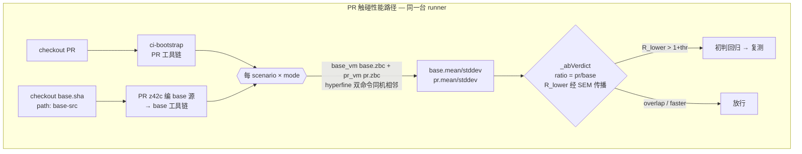

# 性能基准与回归门禁

> 对齐：2026-09-17（change `restructure-docs-three-books`）｜ 代码：`scripts/xtask_bench.z42`、`scripts/common/xtask_bench_pause.z42`、`src/tests/perf/`、`src/runtime/benches/`、`.github/workflows/bench-pr.yml`
>
> 命令与旗标以 `xtask bench -h` / `xtask bench stdlib -h` 为准。

benchmark 基础设施回答一个问题：**这次改动让 z42 变慢了吗？**
本页是判红规则的权威——阈值取值的依据、为什么这样判、哪些层判红哪些层只打印。
**改门禁语义、调阈值、加一条 scenario 之前读这页。**

## 1. 三层度量

| tier | 工具 | 位置 | 粒度 | 进 CI 门禁 |
|---|---|---|---|---|
| **z42 e2e** | hyperfine + 自建 harness | `src/tests/perf/scenarios/` + `xtask bench` | 整程序 wall-clock（VM 启动 + stdlib 加载 + 执行），ms 级 | ✅ 硬门禁（只测 `--tier gate`）|
| **z42 micro** | `[Benchmark]` + `Std.Test.Bencher`（z42b 派发）| 各 lib 的 `bench/*_bench.z42` | 单操作（`String.Replace` / `SortedSet.Add` …），ns 级 | ✅ 硬门禁（`bench --micro-diff` + 可疑即复测）|
| **Rust micro** | criterion | `src/runtime/benches/gc_cycle_bench.rs` | VM 内部热路径（GC cycle / minor / sweep / alloc）| ⚠️ **只打印、不判红**（仅 `src/runtime` 有非文档改动时才测）|

e2e 捕获全管线回归（启动开销 / dispatch / 整体吞吐）；micro 把回归定位到具体函数、守 stdlib 热路径。
前两层都由[可疑即复测](#5-可疑即复测)决定最终判定——它们此前的共同病根是「区间低估约三倍」，
复测把那部分方差测出来之后病根就没了。

**criterion 是唯一只打印不判红的一层**：同样的病根，但它的复测代价不成比例（一轮 A/B 约 390 s，
重采两轮再加约 780 s），而 GC 热路径的真回归会在 e2e 的 gate 场景里露头
（`gc_cycle_bench` 链接整个 crate，挪得动它的 VM 改动也挪得动场景）。改 GC 后自己去 CI 日志里
看那几条区间。**但别顺手把测量也删掉**——删了就再没有 GC 内部热路径的观测点。

## 2. 场景分层：`// tier:` 在源码头部声明

`src/tests/perf/scenarios/<NN>_<name>.z42` 的头部注释声明 `// tier: gate` 或 `// tier: full`
（解析只取声明行的第一个词，见 `_benchScenarioTier`；没声明即 `full`）。当前 13 条场景里
**8 条 gate、5 条 full**。`xtask bench` 默认 `--tier all`，CI 传 `--tier gate`。

分层不只是省时间：**它把每个 PR 的 e2e 比较次数从 22 降到 6~12**，多重比较导致的假红概率随之
降一个量级（见 §6 缺陷 ③）。选 gate 的判据写在各场景自己的声明行末尾（「为什么它代表某条热路径」
或「为什么它噪声太大不适合判红」）。

`full` 层场景目前只在本地跑——没有定期全量的 CI 落点，这是已知取舍；需要时 `xtask bench`
默认就是全跑。

## 3. 同-runner A/B：门禁的地基

**核心约束：门禁既不能假报、又必须能抓真回归。** 共享 CI runner 的 wall-clock 噪声可达 ±60%，
但那主要是 **between-run（跨 runner / 跨 job）系统偏移**；同一 runner 内 within-run 抖动小得多。
拿「另一台 runner 的 baseline 快照」对比会被 between-run 偏移主导 ⇒ 区间几乎总重叠 ⇒ 判红近乎失明
（既不假报、也**抓不到真回归**）。

解法是把对比搬进**同一台 runner**：base 与 pr 在同机、同 job、相邻数秒内测量，该机器的整体快慢
因子 `k` 同时乘进两侧，`ratio = (k·t_pr)/(k·t_base) = t_pr/t_base`，`k` 约掉。剩下只有 within-run
抖动，可由 SEM 量化 ⇒ 比值置信区间**才第一次统计有效**。



**base 工具链怎么来**：`ci-bootstrap` 的 composite 头一步会 `cd` 回 PR checkout，无法指向
base-src，故**不复用它建 base**；改用**已 bootstrap 的 PR z42c 直接编 base 源**（新编译器编旧源
恒成立，这是 staged-bootstrap 纪律的推论）：PR z42c 编 `base-src/src/compiler` → base z42c，
再由 base z42c 编 `base-src/src/libraries` → base stdlib。**只测 scenario 运行时**，所以 base
driver 的字节码由 PR z42c 生成这点对测量零影响——它跑的仍是 base 的 codegen 逻辑，产 base 风格的
scenario `.zbc`。z42vm 复用：`git diff base..pr -- src/runtime`（排除 `*.md`）无变更时
base_vm = pr_vm，省掉最重的 cargo 构建。

### 判红纯函数 `_abVerdict`

```
SEM_b = stddev_b / sqrt(n_b);   SEM_p = stddev_p / sqrt(n_p)
ratio = mean_p / mean_b
relSE = sqrt( (SEM_p/mean_p)^2 + (SEM_b/mean_b)^2 )     # 商的误差传播
R_lower = ratio * (1 - Z*relSE);  R_upper = ratio * (1 + Z*relSE);  Z = 1.96 (95%)

R_lower > 1 + thr   → ↑ regression   (fail, exit 1)
R_upper < 1 - thr   → ↓ faster       (informational)
否则                 → ≈ overlap      (noise, 放行)
缺 stddev / n（n ≤ 1 或 stddev ≤ 0）→ 回落裸比值 ratio > 1+thr，标 (no-ci)
```

`thr` 的**代码默认是 0.10**（`bench --ab` 与 `bench --micro-diff` 同；`bench --diff` 另有一套
默认 0.05 时间 / 0.10 内存）。**CI 显式传 0.15**——见 §6。
结果落 `artifacts/bench/ab.json`（`ab-v1` schema：每 scenario 的 base/pr mean·stddev、ratio、
r_lower/r_upper、verdict、每轮比值 `round_ratios`）。

同机抵消让 within-run SEM 在此统计有效——这是跨-runner 比法下不成立、A/B 下才成立的关键。
但**只到跑内为止**：跨进程那部分方差它仍看不见，所以初判之后还有 §5 那一道。

### micro 的同-runner A/B

micro `[Benchmark]` 在 z42b 里**进程内**跑，base 与 pr 的同名 stdlib zpkg 无法共载（不像 e2e 每
scenario 一个独立 z42vm 子进程）。所以同-runner A/B 用**两个隔离的 `bench stdlib --json` 基线**实现：
PR 树采一份、base 树采一份（复用已建的 base 工具链，仅新建 base z42b），再
`bench --micro-diff --current … --baseline …` 逐基准（按 `name` + 画像键配对）过同一个 `_abVerdict`。
PR 新增或改名的基准在 base 无对应 ⇒ 信息性 skip。

### GC 停顿子门禁

头部声明 `// gc-pause: report` 的场景（目前只有 `13_gc_large_heap`）末尾自报一行
`gc-pause max_us=… p99_us=… count=…`（数据来自 `Std.GC.PauseStatsRaw()` / `RecentPauses()`）。
hyperfine 丢弃被测程序的 stdout，所以停顿要**另跑**：base / pr 各跑 3 次取 max 与 p99 的**中位数**
——单次 max 受调度抖动影响大，中位数挡掉偶发的一次长停顿，又不会把「每次都长」的真回归抹平。
写成 `ab.json` 里 `"metric": "pause"` 的一条。

```
regression ⟺ pr_max > --pause-cap-ms(默认 16)  且  pr_max > base_max × (1 + --threshold-pause(默认 0.25))
```

**为什么是「且」**：只看绝对上限会让增量 major 落地前的每个 PR 都红（main 上这个场景的 major 停顿
本来就有约 97 ms）；只看相对比例又守不住「停顿与堆大小无关」这个目标。两条同时成立才判红 ⇒
落地后 base 与 pr 都在上限内，规则自然退化成纯绝对上限，届时把 cap 收紧到 10 ms。
判定是纯函数 `_abPauseIsRegression`，由 `bench --ab-selftest` 覆盖。

## 4. 执行画像（schema v2）

每条结果带一个 profile，标明它在什么执行组合下测出，避免误比：

- **mode**：`{tiers, aot_pkgs}`。`tiers` = 活跃后端（`interp` 恒在，可 `+jit`）；`aot_pkgs` =
  预编 AOT 的 zpkg 子集（今天恒空）。派生出 `mode_label`：`interp` / `jit`。
- **platform**：`{os, arch}`（arch 归一化为 `x64` / `arm64` / `wasm`）。
- **caps**：由 `Std.Platform.Capabilities()` 在**被测 VM 二进制**下探测
  （`src/tests/perf/probe/capabilities.z42`）——`jit` / `native-interop` / `threads` 等真实能力。
  场景可声明 `// requires-caps: <cap>`，VM 不具备时显式跳过而不是崩。

**画像隔离是硬规则**：interp 与 jit、不同 os/arch 的数字**从不互比**。diff 按
`(name, metric, mode_label@os/arch)` 精确匹配。`--mode both` 每场景各测 interp 与 jit，产两条结果；
A/B 对**同一 scenario × mode** 在 base/pr 之间比较，两模式永不交叉。

## 5. 可疑即复测

**它治的缺陷**：`_abVerdict` 的 SEM 来自**一次** hyperfine invocation 的跑内样本方差，而 base 与 pr
是两个独立进程。进程间那部分方差（CPU 频率、page cache、分配器与 GC 起始状态、代码布局彩票）
**根本没进模型**，于是声称的区间比真实窄约三倍。

**做法**：第一轮照常测；**只对初判 `R_lower > 1+thr` 的条目**，把同一份二进制再测 2 轮，拿到
k = 3 个独立比值，用**它们之间的离散度**重算区间：

```
ratio_i = pr_mean_i / base_mean_i          # 第 i 轮，i = 1..k
R_lower = mean(ratio) − t(单侧 95%, df = k−1) · sd(ratio)/sqrt(k)
regression ⟺ R_lower > 1 + thr             # 与其他各路同一条规则
```

- **单侧**，与 `_abVerdict` 的双侧 Z = 1.96 不同：门禁问的本来就是单侧问题（「pr 是不是慢了超过
  thr」），而 k = 3 时双侧分位数 4.303 会把余量做到 2.48·sd（单侧 2.920 是 1.69·sd），钝到连真的
  +20% 回归都放过去。两者的严格度并不像常数看上去那样矛盾：`_abVerdict` 把名义上更严的分位数用在
  一个**已知偏小三倍**的离散度上，实际覆盖率反而是两者中更松的那个。
- **成本只落在被标记的条目上**：干净 PR 一分钱不花；实际标记通常 1~2 条 ⇒ e2e 增加 30~60 s。
  e2e 的复测在 `xtask bench --ab` 进程内完成；micro 因为是整进程一次采 65 条，按**整轮**重采
  （约 +180 s，且只在标记非空时发生）。
- **预算上限**：e2e 一次最多复测 3 条（`_benchAb` 的 `resampleBudget`）。标记数超过上限本身就是
  「广泛真回归」的证据，剩下的条目保留初判（即判红），而不是烧掉无上界的 runner 时间去确认一个
  已经很可能的答案。
- **关掉它**：`bench --ab --resample-rounds 0`（回滚旋钮，默认 2）。**但阈值必须同时退回 0.25**——
  0.15 是复测换来的，不是可以单独享用的。

**实测证据**（本机 `--quick`，base 与 pr 是**同一份二进制**，`01_fibonacci`）：三轮比值
**1.058 / 0.978 / 0.828**，跨 23 pp。第 1 轮那个 1.058 配上很窄的跑内区间就是一条假红；复测给出
`R_lower = 0.758 / R_upper = 1.151` ⇒ overlap 放行。**跑间漂移不是理论，它就是这么大。**

### 跑间离散度到底多大（别再重新采）

k = 3 与单侧 95% 这两个参数的依据。实测（本机 macOS/arm64，`bench stdlib` 六次捕获 = 三轮 × 两侧，
两侧同一套工具链，65 条全部匹配）比值的跑间相对标准差 `sd/mean`：

| | 中位 | p90 | 最大 |
|---|---|---|---|
| `sd/mean` | **2.90%** | **7.02%** | **12.32%** |

换算成判红余量 `t·sd/√k = 2.920·sd/1.732`，以及「要多大的真回归才判得动」：

| | 余量 | 实际判红门槛（thr = 0.15）|
|---|---|---|
| 中位条目 | 4.89% | **+20%** |
| p90 条目 | 11.8% | +27% |
| 最噪的那条 | 20.8% | +36% |

**怎么读这张表**：对多数 benchmark，0.15 是**真的** 0.15——中位条目在 +20% 就判得动。
但**最噪的那一成保留了实际更松的门**。这正是复测该有的行为（门槛按**每条自己的噪声**走，
而不是全场一个拍脑袋的常数），但**别把「阈值 0.15」读成「超过 15% 就一定拦得住」**。

⚠️ 这组数是**本机 macOS/arm64** 测的，不是 CI 的 linux runner。方向性可信，量级要在 CI 上用
`ab.json` 的 `round_ratios` 继续攒。离散度若显著大于本机，症状是**真回归被放过**（不是假红）——
那时该加 k，不是松阈值。

⚠️ 另一个实测现象：在一个**两侧完全同源**的对照上，第 1 轮在 0.15 下仍会标记到条目（本机 65 条
里标了 2 条）。**这正是第 1 轮只配用来点名、不配判红的证据。**

**为什么 micro 不按 benchmark 名过滤重采**：`bench stdlib --filter` 过滤的是**文件名**而不是
benchmark 名，要按名重采就得新造一层 benchmark → 文件的映射——映射错了是**静默少测**（门禁变瞎），
而整轮重采最坏只是多花时间。宁可多做，不可漏。
接口上 `--micro-diff --current a,b,c --baseline x,y,z` **两侧轮数必须相等**（不等 = 用法错误
exit 2，不是「没有回归」）；某条 benchmark 没有出现在**每一轮**里 ⇒ 打警告并**排除出门禁**
（来来去去的条目不构成回归证据，静默丢弃则是门禁变瞎的老路）。

## 6. 噪声底与阈值（改阈值前必须先读）

门禁曾经每个 PR 期望假红约 2 条，连续 4 次失败逐条核对**全部是假红**。三个叠加缺陷：

**① 判红阈值画在噪声底之下。** 拿两个**应当 perf-neutral 的 PR** 反推真实噪声
（比值对数标准差 × 1.96）：

| 层 | 探针 PR | 比值散布 | **真实噪声(95%)** | 声称的区间宽度 |
|---|---|---|---|---|
| e2e（22 条）| 编译器注册键重构 | 0.932 – 1.239 | **±13%** | 中位 7.9% |
| micro（65 条）| GC loom 建模（不碰 crypto）| 0.747 – 1.115 | **±16%** | 中位 4.8%、最窄 **0.25%** |

阈值 10% 低于这个噪声底 ⇒ 筛出来的必然主要是噪声。**阈值必须高于噪声底，否则假红是数学必然。**

> **代价说清楚**：抓不到阈值以下的真回归。这个代价是自觉付的——历史上真正需要拦住的量级
> （把一次负缓存 revert 掉 = **1.93×**）远超 25%。**一个 25% 阈值但没人忽略的门禁，强过一个
> 10% 阈值但被当噪声跳过的门禁。** 复测把这个代价降到 15%，且**没有**用「调松判据」换——
> 判据反而更严了（跑间离散度 > 跑内）。

**② 声称的置信区间被系统性低估 ⇒「区间分离」这道保险失效。** micro 声称的区间中位仅 4.8%，
而真实噪声 ±16%，**低估约三倍**。根因即 §5 开头那条：`Bencher` 的 `stddev` 是**单进程内批次样本**
的离散度。判红因此退化成「谁的区间碰巧最窄」的抽签——同一批数据里的现场：

| 基准 | 比值 | 声称区间 | 判定 | 为什么是假红 |
|---|---|---|---|---|
| `crypto.sha256_4k` | 1.115 | ±0.15% | ↑ 判红 | 区间窄到离谱，恰好把 1.10 顶出去 |
| `crypto.sha256_small` | 1.110 | ±0.8% | ≈ 放过 | **同量级的同一效应**，只因区间稍宽就没红 |
| `crypto.aes_cbc_4k` | 0.810 | ±0.06% | ↓ 快 19% | GC 改动不可能让 AES 快 19%，却被宣称为极高置信 |

e2e 情况好些（hyperfine 跨 10 次**进程启动**采样，声称 7.9% vs 真实 13%，低估约 1.6 倍）。
这条缺陷的正解就是 §5 的复测。

**③ 每个 PR 做 22 + 65 = 87 次比较、不做多重比较校正。** 即便区间完美标定，单侧 95% 下期望假红也
有 `87 × 0.025 ≈ 2.2` 条；只要任意一条撞上，整个 job 红。**场景分层把 e2e 的比较数压到 6~12**，
这是分层最容易被低估的收益。缺陷 ③ **对 micro 那 65 条仍未解**——micro 能硬门禁靠的是每条的区间
被做实，不是比较数变少了。**若 micro 层开始零星假红，先查这一条，别急着动阈值。**

三件事是**一件事**：可疑即复测、阈值 0.15、micro 硬门禁。`--resample-rounds 0` 关掉复测就必须把
阈值退回 0.25。

## 7. criterion 层：为什么只打印

判定条件原样保留（**整个 95% 区间在 +25% 之上**，即读 `change/estimates.json` 的
`mean.confidence_interval` 判 `lower_bound > thr`），它仍是「这条值得人看一眼」的最好线索，
只是不再替人做拦不拦的决定。依据是它自己的战绩：**至今每一次判红都是假的**
（一次 `gc_cycle/large_array_10k +13.2%`，作者五分钟后照常合并；另有两例出现在 base 与 pr 的 VM
代码**逐字节相同**的对照上）。

两个曾经的根因都修掉了，但**结构性缺陷修不掉**：

| 根因 | 修法 |
|---|---|
| 「CI 分离」被实现成 `lo > 0.0`（下界大于**零**）⇒ `[+0.5%, +60%]` 这种毫无信息量的宽区间照样算「分离」| 改成 `lo > thr`（**整个区间**在阈值之上），输出改打完整区间与宽度 |
| 阈值 10% 画在噪声底之下 | 抬到 0.25，与 e2e 对齐 |
| **跑内区间对上跑间漂移**（`--baseline` 比的是两次独立跑，bootstrap CI 却是跑内的）| 修不掉；复测在这一层代价不成比例 ⇒ 降为 informational |

criterion 层噪声底的实测（同一个 PR 的四次跑，**每次 base 与 pr 的 VM 代码都逐字节相同**）：

| bench | 跑2 | 跑3 | 跑4 | 跑5 | 极差 |
|---|---|---|---|---|---|
| `gc_cycle/large_array_10k` | +0.6% | **+20.9%** | +0.3% | **−11.0%** | **31.9 pp** |
| `gc_minor/1k_young_with_10k_pinned_old` | +0.0% | −1.5% | +5.9% | **+15.9%** | **17.4 pp** |
| `gc_sweep/10k_survivors` | +0.7% | +6.2% | **−9.1%** | +1.1% | 15.3 pp |
| `gc_cycle/cycle_heavy_100` | +1.7% | +6.0% | −2.7% | −4.4% | 10.4 pp |

⇒ criterion 层的噪声底同样在 ±16% 上下。注意跑5 那条 +15.9% 的区间只有 5.1 pp 宽——**任何基于
跑内区间的规则都拦不住它**，只有把阈值抬到跑间漂移之上，或者拿到跑间离散度。
**要重新硬门禁，前提是先把它的跑间漂移量出来，不是调阈值。**

**`concurrent_*`（多线程）基准连测都不测**：它们在共享 runner 上的跑间线程调度噪声很大
（一个 perf-中立的纯注释 PR 上摆动 +6~33%，单线程基准却居 0 附近），而既然从不判红，
每个碰 VM 的 PR 为它们花的 75 s 就是纯开销。workflow 设 `Z42_BENCH_SKIP_INFORMATIONAL=1`，
`gc_cycle_bench.rs` 的 `skip_informational()` 据此跳过并**打印一行**（不静默）；
本地 `cargo bench` 不设这个变量，照常全跑。**这是排除法不是白名单**：新加的 bench 默认进测量，
只有在源码里显式标成 informational 的才可能被跳过。
`smoke_bench.rs` 是纯 Rust sanity（不碰 VM），保留作「criterion 装置能跑」自检，不纳入门禁。

## 8. 改动面守卫：为什么是排除文档而不是列白名单

「碰没碰 VM」这个判据由三处 `git diff --quiet base..HEAD -- src/runtime …` 决定（建 base 工具链 /
选 `--mode` / criterion 跑不跑）。`src/runtime` 下有 13 个 `README.md`，裸目录判据会把它们也算作
「VM 变了」——一次只改 `src/runtime/benches/README.md` 一行的 PR 就白烧了约 9 分钟。
三处都加上 `':(exclude,glob)src/runtime/**/*.md'`。

**选「排除文档」而不是「只列 `*.rs` + `Cargo.toml`/`Cargo.lock`」的白名单**，理由是两种错法不对称：

| 写法 | 漏判方向 | 后果 |
|---|---|---|
| 白名单（只列已知会影响产物的类型）| **假阴性**：新出现一种真影响产物的文件类型未被列入 → 门禁**静默跳过**本该跑的比较 | 门禁变瞎，且不报错、无人察觉 |
| 排除法（只排掉确定是文档的 `*.md`）| **假阳性**：某些不影响产物的非 `.md` 文件仍触发 | 多跑一次，费时间不费正确性 |

整治 bench 门禁的全部意义是**别让判定失真**，所以取「只可能错向多跑」的那一边。
同理**不要**把 criterion 的守卫再收窄（例如「只有改了 GC 相关文件才跑」）：`gc_cycle_bench` 链接
整个 crate，任何 VM 改动都可能挪动它，收窄 = 假阴性。

## 9. CI 门禁接线（`bench-pr.yml`）

触发路径刻意收窄（`src/runtime` / `src/libraries` / `src/compiler` / `src/tests/perf` /
`scripts/**/*.z42` / 本 workflow），末尾再加一条负向模式 `!**/*.md`（负向在后 ⇒ 覆盖前面的匹配），
使**纯文档 PR 一个文件都不命中、整个 workflow 不触发**；`.md` 与代码同改则照旧跑。步骤：

1. checkout PR + checkout `base.sha`（`path: base-src`，两者 `fetch-depth: 0`），
   随后做**格式代差检测**（见 §10）。
2. bootstrap PR 工具链（nightly z42c 种子 → 当前源码 warm 自建）。
3. **判红逻辑自检**——纯 JSON / 纯函数，实测约 1.2 s，**放在测量之前** ⇒ 规则改坏立刻失败而不是
   等二十分钟。
4. **建 base 工具链**（同 runner，见 §3）。
5. **e2e A/B（硬门禁）**：`bench --ab --tier gate --mode $MODE --threshold-time 0.15
   --pause-cap-ms 16 --threshold-pause 0.25 --base-vm/-libs/-driver …`。`MODE` 按改动面收窄：
   `src/runtime` 无非文档改动 → `jit`，否则 `both`。
6. **micro A/B（硬门禁）**：两棵树各采一份 `bench stdlib --json` → 第 1 轮
   `--micro-diff --suspects …` **只点名不判红**；`suspects` 为空 ⇒ 直接通过（**零额外开销**）；
   非空 ⇒ 再采两轮，用三轮判红。
7. **criterion A/B（informational，永不 fail）**：仅 `src/runtime` 有非文档改动时跑。

### 第 3 步自检守的是什么

把**三条判红路径**都用可复现输入钉住：

| 路径 | 怎么测 | 用例 |
|---|---|---|
| `_abVerdict` + `_abResampleVerdict`（纯函数）| `bench --ab-selftest` | 10（时间 5 + 停顿等 5）|
| `_benchDiff`（`--diff`，历史/本地对比）| `testdata/current-*.json` vs `baseline.json` | 4 |
| `_microDiff` 单轮（`--micro-diff`）| `testdata/micro-*.json` vs `micro-base.json` | 7 |
| `_microDiff` **复测**（三轮 × 两侧）| `testdata/micro-rs-*-r{1,2,3}.json` | 4 + 1 用法错误 |

所有 fixture 都跑 **0.15（门禁在用的那个）与 0.25 两遍**：每条套件里都有一个只在其中一个阈值下
翻红的用例，它是**唯一对阈值本身敏感**的用例——没有它，把 `--threshold-time` 降到 0.001 结果都
纹丝不动（实测过），即门禁根本没在看阈值。
⚠️ **0.15 那一列必须跟着门禁实际用的阈值走**；改了 `--threshold-time` 而没改自检，等于自检不再
检门禁在跑的那套规则。

复测四例各守一件事：`rs-drift`（第 1 轮 +60%、后两轮 +5%/+10%，**均值 1.25 本身在阈值之上**
⇒ 只有区间宽度真的算了才放行——这就是复测要杀的那条假红）、`rs-real`（每轮都 +30% ⇒ 仍判红，
证明复测没把门禁弄瞎）、`rs-mid`（对阈值敏感的那条）、`rs-missing`（回归条目缺席第 3 轮 ⇒ 必须
被排除）。**base 三轮的数值故意各不相同**，所以轮次配错会改变比值。

**反向验证**（做过五次；正向绿只证明 fixture 与当前实现一致，不证明实现坏掉时它会叫）：

| 注入缺陷 | 谁抓住 | 谁**没**抓住（值得记）|
|---|---|---|
| `_abClassify` 的 `RLower > 1+thr` → `> 1.0` | `--ab-selftest` + 3 条 micro + `rs-mid@0.25` | `_benchDiff`（有自己的门，不走 `_abClassify`）|
| `_microVerdict` 回退分支 `cLo/bHi` → 裸比值 | `fallback-overlap` | — |
| `_abResampleVerdict` 的 `t` → 0（区间宽度算没了）| `--ab-selftest` + `rs-drift@0.15` | 均值在阈值**之下**的 drift 用例（所以 fixture 特意选了均值在阈值之上的）|
| 轮次错配（base 恒取第 1 轮）| **只有** `rs-mid@0.15` | `--ab-selftest`（纯函数不受影响）⇒ **纯函数自测与接线 fixture 两层缺一不可** |

**覆盖边界**：守的是**判定规则**，不是测量与编排——`_abOneScenario` 的 hyperfine 调用、base 工具链
构建、micro 基线采集只能靠真 run 行使。

## 10. 跨格式代际的 PR 不做 A/B

zbc/zpkg 格式 bump 的 PR 上，e2e / micro A/B **结构上不可测**——不是慢、不是偶发，是必然：

```
建 base 工具链：PR driver 编 base-src/src/compiler → base driver
               PR stdlib 塞进 BASEALL（base driver 要它才跑得起来）
               base driver 编 base-src/src/libraries → base stdlib
                  └─ 写出格式由「运行时加载的 z42.ir」决定 = PR 的 z42.ir ⇒ PR 格式
实测：         BASEVM（base 源码建的 z42vm，钉 base 格式）读 base stdlib
                  └─ zpkg minor <PR> not supported (writer is at <base>)  ✗
```

格式常量住在 `z42.ir`（stdlib 库），**谁的 z42.ir 在跑、就写谁的格式**。

**处置**：读两棵树 `z42.ir` 的 writer 常量（`ZbcFormat.z42` / `ZpkgWriter.z42` 的 Major/Minor），
不同 ⇒ 跳过**依赖 base 产物**的四步（建 base 工具链 / e2e A/B / 两侧 micro 捕获 / micro 判定），
打 `::warning::` + job summary 明示「本次没测」——**不能静默变绿**。常量读不出来 ⇒ 直接失败
（不按「无代差」放行）。不读 base zpkg 的两步照跑：判定逻辑自检、criterion A/B。

**为什么不「让 base 侧也用 PR 的 VM 跑」凑出一个数**：那测的就不是 base 了（VM 是被测对象之一），
数字没有意义；格式 bump 的性能影响在合入之后下一个 PR 的 A/B 里自然被覆盖。

**检测判据故意用源码常量而非产物 header**：检测跑在任何构建之前（纯 grep，零成本），且源码常量
正是「将要写出什么格式」的唯一 SoT；产物 header 要等建完才有，失败时已经白烧了 base 工具链的
构建时间。

## 11. 启动类微小回归：先排除「布局彩票」

hello 启动只有约 6.5 ms、以**冷代码**为主，对二进制布局极其敏感。实测过一个反直觉的对照：

> 在 `LazyLoader` 上加**一个从不读的 `usize` 字段**（其余全部保持 HEAD，`git diff` 只有 3 行），
> hello 启动的 **instructions retired 从 69.6 M 涨到 73.5 M（+5.7%）**，墙钟 +0.4 ms。

一条**逻辑上零成本**的改动就能在启动上造出约 6% 的「回归」。装箱、`#[inline(never)]`、把整个
`LazyLoader` 挪进 `Box`（让 `VmCore` 大小不再随它变）都消不掉这个差值。

**所以判断「某改动是否真的拖慢了启动」必须做两件事**：

1. **看 `instructions retired`**（macOS 用 `/usr/bin/time -l`）而不是只看墙钟——它对代码布局免疫，
   跨运行离散度只有约 0.5%，能把「真多干活了」和「布局摆动」分开；
2. **做扰动对照组**：`HEAD + 一个死字段` 重编一份，测同一指标。对照组同样摆动 ⇒ 这个差值
   **不可归因于被测改动**。顺带对一遍 `--print-stats-on-exit` 的计数器（builtin_calls /
   jit_methods_compiled / allocations / …），逐项相同则可确认没有行为差异。

（有一条 1.94× 的优化差点因为被误判成 −6% 启动回归而砍掉。）

## 12. 试过并回退：`[profile.bench]` 改 thin-LTO（别再试）

`[profile.bench]` 默认继承 `[profile.release]` 的 `lto = true, codegen-units = 1`，每次
`cargo bench` 都要 fat-LTO 链接整个 crate（单侧 73 s）。**本机实测**改一行 `lib.rs` 后重链：
`lto=true,cgu=1` 68 s / `lto=true,cgu=16` 60 s / `lto="thin",cgu=16` **20 s** — 看起来能省约 100 s。
**但在 CI 上实测是负收益，已回退**：

| 侧 | profile | `cargo bench` 全程 | 依赖编译 | codegen + 链接尾段 |
|---|---|---|---|---|
| base | `lto=true, cgu=1` | **116 s** | 112 crate / 42.5 s | 74.1 s |
| pr | `lto="thin", cgu=16` | **132 s** | **194 crate** / 54.5 s | 77.6 s |

两条原因：**本机的加速不可外推**（本机 10+ 核能把 16 个 codegen unit 并行掉，`ubuntu-latest`
只有 4 vCPU，尾段基本持平）；**换 profile 反而多编一轮依赖**（bench profile 一变，依赖产物哈希
全变，112 → 194 个 crate）。而代价实打实：那一跑 base 是 fat、pr 是 thin，等于一次 thin/fat 对照，
`gc_alloc/array_throughput_10k` **偏移 +16.8%**。

> 教训（比结论本身更值钱）：**编译耗时的本机对照不能直接外推到 CI runner**——核数差 3 倍时，
> 「靠并行换速度」的改法（cgu 拆分、并行链接）在 CI 上会原地踏步。要削 CI 的编译时间，先问
> 「这个改法省的是**总工作量**还是**并行度**」；只有前者才跨机器成立。

同理**不要**凭印象去砍 `sample_size` / `measurement_time`：省的是测量时间，代价是区间变宽 ⇒
判红更钝，方向与复测相反。

⚠️ **跨 run 比总时长要留 runner 余量**：同一份改动的两跑里，e2e 一次 193 s、一次 271 s（+40%），
纯粹是 runner 快慢。只有**同一跑内的两侧**（base vs pr）和**同一步骤的多跑中位**才值得直接比。
另外 `gh run list` 看到的 2000 s+ 往往是**排队**不是执行，要看 job 的 `started_at` → `completed_at`。

## 13. 加一条 scenario

1. 在 `src/tests/perf/scenarios/` 加 `<NN>_<name>.z42`；
2. **首行注释声明 tier**（`// tier: gate` 或 `// tier: full`）并写一句选择理由；
3. 顶部注释说明 workload 与预期输出；
4. 用 `Console.WriteLine` 打印一个稳定结果（便于验证编译器输出未漂移）；
5. workload 大小让单次运行时间 ≥ 50 ms（避免 hyperfine 抖动）；
6. 需要特定能力的加 `// requires-caps: <cap>`（如 `threads`）。

设计约定：场景里不做文件 IO / 网络；时间统一 ms、内存统一 KB；场景是**性能载体不是 correctness
测试**——它们被 golden 发现逻辑显式排除（`_isNonRunnableCat` / `_isNonRegenCat` 的 `perf` 项）。

## 14. 已知局限

- **内存指标**：schema 有 `metric: "memory"` 位，但 e2e harness 暂不采集 RSS；`--threshold-memory`
  保留默认、内存 diff 为 informational。
- **A/B 交错粒度**：hyperfine 双命令是「base 全跑 → pr 全跑」于一次 invocation（同机相邻，够抵消
  between-run），不是逐次交错；逐次交错抗 job 内漂移更强，未做。
- **基线不存盘**：没有主分支 baseline 快照，`bench --diff` 必须显式给 `--baseline <path>`。
  趋势记录若要恢复，应落在独立的数据仓，而不是代码仓的分支。
- **格式-bump 边角**：PR 同时 bump 格式**且**动 `src/runtime` 时，base driver 是 PR 格式而 base_vm
  是 base 格式读不了 → 该 PR 当次 bench 可能红。随 nightly 自愈、不阻塞。
