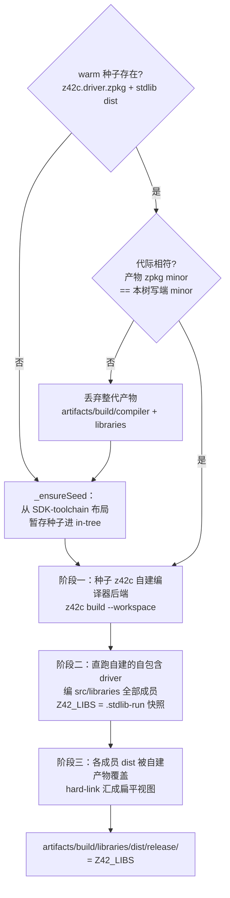
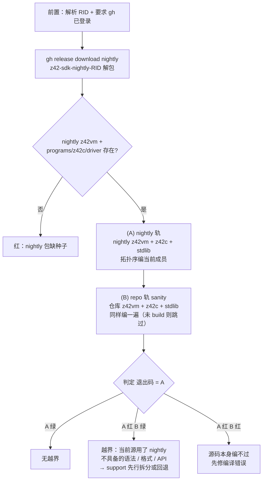

# 构建编排（`xtask build`）

> 对齐：2026-09-17（change `restructure-docs-three-books`）｜ 代码：`scripts/build/`（`xtask_stdlib.z42` / `xtask_compiler.z42` / `xtask_golden_assets.z42` / `xtask_bootstrap_check.z42` / `xtask_toolchain.z42`）、`scripts/common/xtask_layout.z42`
>
> 产物落在哪、哪个目录归谁，见[产物目录布局](artifacts-layout.md)；命令面见 `xtask build -h`。

`build` 命令族把「z42c 自建自己 → 自建的 z42c 编 stdlib → 产物汇成扁平视图」这条自举构建链
编排成可重复的步骤，另外还负责 golden 基线重生与跨版本自举边界检查。
**要改构建顺序、查一次构建为什么重编了那么多、或搞清楚不动点验证到底比的是什么，读这页。**

## 1. 约束与取舍

- **全链自举**：一切编译只经 z42c（warm 产物或 nightly 种子），无外部编译器介入。
- **自建即验证**：z42c 每次构建都在自己编自己，构建通过本身就是编译器冒烟测试。
- **产物可寻址**：一切落 `artifacts/build/`；stdlib 汇成单一扁平目录供 `Z42_LIBS` 指向。
- **warm / cold 两态等价**：有产物走 warm，fresh checkout 走 cold（下载种子），两态产出相同。

| 决策 | 选择 | 理由 |
|---|---|---|
| stdlib 由谁编 | 自建的 z42c，drop-in 替换种子产物 | 每次构建都是一轮自举验证；产物永远出自当前源码的编译器 |
| 扁平视图 | hard-link 汇聚到单目录，**无 namespace index** | VM 与嵌入宿主都直读 zpkg 的 `NSPC` section，索引是冗余状态 |
| golden 输出 | 重定向到 `artifacts/` 镜像；仅 `zbc-format` 类原地覆盖 | 仓库不积构建产物；zbc-format 是签入的字节基线，`git diff` 即格式漂移探针 |
| golden 编译并发 | 每 case 独立 spawn z42c 进程，`max(8, CpuCount())` 路 | 单 case 成本被 driver 启动主导（加载 driver + 兄弟包 + stdlib），进程级并行收益最大 |

## 2. 成员清单没有第二份副本

两个 workspace 的成员列表都**派生自各自 `z42.workspace.toml` 的 `default-members`**
（`_compilerMembers` / `_stdlibList`），不存在手维护的重复清单：

| workspace | 成员 |
|---|---|
| `src/compiler/` | 编译器**后端三包**：`z42c.semantics` / `z42c.pipeline` / `z42c.driver`（exe）|
| `src/libraries/` | stdlib 全部成员，外加三个工具链库 `z42.ir`、`z42c.core`、`z42c.syntax` |

可移植前端（`z42c.core` = Span/Diagnostic、`z42c.syntax` = Lexer/Parser/AST）与 IR·后端库
`z42.ir` 住在 `src/libraries/`，**随 stdlib 一起建、一起进扁平视图**，后端三包经跨-workspace
dist 发现来解析它们。所以「编译器有几个包」这个数是算出来的，别在文档或代码里写死——
`scripts/` 与 `src/` 的若干注释里仍留着「7 包 / 6 个兄弟包」的旧口径，那是历史文本，
以 `default-members` 为准。

产物路径同理不是硬编码：`scripts/common/xtask_layout.z42` 读 `[workspace.build].output_dir`
模板（正是 z42c 的 `WorkspaceBuild.PlanLayout` 消费的那一份）再展开，改 toml 模板 xtask 自动跟上。

## 3. `build stdlib`：三阶段自举构建



阶段一用 `z42c build --workspace`：拓扑序编各成员，兄弟依赖由 workspace 内部解析。
阶段二**直接跑**这个 driver 编 stdlib——`Z42_LIBS` 指向 `artifacts/.scratch/stdlib-run/<profile>`
的快照，因为 stdlib 正在被重建，运行中的 driver 需要一份稳定的 `Std.*` 副本。
阶段三用 hard-link（零拷贝）把各成员 dist 汇聚成单目录。

### warm 判据带代际校验（「在不在」不等于「能用」）

`_ensureSeed` 判断 in-tree 产物能不能当种子，**不能只看文件在不在**——还要看它是哪一代：
读 `z42c.driver.zpkg` 与 `z42.core.zpkg` 头里的 zpkg **格式 minor**（`'Z''P''K'0 | major:u16le
| minor:u16le`，见 `z42.ir` 的 `ZpkgWriterZ._assemble`），与**本源码树写端**的
`ZpkgWriterZ.Minor` 比对；不等就丢弃 `artifacts/build/{compiler,libraries}` 整代产物、
退回冷启动重新供种，并打印一行说明。

- **期望版本从源码读、不用编进 xtask 的常量**（`_srcIntConst`）——xtask 自身可能是旧二进制，
  编进去的版本号会跟着一起旧，正好在最需要它的场合失效。
- **读不到那个常量就不判也不删**，退回旧行为：这道校验是防呆，不该自己变成新的故障源。
- 暂存用的 SDK 种子若落后一代，**只告警不失败**——「上一版 z42c 能编当前源」是
  [bootstrap-seed](../../../agent/rules/bootstrap-seed.md) 的纪律，落后一代未必不能用。

**为什么值得一道专门的校验**：错代产物的失败形态与「种子过期」毫无字面关系。实证
（2026-09-23）：一棵树里躺着 zpkg 0.48 时代的 driver，那一代的静态初始化还走
`__static_init__`，而 `unify-static-init-into-cctor` 已把运行期对它的支持删掉 ⇒ 静态量
永不初始化，崩成 `ArrayGet: expected array, got Null @ PrimModel.SurfaceName`。
排查时极易误判成「main 有回归」——**而且「换棵 pristine 树验一遍」也分辨不出来，
因为那只控制了源码、没控制 `artifacts/`**。

`build compiler` 就是单独执行阶段一 + 成员 zpkg 完整性校验。

> **`artifacts/build/` 只放编译 / publish 产物**。构建与测试的**中间态**——`stdlib-run` 快照、
> `alllibs` 扁平视图、`selfhost-gen1` 等工作区——一律落 `artifacts/.scratch/`（gitignored、可重生）。

### driver 的自包含化与两处破环

`_ensureDriverSelfContained` 把非-driver 的编译器成员 zpkg，外加扁平 dist 里的
`z42c.core.zpkg` / `z42c.syntax.zpkg`，复制进 `z42c.driver` 的 dist。于是下游一律跑
**自包含 driver**（兄弟包从自身目录解析，`Z42_LIBS` 只需 stdlib），不用再拼 colocated 目录。

两个环只在冷启动（fresh checkout / 新 CI runner）出现，处置都是「被依赖方先 fresh，再重试一遍」：

| 环 | 现象 | 破法 |
|---|---|---|
| z42c ⇄ `z42.ir` | z42c 运行期依赖 stdlib 库 `z42.ir`，而 `z42.ir` 由 z42c 构建；冷树上 fresh z42c 只能拿种子自带的旧 IR 包解析 `Z42.Project.*`，运行期加载真 `z42.ir` 时符号解析不到 | `_ensureBootstrapSelfDepLibs` 在 workspace build 之前先用种子 driver 把当前源的 `z42.ir` 编进 build-libs |
| z42c ⇄ z42c（跨成员符号新增）| driver 打包的是**当时** dist 里的旧兄弟包，它遮蔽 fresh dist ⇒ 消费方成员首遍报 `no field` / `undefined type` | 首遍已按拓扑序把被依赖成员建 fresh ⇒ 用 fresh 兄弟重新自包含 driver 再跑一遍即收敛；真编译错重试照样失败 |

## 4. 不动点验证（`test compiler` 的核心）

gen1 = `build compiler`（`z42c build --workspace`）产的 canonical dist；
gen2 = **用 gen1 的 driver 再跑一遍同样的 `--workspace`**；**gen1 与 gen2 必须逐字节相等**。
不相等即编译器 self-host 有非确定性或语义 bug——「byte-identical 全自举」这个目标的日常守门员。

实现在 `_testSelfHostByteIdentical`（`scripts/build/xtask_compiler.z42`）：

```
snapshot gen1: 拷 canonical dist 的每个 <member>.zpkg → artifacts/.scratch/selfhost-gen1
rebuild gen2:  gen1 的自包含 driver 跑 build --workspace（Z42_LIBS = stdlib 扁平视图）→ 覆盖 canonical dist
compare:       逐成员 _sectionsEqualIgnoreBlid(gen1, gen2)
```

两个关键点：

1. **gen1、gen2 必须走完全相同的构建路径**（都 `--workspace`）。曾经 gen2 走「逐包 `build <toml>` +
   胖扁平 `Z42_LIBS`」，与 gen1 分歧：单包胖-flat 构建从目录里拉入的依赖闭包更大、扫描顺序又非确定，
   于是 gen2 ≠ gen1 且逐次漂移。**不动点两代必须同路径**，否则测的是「两条不同构建是否巧合一致」，
   而不是「编译器能否复现自身」。这一条由 `_z42cWorkspaceBuild` 这个单一封装从注释纪律固化成代码。
2. **忽略 BLID**：zpkg 末尾 16 B 是 MurmurHash3 x86_128 build-id（内容哈希尾），天然每次不同；
   比对在 section 级别做、跳过 BLID，只验代码与元数据段一致。

### z42c 的执行模式：默认 jit

xtask 驱动 z42c（`z42vm z42c.driver --mode <m>`）编 stdlib / 自建 z42c / golden 时的执行模式，
统一由 `_z42cMode()`（`scripts/common/xtask_common.z42`）给出，**默认 `jit`**。

jit 之所以能当不动点的信任基线：`jit-fixpoint-check.yml`（手动触发，linux-x64 / linux-arm64 /
windows-x64 / macos-arm64 四平台）确认 z42c `--workspace` 编译在 **interp 与 jit 下产出逐字节一致**
（忽略 BLID）。既然 jit 输出 == interp 输出、而 interp 输出已是 fixpoint-stable，
则 gen1(jit) == gen2(jit) 同样成立——jit 只快不改字节。实测 jit 编译比 interp 快
1.67×（小包）～3.6×（大包如 `z42.core`）。

逃生舱：`Z42C_BUILD_MODE=interp`（格式-bump 窗口、确定性审计、调 codegen 时用），`=jit` 亦可显式指定。
**例外**是 `xtask test bootstrap`：它恒用 interp，因为要走上一版 nightly 种子最稳的解释路径，不随本默认变。

## 5. 增量编译：判据下沉到名字

单工程 `z42c build <toml>` 的判定与组装 SoT 是 **cache**（`<rel>.zbc` fullMode + `<rel>.meta` +
包级源清单；`[build].cache_dir`，默认 `${output_dir}/.cache`）。cache **不论是否增量都落盘**。
粒度是**文件级**：种子（hash / 条目缺失 / pin / 源清单不一致 → 全量）→ 失效传播 → 只重编失效闭包，
其余文件的 `IrModule` 经 `ZbcReader` 从 cache 读回（`.meta` 回填 zbc wire 不携带的 writer 残留：
块 label 原文、模块池原序、TIDX idx）；TSIG 与符号恒全包重算，组装零分叉。全命中打印 `no changes; preserved`。
省下的是失效闭包之外文件的 typecheck + codegen（最贵的相位）；parse / TSIG / 组装恒做，这是 Amdahl 上界。

失效判据的粒度是**名字**，不是文件：

- 每个 cache 条目存「名字 → 该名字自己的**声明面**指纹」（meta 的 `nsurf` 行）+ 该文件声明面里的
  标识符去重集（`sident` 行）。「声明面」= token 流里把方法 / 构造 / 计算属性 getter / 索引器的**体**
  各压成一个 `{}` 记号；注释与空白本就不是 token，天然不参与。指纹算法见
  `src/compiler/z42c.driver/src/SurfaceHash.z42`。
- **失效**：`seedChanged` = 种子失效文件里「指纹变了 / 新增 / 删除」的名字；文件 i 失效 ⟺
  i 的标识符 token 集（含体内）碰到其中任一名字。
- **传播**：文件 i 失效后，**只有当它的声明面提到了「别人的」已变名字**，才把自己的全部定义名并入
  已变集继续传。

**为什么传播规则是这个形状**：

- 必需——`A: class Foo : Bar`，`Bar` 变了则 `Foo` 的布局/vtable 跟着变，用 `Foo` 的 C 必须重编；
  A 的源没动、`Foo` 的指纹反映不了这一点，靠这条规则接上。
- 足够——若 A 与 `Bar` 的唯一关联在某个**方法体**里，A 的任何声明都没变，A 的消费方看到的 A
  仍是原来那个 A（跨文件依赖只经声明面），不必重编。
- **必须排除「自己定义的名字」**——种子文件的声明面天然提到它刚改的名字，不排除的话种子第一轮就把
  自己全部成员名并进已变集，粒度当场退回文件级。

**为什么跨文件依赖只经声明面**：内联（`IrInline`）只在同一 `IrModule`（= 单 CU）内解析 callee；
逃逸与纯度摘要同为模块级不动点，跨模块调用无摘要即保守处理；泛型不单态化进调用方（类型实参以名字
随 `CallInstr.MethodTypeArgs` 走运行期）；唯一把别处体内的值抄进消费方的 `const` 字段，其初值写在
**字段声明**里、不在方法体内，本就留在声明面中。

保守方向也是稳的：**漏**登记一种带体的声明形态，只会让那段 token 留在指纹里 → 该文件体一改照旧
波及（多编不错编）；**多**挖 token 才危险，故只按「AST 亲口给出的体起始 `{` 偏移 + token 层大括号
配平」挖。切片定界同理只认「上一个声明的收尾符」（`;` / `}` / `{` / 折叠体记号），因为
`ClassDecl.Span` 指向 `class` 关键字、**修饰符与 `[Attr]` 都在它之前**——按声明起点直接切会把
`public` 划给上一个名字，改可见性就归错人。

实测（xtask 自身工程，64 文件）：新增类型 / 新增自由函数 `cached: 63/64`；给某个类新增成员函数
`62/64`；改成员函数签名 / 改可见性 `56/64`；只改注释或只改函数体 `63/64`。

旋钮与验收：`--no-incremental` 强制全量；`Z42_INCR_DEBUG=1` 打印种子与传播链
（`[name-changed]` / `[name-removed]` / `[invalidated] … uses-changed-name X` / `[spread]`）；
硬验收是 `xtask test incremental` 的暴力对账器——逐文件 touch、逐文件追加一个新自由函数、
dist 清空后全命中重装配三轮，每轮都要求增量 dist 与 `--no-incremental` 全量**逐字节相等**。
**workspace / flat 构建（§3 的阶段一/二）不落 cache、不 probe**，gen1/gen2 字节对比路径零扰动。

## 6. Rust 构建 ↔ z42c 产物：一条被刻意切断的构建期环

`src/runtime/build.rs` 会用 z42vm + z42c 把两个 `.z42` 测试 fixture 编成 `.zbc`，并 emit
`--cfg z42_have_z42c` / `z42_have_embedding_hello` 给约 10 个 Rust 测试当开关。为此它需要
`rerun-if-changed=<z42c.driver.zpkg>`——于是构建期出现一个环：

```
z42vm (Rust) ──要它才能跑──> z42c ──产出──> z42c.driver.zpkg
     ↑                                            │
     └────── build.rs rerun-if-changed ───────────┘
```

环本身不致命（build script 读任意文件是允许的），**致命的是 mtime 语义**：`xtask build compiler`
每轮都重写 `z42c.driver.zpkg` → 下一次 cargo 判定 build script 陈旧 → 整个 crate graph 全量重编。
实测在 warm 树上仅 `touch` 一下 driver.zpkg，release 重编就要 **62 s**；debug 只约 3.5 s（无优化），
所以只在 release 上致命——而 CI 的 bootstrap 走的正是 release。

**处置**：整块由 cargo feature **`z42-test-fixtures`** 门控，**默认关闭**。普通 `cargo build` 根本
不声明这条依赖，环在非测试路径上断开（`build compiler` 92 s → 31 s，cargo 步 61.7 s → 0.12 s）。
只有 `xtask test runtime`（全仓唯一的 `cargo test` 调用点）显式带上该 feature 时才接上，
被门控的测试照跑，覆盖面不变。

> 一般教训：**不要让「纯测试便利设施」进入所有人的构建关键路径**。build script 里对
> 「本构建系统自己会重写的文件」声明 `rerun-if-changed`，等于给每一轮构建都埋一次全量重编。

## 7. strict-pin：改格式必须同 commit bump 且重生基线

z42c（writer）在每个 `.zbc` / `.zpkg` 头写版本常量；z42vm（reader，
`src/runtime/src/metadata/zbc_reader/`）加载时**精确匹配 major + minor**，不匹配直接拒
（`zpkg minor 22 not supported (writer 0.23)`），**没有兼容回退**。推论三条：

- 改 wire 格式（新 opcode / section / 字段语义）→ **writer 与 reader 的版本常量必须同一 commit 一起
  bump**，否则 strict-pin 校验失败。完整同步清单见
  [version-bumping.md](../../../agent/rules/version-bumping.md)。
- strict-pin 让所有旧 `.zbc` / `.zpkg` 立即失效——所以 bump 后必须 `xtask build test` 重生 golden
  基线，并重截 z42c 的 golden hex 单测（header 的 minor 字段会变）。
- `zbc_reader_tests.rs::zpkg_version_constants_pinned` 钉住 reader 常量的当前值，防止 writer/reader
  单边漂移悄悄溜过（曾漏改一侧 → fresh 构建炸、cache 命中蒙混）。

## 8. golden 语料：一次遍历，四个消费者

golden 语料被 4 条命令消费。遍历只有一次——`_walkGoldenCorpus(root)`
（`scripts/common/xtask_golden.z42`）——产出中性的 `_GoldenEntry[]`，四个消费者各自 map 成
自己的记录类型。

**walk 本身不含准入策略**，只报「找到了什么 + 判断所需的事实」（类别、sidecar、artifacts 镜像位置、
目录里有没有 `[Test]`）。四个段按此顺序发射，段内类别/库排序 + 用例名排序（确定序）：

| 段 | 位置 |
|---|---|
| `tests-dir` | `src/tests/<cat>/<name>/source.z42` |
| `lib-dir` | `src/libraries/<lib>/tests/<name>/`（golden 或 `[Test]` dir-unit）|
| `tests-flat` | `src/tests/<cat>/<name>.z42` |
| `lib-file` | `src/libraries/<lib>/tests/<name>.z42`（stdlib `[Test]` 文件单元）|

**准入策略留在调用点**——四套集合本就有意不同，摆在调用点比藏进四份遍历里可读：

| 消费者 | 排除类别 | 额外过滤 |
|---|---|---|
| `build test`（regen） | `_isNonRegenCat` | — |
| `test e2e`（VM golden） | `_isNonRunnableCat` | `_isExcludedDirName`、镜像 `.zbc` 存在、`interp_only` |
| `test dist` | `_isNonRunnableCat` | `_isTestRunnerSource`、`interp_only` |
| `test embedded` / `test list` | `_isNonRunnableCat` | `_isExcludedDirName` |

两套类别谓词的差异**是有意的**：`_isNonRegenCat` **保留** `zbc-format` / `zpkg-format`
（它们正是要被重生成的字节基线），三个 runner 则排除它们（没有 stdout 可比对）；
`cross-zpkg` / `multi-exe` / `manifest-targets` / `perf` 两边都排除（多包 / 多目标 / 性能场景，
非单 source 产物，各有自己的 runner）。库测试目录里带 `[Test]` / `[Benchmark]` 的没有 `Main`，
归 `test stdlib` 跑，四路都跳过。

> `test embedded` / `test list` 的**发射顺序是 load-bearing 的**（分片切片与 `_sampleCorpus`
> 依赖「同 bucket 连续」，且 src/tests 桶内 dir 与 flat 两种模式按原始 basename **交错**排序），
> 所以它在共享 walk 之上做一次按桶重组，而不是单遍扫描。

### `build test`：golden 基线重生

拿上面的清单逐 case spawn z42c 编译，并发度 `max(8, CpuCount())`（`Z42_REGEN_JOBS` 可覆盖；
对少核机器——GitHub 标准 runner 4 核——保持 8，不冒进）。输出一律写 artifacts 镜像，
**唯一例外**是 `zbc-format` 类：它的 `.zbc` 是签入仓库的字节基线，原地覆盖，好让 `git diff`
直接暴露格式漂移。工具链选择尊重 `Z42_HOME`，未设或布局不符时用 build-tree 的 z42c + stdlib + z42vm。

## 9. `test bootstrap`：跨版本自举边界检查

`xtask test bootstrap [rid]` 验证「上一个已发布 nightly 的 z42c 能否编译当前源」——
support-先行纪律的本地快门。



每轨的编译核心 `_bcRunWorkspace` 是一个**拓扑序 + runlibs 累积**循环，因为单包 `build <toml>`
只从 `Z42_LIBS` 解析依赖，后面的成员要能看到前面刚建的：

```
runlibs = 拷(该轨 stdlib) + 拷(该轨 z42c 兄弟包)           # 种子 libs
for m in members(拓扑序):
    <该轨 z42vm> <该轨 driver> --mode interp -- build src/compiler/<m>/<m>.z42.toml \
        --release --output-dir <out/m>   Z42_LIBS=runlibs
    产物存在且非空 → 拷 <m>.zpkg 进 runlibs                # 累积：供后续成员解析
    否则 → 该轨 fail
```

**为什么不走一句 `build --workspace --output-dir <flat>`（更省拷贝）**：编译器成员有深度互依赖，
单一扁平输出目录破坏兄弟包的类型解析（实测两轨齐炸 `E0402: member access on non-class`）——
per-member `--output-dir` + runlibs 累积的隔离布局才能让每个成员看到正确的兄弟元数据；
且边界检查必须输出到隔离目录、不能污染 repo 的 canonical dist（故也不能借用生产
`build compiler` 的无 `--output-dir` 路径）。

种子取自 **SDK** nightly 的 `programs/z42c/`（runtime 包是纯嵌入包、不带 z42c）。
(A) 轨的 z42vm / driver / stdlib **全是 nightly 的**（旧解析器 + 旧格式 + 旧 stdlib API），所以
**语法轴和 stdlib API 轴的越界都会在此暴露**；(B) 轨换成仓库当前工具链，仅作「源码本身没写坏」的
对照，不影响退出码。工作目录 `artifacts/build/compiler/bootstrap-check/`。

**已知限制**：只编编译器成员，**不编 xtask 源**——xtask 源的越界目前只能由 CI 冷启动兜底。

## 10. 边界与限制

- cold 路径本地不可完整验证（依赖下载），其 GREEN 判定以 CI 为准。
- `build stdlib [lib]` 的按库参数当前只接受 all（整 workspace 构建），`-h` 亦如此标注。
- `build test` 的并发度对少核机器固定为 8，不随 CPU 数向下自适应。
