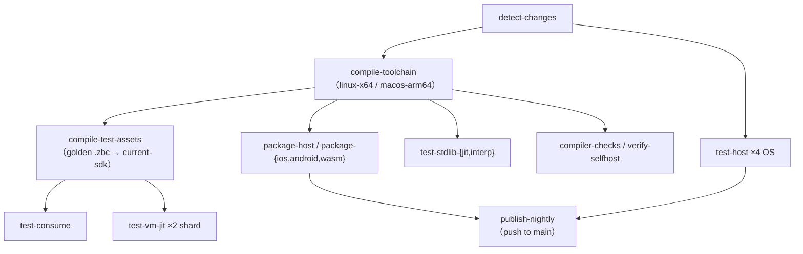

# CI 拓扑与 job 表

> 对齐：2026-09-17（change `restructure-docs-three-books`）｜ 代码：`.github/workflows/ci.yml`、
> `.github/actions/ci-bootstrap/`、`.github/actions/xtask-bootstrap-artifact/`、
> `.github/workflows/{bench-pr,release,deploy-book,jit-fixpoint-check}.yml`
>
> 每个 job 具体跑哪条 `xtask` 命令见[测试怎么跑](testing.md)；gate 的 stage 组成见[测试门禁](test-gate.md)。

改 CI 编排、或者想知道「这条腿为什么没跑 / 我这个改动会触发哪些 job」时读这页。

## 1. 流水线形状



核心思想：**平台无关的东西编一次、下游消费**。`compile-toolchain` 把当前源编成一套
`{z42c, stdlib, xtask}` zpkg 上传成 `toolchain-<os>` artifact；`compile-test-assets` 再消费它
regen 一次 golden `.zbc`、连同 `.z42` 布局打成 `current-sdk-<os>`。下游测试 job 下载这些产物
`--no-build` 跑，不再自己自举、不再重复 regen。

`compile-test-assets` **故意从 `compile-toolchain` 里拆出来**：golden regen 很慢，留在里面会卡住
`package-*` → `publish-nightly` 这条关键路径，而打包根本不消费测试资产。

`test-host` 是例外——它每条腿自己从上一版 nightly 种子完整自举一遍（`ci-bootstrap` action），
这既是 gate 也是「种子能编当前源」这条边界的实测。

## 2. 触发与门控

| 事件 | 行为 |
|---|---|
| `pull_request` / `push` to main | `paths-ignore` 只有 `.claude/**`——**纯文档改动照样跑 CI**（`xtask test docs` 的死链门必须跑到） |
| `schedule`（每日 16:00 UTC） | 无条件全跑，外加只在这里跑的 Tier-2 平台测试 |
| `workflow_dispatch` | 无条件全跑；格式 bump 后手动重发 nightly 的逃生口 |

`detect-changes` 用 `dorny/paths-filter` 输出四个 flag，下游 job `needs: changes` + `if:` 门控：

| flag | 命中路径（节选） |
|---|---|
| `platform` | `src/runtime/**`、`src/toolchain/{workload,launcher,devtools,interactive}/**`、`examples/**`、`docs/learn/**`、`scripts/{package/**,packages.toml,install/**}`、`scripts/test/xtask_test_{dist,platform,wasm,ios,android,desktop,embedded}*.z42`、`versions.toml` |
| `compiler` | `src/compiler/**`、`src/libraries/z42c.core/**`、`src/libraries/z42c.syntax/**`、`src/toolchain/devtools/vscode/**` |
| `vm` | `src/runtime/**` |
| `stdlib` | `src/libraries/**` |

每个 filter 都额外包含 `.github/workflows/ci.yml` 自身 → **改 CI 保底全跑**。
`schedule` / `workflow_dispatch` 下 paths-filter 没有 before-sha 可比、几乎恒 false，所以每条
门控的 `if:` 都显式带 `|| github.event_name == 'schedule' || ... == 'workflow_dispatch'` 逃生口；
少了它，每日全量 sweep 里这些 job 会一个都不跑。

`compiler` filter 覆盖两处不是冗余：z42c 的 member 分散在 `src/compiler/`（后端三包）和
`src/libraries/z42c.*`（词法/语法前端）。只写前者会漏掉整个前端——改 Lexer 加关键字时
`compiler=false`，而专为这种改动存在的 `test vscode-syntax` 恰好被跳过。

> 只有这四个 flag。e2e golden **没有**内容级门控——真要加，得在同一个提交里把消费方
> （某个 job 的 `if:`）一起接上，否则就只是一个没人读的输出，反而让人以为门控存在。

## 3. job 表

job 的 **key**（`needs:` 用的）与 **display 名**（分支保护的 required check 用的）不同名，
下表两列都列出。display 名的约定是 `<动作>-<目标>[-<scope>](<host-arch>)`。

| display 名 | job key | 门控 | 矩阵 |
|---|---|---|---|
| `detect-changes` | `changes` | 总跑 | — |
| `test-host(<plat>)` | `build-and-test` | 总跑 | linux-x64 / linux-arm64 / macos-arm64 / windows-x64 |
| `compile-toolchain(<plat>)` | `toolchain-bootstrap` | 总跑 | linux-x64 / macos-arm64 |
| `compile-test-assets(<plat>)` | `assemble-current-sdk` | 总跑 | linux-x64 / macos-arm64 |
| `test-consume(linux-x64)` | `consume-current-sdk` | 总跑 | — |
| `test-vm-jit(linux-x64) shard k` | `vm-jit-consistency` | `vm ‖ compiler` | 2 shard |
| `test-stdlib-jit(linux-x64) shard k` | `stdlib-jit-consistency` | `vm ‖ stdlib ‖ compiler` | 2 shard |
| `test-stdlib-interp(<plat>)` | `stdlib-interp-consistency` | `vm ‖ stdlib ‖ compiler` | 3 OS，不分片 |
| `verify-selfhost(linux-x64)` | `verify-selfhost` | `compiler` | — |
| `compiler-checks(linux-x64)` | `compiler-checks` | `compiler` | — |
| `verify-features(linux-x64)` | `feature-matrix` | `vm` | — |
| `package-host(<plat>)` | `host-package` | `platform ‖ 非 PR` | linux-x64 / macos-arm64 |
| `package-ios(macos-arm64)` | `package-ios` | `platform ‖ 非 PR` | — |
| `package-android(linux-x64)` | `package-android` | `platform ‖ 非 PR` | — |
| `package-wasm(linux-x64)` | `package-wasm` | `platform ‖ 非 PR` | — |
| `test-desktop-cabi(linux-x64)` | `test-desktop` | `platform ‖ schedule ‖ dispatch` | — |
| `test-wasm-browser(linux-x64) shard k` | `test-wasm` | **仅** schedule ‖ dispatch | 3 shard |
| `test-ios-sim(macos-arm64) shard k` | `test-ios` | **仅** schedule ‖ dispatch | 3 shard |
| `test-android-emu(linux-x64) shard k` | `test-android` | **仅** schedule ‖ dispatch | 3 shard |
| `publish-nightly` | `publish-nightly` | push to main ‖ dispatch | — |

几条不显然的编排理由：

- **`test-vm-jit` 门控带 `compiler`**：z42c 改了 codegen / 优化 pass 会重构 IR，JIT 的**输入**
  就变了；`test-host` 的 interp golden 只覆盖新 `.zbc` 的解释执行，不覆盖它的 JIT lowering。
- **wasm / iOS / Android 的 Tier-2 测试只在 nightly 跑**：每个 15~25 分钟且要模拟器，
  挂在 per-push 上会把 runner 池打满。
- **`package-*` 在 PR 上只有 `platform` 改动才跑**：它们的产物只被 `publish-nightly` 消费，
  而打包机制只受 platform 类改动影响。非-platform PR 因此少 7 个 job，给满负荷跑腾并发余量。
  这些 job 不是 required check，被 `if:` skip 的 required check 在本仓也不阻塞合并。
- **`publish-nightly` 的 `needs` 故意不含 `verify-selfhost` / 两条 jit 腿**：那些 job 在
  zbc/zpkg 格式 bump 那一轮会暂时红（要等一个兼容的 nightly），gate 上去就是死锁。
  「行为正确」由在 `needs` 里的 `test-host` + `package-*` 保证。

`test-host` 各腿用 `--skip` 把 stage 卸给并行 job：linux-x64 跳 `stdlib,compiler,vscode`，
其余 OS 再多跳 `cross-zpkg,bench`（这两者 host 无关，一条腿够了）。Windows 腿不跑
`test all`，只跑 `build test` + `xtask test runtime`。

## 4. 其它 workflow

| 文件 | job | 干什么 |
|---|---|---|
| `bench-pr.yml` | `bench-regression(linux-x64)` | 同 runner A/B 性能门；用窄 `paths:` allowlist，纯文档 PR 天然跳过 |
| `release.yml` | `verify-version` / `package-<rid>` ×9 / `publish-release` | tag 触发的正式发布，见[打包与发版](release.md) |
| `deploy-book.yml` | `build` / `deploy` | 三本书 + 安装脚本发到 GitHub Pages |
| `jit-fixpoint-check.yml` | `jit-fixpoint(<rid>)` | JIT 不动点实验腿 |

## 5. 本地镜像 CI

CI 的分解只为并行，**本地永远整跑**：

```bash
./xtask test                 # 完整 GREEN gate（= CI 各腿 --skip 之前的全集）
```

想缓存昂贵的前段、只反复迭代测试时，照着 CI 的分段来：

```bash
./xtask build sdk            # 编一次当前 SDK → artifacts/.z42
./xtask build test           # 编一次 golden .zbc
./xtask test --no-build      # 消费上面两者，不重编
```

`xtask test changed` 按 `git diff` 只跑受影响的 stage，适合内循环；**它不构成 GREEN**，
push 前仍须完整 `xtask test` 全绿。任何测试失败（含 pre-existing）都不得 commit / push。
