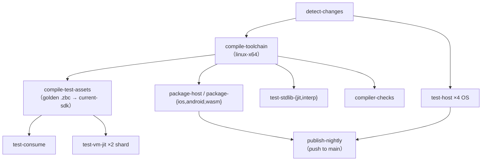

# CI 拓扑与 job 表

> 对齐：2026-09-30（change `speed-up-ci-quick-wins`）｜ 代码：`.github/workflows/ci.yml`、
> `.github/actions/ci-bootstrap/`、`.github/actions/xtask-bootstrap-artifact/`、
> `.github/workflows/{bench-pr,release,deploy-book,jit-fixpoint-check}.yml`
>
> 每个 job 具体跑哪条 `xtask` 命令见[测试怎么跑](testing.md)；gate 的 stage 组成见[测试门禁](test-gate.md)。

改 CI 编排、或者想知道「这条腿为什么没跑 / 我这个改动会触发哪些 job」时读这页。

## 1. 流水线形状


```mermaid
flowchart TD
  C["detect-changes"] --> TB["compile-toolchain<br/>（linux-x64）"]
  C --> TH["test-host ×4 OS"]
  TB --> TA["compile-test-assets<br/>（golden .zbc → current-sdk）"]
  TB --> PKG["package-host / package-{ios,android,wasm}"]
  TA --> CONS["test-consume"]
  TA --> JIT["test-vm-jit ×2 shard"]
  TB --> SL["test-stdlib-{jit,interp}"]
  TB --> CHK["compiler-checks"]
  TH --> PUB["publish-nightly<br/>（push to main）"]
  PKG --> PUB
```

核心思想：**平台无关的东西编一次、下游消费**。`compile-toolchain` 把当前源编成一套
`{z42c, stdlib, xtask}` zpkg 上传成 `toolchain-ubuntu-latest` artifact；`compile-test-assets` 再消费它
regen 一次 golden `.zbc`、连同 `.z42` 布局打成 `current-sdk-ubuntu-latest`。下游测试 job 下载这些产物
`--no-build` 跑，不再自己自举、不再重复 regen。

这两个 job **只有 linux 一条腿**：产物全是 zpkg，与宿主无关，macOS / Windows 的消费方
取的是同一份（只有 z42vm 按宿主 cargo 现编）。

`compile-toolchain` 另传一份 `z42vm-linux-x64`（z42vm + 同目录的 cdylib）。linux-x64 上**之后不再调 cargo**
的消费方（`test stdlib --no-build` 两类 job、`publish-nightly`）用 `xtask-bootstrap-artifact` 的
`prebuilt-vm: "true"` 直接拿它，省掉 Rust 准备与 `cargo build`：rust-cache 只缓存**依赖**，即使 key 精确命中，
z42 crate 本身仍要 fat-LTO 重链一遍，实测约 95 s / job。**会调 cargo 的 job 不能开**——target 目录里没有
cargo 指纹，它会把整个 crate 冷编一遍（`compiler-checks` 的 `test compiler`、`test-vm-jit` 的 debug VM 都属此类）。2026-09-30 前两者都还有一条 macOS 腿——
它产出等价的 artifact，却让所有 `needs:` 它们的 linux 下游陪着等整个 matrix。

`compile-test-assets` **故意从 `compile-toolchain` 里拆出来**：golden regen 很慢，留在里面会卡住
`package-*` → `publish-nightly` 这条关键路径，而打包根本不消费测试资产。

`test-host` 是例外——它每条腿自己从上一版 nightly 种子完整自举一遍（`ci-bootstrap` action），
这既是 gate 也是「种子能编当前源」这条边界的实测。

### 步骤里怎么调 xtask

两个 bootstrap action（`ci-bootstrap` / `xtask-bootstrap-artifact`）结束时都把
[`.github/ci/xtask`](../../../../.github/ci/xtask) 所在目录加进 `$GITHUB_PATH`，之后的步骤一律写

```bash
xtask test all --no-build --skip "$SKIP"
```

**xtask 跑在 `.z42` SDK 上，与本地 `./xtask` 完全一致**（add-sdk-libs D7）。两个 bootstrap action 都先经
[`setup-z42-sdk`](../../../../.github/actions/setup-z42-sdk/action.yml) 把上一版 nightly 装进仓库根 `.z42/`——
与本地 `scripts/install-z42.sh` 同位置同形态；xtask.zpkg 也是用这份 SDK 的 z42c 编的。垫片于是只做本地
apphost 做的事：`.z42/bin/z42vm`（Windows 带 `.exe`）+ `Z42_LIBS=.z42/libs`（调用方设了则尊重）跑
`artifacts/xtask/xtask.zpkg`，**不设** `Z42_PORTABLE_VM` / `Z42_HOME`。

这带来两点：

- **编 xtask 与跑 xtask 是同一个工具链**。之前 CI 用种子编 xtask，却在 cargo 现编的构建树 z42vm 和构建树
  stdlib 上跑它，本地和 CI 不一样。xtask 引用的 SDK 库（`z42.project` / `z42.build`）因此能直接用 SDK 里的，
  不必复制进产物。
- **Windows 不再需要「从拷贝启动」**。以前垫片跑的是构建树的 `z42vm.exe`，`package` 等命令让 cargo 重链它时会
  撞上「不能覆盖正在运行的 exe」。现在 xtask 跑在 SDK 的 VM 上，cargo 碰不到它。

构建树的 z42vm（cargo 现编 / `prebuilt-vm`）仍然要有：那是**被测对象**，xtask 构建、测试当前源码时由它自己去
定位，与本地相同。

`xtask-bootstrap-artifact` 消费的 xtask.zpkg 来自 `compile-toolchain`，是用**那个 job** 装到的 SDK 编的，
同目录的 `seed-id.txt` 记着那份 SDK 的身份。如果两个 job 之间 nightly 被重发了（并发运行的 `publish-nightly`
会这样），本 job 装到的就是新的一版，而跨格式 bump 时旧 xtask.zpkg 在新 VM 上加载不了。所以 action 会比对
`artifacts/xtask/seed-id.txt` 与 `.z42/seed-id.txt`，不一致就用本机 SDK 的 z42c 原地重编 xtask（约 1 分钟）。

⇒ xtask 的启动方式变了，**CI 侧只改这一个文件**。`ci.yml` / `release.yml` / `bench-pr.yml` 全部走它。
例外：`test-consume` 故意用下载来的 current-sdk 里的 z42vm 跑，不走垫片。`bench-pr.yml` 里
`cd base-src && xtask …` 也成立：垫片按**自己所在位置**定位 PR 树的三样东西、不看 cwd，于是跑的仍是
PR 的 xtask，而 xtask 的 `_root()` 取 cwd 的仓库根 = base-src（base 工具链另经 `--base-vm` 等显式传入）。

## 2. 触发与门控

| 事件 | 行为 |
|---|---|
| `pull_request` / `push` to main | `paths-ignore` 只有 `.claude/**`——**纯文档改动照样跑 CI**，但 PR 上走快速通道（见下） |
| `schedule`（每日 16:00 UTC） | 无条件全跑，外加只在这里跑的 Tier-2 平台测试 |
| `workflow_dispatch` | 无条件全跑；格式 bump 后手动重发 nightly 的逃生口 |

**纯文档快速通道**：PR 的改动**全部**是 `docs/**` 或 `*.md`（`docs/learn/**`、`examples/**` 除外——学习手册的
示例会被重放）时，`detect-changes` 输出 `docs_only=true`，只跑 `docs-check`：ci-bootstrap 的 `xtask-only`
模式（种子 z42c 只编出 xtask，省掉 build compiler / stdlib）+ `xtask test docs`（相对链接 + gate stage 清单
↔ `test-gate.md`）+ `xtask test diagcodes`（诊断码 ↔ `error-codes.md`）。读文档的门禁就这几道。
`test-host` ×4 与 toolchain 链（`compile-toolchain` → `compile-test-assets` / `test-consume`）随之 skip。
push / schedule / dispatch 不走快速通道。

`detect-changes` 用 `dorny/paths-filter` 输出 flag，下游 job `needs: changes` + `if:` 门控：

| flag | 命中路径（节选） |
|---|---|
| `platform` | `src/runtime/**`、`src/toolchain/{workload,launcher,devtools,interactive,builder}/**`、`scripts/{package/**,packages.toml,install/**}`、`scripts/test/xtask_test_{dist,platform,wasm,ios,android,desktop,embedded}*.z42`、`scripts/versions.toml` |
| `examples` | `examples/**`、`docs/learn/**`（只门控 `package-host`——唯一用打包 SDK 重放示例的 job） |
| `compiler` | `src/compiler/**`、`src/toolchain/devtools/vscode/**` |
| `vm` | `src/runtime/**`、`.cargo/**` |
| `stdlib` | `src/libraries/**`、`src/toolchain/builder/**`（z42b 是 [Test] 执行器）、`scripts/test/xtask_test_lib*.z42` |

`src/toolchain/builder/**` 同时在 `platform` 与 `stdlib` 里：z42b 既是 [Test] 执行器，它的 `publish`
（apphost / iOS / Android 导出）又只在 `package-*` 里被执行。只挂 `stdlib` 时，#978 把 Windows apphost
的嵌入路径改坏而 PR 全绿，合入 main 才在 `package-host(windows-x64)` 炸（#981）。

每个 filter 都额外包含 `.github/workflows/ci.yml` 自身 → **改 CI 保底全跑**。
`schedule` / `workflow_dispatch` 下 paths-filter 没有 before-sha 可比、几乎恒 false，所以每条
门控的 `if:` 都显式带 `|| github.event_name == 'schedule' || ... == 'workflow_dispatch'` 逃生口；
少了它，每日全量 sweep 里这些 job 会一个都不跑。

编译器域（z42c 前后端 + `z42.project` / `z42.build` / `z42.package`）已全部在 `src/compiler/` 下，
`compiler` 一条通配即可。`examples` 单独成 flag 而不并进 `platform`：否则改一页 learn 会拉起
`package-{ios,android,wasm}` + `test-desktop`，而它们一个示例都不跑。

> 只有这五个 flag。e2e golden **没有**内容级门控——真要加，得在同一个提交里把消费方
> （某个 job 的 `if:`）一起接上，否则就只是一个没人读的输出，反而让人以为门控存在。

## 3. job 表

job 的 **key**（`needs:` 用的）与 **display 名**（分支保护的 required check 用的）不同名，
下表两列都列出。display 名的约定是 `<动作>-<目标>[-<scope>](<host-arch>)`。

| display 名 | job key | 门控 | 矩阵 |
|---|---|---|---|
| `detect-changes` | `changes` | 总跑 | — |
| `docs-check(linux-x64)` | `docs-check` | **仅**纯文档 PR | — |
| `test-host(<plat>)` | `build-and-test` | 非纯文档 PR | linux-x64 / linux-arm64 / macos-arm64 / windows-x64 |
| `compile-toolchain(linux-x64)` | `toolchain-bootstrap` | 非纯文档 PR | — |
| `compile-test-assets(linux-x64)` | `assemble-current-sdk` | 随 `compile-toolchain` | — |
| `test-consume(linux-x64)` | `consume-current-sdk` | 随 `compile-test-assets` | — |
| `test-vm-jit(linux-x64) shard k` | `vm-jit-consistency` | `vm ‖ compiler` | 2 shard |
| `test-stdlib-jit(linux-x64) shard k` | `stdlib-jit-consistency` | `vm ‖ stdlib ‖ compiler` | 2 shard |
| `test-stdlib-interp(<plat>)` | `stdlib-interp-consistency` | `vm ‖ stdlib ‖ compiler` | 3 OS，不分片 |
| `compiler-checks(linux-x64)` | `compiler-checks` | `compiler` | — |
| `package-host(<plat>)` | `host-package` | `platform ‖ examples ‖ 非 PR` | linux-x64 / linux-arm64 / macos-arm64 / windows-x64 |
| `package-ios(macos-arm64)` | `package-ios` | `platform ‖ 非 PR` | — |
| `package-android(linux-x64)` | `package-android` | `platform ‖ 非 PR` | — |
| `package-wasm(linux-x64)` | `package-wasm` | `platform ‖ 非 PR` | — |
| `test-desktop-cabi(linux-x64)` | `test-desktop` | `platform ‖ schedule ‖ dispatch` | — |
| `test-wasm-browser(linux-x64) shard k` | `test-wasm` | **仅** schedule ‖ dispatch | 3 shard |
| `test-ios-sim(macos-arm64) shard k` | `test-ios` | **仅** schedule ‖ dispatch | 3 shard |
| `test-android-emu(linux-x64) shard k` | `test-android` | **仅** schedule ‖ dispatch | 3 shard |
| `publish-nightly` | `publish-nightly` | push to main ‖ dispatch | — |
| `ci-ok` | `ci-ok` | 总跑（`if: always()`） | — |

**`ci-ok` 是本 workflow 的单一结论**：`needs` 全部其它 job，任一 failure / cancelled 即红，success / skipped
即绿。分支保护只要求它一个就够——逐个列 job 的写法在新增 / 改名 job 时会漏（`verify-selfhost` 删掉后保护里
还挂着它，PR 一直等不到这个 check）。`if: always()` 是关键：没有它，上游一红它就被 skip，而被 skip 的
required check 视同通过。新增 job 时记得加进它的 `needs`。

几条不显然的编排理由：

- **`test-vm-jit` 门控带 `compiler`**：z42c 改了 codegen / 优化 pass 会重构 IR，JIT 的**输入**
  就变了；`test-host` 的 interp golden 只覆盖新 `.zbc` 的解释执行，不覆盖它的 JIT lowering。
- **wasm / iOS / Android 的 Tier-2 测试只在 nightly 跑**：每个 15~25 分钟且要模拟器，
  挂在 per-push 上会把 runner 池打满。
- **`package-*` 在 PR 上只有 `platform` 改动才跑**：它们的产物只被 `publish-nightly` 消费，
  而打包机制只受 platform 类改动影响。非-platform PR 因此少 7 个 job，给满负荷跑腾并发余量。
  这些 job 不是 required check，被 `if:` skip 的 required check 在本仓也不阻塞合并。
- **`publish-nightly` 的 `needs` 故意不含两条 jit 腿**：那些 job 在
  zbc/zpkg 格式 bump 那一轮会暂时红（要等一个兼容的 nightly），gate 上去就是死锁。
  「行为正确」由在 `needs` 里的 `test-host` + `package-*` 保证。

- **没有专门的「种子自举边界」job**：「上一版 nightly 能编当前源」由每个跑 `ci-bootstrap` 的
  job（`test-host` ×4 OS、`compile-toolchain`）顺带实测，且它们会真的**运行**刚建出的 gen1 z42c
  （编 stdlib + golden）；in-tree 不动点 gen1==gen2 在 `compiler-checks`。原先的 `verify-selfhost`
  = `ci-bootstrap` + `test compiler`，两半都与上述重复，2026-09-30 删除。
- **没有专门的 feature 组合 job**：曾有 `verify-features`（host 上 `cargo check` interp-only / wasm / ios /
  android 四个组合），而后三者 `package-*` 本就在真实目标平台上完整构建；它独有的「interp-only 不含
  cranelift」断言挪进了 `package-wasm`，2026-10-02 删除（drop-feature-matrix）。`.cargo/**` 随之并入
  `platform` 过滤器。

`test-host` 各腿用 `--skip` 把 stage 卸给并行 job：linux-x64 跳 `stdlib,compiler,vscode`，
其余 OS 再多跳 `cross-zpkg,bench`（这两者 host 无关，一条腿够了）。Windows 腿不跑
`test all`，只跑 `build test` + `xtask test runtime`。三条非 Windows 腿在 `test all` 之后
跑 **zbc-format 字节基线门**（`git diff --quiet -- src/compiler/z42.package/tests/fixtures/zbc-format`；regen 就地重写了基线，
有 diff = 提交的基线过期）——一次覆盖三个架构，且挂在 required check 上。

### 3.0 PR 的绿是「过期快照」——与抢号预检

**一个 PR 的绿灯说的是：它的 head 与「那次 run 触发时」的 base 合起来是绿的。**
`actions/checkout` 在 `pull_request` 事件下拿的是 merge ref，所以跑的确实是合并结果；
但 **base 后来前进不会自动重跑**。于是两个并行 PR 可以各自全绿、双双合入、main 才红。

实测（2026-09-22）：#747 在 13:43:15 合入 main，#759 在 13:46:00 合入而它的 `baseRefOid`
还停在 #761 —— 两边的绿都不含对方，两个 PR 各拿走了同一个诊断码号 `E0481`，
[诊断码唯一性](test-gate.md)的门在各自的 base 上都看不见冲突，`main` 才红（#762 收拾残局）。

根治是分支保护的 **`require branches to be up to date before merging`**（当前 `strict: false`，
**有意不开**）：它要求每个 PR 合并前 rebase 并重跑**整套**自举/多平台 CI，把并行开发串行化，
对这条 CI 太贵。

替代是 `test-host(linux-x64)` 末尾的 **抢号预检** 步骤：GREEN 已经跑完、树可以随便动，
于是 `git merge` 进**最新** main，重跑一次纯文本扫描的 `xtask test diagcodes`（秒级）。
窗口从「PR 的整个生命周期」缩到「最后一次 CI 到合并之间」；**按下 merge 前重跑一次这个 job
就能把窗口压到近零**。挖不到共同祖先（浅克隆）或与 main 有文本冲突时它**放行**——
前者是环境限制，后者 GitHub 本身已经挡住合并，不重复报警。

> ⭐ **为什么挂在既有的 required job 末尾、而不是新开一个 job**：新增的 job 默认**不是**
> required check ⇒ 不挡合并 ⇒ 又是一个「会红但不挡人的门」（[测试门禁](test-gate.md)里对
> 「它真会红吗 / 它真挡得住人吗」的讨论同理）。`test-host(linux-x64)` 已经是 required、且无路径过滤必跑。
> 同理，这个思路可以推广到**任何「两个 PR 各自合法、合起来才错」的维度**——加判据时想的应该是
> 「挂到哪个已经在挡人的 job 上」，而不是「新开一个 job」。

### 3.0.1 Rust 缓存 key

Swatinem `rust-cache` 用 `shared-key` 跨 job 共享；**一个 key 命中后不回存**（post 步骤报
"Cache up-to-date"）。所以两个构建集合不同的 job 共用一个 key，后写的那个多编的东西永远进不了
缓存。规则：**构建集合不同 ⇒ key 不同**。

| key | 用它的 job | 构建集合 |
|---|---|---|
| `test-host-v1` | `test-host` | release + debug + test profile |
| `host-v2` | `compile-toolchain` | release（ci-bootstrap） |
| `artifact-host-v1` | `xtask-bootstrap-artifact` 默认 | release workspace |
| `package-host-v2` / `ios-v2` / `android-v2` / `wasm-v2` | 各打包 job | + cdylib / staticlib / 交叉编译 |

⚠️ target 目录由根 `.cargo/config.toml` 统一重定向到 `artifacts/build/runtime`，**所有** job 的
`workspaces` 都要写 `src/runtime -> ../../artifacts/build/runtime`——写裸 `src/runtime` 缓存的是
一个空目录（`verify-features` 曾这样白缓存了很久）。

## 3.1 自举种子从哪来（以及它怎么死锁过一次）

**每个**跑 xtask 的 job（`ci-bootstrap` 与 `xtask-bootstrap-artifact` 两条路径都一样）都要先经
[`setup-z42-sdk`](../../../../.github/actions/setup-z42-sdk/action.yml) 拿一份上一版 SDK，装进 `.z42/`。
它既是 xtask 运行所在的 SDK，也是 **z42c 种子**：用它编当前源码，xtask 的 `_seedSdkDir` 会自己找到 `./.z42`。
取用顺序如下：

```
nightly release 的 z42-sdk-nightly-<rid>          （首选，10 次重试）
  ↓ 下载不到，或包里没有 programs/z42c/
最近 5 次成功 CI 运行的 release-host-<rid> artifact（回退，逐个试；内含 z42-sdk-nightly-<rid> 归档）
  ↓ 全都过期 / 没有本 RID
报错退出（错误信息带人工恢复指引）
```

**回退为什么是安全的**：自举纪律（[bootstrap-seed.md](../../../agent/rules/bootstrap-seed.md)）
保证「上一版 z42c 永远能编当前源码」——新语法与格式 bump 都是 support 先行、晚一个
nightly 再 use。成功 CI 运行的产物顶多落后一两个 commit，牢牢在这条**单向递推**的纪律内。

> 🔴 **回退目标必须是 CI artifact，不能是「最近的正式 release」。**
> 第一版就是那么写的，实测**救不回来**：正式 release 可能落后很多个 zpkg 格式 bump
> （2026-09-17 那次 v0.5.0 是 minor 43、当时源码 48，差 5 个），会触发 [1.5] 两代自举；
> 而两代自举**全程用种子自带的旧 VM**，它加载不了 gen1 产出的新格式 stdlib——
> run 35290607109 的日志就停在
> `z42.core.zpkg … zpkg minor 48 not supported (writer is at 0.43)`。
> 成功 CI 运行的 artifact 格式天然对得上，**根本不进两代路径**。
>
> 附带一个好处：不依赖 release 是否被正确发布（artifact 里就是 package job 出好的同一份归档）。保留期 90 天，所以逐个试最近 5 次。

> ⚠️ **权限**：这条回退要 token 的 `actions: read`。仓库默认 workflow 权限是 read（含 actions），
> 但自定义了 `permissions:` 块的 job（`publish-nightly`、`test-*` 平台测试、`release.yml`、
> `jit-fixpoint-check.yml`）**必须显式带上 `actions: read`**，否则回退会静默失效。现有的这些 job 都已带上，
> 新加 `permissions:` 时别漏。

> ⚠️ 按 RID **后缀**挑目录（`z42-*-<rid>-release`），不要硬编码 runner 标签
> （`ubuntu-latest` / `macos-26` 这些会变，包名由 packaging 决定、稳定）。

### 为什么必须有回退（2026-09-17 的事故）

nightly 曾是**唯一**种子来源。那天 `publish-nightly` 的
`gh release delete nightly` → `gh release create nightly` 跑到一半，整个 workflow 被
下一个 push 取消，留下一个**残缺的 draft nightly**（有 4 个资产，但没有任何 SDK 包）。

于是：所有 bootstrap job 拿不到种子 → 全红 → `package-*` / `publish-nightly` 被 skip
→ **发不出新 nightly 自救**。

而 `workflow_dispatch` 那个逃生口**在同一个环里**——`publish-nightly` 的 `needs` 全是
bootstrap job。实测（run 35287940676）照样全红。

⇒ 破环只能靠**种子有第二来源**。这就是回退链存在的理由。

**当时是怎么解开的**（回退链上线前的人工流程，也是错误信息里指的那条）：

1. `gh run list --workflow CI --branch main --status success --limit 5` 找最近一次全绿的 run
2. `gh run download <run> -p 'release-*' -D artifacts/packages/archives` 取它的归档（各 package job 已用
   `xtask package archive --label nightly` 在自己的 runner 上出好）
3. `xtask package finalize nightly --channel nightly --tag nightly --version nightly`
   （合并 desktop workload → `SHA256SUMS` → `release-index.json`，与 `publish-nightly` 同一条命令）
4. `gh release delete nightly --cleanup-tag` → `gh release create nightly --prerelease`
   → `gh release edit nightly --draft=false` 并校验非 draft

发布前务必逐个核对 SDK 包**真的带种子**：解包后 `programs/z42c/*.zpkg` 非空、
`bin/z42vm` 在、`z42c.driver.zpkg` 的 zpkg minor 与当前源码一致
（`od -An -tu2 -j6 -N2` 读，源码侧看 `z42.package/src/ZpkgWriter.z42` 的 `Minor`）。
minor 不一致就会把所有 job 推进两代自举那条已知会挂的路。

### 残留缺口：publish-nightly 仍可能被取消打断

`publish-nightly` 的 `concurrency.cancel-in-progress: false` 只序列化**该 job 自身**的
并发，**挡不住新 push 取消整个 run**。delete→create 之间被砍，仍会留下 stuck-draft。
回退链让这件事不再致命（CI 能继续跑、并自动重发健康 nightly），但根因未除。

## 4. 其它 workflow

| 文件 | job | 干什么 |
|---|---|---|
| `bench-pr.yml` | `bench-regression(linux-x64)` | 同 runner A/B 性能门；用窄 `paths:` allowlist，纯文档 PR 天然跳过 |
| `release.yml` | `verify-version` / `package-<rid>` ×9 / `publish-release` | tag 触发的正式发布，见[打包与发版](release.md) |
| `deploy-book.yml` | `build` / `deploy` | 三本书 + 安装脚本发到 GitHub Pages |
| `jit-fixpoint-check.yml` | `jit-fixpoint(<rid>)` | JIT 不动点实验腿 |

## 5. 本地镜像 CI

CI 的分解只为并行，**本地永远整跑**：

```bash
./xtask test                 # 完整 GREEN gate（= CI 各腿 --skip 之前的全集）
```

想缓存昂贵的前段、只反复迭代测试时，照着 CI 的分段来：

```bash
./xtask build sdk            # 编一次当前 SDK → artifacts/.z42
./xtask build test           # 编一次 golden .zbc
./xtask test --no-build      # 消费上面两者，不重编
```

`xtask test changed` 按 `git diff` 只跑受影响的 stage，适合内循环；**它不构成 GREEN**，
push 前仍须完整 `xtask test` 全绿。任何测试失败（含 pre-existing）都不得 commit / push。
