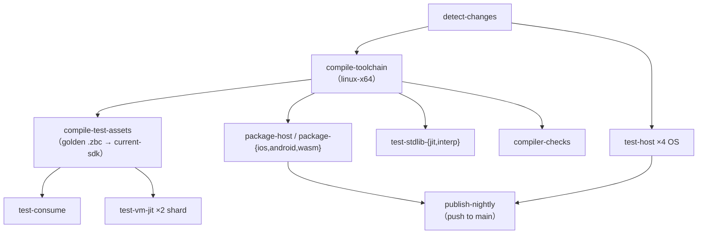

# CI 拓扑与 job 表

> 对齐：2026-09-30（change `speed-up-ci-quick-wins`）｜ 代码：`.github/workflows/ci.yml`、
> `.github/actions/ci-bootstrap/`、`.github/actions/xtask-bootstrap-artifact/`、
> `.github/workflows/{bench-pr,release,deploy-book,jit-fixpoint-check}.yml`
>
> 每个 job 具体跑哪条 `xtask` 命令见[测试怎么跑](testing.md)；gate 的 stage 组成见[测试门禁](test-gate.md)。

改 CI 编排、或者想知道「这条腿为什么没跑 / 我这个改动会触发哪些 job」时读这页。

## 1. 流水线形状


```mermaid
flowchart TD
  C["detect-changes"] --> TB["compile-toolchain<br/>（linux-x64）"]
  C --> TH["test-host ×4 OS"]
  TB --> TA["compile-test-assets<br/>（golden .zbc → current-sdk）"]
  TB --> PKG["package-host / package-{ios,android,wasm}"]
  TA --> CONS["test-consume"]
  TA --> JIT["test-vm-jit ×2 shard"]
  TB --> SL["test-stdlib-{jit,interp}"]
  TB --> CHK["compiler-checks"]
  TH --> PUB["publish-nightly<br/>（push to main）"]
  PKG --> PUB
```

核心思想：**平台无关的东西编一次、下游消费**。`compile-toolchain` 把当前源编成一套
`{z42c, stdlib, xtask}` zpkg 上传成 `toolchain-ubuntu-latest` artifact；`compile-test-assets` 再消费它
regen 一次 golden `.zbc`、连同 `.z42` 布局打成 `current-sdk-ubuntu-latest`。下游测试 job 下载这些产物
`--no-build` 跑，不再自己自举、不再重复 regen。

这两个 job **只有 linux 一条腿**：产物全是 zpkg，与宿主无关，macOS / Windows 的消费方
取的是同一份（只有 z42vm 按宿主 cargo 现编）。2026-09-30 前两者都还有一条 macOS 腿——
它产出等价的 artifact，却让所有 `needs:` 它们的 linux 下游陪着等整个 matrix。

`compile-test-assets` **故意从 `compile-toolchain` 里拆出来**：golden regen 很慢，留在里面会卡住
`package-*` → `publish-nightly` 这条关键路径，而打包根本不消费测试资产。

`test-host` 是例外——它每条腿自己从上一版 nightly 种子完整自举一遍（`ci-bootstrap` action），
这既是 gate 也是「种子能编当前源」这条边界的实测。

### 步骤里怎么调 xtask

两个 bootstrap action（`ci-bootstrap` / `xtask-bootstrap-artifact`）结束时都把
[`.github/ci/xtask`](../../../../.github/ci/xtask) 所在目录加进 `$GITHUB_PATH`，之后的步骤一律写

```bash
xtask test all --no-build --skip "$SKIP"
```

这个垫片封装了三个位置（release z42vm / flat stdlib / `xtask.zpkg`）与两处平台差异：
Windows 的 `.exe` 后缀，以及 Windows **不能覆盖正在运行的 exe**——`package` 等命令会让 cargo
重链 `z42vm.exe`，所以 Windows 上它每次都从 cargo 输出目录之外的一份拷贝启动。
`Z42_PORTABLE_VM` / `Z42_LIBS` 只在调用方没设时给默认值。

⇒ 构建产物布局变了，**CI 侧只改这一个文件**。例外：`test-consume` 故意用下载来的
current-sdk 里的 z42vm 跑，不走垫片；`bench-pr.yml` / `release.yml` 尚未迁移（前者同一 job
里要分别驱动 base 与 PR 两棵树）。

## 2. 触发与门控

| 事件 | 行为 |
|---|---|
| `pull_request` / `push` to main | `paths-ignore` 只有 `.claude/**`——**纯文档改动照样跑 CI**（`xtask test docs` 的死链门必须跑到） |
| `schedule`（每日 16:00 UTC） | 无条件全跑，外加只在这里跑的 Tier-2 平台测试 |
| `workflow_dispatch` | 无条件全跑；格式 bump 后手动重发 nightly 的逃生口 |

`detect-changes` 用 `dorny/paths-filter` 输出四个 flag，下游 job `needs: changes` + `if:` 门控：

| flag | 命中路径（节选） |
|---|---|
| `platform` | `src/runtime/**`、`src/toolchain/{workload,launcher,devtools,interactive}/**`、`examples/**`、`docs/learn/**`、`scripts/{package/**,packages.toml,install/**}`、`scripts/test/xtask_test_{dist,platform,wasm,ios,android,desktop,embedded}*.z42`、`versions.toml` |
| `examples` | `examples/**`、`docs/learn/**`（只门控 `package-host`——唯一用打包 SDK 重放示例的 job） |
| `compiler` | `src/compiler/**`、`src/toolchain/devtools/vscode/**` |
| `vm` | `src/runtime/**`、`.cargo/**` |
| `stdlib` | `src/libraries/**`、`src/toolchain/builder/**`（z42b 是 [Test] 执行器）、`scripts/test/xtask_test_lib*.z42` |

每个 filter 都额外包含 `.github/workflows/ci.yml` 自身 → **改 CI 保底全跑**。
`schedule` / `workflow_dispatch` 下 paths-filter 没有 before-sha 可比、几乎恒 false，所以每条
门控的 `if:` 都显式带 `|| github.event_name == 'schedule' || ... == 'workflow_dispatch'` 逃生口；
少了它，每日全量 sweep 里这些 job 会一个都不跑。

编译器域（z42c 前后端 + `z42.project` / `z42.build` / `z42.package`）已全部在 `src/compiler/` 下，
`compiler` 一条通配即可。`examples` 单独成 flag 而不并进 `platform`：否则改一页 learn 会拉起
`package-{ios,android,wasm}` + `test-desktop`，而它们一个示例都不跑。

> 只有这五个 flag。e2e golden **没有**内容级门控——真要加，得在同一个提交里把消费方
> （某个 job 的 `if:`）一起接上，否则就只是一个没人读的输出，反而让人以为门控存在。

## 3. job 表

job 的 **key**（`needs:` 用的）与 **display 名**（分支保护的 required check 用的）不同名，
下表两列都列出。display 名的约定是 `<动作>-<目标>[-<scope>](<host-arch>)`。

| display 名 | job key | 门控 | 矩阵 |
|---|---|---|---|
| `detect-changes` | `changes` | 总跑 | — |
| `test-host(<plat>)` | `build-and-test` | 总跑 | linux-x64 / linux-arm64 / macos-arm64 / windows-x64 |
| `compile-toolchain(linux-x64)` | `toolchain-bootstrap` | 总跑 | — |
| `compile-test-assets(linux-x64)` | `assemble-current-sdk` | 总跑 | — |
| `test-consume(linux-x64)` | `consume-current-sdk` | 总跑 | — |
| `test-vm-jit(linux-x64) shard k` | `vm-jit-consistency` | `vm ‖ compiler` | 2 shard |
| `test-stdlib-jit(linux-x64) shard k` | `stdlib-jit-consistency` | `vm ‖ stdlib ‖ compiler` | 2 shard |
| `test-stdlib-interp(<plat>)` | `stdlib-interp-consistency` | `vm ‖ stdlib ‖ compiler` | 3 OS，不分片 |
| `compiler-checks(linux-x64)` | `compiler-checks` | `compiler` | — |
| `verify-features(linux-x64)` | `feature-matrix` | `vm` | — |
| `package-host(<plat>)` | `host-package` | `platform ‖ examples ‖ 非 PR` | linux-x64 / linux-arm64 / macos-arm64 / windows-x64 |
| `package-ios(macos-arm64)` | `package-ios` | `platform ‖ 非 PR` | — |
| `package-android(linux-x64)` | `package-android` | `platform ‖ 非 PR` | — |
| `package-wasm(linux-x64)` | `package-wasm` | `platform ‖ 非 PR` | — |
| `test-desktop-cabi(linux-x64)` | `test-desktop` | `platform ‖ schedule ‖ dispatch` | — |
| `test-wasm-browser(linux-x64) shard k` | `test-wasm` | **仅** schedule ‖ dispatch | 3 shard |
| `test-ios-sim(macos-arm64) shard k` | `test-ios` | **仅** schedule ‖ dispatch | 3 shard |
| `test-android-emu(linux-x64) shard k` | `test-android` | **仅** schedule ‖ dispatch | 3 shard |
| `publish-nightly` | `publish-nightly` | push to main ‖ dispatch | — |

几条不显然的编排理由：

- **`test-vm-jit` 门控带 `compiler`**：z42c 改了 codegen / 优化 pass 会重构 IR，JIT 的**输入**
  就变了；`test-host` 的 interp golden 只覆盖新 `.zbc` 的解释执行，不覆盖它的 JIT lowering。
- **wasm / iOS / Android 的 Tier-2 测试只在 nightly 跑**：每个 15~25 分钟且要模拟器，
  挂在 per-push 上会把 runner 池打满。
- **`package-*` 在 PR 上只有 `platform` 改动才跑**：它们的产物只被 `publish-nightly` 消费，
  而打包机制只受 platform 类改动影响。非-platform PR 因此少 7 个 job，给满负荷跑腾并发余量。
  这些 job 不是 required check，被 `if:` skip 的 required check 在本仓也不阻塞合并。
- **`publish-nightly` 的 `needs` 故意不含两条 jit 腿**：那些 job 在
  zbc/zpkg 格式 bump 那一轮会暂时红（要等一个兼容的 nightly），gate 上去就是死锁。
  「行为正确」由在 `needs` 里的 `test-host` + `package-*` 保证。

- **没有专门的「种子自举边界」job**：「上一版 nightly 能编当前源」由每个跑 `ci-bootstrap` 的
  job（`test-host` ×4 OS、`compile-toolchain`）顺带实测，且它们会真的**运行**刚建出的 gen1 z42c
  （编 stdlib + golden）；in-tree 不动点 gen1==gen2 在 `compiler-checks`。原先的 `verify-selfhost`
  = `ci-bootstrap` + `test compiler`，两半都与上述重复，2026-09-30 删除。
- **`verify-features` 用 `cargo check`**：它只回答「各 feature 组合编不编得过」，fat-LTO 的
  release 链接纯属浪费。

`test-host` 各腿用 `--skip` 把 stage 卸给并行 job：linux-x64 跳 `stdlib,compiler,vscode`，
其余 OS 再多跳 `cross-zpkg,bench`（这两者 host 无关，一条腿够了）。Windows 腿不跑
`test all`，只跑 `build test` + `xtask test runtime`。三条非 Windows 腿在 `test all` 之后
跑 **zbc-format 字节基线门**（`git diff --quiet -- src/tests/zbc-format`；regen 就地重写了基线，
有 diff = 提交的基线过期）——一次覆盖三个架构，且挂在 required check 上。

### 3.0 PR 的绿是「过期快照」——与抢号预检

**一个 PR 的绿灯说的是：它的 head 与「那次 run 触发时」的 base 合起来是绿的。**
`actions/checkout` 在 `pull_request` 事件下拿的是 merge ref，所以跑的确实是合并结果；
但 **base 后来前进不会自动重跑**。于是两个并行 PR 可以各自全绿、双双合入、main 才红。

实测（2026-09-22）：#747 在 13:43:15 合入 main，#759 在 13:46:00 合入而它的 `baseRefOid`
还停在 #761 —— 两边的绿都不含对方，两个 PR 各拿走了同一个诊断码号 `E0481`，
[诊断码唯一性](test-gate.md)的门在各自的 base 上都看不见冲突，`main` 才红（#762 收拾残局）。

根治是分支保护的 **`require branches to be up to date before merging`**（当前 `strict: false`，
**有意不开**）：它要求每个 PR 合并前 rebase 并重跑**整套**自举/多平台 CI，把并行开发串行化，
对这条 CI 太贵。

替代是 `test-host(linux-x64)` 末尾的 **抢号预检** 步骤：GREEN 已经跑完、树可以随便动，
于是 `git merge` 进**最新** main，重跑一次纯文本扫描的 `xtask test diagcodes`（秒级）。
窗口从「PR 的整个生命周期」缩到「最后一次 CI 到合并之间」；**按下 merge 前重跑一次这个 job
就能把窗口压到近零**。挖不到共同祖先（浅克隆）或与 main 有文本冲突时它**放行**——
前者是环境限制，后者 GitHub 本身已经挡住合并，不重复报警。

> ⭐ **为什么挂在既有的 required job 末尾、而不是新开一个 job**：新增的 job 默认**不是**
> required check ⇒ 不挡合并 ⇒ 又是一个「会红但不挡人的门」（[测试门禁](test-gate.md)里对
> 「它真会红吗 / 它真挡得住人吗」的讨论同理）。`test-host(linux-x64)` 已经是 required、且无路径过滤必跑。
> 同理，这个思路可以推广到**任何「两个 PR 各自合法、合起来才错」的维度**——加判据时想的应该是
> 「挂到哪个已经在挡人的 job 上」，而不是「新开一个 job」。

### 3.0.1 Rust 缓存 key

Swatinem `rust-cache` 用 `shared-key` 跨 job 共享；**一个 key 命中后不回存**（post 步骤报
"Cache up-to-date"）。所以两个构建集合不同的 job 共用一个 key，后写的那个多编的东西永远进不了
缓存。规则：**构建集合不同 ⇒ key 不同**。

| key | 用它的 job | 构建集合 |
|---|---|---|
| `test-host-v1` | `test-host` | release + debug + test profile |
| `host-v2` | `compile-toolchain` | release（ci-bootstrap） |
| `artifact-host-v1` | `xtask-bootstrap-artifact` 默认 | release workspace |
| `package-host-v2` / `ios-v2` / `android-v2` / `wasm-v2` | 各打包 job | + cdylib / staticlib / 交叉编译 |
| `feature-matrix-v2` | `verify-features` | 4 个 feature 组合的 check |

⚠️ target 目录由根 `.cargo/config.toml` 统一重定向到 `artifacts/build/runtime`，**所有** job 的
`workspaces` 都要写 `src/runtime -> ../../artifacts/build/runtime`——写裸 `src/runtime` 缓存的是
一个空目录（`verify-features` 曾这样白缓存了很久）。

## 3.1 自举种子从哪来（以及它怎么死锁过一次）

**每条** bootstrap 路径（`build-and-test` / `host-package` / `package-*` /
`toolchain-bootstrap`，都经 `.github/actions/ci-bootstrap`）都要先拿一个 **z42c 种子**，
用它编当前源码。种子的取用顺序：

```
nightly release 的 z42-sdk-nightly-<rid>          （首选，10 次重试）
  ↓ 下载不到，或包里没有 programs/z42c/
最近 5 次成功 CI 运行的 z42-host-package-* artifact （回退，逐个试）
  ↓ 全都过期 / 没有本 RID
报错退出（错误信息带人工恢复指引）
```

**回退为什么是安全的**：自举纪律（[bootstrap-seed.md](../../../agent/rules/bootstrap-seed.md)）
保证「上一版 z42c 永远能编当前源码」——新语法与格式 bump 都是 support 先行、晚一个
nightly 再 use。成功 CI 运行的产物顶多落后一两个 commit，牢牢在这条**单向递推**的纪律内。

> 🔴 **回退目标必须是 CI artifact，不能是「最近的正式 release」。**
> 第一版就是那么写的，实测**救不回来**：正式 release 可能落后很多个 zpkg 格式 bump
> （2026-09-17 那次 v0.5.0 是 minor 43、当时源码 48，差 5 个），会触发 [1.5] 两代自举；
> 而两代自举**全程用种子自带的旧 VM**，它加载不了 gen1 产出的新格式 stdlib——
> run 35290607109 的日志就停在
> `z42.core.zpkg … zpkg minor 48 not supported (writer is at 0.43)`。
> 成功 CI 运行的 artifact 格式天然对得上，**根本不进两代路径**。
>
> 附带两个好处：artifact 里是**已解包**的 SDK 目录（免 tar/zip 与 EXT 分支）；
> 也不依赖 release 是否被正确发布。保留期 90 天，所以逐个试最近 5 次。

> ⚠️ **权限**：这条回退要 token 的 `actions: read`。仓库默认 workflow 权限是 read
> （含 actions），且用 `ci-bootstrap` 的 job 目前都没有自定义 `permissions:` 块。
> **将来若给这些 job 加 `permissions:`，必须显式带上 `actions: read`**，否则回退静默失效。

> ⚠️ 按 RID **后缀**挑目录（`z42-*-<rid>-release`），不要硬编码 runner 标签
> （`ubuntu-latest` / `macos-26` 这些会变，包名由 packaging 决定、稳定）。

### 为什么必须有回退（2026-09-17 的事故）

nightly 曾是**唯一**种子来源。那天 `publish-nightly` 的
`gh release delete nightly` → `gh release create nightly` 跑到一半，整个 workflow 被
下一个 push 取消，留下一个**残缺的 draft nightly**（有 4 个资产，但没有任何 SDK 包）。

于是：所有 bootstrap job 拿不到种子 → 全红 → `package-*` / `publish-nightly` 被 skip
→ **发不出新 nightly 自救**。

而 `workflow_dispatch` 那个逃生口**在同一个环里**——`publish-nightly` 的 `needs` 全是
bootstrap job。实测（run 35287940676）照样全红。

⇒ 破环只能靠**种子有第二来源**。这就是回退链存在的理由。

**当时是怎么解开的**（回退链上线前的人工流程，也是错误信息里指的那条）：

1. `gh run list --workflow CI --branch main --status success --limit 5` 找最近一次全绿的 run
2. `gh run download <run> -p 'z42-*'` 取它的 `z42-host-package-*` / `z42-*-packages` 产物
3. 按 `publish-nightly` 的原样流程重新打包（打平 → 逐 RID 归档 →
   `xtask package workload nightly` → `SHA256SUMS` → `xtask package index nightly`）
4. `gh release delete nightly --cleanup-tag` → `gh release create nightly --prerelease`
   → `gh release edit nightly --draft=false` 并校验非 draft

发布前务必逐个核对 SDK 包**真的带种子**：解包后 `programs/z42c/*.zpkg` 非空、
`bin/z42vm` 在、`z42c.driver.zpkg` 的 zpkg minor 与当前源码一致
（`od -An -tu2 -j6 -N2` 读，源码侧看 `z42.package/src/ZpkgWriter.z42` 的 `Minor`）。
minor 不一致就会把所有 job 推进两代自举那条已知会挂的路。

### 残留缺口：publish-nightly 仍可能被取消打断

`publish-nightly` 的 `concurrency.cancel-in-progress: false` 只序列化**该 job 自身**的
并发，**挡不住新 push 取消整个 run**。delete→create 之间被砍，仍会留下 stuck-draft。
回退链让这件事不再致命（CI 能继续跑、并自动重发健康 nightly），但根因未除。

## 4. 其它 workflow

| 文件 | job | 干什么 |
|---|---|---|
| `bench-pr.yml` | `bench-regression(linux-x64)` | 同 runner A/B 性能门；用窄 `paths:` allowlist，纯文档 PR 天然跳过 |
| `release.yml` | `verify-version` / `package-<rid>` ×9 / `publish-release` | tag 触发的正式发布，见[打包与发版](release.md) |
| `deploy-book.yml` | `build` / `deploy` | 三本书 + 安装脚本发到 GitHub Pages |
| `jit-fixpoint-check.yml` | `jit-fixpoint(<rid>)` | JIT 不动点实验腿 |

## 5. 本地镜像 CI

CI 的分解只为并行，**本地永远整跑**：

```bash
./xtask test                 # 完整 GREEN gate（= CI 各腿 --skip 之前的全集）
```

想缓存昂贵的前段、只反复迭代测试时，照着 CI 的分段来：

```bash
./xtask build sdk            # 编一次当前 SDK → artifacts/.z42
./xtask build test           # 编一次 golden .zbc
./xtask test --no-build      # 消费上面两者，不重编
```

`xtask test changed` 按 `git diff` 只跑受影响的 stage，适合内循环；**它不构成 GREEN**，
push 前仍须完整 `xtask test` 全绿。任何测试失败（含 pre-existing）都不得 commit / push。
