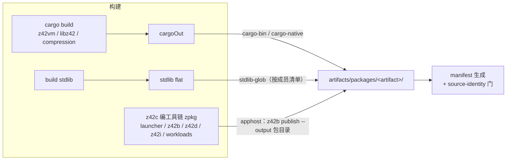

# 打包引擎（`packages.toml`）

> 代码：`scripts/packages.toml`、`scripts/package/`
>
> 本地怎么打一个包、RID 支持矩阵、发版流程、失败排查 → [打包与发版](release.md)；本页写**引擎本身**：
> 清单怎么组织、组件怎么产出、组装完为什么还有一道逐字节的门。

`xtask package` 把仓库产物组装成发行包。核心是数据清单 `scripts/packages.toml`：
**包装哪些组件由清单声明，怎么装由 kind 决定**——打包时按 include 顺序把每个组件**直接装进包目录**。
**加减包内组件只改一行 include，打包代码不动。**

## 1. 约束与取舍

- **数据驱动**：包的内容是清单（TOML），不是代码里硬编码的拷贝序列。
- **无隐形组件**：一切进包的东西都在组件注册表逐个登记（名字 → 产出方式 → 落点）。
- **声明 / 实现分离**：清单只说「哪个包有哪些组件、各落在哪」；「怎么装」按 kind 分派在
  `scripts/package/xtask_package_install.z42`，加组件不改分派代码。
- **跨平台同构**：四个 RID 类别（desktop / ios / android / wasm）共享同一套清单机制。

| 决策 | 选择 | 理由 |
|---|---|---|
| z42 程序类组件怎么产出 | 统一走 `z42 publish`（apphost kind）| 与用户发布自己的 app 是**同一套机制**——z42c / z42b 不享特殊待遇，机制被日常 dogfood |
| 组件间依赖 | **不设依赖段**：组件独立产出；include 顺序只影响拷贝顺序 | 组件内部依赖（如 z42c.driver 的兄弟包）由 `z42 publish` 自行解析拷贝，包层无需知道 |
| per-package 落点覆盖 | 不支持（dest 固定在组件注册表）| 当前无组件在两个包里需要不同落点；真需要再加，不预先设计 |
| runtime 包内容 | 仅 native + stdlib（不含 z42c / z42vm CLI）| runtime 包会跨 host 安装（如 android runtime 装在 macOS host），host 专属工具放进去无意义；自举种子由 SDK 包提供 |

## 2. 构建 → 安装

先构建（cargo、工具链 zpkg、stdlib），再按包定义的 include **逐组件直接装进包目录**
（`_pkgInstallPackage` → 按 kind 分派），最后生成 manifest、跑 source-identity 门（§5）。

> 🔴 **没有暂存根**：组件不先产出到 `artifacts/publish/<comp>/` 再整目录拷进包，而是直接发布进包目录。理由：
> ① 固定形态组件本来就是从构建产物拷出来的，暂存只是多拷一遍；apphost 组件的 publish **不清空** `--output`，
> 各落各的 `bin/<名>` + `programs/<名>/`，可以直接发布进包目录；② ios / wasm / android 打包与 `build sdk` 都直接往包目录写，两套做法并存没有必要；③ apphost 组件的工程路径
> 若在清单与打包代码里各写一份会漂移，所以只读清单的 `project`。runtime 包与 sdk 共享 native + stdlib，
> 各自从同一份构建产物装，字节一致。

## 3. 清单的三层结构

| 层 | TOML 段 | 内容 |
|---|---|---|
| 包定义 | `[package.<name>]` | `artifact` 命名模板 + `include` 组件清单 + `manifest` 策略 |
| 组件注册表 | `[component.<name>]` | `kind`（产出方式）+ `project` + `dest`（包内落点）|
| 产出方式 | `kind` 枚举 | `apphost`（`z42 publish`）/ `cargo-bin` / `cargo-native` / `stdlib-glob` |

三个包：

| 包 | include | 用途 |
|---|---|---|
| `sdk` | `z42vm`、`native`、`stdlib`、`z42c`、`launcher`、`z42b`、`z42d`、`z42i` | 完整开发包 |
| `runtime` | `native`、`stdlib` | 嵌入场景；跨 host 安装 |
| `workload-desktop` | `apphost-stub` | 仅 apphost stub，per-RID 产出，CI 合并四 RID |

组件分两类，**纯按「谁控制它的构建」区分**：

- **① z42 组件**（`launcher` / `z42c` / `z42b` / `z42d` / `z42i`）自带 `[platform.desktop]`
  的 bin/payload 配置，统一经 `z42 publish` 产出。这套配置是**用户面**机制——任何人发布自己的 app
  用的都是它。`z42c.driver` 的非 stdlib 项目依赖（`z42c.semantics` / `z42c.pipeline`）由
  `z42 publish` 自动解析、拷到同一落点 `programs/z42c/`，**因此不单独登记组件**，include 里只写
  一次 `"z42c"`（编译器域的其它包同样随 publish 落进 `programs/z42c/`，不进 `libs/`）。
- **② 固定形态组件**不经 publish，由 `scripts/package/xtask_package_install.z42` 按 kind 从构建产物
  拷进包，但**同样逐个登记**，不留「隐形」组件：`z42vm` / `apphost-stub` 是 `cargo-bin`；
  `native` 是 `cargo-native`（`libz42.*` + 头文件，多文件但来源单一：同一个 cargo 工作区一次 build
  产出）；`stdlib` 是 `stdlib-glob`（加库会变，需要显式声明落点）。

`dest` 与 `artifact` 一样支持 `{version}` / `{rid}` 展开——`apphost-stub` 需要它（落点按 RID 变化）。

**加一个新组件**（如某个新工具）= 它自己的 toml 写 bin/payload + 在 `packages.toml` 的 include
加一行。**新增一类产物**（新 `kind`）才需要动注册表的「形状」。

## 4. payload-only workload

除四个 per-RID **平台 tooling** workload（desktop / ios / android / wasm）外，还有**纯 payload** 的
**能力 workload**——目前是 **test**（`z42.testagent.zpkg`，见[测试流水线两层模型](test-pipeline.md)）：
平台无关、无 per-RID apphost、无 runtime pack。三个特点：

- **不进 `packages.toml`**：由 `scripts/package/xtask_package_test.z42` 的 `_buildTestWorkload`
  **内联**编 agent + 写 manifest，不走 `[package.*]` 的 include-组件模型——它没有可登记的组件，
  只有一份预建 zpkg。`package workload test [<version>]` 直接产出。
- **manifest 复用 `kind="workload-tooling"`** + `host=["*"]` + 无 runtime pack，单 zpkg 由
  `[contents.payload]` 段描述。安装侧 `runtimes=[]` ⇒ 天然跳过 bedding（与 desktop 同路径），
  故不需要新 kind 或新分支。
- **无 merge**：无 per-RID piece，一步 build 的目录即最终归档。CI 在 **macos-arm64 单 host** 建一次
  （平台无关，避免 4× 重复与同名冲突）。

## 5. source-identity 门：逐字节，且失联即红

每个包组装完（`_pkgFinish`）都跑 `_pkgSourceIdentityCheck`：**比对包内每一份从仓库拷进去的副本 vs
仓库源，逐字节**。

**不是哈希**——直接读两个文件比字节，比 hash 更强（无碰撞面、不依赖外部工具）。
函数名不含 sha。仓里、CI 日志里出现的 "SHA invariant" 字样指的就是这道门。

规则表是「包内相对路径 ↔ 仓库源路径」（`_pkgIdentityRules`，`scripts/package/xtask_package.z42`）：

| 规则 | 包内路径 | 仓库源 |
|---|---|---|
| stdlib libs | `libs/`（`.zpkg` + `.zsym`）| 扁平 stdlib dist |
| C ABI headers | `native/include/*.h` | `src/runtime/include/` |
| C ABI headers (ios) | `Sources/Z42VMC/include/*.h` | 同上 |
| C ABI headers (android) | `z42vm/src/main/cpp/include/*.h` | 同上 |
| iOS Swift | `Sources/Z42VM/*.swift` | `src/toolchain/workload/ios/platform/Sources/Z42VM/` |
| iOS Z42VMC dummy.c | `Sources/Z42VMC/dummy.c` | 同一 platform 树 |
| Android Kotlin | `z42vm/src/main/java/**/*.kt` | `src/toolchain/workload/android/platform/…` |
| Android JNI bridge | `z42vm/src/main/cpp/z42vm_jni.c` | 同上 |
| Android CMakeLists | `z42vm/src/main/cpp/CMakeLists.txt` | 同上 |
| wasm js facade | `js/` | `src/toolchain/workload/wasm/platform/js/` |

一张表服务全部包类别：**包内不存在该路径 ⇒ 整条规则跳过**（desktop 没有 `Sources/`，ios 没有 `js/`）；
**源侧没有对应物 ⇒ 该文件不在本门管辖内**（包里可以有源树没有的产物）。

三条容易踩的设计点：

1. **「路径存在却 0 个文件可比」= 失败，不是警告。** 那意味着规则与拷贝点脱钩了，门在验一个不相干
   的东西 = 假保障。若只打 ⚠ 不计失败，则「本门要防的那个形状」自己复发时门是黄的不是红的。
2. **这个判据依赖「不预建空目录」。** 若 `_pkgSetupDir` 无条件预建 `libs/` 与 `native/include/`，
   而 ios/android/wasm 的 **workload pack** 根本不装这两类（它们在另一个 **runtime pack** 里）
   → 门会看见空壳，把「本包没有这一类」误判成「规则脱钩」，三个平台的 package job 全红。
   现在是**谁写谁建**：`_pkgCopyLibs` / `_copyAbiHeaders` / `_copyNativeLibs` 各自 ensure 自己的
   目标目录，空目录不会出现在发布包里。
3. **ios 的 `Sources/Z42VMC/` 与 android 的 `…/cpp/` 不能整棵目录递归比**：它们的 `include/` 装的是
   拷进去的**真 runtime 头**，而源树同名目录里是 `#include "../../.."` 的转发 stub，整棵比会假红。
   故那两处是显式文件规则 + 单独一条指向 `src/runtime/include` 的 include 规则。

**为什么是「包 vs 源」而不是「包 vs 包」**：上表每一类文件，各包里的副本都拷自**同一份仓库源**，
故 `A==源 ∧ B==源 ⟹ A==B`——**跨包 byte-identical 是本门的推论**。反过来不成立：两两比对只能证明
「大家一样」，证不了「大家都对」（所有包一致地拷了陈旧副本时跨包比对全绿）。且各包在独立 xtask
进程 / 独立 CI job 里打，`_pkgFinish` 只见得到一个 pkgDir，真做跨包比对得先改 CI 拓扑。

门跑在 SDK pack、desktop runtime pack，以及 ios/android/wasm 的 **runtime pack 与 workload pack** 上。
移动端/wasm 的 runtime pack 才是 `libs/` + `native/include/` 的真正落点。

## 6. 实现分布

| 组件 | 位置 | 要点 |
|---|---|---|
| 顶层分发（按 RID）| `scripts/package/xtask_package.z42` | desktop / ios / android / wasm 四管道；`_pkgFinish` = manifest + identity 门 |
| 清单解析 | `xtask_packages_config.z42` | `[package.*]` + `[component.*]` 读取、include 名解析 |
| 组件安装 | `xtask_package_install.z42` | `_pkgInstallPackage`：按 include 逐组件、按 kind 分派直接装进包目录（cargo-bin / cargo-native / stdlib-glob / editor-assets 拷贝；apphost `z42b publish --output`）|
| desktop 管道 | `xtask_package_desktop.z42` | SDK 分段组装 |
| 移动 / 浏览器管道 | `xtask_package_{ios,android,wasm}.z42` | native 产物 + 平台 facade（SwiftPM / Gradle / npm）|
| 能力 workload | `xtask_package_test.z42` | 见 §4 |
| 发布归档 / 索引 | `xtask_release.z42` | `package archive`（包目录 → 归档，命名规则唯一出处）、`package finalize`（合并 desktop workload → `SHA256SUMS` → `release-index.json`，launcher 的供给契约）|
| 自检 | `xtask_selfcheck_*.z42`，入口 `xtask test packages` | 解析 / 组件安装 / 发布归档三层各一个 harness，一条命令顺序跑完 |

## 7. 边界与限制

- 组件落点全局唯一，无 per-package dest override（真需要时再引入）。
- `workload-desktop` 单机只产 host RID，四 RID 的合并发生在 CI（`package finalize <label>` 的第一步）。
- 发行包正确性的端到端验证依赖 `xtask test dist`，它需要先打 host-RID 包**加 desktop workload**——
  apphost 那条腿的 stub 模板来自 workload 包的 `apphost-<rid>`，SDK 包按设计不带它。
