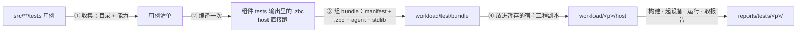

# 测试用例组织规范

> 代码：`scripts/test/xtask_test_layout.z42`（本页清单的对账门）、
> `scripts/common/xtask_golden.z42`（golden 语料枚举）、`scripts/test/xtask_test_embedded_corpus.z42`（app 语料）、
> `scripts/common/xtask_layout.z42`（产物路径）、`src/runtime/src/corelib/platform.rs`（运行期能力集）
> 相关：[怎么跑测试](testing.md) · [GREEN gate](test-gate.md) · [产物目录布局](artifacts-layout.md) · [跨平台测试](../testing/cross-platform.md)
> 待办：标 ⏳ 的规则还没落地，按 [Deferred](#deferred) 的顺序推进；⏳ 规则落地前，旧做法照常有效

## 概述

一条用例**放哪、写成什么形态、在哪些平台跑、输出落哪、用哪条命令跑**，全仓只有一套答案，写在本页。
加用例、搬用例、加平台、加能力之前读这页。`[Test]` / `Assert` 的写法不在这里，见
[参考手册的测试页](https://z42-lang.github.io/z42/reference/testing.html)。

## 设计目标与约束

- **一个判据决定归属**：看「这条断言在描述谁的契约」，不看实现落在哪一层。
- **目录即范围**：用例在哪个组件的 `tests/` 下，就由那个组件的命令跑、在那个组件改动时触发、
  产物落在那个组件的输出目录下。不需要额外的登记表来说明「这条用例属于谁」。
- **声明需要什么，而不是在哪失败**：平台差异用**能力**表达，用例声明自己需要的能力；
  不按用例名维护排除表。
- **本地与 CI 同一条路径**：CI 能跑的任何一层测试，本地用同一条命令也能完整跑完。
- **规范可机械检查**：能判定的部分由 `xtask check layout` 守着（见[实现](#实现)），不靠纪律。

## 方案与决策

| 问题 | 决定 | 为什么不选另一个 |
|---|---|---|
| 组件的测试放在组件内还是集中放 | **放组件内** `<component>/tests/` | 集中目录会混进不同 owner 的用例：改一个组件时既不知道该跑哪些，也不知道该看哪些 |
| 语言 / VM 特性测试放哪 | **保留 `src/tests/`，只放语言 / VM 特性** | 它们同时测编译器与 VM，没有单一 owner；对标 dotnet/runtime 的 `src/tests/` |
| 整程序性能场景放哪 | **`src/bench/`** | 不是测试（不判对错，只计时），也不属于 runtime（测的是编译器 + VM + stdlib 全链路）。微基准仍跟着代码走（各库 `bench/`、`src/runtime/benches/`），与 Rust / Go 的惯例一致；整程序套件做成与 `src/tests` 并列的独立目录，与 Swift / Node 顶层 `benchmark/` 同理 |
| 平台过滤用什么表达 | **能力名**（`// requires-caps:` / `[Skip(feature:)]`）；只有能力表达不了的 OS 差异才用 `[Skip(platform:)]` | 按用例名维护的排除表说不清每条为什么在那里，而且只增不减；按 rid 写死的能力表必然与运行期漂移 |
| golden 的能力声明用 marker 文件还是源码头注释 | **头注释 `// requires-caps: a, b`** | 与 bench 场景已有的写法、解析函数共用；flat 模式用例不必为此多建一个 sidecar |
| harness 驱动的工程树放在 `tests/` 的哪里 | **保留子目录 `tests/fixtures/<suite>/`** | 直接放 `tests/<suite>/` 会被 z42b 的单元发现与孤儿源守卫当成「没人认领的源」判红；保留名同 Go 的 `testdata/`，规则一条、不需要名单 |
| 测试输出放哪 | **所属组件的输出目录 + `/tests/`** | 各组件输出目录本就镜像 `src/`，测试输出跟着镜像，不需要另一套路径规则 |

## 机制

### 1. 用例放哪

**先问「这条断言在描述谁的契约」，按下表找 owner；找到 owner 就放进它的 `tests/`。**

| 契约属于 | 放哪 | 由谁跑 |
|---|---|---|
| 语言 / VM 特性（语法、类型系统、派发、GC、优化 pass、OSR） | `src/tests/<category>/` | `xtask test e2e` |
| 某个库的 API | `src/libraries/<lib>/tests/`（即使该 API 由 VM builtin 实现） | `xtask test stdlib <lib>` |
| 编译器某成员（含**期望编译报错**：写成 `[Test]` + `SemanticDump`） | `src/compiler/<member>/tests/` | `xtask test compiler` |
| 工具链某组件（launcher / builder / interactive / workload …） | `src/toolchain/<comp>/tests/` | `xtask test toolchain [<comp>]` |
| VM 内部（Rust） | 同模块 `*_tests.rs`；集成测试在 `src/runtime/tests/` | `xtask test runtime` |
| 整程序性能场景 | `src/bench/scenarios/` | `xtask bench` |

拿不准时的三个常见误判：

- 测 `String.Trim`、`Enum.Parse`、`List<T>` 这类 API 的是**库**用例，不是语言用例。
- 测多包编译、`.zpkg` / `.zbc` 字节格式、清单解析的是**编译器 / 工具链**用例，不是语言用例。
- 学习手册的 `examples/` 不是测试语料，覆盖一律写进上表的位置。

### 2. `src/tests/` 的类别清单

`src/tests/` 的每个顶层目录必须登记在下面两张清单之一，`xtask check layout` 双向对账：新类别没登记 → 红；
清单里的类别已不存在 → 红。

**语言类别**（加新类别时登记在这里）：

<!-- test-lang-categories:begin -->
- `attributes`
- `basic`
- `classes`
- `closures`
- `const`
- `control_flow`
- `ctor-reflection`
- `delegates`
- `exceptions`
- `gc`
- `generic-method-invoke`
- `generic-methods`
- `generics`
- `inheritance`
- `interfaces`
- `named-args`
- `null_checks`
- `operators`
- `optimization`
- `osr`
- `params`
- `partial-types`
- `pattern-matching`
- `reflection`
- `refs`
- `static-ctor`
- `strings`
- `structs`
- `tuples`
- `types`
- `user-conversions`
<!-- test-lang-categories:end -->

**待搬迁**（按 §1 不属于这里、还没搬走的类别；**只删不加**，搬完一项删一行。当前为空）：

<!-- test-pending-moves:begin -->
<!-- test-pending-moves:end -->

### 3. 用例形态

**每个 `tests/` 下只有三种用例形态，按「由谁判对错」区分。**

| 形态 | 形状 | 判定 | 由谁跑 |
|---|---|---|---|
| **unit** | 带 `[Test]` 的 `.z42`（文件或目录） | `Assert.*` 抛异常即失败 | `z42b test` |
| **golden** | flat：`<name>.z42`；dir：`<name>/source.z42` + sidecar | 程序跑完；有 `expected_output.txt` 时 stdout 必须相等 | VM 直接跑 |
| **fixture** | `tests/fixtures/<suite>/<case>/`：含 `z42.toml` 的工程目录 + `expected_output.txt` 或 `expected_build_error.txt`；命令行行为类用 `expect.toml`（参数、退出码、stderr / stdout 必含 / 不得含、产物有无） | 先构建再比对；期望报错时 stderr 必须包含给定子串 | xtask 按所属组件的 harness |

Rust 侧的 `*_tests.rs` 与 `tests/*.rs` 按 cargo 惯例，不在此列。

**`tests/fixtures/` 是保留目录名**：z42b 的约定单元发现与孤儿源守卫都跳过它（用户工程同样适用，见
[z42.toml 参考](https://z42-lang.github.io/z42/reference/toolchain/z42-toml.html)），里面的内容只由 harness 读取。现有的 suite：

| suite | 位置 | harness |
|---|---|---|
| 多包编译与链接 | `src/compiler/z42c.pipeline/tests/fixtures/cross-zpkg/` | `xtask test e2e --dir cross-zpkg` |
| 一工程产多个 exe | `src/compiler/z42c.pipeline/tests/fixtures/multi-exe/` | `xtask test e2e --dir multi-exe` |
| `[[test]]` / `[[example]]` / `[[bench]]` target | `src/toolchain/builder/tests/fixtures/manifest-targets/` | `xtask test toolchain builder` |
| z42b 自身的清单 / hook / 发现规则 | `src/toolchain/builder/tests/fixtures/z42b/` | `xtask test toolchain builder` |
| z42c 命令行与构建行为（清单 / 旋钮校验、`--emit-zbc` / `--dump-ir` 的诊断可见性、打包直跑、可复现 build_id、cache 布局、缓存键（依赖 / 清单身份、`[build]` / `[optimize]` / `[syntax]` 旋钮）、增量失效与警告回放、path 依赖闭包、workspace 成员发现与装配、部署判据（复制 / `deploy` / probing-paths / zpkg 产物引用）、SDK 库与 analyzer 的解析域） | `src/compiler/z42c.driver/tests/fixtures/cli/`（[声明式夹具](fixture-harness.md)：开发树的 z42c / z42b / z42vm） | `xtask test compiler` |
| 打包出的 SDK 上的用户路径（新手命令行、单文件运行、`run --bin/--set`、`repl`、桌面发布、发布态 analyzer 与 build hooks） | `src/toolchain/launcher/tests/fixtures/package/`（[声明式夹具](fixture-harness.md)：包内的 z42 / z42c / z42b / z42vm） | `xtask package sdk --verify` |
| `.zbc` 字节基线 | `src/compiler/z42.package/tests/fixtures/zbc-format/` | `xtask build test` 就地重生；`xtask test runtime`（`zbc_compat`、`format_fixture_versions`）读取 |
| `.zpkg` 字节基线 | `src/compiler/z42.package/tests/fixtures/zpkg-format/` | 按该目录 README 的配方重生；`xtask test runtime` 读取 |

写法规则：

- **先写 assert-only**：断言写成 `Assert.Equal(...)`，不要默认加 `expected_output.txt`。
  sidecar 只在 **stdout 本身就是被测契约**时才有（异常栈迹文本、`Console` 的格式化、REPL 会话记录）。
  理由与 sidecar 全表见 [src/tests/README.md](https://github.com/z42-lang/z42/blob/main/src/tests/README.md)。
- golden 的 marker sidecar：`interp_only`（跳过 JIT）、`opt_all`（按 release 全优化编；测优化 pass 的用例必须加）。
  flat 模式写成 `<name>.interp_only` / `<name>.opt_all`。
- **用例 ID = 相对 `src/` 的路径去掉扩展名**，例如 `tests/basic/hello`、`libraries/z42.io/tests/file_temp`。
  ⏳ `test list`、host 运行结果、app 报告统一用它，失败可以直接定位到源文件。

### 4. 平台与能力

**过滤分三层，按顺序：目录决定能不能进 app，能力声明决定在哪个平台跑，平台名只留给 OS 差异。**

| 层 | 写法 | 适用 |
|---|---|---|
| ① 目录 | 不用写。app 语料只收 `src/tests/**` 的 golden 与库、编译器成员 `tests/` 下的 `[Test]` 单元；工具链组件的用例与各处 `tests/fixtures/` 不进语料，天然只在 host 跑 | 所有用例。例如 REPL 的用例放进 `src/toolchain/interactive/repl/tests/` 就自动是 host-only |
| ② 能力 | golden：源码头注释 `// requires-caps: threads, socket`；`[Test]`：`[Skip(feature: "threads", reason: "…")]` | 会进 app 语料、但需要某种能力的用例 |
| ③ 平台名 | `[Skip(platform: "windows", reason: "…")]` | 能力词表表达不了的真实 OS 差异，例如 pty 只在 unix 上有 |

匹配规则：用例声明的能力 ⊆ 目标 VM 的能力集时才跑，否则记为 skipped。能力集是 VM 的**运行期真值**
（`Std.Platform.Capabilities()`），未知名字一律视为「缺」（deny-by-default）。

**`// requires-caps:` 的写法**：源码里**单独一行** `// requires-caps: fs, env`（trim 后以 `// requires-caps:` 开头；
散文里提到这个词不算声明）。单文件用例写在文件里，目录用例写在任一 `.z42` 里（取并集）。谁读它：

- app 语料：xtask 写进 bundle manifest 的 `requires`，设备上的 `BundleRunner` 在**加载模块之前**对照，
  缺能力 → skipped、不加载（判定细节见[跨平台测试 §4](../testing/cross-platform.md)）；
- `xtask bench`：场景缺能力时显式跳过；
- 桌面宿主报告全部能力，host 上跑的 `test stdlib` / `test e2e` 不需要判定。

**能力词表**。只能使用「已生效」的名字：deny-by-default 下，运行期不报告的名字会让用例在**所有平台**上
被静默跳过。`xtask check layout` 检查两件事：「已生效」区与 `platform.rs` 的 `builtin_platform_caps` 双向相等；
`src/**/*.z42` 里的能力声明只用「已生效」的名字。

已生效（运行期报告）：

<!-- caps-active:begin -->
- `jit` — cargo feature `jit`
- `native-interop` — cargo feature `native-interop`
- `bundled-compression` — cargo feature `bundled-compression`
- `threads` — 真 OS 线程；wasm 之外都有
- `socket` — 真 OS 网络客户端（TCP / UDP / HTTP / WS）；wasm 之外都有
- `fs` — 可写文件系统、文件流、glob；wasm 之外都有
- `clock` — 系统时钟（`DateTime.UtcNow`）；wasm 之外都有
- `entropy` — OS 熵源（`secure_random`）；wasm 之外都有
- `process` — 起子进程（spawn / stdio / which）；仅桌面
- `tty` — 终端 / console；仅桌面
- `env` — 进程环境：可变环境变量、cwd、桌面 OS 身份字符串；仅桌面
- `socket-listen` — bind / listen 服务端 socket 与 loopback（`z42.net` 的用例都靠它）；仅桌面
- `hardlink` — POSIX 硬链接；wasm 与 Android 之外都有
<!-- caps-active:end -->

规划中（名字是提案，运行期开始报告时移到上一区；当前为空）：

<!-- caps-planned:begin -->
<!-- caps-planned:end -->

三档平台的能力集由 `platform.rs` 的 cfg 决定，`z42.core/tests/platform_capabilities.z42` 在每个平台上钉住这三档：

| 平台 | 有 | 缺 |
|---|---|---|
| 桌面 | 全部 | — |
| iOS / Android（app 沙箱） | `native-interop` `bundled-compression` `threads` `socket` `fs` `clock` `entropy`，iOS 另有 `hardlink` | `process` `tty` `env` `socket-listen`，Android 另缺 `hardlink` |
| wasm | `bundled-compression` | 其余全部 |

> 「跑不了」先分清是**能力缺口**还是**用例自身不可移植**（例如硬编码 `/tmp/...`）。后者改用例
> （`File.CreateTempDir`），不加能力声明。

### 5. 测试输出

**测试的编译产物在 `build/`，其余测试输出在 `intermediate/`，两边都逐路径镜像 `src/`**（判据见
[产物目录布局 §1](artifacts-layout.md)）。包（库、编译器成员、工具链工程）里的编译产物一律
**profile 在外、`tests` 在内**，与运行时的 `build/runtime/<profile>/` 同形：

| 测试输出 | 位置 |
|---|---|
| golden `.zbc` | `build/tests/<rel>`；库的在 `build/libraries/<lib>/release/tests/<rel>` |
| z42b 的 `[Test]` / `[Benchmark]` 目标（库、编译器成员、工具链工程） | `build/<rel>/debug/tests`、`build/<rel>/debug/bench` |
| 编译器测试单元（`tests/<unit>/*.z42.toml`） | `build/compiler/<member>/release/tests/<unit>` |
| 夹具暂存拷贝（在拷贝上编 / 跑，源码树零写入） | 与源码同路径：`intermediate/<组件>/tests/fixtures/<suite>/` |
| harness 工作目录 | `intermediate/<组件>/<name>`，如 `intermediate/compiler/z42c.pipeline/incremental` |
| 平台测试（bundle、宿主、R1–R7） | `intermediate/toolchain/workload/<platform>/`；共享的 agent 与语料 bundle 在 `intermediate/toolchain/workload/test/` |

没有共享的 scratch 目录：不属于某个成员的中间物（编译器自举快照等）落 `intermediate/<area>/<name>`；
xtask 自检的工作目录在 `intermediate/xtask/`。给 CI 消费的报告不进 `build/`：`artifacts/reports/tests/<platform>/`
与 `artifacts/reports/bench/`。完整清单见[产物目录布局 §3](artifacts-layout.md)；路径只在
`scripts/common/xtask_layout.z42` 里定义（`_buildMirror` / `_workOut` / `_workRootOf` / `_devTargetOutRoot`）。

### 6. 在 app 里跑

**用例编译一次，host 与 app 共用；进包体的东西都在 `artifacts/` 里组装，不写源码树。**



图里各步的产物都在 `artifacts/intermediate/toolchain/workload/<platform>/` 下，报告落 `artifacts/reports/tests/`。

1. **收集**：只扫 §4 ① 的语料根；能力匹配在设备上做（§4）；分片 `--shard k/n` 与采样规则不变。
2. ⏳ **编译**：`.zbc` 与平台无关，应直接引用用例自己的测试输出；目前 bundle 构建仍为每个用例单独编一份。
3. ⏳ **组 bundle**：bundle 内部按用例 ID 镜像 `src/` 路径；目前是扁平的安全文件名。
4. **放进包体**：平台宿主工程（Playwright 页面 / SwiftPM 包 / Gradle 工程）里**被 git 跟踪的文件**增量同步到
   `intermediate/toolchain/workload/<p>/host/`（`_stageDeviceHost`），R1–R7 夹具、stdlib、嵌入 bundle、
   native 产物（pkg-web / xcframework / jniLibs 里的 .so）都放进这份副本，构建与运行也在副本里做，
   源码树零写入。增量是为了让 Gradle / Xcode / npm 的缓存继续生效；路径固定是为了能直接用
   Android Studio / Xcode 打开副本调试。Rust crate 不进副本：它们的 `Cargo.toml` 相对依赖 `src/runtime`，
   仍从源码位置编，只把产物输出到副本。wasm 的嵌入 deployable 在副本旁边的 `deploy/`。

一条命令完成全部步骤，本地与 CI 相同（`scripts/test/xtask_test_app.z42`）：

```bash
xtask test app <desktop|wasm|ios|android|all> [stage|build|assets|bundle|run] [--filter <pat>] [--shard k/n]
```

desktop 也是一个嵌入宿主（C ABI 宿主），与三个设备平台同一条流水线：R1–R7（分片时只在第 1 片）→ 嵌入
bundle → 宿主构建 → 运行，最后给一张汇总表。desktop 的语料在 z42b 进程内跑（`--rid host`，与设备上 agent
内嵌的是同一个 `Std.Test.BundleRunner`）；设备平台先把 test agent 装进 z42b 会去找的 SDK（构建树的
`artifacts/build/runtime/runtimes/dev/workloads/test/`；xtask 调 z42b 时总把 `Z42_PORTABLE_VM` 设成跑 z42b 的那个
VM，所以本地经 `.z42/z42` 启动也找得到）。

带 step 只做一步（调试 / CI 分步）：`stage` 同步宿主工程副本、`build` 原生构建、`assets` 放 R1–R7 夹具与
stdlib、`bundle` 组嵌入语料并放进宿主、`run` 在宿主 / 设备上运行。desktop 另有 `--zbc <file|golden 目录>`
只跑一个模块，`--format json|pretty|tap` 选报告格式。

设备的启停由运行它的工具负责，规则统一：已有在跑的设备就复用、跑完不关；没有就以 headless 方式启动、
跑完只关自己起的那台。iOS 模拟器由 `xcodebuild` 启动。Android 由 z42b 负责（`builder_device_android.z42`）：
`adb devices` 里有 `device` 状态的就复用（CI 的 emulator action、本地手动起的模拟器、插着的手机）；
没有就按 `versions.toml` 的 `avd_name` 以 headless 方式启动 AVD，等到 `sys.boot_completed` 后再跑，
跑完用 `adb emu kill` 关掉。启动本地 AVD 需要的模拟器组件（emulator + 本机架构的系统镜像 + AVD，约 4GB）
由 `test app android` 在第一次用到时安装。
本机不具备的平台（无 Xcode；Linux 无 KVM 且没有接着的设备）报**跳过**并说明原因，不报失败；
`all` 跑本机支持的全部平台。

### 7. 怎么跑

| 范围 | 命令 |
|---|---|
| 完整门禁 | `xtask test` |
| 语言 / VM 特性 | `xtask test e2e [--dir <category>] [--file <name>]` |
| 某个库 | `xtask test stdlib <lib>` |
| 编译器 | `xtask test compiler` |
| 工具链 | `xtask test toolchain [<comp>]` |
| VM（Rust） | `xtask test runtime` |
| 嵌入宿主（desktop / wasm / iOS / Android） | `xtask test app <platform\|all> [step] [--filter <pat>] [--shard k/n]` |
| 本次改动影响到的 | `xtask test changed` |
| 用例目录表 | `xtask test list` |
| 文档 | `xtask test docs [links\|examples]` |
| 本页规范（及其它静态检查） | `xtask check layout`（`xtask check` 全跑） |

各命令的旗标见[怎么跑测试](testing.md)。

## 实现

`xtask check layout` 是 GREEN gate 的一个纯文本扫描 stage（秒级、与 host 无关），检查本页能机械判定的部分：

| # | 检查 | 失败时怎么修 |
|---|---|---|
| ① | `src/tests/` 的顶层目录 = §2「语言类别」∪「待搬迁」，两张清单不重叠 | 新类别：是语言特性就登记，否则放进所属组件；搬走的：从「待搬迁」删掉 |
| ② | §4「已生效」能力 = `platform.rs` 里 `builtin_platform_caps` 实际 `push` 的能力 | 运行期加了能力就登记，删了就移除 |
| ③ | `src/**/*.z42` 里的 `// requires-caps:` 与 `[Skip(feature: "…")]` 只用「已生效」的名字 | 改成已生效的名字；需要新能力就先让运行期报告它 |
| ④ | `build/` 的一级目录、`build/{compiler,libraries,toolchain}/` 的二级目录、`intermediate/` 的一级目录，在 `src/` 下都有同名目录（不存在的跳过） | 编译产物改到 `build/` 镜像（`_buildMirror`），其余改到 `intermediate/` 镜像（`_workOut` 等）；旧布局残留按报错给的 `rm -rf` 删掉 |

③ 豁免两类故意写未知能力名的 fixture（`_tlCapFixtures()`）：`src/runtime/tests/data/`（TIDX 解码）与
`z42.test` 的 `skip_platform_demo.z42`（deny-by-default 演示）。④ 的例外只有 `intermediate/xtask`（xtask 不在 `src/` 下）。

| 组件 | 位置 |
|---|---|
| 布局门 | `scripts/test/xtask_test_layout.z42` |
| 文档清单区解析（与 gate-stages 共用） | `scripts/test/xtask_test.z42` 的 `_docListBlock` |
| golden 语料枚举（host） | `scripts/common/xtask_golden.z42` 的 `_walkGoldenCorpus` |
| app 语料枚举 / 分片 / 排除表 | `scripts/test/xtask_test_embedded_corpus.z42`、`scripts/test/xtask_test_embedded_golden.z42` |
| 产物路径（单一定义） | `scripts/common/xtask_layout.z42` |
| 运行期能力集 | `src/runtime/src/corelib/platform.rs` 的 `builtin_platform_caps` |
| 改动 → 命令映射 | `scripts/test/xtask_test_changed.z42` |

## 边界与限制

- 布局门只检查 `src/tests/` 的**顶层类别**，不判断一个用例放进某个已登记类别是否合适；这一点仍靠 §1 的判据和评审。
- ③ 只认单行写法：`[Skip(...feature: "x"...)]` 必须写在一行上。

## Deferred

按顺序推进，每一步一个 PR；完成后删掉本页对应的 ⏳ 标记：

1. **bundle 组装**：bundle 引用用例自己的测试输出、内部按用例 ID 镜像（§6 第 2、3 步）。目前每个设备分片
   逐例编 bundle 约 2–3 分钟（wasm 分片 239 例约 2m48s），省下的就是这部分；代价是三个平台的资源暂存都要
   支持嵌套目录，并且设备 job 里要先有用例的测试输出。
