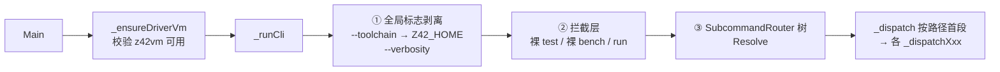
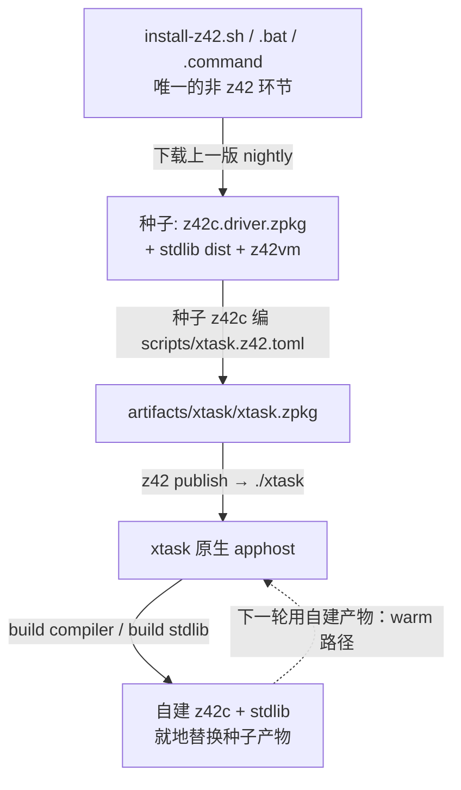

# xtask：仓库开发 CLI

> 对齐：2026-09-17（change `restructure-docs-three-books`）｜ 代码：`scripts/xtask.z42`、`scripts/xtask_cli.z42`、`scripts/cli/`、`scripts/common/`
>
> 每个子命令的旗标以 `xtask <命令> -h` 为准（帮助文本由路由树自动生成）；逐文件职责表见
> [`scripts/README.md`](../../../../scripts/README.md)，本页不复列。

`xtask` 是仓库里所有开发动作（构建 / 测试 / 打包 / 依赖 / 基准 / 剖析）的唯一入口，
本身是一个用 z42 写、由 z42c 编译、跑在 z42vm 上的 z42 程序。
**要改一条开发命令、加一个命令族、或搞清楚 `--toolchain` 为什么能一处生效处处生效，读这页。**

## 1. 命令树

顶层九个命令，`xtask -h` 打印的就是这棵树的根：

| 命令 | 管什么 |
|---|---|
| `build` | 编译各组件：`runtime` / `compiler` / `stdlib` / `sdk` / `stage-toolchain` / `workload` / `toolchain` / `test` / `all` |
| `package` | 组装发行包：`sdk` / `runtime` / `workload` / `index`（见[打包引擎](packaging.md)）|
| `test` | 测试编排；裸 `test` = 完整 GREEN gate（见[测试门禁](test-gate.md)）|
| `bench` | 基准；裸 `bench` = e2e 场景（见[性能基准与回归门禁](benchmarking.md)）|
| `deps` | 工具链依赖：`check` / `install` / `env` |
| `profile` | 对单个 `.z42` 脚本做 cpu / heap / threads / e2e 剖析 |
| `feature-matrix` | 逐个 cargo feature 组合验证可编译 |
| `clean` | 删构建产物（`tests` / `bench` / `all`，默认删生产 cache/dist）|
| `run` | 把参数原样透传给 **PATH 上的 `z42` launcher**（找不到 launcher 即报错退出）|

> `build regen` 这个命令名不存在——golden 基线重生现在是 `build test`。

## 2. 为什么用 z42 写

| 决策 | 选择 | 理由 |
|---|---|---|
| 实现语言 | z42（不是 bash / cargo-xtask） | dogfooding：工具链本身是语言与 stdlib 最大的真实用例（`Std.Cli`/`Std.IO`/`Std.Toml`/`Std.Process` 都被它压出来的）；跨平台无 shell 方言差 |
| 命令路由 | `Std.Cli` 的 `SubcommandRouter` 树 | 每层的 `-h` 由树自动渲染；命令面是数据结构，可静态审阅 |
| 工具链选择 | 全局 `--toolchain <dir>` → 环境变量 `Z42_HOME` | 一处剥离、处处生效，命令实现不必逐个透传参数（见 §4）|
| 运行形态 | 原生 apphost 可执行（仓库根 `./xtask`，内嵌 launcher + `xtask.zpkg`）| 单文件、不依赖 PATH 上的 launcher；与用户发布自己的 app 走同一套 apphost 机制 |

代价是**自举依赖**：编 xtask 需要 z42c 和 stdlib，而它们又由 xtask 编排构建（见 §5）。

### 改了 `scripts/*.z42` 之后

```
z42 publish scripts/xtask.z42.toml     # → 仓库根 ./xtask
```

publish 每次都过一遍 z42c 的增量编译：改了什么重编什么，全命中时约 0.5 s、一个字节都不重写。
**不需要先 `z42 build`**，也不存在「zpkg 已存在就跳过编译」的短路——publish 见到既有产物照样过
增量编译，否则会把旧 payload 重新签一遍而人不知情。

## 3. CLI 分发：三段式 + 每族一文件



① **全局标志剥离**（`_applyToolchainOpt` / `_applyVerbosityOpt`，`scripts/xtask_cli.z42`）：
两 token 形式从 argv 摘除、last-wins，`--toolchain` 写进 `Z42_HOME`。
② **拦截层**：有两个命令的默认语义是路由树表达不了的——裸 `test` = 完整 GREEN gate、
裸 `bench` = e2e 场景；它们在 `Resolve` 之前被拦下，但**仍注册在树里**，好让 `xtask -h` 列出、
`xtask bench stdlib -h` 正常工作。`run` 同样在 Resolve 前直通 launcher。
③ **路由树**解析后按路径首段分发。

命令族的 **router**（声明每个叶子的 flag / option / positional，`-h` 文本由此生成）与
**dispatch**（把解析结果转给 handler）**成对出现、族间零耦合**——`build` 的 router 与 `test` 的
dispatch 之间没有任何引用。所以按**族**分文件，而不是「所有 router 一段、所有 dispatch 一段」：

```
scripts/xtask_cli.z42              核心：全局选项剥离 → _cliRoot 根树 → _dispatch 分流
scripts/cli/xtask_cli_build.z42    _buildRouter    + _dispatchBuild
scripts/cli/xtask_cli_package.z42  _packageRouter  + _dispatchPackage
scripts/cli/xtask_cli_test.z42     _testRouter (+_platformRouter) + _dispatchTest
scripts/cli/xtask_cli_deps.z42     _depsRouter     + _dispatchDeps
scripts/cli/xtask_cli_bench.z42    _benchRouter    + _dispatchBench + 裸 bench 的 e2e 入口
```

**加一个命令族** = `scripts/cli/` 加一个文件 + `_cliRoot` 加一行 `AddRouter` + `_dispatch` 加一行。
namespace 扁平（全仓 `Z42Xtask`）、工程 `include = ["**/*.z42"]` 递归收录，所以拆文件不需要改任何
import。`scripts/xtask.z42` **只有入口**（`Main` → `_ensureDriverVm` → `_runCli`），不含任何命令 handler。

## 4. `--toolchain` / `Z42_HOME` 的作用范围

设了之后，**所有**解析「用哪套 z42c / stdlib / z42vm」的路径函数（`_toolchainDir` →
`_toolchainDriverHome` / `_toolchainLibs`）都优先取该目录，否则回落 build-tree
（`artifacts/build/`）。它不是某几个命令的参数，而是全局的「工具链根切换」——例如
`build test --toolchain <dir>` 会用该工具链的 z42c 去编 golden 基线。

`Z42_HOME` 跨两种布局：

| 布局 | 形状 | 来源 |
|---|---|---|
| SDK-toolchain | `programs/` + `libs/` + `bin/z42vm` | `--toolchain`、便携 SDK、CI 下载的 `current-sdk` |
| managed 安装 | `runtimes/` + `config.toml` | launcher / installer 装出来的 `~/.z42` |

消费端按「`programs/` 与 `bin/z42vm` 在不在」守卫：managed 布局的 `Z42_HOME` 不符 SDK-toolchain
形状时**自动回落 build-tree**，不会错位地拿一个不完整的根当种子。

## 5. 自举链路：冷启动一次，此后越滚越新



冷启动只发生一次。此后是 warm 循环：xtask 编排 z42c 自建自己和 stdlib，产物就地替换。
次序上没有死锁的原因是 **z42c 只读 `.zsym`、VM 扫目录读各 zpkg 的 `NSPC` section 认领 namespace**——
编译和运行 xtask 都不需要任何 namespace 索引先存在。

**种子从哪来**（`build compiler` / `build stdlib` 共用一套解析，CI 与本地同路径）：冷树上
`_ensureSeed`（`scripts/common/xtask_common.z42`）按 `Z42_HOME` → 运行 xtask 的 apphost 所属 SDK
（从 `Z42_PORTABLE_VM` 反推）→ `./.z42` 的顺序找 SDK-toolchain 布局的根，把 `programs/z42c` + `libs`
拷进 in-tree 再自建。warm 树（已有 in-tree 种子）**直接复用、不覆盖**——gen2 字节不动点靠的就是这一点
（见[构建编排](build.md)）。

为什么种子必须存在、新语法为什么要晚一个 nightly 才能用，见
[自举与种子纪律](../../../agent/rules/bootstrap-seed.md)与[编译器自举](../compiler/self-hosting.md)。

## 6. `deps`：依赖的两层模型

工具链依赖按「没有它，那个平台的构建/测试能不能跑」分两层：

- **平台必备**——`deps install --os <p>` 显式装。android = rust targets + cargo-ndk + JDK +
  build-tier SDK；ios = rust targets + Xcode 检查；wasm = rust targets + wasm-pack + hermetic node。
  **无 `--os` = 只管当前 host 的基础**，不铺开装交叉栈（交叉平台栈一律显式 opt-in）。
- **用到才装**——重型 / 兜底依赖零命令面，消费步骤检测到缺失后自动装：android emulator tier
  （emulator + system-image + AVD + Gradle，约 4 GB）由 `test platform android run` 安装，
  node 兜底由 wasm 测试步骤安装。**安装失败 = 该步骤失败**，不吞不跳过。

下载来的东西一律落 `artifacts/tools/`（如 `artifacts/tools/node`、`artifacts/tools/android-sdk`），
不碰系统 PATH，见[产物目录布局](artifacts-layout.md)。

命令面是三个正交子命令：

| 子命令 | 语义 | 退出码策略 |
|---|---|---|
| `deps check [--os]` | 唯一的只读校验 = presence + `versions.toml` ↔ 投影 drift | **drift 恒致败**（与机器无关）；**presence 仅在显式 `--os <p>` 时致败** |
| `deps install [--os] [--force]` | 纯安装 | 失败即失败 |
| `deps env` | 打印可 `eval` 的导出（`ANDROID_NDK_HOME` 等） | stdout 保持纯净 |

presence 之所以默认不致败：CI 的通用 job 在没有平台 SDK 的 runner 上裸跑 `deps check` 当 **drift 门禁**，
那里 presence 缺失是预期的，只作信息性展示。

## 7. 边界

- **冷启动依赖网络**：fresh checkout 无种子时必须能下载 nightly（CI 的全新 runner 同理）。
- **格式漂移窗口**：zbc/zpkg 格式 bump 之后，旧 nightly 种子读不了新产物，要等新 nightly 发布。
- **z42vm 前置**：xtask 启动即校验 z42vm 可用（`_ensureDriverVm`）；多数命令以子进程驱动 z42vm / z42c。
- `src/toolchain/builder/`（z42b）目前承担单-bundle 测试执行（见[测试流水线两层模型](test-pipeline.md)），
  **不**承担 build 编排；构建编排仍全在 xtask。
