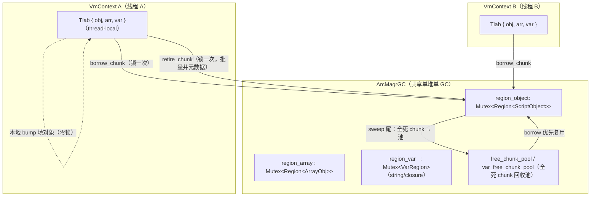
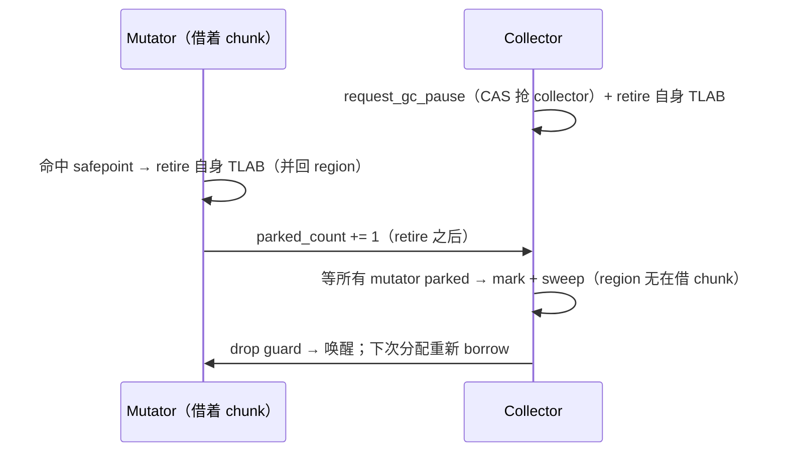

# GC TLAB：线程本地分配（chunk 独占）

> 代码：`gc/tlab.rs`（Tlab + thread-local + arm 门）、`gc/region.rs`（`ChunkClaim` + borrow/retire/reclaim，定长对象/数组）、
> `gc/var_region.rs`（`VarChunkClaim` + borrow/retire/reclaim，变长字符串/闭包）、
> `gc/arc_heap/alloc.rs`（fast path）、`gc/safepoint.rs`（retire-on-park）。

## 为什么

`ArcMagrGC` 是**单一共享堆**，所有 mutator 线程共用一个 `Arc<VmCore>` → 一个堆。无 TLAB 时分配热路径
（`new` / `Str::new` / …）每个对象都要抢**进程级 region 锁**（`region_object`/`region_array`/`region_var`
各一把 `Mutex`）。N 个线程并行分配 → 全在这几把锁上排队，并行编译**越多线程越慢**。

**TLAB（Thread-Local Allocation Buffer）= chunk 独占**：每个 mutator 线程从共享 region **借用一整块
chunk 的写权**，在里面本地 bump 填对象（**零锁**）；chunk 填满就 retire（把已填部分的元数据批量并回
共享 region）+ 再借一块。

**关键不变式：仍是同一个共享堆、同一套 region。** GC 遍历 / 分代 / card table / sweep **全部零改动**——
borrow 来的 chunk 内存和元数据始终归属共享 region，retire 后就是普通已分配槽。

## 架构



- **TLAB** = per-`VmContext` 持有（挂 thread-local，见「arm 门」）的三个「借来的活跃 chunk 句柄」
  （obj/arr/var 各一）。
- **分配**（零锁）：在活跃 chunk 的下一个槽 / bump 偏移写对象，`GcRef`/`VarGcRef` 从槽指针直接建。
- **retire**（借新 / safepoint 时，锁一次）：把 chunk 已填部分一次性并回共享 region（定长：构造位图、
  年轻位图各一次按字 OR；变长：发布高水位、把 claim 的块起点位图 OR 进年轻位图、`live_count`）。
- **GC 侧**：`iterate_alive`/`iterate_young`/sweep 全不变——定长靠 `borrowed[ci]` 标志跳过在借 chunk，
  变长靠「未 retire 的 chunk 高水位为 0」天然不可见。

## borrow / retire / reclaim 契约

### 定长 `Region<T>`（对象 / 数组）

- **`borrow_chunk() -> ChunkClaim<T>`**（锁下）：从 `free_chunk_pool` 取一块全死 chunk 或 grow 新块，
  标 `borrowed[ci]=true`，返回 `{chunk_idx, slots 裸指针, init（构造位图的拷贝）, next, cap}`。
  拷贝而不是指针：在借期间没有任何路径改这个 chunk 的构造位，而位图住在会扩容的 `Vec` 里。
- **`ChunkClaim::fill(value)`**（**零锁**）：`slots[next]` 写 `RegionEntry`；`next += 1`；返回
  `(entry_ptr, generation)`。**按 `init` 的第 `next` 位逐槽选写模式**：未初始化槽 → fresh 写（gen 0）；
  已初始化槽（池化 chunk 的死条目）→ **读旧 generation、drop 旧条目、保留 generation 写新条目**
  （ABA 守卫，同 free_list 复用纪律）。
- **`retire_chunk(claim)`**（锁下）：构造位图与年轻位图各 OR 上 `[0, next)` 的前缀掩码；
  清 `borrowed`。局部未填的尾部槽被放弃（每 safepoint retire ≤ CHUNK_SIZE-1，chunk 全死后整体回收）。
- **ambient 路径**：strict-OOM / 无 VmContext 线程走**锁下**的 `Region::alloc`（`ambient_cur` 独立
  游标，只 grow 全新 chunk，永不碰在借 chunk 的索引——避免 `next_bump` 的 `ci >= chunks.len()`
  grow 与 borrow 追加同一 `chunks` Vec 的**索引撞车**）。

### 变长 `VarRegion`（字符串 / 闭包）

- 结构类似，但块是**变长** bump（64KB chunk 内按 footprint 前移 `off`），claim 记
  `{base 裸指针, off, starts（块起点位图，每 8 字节一位）, filled}`；`fill` 只多置一位。
  retire 把 `hwm[ci]` 设为 `off`（块从此对所有遍历可见）、把 `starts` OR 进该 chunk 的年轻位图。
- **oversized 块**（> chunk）/ **free-list 复用**走锁路径（低频，不进 TLAB）。

### ⚠️ size class：四分之一八度，不是 2 的幂

`class_for(payload)` 把「头 16B + payload」向上取整到一个 **size class 的 footprint**，
块实际占的就是这个 footprint。free-list 按 class 分桶，`alloc` 弹槽时**不复查容量** ——
这条捷径成立的前提是**一个 class 索引只对应唯一一个 footprint**。改分档规则时这是首要不变量。

分档规则是**每八度 4 档**（32/40/48/56、64/80/96/112、128/160/192/224 …），
索引编码 `octave << 2 | sub`。不用**纯 2 的幂**（索引直接是 `log2(footprint)`），
因为实测浪费大得离谱：

`z42c.semantics --release --no-incremental` 一次构建里 274 万个活块，逻辑字节
（头+payload）共 **323.4 MB**，2 的幂分档后实占 **516.4 MB** —— **193.0 MB 是纯取整浪费，
占进程 RSS 的 17%**。浪费不是均匀摊开的，而是撞在几个恰好越过八度边界的形状上：
仅 total 落在 257..320 字节的 **293,849** 个块（各占一个 512 字节槽）就吃掉约 59 MB。
四分之一八度分档后浪费降到 57.9 MB，实测 RSS 未武装 1026.7 → 884.8 MB（**−13.8%**）、
武装 256M 预算 818.7 → 736.8 MB（**−10.0%**），指令数与墙钟均持平。

⚠️ **每八度不能超过 4 档**。bump 与 TLAB 的偏移只按 footprint 前移，其 8 对齐完全依赖
「每个 footprint 都是 8 的倍数」。最小八度是 `MIN_BLOCK = 32`（`oct == 5`），4 档时步长
`32 >> 2 = 8` 刚好卡在下限；再细成 8 档步长就变成 4 字节，直接破坏对齐。
所以理论上更省的 8 档（浪费可降到 34.5 MB）**在当前 16 字节块头下不可取**。

### 变长区的分代

minor GC 同时扫变长区 `region_var`——它占 RSS 约 45%，
不能只等 major。注意数组头 tombstone 时把 `array_size_estimate`（含 `elem_storage_bytes()`）
计进 `freed_bytes`，那些字节却住在变长块里、这一轮并没被回收：须防**账退了、内存没退**。

**年龄塞在哪。** `GcBlockHeader` 被 `assert!(size_of == 16)` 钉死，头涨到 24 会把
180 万个 total 恰好 32 字节的块推进下一个 size class，吐回 15 MB+（见 `class_for` 的实测）。
所以年龄挤进 `type_tag` 的空闲位：

```
type_tag: AtomicU8
  bit 0..2  BlockType（5 个变体，3 位）
  bit 3..4  gen_age（2 位 → 上限 3；默认晋升年龄 3 正好用满）
  bit 5     未用，恒 0（年轻集合的成员关系在 region 的位图里，不在块头）
  bit 6     ASCII_STR_BIT（仅 Str 块：字节全为 ASCII；年龄的 STW 读改写保留它）
  bit 7     未用，恒 0
```

换 `AtomicU8` 是因为写屏障要在 mutator 线程无锁读 `gen_age`，而晋升写在 STW——
`u8` 上的并发读写是数据竞争。`AtomicU8` 与 `u8` 同 size/align，布局不变。

**年轻集合是位图**（见下「侧表：位图与高水位」）：tombstone 当场把块摘出（`O(1)`），复用的槽
重新放进去恰好一次，回收进池的 chunk 里不可能还有年轻位（块全死 ⇒ 全被摘过）。所以没有懒删除、
没有重复条目，也不需要在 chunk 回收时再 purge 一遍。

### free-list 的陈旧条目为什么可以留着

这一趟 purge 若要对 `free_lists` 做一次 `retain`：**每个条目解引用一次块头**去读它的
`chunk_idx`。那是 `O(堆)` 的活，干的却是 `O(本次回收的 chunk)` 的事 —— 实测
`z42c.semantics` 上 **142.5 ms / 总停顿 513 ms**（45 次 minor × 最多 123 万条目）。
nursery 为 16M、回收频繁时，
它会是单项最大开销。

**为什么可以不扫**：free_lists 里**不可能有悬垂指针**。真正被 `dealloc` 交还内存的只有
专用（oversized）chunk，而 `tombstone` 对 `OVERSIZED_CLASS` **根本不 push**。
剩下的条目全指向 bump chunk —— 那些 chunk 是**进池**、不是释放，内存一直映射着。

**真正的危险只有一个**：池化的 chunk 会被从 offset 0 重新 bump，陈旧条目会指到新的**活块**上，
发出去就是两个活块共用一个地址。守卫是 `pool_epoch`：每个 chunk 一个计数器，池化时 +1，
push 条目时记下当时的值，pop 时对不上就丢弃。

**为什么不用现成的 `reuse_gen`**：那个是 `VarGcRef` 的 ABA 守卫，值来自
`max_gen_per_chunk + 1`。「它是否每次池化都严格递增」是**另一个**不变式的性质；
把槽位复用的正确性挂在上面等于把两者绑死。一个纯计数器每 chunk 四字节，且不可能算错。

**浪费有界**：陈旧条目只在 pop 到时才被发现，所以一个不再分配的 size class 会永远留着它们。
因此池化时**按 size class 精确记账**（一个被回收的 chunk 里每个块都已 tombstone，
而每次非 oversized 的 tombstone 都 push 过一个条目 ⇒ 它的整张块表就是刚变陈旧的那批），
某类陈旧过半就只压缩**那一类**。整区压缩一次要 17–25 ms，只能跑一两次；按类压缩才便宜到
能跑得勤。

**代价**：free-list 常驻内存从约 10 MB 涨到约 34 MB（滞留条目 + 并行的 epoch 数组），
`z42c.semantics` 峰值 RSS **+21 MB（+3.5%）**，换来总停顿 **−24%**、中位 **−21%**、
墙钟 −1.3%。压缩**不做** `shrink_to_fit`：这些表有好几 MB，归还容量要在旧缓冲还活着时
先分配新的，实测那个尖峰比它还回来的还多。

⚠️ **年轻位图只在分代模式下分配和维护**（`set_generational`，与 `Region<T>` 同款），
非分代模式下 alloc / tombstone 不碰它。

**不需要卡表。** 变长块不产生跨代写：`Str` / `ArrayPrim` 是叶子；
`ArrayValue` / `ArrayStruct` 只经 `Value::Array` owner 写入，已被 `region_array` 的卡覆盖；
`ClosureData` **创建后不可变**。老数组头经脏卡重新入根后，`trace_children` 里的
`arr.mark_backing()` 会标记它的元素块——标记覆盖早就完整。

### ⚠️ 陈旧 mark 位会导致 use-after-free

minor 必须清变长块 survivor 的 mark 位，且 `gen_age_of` 必须读真实年龄
（否则 `Value::Str` 落到 `_ => 0` 恒为「年轻」，`Value::Closure` 读的是 **env 的**年龄而非闭包块自己的）。
否则：

```
minor #1: 标记闭包块 → mark 位留着没人清
minor #2: c.mark() CAS 失败 → just_marked = false → children 不再被追
        → 仅经它可达的年轻 env 数组没被标记 → 当场被 sweep 掉
        → 闭包还引用着的数组被提前释放
```

`Str` / `ArrayPrim` 是叶子，陈旧 mark 只造成一轮浮动垃圾；`Value::Array` 走头节点、
mark 位被正常清理。**这条只打在 `Closure` 上**——唯一「自身是变长块又有出边」的类型。
两处缺一不可：`sweep_young` 清 survivor 的 mark 位，`gen_age_of` 读真实年龄（老块不再被推入）。
回归测试 `closure_env_survives_repeated_minors` 锁住它：不修则第 2 轮必红。

**残留（已知、有界）**：从脏卡以老数组头入根时 `mark_backing()` 仍会标记一个**老**元素块，
minor 不清老块的 mark，该块若随后成为垃圾会多活一个 major 周期。是浮动垃圾，不是正确性问题。

**minor 不做 chunk 级回收**——`reclaim_dead_chunks` / `reclaim_dead_var_chunks` 只在
`run_cycle_collection_stw`（major）里调。所以 minor 释放的槽只进 free-list 供复用，
压不下 chunk 高水位。实测 `z42c.semantics` 配 256MB 预算跑分代模式：0 次 major，
RSS 966 MB，比纯 STW 的 743 MB 还高——老垃圾一次都没被收。这是升级启发式
（存活率 ≥ `gc-minor-threshold`）从未触发的后果，由 nursery 有界化机制处理。

### chunk 级回收（D7）

sweep 尾（STW）扫全死 chunk（所有已初始化槽 dead）→ 移入 `free_chunk_pool` 供 borrow 复用。
短命对象密集 workload（编译器正是）的大头内存靠此回收；**slot 级复用留 Deferred**（见下）。

⚠️ **变长 region 的这一步若写得不当会是整个 GC 停顿本身**。`VarRegion` 的块变长，没有「地址 → 槽下标」
的算术，判某块属于哪个 chunk 只能查地址区间。朴素实现会对**每个块**线性扫一遍
`chunks`，收尾清理块表 / `free_lists` 时又对每块线性扫一遍被回收的区间——两个
`O(块数 × chunk 数)` 项，且 chunk 数只增不减。实测 `z42c.semantics` 配 128MB 预算，
`reclaim_dead_var_chunks` 一处占每次停顿的 **92–98%**，并逐周期翻倍（494ms → 975ms →
1490ms → 3072ms），同期 mark 加两个定长 region 的 sweep 合计只有 15–45ms。

做法是每次回收先按 base 地址排一份 chunk 区间表，之后按块二分（`partition_point`）；
「是否属于被回收的 chunk」也改成查下标位表而非扫区间。同一形状的平方项在定长 region
上也出现过——**「按块线性扫另一个只增不减的表」是这套 region 代码的惯犯，
新增每块一次的查找时先问它是不是 O(1)/O(log n)**。

定长 `Region<T>` 的 `reclaim_dead_chunks` 没有这个问题：槽定长，chunk 归属是下标除法。

### per-chunk 普查：「这个 chunk 全死了吗」必须是 O(1)

chunk 回收对每个 chunk 只问两件事：**它有过块吗**、**它还有活块吗**。这两个问题若靠
**扫描**回答 —— 定长区逐槽扫（`O(chunk 数 × 256)`），变长区逐块扫并对每块
**二分查找**归属（`O(块数 × log chunk 数)`）——代价太高。

实测（`z42c.semantics`，分代模式，后几次大堆 minor，给各段套 `Instant`）：

| 段 | 扫描 | 计数器 |
|---|---|---|
| `reclaim_dead_var_chunks` | **45–59 ms** | **6–10 ms** |
| `reclaim_dead_chunks` ×2（定长） | ~6.5 ms | **0.44 ms** |
| `mark_phase_minor` | ~23 ms | ~25 ms（未动） |

扫描方案下变长区那一个函数占 sweep 的 **85%**、整个停顿的约 **60%**。

做法是把两个问题换成**增量维护的计数器**：

```
              分配 / retire                tombstone
                   │                           │
 blocks_per_chunk[ci] ++                       │
 live_per_chunk[ci]   ++          live_per_chunk[ci] --
                                  max_gen_per_chunk[ci] = max(…)
                   └───────────┬───────────────┘
                               ▼
        「全死」= blocks[ci] > 0 && live[ci] == 0   ← 一次比较
```

🔑 **变长区的归属查询靠块头里的 `chunk_idx: u32`，而它是免费的**：`GcBlockHeader` 是
`#[repr(C, align(8))]`，六个字段共 12 字节被**填充到 16**，这个 `u32` 正好落进那 4 字节
padding —— **头仍然是 16 字节**（那是三堆设计的不可动摇约束之一）。

⚠️ **维护点必须穷举**，漏一处就是**把还有活块的 chunk 回收掉**（比慢严重得多）：
alloc（bump / dedicated / 自由链复用）、`retire_chunk`、`tombstone`、入池、释放、
`push_chunk` 复用墓碑槽位。两个坑：

- **`retire_chunk` 对复用的 chunk 是幂等写**（构造位可能本来就置着），
  只能数**跃迁**（`popcount(新位 & !旧位)`），不能数填充数；
- **入池的 chunk 保留「曾构造」计数** —— 它的槽仍是构造好的（`ChunkClaim::fill` 靠这个
  保留每槽的 tombstone generation，即 ABA 守卫），所以「已在池中」那道 guard 不能删。

⚠️ **顺带一条规律**：普查之后定长区若仍扫描还剩 5–9 ms，全是
`already_pooled: HashSet` 的构建 + `free_list.retain` 里**每条一次哈希查找**
（free_list 有几十万条）。换成 `vec![false; chunks.len()]` 之后 **→ 0.44 ms**。
**GC 里凡是「每元素查一次集合」、而键是 chunk 下标的地方，都该是标志表而不是 HashSet。**

**结果**：minor 中位停顿 76.1 → **32.5 ms（−57%）**，最大 152.9 → **88.7 ms（−42%）**；
STW 98.7 → **58.8 ms（−40%）**。RSS 一分不差（回收的**判定**没变，只是变快了）。
nursery 终于开始买停顿了（分代中位：32M → 32.5 ms、8M → 27.3 ms、4M → 24.3 ms），
新的地板是 `mark_phase_minor` 的 ~25 ms —— **卡是 chunk 粒度的，一个脏 chunk 里
256 条活条目全部当根**，那是下一个杠杆。

### chunk 的三种归宿

sweep 尾的 `reclaim_dead_var_chunks` 按 chunk 的**种类**分流：

| 条件 | 归宿 | 内存 |
|---|---|---|
| 还有活块 | 原样留着，下一轮再看 | 保留 |
| 整块死 & `cap == CHUNK_BYTES`（bump chunk） | `var_free_chunk_pool` | **保留**，抬高 `reuse_gen` 后重新 bump |
| 整块死 & `cap != CHUNK_BYTES`（dedicated chunk） | `dealloc` | **还给分配器** |

**dedicated chunk** 是超过 `CHUNK_BYTES`（64 KB）的块专用的、按 payload 精确定尺的独立
malloc。它死后必须有去处：`tombstone` 不把 `OVERSIZED_CLASS` 放进任何 free list
（尺寸各异、没有可复用的 size class），`reclaim_dead_var_chunks` 用 `cap != CHUNK_BYTES`
把它排除在池子外，而全仓唯一的 `dealloc` 在 `VarRegion::drop` 里 ——
**一个死掉的大对象把内存攥到 VM 退出为止**。

不给它做池子是刻意的：实测这一路的块尺寸跨 80 KB–1.3 MB，离散得没有复用规律，
按 size 分桶的池子命中率极低，本身就会变成一笔不还的内存。件数少（一次
`z42c.semantics` 构建里百量级），交给 mimalloc 复用即可。

⚠️ **释放是原地的，槽位必须留下。** `chunks` 的**下标就是 chunk 的身份** ——
`bump_chunk` / `borrowed` / `reuse_gen` / `var_free_chunk_pool` 全按下标寻址，
`Vec::remove` 会把它后面每个 chunk 悄悄改号（`bump_chunk` 指向别人、池子里的下标错位）。
所以 `Chunk::free_in_place` 只是 `dealloc` + `base` 置 dangling + `cap = 0`，槽位留在原位当
**墓碑**（`is_freed()` 即 `cap == 0`）。三处必须认得墓碑：`VarRegion::drop` 跳过（否则
double free）、`ChunkIndex` 不给它建地址区间、`partition_dead_chunks` 不重复释放。
墓碑槽位进 `free_chunk_slots` 由 `push_chunk` 复用 —— 否则三张 per-chunk 表会按每个死大块
~29 B 只增不减，RSS 依然单调增、只是慢三千倍。

⚠️ **释放会让这一类块失去 generation 守卫**。入池的 chunk 内存还在，陈旧 `VarGcRef`
解引用读到的是有效块头、`reuse_gen` 对不上 → `resolve` 干净地返回 `None`（这类崩溃会被兜成 `expected string, got Null`）。释放掉的 chunk 没有这层网：
陈旧句柄就是 use-after-free。之所以可接受，是因为块走到这一步的前提是**刚刚那次 sweep
把它 tombstone 了**（从任何根都不可达），且三个 region 的 sweep 都在 mutator 停住时跑。
准确的代价表述：**一个标记 bug 在 oversized 块上的现场，从「一个 `Null`」变成「内存损坏」**。

bump chunk 的回收只**还给池子**，不 `dealloc`。池子超过阈值的部分由下节的 decommit 把物理页
交回 OS（地址仍映射着）；大对象堆这一路是真 `dealloc`。

### 池中空 chunk 的 decommit

池子是「马上还要用」的缓冲；程序过了高峰、堆缩下来以后，它就成了不再用的物理内存（实测
`z42c` 自举构建后段三个池合计 330 MB）。每次 sweep 尾（`ArcMagrGC::trim_chunk_pools`，STW）：
池里**已提交**的字节超过 `max(64 MB, occupied / 4)` 的部分被 decommit；设了软上限时阈值再压到
`cap − occupied`，让池子不把真实占用带过上限（软上限本身不计池子，见
[GC 调参 · 真实占用记账](gc-tuning.md#真实占用记账与软上限)）。先变长区（整块 64 KB），再对象、数组。

| | 定长 `Region<T>`（`region/decommit.rs`） | 变长 `VarRegion`（`var_region/chunk.rs`） |
|---|---|---|
| decommit 前 | **drop 每个已构造的死 entry**（连带它的 payload），构造位图清零，记 **generation 下限** | 什么都不用做：块全 tombstone，drop glue 已跑过，复用时从 offset 0 重新 bump、`reuse_gen` 已抬高 |
| 交还哪些页 | 同一 slab 内**相邻已 decommit chunk 连成的 run** 里的整页 | chunk 内的整页（64 KB 无论落在哪，至少含 3 个 16 KB 页） |
| 复用时 | `borrow_chunk` 弹到它 → `MADV_FREE_REUSE`（macOS）+ 记账；`fill` 把每槽 generation 起点设为下限 | 同左（无下限，`reuse_gen` 已是守卫） |

池是栈（`borrow_chunk` 从顶弹），decommit 从**底**取（最老的），`pool_decommitted` 记底部有几块是
decommit 过的 —— 弹到它们之前先用完已提交的，少吃缺页。

**为什么定长区要 slab**（`region/slab.rs`）：chunk 是 256 × 槽大小（对象 16 384 B、数组 24 576 B），
槽大小随 `T` 变，一般不是 16 KB 页的整数倍。逐块 `Box` 落在分配器给的任意地址上，大多数 chunk 里**一个完整页都没有**，decommit 什么也还
不回去。改成从页对齐的 slab（32 个 chunk、整页大小，unix 上 `mmap`）里按下标顺序切，chunk `ci`
的地址可算，相邻的空 chunk 连成 run 就能把 run 里的页全还掉；一个页只要还碰到在用的 chunk 就不动它。

⚠️ **为什么要 drop 并记下限，而不是只 madvise**：池化 chunk 的槽是**构造好的死 entry**，`fill` 靠读
它的 tombstone generation 做 ABA 守卫（上文 D7）。decommit 过的页再读可能是全零 —— 既不是可 drop
的 `RegionEntry`，generation 也归零，指向前一个占用者的陈旧句柄（`gen16` 比较）就可能对上新对象。
所以先把死 entry drop 掉（payload 顺带释放）、构造位图清零让所有读者跳过，再记下这个 chunk
所有槽到过的最大 generation：陈旧句柄的 generation 必然**小于**它那个槽的当前值（tombstone 会 +1），
于是小于下限；复用时每个槽从下限起步，新旧不会相等。下限只增不减，chunk 再次入池、再被填满也一直有效。

弱引用安全靠「chunk 永不 unmap」：decommit 的页仍映射着，读到的是全零或旧字节，`alive` 都是 false。

平台：macOS / iOS 用 `MADV_FREE_REUSABLE`（复用前 `MADV_FREE_REUSE`）—— 这一对才会立即把页移出
进程的 footprint，普通 `MADV_FREE` 在 Darwin 上不会（mimalloc 的 purge 也是这么做的）；Linux / Android
用 `MADV_FREE`，内核不支持时退到 `MADV_DONTNEED`；Windows / wasm 不 decommit（`os_mem::CAN_DECOMMIT`）。
每次 major 之后还会调一次 `mi_collect(false)`（mimalloc 为全局分配器时，µs 级），让 mimalloc 把缓存
的空闲页还掉 —— major 释放的大头是死对象的 payload 块。

## 侧表：位图与高水位

槽本身之外，region 还要回答每个槽的三个问题 —— 构造过没有、是不是年轻、能不能复用 —— 以及每个
chunk 的一个问题：里面有没有年轻的。这些答案全是**每 chunk 固定大小的位图**（`gc/side_bits.rs`），
而不是按对象增长的表：占用与对象数无关，稀疏集合的遍历是「每 64 槽一次 load + 每个命中一次
`trailing_zeros`」。

| | 定长 `Region<T>`（每 chunk 256 槽） | 变长 `VarRegion`（每 chunk 64 KB） |
|---|---|---|
| 构造过的槽 | `init_bits[ci]`：4 个字（32 B） | 不需要：`hwm[ci]`（4 B）以内全是连续的块 |
| 年轻集合 | `young_bits[ci]`：4 个字 | `young_bits[ci]`：每 8 字节一位，bump chunk 128 个字（1 KB），dedicated chunk 按长度几个字；只在分代模式下分配 |
| 空闲槽 | `free_bits[ci]`：4 个字 + `free_chunks`（有空闲槽的 chunk 下标） | 按 size class 的 free list（只为死槽存在，不随活对象增长） |
| chunk 摘要 | `young_chunks`：每 chunk 一位 | `young_chunks` 每 chunk 一位 + `young_per_chunk` 计数 |

**变长区没有块索引。** 块在 chunk 里背靠背切出，复用的槽保持原 size class，所以 `[0, hwm)` 是一串
「块头 + 该 class 的 footprint」：从 offset 0 起按块头的 `size_class` 跳（`class_footprint`，
`class_for` 的逆）就能走完整个 chunk（`for_each_block_in`）。dedicated chunk 只有 offset 0 一个块。
`hwm` 由 `bump`（每次切块后）、`alloc_dedicated`、`retire_chunk` 设置，chunk 入池 / 释放时归零 ——
所以在借的 chunk（高水位未发布）、池里的 chunk（可能已 decommit、页读出来是零）永远不会被走到。

**年轻集合是精确的。** alloc / retire 置位，晋升和 tombstone 清位（`O(1)`：块地址减 chunk 基址
就是位号），所以集合里永远只有活着且年轻的条目；`young_count` 是精确值。minor 按摘要字找有年轻
条目的 chunk、按字拷贝该 chunk 的位再逐位访问 —— 回调里可以随意摘位（sweep 正是边走边摘）。
代价与年轻集合成比例：摘要一字覆盖 64 个 chunk，一个只剩一个年轻块的变长 chunk 多读 1 KB 位图。

**`validate` 逐槽核对**（定长区）：年轻位 ⇒ 已构造、活着、年龄在线下；活着的年轻条目 ⇒ 年轻位；
空闲位 ⇒ 已构造、已死；摘要位 ⇔ 该 chunk 有年轻位；`young_len` / `free_len` 等于位数。

**字节账**（分代模式，1M 小对象 / 1M 短字符串常驻，峰值 RSS 增量除以 N）：

| | 对象 | 字符串 |
|---|---|---|
| 每对象 / 块的表项 | 年轻表 8 B（`(u32, u16)`）+ 槽里的回指下标 4 B | 块表 8 B + 年轻表 8 B（都是指针） |
| 改成位图后 | 每 chunk 96 B 位图（每槽 0.4 B）；槽头 72 → 64 B | 1 KB 年轻位图 / 64 KB chunk（每 32 B 块 0.5 B） |
| 实测 | 98.2 → 80.9 B/对象 | 114.9 → 89.0 B/字符串 |

槽头变小是位置字段压出来的：`RegionEntry` 的值之外原有 32 B 元数据（finalizer 指针 8 + generation 4
+ 软引用计数 4 + 位置 `(u32, u16)` 8 + 三个字节标志 + 回指下标 4，补齐到 8 的倍数）；去掉回指下标、
位置拆成 `u32` + `u8`（chunk 只有 256 槽）后正好 24 B，`RegionEntry<ScriptObject>` 72 → 64 B、
`RegionEntry<ArrayObj>` 104 → 96 B。

⚠️ **64 B 槽的一个已知代价**：对象 chunk 因此恰好是一个 16 KB 页。`09_alloc_ctorless` 在 STW 模式下
的 full mark 慢约 10%（160 → 175 ms）——把槽垫回 72 B 即恢复，调整字段顺序无效，chunk 之间错开一条
cache line 只收回约三分之一；`13_gc_large_heap` 的 major 不受影响（82 → 80 ms），分代模式停顿持平。
原因未定（疑为步长 64 与页对齐叠加后的缓存 / 预取行为），留待 M11 改对象头时一并处理。

## ⚠️ 变长块复用的 ABA：per-chunk `reuse_gen`

`GcRef`/`VarGcRef` 是**地址+16 位 generation 快照**的标记指针；身份靠地址，ABA 靠 generation 守。

- **定长 `Region<T>`**：槽定长、复用重对齐 → fill **逐槽保留** generation（读旧写新同 gen），
  stale 句柄 gen 不匹配 → 安全。
- **变长 `VarRegion`**：块变长、chunk 复用后新块**不重对齐**旧块边界 → 无法逐槽保留。改用
  **per-chunk `reuse_gen`**：回收时把 `reuse_gen[ci]` 跳到**超过该 chunk 所有块历史最大 generation**，
  fresh 再 bump 的块一律取此 gen → 绝不与指向同地址旧占用者的 stale 句柄撞 `(addr, gen)`。

## safepoint 集成：retire-on-park（D5）

STW 模型（`request_gc_pause`）停所有 mutator。**关键时序**：mutator park 前
（`park_until_idle` / `native_park_incr`，在 `parked_count += 1` **之前**）retire 自己的 3 块 TLAB
（合并元数据 + 清活跃句柄）；collector 成为 collector 后、mark 前也 retire 自己那份。collector 拿到
**完整一致**的共享 region 后 mark/sweep——与单 region 的 sweep **完全一样**。



其它 retire 点（都在 owner 线程）：`VmContext::drop`（线程退出）；`collect_cycles`/`force_collect`
（无 safepoint 的直接回收路径，mark 前 retire 自身）；`snapshot`/`retention`/`finalize_now`（观测/显式
终结前 retire，使视图一致）。

## arm 门：只有 VmContext 线程走 TLAB

thread-local `TlabCell { armed: u32, tlab }`（`UnsafeCell`，owner 独占 + alloc 非重入 → 无运行期借用
检查）。`VmContext::new*` `arm()`、`drop` `disarm()`（嵌套计数）。**无 VmContext 的线程**（cargo 直连
`ArcMagrGC` 的 GC 单测、任何 VM 起来前的 ambient `Str::new`）**不 arm** → 走锁路径 → region 内部
单测「alloc 后立即观测存活」行为零变化。

**heap epoch 绑定**：Tlab 记当前借用所属堆的 epoch；`0`=未绑。空 Tlab 首次分配绑定当前堆；若持有他堆
借用（仅多堆 cargo 测试、不 drop VmContext 就换堆）→ fast path 退回锁路径，不混 region。

## 性能门 / 决策

- **正确性门**（每阶段）：`cargo test --lib gc::`（含 6 线程并发共享堆压力，debug build 每次 collect 跑
  `debug_validate_invariants`）+ 真机自举 byte-identical（TLAB 是纯运行期分配器内部改动，不改
  zbc/zpkg 产物）。
- **性能门（实测结论，两个层面必须分开看）**：

  **① 分配机制层（微基准 `tlab_alloc_scaling_probe`，本机 24 核，每线程恒定 200k 对象）——TLAB 大幅有效**：

  | 线程 | 1 | 2 | 4 | 8 | 16 | 24 |
  |------|---|---|---|---|----|----|
  | 锁路径（无 TLAB）| 0.062s | 0.112s | 0.225s | **1.193s** | **3.771s** | 3.917s |
  | TLAB | 0.058s | 0.069s | 0.091s | 0.322s | 0.797s | 1.422s |
  | 加速 | 1.07× | 1.63× | 2.46× | 3.70× | **4.73×** | 2.76× |

  每线程工作量恒定 → 理想墙钟应持平；**锁路径 1→16 线程从 0.062s 暴涨到 3.771s**（region 锁串行化 + 线程自旋），
  这就是立项的「越多越慢」。**TLAB 把它拉回近似 scale**（16 线程 4.73×）。24 线程 TLAB 回落（1.42s，2.76×）
  = 满核 oversubscription + retire/borrow 锁 + 内存带宽的**次级瓶颈**（未来精化候选：更大 chunk / 无锁 pool）。
  → **分配机制层，TLAB 是真实、大幅的修复**，正对立项问题。

  **② 编译器墙钟层——当前看不出来（不是 TLAB 无效，是编译器没充分并行）**：z42.core/z42c.semantics/stdlib
  workspace 串行 vs `--jobs 8/24` **墙钟持平**。根因：当前 z42c 只并行了 **per-file 源读取 + SHA**（`Main.z42`
  唯一 build-path `ParallelFor.Run`），parse/typecheck/codegen 仍串行 →
  并行段太小、Amdahl 受限、也没充分触发并行分配 → 机制层的 4.73× 在墙钟里被稀释成噪声。

  **决定**：**不翻 `ParallelConfig` 默认**（编译器墙钟这个「性能门」未转正）。但 TLAB **不是**投机地基——
  微基准证明它已修好分配机制层的「越多越慢」。真加速的**唯一剩余前置 = 编译器把重阶段（parse/typecheck/
  codegen）也并行化**（编译器侧 change，roadmap Deferred `compiler-parallel-heavy-phases`），届时机制层的
  4.73× 才会兑现到墙钟。串行 overhead 经 `UnsafeCell`+单次 TLS 优化后 ≈ 噪声（~0.5%）。

## Deferred / Future Work

- **TLAB slot 级复用**（`gc-tlab-slot-reuse`）：整块借用绕过了 region 的 slot 级 free_list（tombstone 单槽
  复用）；partial-live chunk 里的零散死槽暂不被 TLAB 复用（仍可被 ambient 锁路径 / free_list 复用）。
  非移动 GC 本有碎片，pre-1.0 可接受。见 roadmap Deferred Backlog Index。
  **前提：对象 payload 先并入 GC 槽**。实测（13_gc_large_heap，分代模式）：
  - **TLAB 直接认领半活 chunk 的空洞**：RSS −27%，但墙钟 +50%（3.20 → 4.86 s）。指令只多 7%，周期多 40%，原因有两个：
    - 填空洞时要当场 free 旧对象单独 malloc 的 payload，约占 0.75 s；
    - 新对象散落进各个旧 chunk，局部性变差。
  - **只续用 TLAB 尾巴**（retire 时把半满 chunk 的剩余部分留给下次借用）：13 与 z42c 构建上时间和 RSS 都没有可测变化。
  - payload 并入 GC 槽之后，填空洞不再需要 free，新对象也和槽一起连续分配，这一步才值得做。
- **编译器重阶段并行化**：真正的并行加速前置——把 parse/typecheck/codegen 做成 per-file 并行（编译器侧
  change，非本 VM change）。TLAB 已为其铺好零锁地基。

## 关联

- [gc-tuning-and-safepoint.md](gc-tuning.md)：safepoint 协议 + 自动回收三态（retire-on-park 挂其上）。
