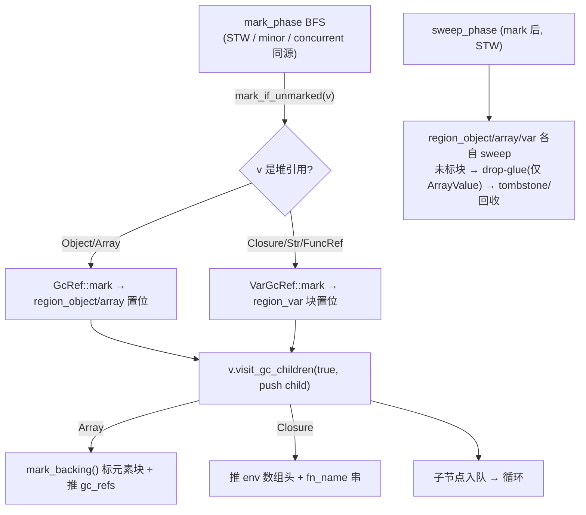

# z42 GC 子系统 —— MagrGC

## 接口形状（嵌入式宿主友好版）

z42 VM 的 GC 抽象由 `crate::gc::MagrGC` trait 定义，全面对齐
[MMTk](https://www.mmtk.io/) `VMBinding` porting contract（OpenJDK / V8 / Julia /
Ruby / RustPython 的事实标准 GC 抽象）。trait 在单文件内按"能力组"组织
~30 个方法，未来如需切割成 sub-trait（参考 MMTk 的 `ObjectModel` /
`Scanning` / `Collection` / `ReferenceGlue` 拆分）切割面清晰。

| 能力组 | 主要方法 | 用途 |
|-------|---------|------|
| 1. Allocation | `alloc_object` / `alloc_array` | 脚本驱动堆分配 |
| 2. Roots | `pin_root` / `unpin_root` / `enter_frame` / `leave_frame` / `for_each_root` | host pin + frame scope + GC scan |
| 3. Write barriers | `write_barrier_field` / `write_barrier_array_elem` | 分代 / 并发模式用，默认 no-op |
| 4. Object Model | `object_size_bytes` / `scan_object_refs` | trace / snapshot 基础设施 |
| 5. Collection | `collect` / `collect_cycles` / `force_collect` / `pause` / `resume` | GC 控制 |
| 6. Heap config | `set_max_heap_bytes` / `used_bytes` | 堆上限 / 用量 |
| 7. Finalization | `register_finalizer` / `cancel_finalizer` | 析构回调（sweep 时触发，或 `Std.GC.Finalize` 显式触发）|
| 8. Weak refs | `make_weak` / `upgrade_weak` | 弱引用 |
| 9. Observers | `add_observer` / `remove_observer` | GcEvent 订阅（Before/After Collect / NearHeapLimit / OOM）|
| 10. Profiler | `set_alloc_sampler` / `take_snapshot` / `iterate_live_objects` | 分配采样 + 堆快照 + 存活遍历 |
| 11. Stats | `stats` | HeapStats 快照（8 字段）|

`VmContext` 持有 `Box<dyn MagrGC>`（与 `static_fields` / `lazy_loader` 同 ownership
模型）；所有脚本驱动分配走 `ctx.heap().alloc_*(...)`；JIT helper 通过
`vm_ctx_ref(ctx).heap().alloc_*(...)` 调用同一接口；嵌入 host 通过同一
`heap()` 入口访问 root / observer / profiler 等所有能力。

命名 **MagrGC** 取自《银河系漫游指南》中的 **Magrathea** —— 那颗专门建造
定制行星的传奇世界，与"管理对象生命周期"主题契合。

## Safepoint 协议

多线程下，GC scanner 通过 `vm_contexts` 注册表
对每个 VmContext 走 raw `frame.regs` / `frame.env_arena` 指针扫 root —— 但 worker
线程同时在跑 interp 指令、改写 regs，构成 Rust 内存模型层 data race。Safepoint
协议引入 stop-the-world 屏障：

```
VmCore {
    gc_phase:     Mutex<GcPhase>,     // Idle / Requested / Marking / ConcurrentMarking
    gc_phase_cv:  Condvar,
    parked_count: AtomicUsize,        // mutator parked 数（不含 collector）
}

enum GcPhase { Idle, Requested, Marking, ConcurrentMarking }
```

**Mutator 侧**：interp dispatch loop 在三类位置调 `crate::gc::safepoint::check_safepoint(ctx)`：

| 位置 | 理由 |
|------|------|
| `exec_function` 入口 | 新 spawn 的 worker 在执行任何指令前先 yield 给未决 GC |
| 后向 branch（`Br` / `BrCond` target ≤ 当前 block_idx）| 循环回边 = 长流程的天然 yield 点 |
| `Call` / `CallIndirect` 返回后 | callee 跑完返回本帧时检查；长 callee 的 GC 请求被父帧捕获 |

fast path（Idle）：一次 Mutex lock + 一次 enum compare。slow path（Requested/Marking）：
`parked_count.fetch_add(1)` + `gc_phase_cv.notify_all()`（唤醒等阈值的 collector）+
`gc_phase_cv.wait()`（等回 Idle）+ `parked_count.fetch_sub(1)`。

**Collector 侧**：`crate::gc::safepoint::request_gc_pause(ctx) -> GcPauseGuard`
RAII guard：

1. 写 `gc_phase = Requested`
2. 循环等 `parked_count >= vm_contexts.len() - 1`（不含 collector 自身），重新读
   `vm_contexts.lock().len()` 每轮以容忍 mid-pause 注册的新 VmContext
3. 写 `gc_phase = Marking`
4. caller 跑 mark + sweep
5. Drop 时写 `gc_phase = Idle` + `notify_all()` 释放所有 mutator

**接入点**：`corelib/gc.rs` 的 `builtin_gc_collect` / `builtin_gc_force_collect`
（即 z42 `Std.GC.Collect()` / `ForceCollect()`）持 RAII guard 调
`heap.collect_cycles()` / `force_collect()`。

**范围**：

| 维度 | 行为 |
|------|------|
| JIT-mode safepoint | JIT translate 在 function entry / backward Br / BrCond / `Call` / `CallIndirect` 返回后共 4 类 site（5 处 call）emit safepoint 检查，与 interp 协议完全对齐；JIT-mode multi-thread workloads 不会死锁。fast path 是 `emit_safepoint_check` 内联的原生 `load+sub+store+brif`（~1-2ns/site），仅 counter 归零走 `jit_check_safepoint_slow` helper |
| Auto-threshold (`maybe_auto_collect`) | Safepoint-aware：trip 时 set `VmCore.needs_auto_collect: Arc<AtomicBool>` flag 而非 inline `collect_cycles()`；同时把每个 mutator 的 safepoint 计数器置 1（`set_safepoint_poke` → `poke_safepoints`）；下个 `check_safepoint(ctx)` 看到 flag 即 safepoint-wrapped collect。flag **粘性**：只读不 swap，由抢到 collector 角色、拿到暂停的那个线程清（`take_collect_request`），抢输的线程不消费它。trait 有默认 no-op `set_external_needs_collect_flag`；ArcMagrGC 内部 `Mutex<Option<Arc<AtomicBool>>>`，VmCore 构造后 wire。flag 未装时 fallback inline（GC 单测路径） |
| 检查频率节流 | Counter-throttled fast path：`VmContext.safepoint_skip: AtomicU32`，`check_safepoint` fast path **普通 load/store 递减**（单写者故 RMW 原子性不必要，且 load/store 可被 JIT 内联为裸 mov）；每 N=1024 次（默认）才走 slow path（Mutex lock + 真正的 phase + auto-collect drain）。`Z42_SAFEPOINT_THROTTLE` env override（设 1 = disable throttling）。`VmContext::force_safepoint()` 公共 API 供 test / embedder 强制下次走 slow path。GC pause latency 上限 = N × 单 iter (~50ns) ≈ 50us，远小于实际 collect 时间 |
| 多 collector 仲裁 | `VmCore.collector_active: AtomicBool` + `request_gc_pause` 返 `Option<GcPauseGuard>`，前置 CAS claim；失败 collector 自动 park-as-mutator 返 `None`。`GcPauseGuard::drop` 释放 collector_active 让下一个 claim 通过。`Std.GC.Collect()` / `ForceCollect()` 在另一 collector active 时静默 no-op（best-effort 语义同 C# / Java） |

多线程 workloads 推荐用显式 `Std.GC.Collect()` 触发；或将 `max_bytes` 配
足够大以避免 auto-collect 在 contended 路径触发。

> GC 是纯 tracing 语义：Rust-local `Value` 强引用**不隐式作为 root**，embedder 必须 `pin_root`
> 显式标记保留对象。finalizer 触发契约见下「Finalizer contract」；自动回收触发见 [GC 调参](gc-tuning.md)。

### GC mode selection

`ArcMagrGC` 支持运行时选择 GC 算法（默认模式与分代模式的旋钮见 [GC 调参](gc-tuning.md)）；
默认模式是 `GenerationalMarkSweep`；`StwMarkSweep` / `ConcurrentMarkSweep` 为可选 opt-in。

**切换方式：**

- **Env var**：进程启动前设 `Z42_GC_MODE=concurrent`（或 `=stw` / `=generational`）。无法识别的值回退到默认模式（generational）并 stderr 警告。
- **API**：运行期调 `heap.set_mode(GcMode::ConcurrentMarkSweep)`。下次
  `collect_cycles_with_context` 起生效；进行中的 collect 完成时仍按原
  模式（per spec scenario）。
- **生产入口**：`safepoint::check_safepoint_slow` 的 auto-collect 路径
  + `Std.GC.Collect()` builtin 都改走 `collect_cycles_with_context`，
  由 heap 内部按 mode 分发。

**当前可选模式：**

| Mode | 描述 | 何时用 |
|------|------|--------|
| `GenerationalMarkSweep`（默认）| 年轻代 minor（O(young) 停顿）+ major；major 默认拆成增量切片，见 [增量 major](gc-incremental-major.md) | 所有 workload |
| `StwMarkSweep` | 一次性停世界跑 mark + sweep | 单线程、对 throughput 敏感 |
| `ConcurrentMarkSweep` | STW root 快照 → mutator 继续跑 + barrier shade → 终止 handshake STW → STW sweep | 多线程 + 对 pause time 敏感 |

**遇到 bug 的回退路径**：`Z42_GC_MODE=stw` 强制走最简单的稳定路径（一代、无分代屏障）。生产报
错优先 fallback STW 看是否复现，把 bug 定位到 concurrent 路径还是更
底层（trait / barrier / safepoint）。

### 自动回收的运行时旋钮

自动回收的 `Z42_GC_*` 旋钮、增长闸门、徒劳退避与 safepoint 三态协议见 [GC 调参与自动回收 / safepoint 协议](gc-tuning.md)。

### Concurrent mark protocol

ConcurrentMarkSweep 模式下 `collect_cycles_with_context` 跑下列阶段：

```text
1. request_gc_pause                    [STW]   collector_active=true, phase=Marking
   ↓
2. snapshot_roots_into_mark_queue       [STW]   pinned_roots + external_scanner → mark + enqueue
   ↓
3. yield_to_concurrent_marking          [STW]   phase=ConcurrentMarking, mutators wake
   ↓
4. drain_mark_queue (collector thread)  [concurrent]   BFS through gray queue;
                                                       mutators run; barriers push gray
   ↓
5. request_handshake_pause              [STW]   phase=Marking, wait for re-park
   ↓
6. drain_mark_queue (residual)          [STW]   catch barrier pushes during handshake race window;
   + close_major_marking                         把各线程 SATB 缓冲里记下的旧值染灰
   ↓
7. sweep_phase                          [STW]   walk registry, free unmarked
   ↓
8. GcPauseGuard::drop                   [STW]   phase=Idle, collector_active=false, mutators resume
```

**Tricolor 不变量**：incremental update（Dijkstra）+ SATB 删除屏障 + allocate-black。
Barrier override（上述 call site）只在 ConcurrentMarkSweep 模式下
shade：写入 heap-ref 时 `mark_if_unmarked(new)`，CAS 成功则 push 到
`mark_queue`。保证 "no black-to-white edge" —— 任何 mutator 写入的
new 都至少是 gray，最终被 collector traced。被覆盖的旧值由写原语里的
SATB 屏障记录（不走 `write_barrier_*` 钩子，见 [增量 major](gc-incremental-major.md)），
周期内新分配的对象直接标黑。

**Termination invariant**：drain 当 queue 空。但 barrier 可能在 STW
handshake 触发**前的瞬间**push 新 gray —— 阶段 5/6 的 handshake →
residual drain 安全捕获。`request_handshake_pause` 等待 mutators
park（同 `request_gc_pause` 模式），park 后所有 mutator 已观察到 phase
= Marking，不会再写 → 此时 queue 空 = 真终止。

**为什么 Relaxed atomic 对 marked bit 仍然安全**：

- 每个 mark 操作是 CAS（atomic + idempotent）—— 多 thread race 时只有
  一个 transitions 0→1，其它返回 false 跳过 enqueue（不会重复 trace）
- BFS 是单调的（一个 cycle 内 mark bit 只从 0 → 1，永远不反向）
- 跨 thread 可见性通过 (a) `parking_lot::Mutex` on mark_queue 的
  Acquire/Release，(b) STW handshake 转换时 `gc_phase` Mutex 的
  Acquire/Release。这两个 sync point 足以建立 happens-before

未来 audit 若移除其中任一 sync point（比如改用 lock-free queue），
必须重新评估 Acquire/Release ordering。

**Phase 状态机**：

```text
STW path (mode = StwMarkSweep):
  Idle → Requested → Marking → Idle

Concurrent path (mode = ConcurrentMarkSweep):
  Idle → Requested → Marking (snapshot) → ConcurrentMarking (drain) →
  Marking (handshake + sweep) → Idle
```

`park_until_idle` 的等待条件从 `!Idle` 改为 `Requested | Marking`
—— ConcurrentMarking 不让 mutator park。

### Finalizer contract

Finalizer **不**在 `GcRef`
出 scope 时触发（`GcRef::drop` 是 no-op，无 refcount）。两条触发路径：

1. **自动**：GC `sweep_phase` 找到 unreachable 对象 → take finalizer →
   触发 → tombstone slot。时机不可控（依赖下次 collect）。
2. **手动**：用户显式调 `Std.GC.Finalize(target)` → 立即 take + 触发
   finalizer → tombstone slot。匹配 .NET `IDisposable.Dispose()` /
   Java `AutoCloseable.close()` 语义。

**RAII 模式建议**：

- 资源类型（文件 handle / socket / FFI handle）暴露显式 `Close()` /
  `Dispose()` 方法；用户主动调用
- 不依赖 finalizer 做"scope exit 立即释放" —— 该模式在 z42 不成立
- finalizer 是 **safety net**（防泄漏），不是即时释放机制

**Strong reference 检测**（design D5）: 显式 `Std.GC.Finalize` 后，
其他 strong reference 之后 `borrow`（经 `GcRef::entry_ref`）会 `assert!`
panic（generation/alive mismatch detection）。该守卫 **debug 与 release 均生效**：用 `assert!` 而非 `debug_assert!`：release 若被编译掉，
slot 被复用后会静默读到**另一个对象**（type confusion）——见 `refs.rs::entry_ref`
的说明。成本仅为一次 `borrow` 阻塞加锁前的两个 `Acquire` 读，可忽略。

### GC heap backing

`ArcMagrGC` 用两个定长 region 持有堆引用对象（变长 payload 见下「变长块堆」）：

- `region_object: Mutex<Region<ScriptObject>>` —— `Value::Object` 后端
- `region_array: Mutex<Region<ArrayObj>>` —— `Value::Array` 后端

`Region<T>` 内部 `Vec<Box<[MaybeUninit<RegionEntry<T>>; 256]>>` chunked
storage —— chunks 是 `Box` 单位故 entry 地址在 chunk 生命周期内**绝对稳定**
（`GcRef::as_ptr` 身份哈希契约的物理基础）。Alloc 走 free-list pop 优先
（reuse tombstoned slot，preserve bumped generation）+ bump pointer。

`GcRef<T>` 是 8B 的标记指针 handle（64 位：低 48 位 `RegionEntry<T>` 地址 + 高 16 位 generation 快照；32 位：`{ptr, gen}`）：
- Clone = memcpy 8 字节，**零原子 op**（相对 `Arc::clone` 每次
  `fetch_add` 2-4 ns）

#### type_desc / type_args 免锁读取

`ScriptObject.type_desc` 和 `type_args` 是 write-once-at-alloc 字段
（`alloc_object` 写入 type_desc；`ObjNew` 写 type_args 都发生在 GcRef
escape 之前），运行时其余地方**不可变**。读取它们走的是 `GcRef<ScriptObject>`
上新增的 lockless accessor：

- `GcRef::type_desc(&self) -> &TypeDesc`
- `GcRef::type_desc_arc(&self) -> &Arc<TypeDesc>`（需要 clone Arc 时用）
- `GcRef::type_args(&self) -> &[String]`

实现原理是 `parking_lot::Mutex::data_ptr()` 暴露的 `*mut T`：跳过 `lock()`
直读 UnsafeCell 内部。Safety 锚定在 "type_desc / type_args 永不 mutate"
的全局 invariant（`grep -rn '.type_desc *=' src/runtime/` 0 命中验证）。

为什么值：每次 PIC / IsInstance / IcCall 都要读 type_id，Mutex lock 即使
uncontended 也是 ~5–10 ns 的 atomic CAS。lockless 后变成 3 条 native load。
对照 CoreCLR `MethodTable*` 在 `ObjHeader` 固定偏移 / HotSpot `klass*` 在
`oopDesc` 头部——属于业界成熟模式。

`borrow()` / `borrow_mut()` 路径不变：slots / native 仍 mutable，必须
走 Mutex。仅 type_desc / type_args 这两个 immutable 字段走 lockless。
- Drop = no-op（无 refcount）
- borrow / borrow_mut 走 `RegionEntry.value: Mutex<T>` 阻塞 lock
  （同并发模型）
- `ptr_eq` 比 NonNull + generation（stale-vs-fresh 区分）
- `as_ptr` 返回 entry 内 `Mutex<T>` 稳定地址

**WeakGcRef** 同 handle shape + generation snapshot。`upgrade` 检查
`alive && generation matches` —— ABA-safe：被 tombstone 后即使槽位
重用，generation 也 mismatch 不会假阳性 upgrade。

**Sweep 路径**：`sweep_phase` 直接 walk `region_object` + `region_array`
的 `iterate_alive`；找 unmarked `is_marked() == false` → 取 finalizer
（mutex take）→ 触发 finalizer → tombstone（alive=false, generation++,
push free_list）。region
就是 authoritative liveness store（无 `heap_registry`）。

**生命周期契约**：`GcRef` 不能 outlive 它所指 `Region` 所属的
`ArcMagrGC`。z42 现有架构所有 GcRef 都活在 VmContext 范围内，契约
天然满足。Embedder 需注意 drop order。

### 变长块堆：统一变长 payload 到单一 GC 堆

定长 `Region<T>` 只能存**定长头**（`ScriptObject` / `ArrayObj`）；string 的字节、
closure 的 `ClosureData`、array 的元素后端若各自在 GC **外**（手写 thin-Arc /
`Box` / 外部 `Vec`），会两套内存管理并存。这三类变长 payload
因此全部收进 GC，达成 CLR/JVM 式的**单一堆**（为将来移动/压缩/去重 GC 铺路）。

**分配器方向 = A'（变长块 region）**：第三个 region
`region_var: Mutex<VarRegion>`（[`gc/var_region.rs`](https://github.com/z42-lang/z42/blob/main/src/runtime/src/gc/var_region.rs)），
与 `region_object` / `region_array` 并列、同一 mark/sweep cycle 回收。一个变长对象 =
**单块 `{GcBlockHeader, inline payload…}` 单次分配**（等价原 thin-Arc 的紧凑度，但纳入 GC）。

```
VarRegion 变长块（16B 对齐原始 chunk + 四分之一八度 size-class free-list + oversized 专用块）
┌──────────────── GcBlockHeader (16B, repr(C,align8)) ────────────────┐┌── payload (8B 对齐) ──┐
│ generation │ size │ marked │ alive │ type_tag(BlockType) │ size_class ││  inline bytes / [T;n]  │
└─────────────────────────────────────────────────────────────────────┘└───────────────────────┘
   ▲ VarGcRef = type-erased 8B 标记指针（low48 地址 + high16 gen；wasm32 用 {ptr,gen}）
   payload 指针必须从原始 NonNull 派生（D8：绝不经窄 &GcBlockHeader reborrow → SB UB）
```

**BlockType 分派**（`var_drop_glue`，注入 region 让 `var_region.rs` 保持纯字节分配器）：

| BlockType | payload | 消费者 | drop-glue |
|-----------|---------|--------|-----------|
| `Str` | inline UTF-8 | `Value::Str` / `FuncRef`（8B 细指针，**不可变叶子**，trace 无出边）| POD，无 |
| `Closure` | 一个 `ClosureData{env: GcRef, fn_name: Str}` | `Value::Closure` | **POD，无**（fn_name 是 GC Str，闭包全 POD）|
| `ArrayPrim` / `ArrayStruct` | 紧凑 `[T;n]`（packed 基元 / struct[] 字节区）| `ArrayObj` backing | POD，无 |
| `ArrayValue` | inline `[Value;n]`（Boxed 数组 / struct[] refs 侧表）| `ArrayObj` backing | **唯一需 finalizer**：drop 每个 `Value` |

**分配落地 = ambient 堆**（[`gc/ambient.rs`](https://github.com/z42-lang/z42/blob/main/src/runtime/src/gc/ambient.rs)）：`current_heap()` +
`HeapGuard` 在 `exec_function`（interp 每帧）/ `jit::run_fn`（JIT 顶层）设 thread-local，
`Str::new`/`.into()` 走活堆分配 → **~189 处 `.into()` 站点零改动**；无堆上下文（无 VM 的单测）
回退 `alloc_leaked`。避免了「188 处线程穿透 `&heap`」的侵入式改造（D11）。

**堆 epoch（per-heap 单调标识）**：每个 `ArcMagrGC` 构造时从全局
`AtomicU64` 领一个**永不复用**的 `epoch`（`MagrGC::heap_epoch()`），`HeapGuard` 把它随
`current_heap` 一起装进 thread-local（`current_heap_epoch()`，热路径只多一个 `u64` 读）。
用途：**给「按 GC 块地址索引、但生命周期长于单个堆」的 thread-local 缓存做作用域**。典型即
`corelib/str_meta` 的字符元数据缓存——它跨 `VmContext` 拆毁存活；旧堆拆毁后 `VarRegion` 的
chunk 内存还给系统 malloc，新堆可能在**同一地址**重分配块，且 bump 新块 `generation` 归零，
于是旧堆遗留条目（同址、同 gen=0）会**假命中**返回错误串长（wasm32 上线性内存密集复用地址 →
`"".Length==13` 类串味；`is_live` 的 gen 守卫只防同 region 内复用，防不住跨堆）。epoch 单调 ⇒
换堆必变 ⇒ 缓存整清 ⇒ 复用地址永不被误判为旧堆的活条目。

**融合拼接分配 `alloc_str_concat2(a, b)`**：字符串 `+`
（IR `StrConcat` / `Std.String.Concat`）若走 `alloc_str(&format!("{a}{b}"))` 是**两次堆分配**
（中间 `String` + GC 块）+ interp 侧还各 clone 一份操作数（`str_val`）共 **4 次分配 / 3 次 O(n) 拷贝**。
`MagrGC::alloc_str_concat2`（[`gc/heap.rs`](https://github.com/z42-lang/z42/blob/main/src/runtime/src/gc/heap.rs)，`ArcMagrGC` 覆写
`alloc_str_concat2_in_region`）按 `a.len()+b.len()` **一次性**分配 `BlockType::Str` 块、直接拷入两段，
**降到 1 次分配 / 1 次拷贝**（两段皆合法 UTF-8 → 拼接合法）。interp `str_concat`/`Add` 字符串臂借
`&str` 直传、JIT `jit_str_concat` helper 同步。产出字节相同。热字符串 workload 实测 mimalloc 压力
减半、拼接密集环 ~1.3× interp。

**驻留串 = lazy per-context interning**（D-lazy）：加载期无堆 → 不物化；首次 `ConstStr(idx)`
经 `VmContext::intern_const_str(module, idx)` 用活堆分配 + 缓存进 `interned_cache`
（`(module ptr, idx)` 键），缓存项经 external root scanner 注册为 **GC root**。

**mark/trace 统一到单一访问器**：`Value::visit_gc_children(for_marking, visit)` 是
mark 阶段与 heapsnapshot/retention 枚举的**单一来源**，二者仅在两条 mark 副作用轴上不同
（`mark_backing` 标变长元素块 + 闭包是否 surfaced env 头/fn_name），由 `for_marking` 参数统一；
`trace_children`（`for_marking=true`）/ `scan_object_refs`（`false`）退化为薄委托。



**safepoint = 几乎免费**（关键去风险，D-safepoint）：`maybe_auto_collect` 在 wired VmCore 下**只置
`needs_auto_collect` 标志、延到 `check_safepoint` 才 collect**（默认 `max_bytes=None` 全不
auto-collect）→ GC 从不在单条指令/builtin 的 Rust 执行中途运行 → 临时 string 落寄存器前天然安全
（frame regs 已被 root scanner 扫），与既有 Object/Array 临时值同一不变式。

**权衡**：纳入 GC 换掉 Arc/Box 的**确定性释放** → 浮动垃圾↑、内存峰值↑；
收益是**架构统一 + 为移动/压缩/去重 GC 铺路**，非短期性能。实测 string-heavy 吞吐反而 **1.76× 更快**
（消除原子 refcount：Clone=8B 拷贝、Drop=no-op），峰值 RSS +13%（默认不 auto-collect 累积）。

### Write barrier contract

`MagrGC` trait 包含两个 write-barrier 钩子：

```rust
fn write_barrier_field(&self, owner: &Value, slot: usize, new: &Value);
fn write_barrier_array_elem(&self, arr: &Value, idx: usize, new: &Value);
```

trait 默认实现（含 `ArcMagrGC` STW mark-sweep）是 no-op；分代 / 并发模式 override 为
card-marking / shade 真实逻辑。**call-site wiring + 调用契约**与模式无关（no-op 实现下仅
`#[cfg(test)]` 时 dispatch 到 test-only `BarrierObserver`）。

**Caller 契约**（interp `field_set` / `array_set`、JIT `jit_field_set` /
`jit_array_set`）:

1. **Filter at call site**: 只在 `new.is_heap_ref()` 时 invoke barrier。
   Primitive (`I64 / F64 / Bool / Char / Str / Null / FuncRef / PinnedView /
   StackClosure / Ref::Stack`) 写入 skip — 这些既不参与 cross-region 引用
   也不参与 cross-generation 引用，barrier dispatch 是纯浪费。`is_heap_ref()`
   是 `Value` 上 inherent 方法，与 `trace_children` 平行：一个判定，一个遍历。
2. **Post-write order**: barrier 在 slot/elem 写之后调用。card-marking
   自然 fit；需要看 *旧* 值的 SATB 删除屏障不走这两个钩子，放在写原语里
   （见 [增量 major](gc-incremental-major.md)）。
3. **Lock released before call**: 调用前 `drop(borrowed)` 释放
   `owner.slots` / `arr` 的 inner-`Mutex` lock，让未来 override 可以
   re-borrow `owner` 而不死锁。
4. **IC fast path 也 dispatch**: FieldSet 的 inline cache 命中路径也必须
   走 barrier，否则未来 generational/concurrent 在 hot code 漏写 → mark
   queue 不完整 → UAF。这条规则在 `interp::field_set` /
   `jit_field_set` 内 inline 多个写入点都加了 dispatch；六个写入点对应六个
   `write_barrier_field` call（fast + slow + 无-IC，interp 和 JIT 各一套）。
5. **StaticSet 不 dispatch**: static fields 是 GC root，"old → new"
   写永远在 root，不存在 cross-region/cross-generation 关心的场景。

**Override 契约**:

- 实现可以 `debug_assert!(new.is_heap_ref())` 检测 caller 是否漏 filter
- 不能假设 `owner` 持有 inner-`Mutex` lock；可以自由 `owner.borrow()` /
  `owner.borrow_mut()`（caller 已 drop）
- default no-op 不修改 `HeapStats`；这条契约保留下来意味着
  pure-tracing / generational override 也不应改 `HeapStats`（stats 反映
  alloc/free，不反映 barrier dispatch 次数）

> **这条契约有两个消费者**：卡表不变量（「老对象的年轻子节点
> 一定能从脏卡集合到达」）被 minor BFS 依赖（所以它**不把老年子节点入队**），也被增量 major 的
> 周期根集依赖：周期的灰队列 / SATB 队列播种给 minor 时**只播种年轻条目**，老条目靠卡表覆盖。
> ⇒ 任何削弱 barrier 覆盖面的改动（漏一个写入点、给某类条目免掉卡）会同时打断两处，
> 而**只有后者要等增量 major 周期打开时才现形**。见 [增量 major](gc-incremental-major.md)。

### Debug invariants

多个 GC 算法叠加带来大量数据结构 invariant
（young_list ⇔ gen_age 一致、free_list ⇔ alive=false、card_dirty 长度
与 chunks 一致、mark_queue 在 cycle 外为空、sweep 后无 stale mark
bit、entry.location 与实际位置吻合等）。这些 invariant 由 debug-
only 验证器在每次 collect 末尾检查；release 构建完全编译掉。

**两层 API**：

- [`Region<T>::validate(&self) -> Result<(), Violation>`](https://github.com/z42-lang/z42/blob/main/src/runtime/src/gc/region.rs)
  —— per-region check，返回结构化 `Violation` 让 test 通过模式匹配确
  认期望的 invariant 被触发
- [`ArcMagrGC::debug_validate_invariants(&self)`](https://github.com/z42-lang/z42/blob/main/src/runtime/src/gc/arc_heap.rs)
  —— panicking wrapper，由 collect 路径在 cycle 完成后调用；任何
  violation 立即 panic + 详细消息

**9 个 Region 级 Violation 变种**：

| Variant | 触发条件 |
|---------|---------|
| `OldEntryInYoungList` | young_list 含 gen_age ≥ 晋升年龄的 entry |
| `YoungEntryNotInList` | alive young entry 未出现在 young_list |
| `DuplicateInYoungList` | young_list 同一 (ci, ei) 出现多次 |
| `AliveSlotInFreeList` | free_list 含 alive=true 的 slot |
| `FreeChunkIndexDrift` | `free_chunks` 与 `free_slots` 不一致（chunk 重复登记 / 空桶仍登记 / 非空桶未登记）|
| `FreeSlotCountDrift` | `free_len` 与各桶实际数量漂移 |
| `LocationMismatch` | `entry.location` 不等于实际 (ci, ei) |
| `CardDirtyLengthMismatch` | `card_dirty.len() != chunks.len()` |
| `YoungIndexMismatch` | `young_list[i]` 指向的 entry 自记的 `young_idx` 不等于 `i` |

**2 个 heap 级检查**（panic-only，无 Violation enum）：

- mark_queue 必须在 cycle 外为空（concurrent mark drain 必须完整；
  非 concurrent mode 该 queue 从不写）
- 没有 alive entry 携带 marked=1（sweep 必须清 survivors 的 mark）

**触发时机**：

- `collect_cycles` 尾部（StwMarkSweep + GenerationalMarkSweep default）
- `collect_cycles_with_context` 的 ConcurrentMarkSweep 分支末（pause Drop 后）
- `collect_cycles_with_context` 的 GenerationalMarkSweep 分支末

每次都包在 `#[cfg(debug_assertions)]` 里 —— release 构建（cargo build
--release）整段编译消除，零 production overhead。debug 构建 + cargo
test 自动启用。

**怎么加新 invariant**：

1. 在 `Violation` enum 加新 variant + `Display` impl 分支
2. 在 `Region::validate` 加检查（first-violation-returned 模式）
3. 在 `region_tests.rs` 写 `validate_detects_xxx` test（故意 corrupt
   state → 断言匹配 variant）
4. 跑 `cargo test --lib gc::` —— 现有 GC 算法**不得违反**新
   invariant；若违反就是 latent bug，必须修

**测试方法**：

- Healthy path：构造典型 workload + 跑 collect + 隐式 invariant 检查
  通过（在 `arc_heap_tests/invariants.rs` 的 healthy tests）
- Corruption path：手动注入违反 state + `#[should_panic(expected = "...")]`
  验证 validator 抓到（同文件 corruption tests）

**cost 实测**：验证器对 `cargo test --lib gc::` 耗时的影响
< 5%。Validate 是 O(N) per collect；典型
collect 时间 µs–ms 数量级，O(N) 检查不显著。

### Stress testing

Random-workload stress driver on top of the C1 validator. Hand-rolled
xorshift64 PRNG（self-contained, no crate dep），每个 test 用固定 seed
+ 2000 iters 默认。每次 `force_collect` op 后 C1 invariant 自动验证。
失败的 panic message 嵌入 seed + iter index + op，便于复现。

**4 个 tests** (in `arc_heap_tests/stress.rs`):

| Test | Mode | Seed | 默认 iters |
|------|------|------|-----------|
| `stress_seeded_stw_short` | StwMarkSweep | 42 | 2000 |
| `stress_seeded_concurrent_short` | ConcurrentMarkSweep | 0x1234 | 2000 |
| `stress_seeded_generational_short` | GenerationalMarkSweep | 0xC0DE | 2000 |
| `stress_seeded_mode_switching_short` | 全部循环 | 0xBEEF | 3000 |

**9 op 类型** + weighted distribution：alloc_object / alloc_array
(~30%)、field/array writes (~25%，60% heap-ref → 触发 barrier)、
pin/unpin (~25%)、force_collect (~5%)、set_mode (~5% in
mode-switching test only).

**Bounded pool**：state.objects capped 200 entries 防 OOM；
ForceCollect 后用 `iterate_live_objects` 重建 state.objects（pre
mark-sweep contract: Rust-local Values 不是 roots → unpinned 在
collect 后失效；重建后续 ops 不触碰 stale handles）。

**Reproducible failure replay**：

```bash
# Replay specific seed
Z42_STRESS_SEED=12345 cargo test --lib stress_seeded_stw_short

# Longer local run (10x iters)
Z42_STRESS_ITERS=20000 cargo test --lib gc::arc_heap::arc_heap_tests::stress
```

**Coverage gates**：每个 test 完成后 assert min op counts (≥100 allocs,
≥100 writes, ≥50 pins, ≥50 collects)，防止 op weights drift 导致
silent regression。

**价值**：stress 能抓到 concurrent 的 no-VmContext `force_collect` 路径下，barrier
留下的 mark 状态破坏 STW mark_phase 的 "clean slate" 假设一类缺陷（trace_children 漏 mark
子节点 → 子节点被 swept → 下次 collect 经过 slot 触发 use-after-finalize panic）；
STW 入口因此防御性清空 `mark_queue`。

**cost 实测**：4 个 stress tests 总耗时 < 1s in debug (cargo test)。
2000 iters × O(几十次 collect with O(N) validator) × O(state ops) =
几十毫秒。可接受。

### Pause histogram

每次 collect 测量的 `pause_us` 逐事件只对挂了 `GcObserver` 的 host
可见；为提供"过去 10000 次 collect 的 p95 是多少 / concurrent
比 stw 是不是真的更短"这种聚合视角，`ArcMagrGC` 自维护一个
**固定 8 桶对数直方图** + min / max / total / count，每次
`collect_cycles` / `collect_cycles_with_context` (concurrent +
generational arms) / `force_collect` 末尾、`AfterCollect` event 前
调一次 `record(pause_us)`。

桶边界（半开区间 `[lower, upper)`，微秒）：

| i | 范围                       |
|---|----------------------------|
| 0 | `[0, 10) µs`               |
| 1 | `[10, 100) µs`             |
| 2 | `[100 µs, 1 ms)`           |
| 3 | `[1, 10) ms`               |
| 4 | `[10, 100) ms`             |
| 5 | `[100 ms, 1 s)`            |
| 6 | `[1, 10) s`                |
| 7 | `[10 s, ∞)` (catastrophic) |

**从 script 端读取**：

```z42
using Std;

long[] buckets = GC.PauseHistogram();      // 8 elements
long[] raw     = GC.PauseStatsRaw();       // [min, max, total, count]
long count     = raw[3];
if (count == 0) {
    // No collect recorded yet — min_us is u64::MAX sentinel; skip.
}
```

**对比不同 GcMode** —— 直方图跨 mode 切换累积（不重置）。Diff
模式间分布：

```z42
long[] before = GC.PauseHistogram();
GC.Collect();                              // warm up new mode
// ... 若干 collect ...
long[] after = GC.PauseHistogram();
// after[i] - before[i] 是新 mode 下该桶的新增 collect 计数
```

**O(1) record 成本**：bucket lookup 是 7 个比较的 unrolled loop，
加上一次 `Mutex<PauseHistogram>` lock + 4 saturating add。每次
collect 已经是 µs–ms 级别，多这 ~ns 级别 overhead 可忽略。Mutex
没替成 atomic — record 一次/collect 不在热路径，Mutex 简化保留。

**Empty sentinel**：`min_us = u64::MAX` when `count == 0`，区分
"没 collect 过" 与 "0 µs collect"（sub-µs collect round 到 0 是
valid）。Script 端 / 消费端先检 `count == 0` 再读 `min_us`。

**局限**：

- 固定 8 桶：用户读 p50/p95/p99 时只能粗略到桶（"p95 落在
  [10, 100) ms"），不是精确分位数
- 单一直方图聚合所有 mode：要 per-mode 比较只能 diff before/after
  `set_mode`
- 无 SLA hook：不能 "pause > 100ms 时 log warning"

#### Rolling window

为补足 cumulative 直方图不滚动的局限，`PauseHistogram` 也维护一个
**rolling FIFO window**（`VecDeque<u64>`，容量默认 1024，env
`Z42_GC_PAUSE_WINDOW` 覆盖 clamp 到 `[1, 65536]`）。每次
`record(pause_us)` 在 push_back 时若 deque 已满则先 pop_front
最老样本 → 总保留最近 N 次。

**从 script 端读取**：

```z42
using Std;

long cap = GC.PauseWindowCapacity();   // e.g. 1024
long[] recent = GC.RecentPauses();      // 最近 cap 次，oldest first
long mostRecent = recent[recent.Length - 1];
// → 自己算 p50/p95/p99 over window
```

**用途**：长跑 server 监控近期 pause 趋势 —
cumulative histogram 把"过去几周 30 万次 collect"全平摊，单一 spike
看不出来；rolling window 让你看清"最近 1000 次"分布。Script 端
diff `RecentPauses()` 与上次调用结果也能算 incremental
（"过去 1 分钟新增的 pause 都长啥样"）。

### Heap snapshot export

`Std.GC.WriteHeapSnapshot(path)` 把当前堆的对象引用图导出到 `path`
指定的文件，使用 V8 `.heapsnapshot` JSON 格式。Chrome DevTools
(Memory → Load)、[speedscope](https://www.speedscope.app)、
[heapviewer.com](https://heapviewer.com) 都能直接打开。

实现走 `gc/snapshot.rs` two-pass walker：

```
pass 1: iterate_live_objects → assign V8 node ids (odd 2k+1), emit NodeRecs
pass 2: for each node, scan_object_refs → emit Property / Element EdgeRecs
pass 3: for_each_root → emit Shortcut edges from synthetic root (id=0)
```

**节点 / 边类型映射**：

| z42 来源 | V8 节点 / 边类型 | name 字段 |
|----------|------------------|-----------|
| `Value::Object(gc)` | node `object` (3) | `TypeDesc.name` |
| `Value::Array(gc)` | node `array` (1) | `"Array[{len}]"` |
| pinned roots 集合 | node `synthetic` (9) | `"(GC roots)"` |
| object slot `i` → obj | edge `property` (2) | string of `fields[i].name` |
| array elem `i` → obj | edge `element` (1) | 数字下标 `i` |
| root → obj | edge `shortcut` (5) | empty string |

**从 script 端使用**：

```z42
using Std;

long bytes = GC.WriteHeapSnapshot("/tmp/snap.heapsnapshot");
// → bytes 是写入的 JSON 字节数
// → 文件用 Chrome DevTools Memory → Load 直接打开
```

**V8 JSON 形状**：nodes 是 flat `[type, name, id, self_size, edge_count,
trace_node_id, detachedness, ...]` 每 node 7 字段；edges 是 flat
`[type, name_or_index, to_node, ...]` 每 edge 3 字段；string-table
dedup；`trace_function_infos` / `trace_tree` / `samples` / `locations`
v1 输出空数组。10 MB heap → 约 30 MB snapshot 文件（V8 char-count
overhead 内）。

**序列化实现**（v1）：

`builtin_gc_write_heap_snapshot` 通过 `serialize_v8_heapsnapshot_to<W:
Write>` 流式直写 `BufWriter<File>`，无中间 `String` 内存分配。
`serialize_v8_heapsnapshot(&snap) -> String` 作为薄包装（`Vec<u8>`
驱动流式路径）供测试和内存场景使用，输出字节完全相同。

**局限**：

- 不输出 allocation-site stack trace（需要 IR `alloc_site_id`，依赖下面的 B4）
- WeakRef 不出现在 graph（避免与 retention 混淆）；后续可加 `EdgeType::Weak`
- 不预算 dominator tree（DevTools 自己算）；server-side 预算可加速

### OOM 异常（strict 模式）
- alloc 失败抛 `Std.OutOfMemoryException`（脚本 `try/catch` 可捕获），替代 strict 模式返 `Value::Null`
- 理由：脚本端 OOM 处理更自然；当前返 Null 后续访问产生 NRE，丢失"why null"信息
- **实现要点**：
  - `Std.OutOfMemoryException`（`z42.core/src/Exceptions/OutOfMemoryException.z42`）
  - `exec_object.rs`：`obj_new` alloc 后 Null 检测 → `make_oom_exception`
  - `exec_array.rs`：`array_new` / `array_new_lit` 同样 OOM 检测
  - `exec_call.rs`：`mk_clos` env alloc OOM 检测；double-OOM 防卫（disable strict 再 alloc exception 对象）
  - `GC.SetMaxHeapBytes(n)` / `GC.SetStrictOOM(b)` 两个 builtin 暴露给脚本
- **未覆盖**：JIT 路径 `jit_obj_new` / `jit_array_new` 暂不注入 OOM 检测；详见下文 Deferred 段

### 软引用（SoftHandle）
- 内存压力下 GC 可主动回收的引用，介于 strong 与 weak 之间
- 用于缓存场景（"内存够则保留，紧张则丢弃"），无需手动 weak + 重建
- **实现要点**：
  - `SoftRegistry`（`gc/soft_registry.rs`）：类型擦除的 `Vec<ErasedSoftEntry>`（region entry 指针 + generation 快照）；mark 之后、sweep 之前跑 revive pass
  - 压力判定：`used_bytes / max_heap_bytes >= soft_threshold` 时不复活、软目标按普通对象被回收；低于阈值则复活。`Z42_GC_SOFT_THRESHOLD` 控制阈值（默认 0.80）；`max_heap_bytes == 0`（无限）时软引用永不清除
  - 2 个 builtin：`__soft_handle_create(target: object) -> SoftHandle`；`__soft_handle_get(self) -> object`
  - `Std.SoftHandle` 类（`z42.core/GC/SoftHandle.z42`）暴露给 z42 脚本
  - 原子值（int / string / bool）无法被软引用；`Create(atomicVal)` 返回 `Get()` 始终 null 的句柄
  - **复活必须 trace 子对象（不变量）**：压力低于阈值时 revive 不仅要 mark 软目标本身，还要把它**入灰队列继续 trace**——否则仅经该目标可达的字段 / 数组 backing 块（后者存于 `region_var`，只由目标的 `trace_children` 标记）在随后的 sweep 被回收，留下悬垂 `GcRef`（release UAF / debug `generation/alive mismatch`）。**三条收集路径都要满足**：增量 major 走 `revive_soft_refs_into`（push 进 mark 栈），STW / one-shot-major 走 `revive_soft_refs`（push 进 `mark_queue` 后 `drain_mark_queue`）。回归测试 `stw_softref_revive_keeps_the_targets_children`；**新增收集路径必须同时接这条不变量**。
- **延后**：泛型 `SoftRef<T>`（待 L2 泛型落地）—— 详见 [Deferred 段](#softref-generic-upgrade)

## 字符串脚本化的未来动机

> string 的**字节存储**已纳入单一 GC 堆
> （`Value::Str(VarGcRef)`，`BlockType::Str` 变长块，见上「变长块堆」节）。下面这个更远的目标（把 `string` 做成 `Value::Object` 包装的脚本类）尚未实施，
> 但 string 已是 GC 对象，内存管理层的障碍已扫清。

GC 成熟后，字符串可以从 `Value::Str` primitive 进一步
迁移成 `Value::Object(...)` 包装的脚本类（z42 源码实现 BCL `String`），
届时 z42 源码可承担更多 string 方法实现，进一步减少 Rust 端硬编码 builtin。

## GC 后续迭代规划

> 下面是**未实施**的可选优化轨道，按需启动独立 spec。每条提供 **What / Why / Deps / Size / Risk** 四元组，
> 让接手者不用读源码就能判断 ROI。

### B4. 分配站点追踪（per-callsite alloc count + total bytes）
- **What**：默认 alloc_sampler 实现按 IR 站点 ID 聚合分配数据
- **Why**：定位"哪行代码在 hot allocate"，性能调优刚需
- **Deps**：编译期注入 site ID（IR 加 `alloc_site_id` 字段 + Codegen 配合）
- **Size**：~400 LOC，3-4 天
- **Risk**：site ID 在 IR 持久化、跨 zpkg 唯一性

### D1. MMTk 后端实现
- **What**：实现 [MMTk](https://www.mmtk.io/) `VMBinding` trait，把 `ArcMagrGC` 替换为 MMTk-backed GC（多 collector 可选：SemiSpace / GenImmix / MarkSweep / Immix / GenCopy）
- **Why**：MMTk 是工业级研究项目，被 OpenJDK / V8 / Julia / Ruby / RustPython 采用；享受 ~30 年 GC 算法成果
- **Deps**：自定义 allocator 与 mark-sweep tracing 基础已就位；trait 形状已对齐 MMTk porting contract
- **Size**：4-8 周（包括稳定 + benchmark）
- **Risk**：高 —— 引入大型 crate 依赖；ABI 边界 careful；但 trait 抽象层可以 ABI-shield

---

## Deferred / Future Work

### softref-generic-upgrade: 泛型 `SoftRef<T>` 升级

- **触发原因**：L1 无泛型；当前 `SoftHandle.Get()` 返回 `object`，调用方需手动向下转型
- **前置依赖**：L2 泛型落地（`SoftRef<T>` 才能类型安全地返回 `T?`）
- **触发条件**：L2 泛型稳定后
- **当前 workaround**：`SoftHandle.Get()` 返回 `object`，调用方 `as T` 向下转型

### gc-oom-jit-path: JIT 路径 OOM 检测

- **触发原因**：JIT helper `jit_obj_new` / `jit_array_new` 直接调用 `heap.alloc_object` / `heap.alloc_array`，未经 interp OOM 检测分支；JIT 路径下 OOM 目前仍返回 `Value::Null` 触发 NRE
- **前置依赖**：JIT 路径稳定后；需要 JIT helper 能安全调用 `ctx.set_exception`（当前 JIT 生成代码不访问 `VmContext` exception slot）
- **触发条件**：JIT 路径全面覆盖时，或首次报告 JIT 路径 OOM-related NRE 时
- **当前 workaround**：`strict_oom` 模式下 JIT 路径 alloc 失败仍抛 `Value::Null`；interp 路径已完整处理
