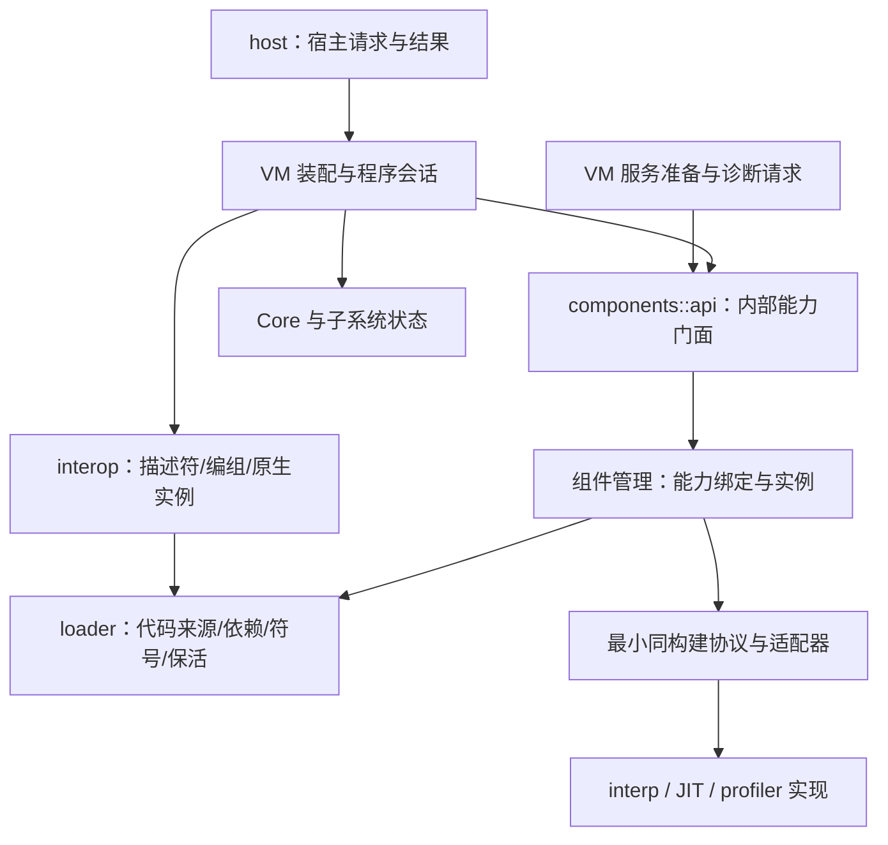

# 运行时模块边界

> 代码：`src/runtime/src/`、`src/runtime/crates/`
> 相关：[组件化运行时](componentized-runtime.md)、[VM 总体架构](vm-architecture.md)、[嵌入机制](embedding.md)
> 待办：组件管理公开面与来源模型尚未收口，默认 VM 装配仍位于 host；目标结构未全部实施。

## 概述

目录已经分开，但可见性、状态所有权和访问入口仍跨越目录边界。组件管理属于 VM 内部设施；
普通宿主表达加载、执行模式和诊断请求，VM 使用统一能力接口，具体组件通过装配适配器接入。
文件名与这些职责对应，消费者不感知实现文件移动或组件改名。

## 设计目标与约束

区分三种接口：普通宿主契约、VM 内部访问门面、同构建组件间协议。它们的受众、版本约束与可见性不同。
`components::api` 是 crate 内部能力门面；同构建 C 协议位于 `components::abi`，核心身份/布局桥位于 `components::bridge`。
components 命名空间只公开同构建必需的 abi/bridge 子模块，内部 api 和管理子模块不对 crate 外开放，host 不转出协议符号。
独立 interp/JIT/profiler crate 所需的最小协议仍需跨 crate 可见，但不通过 host 提供，也不包含通用组件管理实现。

当前实际状态与目标分开描述；实施顺序在仓库 roadmap 中维护。收口保持 GC 根、写屏障、暂停协议、
代码租约、VM/worker 身份及明确请求失败的行为；不靠静默降级、兼容别名或逐指令动态查询消除表面引用。

## 方案与决策

### 已封闭的访问边界

VM 程序准备、执行角色查询和分析请求通过内部 `components::api`。基线/优化角色绑定由每 VM 的组件注册表保存，
先验证提供方存在、角色唯一及接口版本/大小/对齐，再创建实例；消费者不传 interp/JIT 的组件 ID。
附着返回成功但未登记所需引擎仍失败。执行循环继续使用准备时注册的引擎，不逐指令查询组件表。

支持性查询只核对目标能力，候选查询只读路径与已装入映像缓存；Android 未知的裸库名不会因查询触发装入。
显式准备仍可交给系统加载器按名称装入并校验。独立后端对核心模块使用私有导入，不再通过自身批量再导出。

对象协议定义在 object/protocol.rs，以不透明的上下文/错误类型参数连接提供方，不引用 exec/context 实现。
每 VM 的协议表由 Core 保存，worker 借用同一份不可变服务；exec 只保留托管 ToString 调用、异常与字符串物化。
独立执行组件经同构建 bridge 读取服务，协议表不拥有 VM/托管值，也不增加逐指令注册表查询。

通用代码映像由 loader/code 装入、缓存与保活，组件和独立 native 库共用，不解释消费者 ABI。
默认 native 路径归 loader/native_paths，host 为独立库提供路径时不再经过 components。
PAL 保留底层开库与符号原语；组件层只持有 loader 代码句柄和组件契约/实例依赖。

main.rs 只依赖 std/libloading，加载 libz42 的 z42_main_v1。命令行参数和环境由 Core 中 cli feature 下的私有 main_command/main_startup 处理，通过 host 的 VM 接口运行程序；不新增 CLI 目录或公开 Rust CLI API。入口无 Rust 参数，由库读取本进程 OS 参数并返回退出码。SDK 只有 bin/z42vm，native 不安装额外 exe。
一次性 run_app 接收模式、VFS、搜索目录和 resolver 等功能输入，在 host 内部构造 LoadedProgram 的加载请求，
不把历史 LoadOptions 中的组件管理状态扩散到该接口。环境、相对路径、搜索默认值由来源适配解析，
加载服务不读取 CLI probing 设置或隐式补目录。

### 当前可核对的缺口

context 只负责共享 Core 与线程视图的组合、布局、构造和生命周期。缺符号裁决已归 exec/exception，
异常交接直接归 ThreadExecState，静态默认值物化归对象执行层；不能将托管异常/GC 分配搬入纯 metadata。
剩余 lookup 的加载编排、frames 的执行/GC 暂停协作、observation 的计数聚合依次按所属服务拆分，
不把带有完整 VmContext 的 impl 块分散到其它目录当作解耦完成。

| 缺口 | 代码证据 | 影响与目标 |
|---|---|---|
| host 仍转出组件管理 | `host/mod.rs` 的具名管理类型/按 ID 查询再导出 | 普通宿主可感知管理选项、ID 与租约；从普通宿主面移除 |
| 公开签名传递管理状态 | `host/program.rs::LoadOptions` 的 components/backends/profiler 字段；`LoadedProgram::context` 可访问 Core（组件槽 getter 仅 crate 可见） | 仅删除再导出无法封闭可达面；将功能请求与 VM 装配输入分开，注册槽由组件所有者维护 |
| C 静态装配混入普通宿主头 | `include/z42_host.h` 的 Z42ComponentId、ComponentInit 与 `z42_host_register_static_component`；`host/ffi.rs` | 静态链接胶水必须同轮迁移到明确的内部部署/装配契约，不能只隐藏 Rust 名字 |
| 通用管理查询仍泄露实现身份 | host 转出的 `component_interface(ctx, ComponentId)`；`components::abi::RuntimeApi` 的跨组件依赖查询 | VM 执行消费者已按语义角色请求服务；普通 host 的按 ID 管理查询仍需移除，协议内依赖 ID 由管理层拥有 |
| 使用形态分类不完整 | `components/catalog.rs::Registration` 只有 Static/Dynamic，`components/backends.rs::BackendSource` 的 Linked 只查询已登记入口，Dynamic 走显式开库 | 分开静态链接、链接动态库和运行时装入；记录实际来源，按运行时策略核对，不能只改枚举名字 |
| 配置与装配输入仍未完全显式 | `config/availability.rs` 查询 components；`loader/native_paths.rs`、`components/api.rs::attach_execution` 读取 runtime_config | 默认路径已归 loader；后续在装配入口捕获路径/JIT 配置及平台能力，管理实现消费显式输入 |
| 诊断契约反向拥有装配机制 | `diagnostics/sampling.rs` 保存 BackendSource、VmComponents 并触发 attach；`components/profiling.rs` 回到 sampler 注册实现 | 诊断保留观察/采样接口，组件管理拥有能力/实例并持有 loader 代码句柄；经窄接口绑定，避免新增 Core 自持有环 |
| 默认 VM 装配由 host 承担 | `host/program_builder.rs`、`vm_defaults.rs`、`extensions.rs`；`host/artifact.rs` 为 LazyLoader 实现构造方法 | host 解析请求，VM 装配层负责配置快照、Core/loader、组件和发布；loader 的构造实现回归其所有者 |
| 普通宿主与 C 适配尚未分开 | `host/ffi.rs/config.rs/state.rs/ops.rs/marshal.rs` | CLI 已归 cli 适配且平台构建可排除；后续 C 适配/头文件归能力所有者，host 保留功能请求/环境服务契约 |
| 初始化层级含混 | `host/state.rs` 的会话保存多个 LoadedProgram；`ops::build_host_module` 每次创建程序/VM；`LoadedProgram::invoke` 执行一次性托管初始化 | 区分会话、VM/包准备与托管初始化，不把 C initialize 当作所有模块已初始化；统一装配但保持隔离和失败终态 |
| 进程策略混入每 VM 输入 | `config/vm_config.rs::process_loh_bytes` 在 Core 构造时修改进程级 LOH 设置 | 进程 bootstrap 与 VM 设置分开捕获，禁止任意 VM 构造改写其它 VM 可见的全局策略 |
| loader 与 interop 混合机制和编排 | `loader/native.rs` 调 interop 注册/解析，`interop/module.rs` 反向调用 loader::native::resolve_symbol | loader 提供代码/符号来源，interop 负责描述符与编组；由装配协调器连接 |
| 元数据解析直接驱动 VM 加载 | `metadata/resolve.rs` 接收 VmContext，enqueue_type_load/drain_pending_type_loads | 将解析事实与加载编排分开，用最小解析视图和待加载请求连接 |
| 对象表示反向依赖执行和加载域 | `object/value/ref_word.rs::alloc_box_ambient` 访问 exec::ambient；`object/object/object.rs::NativeData` 引用 loader 身份；`object/types/type_desc.rs` 引用 metadata TypeId | 抽出身份/布局词汇，分离编码与需堆的装箱操作；保留屏障协议，不把 object/GC 的必要协作当成可直接删除的依赖 |

这些是源码中的具体依赖，不是 Cargo 生产依赖环的证明。生产 core 不依赖具体后端，测试 dev-dependency 和
测试门面的内联路径另行统计。Rust import 的简单文本扫描还会漏掉分组导入、别名和宏，并误收测试/注释；
架构检查需要结合可见性、实际消费者和构建配置。

### 目标访问关系（未全部实施）


```mermaid
flowchart TD
    H[host：宿主请求与结果] --> V[VM 装配与程序会话]
    V --> A[components::api：内部能力门面]
    E[VM 服务准备与诊断请求] --> A
    A --> M[组件管理：能力绑定与实例]
    M --> L[loader：代码来源/依赖/符号/保活]
    M --> P[最小同构建协议与适配器]
    P --> I[interp / JIT / profiler 实现]
    V --> N[interop：描述符/编组/原生实例]
    N --> L
    V --> C[Core 与子系统状态]
```

图中的箭头表示准备/访问流程；具体组件通过协议回调注册能力，不表示 core 在 Cargo 中链接具体实现。
执行热路径在准备阶段获得 Engine 等能力，后续直接调用已绑定接口。组件门面不成为转出全部 VM 类型的新总括模块。

仅将 `backends::attach` 换成 `api::attach(INTERP_COMPONENT)` 仍会泄露具体实现身份，不能达到实现透明。
目标接口按执行角色、堆快照、CPU 采样等稳定能力请求服务；管理层将其绑定到选定提供方与版本，
再在内部使用组件 ID 构造依赖闭包和实例。基线与优化引擎属于不同语义角色，即使接口形状相同也不会混选。
未配置的多提供方歧义与能力缺失均显式报错；能力查询仍不触发绑定、装库或创建实例。

组件实例间的语义依赖决定创建/销毁顺序；代码/外部依赖的装载由 loader 处理。普通 Rust/Cargo 依赖已在构建时组合，
不因拆成 crate 而增加运行时加载。三类 crate 的实际接入关系见[组件化运行时](componentized-runtime.md#1-库边界)。

### host 与初始化收口方向（尚未实施）

main.rs 已直接动态链接共享 Core；参数解析、环境和相对路径是该宿主的实现，C 绑定和其它平台也消费同一 VM 服务契约。
同构建 Rust 宿主使用 Rust 接口；需要 C 互操作的边界才使用版本化 C 布局/回调，不跨 C ABI 传 Rust trait 对象。
VM 组合层提供单一准备流程，平台适配只转换输入，不复制模块初始化和包加载实现：

```text
CLI/C/Rust 输入 → 功能请求与配置快照 → 入口 zpkg/依赖解析及验证
→ Core/环境服务 → 元数据链接 → loader 准备代码 → components 绑定/实例
→ 发布已加载程序 → 首次调用的一次性托管初始化 → invoke
```

C initialize 当前建立进程单例宿主会话，不等于创建一个承载所有顶层模块的 Core；每个 LoadedProgram 仍拥有自己的 VM。
上述收口保留这一隔离行为和初始化失败终态，后续若改变生命周期需单独定义行为契约。C 句柄表、编组、线程错误通道归 C 适配，
参数来源/进程退出/hooks 归 CLI 宿主，Core 构造与服务/模块准备归 VM。C 导出及 .h 随实际能力所有者维护，SDK include 只聚合分发。

### 状态与协议归属

| 所有者 | 保存/提供 | 消费者需要什么 |
|---|---|---|
| host | VM 宿主功能请求与环境服务契约 | 功能级请求与结果，不是组件注册表、CLI 实现或 C 句柄表 |
| VM 装配层 | 构造输入、启动顺序和失败发布边界 | 接受显式配置及服务，产生可调用程序 |
| components 管理实现 | 能力到提供方的绑定、工厂缓存、实例依赖闭包、每 VM 实例及 loader 代码句柄 | 内部 api 的准备/能力查询；不让消费者传实现 ID，不返回可修改的 OnceLock，不保存映像缓存 |
| exec / diagnostics | 引擎与观察/采样的消费契约 | 装配时绑定的接口；不决定组件库路径或具体实现 |
| 同构建协议层 | 描述符、版本、身份、接口表及最小桥接 | 仅给 VM 与组件适配器；不是普通宿主 SDK 扩展面 |
| loader / interop | loader 拥有代码来源/装载依赖/符号/保活；interop 拥有描述符/编组/原生实例 | 窄接口与 VM 装配连接，不互相承担完整装入事务 |
| object / GC / threads | 表示、屏障、分配、暂停与根协议 | 共享必要数据契约，通过回调适配，逐步减少实现穿透 |

## 实现

### 文件命名与职责映射

同名并不自动等于重复实现：PAL 的 unix/windows/wasm 文件是同一契约的平台镜像，保留对称命名。
下表是职责收口后的候选名，未改名的文件仍在左列路径；最终名称随对应抽象同轮确认，不先制造兼容转发层。

| 当前文件/文件组 | 实际职责 | 候选名称/拆分方向 |
|---|---|---|
| host/config.rs、corelib/core/config.rs、gc/config.rs、JIT config.rs | C 宿主配置、托管查询、GC 输入、JIT 输入 | host_abi_config.rs、runtime_config_builtins.rs、gc_config.rs、jit_config.rs |
| host/state.rs、interop/state.rs | 宿主会话；原生模块/类型/buffer 状态 | host_session.rs、native_resources.rs |
| threads/state.rs、loader/state.rs、exec/state.rs、metadata/state.rs | mutator、加载、执行、链接状态 | mutator_state.rs、loader_state.rs、execution_state.rs、link_state.rs |
| 四处 builtins.rs | 组装提供方、声明导出、名称目录、执行派发 | builtin_registry_builder.rs、core_builtin_descriptors.rs、builtin_symbol_catalog.rs、builtin_dispatch.rs |
| components/backends.rs | 来源选择、平台发现、初始引擎注册表 | source/discovery 按职责拆分；装配协调由内部 api 拥有，同构建协议位于 components::abi |
| loader/native.rs、exec/native.rs | 原生库装入/注册；native 调用服务 | native_library_loader.rs、native_module_registration.rs、native_call_services.rs |
| host/profiling.rs、components/profiling.rs | 宿主诊断请求；profiler 装配 | diagnostic_requests.rs、profiler_attachment.rs |
| object/protocol.rs、exec/ops/stringify.rs | 对象能力契约；托管调用/默认文本物化 | 定义与执行桥已按所有者分开；继续检查 exec/ops 中布局/存储事实与执行编排的混合 |
| host/load.rs、program_builder.rs、vm_defaults.rs | 包准备、程序/VM 装配和默认策略 | 职责先迁到 VM 装配层，再按 program_preparation、vm_assembly、default_services 命名 |
| vm.rs | Core、线程视图和布局偏移 | 按 vm_core、vm_context、context_layout 拆分，保持布局约束 |

`*_config`、`*_policy`、`*_registry` 等后缀表达不同职责。目录本身已足够限定的局部文件不为全仓唯一名机械改名；
对外引用面收口后，具体实现文件重命名只影响其模块声明、适配器和同目录测试。

### 对象相关文件的归属判定

相似文件名需要按实际执行职责判断，不能把带 object/struct 名称的代码整体归入表示层：

| 实际入口 | 源码中的职责 | 整理方向 |
|---|---|---|
| `object/protocol.rs` | 不拥有状态的四个能力回调 | 已归 object；Core 持有绑定，corelib 提供实现，exec 消费 |
| `exec/ops/object/field.rs` | 槽/名称读取、派发缓存、pin 视图和带屏障写入 | 表示/字段位置来自 object；执行视图和屏障编排保留执行层，后续抽取纯存储部分 |
| `exec/ops/object/array.rs` | 数组读取/写入、类型实参解析、帧 arena 分配 | 元素编码/布局归 object；泛型解析、arena 和执行错误保留 exec |
| `exec/ops/object/struct_leaf.rs` | 布局查询、快照、装箱分配和写屏障 | 纯布局已在 object/types/named_struct_layout；显式堆/屏障服务可再抽象，不把 VmContext 依赖搬入 object |
| `exec/ops/structs.rs` | 当前帧 struct 分配、拆箱、复制及布局解析 | arena 生命周期与 frame_id 校验归 exec；布局事实通过只读查询提供 |
| `exec/ops/object/error.rs` | OpError 到托管异常的物化 | 保留执行层；对象存储层返回自己的错误事实，不构造 VM 异常 |
| `exec/ops/scalar.rs` | 算术、比较、转换和指令错误判据 | 保留执行语义；输入是 Value 并不足以证明属于 object |

`lib.rs` 的 `objops` 仍是 `exec/ops/object` 的转出路径。后续整理同时收口真实所有者与消费者，
避免长期维护多个路径；删除旧入口时连同后端、corelib、测试和文档迁移。

## 边界与限制

本页描述当前缺口和目标，不表示公开面已被封闭或架构检查已实现。当前 host、组件模块和后端仍有上表所列公开路径。
普通宿主 API 收口涉及 Rust 签名、C 静态装配头、launcher/workload 胶水与真实 SDK 消费者，需同轮迁移和验证。
GC/对象、线程/执行及元数据共享的数据契约需要单独建模，不能通过把全部目录改为私有或抽一个万能 trait 修复。

核心 builtin/provider 描述归 corelib，通用不可变目录归 interop，host 不再拥有 builtins 登记表。独立模块在首次限定调用时才经 loader 解析自描述入口，interop 校验并登记；lib.rs 的已链接入口清单仅表达链接事实，不在初始化时执行。动态 Core 不依赖 compression 的声明 crate，loader 的静态登记接受任意有效逻辑名，不写死库名单。

VM 组合为单文件 vm.rs，context 目录已删除。帧/arena/异常使用 ThreadExecState，包加载查找使用不持有 VmContext 的 RuntimeLoader，静态存储使用 StaticFields，初始化执行使用 Initialization。计数汇总归 DiagnosticsState，注册与注销归 ThreadState；vm.rs 只提供组合、生命周期和借用。

组件消费 VM 上下文和布局事实的稳定位置为 components::bridge，interp/jit/profiler 不引用 vm 实现路径。bridge 只列出实际类型与常量，不把整个实现模块改名导出。静态初始化失败沿 exec 屏障的异常结果传递，不另设无人写入的全局错误槽；构造缓存纪元直接由 metadata 提供，不经过 loader 的空转发。
