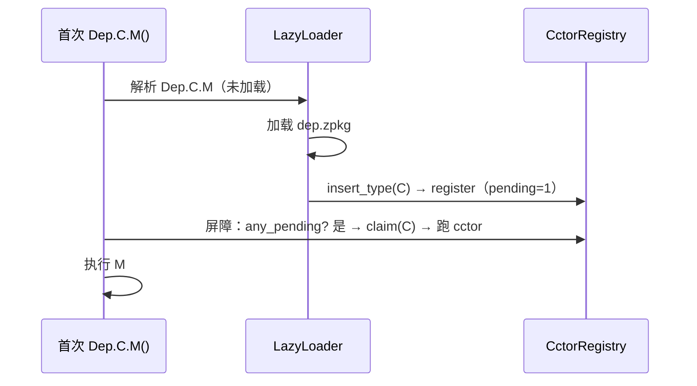
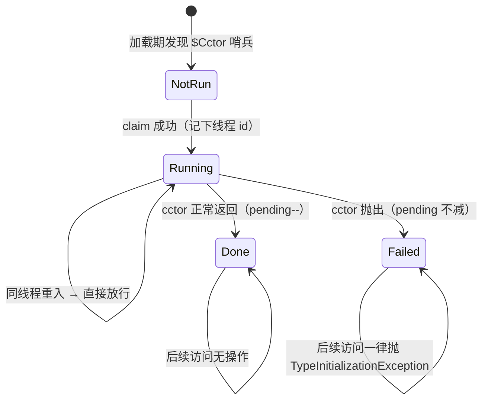

# 静态构造函数的按类型初始化

> 语义面见[静态构造函数](../../../book/src/language/static-constructors.md)。本页讲实现。
> 代码：`src/runtime/src/vm_context/cctor.rs`；启动路径共用步骤 `src/runtime/src/boot.rs`。
> 对齐：2026-09-14（fix-host-static-init）。

## 为什么不能照抄 C#

C# 的静态构造器屏障之所以「零成本」，是 **JIT 在类型初始化完成后把检查从机器码里 patch 掉**。

z42 的 JIT **没有代码 patch / 失效机制**——`FnEntry` 一旦 `OnceLock::set` 就永久有效，
无 deopt、无重编译。所以屏障只能是「每次访问都检查」，问题就变成**怎么让这个检查便宜**。

## 怎么让屏障几乎免费

用一个无锁计数 `cctor_pending`（「还没跑完的静态构造器类型数」）当门：

```rust
if any_pending() { ensure_type_init(...) }   // 热路径的全部代价
```

- 程序里**没有**静态构造器 → 计数恒 0 → 屏障就是一次 relaxed load
- 有静态构造器 → 只在它们**跑完之前**付查表代价；**全部跑完后计数归零、屏障重新免费**

「无锁镜像只用于 `== 0`（可证无事可做）方向」不是新发明——旁边的
`pending_type_init_count` / `running_static_inits` 用的是同一套手法。

> ⚠️ **失败时计数不减。** 失败的类型必须让门继续开着，否则屏障短路、`Failed` 分支
> 永远检查不到，失败类型会**静默变回可用**。代价是一旦有类型初始化失败，门就长期开着
> ——那已是致命错误路径，正确性优先。

## 登记点：必须早于第一次使用

门只统计**已登记**的类型，所以「登记」必须发生在任何人能用到该类型之前；否则门读到 0，屏障被整个跳过。
登记点只有两处，都是「类型进入可见范围」的那一刻：

| 类型从哪来 | 登记点 |
|---|---|
| 主程序 + 急切合并的依赖 | 模块合并后扫一遍 type registry |
| 惰性加载的依赖包（zpkg 文件 / 内存模块） | `LazyLoader::insert_type`——**入表即登记**，两条加载路径共用这一个入口 |

加载器持有同一份 `Arc<CctorRegistry>`，在自己的写锁内登记。锁顺序固定为「加载器写锁 → registry 互斥锁」，
registry 的任何方法都不会反过来访问加载器，因此没有死锁。

**屏障必须放在「解析被调函数」之后。** 对依赖包的第一次静态调用，正是在解析这一步才加载包、登记类型的；
屏障若在解析之前检查门，这一次读到的仍是 0。interp（`exec_call::call`）与 JIT（`jit_call`）都按
「解析 → 屏障 → 派发」排列。静态字段没有这个问题：字段名在函数首次执行时预解析，预解析就会加载所属包。



> 历史（fix-crosspkg-static-call-cctor）：惰性类型原先只在 `try_lookup_type` 登记，屏障也在解析之前。于是
> 「依赖包类型的第一次使用是调静态方法」时 cctor 不执行——连带注入其体首的静态字段初始化器也不执行——而且
> 结果随「之前有没有别的类型被查过」而变。
>
> 代价：已加载但从未使用的 cctor 类型会让门常开（此后每次静态访问多一次查表）。急切路径一直如此；标准库与
> 编译器里没有静态构造器，代价只落在真正写了静态构造器的用户代码上。

## 状态机



## 触发点与共用实现

| 触发 | interp | JIT |
|---|---|---|
| 静态字段读 / 写 | `exec_object::static_get/set` | `jit_static_get/set` |
| 创建实例 | `exec_object::obj_new` | `jit_obj_new` |
| 静态方法调用 | `exec_call::call` | `jit_call` |

**两个后端调的是同一份实现**（`ensure_static_owner_init` / `ensure_callee_owner_init` /
`ensure_type_init`）。这不是洁癖：两后端语义一致正是本特性最容易出错的地方，各写一份迟早
漂移。开发期就吃过一次——JIT 侧一度完全没有屏障，而**用户代码默认走 JIT**（只有
`__static_init__` 被强制走解释器），于是默认模式下静态构造器根本不跑。

`ObjNew` 手上已有 `TypeDesc`，所以那里**不需要门**——`td.cctor_func()` 一次
`Option` 判断就结束。

## 编译期怎么把信息传过来

类带静态构造器时，编译器在**类级 attr-ref 块**挂 `$Cctor` 哨兵，载荷是 cctor 的**发射
函数名**（FQ）。零格式 bump（先例 `$Deprecated`）——`class_flags` 是 u8 且已用满 8 位，
没有空位可用。

载荷带函数名而不只是个布尔，是为了让运行期**不必按约定拼名**：编译期命名与运行期拼名
两处规则一旦分开写就会漂移。

`build_type_registry` 是**所有**模块（急切 + 跨包惰性）的统一漏斗，在那里读一次哨兵、
把函数名放进 `TypeDesc` 冷区，就不必给每个 type-registry 插入点各挂一遍钩子。

> ⚠️ **静态 ctor 的发射名必须与实例 ctor 区分开。** 静态 ctor 的 `RegKey` 与**无参实例
> ctor** 逐字相同（都是 `C$0`），`new C()` 查 0 参构造器会命中静态 ctor 并把它当实例
> 构造器再跑一遍。发射名因此改用 `$cctor`（`$` 非法于标识符 → 零撞名）。
> 但**只能改发射名**——`methKey` 还兼作 SemanticModel 的体查找键（body 按 RegKey 存），
> 两者一起改会让函数根本不发射。

## 字段初始化器去了哪

**有**静态构造器的类，其静态字段初始化器由编译器从按编译单元的 `__static_init__` 移出、
注入该类静态 ctor 的**体首**——这样「字段初始化器在前、cctor 体在后」的 C# 顺序才成立。

两者若分处两个函数，cctor 被触发时 `__static_init__` 可能还没跑完，会出现
「cctor 写了 42、随后 `__static_init__` 又覆写回 1」的错值。

**没有**静态构造器的类保持原样（继续走按编译单元的急切初始化）——这本来就合规，
且让屏障的代价只落在真正用了静态构造器的类型上。

## 谁来跑 `__static_init__`：两条启动路径共用一份启动步骤

跑 z42 代码有两条入口：

- **`app::run`**：`z42vm` 二进制、`z42_run_app`、wasm `runTestApp`；
- **宿主 API**：`z42_host_load_zbc` → `z42_host_invoke`（C ABI / `z42-host`，iOS / Android / wasm 的
  `loadZbc` + `invoke` 都走它）。

两者合并模块的方式相同，但合并**之后**的启动步骤原先各写一份：宿主那份是早年从 `app::run` 抄的，
此后新增的步骤只进了 `app::run`。结果宿主路径**从不执行**合并进来的包（z42.core、用户模块本身）的
`__static_init__`，带初始化器的静态字段读出的是类型默认值——而且不报错：`static_get` 读到空槽后，
`verify_static_field` 按字段类型补了个 `0`。症状最早在 wasm 上看到（`OSKind.Wasm` 为 0 ⇒
`Platform.IsWasm()` 恒假），实际所有嵌入都中招（fix-host-static-init，2026-09-14）。

现在合并后的步骤只有一份，在 `src/runtime/src/boot.rs`：

| 函数 | 做什么 | 谁调 |
|---|---|---|
| `boot_context` | `available!` 折叠 → `VmContext::with_module` → 登记静态构造器 → 装 lazy loader + 种类型 / impl | `app::run`、宿主 `build_host_module` |
| `prepare_execution` | 预分配 FuncRef 槽 + `resolve_module` | `Vm::run`、宿主 `build_host_module` |

**静态字段初始化本身仍由调用方决定时机**，因为两边的「程序」形状不同：

- `Vm::run`：进入 `Main` 之前跑一次 `init_static_fields`；
- 宿主：**每个模块在首次 `invoke` 时跑一次**，放在宿主 stdout sink 守卫内（初始化器的输出也送到宿主）。
  `init_static_fields` 会先清空全部静态字段，所以绝不能跑第二次——结果存在 `HostModule.static_init`
  （`OnceLock`）。失败是**粘滞**的：之后每次 invoke 都报同一个错，而不是在半初始化的静态状态上继续跑。
  每次 invoke 结束后还要取一次 `take_static_init_error`（本次调用中首次触达、惰性加载的包的初始化失败），
  与 `Vm::run` 一致；两处都归为 `Z42HostStatus::VmException`。

> 新增启动步骤时，加进 `boot.rs`，两条路径自动都有；别再只改 `app::run`。
> 回归测试：`host::host_tests::invoke_sees_initialized_static_fields`（stdlib 包与用户模块各一个带初始化器的静态字段）。

## 已知差距

跨线程等待未实现：他线程正在跑某类型的 cctor 时，本线程直接放行而非阻塞，可能看到部分
初始化状态。C# 保证阻塞到完成。不做的原因是在持有解释器帧时阻塞极易与既有静态初始化排空
逻辑（`DRAINING` / `init_batch_inflight` 那套）互相死锁。
